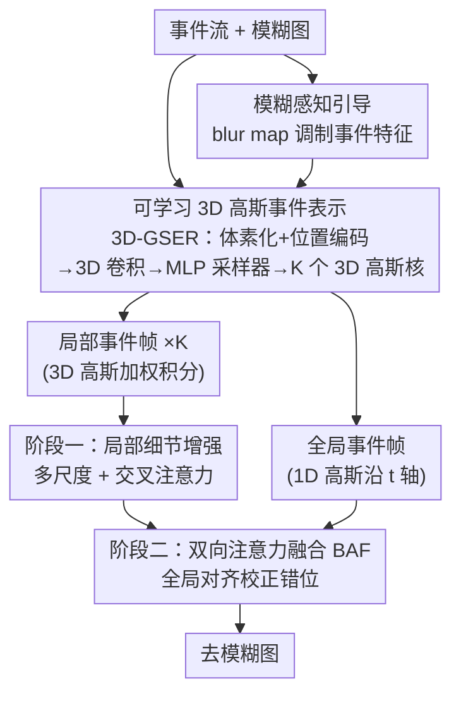

# Event-Based Motion Deblurring Using Task-Oriented 3D Gaussian Event Representations

**会议**: CVPR 2026  
**论文**: [CVF Open Access](https://openaccess.thecvf.com/content/CVPR2026/html/Cho_Event-based_Motion_Deblurring_with_Unpaired_Data_CVPR_2026_paper.html)  
**代码**: 无  
**领域**: 图像恢复 / 事件相机去模糊  
**关键词**: 运动去模糊, 事件相机, 3D 高斯事件表示, 自适应采样, 双向注意力融合

> ⚠️ 本笔记基于缓存全文撰写。缓存正文标题为 *"Event-Based Motion Deblurring Using Task-Oriented 3D Gaussian Event Representations"*（作者来自北京工业大学/东南大学/南开大学），与 stub 文件名/CVF 链接里的 "with Unpaired Data" 不符，且全文未涉及"无配对数据"主题。**以正文实际内容为准**；若 CVF 链接对应的是另一篇论文，需另行核对。

## 一句话总结
针对事件相机去模糊里"手工固定权重核无法适应空间各异的运动速度/方向"这一痛点，本文提出一个**可学习的 3D 高斯事件表示模块（3D-GSER）**——根据模糊图内容和事件密度自适应地采样关键时空坐标、用 3D 高斯核聚合事件成帧，再配合**两阶段融合**（局部细节增强 + 双向注意力做全局对齐），在 GoPro / HS-ERGB / REBlur 三个数据集上全面超过 SOTA。

## 研究背景与动机

**领域现状**：事件相机以微秒级时间分辨率，在普通 RGB 帧之间捕获丰富的运动信息，且事件主要沿物体边缘触发，天然适合辅助运动去模糊。但事件流稀疏、结构不规则，无法直接和 RGB 融合，主流做法是先用**手工固定权重核**（fixed-weight kernel）把稀疏事件点聚合成连续的"事件帧"，再喂给恢复网络。代表性方案是 Event Voxel Grid：沿时间轴把事件分成 N 个 bin，用固定双线性插值聚合。

**现有痛点**：真实场景里事件分布高度不均匀、运动速度/方向差异巨大。慢运动产生稀疏事件、需要**更长的时间积分窗口 T** 才能积累出清晰边缘；快运动产生稠密事件、需要**更短的 T** 否则边缘会被积分得过厚。固定权重核既不能给事件稠密区分配合适权重，也会在稀疏区生成低质量表示，导致同一帧内不同区域质量割裂，运动信息被白白浪费。

**核心矛盾**：事件表示的"积分核形状/积分窗口"应当随**样本（不同场景）、随空间位置（同一帧不同区域）**自适应变化，而手工核是一套参数走天下，缺乏 sample adaptivity。

**切入角度与核心 idea**：把"事件如何聚合成帧"从手工设计变成**可学习、且面向去模糊任务（task-oriented）**的过程——用 3D 高斯核去自适应地框选时空局部区域，核中心 $\mu$ 决定关注哪段时空、协方差 $\Sigma$ 决定关注范围与各维耦合，从而对不同方向/速度的非线性运动场做精细建模。一句话：**用可学习的 3D 高斯加权核替代固定权重核，让事件表示自己学会"在哪儿、用多宽的窗口"去积分**。

## 方法详解

### 整体框架
输入是一段事件流 + 一张模糊图（作为先验引导），输出是去模糊后的清晰图。整体分三段走：① 把事件体素化并加 3D 位置编码，用模糊图生成的 blur map 调制事件特征，经深度可分离 3D 卷积编码出全局时空特征；② 用一个多分支 MLP 采样器（受点云方法 SampleNet 启发）从全局特征预测 K 个 3D 高斯核（每个核一组 $\mu,\Sigma$），用这些核把事件自适应聚合成 K 张局部事件帧，同时另用一个仅沿时间轴的 1D 高斯核生成一张全局事件帧；③ 两阶段融合：第一阶段用局部事件帧通过交叉注意力增强细节，第二阶段用 1D 高斯全局帧经双向注意力融合（BAF）校正空间错位、对齐结构。

### 关键设计

**1. 可学习 3D 高斯事件表示模块（3D-GSER）：让事件表示自己学会在哪积分、积多宽**

这是全文核心，直接针对"固定核不能适应空间各异运动"的痛点。事件流先被表示为离散事件集 $\{(x_i,y_i,t_i,p_i)\}_{i=1}^N$（坐标归一化到 $[0,255]^3$，极性 $p_i\in\{0,1\}$ 正负分开处理）。模块定义 $K$ 个基于 3D 高斯分布的积分核，第 $k$ 个核由均值 $\mu_k=(x_k,y_k,t_k)$（关注中心）和协方差矩阵 $\Sigma_k$（关注范围 + 各维耦合）参数化：对角元 $\sigma_{xx},\sigma_{yy},\sigma_{tt}$ 决定各维注意宽度，非对角元 $\rho_{xy},\rho_{xt},\rho_{yt}$ 刻画局部非线性运动场里 x/y/t 三维的耦合。每个事件在第 $k$ 个核下的权重为

$$w_i^k=\exp\left(-\tfrac{1}{2}\,\Delta_i^\top \Sigma_k^{-1}\Delta_i\right),\quad \Delta_i=(x_i-x_k,\;y_i-y_k,\;t_i-t_k)^\top.$$

随后把加权事件投影到 2D 空间网格成事件帧 $E_k(u,v)=\sum_i w_i^k\,\delta(x_i-u)\delta(y_i-v)$；正负极性各产生 $K$ 帧，共 $2K$ 帧沿通道堆叠。**关键在于 $\mu_k,\Sigma_k$ 不是手工设定而是预测出来的**：事件流先转成 3D 计数直方图 $V(x,y,t)$，取 log 压缩后拼接连续 3D 位置编码 $E(x,y,t)=2(t/D,x/W,y/H)-1$，经 $L$ 层深度可分离 3D 卷积（DW→PW→BN→GELU）提特征，再全局平均池化得 $F_{global}$，最后多头 MLP 采样器 $(\mu_k,\Sigma_k)=\text{Sampler}(F_{global})$ 为每个核预测中心和协方差。这样核就能"该宽则宽、该窄则窄、该往哪偏就往哪偏"，对慢/快运动自动调整等效积分窗口，避免固定 T 在稀疏区欠积分、在稠密区把边缘积厚。

**2. 模糊感知引导（blur-aware guidance）：让表示模块知道哪儿模糊得更狠**

事件聚合若对全图一视同仁，会在严重退化区缺乏针对性。本文用一个轻量卷积块从模糊图 $I_b$ 生成 blur score map $S_b=\sigma(\text{Conv}(I_b))\in[0,1]^{H\times W}$，高亮严重模糊区域；广播到体素域后用可学习标量 $\alpha$ 调制事件特征 $\tilde V_{guided}=\tilde V+\alpha S_b$。这让 3D 高斯核的采样更偏向"任务真正需要修复的退化区"，是"task-oriented"的体现。消融显示加入 blur map 后 GoPro PSNR +0.10 dB。

**3. 两阶段融合 + 双向注意力融合模块（BAF）：先补细节，再校全局错位**

3D 高斯核只关注局部时空区域，捕到的是局部运动场，不同核因时间轴坐标不同、生成的局部事件帧之间会有**空间错位**，直接融合会出 ghosting。本文设计两阶段融合（基于 EFNet）：**第一阶段**用多尺度交叉注意力把 K 张局部事件帧的细粒度运动线索与图像纹理融合，主攻细节恢复；**第二阶段**额外用一张 1D 高斯（仅沿 t 轴）全局事件帧提供全局边缘位置线索，喂给 BAF 做全局对齐。BAF 的机制是：图像特征 $I$ 与事件特征 $E$ 各经归一化 + $1\times1$ 卷积 + GELU 后送入 SE 块算通道注意力 $A_I=\text{SE}(I),A_E=\text{SE}(E)$，再逐元素调制 $F_I=I\odot A_I,\;F_E=E\odot A_E$，拼接后 $1\times1$ 降维、过 FFN 并残差相加。双向（图像←→事件互相加权）让全局结构对齐、抑制鬼影。消融里加入 BAF 后 GoPro PSNR 从 36.61 提到 36.76 dB。

> 此外有一个易被忽略的细节——**极性湮灭（polarity annihilation）**：正负极性事件在累加成帧时会相互抵消，导致边缘鬼影/质量下降。本文对正负事件分开处理（各出 $K$ 帧），从源头规避该问题。

### 损失函数 / 训练策略
单卡 RTX 3090、PyTorch，直接在 GoPro-ESIM（ESIM 模拟事件）上从零训练，无预训练。输入裁成 $256\times256$ patch、事件流同步切分，batch=4，AdamW（$\beta_1=0.9,\beta_2=0.99$），初始 lr $2\times10^{-4}$，cosine annealing（$T_{max}=400\text{K}$ 迭代），数据增强为随机旋转/翻转。HS-ERGB 与 REBlur 上用 GoPro 预训练模型微调 4K 迭代、lr $2\times10^{-5}$。

## 实验关键数据

### 主实验
三个数据集（合成 GoPro / 半合成 HS-ERGB / 真实 REBlur），FLOPs 按 $224\times224$ 估计。本文在三者上 PSNR 全部第一，分别比此前最好高 **0.16 / 0.62 / 0.15 dB**。

| 方法 | 模态 | GoPro PSNR/SSIM | HS-ERGB PSNR/SSIM | REBlur PSNR/SSIM | Params(M) | FLOPs(G) |
|------|------|------|------|------|------|------|
| NAFNet (ECCV22) | RGB | 33.71 / 0.967 | 27.64 / 0.811 | 36.15 / 0.969 | 67.8 | 96.8 |
| EFNet (ECCV22) | RGB+Event | 35.46 / 0.972 | 26.68 / 0.800 | 38.12 / 0.975 | 8.5 | 153.9 |
| MAENet (ECCV24) | RGB+Event | 36.07 / 0.976 | 27.93 / 0.812 | 38.47 / 0.978 | 13.9 | 149.7 |
| SepNet (ICCV25) | RGB+Event | 36.70 / 0.977 | – | 38.53 / 0.977 | – | – |
| **本文** | RGB+Event | **36.86 / 0.977** | **28.55 / 0.813** | **38.68 / 0.977** | 16.7 | 172.6 |

### 消融实验

模块有效性（基线用 Voxel Grid 表示）：

| 配置 | Blur Map | BAF | 3D-GSER | GoPro PSNR | REBlur PSNR |
|------|:---:|:---:|:---:|------|------|
| Baseline | × | × | × | 36.13 | 38.01 |
| A | × | × | ✓ | 36.51 | 38.37 |
| B | ✓ | × | ✓ | 36.61 | 38.41 |
| C | × | ✓ | ✓ | 36.76 | 38.53 |
| D（完整） | ✓ | ✓ | ✓ | **36.86** | **38.68** |

不同事件表示对比（GoPro，统一 bin/核数量）：

| 表示 | 类型 | PSNR | SSIM |
|------|------|------|------|
| Voxel Grid | 手工 | 36.13 | 0.9719 |
| SCER | 手工 | 35.95 | 0.9711 |
| DA | 手工 | 36.09 | 0.9713 |
| EST | 可学习 | 35.86 | 0.9704 |
| LETC | 可学习 | 35.84 | 0.9710 |
| **3D-GSER** | 可学习 | **36.51** | **0.9751** |

### 关键发现
- **3D-GSER 是涨点主力**：仅换上本文表示（Baseline→A）GoPro 就 +0.38 dB、REBlur +0.36 dB；相比最好的替代表示（手工 Voxel Grid 36.13）也高 0.38 dB，说明"可学习 + 时空自适应采样 + 自适应协方差"确实优于固定核和已有可学习核（EST/LETC 的核位置沿时间轴仍均匀分布，无法贴合每个样本的时间分布）。
- **BAF 比 blur map 更关键**：单看增量，C（+BAF）比 A 涨 0.25 dB，而 B（+blur map）只涨 0.10 dB；可视化显示去掉 BAF 时结构边缘有明显位移和鬼影，BAF 主要修的是不同 3D 高斯核之间的全局错位。
- **泛化好**：在合成、半合成、真实三类数据上一致领先，尤其 HS-ERGB 上 +0.62 dB 提升最大，说明对真实多样运动鲁棒。

## 亮点与洞察
- **把"事件如何成帧"变成可学习且面向任务的采样问题**：借鉴点云 SampleNet 的多 MLP 学坐标思路，用 MLP 采样器直接预测 3D 高斯核的中心和协方差，等价于让网络学会"在时空里该框哪块、框多宽"——这套"自适应积分核"思路可迁移到任何需要把稀疏事件/点云聚合成稠密表示的任务。
- **协方差矩阵的非对角元承担了运动方向建模**：$\rho_{xt},\rho_{yt}$ 把空间位移和时间耦合起来，等于让核沿运动轨迹倾斜，这是固定双线性核做不到的，也是对"方向各异的非线性运动"建模的关键。
- **局部/全局分工清晰**：3D 高斯核管局部细节、1D 高斯核 + BAF 管全局对齐，两阶段把"补细节"和"防鬼影/对齐结构"解耦，是个干净可复用的设计范式。

## 局限与展望
- **算力/参数有所上升**：16.7M 参数、172.6 GFLOPs，比 EFNet（8.5M/153.9G）、MAENet（13.9M/149.7G）都更重，提升幅度（GoPro +0.16 dB）相对代价不算特别划算，移动端/实时场景需权衡。
- **依赖模拟事件训练**：主训练在 GoPro-ESIM 合成事件上完成，真实数据靠微调适配，模拟-真实域差距对极端运动的影响未充分分析。
- **核数量 K、协方差正定性等超参/约束的敏感性**论文未深入讨论；$\Sigma_k$ 需可逆（公式用到 $\Sigma_k^{-1}$），实际如何保证数值稳定性值得关注。
- **未来方向**：可探索把 K 自适应化（按场景动态决定核数）、或把两阶段融合做成可端到端联合优化 T 的形式。

## 相关工作与启发
- **vs Event Voxel Grid / SBT（手工固定核）**：它们沿时间轴均匀分 bin、用固定双线性权重聚合，无法适应空间各异的运动速度；本文用可学习 3D 高斯核自适应框选时空区域，GoPro 上 36.51 vs 36.13。
- **vs SCER（EFNet 的多尺度手工表示）**：SCER 用 T/6、T/3、T/2 多个固定时间窗，但固定窗口对不同运动速度仍不通用、真实场景仍残留运动模糊；本文窗口由协方差自适应决定。
- **vs EST / LETC（已有可学习事件表示）**：它们能学积分权重核，但核沿时间轴的位置仍均匀分布、不随样本时间分布变化；本文采样器同时学核中心位置和注意范围，故对每个样本的事件时间分布更贴合（36.51 vs 35.86/35.84）。
- **vs MAENet（per-event 处理）**：MAENet 编码更丰富但 per-event 计算开销大；本文用直方图 + 3D 卷积 + 采样器，避免逐事件处理。

## 评分
- 新颖性: ⭐⭐⭐⭐ 把固定权重核替换成可学习的 sample-adaptive 3D 高斯核 + 协方差建模运动方向，思路清晰且有针对性。
- 实验充分度: ⭐⭐⭐⭐ 三数据集 + 两套消融（模块 + 表示对比）+ 充分可视化，证据链完整。
- 写作质量: ⭐⭐⭐⭐ 动机—方法—实验逻辑顺畅，图示丰富；公式记号偶有繁琐。
- 价值: ⭐⭐⭐⭐ 在事件去模糊上稳定刷新 SOTA，"可学习自适应事件表示"范式对事件视觉其他任务有迁移价值。

<!-- RELATED:START -->

## 相关论文

- [\[CVPR 2026\] NEC-Diff: Noise-Robust Event–RAW Complementary Diffusion for Seeing Motion in Extreme Darkness](nec-diff_noise-robust_event-raw_complementary_diffusion_for_seeing_motion_in_ext.md)
- [\[CVPR 2026\] BiEvLight: Bi-level Learning of Task-Aware Event Refinement for Low-Light Image Enhancement](bievlight_bi-level_learning_of_task-aware_event_refinement_for_low-light_image_e.md)
- [\[CVPR 2026\] From Events to Clarity: The Event-Guided Diffusion Framework for Dehazing](from_events_to_clarity_the_event-guided_diffusion_framework_for_dehazing.md)
- [\[CVPR 2026\] Spatio-Temporal Difference Guided Motion Deblurring with the Complementary Vision Sensor](spatio-temporal_difference_guided_motion_deblurring_with_the_complementary_visio.md)
- [\[CVPR 2026\] Time-Specialized Event-Image Alignment for Blur-to-Video Decomposition](time-specialized_event-image_alignment_for_blur-to-video_decomposition.md)

<!-- RELATED:END -->
