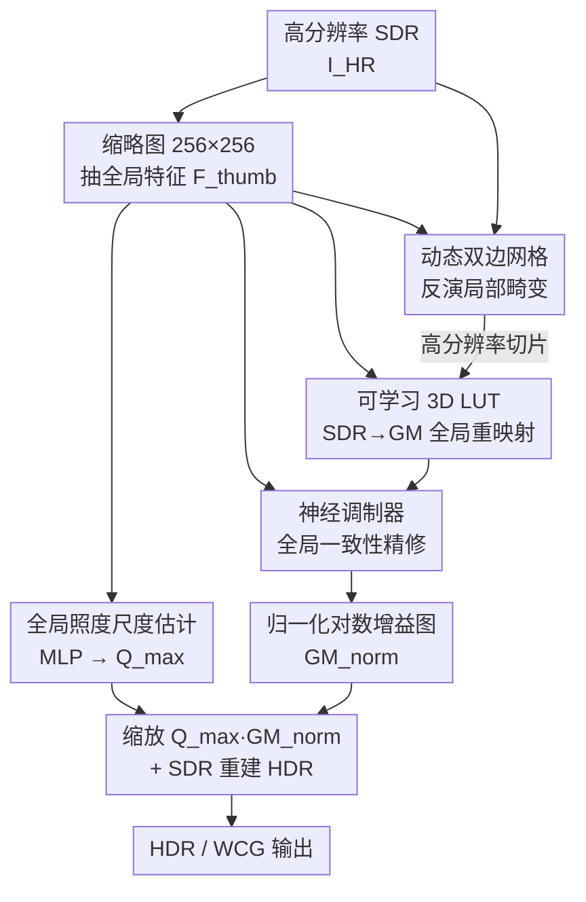

# FastGaMer: Efficient GainMap Learning for Practical Inverse Tone Mapping

**会议**: CVPR 2026  
**论文**: [CVF Open Access](https://openaccess.thecvf.com/content/CVPR2026/html/Guan_FastGaMer_Efficient_GainMap_Learning_for_Practical_Inverse_Tone_Mapping_CVPR_2026_paper.html)  
**代码**: 无  
**领域**: 图像恢复 / 逆色调映射 / HDR 重建  
**关键词**: 逆色调映射, 彩色增益图, 双边网格, 可学习3D LUT, 实时4K

## 一句话总结
FastGaMer 把逆色调映射（SDR→HDR/WCG）重新表述为「预测一张三通道彩色增益图（Color Gain Map）」，并按照本地色调映射的退化结构把全局压缩与局部自适应分开求逆——用动态双边网格反演局部畸变、用可学习 3D LUT 做全局重映射、用轻量神经调制器保证全局一致，所有高分辨率算子都是「无网络」操作，因此能在 V100 上 6.2 ms 处理一张 4K 图，PQ-PSNR 比此前最好的轻量方法高 1.4 dB，runtime 降 70%。

## 研究背景与动机
**领域现状**：消费级显示正快速转向 HDR + 宽色域（WCG），但绝大多数内容仍以 SDR 母版存在，因此需要逆色调映射（Inverse Tone Mapping, ITM）从 SDR 重建 HDR/WCG。和离线重制不同，实用 ITM 必须在智能电视、机顶盒这类弱算力硬件上、对 4K 甚至更高分辨率做实时处理。

**现有痛点**：现实管线里 SDR 几乎从不是「一条全局曲线」压出来的。相机 ISP 和本地色调映射器（local TMO，如 Adobe Camera Raw）在做全局辐射压缩的同时，还叠加了空间变化的局部自适应——逐区域调对比、调曝光、压色域。这让逆问题变得高度结构化：SDR 里同时混着全局辐射压缩和依赖内容的局部调整。现有学习式 ITM 完全忽略这个退化结构，要么直接回归 HDR 像素值（GMNet 已证明在全分辨率上学高比特动态范围又贵又低效），要么像 GMNet 那样只学一张单通道增益图——单通道只能放大亮度，无法恢复被压掉的宽色域和通道间的色比畸变。

**核心矛盾**：「重建精度」和「实时效率」之间存在 trade-off。纯网络方法（HDRUNet/FMNet/GMNet）精度高但 FLOPs/显存/延迟都顶不住 4K 实时；纯 LUT 方法（LUTwithGrid/SVDLUT）快但 8-bit、上下文无关，扛不住局部色调映射的空间变化退化；混合的 ITMLUT 改善了全局自适应却仍然计算偏重、面对强局部 TMO 很脆。

**本文目标**：在一个统一框架里同时拿到「网络级精度」和「LUT 级效率」，并且真正恢复 WCG 色域而不只是亮度。

**切入角度**：既然 SDR 是「全局压缩 ⊕ 局部自适应」叠出来的，那就让模型显式镜像这个前向退化过程、把两类退化分开求逆；同时把预测目标从 HDR 值换成对学习更友好的彩色增益图。

**核心 idea**：用「三通道彩色增益图 + 全局/局部解耦反演 + 高分辨率全程无网络」替代「直接回归 HDR」，让重建既准又快。

## 方法详解

### 整体框架
FastGaMer 的输入是高分辨率 SDR 图 $I_{HR}$，输出是用于重建 HDR 的对数域彩色增益图 $GM^{log}_{pred}$。关键的效率技巧是「在缩略图上算算子、在原图上跑算子」：先把 $I_{HR}$ 缩到 $256\times256$ 缩略图 $I_{thumb}$，用一个小编码器抽全局特征 $F_{thumb}$，再由 $F_{thumb}$ 并行预测一个全局标量 $\hat{Q}_{max}$（绝对动态范围）和三个图像自适应算子；这三个算子随后被顺序施加到原始高分辨率 $I_{HR}$ 上，全程是无网络的查表/采样/仿射运算，所以重活都压在低分辨率缩略图里，高分辨率端几乎零网络开销，天然分辨率无关。

预测目标是归一化、对数编码的三通道增益图 $GM^{log}_{norm}\in[-1,1]$，最终的绝对对数增益图由全局尺度缩放得到：

$$GM^{log}_{pred} = \hat{Q}_{max}\cdot GM^{log}_{norm}$$

这一步显式地把「全局照度预测」（$\hat{Q}_{max}$）和「相对动态范围与色域建模」（$GM^{log}_{norm}$）解耦开。拿到增益图后，按工业标准（Adobe/Google）的对数域增益图公式重建 HDR：先把 gamma 压缩的 SDR 转到对数域并加上预测增益，再指数回线性域

$$I^{log}_{HDR} = \log_2\big((I_{HR})^{\gamma}+\text{offset}\big) + GM^{log}_{pred},\quad I^{lin}_{HDR} = 2^{\,I^{log}_{HDR}}-\text{offset}$$

其中 $\gamma=2.2$、$\text{offset}=1/64$。整条流水线包含四个贡献模块：尺度估计、网格生成与切片、LUT 生成与变换、神经调制，下图展示它们如何从缩略图分叉再在高分辨率上串联：

### 关键设计

**1. 彩色增益图作为预测目标：把「学 HDR 值」换成「学逐通道残差增益」**

ITM 最直接的做法是回归 HDR 像素，但要在全分辨率上拟合很宽的动态范围和细粒度颜色映射，计算/显存都爆炸；GMNet 改成学单通道增益图缓解了一部分，却只缩放亮度、无法把被局部色调映射压掉的宽色域扩回来，也修不了与色度相关的畸变。FastGaMer 改成预测**三通道**彩色增益图 $GM^{log}_{norm}$：每个颜色通道有独立增益，因此能做逐通道放大，既能扩 HDR 也能扩 WCG，还能纠正色比畸变。论文用对数域 + 归一化编码（值域 $[-1,1]$）让增益分布更平衡、比直接回归高比特 HDR 更好学；消融里去掉增益图学习（退化为直接 HDR 回归）会让 PQ-PSNR 掉 3 dB 以上、$\Delta E_{ITP}$ 从 24.61 飙到 31.89，是所有模块里掉点最狠的，证明这是整套方法的地基。

**2. 全局/局部解耦反演：用「动态双边网格 + 可学习 3D LUT」分别对应局部自适应与全局压缩**

本文的核心观察是 local TMO 退化 = 全局辐射压缩 ⊕ 空间变化的局部自适应，于是反演也对应拆成两路。**局部路**用从全局特征 $F_{thumb}$ 生成的动态双边网格处理空间变化畸变：一个轻量 MLP 产出 $K$ 个 $N_b\times N_b\times N_b$ 的网格（实现取 $K=3$、$N_b=8$），多个网格能缓解过平滑、提供更丰富的场景自适应基；为省算力直接复用输入 RGB 通道当 range guidance，网格特征经 $1\times1$ 投影与输入 RGB 融合，得到空间调制后的基底 $I_{grid}$。**全局路**与网格并行，从 $F_{thumb}$ 生成 3D LUT（两层 MLP 预测 $3\times N_t\times N_t\times N_t$ 的表参数，$N_t=17$），对高分辨率的 $I_{grid}$ 做三线性采样，完成 SDR 域到对数增益图域的全局强度与颜色重映射。和普通 LUT 逐像素、上下文无关不同，这里的 LUT 是被全局缩略图特征条件化的、场景感知的，因此能和双边网格协同工作，而不会在强局部退化下崩。消融显示去掉网格切片会让对比度变平、边缘减弱；去掉 LUT 则色彩保真度严重受损——两者互补，一个管空间结构、一个管逐通道颜色。

**3. 全局照度尺度估计：只从整图预测绝对动态范围 $\hat{Q}_{max}$，避免 patch 依赖**

从裁剪小块里估计绝对亮度是病态的，会同时拖累训练和恢复精度。FastGaMer 把绝对照度尺度的预测和相对动态范围/色域的建模解耦：用带 strided 卷积块的小编码器从整张缩略图 $I_{thumb}$ 抽 $F_{thumb}$，再用两层 MLP 映射出标量 $\hat{Q}_{max}$。训练时监督虽在裁剪 patch 上，但仍喂整图缩略图来估尺度，使尺度保持全局一致而非随 patch 漂移，从而消除训练-测试不一致。最终增益图就是 $\hat{Q}_{max}\cdot GM^{log}_{norm}$（公式 1），让「绝对照度」和「相对增益」各司其职。

**4. 神经调制器：用极廉价的逐通道仿射把全局上下文注回增益图**

LUT 变换后的增益图 $GM^{log}_{LUT}$ 在大尺度结构（天空、室内照明）上可能缺乏全局一致性。为在不做昂贵空间对齐的前提下补全局上下文，作者从 $F_{thumb}$ 用一个小 MLP 预测逐通道参数 $(\alpha,\beta)$，广播到全分辨率后做一次仿射 + tanh：

$$GM^{log}_{norm} = \tanh\big(GM^{log}_{LUT}\odot(1+\alpha)+\beta\big)$$

这一步几乎不增加计算，却能提升跨大尺度结构的一致性。消融里去掉它只带来小幅掉点（PQ-PSNR 30.01→29.79），说明它是「锦上添花」的全局相干性补丁而非主干，性价比极高。

### 损失函数 / 训练策略
目标函数含两个数据保真项 + 两个 LUT 正则项。增益图学习用逐像素 $\ell_1$：一项约束归一化对数增益图 $GM^{log}_{norm}$ 对齐其归一化参考（管相对强度），另一项约束缩放后的 $GM^{log}_{pred}$ 对齐未归一化参考（稳定全局尺度）；LUT 则加平滑惩罚 $L_s$ 和单调性惩罚 $L_m$：

$$L = \|GM_{norm}-GM^{gt}_{norm}\|_1 + \lambda_1\|GM_{pred}-GM^{gt}_{orig}\|_1 + \lambda_2(L_s+L_m)$$

其中 $\lambda_1=3$（同时强调绝对尺度估计与相对动态范围预测），$\lambda_2=0.1$（保证 LUT 单调平滑）。训练用 Adam（$\beta_1=0.9,\beta_2=0.99$），学习率初始 $2\times10^{-4}$，在 200k/400k/600k/800k 迭代按 0.5 衰减，无 warm-up；在 $256\times256$ 随机裁剪上训练（随机翻转/旋转），batch size 16，全部在 V100 上完成。

## 实验关键数据

为支持彩色增益图监督，作者自建数据集：从 RAISE RAW 数据出发、用 Adobe Camera Raw 的自适应本地色调映射生成 SDR 并导出三通道增益图，得到 **8150 张合成 4K SDR–GM 对**；另用 Adobe Indigo 在 iPhone 12 Pro Max 上拍多曝光 RAW、导出对齐的 SDR–GM 层，得到 **82 张真实采集对**（覆盖室内外、日夜）。训练用合成子集，留 200 对合成做测试，全部真实对做鲁棒性评测。评测分三域：线性域（按 GT 峰值归一后算 PSNR/SSIM/SRSIM）、PQ 域（PQ 编码后同样三指标，更贴感知对比）、HDR 域（色差 $\Delta E_{ITP}$ 与感知质量 HDRVDP3）。

### 主实验
在 200 对合成测试集上，FastGaMer 在轻量方法里拿下 SOTA，PQ-PSNR 比 LUT 系最强的 ITMLUT 高约 1.4 dB；即便和强网络 GMNet 比，PQ-PSNR 仍 +0.27 dB（32.06 vs 31.79）且 $\Delta E_{ITP}$ 最低，说明 LUT 级效率没有牺牲精度。

| 方法 | 类型 | PQ-PSNR↑ | PQ-SSIM↑ | $\Delta E_{ITP}$↓ | HDRVDP3↑ |
|------|------|----------|----------|-------------------|----------|
| HDRUNet | 网络 | 25.94 | 0.9182 | 20.08 | 8.691 |
| GMNet | 网络 | 31.79 | 0.9465 | 14.08 | **9.385** |
| ITMLUT | LUT | 30.66 | 0.9481 | 15.13 | 9.171 |
| SVDLUT | LUT | 25.65 | 0.9203 | 21.42 | 9.031 |
| **FastGaMer** | LUT | **32.06** | **0.9516** | **13.89** | 9.263 |

真实采集测试集上同样领先：FastGaMer 拿到最高 PQ-PSNR（30.02）和最低 $\Delta E_{ITP}$（24.61），相对 LUT 系优势更明显，印证「条件化全局特征 + 预测增益图」是 LUT-based ITM 的一大步。

| 方法 | 类型 | PQ-PSNR↑ | PQ-SSIM↑ | $\Delta E_{ITP}$↓ | HDRVDP3↑ |
|------|------|----------|----------|-------------------|----------|
| FMNet | 网络 | 29.56 | 0.9274 | 25.42 | **8.936** |
| GMNet | 网络 | 29.93 | 0.9280 | 24.73 | 8.898 |
| ITMLUT | LUT | 29.59 | 0.9229 | 25.84 | 8.793 |
| **FastGaMer** | LUT | **30.02** | **0.9404** | **24.61** | 8.859 |

效率上更是降维打击：4K 下 FastGaMer 仅 6.20 ms、0.48 GFLOPs、参数 0.64 M，比 ITMLUT 快 70%+、比网络基线快约两个数量级；把 4K 输入降到 2K 还能进一步把延迟砍到 3.07 ms（约 51% 提速）且精度几乎无损，给部署留了灵活的效率-精度权衡。

| 方法 | 参数(M) | Runtime 4K(ms) | FLOPs 4K(G) | PQ-PSNR(合成) |
|------|---------|----------------|-------------|---------------|
| GMNet | 1.92 | 455 | 3155 | 31.79 |
| ITMLUT | 0.60 | 18.5 | 41.9 | 30.66 |
| **FastGaMer (4K)** | 0.64 | **6.20** | **0.48** | **32.06** |
| FastGaMer (降到2K) | 0.64 | 3.07 | 0.26 | 32.21 |

### 消融实验
在真实测试集（PQ 域 + HDR 指标）上逐个去模块：

| 配置 | PQ-PSNR↑ | PQ-SSIM↑ | $\Delta E_{ITP}$↓ | 说明 |
|------|----------|----------|-------------------|------|
| w/o 增益图学习 | 26.59 | 0.8823 | 31.89 | 退化为直接 HDR 回归，掉 3 dB+ |
| w/o 网格切片 | 29.68 | 0.9382 | 25.35 | 失去空间自适应，对比度变平 |
| w/o LUT 变换 | 29.75 | 0.9373 | 25.14 | 色彩保真严重受损 |
| w/o 神经调制 | 29.79 | 0.9372 | 25.33 | 仅小幅掉点，主要影响全局一致性 |
| **完整模型** | **30.01** | **0.9404** | **24.61** | — |

### 关键发现
- **增益图学习贡献最大**：去掉它（退化成直接回归 HDR）PQ-PSNR 掉 3 dB 以上、$\Delta E_{ITP}$ 从 24.61 涨到 31.89，是掉点最严重的一项，证明「学对数增益图」而非「学 HDR 值」是整套方法成立的前提。
- **网格与 LUT 互补**：网格管空间结构（去掉后对比度变平、边缘弱），LUT 管逐通道颜色（去掉后色彩保真崩），两者缺一不可。
- **神经调制是低成本的全局相干补丁**：去掉只掉约 0.2 dB，但能提升天空/室内照明等大尺度结构的一致性，几乎零额外计算。
- **增益图对分辨率不敏感**：可从降采样增益图重建 HDR，4K→2K 仅掉微小精度却省一半延迟，对边缘设备部署很实用。

## 亮点与洞察
- **「在缩略图上算算子、在原图上跑算子」是核心效率秘诀**：把所有网络计算锁死在 $256\times256$ 缩略图里，高分辨率端只剩双边网格切片、LUT 三线性采样、逐通道仿射这些无网络算子，所以天然分辨率无关、4K 仅 6.2 ms——这套「低分辨率出参数、高分辨率纯查表」的范式可迁移到任何需要实时高分辨率图像处理的任务（增强、调色、超分等）。
- **从退化结构反推网络结构**：方法不是堆模块，而是显式镜像 local TMO 的前向过程（全局压缩 + 局部自适应），把反演拆成对应两路，结构和物理过程一一对应，可解释性强。
- **彩色增益图扩了一维自由度**：单通道→三通道这一个改动就把「只能恢复亮度」升级为「能扩 WCG 色域 + 纠色比畸变」，是简单却关键的表示选择。

## 局限与展望
- **依赖自建数据**：彩色增益图监督完全靠作者自建的 8K+ 合成 + 82 真实对，真实集规模小（且只用 iPhone 12 Pro Max 单设备采集），跨设备/跨 ISP 的泛化未充分验证。⚠️ 以原文为准。
- **HDRVDP3 并非全场领先**：在两张主表里感知指标 HDRVDP3 都不是第一（合成 9.263 vs GMNet 9.385，真实 8.859 vs FMNet 8.936），说明在某些感知维度上纯网络方法仍有优势，本文的卖点更在「精度-效率综合最优」而非单项感知质量登顶。
- **强依赖合成退化先验**：方法显式建模 Adobe Camera Raw 式的 local TMO，若实际 SDR 来自结构差异很大的色调映射管线，解耦反演的前提可能不成立。
- **改进方向**：扩充真实多设备数据、把 $\hat{Q}_{max}$ 估计做得更鲁棒、探索把神经调制扩成更强的空间自适应而不破坏实时性。

## 相关工作与启发
- **vs GMNet**：GMNet 首次把预测目标从 HDR 像素换成单通道增益图，证明学残差比直接回归 HDR 更有效；但它只缩放亮度、扩不了 WCG，且用重网络骨干、4K 不实时。FastGaMer 升到三通道彩色增益图 + 全程无网络高分辨率算子，既能扩色域又快约 70 倍（455→6.2 ms），PQ-PSNR 还略高。
- **vs ITMLUT**：ITMLUT 用多张 LUT（暗/中/高光分区）从全局特征生成，提升了全局自适应，但仍计算偏重、面对强局部色调映射很脆。FastGaMer 用「全局条件化的动态双边网格 + 单组场景感知 LUT + 神经调制」处理空间变化退化，更轻（18.5→6.2 ms）也更准（+1.4 dB PQ-PSNR）。
- **vs LUTwithGrid / SVDLUT**：这两者把 LUT 用于实时调色/增强，效率高但上下文无关、限于 8-bit，扛不住局部 TMO，PQ-PSNR 仅 ~25。本文保留 LUT 的效率，靠全局特征条件化补上了上下文感知，把 LUT-based ITM 拉到了网络级精度。

## 评分
- 新颖性: ⭐⭐⭐⭐ 彩色增益图 + 按退化结构解耦反演 + 高分辨率全程无网络，是一套自洽且有物理动机的新框架
- 实验充分度: ⭐⭐⭐⭐ 三域指标 + 合成/真实双测试集 + 完整消融 + 效率分析齐全，唯真实集偏小
- 写作质量: ⭐⭐⭐⭐ 动机从退化结构推导清晰，方法与图表对应工整
- 价值: ⭐⭐⭐⭐⭐ 4K 6.2 ms 的实时 ITM 对智能电视/机顶盒等边缘部署有直接落地价值

<!-- RELATED:START -->

## 相关论文

- [\[CVPR 2026\] Distilling Quasi-Conformal Mapping: A Generalizable and Efficient Solution for Wide-Angle Correction](distilling_quasi-conformal_mapping_a_generalizable_and_efficient_solution_for_wi.md)
- [\[ICML 2026\] Learning Normalized Energy Models for Linear Inverse Problems](../../ICML2026/image_restoration/learning_normalized_energy_models_for_linear_inverse_problems.md)
- [\[CVPR 2026\] Dual Ascent Diffusion for Inverse Problems](dual_ascent_diffusion_for_inverse_problems.md)
- [\[CVPR 2026\] Outlier-Robust Diffusion Solvers for Inverse Problems](outlier-robust_diffusion_solvers_for_inverse_problems.md)
- [\[CVPR 2026\] GSNR: Graph Smooth Null-Space Representation for Inverse Problems](gsnr_graph_smooth_null_space_representation_for_inverse_problems.md)

<!-- RELATED:END -->
