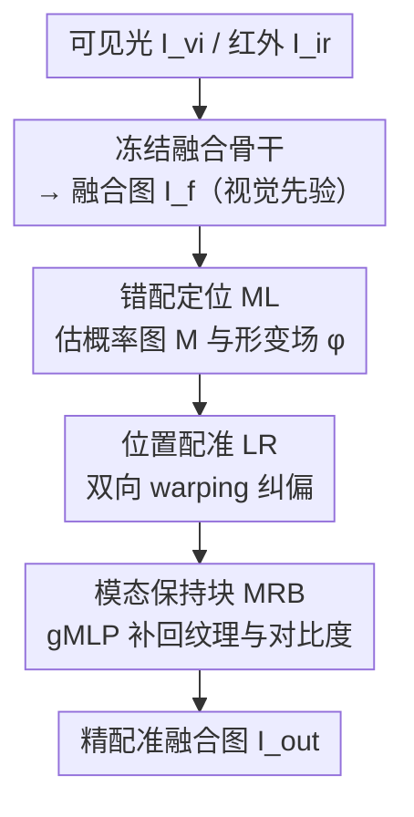

# FusionRegister: Every Infrared and Visible Image Fusion Deserves Registration

**会议**: CVPR 2026  
**论文**: [CVF Open Access](https://openaccess.thecvf.com/content/CVPR2026/html/Bian_FusionRegister_Every_Infrared_and_Visible_Image_Fusion_Deserves_Registration_CVPR_2026_paper.html)  
**代码**: https://github.com/bociic/FusionRegister  
**领域**: 图像恢复 / 低层视觉（红外可见光图像融合 + 配准）  
**关键词**: 红外可见光融合, 跨模态配准, 视觉先验, 后配准, gMLP

## 一句话总结
针对红外-可见光图像融合（IVIF）里"先配准再融合"的高成本、依赖人造形变、难以适配真实场景的痛点，FusionRegister 反过来"先融合、再只对错配区域做后配准"——它挂在任意冻结的融合骨干之后，用融合结果当视觉先验定位错配区域、做双向 warping 纠偏、再用 gMLP 模块找回纹理，以仅 2.94M 参数、19ms 推理把五种主流融合方法的配准精度（SAM IoU）平均提升约 5%，同时完全保留原融合质量。

## 研究背景与动机
**领域现状**：红外和可见光图像融合（IVIF）想把热辐射信息（红外独有）和纹理细节（可见光独有）合成一张信息更全的图，已从 CNN、GAN、Transformer 一路发展到扩散模型与状态空间模型。但真实多模态相机由于成像器件差异，红外和可见光图像往往存在空间错位（misalignment），直接融合会导致严重的"信息错位（information displacement）"、产生鬼影，融合质量崩坏。

**现有痛点**：为解决错位，主流做法是把配准当作融合前的预处理，即"register-then-fuse（先配准后融合）"范式。作者把这条线的方法归纳出三个硬伤（论文 Fig.1）：①**依赖人造形变**——很多 SOTA 用人为生成的仿射扰动当监督信号，强迫网络从合成扰动里学配准参数，结果一旦遇到本身没有大形变的真实输入就直接崩溃；②**无法与融合方法交互**——配准模块和融合模块割裂，换个融合骨干就得重做；③**预操作沉重**——风格迁移消除模态差、全局光流估计等步骤计算量大，还不可避免地带来信息损失。

**核心矛盾**：这些方法都试图把两个模态的**所有**信息全部对齐，却忽略了图像融合的一个关键事实——**并非所有特征都会进入融合图**。论文 Fig.2 做了个关键观察：把一对完美配准的图施加空间形变后再用同一融合骨干融合，patch 级相似度分析显示，红外的空间错位**主要只影响"模态共享区域"**，而"模态独有区域"几乎不受影响。既然只有共享区域会错位，那就**没必要做全局配准或重型预处理**，只在错配区域做后配准即可。

**本文目标**：在保留任意融合骨干原有融合质量的前提下，用最小代价、最强泛化、最高鲁棒性地纠正跨模态错配。

**切入角度**：多模态传感器通常紧挨着放，天然提供了粗配准（coarse registration），所以方法应当能直接吃原始传感器输入，而不必靠人造形变当监督。作者据此提出"学习并定位错配表征（misregistration representation），只在受影响区域做定向纠正"。

**核心 idea**：把范式从"先配准后融合"翻转为"先融合、后配准"——让融合骨干当**视觉先验提供者**，引导配准只盯着错配区域，从而同时拿下鲁棒性、通用性、效率三件事。

## 方法详解

### 整体框架
FusionRegister（简称 FR）是一个**挂在融合骨干之后**的通用后配准框架。输入是可见光图 $I_{vi}$、红外图 $I_{ir}$ 以及二者经任意（冻结的）融合骨干得到的融合结果 $I_f$；目标是输出精配准后的融合图 $I_{out}$，使其逼近"完美配准下应得到的融合图" $I_{gt}$。整个流程借鉴 MIMO-UNet 做**分层（多尺度）**处理：在尺度 $i\in\{0,\cdots,N-1\}$ 上对 $I_f/I_{vi}/I_{ir}$ 下采样，用三个结构相同、参数不同的特征提取器抽出多尺度特征 $F_{in}^i$（$in\in\{f,vi,ir\}$，见式 (1)）。

在每个尺度上，FR 由三个协同阶段串起来：**错配定位（ML）**先用融合结果与源图的视觉先验，估计一张错配概率图 $M^i$ 和一个形变场 $\phi^i$，告诉后续"哪里错了、错多少"；**位置配准（LR）**拿 $\phi^i$ 对融合特征/图做**双向 warping**，把错配区域拉回去且不破坏本就对齐的区域；**模态保持块（MRB）**再把空间变换中损失的纹理和对比度补回来，预测残差偏置图 $I_{bias}^i$ 叠加到 warp 结果上。多尺度的形变场从粗到细逐层细化，保证空间一致性。注意融合骨干在训练时是**冻结**的——FR 不改融合，只纠错配，这正是它能即插即用到任意融合方法的原因。

### 关键设计

**1. 视觉先验驱动的"先融合、后配准"范式：只纠错配区域，不做全局对齐**

这是全文最核心的范式翻转。旧范式"先配准后融合"要把两模态所有信息对齐，代价高且依赖人造形变监督；FR 基于 Fig.2 的观察——错位只影响模态共享区域——把顺序反过来：先让任意融合骨干产出 $I_f$，再以 $I_f$ 为视觉先验**显式表征并定位错配**，只在错配区域做纠正。这样做有三重收益：融合骨干冻结、原融合质量被完整保留（**通用性**）；配准只聚焦 mismatch 区域、省掉全局光流和风格迁移等预操作（**效率**）；不再靠人造形变当监督、改为"学习错配表征"，所以面对没有大形变的干净真实输入也不会崩（**鲁棒性**）。作者称之为"field-free supervised paradigm"——不依赖全局监督的形变场，而是用视觉先验自适应地推断局部形变。

**2. 错配定位 ML：用概率图 + 分层细化形变场回答"哪里错、错多少"**

ML 针对的痛点是：既要知道错配位置，又要知道错配幅度，还不能被噪声带偏成孤立的乱跳形变。它在每个尺度同时估计一张错配概率图 $M^i\in\mathbb{R}^{B\times1\times(H/2^i)\times(W/2^i)}$ 和一个形变场 $\phi^i\in\mathbb{R}^{B\times2\times\cdots}$，前者表示"哪里是错配区域"，后者表示"该往哪挪、挪多少"。形变场从粗到细逐层细化：

$$\phi^i = \phi^i \otimes \big(1 \oplus 2\otimes Up(\phi^{i+1})\big)$$

其中 $\oplus,\otimes$ 是逐元素加/乘，$Up(\cdot)$ 是双线性上采样，系数 "2" 用来补偿上采样带来的分辨率不匹配、维持物理尺度一致性。这种分层传播保证空间相干、抑制孤立形变。与依赖全局监督形变场的旧方法相比，ML 不需要全局监督，而是用视觉先验线索自适应地捕捉错配并推断局部形变，从而更鲁棒、更可泛化。

**3. 位置配准 LR：双向 warping 同时纠偏又防撕裂**

LR 把 ML 预测的 $\phi^i$ 真正落实到融合特征/图上。痛点是：传统单向 backward warping 容易**过度补偿**——只朝一个方向拉，会把可疑错配区域用力过猛、把远处本来好的结构也扯歪，造成边缘撕裂（edge tearing）。FR 改用**双向 warping**，借概率图 $M^i$ 做区域门控，对正反两个方向的形变场分别 warp 再加权融合：

$$I_{warp}^i = M^i \otimes BW(I_f^i,\phi^i)\ \oplus\ (1-M^i)\otimes BW(I_f^i,-\phi^i)$$

特征域同理得到 $F_{warp}^i$（式 (4)），$BW(\cdot)$ 是 backward warping。直觉是：用 $M^i$ 把"正方向纠正"留给真正错配的区域、把"反方向纠正"留给其余区域，正反向互相牵制，避免单侧用力过猛，既稳定形变又防止边缘撕裂。消融显示单向 warping 会"过度强调可疑错配区、扭曲远处结构"，双向版在配准精度和融合质量上都更优。

**4. 模态保持块 MRB：gMLP + 相关层 + 双模态注意力，找回 warp 丢掉的纹理**

空间 warping 不可避免会削弱纹理、压低对比度。MRB 就是把这些细节补回来的轻量模块（论文 Fig.4/5）。它先用一个**相关层（Correlation Layer）**度量 warp 后融合特征 $F_{warp}^i$ 与源特征 $F_{src}^i$（$src\in\{vi,ir\}$）的局部对应：把 $F_{src}^i$ 零填充后在 $m,n\in\{0,\dots,2p\}$ 范围内逐像素平移，与 $F_{warp}^i$ 做逐元素乘并按通道平均，得到相关描述子 $F_{cor}^{i,m,n}=CA(\tilde F_{src}^{i,m,n}\otimes F_{warp}^i)$（式 (5)），拼成 $F_{cor}^i\in\mathbb{R}^{B\times4p^2\times\cdots}$，相当于记录了多种偏移下的局部几何关系。随后把 $F_{warp}^i,F_{src}^i,F_{cor}^i$ 压缩、切成多尺度 patch，交给 **gMLP** 做空间交互——用通道投影加空间门控单元 $F_{cor}^{i(s)}=(F_{cor}^{i(s)}W_1)\otimes\sigma((F_{cor}^{i(s)}W_2)\mathbf{G})$（式 (6)，$\mathbf{G}$ 是可学门控矩阵，$\sigma$ 为 ReLU），无需自注意力就能建模长程依赖；多尺度结果再用 softmax 权重 $w_s$ 聚合成 $F_{gMLP}^i$（式 (7)）。

为强调模态独有信息，MRB 还接了**双模态注意力**：可见光分支用空间均值 + 通道加权增强语义一致性（式 (8)），红外分支用通道 max/mean 拼接的空间注意力强调高频细节（式 (9)），两者与 $F_{gMLP}^i$ 相加得 $F_{ff}^i$（式 (10)）；最后卷积块预测残差偏置图 $I_{bias}^i$，refine 出 $I_{out}^i=I_{warp}^i\oplus I_{bias}^i$（式 (11)）。消融里 gMLP 版相比可变形 Transformer（DT）和可变形卷积（DC）取得了配准精度、细节保留与效率的最佳平衡——DT 建不好长程依赖、DC 感受野有限提升微弱。

### 损失函数 / 训练策略
总损失联合优化配准误差与结构/纹理保真，跨空间域与频率域（式 (12)）：$\mathcal{L}_{all}=\lambda_1\mathcal{L}_e+\lambda_2\mathcal{L}_g+\lambda_3\mathcal{L}_f+\lambda_4\mathcal{L}_d$。四项分别是：**边缘损失** $\mathcal{L}_e$ 用高斯差分（DoG）算子对齐 warp/输出与 GT 的结构边界；**全局空间损失** $\mathcal{L}_g$ 在像素空间用 L2 约束整体结构一致；**频率损失** $\mathcal{L}_f$ 在傅里叶域用 L1 保高频纹理；**细节损失** $\mathcal{L}_d$ 用 Sobel 算子只在错配图 $M^i$ 区域内约束纹理一致。训练用 Adam（$\beta_1=0.9,\beta_2=0.999$）+ 余弦退火（lr $2\times10^{-4}\to1\times10^{-6}$），batch 20、patch $256\times256$、5000 epoch，超参 $p=1,s\in\{1,3\},\lambda_1=10,\lambda_2=1,\lambda_3=0.1,\lambda_4=10$，单卡 RTX 4090。

⚠️ 上述公式编号、系数与超参均按论文原文整理，个别 OCR 还原的公式（如双向 warping、相关层）建议**以原文为准**。

## 实验关键数据

### 实验设置
训练数据是作者自建的多模态配准数据集：从公开融合数据集 MSRS 和 M3FD 手工裁出 1,333 个完美配准的 $260\times260$ patch（MSRS 426 + M3FD 907）。测试用 27 张 MSRS、21 张 M3FD、20 张 LLVIP 的**自然错配**样本，**全分辨率、无合成形变**评测。训练时对 $I_{ir}$ 施加随机仿射（旋转 $[-2°,2°]$、平移 $[-2,2]$ 像素、缩放 $[0.95,1.08]$ 等）模拟真实错配。评测分两块：融合质量用 EN/SF/AG/SD 四个无参考指标；配准精度用 **SAM** 做全景分割提取物体掩膜，再用 IoU 与 PR（precision/recall 调和均值）衡量跨模态对齐度，掩膜经人工标注保证公平。

### 主实验：通用性（SAM 配准精度，IoU/PR）
FR 即插即用到 CNN（MMDR）、GAN（FreqGAN）、Transformer（TDFusion）、扩散（HCLFuse）、Mamba（S4Fusion）五类融合骨干，在三个数据集上配准精度全面提升（论文 Table 1，平均约 +5% IoU），且融合质量保持：

| 融合骨干 | MSRS IoU | M3FD IoU | LLVIP IoU |
|---|---|---|---|
| MMDR | 83.6 | 76.9 | 83.7 |
| MMDR + FR | **86.5** | **81.6** | **86.0** |
| FreqGAN | 80.7 | 74.4 | 82.5 |
| FreqGAN + FR | **84.1** | **80.6** | **83.2** |
| TDFusion | 85.2 | 76.5 | 81.1 |
| TDFusion + FR | **86.7** | **81.0** | **82.9** |
| HCLFuse | 79.2 | 66.2 | 76.9 |
| HCLFuse + FR | **83.7** | **80.4** | **84.7** |
| S4Fusion | 79.9 | 72.5 | 82.8 |
| S4Fusion + FR | **85.9** | **75.7** | **85.3** |

作为参照，纯配准融合方法在 MSRS 上的 IoU 普遍偏低且泛化差：MURF 58.3、CAP 59.1、IVFWSR 64.6、C2RF 70.5、SemLA/IMF 均 78.7——其中 MulFS-CAP 只在自己训练集 LLVIP 上好，迁到 MSRS/M3FD 就崩。HCLFuse 在 M3FD 上 66.2→80.4 的 +14.2 是单项最大跃升，说明 FR 对原本配准较差的骨干增益尤其明显。

### 消融实验（MSRS）
论文 Table 2，同时报告配准（IoU/PR）、图像质量（EN/SF/AG/SD）与开销（时间 T/参数 P）：

| 配置 | IoU | PR | SF | SD | T(s) | P(M) | 说明 |
|---|---|---|---|---|---|---|---|
| w/o MRB | 85.6 | 91.9 | 11.46 | 42.71 | 0.012 | 2.83 | 去掉 MRB，纹理/对比度明显掉 |
| 1-d Warping | 85.5 | 92.4 | 11.58 | 43.57 | 0.019 | 2.94 | 单向 warping，过补偿扭曲远处结构 |
| MRB w/ DT | 86.0 | 92.3 | 11.53 | 44.15 | 0.025 | 3.21 | 可变形 Transformer，长程依赖建不好且更慢 |
| MRB w/ DC | 84.8 | 92.1 | 11.41 | 42.52 | 0.014 | 3.25 | 可变形卷积，感受野有限，提升微弱 |
| More Layers | 86.3 | 92.9 | 11.65 | 43.79 | 0.021 | 7.32 | 2→3 层，收益微小但参数翻倍 |
| **Ours（2 层）** | **86.5** | **92.9** | **11.71** | **43.84** | 0.019 | **2.94** | 完整模型 |

### 复杂度对比（论文 Table 3）

| 方法 | Params(M) | MSRS 时间(s) | M3FD 时间(s) |
|---|---|---|---|
| SemLA | 28.03 | 0.75 | 2.39 |
| MURF | 13.4 | 2.23 | 4.85 |
| IVFWSR | 53.8 | **0.008** | **0.013** |
| IMF | 52.6 | 0.188 | 0.465 |
| MulFS-CAP | **1.5** | 4.5 | 10.57 |
| C2RF | 10.53 | 0.139 | 0.349 |
| **Ours** | 2.94 | 0.019 | 0.057 |

### 关键发现
- **MRB 贡献最大**：去掉后 SD 从 43.84 掉到 42.71、SF 从 11.71 掉到 11.46，说明 warping 确实会损纹理/对比度，MRB 是把细节补回来的关键。
- **双向 warping 优于单向**：单向版 IoU 85.5、SF 11.58 都不如双向版（86.5 / 11.71），印证"单侧纠正会过补偿扭曲远处结构"的分析。
- **2 层就够**：从 2 层加到 3 层（More Layers）IoU 仅到 86.3（仍不及 Ours 的 86.5），但参数从 2.94M 翻到 7.32M，为轻量实时选 2 层。
- **效率-质量权衡最好**：FR 仅 2.94M 参数、19ms 推理，参数与速度都是次优梯队；IVFWSR 虽最快但 53.8M 参数且适配性差，MulFS-CAP 参数最少却推理最慢、泛化差。

## 亮点与洞察
- **范式翻转最妙**：把"先配准后融合"改成"先融合后配准"，背后是一个被忽略的事实——错位只伤模态共享区。这个观察直接砍掉了全局配准和重型预处理，是"少做"换来"更好"的典范。
- **冻结骨干 + 即插即用**：FR 不碰融合网络，只当一个外挂纠错器，因此能无缝套到 CNN/GAN/Transformer/扩散/Mamba 五类骨干上，工程价值很高。
- **用 SAM 做配准评测**：IVIF 缺乏完美对齐参考图，作者用 SAM 分割掩膜的 IoU/PR 来量化对齐度，绕开了"靠合成形变评测脱离真实"的老问题，这个评测设计可迁移到其他跨模态对齐任务。
- **双向 warping 防撕裂**：用概率图门控正反向形变，是个简单却有效的稳形变技巧，可借鉴到光流/形变配准的其他场景。

## 局限与展望
- **作者承认的局限**：FR 假设输入已有粗配准（传感器紧邻提供）。当跨模态视角差异很大时，这个前提失效，FR 难以拿到满意效果——这也是未来要解决的关键问题。
- **依赖融合骨干质量**：FR 是后处理，若融合骨干本身把信息融烂了，视觉先验也不准；它纠的是错配而非融合本身的缺陷。
- **自建数据 + 人工掩膜**：训练 patch 与评测掩膜都靠手工裁剪/标注，规模有限（1,333 patch），可扩展性与标注一致性存疑。
- **改进方向**：把"粗配准"假设放宽到大视角差、把范式推广到更多跨模态融合任务（如医学多模态、遥感）是作者明确的下一步。

## 相关工作与启发
- **vs 先配准后融合（SemLA / MURF / IMF / MulFS-CAP / C2RF / IVFWSR）**：它们走"register-then-fuse"，靠风格迁移/全局光流/模态字典先对齐再融合，预处理重、依赖人造形变、换数据集就崩；FR 走"fuse-then-register"，只纠错配区、冻结骨干、用视觉先验，效率与泛化都更好。
- **vs 特征级一阶段配准融合（IVFWSR / RFVIF）**：它们在中间特征域直接预测 offset 做一阶段对齐特征融合，仍需把两模态信息整体对齐；FR 不动融合、只在像素/特征域对错配区做双向纠正，参数（2.94M）远小于 IVFWSR（53.8M）。
- **启发**："并非所有信息都进融合图，所以只需局部配准"——这种"按需纠错而非全局对齐"的思路，可迁移到任何"重处理 + 局部缺陷"的任务（如视频去抖只修抖动帧、超分只补高频区）。

## 评分
- 新颖性: ⭐⭐⭐⭐⭐ 把 IVIF 配准范式从"先配准后融合"翻转为"先融合后配准"，观察扎实、立意清晰
- 实验充分度: ⭐⭐⭐⭐ 五类骨干 × 三数据集通用性 + 多维消融 + 复杂度对比，但缺与 SOTA 在融合质量数值上的正面横评
- 写作质量: ⭐⭐⭐⭐ 动机与观察讲得透，公式较多但 OCR 还原略糙，部分细节需查补充材料
- 价值: ⭐⭐⭐⭐⭐ 即插即用、轻量、可套任意融合骨干，工程落地价值高

<!-- RELATED:START -->

## 相关论文

- [\[CVPR 2026\] RegionFuse: Region-Adaptive Pixel Distribution Learning for Infrared and Visible Image Fusion](regionfuse_region-adaptive_pixel_distribution_learning_for_infrared_and_visible_.md)
- [\[CVPR 2026\] Beyond Strict Pairing: Arbitrarily Paired Training for High-Performance Infrared and Visible Image Fusion](beyond_strict_pairing_arbitrarily_paired_training_for_high-performance_infrared_.md)
- [\[CVPR 2026\] Degradation-Robust Fusion: An Efficient Degradation-Aware Diffusion Framework for Multimodal Image Fusion in Arbitrary Degradation Scenarios](degradation-robust_fusion_an_efficient_degradation-aware_diffusion_framework_for.md)
- [\[CVPR 2026\] ReflexSplit: Single Image Reflection Separation via Layer Fusion-Separation](reflexsplit_single_image_reflection_separation_via_layer_fusion-separation.md)
- [\[CVPR 2026\] Toward Real-world Infrared Image Super-Resolution: A Unified Autoregressive Framework and Benchmark Dataset](real_iisr_infrared_image_super_resolution_autoregressive.md)

<!-- RELATED:END -->
