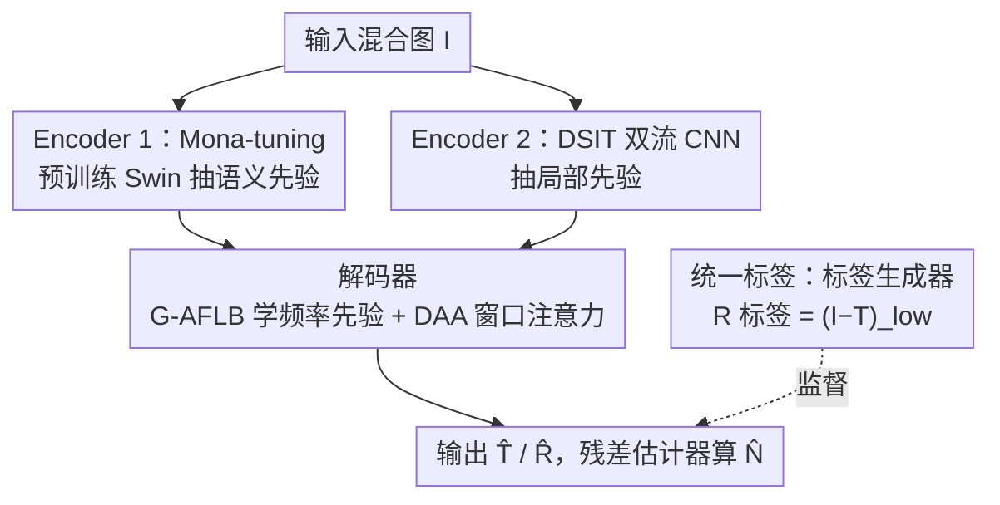

# GFRRN: Explore the Gaps in Single Image Reflection Removal

**会议**: CVPR 2026  
**论文**: [CVF Open Access](https://openaccess.thecvf.com/content/CVPR2026/html/Chen_GFRRN_Explore_the_Gaps_in_Single_Image_Reflection_Removal_CVPR_2026_paper.html)  
**代码**: [项目页](http://tabe-i.github.io/GFRRN-project/)  
**领域**: 图像恢复 / 反射去除  
**关键词**: 单图反射去除、参数高效微调、语义鸿沟、统一标签、频率先验

## 一句话总结
GFRRN 把单图反射去除（SIRR）里两条长期被忽视的"鸿沟"——预训练模型与去反射模型之间的语义鸿沟、合成数据与真实数据之间的反射标签不一致——分别用 Mona 参数高效微调和统一低频标签补上，再叠加高斯自适应频率块与动态智能体注意力，在 5 个真实测试集上把平均 PSNR 推到 27.33 dB（较此前 SOTA +0.7 dB）。

## 研究背景与动机

**领域现状**：单图反射去除要把一张透过玻璃拍到的混合图 $\mathbf{I}$ 分解成透射层 $\mathbf{T}$（想要的真实场景）和反射层 $\mathbf{R}$（玻璃上的倒影）。当前主流是**双流方法**：一条流估透射、一条流估反射，再用特征交互机制让两条流互通信息（YTMT、DSRNet、DSIT），并常引入一个预训练模型（VGG 或 Swin-Transformer）提供高层语义，往往能拿到不错的结果。

**现有痛点**：作者指出这类双流交互方法忽略了两个"gap"。其一是**语义鸿沟**——提供语义的预训练模型是为分类任务训的、强调高层语义，而且通常被冻结、不参与反向传播，它"想给"的是原始分类语义，去反射模型"想要"的却是面向低层纹理的恢复语义，两者诉求冲突。其二是**训练数据鸿沟**——SIRR 训练同时用合成数据和真实数据，但两者的反射层标签定义不一致：合成数据直接有 $\mathbf{R}$，真实数据没有反射图、只能用残差 $\mathbf{I}-\mathbf{T}$ 当反射标签，这种监督信号的分裂会损害泛化。

**核心矛盾**：现有工作要么不碰这两个 gap，要么像 RDNet 那样用全量微调（FFT）去对齐预训练模型——但 FFT 参数量巨大，在 SIRR 这种远小于 ImageNet 的小数据集上反而优化不动、掉点（实验里 FFT 把 PSNR 从冻结基线的 26.70 拉到 25.35）。

**本文目标**：在不引入 FFT 优化负担的前提下对齐预训练与去反射模型（补语义鸿沟），并在数据层面统一合成/真实数据的反射标签（补数据鸿沟），同时把 SIRR 任务天然的频率先验和窗口间反射差异显式利用起来。

**核心 idea**：用**参数高效微调（Mona-tuning）**温和地把预训练 Swin 的语义"扭"向去反射任务、用 $\mathbf{I}-\mathbf{T}$ 的**低频部分** $(\mathbf{I}-\mathbf{T})_{low}$ 作为统一反射标签，再配上高斯频率块和动态智能体注意力，组成"无鸿沟"的 GFRRN。

## 方法详解

### 整体框架
GFRRN 整体沿用 DSIT 式的双编码器 + 单解码器双流结构，但在四个地方动刀补 gap。输入是混合图 $\mathbf{I}$，输出是估计的透射层 $\hat{\mathbf{T}}$、反射层 $\hat{\mathbf{R}}$ 和残差项 $\hat{\mathbf{N}}$。两个并行编码器分别是：Encoder 1 是插了若干可学习 Mona 层的预训练 Swin-Transformer，负责抽全局语义先验；Encoder 2 是借自 DSIT 的双流 CNN，负责抽局部先验。两路特征融合后进单个解码器，解码器里用 G-AFLB 学频率先验、用 DAA 替换原来的窗口注意力。$\hat{\mathbf{R}}$ 和 $\hat{\mathbf{T}}$ 还会经一个以 NAFBlock 为主体的残差估计器算出 $\hat{\mathbf{N}}$。训练侧的关键改动是：反射层的监督标签不再用原始 $\mathbf{I}-\mathbf{T}$，而是经一个"标签生成器"（一个简单的 2D 低通滤波器）滤掉高频边缘后的 $(\mathbf{I}-\mathbf{T})_{low}$，被滤掉的高频则交给残差项 $\hat{\mathbf{N}}$ 兜住。

### 关键设计

**1. Mona-tuning：用参数高效微调补预训练模型与去反射模型之间的语义鸿沟**

预训练 Swin 是为分类训的、强调高层语义，而反射去除是 dense prediction、更看重低层纹理细节，被冻结的 Swin"提供原始语义"与去反射模型"需要面向 SIRR 的语义"之间存在诉求冲突。直接全量微调（FFT）看似能对齐，但 Swin 参数太多、SIRR 数据集太小，优化不动反而掉点。作者改用认知启发的 Mona（Multi-cognitive visual adapter）——固定 Swin 全部预训练权重，只在每个 SwinBlock 的 MSA 和 MLP 之后插入 Mona 层并只训这些层，用面向视觉的卷积滤波器从多种认知视角把预训练知识"搬运"到去反射任务上。这样既避开 FFT 的优化困难，又能温和地把语义方向对齐到 SIRR。这是首个把 PEFT 技术用到 SIRR 任务上的工作；消融里 Mona（27.33 dB）明显优于冻结基线（26.70）、FFT（25.35）和 LoRA（26.51）——LoRA 主要适配 NLP 的多头注意力权重，对视觉任务并不友好。

**2. 统一标签：用 $(\mathbf{I}-\mathbf{T})_{low}$ 抹平合成与真实数据的反射标签不一致**

合成数据有现成反射图 $\mathbf{R}$ 作监督，真实数据没有、只能用 $\mathbf{I}-\mathbf{T}$，这种标签分裂直接伤泛化。一个朴素想法是合成数据也统一用 $\mathbf{I}-\mathbf{T}$，但实验发现这样反而掉点（27.33→26.61 dB）。原因在于 $\mathbf{I}-\mathbf{T}$ 含有来自透射层的明显高频信息（如边缘）——按行为模型 $\mathbf{I}=\mathbf{T}+\mathbf{R}+\Phi(\mathbf{T},\mathbf{R})$，$\mathbf{I}-\mathbf{T}$ 里还混着残差项 $\Phi$——这些高频会误导网络把透射相关的信息当成反射学进去。作者认为合理的反射标签应尽量不含透射层信息，于是用标签生成器（一个简单 2D 低通滤波器）滤掉 $\mathbf{I}-\mathbf{T}$ 里源自透射层的高频边缘，得到统一反射标签 $\mathbf{R}=(\mathbf{I}-\mathbf{T})_{low}$；被滤掉的那部分高频则用残差标签 $\mathbf{N}=\mathbf{I}-\mathbf{T}-(\mathbf{I}-\mathbf{T})_{low}$ 显式监督残差项 $\hat{\mathbf{N}}$，既不丢信息，又给透射/反射的估计提供正则。这是个数据层的通用方案——把它装到 DSIT、DSRNet 上同样涨点（如 DSRNet 25.72→26.17 dB）。

**3. G-AFLB：用高斯软频率边界自适应匹配反射的模糊程度**

拍照时反射层会因相对景深位置呈现不同程度的模糊，SIRR 任务天然带频率先验，但去反射模型很少显式利用频率信息。受相关工作启发，作者在解码器里设计高斯自适应频率学习块（Gaussian-based Adaptive Frequency Learning Block），有两点考量：一是用平滑的高斯系数代替"非黑即白"的二值频率边界，抑制硬截断带来的吉布斯振铃效应；二是这种软边界能自适应匹配反射层的模糊程度。消融里 G-AFLB（高斯掩码）比 AFLB（硬掩码）在 PSNR 上高 0.25 dB，验证了高斯软掩码的作用。

**4. DAA：让窗口注意力显式区分各窗口被反射污染的轻重**

窗口注意力（W-MSA）是双流特征交互的核心，但开销大；作者先用 agent attention 替换 W-MSA 提效率，可 agent attention 又忽略了一个事实——不同窗口被反射污染的程度差异巨大（一个窗口可能被反射完全遮盖、另一个完全干净、还有的部分污染）。为此在 query 分支加一个窗口重要性估计器（WIE），给每个窗口学一个自适应重要性权重，再与 agent attention 结合构成动态智能体注意力（Dynamic Agent Attention），同时建模窗口间（inter-）与窗口内（intra-）的显著性。可视化显示 WIE 学到的权重图大致指出了图中反射所在区域；消融里 DAA（27.33）优于 W-MSA（26.91）和纯 agent attention（27.04）。

### 损失函数 / 训练策略
训练用四项损失之和。内容损失 $\mathcal{L}_{con}$ 在空间和梯度两域监督 $\hat{\mathbf{T}}$、$\hat{\mathbf{R}}$，并把残差项 $\hat{\mathbf{N}}$ 也纳入正则（$\alpha=0.3$、$\beta=0.6$）：

$$\mathcal{L}_{con} := \|\hat{\mathbf{T}}-\mathbf{T}\|_2^2 + \|\hat{\mathbf{R}}-\mathbf{R}\|_2^2 + \alpha\|\hat{\mathbf{N}}-\mathbf{N}\|_2^2 + \beta(\|\nabla\hat{\mathbf{T}}-\nabla\mathbf{T}\|_1 + \|\nabla\hat{\mathbf{R}}-\nabla\mathbf{R}\|_1 + \alpha\|\nabla\hat{\mathbf{N}}-\nabla\mathbf{N}\|_1)$$

此外有排斥损失 $\mathcal{L}_{exc}$（在 3 个尺度上用 $\tanh$ 梯度乘积保证 $\hat{\mathbf{T}}$、$\hat{\mathbf{R}}$ 结构独立）、基于 VGG-19 中间特征的感知损失 $\mathcal{L}_{per}$（层 ID $i\in\{2,7,12,21,30\}$）、以及重建损失 $\mathcal{L}_{rec}=\|\mathbf{I}-\hat{\mathbf{T}}-\hat{\mathbf{R}}-\hat{\mathbf{N}}\|_1$。总损失 $\mathcal{L}_{total}=\mathcal{L}_{con}+\mathcal{L}_{exc}+\lambda_1\mathcal{L}_{per}+\lambda_2\mathcal{L}_{rec}$，$\lambda_1=0.01$、$\lambda_2=0.2$。训练用 Adam 跑 60 epoch，学习率固定 1e−4、batch size 1，单卡 RTX A6000；训练集每 epoch 随机采 5K 张 PASCAL VOC 合成对 + Real(90) + Nature(200)，图像统一 resize 到 $384\times384$。

## 实验关键数据

### 主实验
在 5 个常用真实测试集（Real20、Object200、Postcard199、Wild55、Nature20）上对比 11 个 SOTA SIRR 方法，GFRRN 在全部对比中均排第一，平均 PSNR/SSIM 提升 0.7 dB / 0.01。

| 方法 | 来源 | Average PSNR | Average SSIM |
|------|------|------|------|
| DSRNet | ICCV'23 | 25.72 | 0.907 |
| RRW | CVPR'24 | 25.40 | 0.908 |
| DSIT | NeurIPS'24 | 26.50 | 0.919 |
| RDNet | CVPR'25 | 26.63 | 0.915 |
| **GFRRN（本文）** | CVPR'26 | **27.33** | **0.929** |

### 消融实验
五个测试集上平均，逐个去掉关键组件：

| 配置 | PSNR | SSIM | 说明 |
|------|------|------|------|
| Full model | 27.33 | 0.929 | 完整模型 |
| w/o DAA | 26.91 | 0.919 | 用 W-MSA 替代 DAA，掉 0.42 dB |
| w/o Mona-tuning | 26.70 | 0.920 | 冻结预训练模型，掉 0.63 dB（掉点最多） |
| w/o unified label | 26.96 | 0.920 | 用旧式反射标签，掉 0.37 dB |
| w/o G-AFLB | 27.02 | 0.923 | 去掉频率块，掉 0.31 dB |

补充消融：微调技术上 Mona（27.33）> AdaptFormer（27.32）> Bitfit（26.86）> 冻结（26.70）> LoRA（26.51）> FFT（25.35）；统一标签若改用原始 $\mathbf{I}-\mathbf{T}$ 会从 27.33 掉到 26.61 dB，且把统一标签迁移到 DSIT/DSRNet 也都涨点。

### 关键发现
- **去掉 Mona-tuning 掉点最多（−0.63 dB）**，说明补语义鸿沟是四个组件里贡献最大的一环；而 FFT 比冻结基线还差（25.35 vs 26.70），印证小数据集下 PEFT 优于全量微调的判断。
- **统一标签必须用低频版**：直接用 $\mathbf{I}-\mathbf{T}$ 反而掉点，关键在于滤掉透射层泄漏进来的高频边缘，并把高频丢给残差项兜住。
- **统一标签是通用 trick**：装到 DSIT、DSRNet 上都能涨点，说明数据鸿沟是 SIRR 领域的共性问题，而非本文架构专属。

## 亮点与洞察
- **把"gap"当成研究对象**：论文最聪明之处是不堆模块，而是先诊断双流 SIRR 里两个被忽视的系统性鸿沟（语义/数据），再对症下药——这种"先找病灶再开方"的叙事让四个组件各有明确靶点。
- **统一标签的 insight 很反直觉**：统一标签的正确做法不是简单对齐成同一个公式，而是要先意识到 $\mathbf{I}-\mathbf{T}$ 混入了透射高频，必须低通滤波 + 残差兜底——这个发现可直接迁移到任何用合成/真实混合数据训练的反射/阴影/去噪任务。
- **PEFT 进低层视觉**：首次把 Mona 这类适配器搬到 SIRR，且实测 FFT 在小数据集上反而有害，给"小数据下如何用大预训练模型"提供了一个干净的案例。

## 局限与展望
- 作者承认统一反射标签 $(\mathbf{I}-\mathbf{T})_{low}$ 并不严格准确——某些情形下部分真实反射信息也会被低通滤波误删（进入残差项），属于近似方案。
- G-AFLB 和 WIE 的具体结构都被放进补充材料，正文未给完整公式，复现需依赖 supplementary。
- 平均提升 0.7 dB 在 SIRR 上算可观，但论文也指出五个真实数据集场景/光照/玻璃厚度差异大，全指标同时最优本就困难；对极强镜面反射等极端情形的鲁棒性仍有提升空间。

## 相关工作与启发
- **vs RDNet（CVPR'25）**：RDNet 同样注意到语义对齐问题，但用全量微调（FFT）去对齐预训练模型；GFRRN 用 PEFT（Mona）替代，避开了 FFT 在小数据集上的优化困难，实测 PEFT 路线明显更稳。
- **vs DSIT（NeurIPS'24）**：GFRRN 整体沿用 DSIT 的双编码器双流骨架，差异在三点——给 Swin 加 Mona 适配器、把反射监督改成低频统一标签、用 G-AFLB + DAA 替换解码器里的频率处理与窗口注意力。
- **vs DSRNet（ICCV'23）/ YTMT（NeurIPS'21）**：同属双流交互方法，但都未处理语义/数据双鸿沟；本文的统一标签作为数据层通用方案能直接装到它们身上涨点。

## 评分
- 新颖性: ⭐⭐⭐⭐ 把 SIRR 的两个系统性鸿沟显式问题化并各给解法，PEFT 进 SIRR 是首次，但单个组件多为已有技术的迁移组合
- 实验充分度: ⭐⭐⭐⭐⭐ 5 个真实数据集 + 11 个 SOTA 对比 + 四组件消融 + 微调技术/标签/跨架构迁移多角度验证
- 写作质量: ⭐⭐⭐⭐ 问题诊断—解法的叙事清晰，图示到位；部分关键结构（G-AFLB/WIE）压进补充材料略影响自洽
- 价值: ⭐⭐⭐⭐ 统一标签作为通用 trick 可迁移到其他 SIRR 模型与相关混合数据任务，实用价值高

<!-- RELATED:START -->

## 相关论文

- [\[CVPR 2026\] LightRR: A Lightweight Network for Single Image Reflection Removal](lightrr_a_lightweight_network_for_single_image_reflection_removal.md)
- [\[CVPR 2026\] Rectifying Latent Space for Generative Single-Image Reflection Removal](rectifying_latent_space_for_generative_single-image_reflection_removal.md)
- [\[CVPR 2026\] Reflection Separation from a Single Image via Joint Latent Diffusion](reflection_separation_from_a_single_image_via_joint_latent_diffusion.md)
- [\[CVPR 2026\] ReflexSplit: Single Image Reflection Separation via Layer Fusion-Separation](reflexsplit_single_image_reflection_separation_via_layer_fusion-separation.md)
- [\[CVPR 2026\] Polarization State Tracing for Reflection Removal and Color-Consistent Reconstruction](polarization_state_tracing_for_reflection_removal_and_color-consistent_reconstru.md)

<!-- RELATED:END -->
