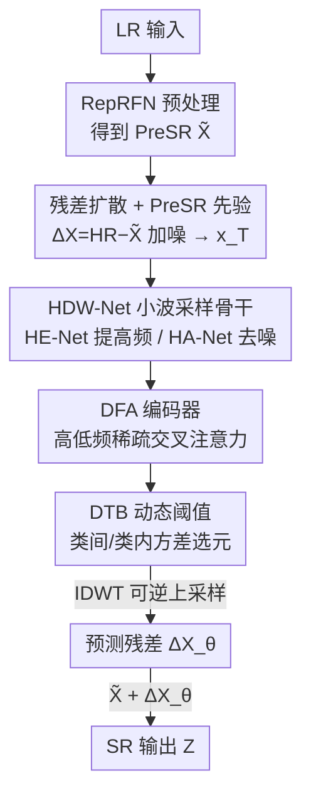

# HDW-SR: High-Frequency Guided Diffusion Model based on Wavelet Decomposition for Image Super-Resolution

**会议**: CVPR 2026  
**论文**: [CVF Open Access](https://openaccess.thecvf.com/content/CVPR2026/html/Yang_HDW-SR_High-Frequency_Guided_Diffusion_Model_based_on_Wavelet_Decomposition_for_CVPR_2026_paper.html)  
**代码**: https://github.com/Baty2023/HDW-SR  
**领域**: 图像恢复 / 扩散模型 / 图像超分辨率  
**关键词**: 单图超分辨率, 扩散模型, 小波分解, 高频引导, 稀疏交叉注意力

## 一句话总结
HDW-SR 用「只对残差扩散 + 小波采样替换 U-Net 卷积 + 高低频稀疏交叉注意力 + 动态阈值选元」的组合，把预超分图像的高频先验显式注入扩散去噪过程，在合成与真实超分数据集上把细节恢复做得更锐利、更自然。

## 研究背景与动机
**领域现状**：单图超分辨率（SISR）要从低分辨率（LR）图像重建高分辨率（HR）图像。近年扩散模型逐步取代 GAN 成为主流——它通过逐步去噪生成图像，能比 GAN 更好地恢复高频纹理，也避开了 GAN 训练不稳、卷积上采样产生棋盘伪影的问题。

**现有痛点**：现有扩散超分方法大多从纯随机噪声出发、经多步去噪生成整张 HR 图，这不仅收敛慢，还让网络把注意力摊在全局结构上、难以聚焦细粒度纹理，结果就是细节被磨平。即便是预训练扩散先验类（StableSR/SeeSR）和残差学习类（ResShift）方法，依旧依赖全局图像特征、缺少显式的高频先验引导，在局部细节和多尺度特征上仍有缺陷（论文 Figure 1 用救生圈纹理举例：整体结构都对、唯独细节糊）。

**核心矛盾**：扩散去噪天生是"全局、低频优先"的过程，而超分最难的恰恰是高频细节；同时常用的 CNN 下采样（池化/带步长卷积）本身就会丢高频，等于在最需要高频的任务里先把高频信息扔掉一部分。

**本文目标**：(1) 让网络把建模能力集中到高频残差上而非整张图；(2) 在采样过程中不丢高频；(3) 给扩散过程提供一个显式、可靠的高频引导信号。

**切入角度**：小波分解能**无损**地把图像拆成低频（结构）与高频（细节）分量，且可逆，因此用它替代 CNN 采样既不丢高频又能做多尺度分解；同时一张由 LR 快速算出的"预超分（PreSR）"图天然带有可用的高频先验，可以拿来引导扩散。

**核心 idea**：只对「HR − PreSR」的残差做扩散，并用小波分解出的 PreSR 高频分量、通过稀疏交叉注意力显式引导扩散网络恢复细节——即"用小波高频先验引导残差扩散"。

## 方法详解

### 整体框架
HDW-SR 是一个**先验引导的残差扩散网络**。给定 LR 图像 $X_i$ 与 HR 图像 $Y_i$：先用轻量 CNN（RepRFN）把 $X_i$ 快速超分成预超分图 $\tilde{X}_i$（PreSR）；再取残差 $\Delta X_i = Y_i - \tilde{X}_i$，扩散过程**只在这个残差图上加噪**，得到纯噪声 $x_T$，这样网络要学的信号动态范围被压窄、注意力被逼向高频。反向去噪时，PreSR $\tilde{X}_i$ 作为引导信号、和噪声序列 $x_t$ 一起喂进 HDW-Net，预测残差 $\Delta X_{\theta,i}$；最后把 $\Delta X_{\theta,i}$ 加回 $\tilde{X}_i$ 得到超分结果 $Z_i$。

关键的替换发生在去噪骨干：HDW-Net **取代了扩散框架里常规的 U-Net**，用小波（Haar）下/上采样替换 CNN 的下/上采样。它由两个子网协同——HE-Net 从 PreSR 中多级小波分解出各尺度高频分量作为"先验库"；HA-Net 对去噪图做小波分解，把自己的低频分量（Q）和 HE-Net 给的高频分量（K/V）送进 DFA 编码器做稀疏交叉注意力，再借助小波变换的可逆性做低损失上采样重建。DFA 内部又用 DTB 动态选出真正要保留的注意力元素。

### 关键设计

**1. 先验引导的残差扩散：只学 HR 与 PreSR 之差**

针对"从纯噪声生成整张图收敛慢、注意力被结构稀释"的痛点，HDW-SR 不直接扩散图像，而是扩散残差。先用轻量 RepRFN 把 LR 预超分成 $\tilde{X}_i \in \mathbb{R}^{H\times W\times 3}$，再取 $\Delta X_i = Y_i - \tilde{X}_i$；扩散正向不断给 $\Delta X_i$ 加噪到 $x_T$，反向用 $\tilde{X}_i$ 当条件去预测残差。因为残差里几乎只剩 PreSR 没补上的高频细节、信号动态范围被显著压窄，网络可以把容量集中在"补细节"而不是"重画结构"，从而更快收敛、更聚焦高频。最终输出 $Z_i = \tilde{X}_i + \Delta X_{\theta,i}$。HA-Net 的去噪目标就是标准的噪声预测损失，但以 PreSR 为条件：

$$L_{HA}(\theta) = \mathbb{E}_{\Delta X,\,t,\,\epsilon}\left[\,\lVert \epsilon - \epsilon_\theta(x_t, t, \tilde{X}) \rVert^2\,\right]$$

**2. HDW-Net：用小波采样替换 U-Net 卷积，HE-Net 与 HA-Net 双网协同**

针对"CNN 下采样丢高频、U-Net 缺显式高频先验"的痛点，HDW-Net 把所有下/上采样都换成 Haar 小波变换。在第 $j$ 级，2D-DWT 把输入分成四个子带：

$$\text{2D-DWT}(\tilde{x}_{j-1}) = \{\tilde{x}_{j,LL},\, \tilde{x}_{j,LH},\, \tilde{x}_{j,HL},\, \tilde{x}_{j,HH}\}$$

其中 $\tilde{x}_{j,LL}$ 是承载结构的低频分量、调整通道后继续向下一级分解；$\{\tilde{x}_{j,LH},\tilde{x}_{j,HL},\tilde{x}_{j,HH}\}$ 合记为高频分量 $\tilde{x}_{j,H}$，捕捉细粒度细节。HE-Net 是一个 U-Net 式的特征提取网络，对 PreSR $\tilde{X}$ 做多级小波下采样、再用 IDWT 逐级重建，并用重建损失约束，保证抽出的小波分量精确可靠，为 HA-Net 提供可信高频引导：

$$L_{HE} = \lVert \tilde{X} - \tilde{X}_\theta \rVert_2 + \lVert \tilde{X} - \tilde{X}_\theta \rVert_1$$

HA-Net 则对去噪图 $x_t$ 做同样的小波分解，把低频子带 $x_t^{j,LL}$ 和 HE-Net 给的高频 $\tilde{x}_{j,H}$ 一起送进编码模块 $E_j$，公式上写作 $x_t^{j+1} = E(x_t^{j,LL}, \tilde{x}_{j,H})$。一个值得注意的细节是上采样阶段的高频来源切换：早期扩散步用 PreSR 的高频 $\tilde{x}_{j,H}$ 引导很有效，但随着 $t\to 0$、$x_t$ 自身已富含高频，此时再过度依赖 PreSR 反而会放大伪细节、扭曲纹理，所以**上采样改用 $x_t$ 自己的高频 $x_t^{j,H}$** 做逆小波变换 $\tilde{x}_{t,\theta}^{j-1} = \text{2D-IDWT}(x_{t,\theta}^{j,LL}, x_t^{j,H})$。小波变换的可逆性保证了这一上采样过程低损失。整体损失把两网加权：$L = \beta L_{HE} + (1-\beta) L_{HA}$，论文取 $\beta = 0.2$。

**3. DFA 编码器：高低频之间的稀疏交叉注意力 + 逐层注意力传播**

针对"如何把 HE-Net 的高频先验高效注入低频去噪特征"，作者设计了 DFA（Dynamic Focused Attention）编码器。增强后的低频特征 $x_t^{j,LL}$（先过两层 Swin-Transformer 增强）作为 Query，HE-Net 的高频引导 $\tilde{x}_{j,H}$ 同时作为 Key 和 Value，做高低频之间的交叉注意力。为降低复杂度，引入稀疏矩阵乘 SMM（记为 $\Psi$），并复用上一层的注意力索引 $I_{l-1}$ 做稀疏索引：

$$A_{oam}^l = \text{Softmax}\big(\Psi(Q^l, (K^l)^\top, I_{l-1})\big)$$

索引按 $I_l = \text{Sign}(A_l)$ 更新。每层把当前过滤后的注意力图 $A_{fam}^l$ 与上一层 $A_{l-1}$ 逐元素相乘再归一化 $A_l = \text{Norm}(A_{l-1} \odot A_{fam}^l)$，这样高频引导信息通过连乘在层间逐级传播；当前层输出 $O_l = \Psi(A_l, V_l, I_l)$。把 DFA block 迭代 $n$ 次，就建立起从 $\tilde{x}_{j,H}$ 到 $x_t^{j,LL}$ 的跨层一致高频引导，既稀疏省算又能保住关键高频信息。

**4. DTB：用类间/类内方差动态定阈，取代固定 Top-k**

针对"稀疏注意力里到底保留多少元素"的问题，作者观察到：由于低频 $x_t^{j,LL}$ 与高频 $\tilde{x}_{j,H}$ 差异显著，归一化注意力矩阵 $A_{oam}^l$ 的元素值常呈**双峰分布**，固定 Top-k 难以贴合这种分布。DTB（Dynamic Thresholding Block）借鉴图像阈值分割里的 Otsu 思想：把 $A_{oam}^l$ 的元素值在 $[0,1]$ 上按 $1/512$ 的间隔做直方图，用可变阈值 $T(k)=k$ 把元素分成两类——$[0,k]$ 内为 $C_1$、其余为 $C_2$，计算类内方差 $\sigma_c^2(k)$ 与类间方差 $\sigma_B^2(k)$，取使类间方差最大的阈值为最优：

$$k^* = \arg\max_k\, \sigma_B^2(k)$$

大于 $k^*$ 的元素置 1、其余置 0，得到动态 MASK，与 $A_{oam}^l$ 逐元素相乘即完成自适应过滤。相比 Top-k 的"硬选固定个数"，DTB 按数据分布自适应选元，既更精确又更省算（见消融表：FLOPs、延迟、单图耗时全部下降）。

### 损失函数 / 训练策略
总损失 $L = \beta L_{HE} + (1-\beta) L_{HA}$，$\beta=0.2$：$L_{HE}$ 用 L1+L2 约束 HE-Net 对 PreSR 的重建质量，$L_{HA}$ 是标准噪声预测损失。训练用 DIV2K 与 LSDIR 的 LR/HR 对，4× 上采样；DFA 模块在三个 stage 分别重复 [2,4,4] 次，Swin-T 解码器为 [4,6,6] 层；Adam 优化器，初始学习率 $1\times10^{-4}$，共 100,000 次迭代，双 RTX 4090 训练。

## 实验关键数据

### 主实验
在合成 DIV2K（3000 张 512×512 裁块）与真实 RealSR / DrealSR 上对比扩散类 SOTA（4×）。HDW-SR 在感知类无参考指标上整体领先，同时保住较高保真度。下表摘取 DIV2K 与 RealSR 的代表行（↑越高越好，↓越低越好）：

| 数据集 | 方法 | PSNR↑ | SSIM↑ | LPIPS↓ | DISTS↓ | NIQE↓ | CLIPIQA↑ | MUSIQ↑ |
|--------|------|-------|-------|--------|--------|-------|----------|--------|
| DIV2K | ResShift (NeurIPS'23) | 24.69 | 0.6175 | 0.3374 | 0.2215 | 6.82 | 0.6089 | 60.92 |
| DIV2K | OSEDiff (NeurIPS'24) | 23.72 | 0.6108 | 0.2941 | 0.1976 | 4.71 | 0.6693 | 67.97 |
| DIV2K | DiT-SR (AAAI'25) | 24.31 | 0.6074 | 0.2913 | 0.1956 | 4.55 | 0.6711 | 69.47 |
| DIV2K | **Ours** | 24.52 | 0.6162 | **0.2823** | **0.1934** | **4.43** | **0.6937** | **69.68** |
| RealSR | SeeSR (CVPR'24) | 25.33 | 0.7273 | 0.2985 | 0.2213 | 5.38 | 0.6204 | 69.37 |
| RealSR | DiT-SR (AAAI'25) | 25.31 | 0.7337 | 0.2863 | 0.2181 | 5.36 | **0.6961** | 65.83 |
| RealSR | **Ours** | **25.71** | **0.7428** | **0.2672** | **0.2044** | 5.39 | 0.6702 | **70.10** |

在 DIV2K 上 HDW-SR 拿下 LPIPS / DISTS / NIQE / CLIPIQA / MUSIQ 五项最优；在 RealSR 上拿下 PSNR / SSIM / LPIPS / DISTS / MUSIQ 五项最优，细节恢复（如船上救生圈、窗框、空腔纹理）明显更锐利自然。与 GAN 类（RealESRGAN/BSRGAN/LDL）相比，HDW-SR 在 NIQE/CLIPIQA/MUSIQ 等无参考指标上全面领先，并在 PSNR/LPIPS 上保持均衡。

### 消融实验
组件消融在 RealSR（4×）上做。第一组验证小波采样（DWT）与 DFA 高频引导：

| 配置 | PSNR↑ | SSIM↑ | CLIPIQA↑ | 说明 |
|------|-------|-------|----------|------|
| CNN+DFA (HE-Net) | 25.16 | 0.7252 | 0.6631 | 用 CNN 采样替代小波 |
| DWT+SwinT (w/o Guidance) | 22.15 | 0.6539 | 0.6127 | 去掉高频引导，掉点最多 |
| DWT+DFA (HA-Net) | 24.39 | 0.6984 | 0.6541 | 引导来自 HA-Net 内部 |
| **DWT+DFA (ours)** | **25.71** | **0.7428** | **0.6702** | 完整模型 |

第二组对比 DTB 与固定 Top-k（含效率指标）：

| 方法 | PSNR↑ | SSIM↑ | CLIPIQA↑ | FLOPs↓ (G) | 延迟↓ (ms/step) | 单图耗时↓ (s) |
|------|-------|-------|----------|-----------|----------------|--------------|
| Top-k | 25.37 | 0.7370 | 0.6629 | 172 | 113 | 1.765 |
| **DTB (ours)** | **25.71** | **0.7428** | **0.6702** | **134** | **91** | **1.435** |

还做了 $\beta$ 敏感性分析（DIV2K）：$\beta=0.2$ 时 PSNR 24.52 最优；$\beta=0.1$ 时各指标退化约 20–30%（PSNR 跌到 18.39）；$\beta\geq0.5$ 时性能崩溃（PSNR 仅 10.30），最优区间约 $\beta=0.2\sim0.3$。

### 关键发现
- **高频引导贡献最大**：去掉引导（DWT+SwinT w/o Guidance）PSNR 从 25.71 暴跌到 22.15，是所有消融里掉点最猛的，说明 HE-Net 提供的显式高频先验是核心。
- **小波采样优于 CNN 采样**：CNN+DFA 比完整模型低 0.55 dB PSNR，印证 CNN 下采样确实在丢高频。
- **引导必须来自 HE-Net 而非 HA-Net 内部**：DWT+DFA(HA-Net) 只有 24.39，说明用一个专门、受重建损失约束的 HE-Net 抽高频，比从去噪网内部自取更可靠。
- **DTB 同时提质又提速**：相比 Top-k，PSNR+0.34、FLOPs 从 172G 降到 134G、单图耗时从 1.765s 降到 1.435s，动态选元比固定选数既准又省。

## 亮点与洞察
- **"只扩散残差"把生成任务转成补差任务**：让扩散网络从"重画整张图"变成"补 PreSR 缺的高频"，信号动态范围变窄、收敛与聚焦都更好——这个思路可迁移到任何有快速粗解的低层视觉任务（去噪、去模糊）。
- **用小波可逆性根治采样丢高频**：把 U-Net 的卷积下/上采样换成 DWT/IDWT，既做多尺度分解又保证低损失重建，是"在最需要高频的任务里不主动丢高频"的干净做法。
- **上采样阶段切换高频来源**是很细的观察：早期靠 PreSR 先验、后期（$t\to0$）改用 $x_t$ 自身高频，避免后期过度依赖先验放大伪纹理，体现了对扩散时间步与频率内容关系的理解。
- **把 Otsu 阈值搬进注意力稀疏化**：观察到注意力矩阵双峰分布，用类间方差最大化自适应定阈替代 Top-k，既符合数据分布又顺带省算，是一个"用经典图像处理思想解决新模块超参"的巧妙迁移。

## 局限与展望
- **依赖 PreSR 质量**：整套高频引导建立在 RepRFN 预超分图之上，若 PreSR 在某些退化下质量很差，残差与高频先验都会受影响（论文未充分讨论极端退化下的鲁棒性）。
- **多步扩散的效率**：虽然 DTB 降低了注意力开销，但论文主体仍是多步扩散框架，单图 1.4s 量级，相比一步法（OSEDiff/AdcSR）在推理速度上不占优；论文未给完整的与一步法的速度并列对比。
- **$\beta$ 高度敏感**：$\beta\geq0.5$ 直接崩溃，说明两损失的平衡很脆，超参鲁棒性有限。
- **小波基固定为 Haar**：论文提到可扩展到四级/五级分解，但未探索不同小波基对不同纹理类型的影响。⚠️ 部分实现细节（如 SMM 的具体稀疏索引实现、PFA/PFA Block 与 DFA 的命名对应）以原文与代码为准。

## 相关工作与启发
- **vs ResShift / SinSR（残差/单步扩散）**: 它们靠缩短马尔可夫链减步数，但仍在图像/全局特征上扩散、缺显式高频先验；HDW-SR 在残差上扩散并显式注入小波高频引导，细节恢复更强。
- **vs StableSR / SeeSR（预训练扩散先验）**: 借 Stable Diffusion 语义先验恢复全局结构，但真实数据上易出畸变与边缘模糊；HDW-SR 不依赖大模型语义先验，靠 PreSR 高频先验在无参考指标上更优。
- **vs ResDiff（频域引导扩散）/ DiWa（小波域扩散）**: ResDiff 在频域引导、DiWa 把扩散搬到小波域但缺残差学习且受输入质量限制；HDW-SR 把小波变换用在**残差扩散**上、并用专门 HE-Net 供高频引导，兼顾残差学习与多尺度高频注入。
- **vs PFT / PFA（稀疏注意力超分）**: DFA 受 PFA 启发做稀疏交叉注意力，但创新点在用 DTB 动态定阈替代固定 Top-k，更贴合注意力矩阵的双峰分布。

## 评分
- 新颖性: ⭐⭐⭐⭐ 残差扩散+小波采样+高低频稀疏交叉注意力+Otsu 动态阈值的组合较新颖，单点多为已有思想的巧妙重组。
- 实验充分度: ⭐⭐⭐⭐ 三数据集、扩散与 GAN 双对比、组件/β/DTB 多组消融且带效率指标，较完整；缺与一步法的速度并列。
- 写作质量: ⭐⭐⭐⭐ 结构清晰、动机到设计逻辑顺；部分符号（PFA/DFA、SMM）命名稍乱。
- 价值: ⭐⭐⭐⭐ "扩散残差+小波保高频+显式高频引导"是可复用的低层视觉范式，对细节敏感的超分场景实用。

<!-- RELATED:START -->

## 相关论文

- [\[CVPR 2026\] Rethinking Diffusion Model-Based Video Super-Resolution: Leveraging Dense Guidance from Aligned Features](rethinking_diffusion_model-based_video_super-resolution_leveraging_dense_guidanc.md)
- [\[CVPR 2026\] DreamSR: Towards Ultra-High-Resolution Image Super-Resolution via a Receptive-Field Enhanced Diffusion Transformer](dreamsr_towards_ultra-high-resolution_image_super-resolution_via_a_receptive-fie.md)
- [\[CVPR 2026\] ReasonX: MLLM-Guided Intrinsic Image Decomposition](reasonx_mllm-guided_intrinsic_image_decomposition.md)
- [\[CVPR 2026\] FiDeSR: High-Fidelity and Detail-Preserving One-Step Diffusion Super-Resolution](fidesr_high-fidelity_and_detail-preserving_one-step_diffusion_super-resolution.md)
- [\[CVPR 2026\] GDPO-SR: Group Direct Preference Optimization for One-Step Generative Image Super-Resolution](gdpo-sr_group_direct_preference_optimization_for_one-step_generative_image_super.md)

<!-- RELATED:END -->
