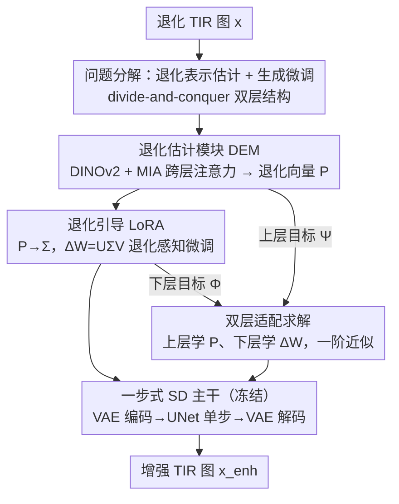

# HiDRA: Hierarchical Degradation Representation and Adaptation with Generative Priors for Enhancing Infrared Vision

**会议**: CVPR 2026  
**论文**: [CVF Open Access](https://openaccess.thecvf.com/content/CVPR2026/html/Chen_HiDRA_Hierarchical_Degradation_Representation_and_Adaptation_with_Generative_Priors_for_CVPR_2026_paper.html)  
**代码**: https://github.com/ZihangChen/HiDRA  
**领域**: 图像恢复 / 热红外增强  
**关键词**: 热红外增强、退化表示、生成先验、LoRA微调、双层优化

## 一句话总结
HiDRA 把热红外（TIR）图像增强拆成「退化表示估计 + 生成模型微调」两层任务：用一个退化估计模块（DEM）从退化图像里反推出热红外特有的退化向量，再让这个向量去调制一步式 Stable Diffusion 的 LoRA 参数，并用双层（bi-level）优化在多种退化等级上联合训练，从而在 FPN 噪声、盲超分、复合退化和真实跨设备退化上都显著超过现有 SOTA。

## 研究背景与动机

**领域现状**：热红外成像靠探测物体热辐射成像，在恶劣天气、极端光照下能稳定看清显著目标，是多模态感知、自动驾驶、远程搜救的重要传感器。但受光学系统、材料、温度与反射等限制，TIR 图像普遍带有复合且动态的退化——固定模式噪声（FPN）、低分辨率、纹理模糊、低对比度。传统方法（直方图均衡、自适应滤波、小波变换）需手工调参且计算量大；学习类方法多针对单一退化（去噪、超分）设计。

**现有痛点**：要处理复合退化，已有综合框架（如 DEAL、PPFN）本质仍是**确定性回归模型**，难以刻画 TIR 退化复杂、不确定、跨等级变化的分布。另一边，预训练扩散模型（如 Stable Diffusion）凭大规模预训练在可见光低层视觉上恢复细节能力很强，但**直接搬到 TIR 上水土不服**：TIR 在色彩空间、强度分布、纹理上和可见光差异巨大，而朴素 LoRA 微调又容易过拟合训练分布，迁移效果差。

**核心矛盾**：生成先验很强但来自可见光域；TIR 退化既复杂又随场景剧烈变化。缺一个**能感知具体退化、并据此自适应调制生成模型**的机制——固定的低秩 LoRA 参数无法覆盖 TIR 退化的全谱。

**本文目标**：在保留预训练扩散生成先验的前提下，让微调过程「知道当前图像退化成什么样」，并对不同退化等级都保持鲁棒。

**切入角度**：采用「分而治之」——把增强问题显式分解为上层的退化表示估计和下层的退化条件化微调，用双层优化把两者耦合起来，让退化估计去引导（而非替代）LoRA 的更新方向。

**核心 idea**：用 DEM 估计出的退化向量 $P$ 去生成一个动态调制矩阵 $\Sigma$ 插进 LoRA，使 $\Delta W = U\Sigma V$ 变成「退化感知」的，再用双层优化在多种退化采样上训练，得到能区分退化类型/等级的判别性表示。

## 方法详解

### 整体框架
HiDRA 的骨架是一个**一步式 Stable Diffusion**（SD Turbo）：退化图 $x$ 经 VAE 编码到隐空间 $z_x$，UNet $\epsilon_W$ 一步采样得增强隐变量 $z_{enh} = \frac{z_x - \sqrt{1-a}\,\epsilon_W(z_x)}{\sqrt{a}}$，再由 VAE 解码出增强图 $x_{enh}$。整套 backbone 冻结，只通过 LoRA 注入适配能力。

关键在于这条主干被两件事「包裹」起来：(1) 一个**退化估计模块 DEM**（记 $N_G$，参数 $\omega$）从退化图里反推出潜在退化向量 $P$；(2) 这个 $P$ 去**调制 LoRA**（记增量 $\Delta W$），让微调方向随退化变化。两者通过双层优化耦合：上层学退化表示、下层学增强微调，整体目标写作

$$\min_\omega \Psi\big(u,\, N_E(x;\Delta W^*(N_G(x;\omega)));\, D_{val}\big),\quad \text{s.t.}\ \Delta W^* = \arg\min_{\Delta W}\Phi\big(u,\, N_E(x;\Delta W(P));\, D_{tr}\big)$$

其中 $N_E$ 是冻结的生成主干，$\Phi/\Psi$ 是训练/验证目标。这里「训练/验证」指双层优化里的下层/上层角色，并非数据划分——两者都从训练集按不同退化设置构造。

### 关键设计

**1. 把增强拆成退化表示估计 + 生成微调的双层分解：让微调「知道」退化长什么样**

现有综合框架是确定性回归，一个网络直接吃退化图吐增强图，没法显式建模「当前是什么退化」。HiDRA 从分而治之出发，把问题写成式 (1)(2) 的双层优化：上层 $N_G$（DEM）在验证目标 $\Psi$ 下学退化表示，下层 $\Delta W$（LoRA）在训练目标 $\Phi$ 下做退化条件化微调。上层学到的退化隐空间动态引导下层微调，使 LoRA 在退化隐空间内调参，从而抑制对训练分布的过拟合、提升对变化退化的适应性。与那些把退化估计器冻结在可见光域的工作不同，HiDRA 用一个分解结构**联合优化**退化估计与基础模型，让两者互相校准。

**2. 退化估计模块 DEM 与 Mutual Interaction Attention：从单图反推热红外退化向量**

TIR 退化复合且动态，直接建模很难。DEM 借助 DINOv2 强特征提取能力拿到可泛化的退化表示，再用 **MIA（Mutual Interaction Attention）** 跨层聚合细粒度信息。给定 backbone 的 $L$ 层特征 $f_i\in\mathbb{R}^{C\times H\times W}$，堆叠成 $F=\text{Stack}(f_i)\in\mathbb{R}^{L\times C\times H\times W}$，再重排成 $F\in\mathbb{R}^{(LC)\times H\times W}$ 以在保持空间分辨率的同时做密集跨层交互。经三组卷积映射 $W_Q,W_K,W_V$ 得到层级的查询/键/值 $F_Q\in\mathbb{R}^{L\times(CHW)}$、$F_K\in\mathbb{R}^{(CHW)\times L}$、$F_V\in\mathbb{R}^{L\times(CHW)}$，做**层维（layer-wise）自注意力**：

$$F' = W_O\cdot \text{Softmax}(F_Q F_K)\cdot F_V + F$$

注意力图形状为 $L\times L$，即在「不同层之间」而非空间位置上建相互作用，捕捉退化在多尺度上的统计。最后经 head（全局平均池化 + 两层 MLP）得到退化向量 $P=\text{Head}(F')$。这一向量是后续调制 LoRA 的钥匙，比朴素 LoRA 多了「退化是什么」这一条件信息。

**3. 退化引导 LoRA：用退化向量生成动态调制矩阵 Σ，让 ΔW 随退化转向**

朴素 LoRA 把更新写成 $W' = W + \Delta W = W + UV$，$U\in\mathbb{R}^{d\times r}$、$V\in\mathbb{R}^{r\times k}$ 为固定低秩矩阵。但固定低秩参数无法自适应覆盖 TIR 退化的全谱。HiDRA 在中间插入一个**动态参数 $\Sigma\in\mathbb{R}^{r\times r}$**，由退化向量 $P$ 经一个两层 MLP 算出：

$$W' = W + \Delta W = W + U\Sigma V$$

$\Sigma$ 编码了 DEM 估计的退化信息，从而保证 $\Delta W$ 的更新方向是退化感知的——同一套 $U,V$ 在不同退化下被 $\Sigma$ 调制出不同的有效更新，等于让 LoRA「按退化场景定制响应」。这把退化估计和参数适配真正打通：预测退化→调制更新方向→针对性增强。

**4. 双层适配求解与一阶近似：在多种退化采样上稳定训练**

双层目标里下层 $\Delta W$ 用训练集 $D_{tr}$ 优化（对干净 TIR 随机施加退化以增强迁移性），上层 $N_G$ 用 $D_{val}$ 优化——每个样本的 $D_{val}$ 含 $M$ 条退化管线、退化类型与强度各异，逼 $N_G$ 去建模退化**分布**而非记住单实例特征。但直接交替优化式 (1)(2) 不稳定，于是引入**一阶近似**：增强阶段先做 $T$ 步梯度下降逼近 $\Delta W^*$，

$$\Delta W^{(t)} = \Delta W^{(t-1)} - \nabla_{\Delta W}\Phi(u;\Delta W^{(t-1)}(P))$$

上层梯度 $G_\Psi$ 含直接项和嵌套项（DEM 与微调网络间的隐式耦合），用隐式一阶近似把高阶计算简化为只依赖一阶梯度的比值形式，再多次更新构成单循环（整体见 Alg. 1）。这让原本难解的双层问题可高效、稳定求解。

### 损失函数 / 训练策略
上下层目标 $\Phi$ 与 $\Psi$ 共用同一损失：像素级 $\ell_2$、感知损失、对抗损失，权重分别为 2、5、0.5。在 HM-TIR 数据集（1503 张 TIR 图）上基于 SD Turbo 训练，A800 单卡，Adam（$\beta_1{=}0.9,\beta_2{=}0.999$）、学习率 $2\times10^{-5}$、batch 2、随机 512×512 裁剪 + 水平翻转，共 30k 步。编码器与 UNet 用 LoRA 微调（秩 16 / 32），解码器冻结，不使用 caption；DEM 用 ViT-Base backbone；设 $T{=}4$、$M{=}2$。

## 实验关键数据

### 主实验
典型 TIR 退化分两类任务：固定模式噪声（FPN）校正与盲超分（Blind SR）。HiDRA 在全部 5 个指标上取得最优：

| 任务 | 指标 | 本文 | 最强竞品 |
|------|------|------|----------|
| FPN 校正 | LPIPS↓ | **0.127** | PPFN 0.159 |
| FPN 校正 | DISTS↓ | **0.097** | PPFN 0.147 |
| FPN 校正 | FID↓ | **45.08** | PPFN 69.73 |
| FPN 校正 | MANIQA↑ | **0.572** | DMRN 0.497 |
| 盲超分 | LPIPS↓ | **0.119** | CDFormer 0.207 |
| 盲超分 | FID↓ | **36.80** | CDFormer 54.56 |
| 盲超分 | MANIQA↑ | **0.556** | DifIISR 0.552 |

复合退化按 mild / moderate / severe / extreme 四档评测，HiDRA 随严重度上升仅有边际波动，鲁棒性远好于竞品：

| 退化等级 | 指标 | 本文 | DifIISR | PPFN |
|----------|------|------|---------|------|
| Mild | LPIPS↓ | **0.160** | 0.298 | 0.371 |
| Moderate | LPIPS↓ | **0.193** | 0.351 | 0.419 |
| Severe | LPIPS↓ | **0.187** | 0.358 | 0.511 |
| Extreme | LPIPS↓ | **0.230** | 0.428 | 0.550 |

真实世界跨设备退化（TNO / RoadScene / MSRS），采用融合指标 MI/SCD/VIF/QAB/F，HiDRA 几乎全部取得最优或次优，MI 与 VIF 在三数据集上均最高（如 MSRS：MI 2.4897、SCD 1.5627、VIF 0.6123），优于 DiffBIR/PASD/OSEDiff/PISA 等 SD-based 方法与 DEAL/PPFN。

### 消融实验

| 配置 | 任务 | LPIPS↓ | MANIQA↑ | 说明 |
|------|------|---------|---------|------|
| LoRA（无 DEM） | — | 较差 | 较差 | 去掉退化估计退化为朴素 LoRA（Fig.6 显示明显劣化） |
| w/o MIA | — | 较差 | 较差 | 去掉跨层交互注意力，退化表示变弱 |
| Alter.（交替优化） | FPN | 0.129 | 0.556 | 不用一阶近似、上下层交替 |
| Joint（无上层目标） | FPN | 0.128 | 0.569 | DEM 与主干联合训练但无双层 |
| Ours | FPN | **0.127** | **0.572** | 完整双层 + 一阶近似 |
| Ours | 盲超分 | **0.119** | **0.556** | 同上 |

退化管线数 $M$：从 2→3 各指标一致提升（FPN MANIQA 0.553→0.571），再增到 4 收益不稳，故主实验取较小 $M$（含计算约束）。

### 关键发现
- **退化估计是核心收益来源**：去掉 DEM（退化为朴素 LoRA）或去掉 MIA 都显著掉点，说明「让微调知道退化是什么」比单纯加参数更关键。
- **双层 + 一阶近似比交替/联合更稳更好**：Alter. 在 FPN MANIQA 上仅 0.556、盲超分 0.530，明显低于 Ours，验证一阶近似带来的稳定性。
- **退化表示可判别**：t-SNE 显示无双层学习时 DEM 无法区分退化类型/等级，加入双层后形成清晰簇（Fig.7），直接解释了为何对变化退化更鲁棒。
- **复合退化下几乎不掉点**：从 mild 到 extreme，LPIPS 只从 0.160 升到 0.230，而竞品翻倍恶化。

## 亮点与洞察
- **退化向量调制 LoRA（$U\Sigma V$）很巧**：不改 LoRA 的低秩结构，只在中间插一个由退化向量算出的小矩阵 $\Sigma$，就把「静态适配」变成「按退化定制的动态适配」，参数代价极小，思路可迁移到任何 PEFT 需要条件化的场景。
- **把增强写成双层优化**：上层学「退化是什么」、下层学「怎么修」，并联合而非冻结退化估计器，是对「退化估计与恢复应当互相校准」这一直觉的清晰落地。
- **MIA 在层维而非空间维做注意力**：注意力图为 $L\times L$，专门聚合多层级退化统计，是一个针对「退化是全局统计而非局部内容」的合理设计。
- **跨域适配只学机制不改架构**：用一步式 SD + LoRA 保留可见光生成先验，靠退化感知机制弥合域差，避免重训大模型。

## 局限与展望
- **依赖单一训练集与合成退化**：训练只用 HM-TIR（1503 张）+ 随机合成退化构造 $D_{tr}/D_{val}$，真实退化分布是否被合成管线充分覆盖存疑。
- **$M$ 受计算约束**：$M$ 的研究在 256×256 patch 上做，且 $M{=}4$ 收益不稳，退化管线数量的可扩展性有限。
- **双层优化成本**：每轮要先 $T$ 步逼近 $\Delta W^*$ 再更新上层，训练开销高于单层方法（论文未给完整训练时长/显存对比）。
- **一步式 SD 的上限**：为效率用 SD Turbo 单步采样，极端退化下的细节重建上限可能不及多步扩散，可探索少步采样的折中。

## 相关工作与启发
- **vs DEAL / PPFN（综合 TIR 增强框架）**：它们是确定性回归模型，难以建模 TIR 复合退化的复杂分布；HiDRA 引入生成先验 + 退化感知双层适配，在复合/极端退化上鲁棒性大幅领先。
- **vs 朴素 LoRA 微调**：朴素 LoRA 固定低秩、易过拟合可见光预训练分布；HiDRA 用 $\Sigma$ 把退化信息注入更新方向，缓解过拟合并提升跨退化适应。
- **vs SD-based 真实超分（DiffBIR/PASD/OSEDiff/PISA）**：这些方法过拟合可见光先验、在 TIR 上引入伪影；HiDRA 针对热红外特性做适配，在真实跨设备退化的融合指标上更优。
- **vs 冻结退化估计器的工作**：HiDRA 联合优化退化估计与基础模型，让两者互相校准而非各自为政。

## 评分
- 新颖性: ⭐⭐⭐⭐ 退化向量调制 LoRA + 双层适配的组合在 TIR 增强上是清晰且少见的设计
- 实验充分度: ⭐⭐⭐⭐ 典型/复合/真实三类退化 + 下游分割，消融含 t-SNE 与训练策略对比
- 写作质量: ⭐⭐⭐⭐ 公式与双层逻辑清楚，但部分近似推导偏简
- 价值: ⭐⭐⭐⭐ 给「把可见光生成先验迁到红外」提供了可复用的退化感知适配范式

<!-- RELATED:START -->

## 相关论文

- [\[CVPR 2026\] EVLF: Early Vision-Language Fusion for Generative Dataset Distillation](evlf_early_vision-language_fusion_for_generative_dataset_distillation.md)
- [\[CVPR 2026\] Degradation-Consistent Test-Time Adaptation for All-in-One Image Restoration](degradation-consistent_test-time_adaptation_for_all-in-one_image_restoration.md)
- [\[NeurIPS 2025\] Enhancing Infrared Vision: Progressive Prompt Fusion Network and Benchmark](../../NeurIPS2025/image_restoration/enhancing_infrared_vision_progressive_prompt_fusion_network_and_benchmark.md)
- [\[CVPR 2026\] UDAPose: Unsupervised Domain Adaptation for Low-Light Human Pose Estimation](udapose_unsupervised_domain_adaptation_for_low_light_human_pose_estimation.md)
- [\[CVPR 2026\] Degradation-Robust Fusion: An Efficient Degradation-Aware Diffusion Framework for Multimodal Image Fusion in Arbitrary Degradation Scenarios](degradation-robust_fusion_an_efficient_degradation-aware_diffusion_framework_for.md)

<!-- RELATED:END -->
