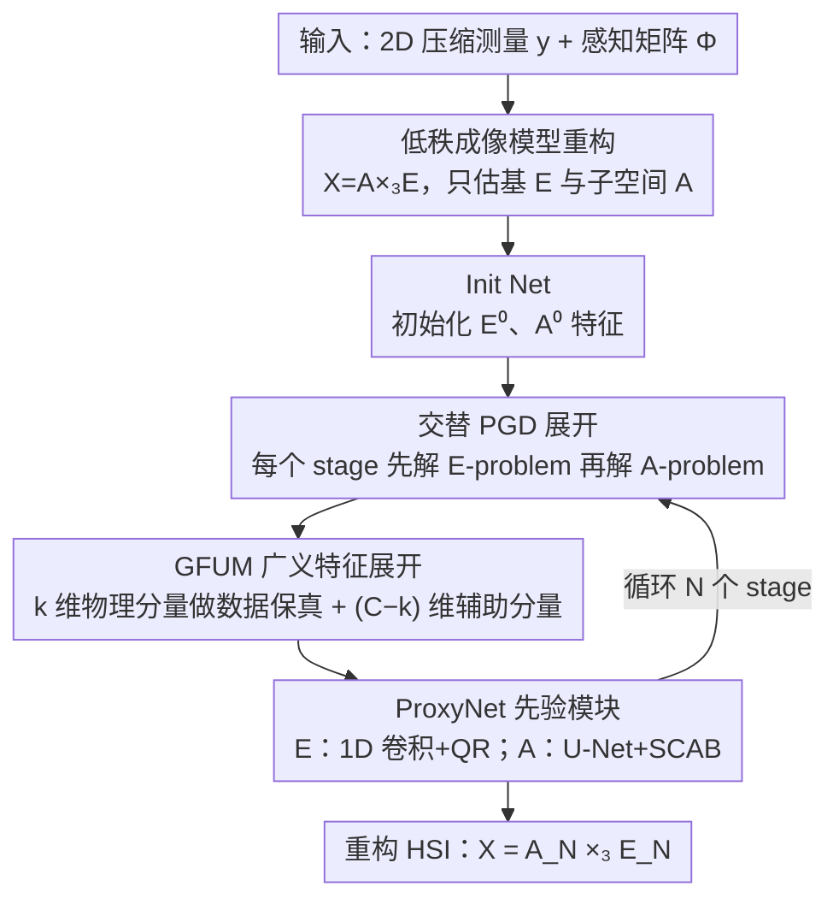

# LRDUN: A Low-Rank Deep Unfolding Network for Efficient Spectral Compressive Imaging

**会议**: CVPR 2026  
**论文**: [CVF Open Access](https://openaccess.thecvf.com/content/CVPR2026/html/Huang_LRDUN_A_Low-Rank_Deep_Unfolding_Network_for_Efficient_Spectral_Compressive_CVPR_2026_paper.html)  
**代码**: https://github.com/huang-he99/LRDUN  
**领域**: 图像恢复 / 光谱压缩成像 / 深度展开网络  
**关键词**: 高光谱重建, CASSI, 低秩分解, 深度展开, 近端梯度下降

## 一句话总结
把高光谱图像（HSI）的低秩分解 $X=A\times_3 E$ 直接嵌进 CASSI 的成像（感知）模型，让网络不再去重建整块高维数据立方体，而是交替求解维度低得多的「光谱基 $E$」和「空间子空间图 $A$」两个子问题；据此把近端梯度下降（PGD）展开成 LRDUN，并用 GFUM 解耦物理秩与特征维度，在 KAIST 上以 30.58 GFLOPs 的代价拿到 40.96 dB 的 SOTA PSNR，算力比同档方法低一截。

## 研究背景与动机

**领域现状**：光谱压缩成像（SCI），尤其是 CASSI（编码孔径快照光谱成像），用一次曝光把整个 HSI 数据立方体压成一张 2D 测量 $Y$，把负担从硬件采集转移到计算重建。当前主流重建范式是深度展开网络（DUN）——把 PGD/ADMM/HQS 这类迭代优化算法「展开」成若干可训练 stage，每个 stage 交替执行一次数据保真（线性更新）和一次深度先验（可学习去噪），既保留了模型方法的可解释性，又有端到端学习的精度。

**现有痛点**：现有 DUN 全都建立在「全 HSI 成像模型」上——每个 stage 都直接在高维数据立方体 $X\in\mathbb{R}^{H\times W\times B}$ 上操作，要从单张 2D 测量里把整块 3D 立方体精修出来。这带来两个问题：一是**算力冗余**，每个 stage 都在 $H\times W\times B$ 这么大的空间里折腾；二是**病态性严重**，把 2D 残差反投影回 3D 空间，未知数（$H\times W\times B$ 个）远多于观测，维度鸿沟巨大，每个展开 stage 都在解一个高度欠定的逆问题。

**核心矛盾**：HSI 本身有很强的光谱相关性、天然低秩，但已有工作只把低秩当成「附加正则项」或「后处理模块」（如核范数损失、TSVD 层、子空间蒸馏 SP），并没有改动数据保真项里的全 HSI 成像模型。结果重建变量的高维度始终没降下来，病态性和算力负担都还在。

**本文目标**：(1) 从源头改写成像模型，把高维重建变成低维子问题；(2) 据此设计一个既可解释又高效的展开网络；(3) 解决展开后「物理秩约束网络表达力」的副作用。

**切入角度**：与其把低秩当外挂正则，不如把低秩分解 $X=A\times_3 E$ **直接代进感知方程**，让网络一开始要估的就是紧凑的 $E$ 和 $A$，而不是整块 $X$。因为物理秩 $k\ll B$，未知数数量骤减，病态性天然被缓解。

**核心 idea**：把感知模型本身按低秩重参数化为「光谱基成像模型」和「子空间成像模型」两个低维子问题，用展开的交替 PGD 联合求解，并用 GFUM 把物理秩从特征维度里解放出来。

## 方法详解

### 整体框架
LRDUN 要解决的是：给定一张 2D 压缩测量 $y$ 和已知的 CASSI 感知矩阵 $\Phi$，重建出高光谱立方体 $X$。它的关键转变是**不直接估 $X$**，而是借低秩分解 $X=A\times_3 E$（$E\in\mathbb{R}^{B\times k}$ 是光谱基，$A\in\mathbb{R}^{H\times W\times k}$ 是子空间图，$k$ 是物理秩且 $k\ll B$）把感知方程改写成只关于 $E$ 和 $A$ 的两个低维成像模型。整网把求解这两个子问题的交替 PGD 展开成 $N$ 个 stage：先由 Init Net 给出初始特征 $E^0_{\text{feat}},A^0_{\text{feat}}$，每个 stage 内先解 E-problem（更新光谱基）再解 A-problem（更新子空间），每个子问题各包含一次基于 GFUM 的数据保真特征项 + 一次可学习的 ProxyNet 先验精修；跑完 $N$ 个 stage 后由末级的 $E_N,A_N$ 重组出 $X=A_N\times_3 E_N$。

### 关键设计

**1. 低秩成像模型重构：把低秩分解直接代进感知方程，从源头降维**

针对「全 HSI 模型导致维度鸿沟、病态严重」这个痛点，作者不把低秩当正则，而是把它揉进成像物理本身。CASSI 的原始向量化成像模型是 $y=\Phi x+n$，其中 $x=\mathrm{vec}(X)$ 要解 $N=H\times W\times B$ 个未知数。借助 HSI 的光谱低秩性写出 $X=A\times_3 E$（矩阵形式 $X_{(3)}=EA_{(3)}^\top$），再利用向量化恒等式 $\mathrm{vec}(UVW)=(W^\top\otimes U)\,\mathrm{vec}(V)$，分别令 $(U,V,W)=(A,E^\top,I_B)$ 和 $(I_{HW},A,E^\top)$，就得到两个互补的成像模型：

$$y=\Phi_A e+n,\qquad y=\Phi_E a+n,$$

其中 $e=\mathrm{vec}(E^\top)$、$a=\mathrm{vec}(A)$，$\Phi_A=\Phi(I_B\otimes A)$、$\Phi_E=\Phi(E\otimes I_{HW})$ 是两个子问题各自的感知矩阵。这样重建目标从「整块 $X$」变成「估 $E\in\mathbb{R}^{B\times k}$ 和 $A\in\mathbb{R}^{HW\times k}$」，由于 $k\ll B$，未知数大幅减少——光谱基 $E$ 捕获全局光谱相关性与材质特征，子空间图 $A$ 编码高频空间结构与局部光谱稀疏性。这一步是后续一切高效与稳健的根，消融里它单独就把 PSNR 从 38.16 提到 39.44 dB、FLOPs 砍掉 61.9%。

**2. 交替 PGD 展开：把两个子问题的迭代优化展开成可学习的 N-stage 网络**

有了两个低维成像模型，作者把 SCI 写成联合优化目标

$$\min_{e,a}\ \tfrac12\|y-\Phi_A e\|_2^2+\tfrac12\|y-\Phi_E a\|_2^2+\lambda_e R_e(e)+\lambda_a R_a(a),$$

并用近端梯度下降交替更新 $e$ 和 $a$。E-problem 固定 $a_i$ 解关于 $e$ 的二次问题：先走梯度步 $e^{i+1/2}=e^i-\rho_e\Phi_{A_i}^\top(\Phi_{A_i}e^i-y)$，再套近端算子 $e^{i+1}=\mathrm{prox}_{\lambda_e\rho_e,R_e}(e^{i+1/2})$；A-problem 对称地更新 $a$。把每一次迭代映成一个网络 stage：梯度步对应物理驱动的数据保真项（$D_E,D_A$），近端步实现为可学习先验模块（ProxyNet E / ProxyNet A）。这样网络既继承了 PGD 的可解释结构（每步都对应明确的物理意义），又能端到端训练。$N$ 越大重建越好但算力线性增长，文中给出 $N=3/6/9$ 三档以适配不同算力预算。

**3. GFUM 广义特征展开机制：解开物理秩对网络表达力的死锁**

直接展开有个隐患：数据保真项定义在 $k$ 维物理空间里，于是 ProxyNet 的输入输出也被钉死在这个 $k$ 维流形上，表达力被严重限制，学不动复杂的空谱依赖。GFUM 的做法是把 $k$ 维优化变量抬升到 $C$ 维特征（$C\ge k$），并把特征**显式切成两半**：前 $k$ 维是「物理分量」，参与数据保真（如 $E^i=E^i_{\text{feat}}(:k)\to E^{i+1/2}=D_E(E^i,y,\Phi,A_i)$）；后 $(C-k)$ 维是「辅助分量」，在数据保真项里被原样保留（$E^{i+1/2}_{\text{aux}}=E^i_{\text{aux}}$），拼回 $E^{i+1/2}_{\text{feat}}=[E^{i+1/2};E^{i+1/2}_{\text{aux}}]$ 后一起送进 ProxyNet 精修。关键在于这个辅助分量虽简单却很重要——可视化显示它隐式学到了空间变化的信息：近端参数、噪声残差、重建伪影，甚至编码了 CASSI 的物理掩膜，从而帮物理分量恢复细节、抑噪。这等于把「保持物理一致性」和「拥有充分表达力」解耦：物理秩 $k$ 管保真，特征维度 $C$ 管容量，各管各的。

**4. ProxyNet 先验模块：按光谱/空间各自结构设计两支轻量先验网**

两个子问题的先验模块结构不同，分别贴合 $E$、$A$ 的物理属性。ProxyNet E 是轻量 1D 架构：用堆叠的 1D 卷积 + GELU + 残差短路来建模局部光谱相关性，并对物理分量 $E$ 做 **QR 分解强制列正交**（$E^\top E=I$），保证光谱基的正交性、稳住分解的良态。ProxyNet A 是 U-Net 架构，用对称的空间卷积注意力块（SCAB）和上/下采样块来建模子空间特征里的空间依赖；SCAB（见原文 Fig.3）走「类卷积注意力」路线，核心是一个 $11\times11$ 的深度可分卷积，用很大的感受野高效建模长程依赖、选择性增强特征——消融里它被认为是恢复清晰纹理与边缘、抑制过平滑的主要功臣。

### 损失函数 / 训练策略
采用多 stage RMSE 损失，对每个 stage 的重建都施加监督。PyTorch 实现，单张 RTX 4090 训练；Adam 优化器，初始学习率 $4\times10^{-4}$，余弦退火，300 epoch，batch size 2。全部实验固定物理秩 $k=11$、特征维度 $C=16$，stage 数取 $N=3/6/9$ 对应不同模型规模。

## 实验关键数据

数据集：模拟实验在 CAVE 上训练、KAIST 的 10 个场景（各裁到 $256\times256$）上测试，沿用 TSA-Net 的 $256\times256$ 真实编码掩膜；真实实验用 CASSI 系统采的 5 张真实测量（空间尺寸 $660\times714$）。

### 主实验（KAIST 10 场景平均 PSNR/SSIM + 算力）

| 方法 | 来源 | Params (M) | FLOPs (G) | PSNR (dB) | SSIM |
|------|------|-----------|-----------|-----------|------|
| RDLUF-9stg | CVPR 2023 | 1.81 | 115.34 | 39.57 | 0.974 |
| DPU-9stg | CVPR 2024 | 2.85 | 49.26 | 40.52 | 0.977 |
| SSR-L | CVPR 2024 | 5.18 | 78.93 | 40.69 | 0.978 |
| LADE-DUN-9stg | ECCV 2024 | 2.78 | 88.68 | 40.09 | 0.979 |
| MiJUN-9stg | AAAI 2025 | 0.56 | 73.67 | 40.86 | 0.982 |
| **LRDUN-3stg** | Ours | 0.69 | **10.26** | 39.44 | 0.972 |
| **LRDUN-6stg** | Ours | 1.37 | 20.45 | 40.30 | 0.976 |
| **LRDUN-9stg** | Ours | 2.04 | 30.58 | **40.96** | 0.982 |
| **LRDUN-9stg\*** | Ours | **0.25** | 30.58 | 40.75 | 0.979 |

LRDUN-9stg 以 40.96 dB 拿下最高平均 PSNR，超过此前最好的 DUN（MiJUN-9stg 40.86、SSR-L 40.69）。更关键的是算力：RDLUF-9stg、MiJUN-9stg 靠跨 stage 参数共享把参数压小，但 FLOPs 反而高得多（115.34 / 73.67 G）；LRDUN-9stg 只要 30.58 GFLOPs 就达到更高精度。带星号的 LRDUN-9stg\* 也用了同样的跨 stage 参数共享策略，参数仅 0.25 M，精度几乎不掉（40.75 dB），印证了架构的高效与可扩展。即便最小的 LRDUN-3stg，也以 10.26 GFLOPs / 0.69 M 拿到 39.44 dB，落在精度-效率折中曲线的左上角（原文 Fig.1）。

### 消融实验

**低秩嵌入策略（Table 2，3-stage）**

| 配置 | PSNR (dB) | Params (M) | FLOPs (G) | 说明 |
|------|-----------|-----------|-----------|------|
| Baseline-1 | 38.16 | 1.87 | 26.95 | 仅 ProxyNetA 直接处理全 HSI |
| w. NNL | 37.66 | 1.87 | 26.95 | 加核范数损失，训练不稳反掉点 |
| w. TSVD | 37.93 | 1.87 | 26.95 | 插 TSVD 层，同样训练不稳 |
| w. SP-1 | 38.33 | 1.87 | 26.95 | 子空间蒸馏后处理，略升但仍依赖全 HSI 重建 |
| w. SP-2 | 38.52 | 1.87 | 26.95 | SP 变体 |
| **LRDUN** | **39.44** | **0.69** | **10.26** | 重构成像模型，精度↑且 FLOPs −61.9% |

**注意力机制（Table 3，LRDUN-3stg）**

| 配置 | PSNR (dB) | Params (M) | FLOPs (G) | 说明 |
|------|-----------|-----------|-----------|------|
| Baseline-2 | 37.48 | 0.56 | 7.55 | 去掉 SCAB |
| W-MSpaA | 39.13 | 0.74 | 9.73 | 窗口空间注意力 |
| W-MSpeA | 39.02 | 0.74 | 9.70 | 窗口光谱注意力 |
| HS-MSA | 39.31 | 0.74 | 9.89 | Half-Shuffle 注意力 |
| **SCAB** | **39.44** | 0.69 | 10.26 | 本文，类卷积注意力 |

### 关键发现
- **降维比加正则更管用**：把低秩当外挂正则（NNL/TSVD）反而因训练不稳掉点，当后处理（SP）只小升且仍背着全 HSI 重建的算力包袱；只有把低秩写进成像模型本身才能既涨精度又省 61.9% 算力。这是全文最核心的实证。
- **GFUM 里特征维度 $C$ 越大越好但要折中**：固定 $k=11$ 增大 $C$，PSNR 单调上升（验证表达力扩张），但 FLOPs 也涨，故默认 $C=16$。可视化（Fig.7）显示物理分量主要抓结构语义（物体轮廓、logo），辅助分量编码高频纹理、前背景分离与掩膜感知线索，二者互补。
- **物理秩 $k$ 有最优值**：固定 $C=16$ 变 $k$，性能先升后饱和甚至下降——$k$ 太小建模不了 HSI 光谱多样性，$k$ 太大又压缩了辅助分量维度 $(C-k)$，最终取 $k=11$。
- **强泛化**：在真实数据上，把模拟实验训练的 LRDUN-9stg(simu) 不做任何微调直接用，仍能保持空间结构与光谱一致性，作者把这归功于低秩重构对病态性的根本缓解。

## 亮点与洞察
- **把先验「焊进物理」而非「挂在外面」**：以往低秩只是正则项/后处理，本文直接重写感知矩阵 $\Phi_A,\Phi_E$，让网络从第一步就在低维空间里解题。这个「改成像模型本身」的思路可迁移到其他逆问题（MRI、CT、去马赛克）——凡是目标信号有强结构先验、又被高维拖累的重建任务，都值得想想能不能把先验代进前向算子。
- **GFUM 的「物理分量 + 辅助分量」切分很巧**：它一句话化解了展开网络的通病——物理约束维度太低、网络学不动。保留 $k$ 维做保真、富余 $(C-k)$ 维当「信息载体」自由学，等于在不破坏可解释性的前提下偷偷给网络扩容，可视化还证明辅助分量真的学到了掩膜/噪声等物理量。
- **两支 ProxyNet 各按物理属性定制**：光谱基用 1D 卷积 + QR 正交化（守住基的正交性），子空间图用 U-Net + 大核 SCAB（守住空间长程依赖），结构选择都有物理理由，不是随手堆模块。
- **精度-效率折中是实打实的**：同样 9 stage，FLOPs 比 RDLUF 低近 4 倍、比 MiJUN 低一半还多，PSNR 反而更高。

## 局限与展望
- **物理秩 $k$ 需手工选**：$k=11$ 是在 CAVE/KAIST 上调出来的最优，换数据集/波段数是否还合适、能否自适应估 $k$，文中未深入。
- **依赖已知感知矩阵 $\Phi$ 与掩膜标定**：和多数 CASSI DUN 一样，假定 $\Phi$ 准确已知；真实系统掩膜误差/失配对低秩重参数化的影响没单独评测。
- **评测仍是经典 CAVE→KAIST 小规模 setting**：10 个测试场景、$256\times256$，规模偏小；更大场景、更多波段或不同色散设置下的表现待验证。
- **可改进方向**：把 $k$、$C$ 做成可学习/输入自适应；将这套「低秩重写成像模型 + GFUM」迁移到视频 SCI、CT/MRI 等其他压缩感知重建。

## 相关工作与启发
- **vs 现有全 HSI DUN（DAUHST / PADUT / RDLUF / DPU / SSR / MiJUN）**：它们都在 $H\times W\times B$ 的全立方体上交替保真+去噪，维度鸿沟带来病态和高算力；LRDUN 改在低维 $E,A$ 上解题，精度更高、FLOPs 低得多。
- **vs 把低秩当正则/后处理（NNL、TSVD、TLPLN 的 CP 分解、He et al. 的子空间蒸馏 SP）**：这些没改数据保真里的全 HSI 模型，重建仍背着高维目标变量；LRDUN 直接重写感知模型本身，消融里全面胜出（39.44 vs ≤38.52 dB）。
- **vs PnP 框架（如 DIP-HSI）**：PnP 嵌固定预训练去噪器，难以适配 HSI 特性且收敛慢；LRDUN 的 ProxyNet 端到端可学，且 ProxyNet E 的 QR 正交化是 PnP 难以表达的物理约束。

## 评分
- 新颖性: ⭐⭐⭐⭐⭐ 把低秩分解代进感知模型、重写成两个低维成像子问题，是 SCI DUN 范式层面的转变，不是又一个去噪模块。
- 实验充分度: ⭐⭐⭐⭐ 模拟+真实数据、多档 stage、三组消融（LR 嵌入/GFUM/注意力）都到位；唯评测规模偏经典小数据集。
- 写作质量: ⭐⭐⭐⭐ 推导清晰、动机与消融对得上；ProxyNet 细节下放到补充材料。
- 价值: ⭐⭐⭐⭐⭐ 同精度下大幅省算力、泛化强，且「先验焊进前向算子」的思路对一大类压缩感知重建有借鉴意义。

<!-- RELATED:START -->

## 相关论文

- [\[CVPR 2026\] Dual Graph Regularized Deep Unfolding Network for Guided Depth Map Super-resolution](dual_graph_regularized_deep_unfolding_network_for_guided_depth_map_super-resolut.md)
- [\[CVPR 2026\] SGDE: Self-supervised Geometry Degradation Estimation Framework for Coded Aperture Compressive Spectral Imaging](sgde_self-supervised_geometry_degradation_estimation_framework_for_coded_apertur.md)
- [\[CVPR 2026\] Spectral Super-Resolution via Adversarial Unfolding and Data-Driven Spectrum Regularization](spectral_super-resolution_via_adversarial_unfolding_and_data-driven_spectrum_reg.md)
- [\[ICML 2026\] Phy-CoSF: Physics-Guided Continuous Spectral Fields Reconstruction and Super-Resolution for Snapshot Compressive Imaging](../../ICML2026/image_restoration/phy-cosf_physics-guided_continuous_spectral_fields_reconstruction_and_super-reso.md)
- [\[CVPR 2026\] Gaussian Splatting-based Low-Rank Tensor Representation for Multi-Dimensional Image Recovery](gaussian_splatting-based_low-rank_tensor_representation_for_multi-dimensional_im.md)

<!-- RELATED:END -->
