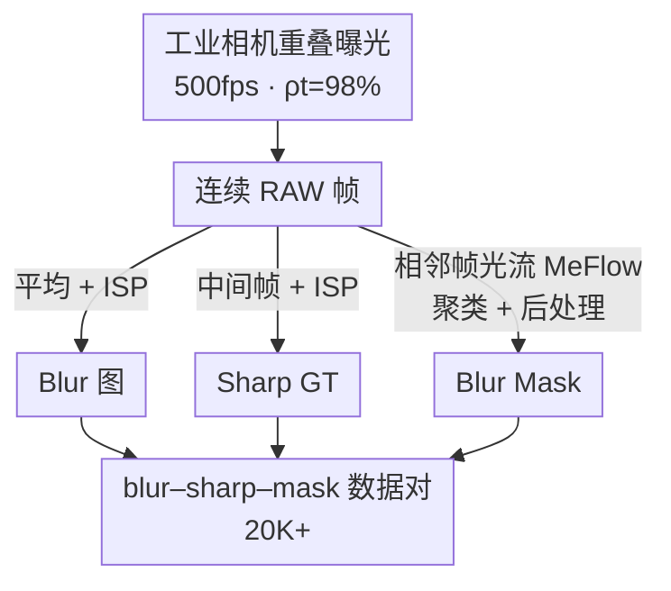
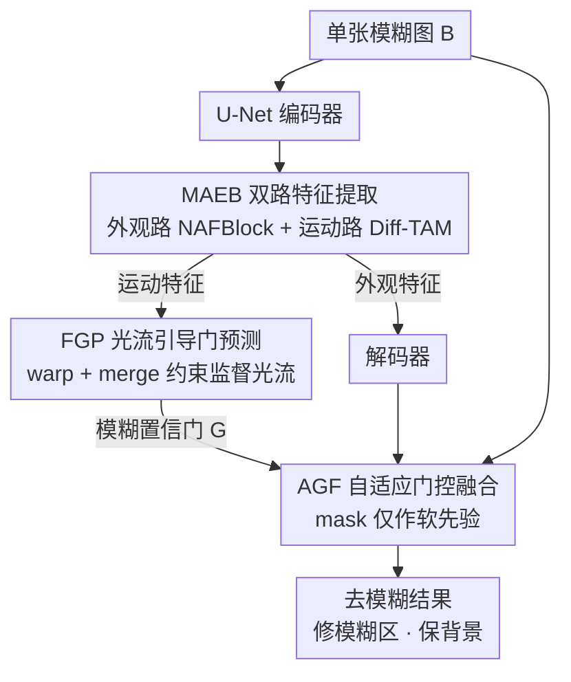

# OMoBlur: An Object Motion Blur Dataset and Benchmark for Real-World Local Motion Deblurring

**会议**: CVPR 2026  
**论文**: [CVF Open Access](https://openaccess.thecvf.com/content/CVPR2026/html/Yu_OMoBlur_An_Object_Motion_Blur_Dataset_and_Benchmark_for_Real-World_CVPR_2026_paper.html)  
**代码**: https://yudingchuan.github.io/OMoBlur_homepage/ (有)  
**领域**: 图像恢复 / 运动去模糊  
**关键词**: 局部运动去模糊、物体运动模糊、数据集、曝光累积、门控融合

## 一句话总结
针对静止场景中由运动物体造成的"局部、非均匀"模糊，作者用工业相机的可编程曝光控制做出一套物理保真的累积式合成数据集 OMoBlur（2 万对 blur–sharp–mask，有效曝光占比高达 98%），并配套提出能在不依赖像素级 mask 标注的情况下"只修模糊区、保住静止背景"的去模糊网络 OMDNet。

## 研究背景与动机
**领域现状**：运动模糊大体分两类——相机抖动模糊（全图空间连续，研究已相当成熟）和物体运动模糊（静止相机里有独立运动物体，模糊是**局部、不连续**的）。后者难在：多个物体可能以不同速度、不同方向运动，与静止背景形成清晰的语义边界，还会互相遮挡，整体呈现高度空间异质的模糊；而且物体运动轨迹（如滚动车轮的摆线轨迹）与相机抖动轨迹本质不同，必须有专门面向物体运动的数据。

**现有痛点**：现有数据来源都不理想。① **真实拍摄**（如首个局部运动模糊数据集 ReLoBlur）用分光（beam-splitter）相机同步拍 blur–sharp 对，但硬件笨重、难以规模化，且光学/电子不一致导致残余的几何与光度错位，反而拖累监督训练；② **多帧累积合成**（如 GoPro 把连续帧平均）依赖简化模型，与真实模糊有 domain gap；③ **卷积核合成**（sharp 图卷模糊核）从根上无法建模物体运动——任意核不满足运动学约束、旋转球这类运动会让像素沿轮廓出现/消失，更关键的是运动物体造成的**遮挡动态**会让一个像素在曝光时间内同时积分前景和背景的光，核方法无法表达这种随时间变化的混合。

**核心矛盾**：要规模化 → 只能合成；要泛化到真实 → 合成必须忠于真实成像物理。两者过去无法兼得：分光真拍规模上不去且有错位，纯合成又有物理 gap。

**本文目标**：(1) 造一套既能规模化、又物理保真的物体运动模糊数据集；(2) 设计一个不需要精确 mask 标注、却能"定位模糊区、保护背景"的单图去模糊网络。

**切入角度**：从相机的真实曝光过程（光子在曝光区间内被光电二极管持续积分形成电荷）出发，用能直接输出 RAW 的工业相机 + 可编程曝光时序，把"曝光积分"这件事用硬件真实地复现出来，而不是事后用 gamma/逆 ISP 去近似。

**核心 idea**：用"曝光保真的信号累积模型 + 重叠曝光采集"把有效曝光占比从以往 RAW 方案的约 10% 提到 98%，让合成模糊在物理上几乎等于真实模糊；网络侧则用光流引导的门控机制，把"哪里该修"交给运动线索判断，从而摆脱对像素级 mask 的依赖。

## 方法详解

### 整体框架
本文是"数据集 + 网络"双贡献。**数据侧**：先把模糊成像写成时间积分的信号累积模型，再用工业相机的重叠曝光时序，以 500fps、98% 有效曝光占比连续拍 RAW 帧；连续 RAW 帧平均后过 ISP 得到 blur 图，中间帧单独过 ISP 作为 sharp GT，相邻帧用光流估计 + 聚类 + 后处理生成 blur mask，最终发布 2 万余对 blur–sharp–mask。**网络侧** OMDNet 是一个 SIMO（单输入多输出）的 U-Net：把跳连替换成双路的 Motion–Appearance Extract Block（MAEB，外观路 + 运动路），运动路经 Flow-guided Gate Predictor（FGP）用多帧 GT 监督光流并预测"模糊置信门"，最后用 Adaptive Gated Fusion（AGF）把解码输出与模糊输入按门加权融合，测试时只需单张图。

数据集构建 pipeline：

OMDNet 网络框架：

### 关键设计

**1. 曝光保真的信号累积模型：让合成模糊在物理上逼近真实曝光积分**

针对"纯合成模糊有 domain gap、核方法无法建模遮挡混合"的痛点。作者从 RAW 成像写起：像素 $(x,y)$ 在曝光区间 $\Delta T$ 内积分光子到达率得到光子数 $N_{ph}=\int_T^{T+\Delta T} p(t,x,y)\,dt$，再经转换管线 $C(\cdot)$（含增益 $G$、噪声 $\varepsilon$）输出 RAW。常用的多帧平均模糊模型是 $B=g\{\frac{1}{n}\sum_{i=0}^{n-1} g^{-1}[S_i]\}$，其中 $S_i=\mathrm{ISP}(\mathrm{RAW}_i)$，$g^{-1}$ 是把 ISP 输出映回近似光子线性域的逆响应。问题在于消费级相机的 $g^{-1}$ 未知，用 gamma 或逆 ISP 去近似都不能忠实还原信号累积过程。作者指出：当 $g^{-1}\to\mathrm{ISP}^{-1}$、相邻帧首尾相接 $t_i+\Delta t\to t_{i+1}$、增益恒定 $G_i\equiv G$、噪声可忽略时，上式可升级为**时间积分的信号累积模型**

$$B \approx \mathrm{ISP}\Big(C\big[\textstyle\int_{t_0}^{t_n} p(t)\,dt,\ \tfrac{G}{n}\big]\Big)$$

即等价于一次曝光时间为 $n\Delta t$、增益为 $G/n$ 的真实拍摄。这套推导明确了"要让合成≈真实，必须让有效曝光占比 $\rho_t=\frac{\Delta t}{t_{i+1}-t_i}$ 接近 1"，从根上规避了核方法表达不了的遮挡时变混合。

**2. 重叠曝光采集：用硬件把有效曝光占比从约 10% 推到 98%**

上一条模型的前提要靠采集工程满足。作者选用能直接输出 RAW 的 Basler 工业相机（$g^{-1}$ 恰好等于 $\mathrm{ISP}^{-1}$），并用硬件编程实现**重叠曝光**——下一帧的曝光在上一帧读出期间就开始。硬件约束是每帧读出须在下一帧读出前完成，于是要求曝光时间长于读出时间、同时为保证 GT 清晰又要短曝光，二者靠"短读出"调和：把 ROI 限制到 $1920\times360$ 使读出降到 1921µs，加约 40µs 硬件延迟（传感器复位/清电荷），设曝光 1960µs，得到 **500fps、$\rho_t=98\%$**（以往 RAW 方案受硬件限制只有约 10%）。剩下 2% 曝光间隙再靠成像几何选光学（8mm 镜头，等效约 45mm）压制，使曝光间隙内物体在像面位移被限制在 0.1 像素，几乎与真实运动模糊形成一致。采集覆盖行人、车辆、球类等多视角的面内/面外运动，并打印海报和书画做手持运动以丰富复杂运动与纹理。

**3. MAEB + Diff-TAM：双路分离外观与运动，专门提纯运动特征**

针对"门控要靠高质量运动信息、否则定位不准"的需求。MAEB 以 NAFNet 的 NAFBlock 作共享 stem，再分出两路：外观路再接一个 NAFBlock；运动路接 **Differential Transposed Attention Module（Diff-TAM）**。Diff-TAM 借鉴电子工程的差分放大器与语言模型里的差分注意力——通过对比成对注意力路径来抑制背景响应，差分注意力图记为 $A=A_1-\lambda A_2$（⚠️ 具体 $\lambda$ 取值以原文为准），从而把运动模式从静止背景中"提纯"出来，为后续光流预测提供干净输入。为效率，它采用 Restormer 式沿通道维的转置注意力，且只放在 MAEB 里而非整个 backbone。外观特征同时送往对应解码器和更高层 MAEB，运动特征则交给 FGP。

**4. FGP + AGF：光流引导门预测 + 把 mask 只当软先验的自适应门控融合**

这是"无需精确 mask 标注也能定位模糊区、保护背景"的核心。**FGP** 把运动特征与上采样的低层光流融合，预测双向光流 $F=\{F_{-\to0}, F_{+\to0}\}$ 和流掩码 $O\in[0,1]$，再把流的模 $\lVert F\rVert$ 与 $F$ 拼接生成门 $\hat G_i$。光流由两个约束监督：**warp 约束**要求用 $F$ 反向 warp 中间帧 $S_i$ 能重建首尾清晰帧（$\hat S_{i-}\approx S_{i-}$、$\hat S_{i+}\approx S_{i+}$）；**merge 约束**针对 warp 失效的遮挡区，要求融合结果 $\hat m_i=\frac{2}{3}(\hat S_{i-}\otimes O+\hat S_{i+}\otimes(1-O))+\frac{1}{3}\hat S_i$ 匹配 GT 融合 $m_i=\frac{1}{3}(S_{i-}+S_i+S_{i+})$。这让门预测显式依赖光流、又隐式逼着编码器学更精确的运动表征。

**AGF** 解决"算法生成的 mask 本身不准、blur-sharp 对的错位/噪声会让门在背景误激活"的问题：训练时对 mask 只作**软先验**，算两路门控输出并都用 sharp GT $S_i$ 监督——标准门控 $\hat S_{iG}=\hat S_i\otimes\hat G_i+B_i\otimes(1-\hat G_i)$ 驱动模糊区 $\hat G_i\to1$；增强门控 $\hat S^*_{iG}=\hat S_i\otimes\hat G_i+(M_i\otimes B_i+(1-M_i)\otimes S_i)\otimes(1-\hat G_i)$ 在背景像素上用 $S_i$ 顶替 $B_i$，鼓励背景处 $\hat G_i\to0$。即使 $M_i$ 不完美，两式联合监督在模糊区与背景区互补纠错。测试时只输出标准门控 $\hat S_{iG}$。

### 损失函数 / 训练策略
总损失 $L_{total}=\lambda_1 L_{warp}+\lambda_2 L_{merge}+\lambda_3 L_r+\lambda_4 L_g$，其中 $\lambda_1=0.05$、$\lambda_2=0.4$、$\lambda_3=1.0$、$\lambda_4=0.4$。$L_{warp}$ 直接监督光流 $F$，且取双向 warp 两种配对的最小值（因模糊图存在运动方向歧义，不强加固定 warp 方向，$L_{warp}$ 还防止网络把双向信息坍缩进单一混合流场）；$L_{merge}$ 软监督 $F$ 与 $\hat S_i$；$L_r$ 强监督 $\hat S_i$；$L_g$ 自适应监督门 $\hat G_i$ 与 $\hat S_i$，取 $\hat S_{iG}$ 与 $\hat S^*_{iG}$ 两路的均值。其中 $L_1$ 为像素级 $\ell_1$ 损失，$f$ 为 $\ell_1$ 加 FFT 损失。训练用 Adam，batch 8，500K 次迭代，初始学习率 $1\times10^{-4}$ 按里程碑衰减；采用 BAPC 式 blur-aware 裁剪采 $256\times256$ patch（更可能覆盖模糊区）。

## 实验关键数据

### 主实验
在 OMoBlur 测试集（1,354 对，原生分辨率 $1920\times360$）上用单张 RTX 4090 评测，对比 CNN、Transformer、Mamba 类方法。指标含 PSNR/SSIM、聚焦模糊区的加权 PSNRw/SSIMw，以及感知指标 LPIPS(VGG)/DISTS。

| 方法 | PSNR↑ | SSIM↑ | PSNRw↑ | SSIMw↑ | LPIPS↓ | DISTS↓ |
|------|-------|-------|--------|--------|--------|--------|
| MIMO-UNet | 35.36 | 0.8819 | 33.15 | 0.8543 | 0.2301 | 0.0889 |
| Restormer | 35.55 | 0.8880 | 33.24 | 0.8613 | 0.2379 | 0.0964 |
| NAFNet | 35.51 | 0.8878 | 33.18 | 0.8607 | 0.2375 | 0.0971 |
| EVSSM | 35.54 | 0.8862 | 33.21 | 0.8578 | 0.2419 | 0.0987 |
| LBAG | 35.55 | 0.8883 | 33.23 | 0.8615 | 0.2360 | 0.0947 |
| LMD-ViT | 35.68 | 0.8888 | 33.55 | 0.8660 | 0.2345 | 0.0923 |
| **OMDNet (Ours)** | **35.73** | **0.8891** | **34.04** | **0.8716** | **0.2171** | **0.0788** |

OMDNet 在所有指标上最优，**增益主要集中在加权 PSNRw/SSIMw 和感知 LPIPS/DISTS**（PSNRw 比次优 LMD-ViT 的 33.55 高到 34.04，LPIPS 从 0.2345 降到 0.2171），说明它在模糊区恢复和视觉真实感上明显更强；全局 PSNR/SSIM 提升较小，是因为门控有意不去强行"修正"blur-sharp 对里固有的残余错位，这与设计意图一致。

### 消融实验
逐一加入三个核心模块（所有变体都用 AGF）：

| Diff-TAM | FGP | MAEB | PSNR | SSIM | PSNRw | SSIMw |
|:--------:|:---:|:----:|------|------|-------|-------|
| | | | 35.53 | 0.8865 | 33.39 | 0.8662 |
| | | ✓ | 35.58 | 0.8871 | 33.46 | 0.8673 |
| | ✓ | ✓ | 35.69 | 0.8885 | 33.88 | 0.8702 |
| ✓ | ✓ | ✓ | 35.73 | 0.8891 | 34.04 | 0.8716 |

极简 backbone（无额外模块）已能匹配 CNN SOTA LBAG（PSNRw 33.39）；只加 MAEB 时门来自外观线索、缺运动特异性，增益有限（33.46）；加 FGP 提供光流监督的运动特征与门图，PSNRw 跳到 33.88；再加 Diff-TAM 进一步提升运动建模效率，达到最佳 34.04。

### 关键发现
- **数据集的物理保真度直接决定泛化**：在 ReLoBlur 真实数据上做跨数据集泛化，把 MIMO-UNet/Restormer 分别用 GoPro、OMoBlur-FI（帧插值版）、OMoBlur 训练。GoPro 训练几乎修不动甚至产生伪影；OMoBlur-FI 虽视觉上与 OMoBlur 难以区分，但对面内旋转（车轮纹理）和面外运动（转弯黑车）基本失败；只有 OMoBlur 训练能稳定去除摆线拖影并在各类场景保持表现，重建甚至比 ReLoBlur 的 GT 更干净。
- **门控机制对背景保护至关重要**：在 ReLoBlur 静止区域评测重建与输入的平均绝对误差（MAE），Zoom1 下"无门控 / LBAG 门控 / 本文门控"分别为 0.041 / 0.023 / 0.007，Zoom2 为 0.026 / 0.017 / 0.006——本文 AGF 对背景的保护最好；LBAG 的门会把静止背景误判为模糊（false positive），而 AGF 能更准地只点亮真正模糊的区域。
- FGP 贡献最大单步增益（PSNRw +0.42），印证"光流监督的运动特征"是精确门控的关键。

## 亮点与洞察
- **把"造数据"当成一个成像物理问题来解**：不是事后用 gamma/逆 ISP 近似，而是用工业相机的可编程重叠曝光把 $\rho_t$ 真做到 98%，再用镜头几何把残余 2% 间隙的位移压到 0.1 像素——"硬件 + 光学 + 时序"三管齐下逼近真实曝光积分，这种把数据合成做到物理可证的思路很有迁移价值。
- **mask 只当软先验是务实又巧妙的折中**：算法生成的 mask 必然不准、人工标注又太贵，AGF 用标准门控 + 增强门控两路都拿 sharp GT 监督，让两者互补纠错，绕开了"必须有像素级精确 mask"的死结。这套"弱标注 + 双路自监督互纠"可迁到其他需要区域门控但难拿精确 mask 的恢复任务。
- **Diff-TAM 把"差分抑制背景"从电路/语言模型搬到视觉运动提纯**：用成对注意力相减压制背景响应来突出运动，思路新颖且只放在 MAEB 内控成本。

## 局限与展望
- **评测可比性受限**：OMoBlur 重建中间帧（物理上解运动方向歧义的自然选择），而 ReLoBlur 针对起始帧，这种 target 不一致使跨数据集分数不可直接比，作者只能转向定性比较——量化层面的跨集公平对比仍是开放问题。
- **全局 PSNR/SSIM 提升有限**：虽是有意为之（不修残余错位），但也意味着在以全局保真度为主的场景里优势不明显，指标解读需结合加权/感知指标。
- **采集对硬件依赖强**：方案绑定能输出 RAW、可编程曝光的工业相机与特定镜头，普通用户难以复现采集流程；ROI 受限于 $1920\times360$，对全分辨率/更大场景的扩展未充分讨论。
- 改进方向：统一中间帧/起始帧的评测协议以支持跨数据集量化比较；探索更轻量、消费级设备可复现的高 $\rho_t$ 采集近似。

## 相关工作与启发
- **vs ReLoBlur / LBAG**：ReLoBlur 用分光真拍 2,405 对、LBAG 靠其 GT mask 做门控定位；本文用累积式合成把规模提到 2 万对且无错位，AGF 还摆脱了对精确 mask 的依赖，背景保护（MAE 0.007 vs LBAG 0.023）和模糊区恢复都更好。
- **vs GoPro 多帧累积**：GoPro 用简化模型平均连续帧、有明显物理 gap，跨集泛化差；本文用物理保真的信号累积模型，泛化显著更强。
- **vs 核方法合成（spatially-varying kernel）**：核方法无法满足运动学约束、表达不了遮挡时变混合；本文从曝光积分本身建模，原生支持这些复杂物体运动。
- **vs LMD-ViT / MUGNet / PGDN**：它们分别靠自适应剪枝提效、概率模型表达运动不确定性、额外自监督网络预测 3 参数模糊核作先验；本文走"双路运动提纯 + 光流引导软门控"路线，在 OMoBlur 上全指标领先（PSNRw 34.04 vs LMD-ViT 33.55）。

## 评分
- 新颖性: ⭐⭐⭐⭐⭐ 把数据合成做成可证的成像物理问题（98% 有效曝光占比），加上 mask 软先验的自适应门控，思路扎实且少见
- 实验充分度: ⭐⭐⭐⭐ 主对比 + 模块消融 + 跨数据集泛化 + 门控 MAE 分析齐全，但量化跨集比较因 target 不一致受限
- 写作质量: ⭐⭐⭐⭐⭐ 从曝光物理一路推到采集工程再到网络，逻辑链清晰、公式与动机扣得紧
- 价值: ⭐⭐⭐⭐⭐ 首个大规模物理保真物体运动模糊数据集 + 配套 SOTA 方法，对真实局部去模糊是实打实的基础设施

<!-- RELATED:START -->

## 相关论文

- [\[CVPR 2026\] Toward Real-world Infrared Image Super-Resolution: A Unified Autoregressive Framework and Benchmark Dataset](real_iisr_infrared_image_super_resolution_autoregressive.md)
- [\[CVPR 2026\] Spatio-Temporal Difference Guided Motion Deblurring with the Complementary Vision Sensor](spatio-temporal_difference_guided_motion_deblurring_with_the_complementary_visio.md)
- [\[CVPR 2026\] Event-Based Motion Deblurring Using Task-Oriented 3D Gaussian Event Representations](event-based_motion_deblurring_with_unpaired_data.md)
- [\[CVPR 2026\] Event-Illumination Collaborative Low-light Image Enhancement with a High-resolution Real-world Dataset](event-illumination_collaborative_low-light_image_enhancement_with_a_high-resolut.md)
- [\[CVPR 2026\] NEC-Diff: Noise-Robust Event–RAW Complementary Diffusion for Seeing Motion in Extreme Darkness](nec-diff_noise-robust_event-raw_complementary_diffusion_for_seeing_motion_in_ext.md)

<!-- RELATED:END -->
