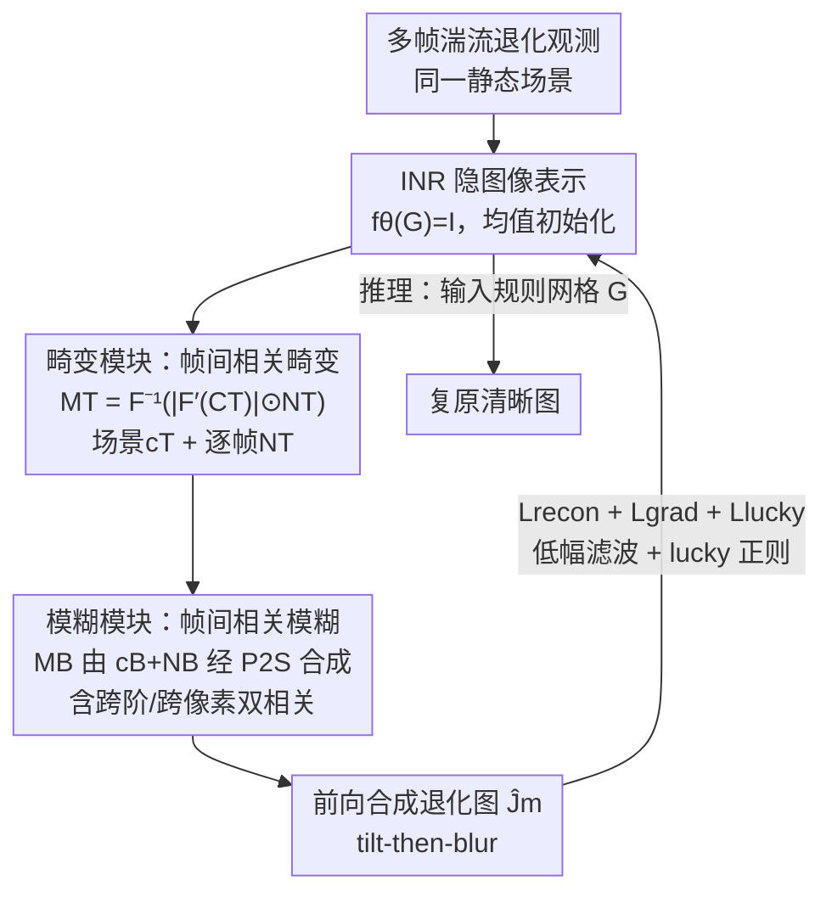

# Physically-Grounded Turbulence Mitigation with Frame-Shared Degradation Parameters

**会议**: CVPR 2026  
**论文**: [CVF Open Access](https://openaccess.thecvf.com/content/CVPR2026/html/Xie_Physically-Grounded_Turbulence_Mitigation_with_Frame-Shared_Degradation_Parameters_CVPR_2026_paper.html)  
**代码**: 无  
**领域**: 图像复原 / 大气湍流缓解  
**关键词**: 大气湍流复原, 无监督优化, 物理退化模型, 帧间相关随机过程, 隐式神经表示

## 一句话总结
TMFS 是一个无监督、基于优化的多帧大气湍流复原方法：它把"tilt-then-blur"物理退化模型里每一帧的畸变场和模糊参数拆成**场景共享的相关函数 + 逐帧噪声图**，用同一场景多帧之间的湍流统计相关性来约束本就高度病态的逐帧估计，在真实湍流数据上比在合成数据上训练的监督方法泛化更好。

## 研究背景与动机

**领域现状**：长距离户外成像中，大气折射率随机起伏会让图像同时出现**空间变化的几何畸变（distortion/tilt）和模糊（blur）**，严重影响识别、跟踪等下游任务。湍流复原分单帧与多帧两类，本文聚焦多帧——同一静态场景的多张退化帧能提供互补信息。主流深度方法多为监督学习，在合成 benchmark 上表现不错。

**现有痛点**：监督方法依赖成对的"退化—干净"训练数据，而真实湍流场景几乎拿不到 ground truth；只能用合成退化训练，但大气成像极其复杂，合成退化往往无法忠实还原真实湍流，导致真实世界泛化能力受限。这促使无监督方法兴起——它不依赖合成监督，转而用一个可微前向模型 + 优化框架，在退化观测和"用退化参数模拟出来的退化图"之间做最小化重建。

**核心矛盾**：无监督多帧复原需要**仅从退化帧**同时估计隐图像、每帧的畸变场 $\{M^T_m\}$ 和模糊参数 $\{M^B_m\}$，没有干净图监督，问题高度病态、极易过拟合。现有无监督方法（如 NDIR）对每帧**独立**估计退化参数，**完全没利用同一场景各帧之间的相关性**，也几乎不受湍流物理约束。

**本文目标**：(1) 显式建模跨帧依赖以降低逐帧估计的病态性；(2) 让优化过程被湍流成像物理约束引导，趋向物理上合理的解。

**切入角度**：作者借鉴**基于随机过程的湍流仿真**思路——湍流仿真里，每帧的 Zernike 系数本就被建模为某个场景相关随机过程的采样，其自相关由传播距离、湍流强度等物理量决定，且在短观测周期内湍流强度近似稳定、场景共享。既然"造退化"时退化参数是同一随机过程的样本，那"猜退化"时也该让各帧参数共享同一套相关结构。

**核心 idea**：把每帧的畸变/模糊参数**分解成一个场景共享的相关函数（自相关结构）和一张逐帧的噪声图**，用随机过程的功率谱采样把二者合成出每帧退化参数——用场景级共享参数替代逐帧独立参数，从而引入跨帧约束、缓解病态。

## 方法详解

### 整体框架
TMFS 解决的是：从同一静态场景在短时间内拍到的多张又畸变又模糊的图里，恢复一张清晰图。它沿用 tilt-then-blur 退化模型 $J_m = B\big(I(G + M^T_m),\, M^B_m\big)$（式 1）：$G$ 是规则采样网格，$M^T_m$ 是 tilt 引起的位移场（把网格点搬到畸变坐标），$I(G+M^T_m)$ 是畸变后的图，$B(\cdot, M^B_m)$ 再施加空间变化的模糊。隐清晰图 $I$ 用一个**隐式神经表示 INR**（4 层 MLP + 位置编码）表示为 $f_\theta(G)=I(G)$。

整个 pipeline 是一个**逐场景训练**的优化过程：可优化变量包括 INR 参数 $\theta$、畸变侧的场景参数 $c_T$ 与逐帧噪声 $\{N^T_m\}$、模糊侧的场景参数 $c_B$ 与逐帧噪声 $\{N^B_m\}$。前向用这些参数模拟出每帧退化图 $\hat J_m$，反向最小化 $\hat J_m$ 与观测 $J_m$ 的差异（外加物理正则）。推理时把规则网格 $G$ 喂进去（不加畸变、不加模糊），INR 直接吐出复原图。核心机制集中在"怎么从场景参数 + 逐帧噪声生成 $M^T$ 和 $M^B$"（论文 Fig. 2）。

### 关键设计

**1. 帧间相关的畸变建模：把 tilt 拆成"场景共享相关函数 + 逐帧噪声"**

针对"逐帧独立估计畸变太病态"这个痛点，TMFS 把每帧畸变场 $M^T_m$ 视为同一个**场景特定随机过程**的采样，用功率谱密度（PSD）方法采样：

$$M^T = \mathcal{F}^{-1}\big(|\mathcal{F}'(C_T)| \odot N^T\big)[:W, :H]$$（式 9）

其中 $C_T$ 是描述该随机过程的二维各向异性自相关矩阵（只考虑 outer-mode 相关），$N^T$ 是逐帧可优化的噪声矩阵，$\odot$ 为逐元素相乘；因为 tilt 在两个坐标轴上有方向，所以成对出现，又因实数傅里叶变换对称性，$C_T$、$N^T$ 尺寸是图像的两倍。直接把物理湍流参数当优化变量代价太高，TMFS 仿照 [8] 用两条一维函数——各向同性项 $c_1$ 和各向异性项 $c_2$——来构造二维自相关：

$$w(\theta) = 0.5\cos(2\theta) + 0.5$$
$$C_T(\rho,\theta)[0] = w(\theta)\odot c_1(\rho) + (1-w(\theta))\odot c_2(\rho)$$

$\rho$ 是两点距离、$\theta$ 是连线与水平线夹角，$w$ 把同性/异性相关混合（这里的混合权用法与 [8] 不同，是为了方便加约束）。关键是：**它不再为 $M$ 帧优化 $\{M^T_m\}_{m=1}^M$，而是优化一个场景级参数 $c_T=\{c_1, c_2\}$ 加逐帧变量 $\{N^T_m\}$**。这样所有帧共享同一套相关结构 $c_T$，跨帧信息被强制耦合，逐帧估计的自由度大幅收缩，病态性随之缓解。单调性由"把 $c_1,c_2$ 定义为非负可学习序列的反向累积和"来强制保证。

**2. 帧间相关的模糊建模：跨阶 + 跨像素双重相关 + P2S 加速**

模糊比畸变更复杂：高阶 Zernike 系数（决定 PSF）有**两类相关**——inter-mode（同一像素不同阶系数之间）和 spatial（同阶系数跨像素之间）。对跨像素相关，TMFS 用与畸变类似的 PSD 采样流程，$C_B$ 是对应各个高阶 Zernike 系数的一组自相关函数（$c_B$ 含 $L-2$ 对数组，$L=21$）；对跨阶相关，则用 [8] 定义的固定协方差矩阵 $\Sigma_B$ 直接分解 $\Sigma_B = RR^T$ 后乘到噪声上：

$$M^B[u] = R \times \big(\mathcal{F}^{-1}(|\mathcal{F}'(C_B)| \odot N^B)[:W, :H]\big)[u]$$（式 13）

由于逐像素直接把高阶 Zernike 系数变成 PSF、再做空间变化卷积代价极高，TMFS 采用 **P2S（Phase-to-Space）**：用预计算的 PSF 基 + 浅网络把高阶系数映射成基系数，卷积后线性组合即得模糊图；并额外加入一个 **delta 函数基**来更好近似接近 delta 的 PSF（P2S 在那附近不够准）。同样地，模糊侧也只优化场景级 $c_B$ 加逐帧 $\{N^B_m\}$，而非逐帧的 $\{M^B_m\}$。

**3. 物理驱动的正则：低幅滤波、lucky region、梯度锐化**

光有重建损失不足以约束这个高度病态的问题，TMFS 加了三类物理动机的正则来防止退化参数"乱拟合"。**低幅滤波**：若不限制畸变模拟的拟合能力，tilt 矩阵会去拟合图像内容、把观测图的形状"印"进 $M^T$（Fig. 4）；于是对 PSD 用阈值 $\alpha_p$ 生成掩码 $\tau$，滤掉低幅频率分量 $\mathcal{F}'(C_T) = \mathcal{F}(C_T)\odot\tau(\mathcal{F}(C_T))$（式 17-18），限制 tilt 的自由度避免落入局部最优。**Lucky region 正则**：利用 lucky effect——每个像素至少在某一帧里应当是清晰的，用各帧中心 PSF 值的最大值 $K[u]=\max_m k_{u,m}([0,0])$（中心值越大说明越不模糊）做约束，当 $K[u]<\alpha_l$（$\alpha_l=0.8$）时惩罚 $1-K[u]$，鼓励每像素至少属于某一帧的 lucky region（式 19-20）；为避免退化成"所有 lucky region 塌缩到单帧、其余帧 PSF 过平滑"，训练时上调重建损失最大那帧的权重。**梯度损失**：依据 lucky effect 中"原图边缘梯度应高于观测图"，在边缘处惩罚 $\text{ReLU}(\nabla J_m - \nabla \hat J_m)$（式 16，边缘由 Canny 检测），优化该项时冻结 $\{M^B_m\}$，以锐化复原图。

### 损失函数 / 训练策略
总损失为三项加权：

$$L_{total} = \lambda_1 L_{recon} + \lambda_2 L_{grad} + \lambda_3 L_{lucky}$$（式 14）

主重建损失 $L_{recon} = \sum_{m=1}^M \|J_m - \hat J_m\|_1$ 是 $L_1$ 差异（式 15）。可优化参数为 $\theta$、$\{N^T_m\}$、$c_T$、$\{N^B_m\}$、$c_B$。INR 的 $\theta$ 用观测帧均值拟合来初始化。对高分辨率图像（如 1920×1080 的 RLR-AT），TMFS 把图切成**有重叠的 patch** 独立处理再拼接——因为相关性随空间距离衰减（Fig. 6 显示 RLR-AT 上相关在大距离趋零），patch 处理仍能保留主导相关结构，且补充材料显示无明显拼接伪影。整个方法**逐场景训练**，不需要任何外部成对数据。

## 实验关键数据

### 主实验
合成数据用 [24] 的湍流仿真器在 weak/medium/strong 三档生成（干净图取自 UC Merced 遥感数据集）；真实数据用 OTIS（自然湍流）、Heat Chamber（受控热室）、RLR-AT small（1920×1080 自然湍流视频）。输入默认 20 张 256×256 帧，单张 RTX 4090。对比含监督法（RVRT/TSR/TMT/DATUM，均合成训练）与无监督法（CLEAR/CDSP/NDIR）。

| 数据集 | 指标 | TMFS（本文，无监督） | 最强无监督 baseline | 最强监督法 |
|--------|------|------|----------|------|
| Weak (D/r0=1) | SSIM↑ | **0.7505** | NDIR 0.5841 | TMT 0.7405 |
| Weak (D/r0=1) | PSNR↑ | **25.70** | NDIR 21.59 | TMT 24.21 |
| Middle (D/r0=2) | SSIM↑ | 0.5786 | NDIR 0.4235 | DATUM 0.5874 |
| Middle (D/r0=2) | PSNR↑ | **22.10** | NDIR 19.37 | TSR 21.77 |
| Strong (D/r0=3) | SSIM↑ | **0.4331** | NDIR 0.3608 | DATUM 0.4064 |
| Strong (D/r0=3) | PSNR↑ | 19.671 | NDIR 18.24 | TSR 20.35 |
| Heat (真实热室) | SSIM↑ | 0.7080 | NDIR 0.6847 | DATUM 0.7298 |

弱湍流下 TMFS 取得整体最佳（SSIM/PSNR 双第一），并在所有档位的无监督方法中基本领先；中/强湍流下会被部分监督法在 PSNR 上超过，但 strong 档 SSIM 仍是全场最高。CLEAR 在某些合成集 SSIM 高，但过度锐化、PSNR 偏低。真实数据视觉对比（Fig. 3 RLR-AT、Fig. 7 OTIS）上，监督法（RVRT/TSR）残留明显畸变、DATUM 有伪影与过锐，TMFS 畸变去除更干净——作者归因于随机过程畸变建模而非 NDIR 那种 INR 网格参数化。

### 消融实验
由于 CDSP、NDIR 只提供畸变模块代码、去模糊都接 L0-sparse，作者把 **TMFS 的畸变模块 + L0-sparse（记 T+L0）** 与 CDSP/NDIR 同条件对比，隔离畸变模块的贡献：

| 配置 | 数据集 | SSIM↑ | PSNR↑ |
|------|--------|-------|-------|
| T+L0（本文畸变模块） | Middle | **0.4802** | **20.96** |
| NDIR | Middle | 0.4235 | 19.37 |
| CDSP | Middle | 0.4019 | 18.66 |
| T+L0（本文畸变模块） | Heat | **0.7001** | **20.09** |
| NDIR | Heat | 0.6847 | 19.89 |
| CDSP | Heat | 0.6282 | 19.76 |

在相同去模糊后端（L0-sparse）下，仅替换畸变模块，T+L0 在 Middle 与 Heat 上 SSIM/PSNR 全面超过 CDSP、NDIR，说明**畸变缓解模块本身**就强于现有无监督畸变方法，提升不靠去模糊后端。低幅滤波（Fig. 4）和 lucky region 正则（Fig. 5）也各有定性消融支撑。

### 关键发现
- **帧间共享相关 vs 逐帧独立估计**是核心增益来源：把畸变/模糊参数压成"场景级 $c$ + 逐帧噪声 $N$"，在真实湍流上的泛化明显优于逐帧独立的 NDIR。
- **监督法在合成强但真实弱**：监督法在合成 benchmark 数值高，但真实 RLR-AT/OTIS 上残留畸变、伪影、过锐，量化优势没转成视觉提升——印证"合成退化无法忠实反映真实湍流"。
- **越强湍流越吃力**：strong 档整体 PSNR 仍偏低，作者承认严重畸变下复原质量有限。
- **跨域可迁移**：把 TMFS 直接用于真实水下湍流（水箱搅拌）数据（Fig. 8），无需训练数据也能恢复出比 Oreifej/NDIR/NERT 更细的纹理与更锐的边缘，说明它捕捉的是跨湍流域共享的退化特性。

## 亮点与洞察
- **把"仿真先验"反用进"复原优化"**：湍流仿真里 Zernike 系数本就是某随机过程的样本，作者把这条物理生成假设直接搬来当无监督复原的参数化结构——退化怎么被"造"出来，就怎么去"猜"，逻辑自洽且天然带物理约束。
- **场景级 $c$ + 逐帧 $N$ 的分解是降病态的关键 trick**：用一个低维场景相关函数耦合所有帧、只保留逐帧噪声做差异，本质上是"对退化参数施加跨帧低秩/共享结构先验"，这种思路可迁移到任何"多观测共享退化"的逆问题（多帧去模糊、去雨雾、水下成像）。
- **低幅滤波防止 tilt 抄图像内容**：一个很实用的观察——不限制拟合能力时畸变场会把观测图形状印进去（典型的退化参数过拟合），用 PSD 低幅掩码限制自由度，简单有效。
- **lucky region 量化进 loss**：把经典"lucky imaging"直觉（总有某帧某像素是清晰的）写成可微正则，并处理了"lucky region 塌缩到单帧"的退化模式。

## 局限与展望
- 作者承认两点局限：**逐场景训练带来的计算开销**（per-sample optimization，无法即拍即出）和**严重湍流畸变下复原质量不佳**（strong 档 PSNR 仍低）。
- 高分辨率靠 patch 切分处理，依赖"相关随距离衰减"假设；若场景相关结构尺度大于 patch，可能损失长程相关——虽然作者称无可见拼接伪影。
- 强依赖 tilt-then-blur 物理模型与 Zernike/P2S 仿真假设：当真实湍流偏离该模型（如强各向异性、动态场景）时，物理约束可能反成偏置。
- 仅适用静态场景多帧；对运动场景/动态目标未涉及，是自然的扩展方向。

## 相关工作与启发
- **vs NDIR [20]**: 同为无监督 INR + 可微前向，但 NDIR 用 INR-based 网格参数化、**逐帧独立**估畸变，且去模糊另接 L0-sparse；TMFS 用**随机过程 + 帧间相关**参数化畸变与模糊，消融（T+L0 vs NDIR）证明畸变模块本身更强，真实数据畸变去除更干净。
- **vs CDSP [29]**: CDSP 靠更好的参考帧选择与先验、只做几何畸变；TMFS 端到端联合估计畸变+模糊+隐图，且有物理正则，量化全面超过。
- **vs 监督法（TMT/DATUM/TSR/RVRT）**: 监督法合成数据训练、benchmark 数值强但真实泛化差（残留畸变/伪影/过锐）；TMFS 无监督、不依赖成对数据，真实湍流泛化更好，代价是逐场景优化慢。
- **vs 湍流仿真 [8, 24]**: 借用了 [8] 的 Zernike 自相关随机过程建模与 P2S [24] 的 PSF 基加速，但把它们从"正向造退化"反向用作"无监督复原的可优化参数化"，并改了混合权用法以便加单调性等约束。

## 评分
- 新颖性: ⭐⭐⭐⭐ 把湍流仿真的随机过程先验反用为无监督复原的帧间共享参数化，角度新且自洽
- 实验充分度: ⭐⭐⭐⭐ 合成三档 + 三个真实集 + 水下迁移 + 隔离畸变模块的消融，较完整；但消融维度偏少（正则项只有定性图）
- 写作质量: ⭐⭐⭐ 物理推导清晰，但部分符号/公式排版与表述略粗糙（如 SSIM 数字精度不一）
- 价值: ⭐⭐⭐⭐ 真实湍流泛化优于监督法、且能迁移到水下，对实拍长距离成像复原有实用价值

<!-- RELATED:START -->

## 相关论文

- [\[CVPR 2026\] PhaSR: Generalized Image Shadow Removal with Physically Aligned Priors](phasr_generalized_image_shadow_removal_with_physically_aligned_priors.md)
- [\[CVPR 2026\] Degradation-Robust Fusion: An Efficient Degradation-Aware Diffusion Framework for Multimodal Image Fusion in Arbitrary Degradation Scenarios](degradation-robust_fusion_an_efficient_degradation-aware_diffusion_framework_for.md)
- [\[NeurIPS 2025\] Implicit Augmentation from Distributional Symmetry in Turbulence Super-Resolution](../../NeurIPS2025/image_restoration/implicit_augmentation_from_distributional_symmetry_in_turbulence_super-resolutio.md)
- [\[CVPR 2026\] RAW-Domain Degradation Models for Realistic Smartphone Super-Resolution](rawdomain_degradation_models_smartphone_sr.md)
- [\[CVPR 2026\] Degradation-Consistent Test-Time Adaptation for All-in-One Image Restoration](degradation-consistent_test-time_adaptation_for_all-in-one_image_restoration.md)

<!-- RELATED:END -->
