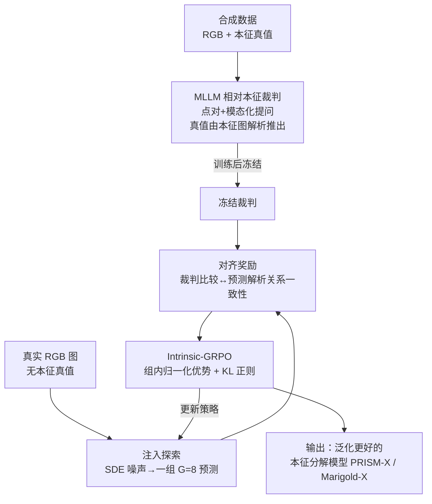

# ReasonX: MLLM-Guided Intrinsic Image Decomposition

**会议**: CVPR 2026  
**论文**: [CVF Open Access](https://openaccess.thecvf.com/content/CVPR2026/html/Dirik_ReasonX_MLLM-Guided_Intrinsic_Image_Decomposition_CVPR_2026_paper.html)  
**代码**: https://github.com/alaradirik/reasonx  
**领域**: 图像恢复 / 本征图像分解 / 逆向渲染  
**关键词**: 本征图像分解, MLLM 裁判, 相对比较监督, GRPO, 无标注微调

## 一句话总结
ReasonX 把一个微调过的多模态大模型（MLLM）当作"感知裁判"，对 RGB 图上的点对做相对本征判断（谁更近、谁更亮、是否同材质），再用裁判判断与模型预测的解析关系是否一致作为 GRPO 奖励，在**完全无本征真值标注**的真实图像上微调本征分解模型，让 PRISM / Marigold 这类模型在野外场景上 IIW 反照率 WHDR 降低 9–25%、ETH3D 深度精度提升最高 46%。

## 研究背景与动机

**领域现状**：本征图像分解（intrinsic image decomposition）要从单张 RGB 图里把反照率（albedo）、深度（depth）、法向（normals）、辐照度（irradiance）等物理量分离出来，是经典的逆问题。近年扩散模型和视觉 Transformer 把这件事做得很漂亮，PRISM、Marigold 这类模型在室内合成数据上能给出高质量分解，支撑重打光、材质编辑等下游应用。

**现有痛点**：这些 SOTA 方法**严重依赖配对的合成数据集**——只有物理渲染引擎（HyperSim、InteriorVerse、OpenRooms 等）才能提供逐像素的本征真值。但合成数据虽然逼真，覆盖面窄（多偏室内场景），无法捕捉真实世界图像的全部复杂度。结果就是：模型一旦遇到训练分布之外的野外图像（户外、强光、过曝/欠曝），泛化能力就崩。而给真实场景标注本征真值又贵到几乎不可能。

**核心矛盾**：本征分解需要**逐像素的绝对监督**，但真实世界又**拿不到这种绝对标注**。要么困在合成数据里出不来，要么没有信号可学。

**本文目标**：在**没有任何本征真值**的真实图像上微调本征分解模型，同时提升它在野外场景的泛化能力。

**切入角度**：作者注意到两件事——其一，MLLM 在**相对空间推理**上很强（"哪个点更近""这两块是不是同一种材质"），而绝对度量估计仍然差；其二，人类感知本身也是擅长比较判断而非绝对测量。两者一拍即合：与其逼模型学绝对值，不如让 MLLM 充当裁判，只回答**相对比较问题**。

**核心 idea**：把 MLLM 训成会做相对本征判断的"裁判"，再用"裁判的比较结论"和"从模型预测里解析算出的关系"是否吻合作为奖励信号，套进 GRPO 在无标注真实图上微调本征模型——用**相对比较监督**替代**绝对真值监督**。

## 方法详解

### 整体框架

ReasonX 由两个阶段串成：**(a) 训练一个 MLLM 裁判**——在有真值的合成数据上微调 InternVL2.5-4B，让它学会回答点对级别的相对本征问题，训练完冻结；**(b) 无真值 GRPO 微调**——把冻结的裁判当奖励模型，对每张真实 RGB 图让本征模型采样一组（G=8）预测，用裁判跨点对、跨模态打分，算组内相对优势，更新本征模型。整套流程在真实图上跑，但**不需要任何本征真值**，只需要 RGB 图 + 训好的裁判。

关键的工程难点在于：本征预测是**强 RGB 条件、几乎确定性**的（同一张 RGB 几乎只对应一个解），策略梯度方法没有探索空间。ReasonX 借鉴 Flow-GRPO，在采样轨迹里注入随机噪声，把确定性轨迹变成轻度随机的，从而对同一张图生成多个略有差异的合理预测，让组相对优化得以进行。

### 关键设计

**1. MLLM 相对本征裁判：用比较判断替代绝对回归，把高层语义先验引进低层本征任务**

作者没有让 MLLM 直接回归像素级本征值（它做不好绝对度量），而是把任务重塑成**点对相对比较**。具体做法：在合成 RGB 图上采样点对 $(x_1,y_1),(x_2,y_2)$，叠加彩色视觉标记，再针对不同模态问对应的相对问题——深度问"哪个点更近"、法向问"哪个点表面更朝向相机"、辐照度问"哪个点更亮"、反照率问"两点是否同一种基色"。这些问题的标准答案**不用人标**，而是从对应的合成本征图里解析推导：深度直接比标量值（差太小的点对剔除以避歧义）、法向比 z 分量的朝前程度（假设相机看 +z 轴）、辐照度在 Lambertian 假设下比亮度/反照率之比、反照率比阈值化的感知色差。用这些 (RGB+标记图, 模态问题, 解析答案) 三元组微调 InternVL2.5-4B，裁判就学会了可靠迁移到真实图的比较推理。在留出测试集上，裁判深度准确率 0.962、法向 0.935、反照率 0.894、辐照度 0.876——比较任务确实比绝对预测更稳。

**2. 对齐奖励：把"裁判的感知判断"和"模型预测的物理结构"绑在一起当奖励**

光有裁判还不够，得把它变成能反传的奖励。对一张预测出的本征图 $I_m$，在 RGB 输入上采 $N$ 个点对、叠标记，问冻结裁判拿到相对判断；同时从 $I_m$ 里用**解析关系** $g_m$ 算出同一个点对的相对关系；两者一致就给奖励：

$$r(I_{\text{RGB}}, I_m) = \frac{1}{N}\sum_{i=1}^{N}\big[\,\mathrm{MLLM}(I_{\text{RGB}}^{(i)}, q_m) = g_m(I_m, p_i)\,\big]$$

其中 $q_m$ 是模态化问题，$g_m$ 是从预测本征图算出的确定性关系。这个奖励同时锚在**模型的物理结构**（解析关系）和**裁判的比较感知**两端：模型只有让自己的预测在相对关系上和裁判看到的真实场景一致，才能拿高分。这正是把"无绝对真值"的真实图重新挂上监督信号的关键——奖励不来自真值，而来自"内部自洽 + 外部感知"的吻合。

**3. Intrinsic-GRPO：给确定性的本征预测注入探索，再做组相对优化**

本征预测是确定性的，PRISM/Marigold 都靠 RGB 条件的确定性去噪轨迹出结果，策略梯度没有可探索的分布。作者按 Flow-GRPO 在采样里加随机项，用 Euler–Maruyama 更新把确定性轨迹变随机：

$$x_{t+\Delta t} = x_t + f_\theta(x_t, t, c)\,\Delta t + \sigma_t\sqrt{\Delta t}\,\epsilon,\quad \epsilon\sim\mathcal{N}(0,I)$$

独立噪声让同一张 RGB 产出多个合理预测，组相对优化才有意义。然后对每张真实图随机选一个目标模态 $m$，生成 $G$ 个预测，各算奖励，按组归一化得优势 $\hat{A}_i = (r_i - \mu_G)/\sigma_G$，用 GRPO 的裁剪式 PPO 目标加 KL 正则更新：

$$\mathcal{J}(\theta) = \mathbb{E}_{\pi_\theta}\Big[\min\big(\rho_t\hat{A},\,\mathrm{clip}(\rho_t,1-\epsilon,1+\epsilon)\hat{A}\big) - \beta\,D_{\mathrm{KL}}(\pi_\theta\|\pi_{\mathrm{ref}})\Big]$$

KL 正则把更新后的策略约束在冻结参考模型附近，**防止奖励黑客**（比如塌缩成近似常数的本征图来骗奖励），保证提升是真的对齐了比较判断。由于随机更新下转移分布是高斯，KL 可由模型与参考的速度场闭式计算。与以往在生成模型上用 GRPO（奖励来自偏好分数、内部 critic）不同，ReasonX 针对的是**确定性、RGB 条件**的本征预测，奖励来自**模态化的相对比较**而非偏好打分。

### 损失函数 / 训练策略
裁判：在合成数据（基模型训练集，含本征真值）上微调 InternVL2.5-4B，训完冻结。GRPO 微调：在 COCO 训练集的 10,000 张真实 RGB 上微调，每次迭代采 $N=40$ 个点对、$T=15$ 步去噪（推理用 $T=50$），组大小 $G=8$，SDE 噪声水平 $a=0.7$；AdamW、学习率 $10^{-5}$、余弦退火、梯度裁剪 1.0；6 张 H100 训 3 个 epoch。PRISM 用空文本提示作条件。

## 实验关键数据

ReasonX 是模型无关框架，套在 PRISM（rectified-flow 扩散 Transformer）和 Marigold IID Lighting v1.1（扩散，联合估反照率+辐照度）上，得到 PRISM-X 和 Marigold-X。所有真实数据集评测均为**零样本**（基模型与 ReasonX 变体都没见过）。

### 主实验

| 任务/数据集 | 指标 | 基模型 | ReasonX 变体 | 提升 |
|------|------|------|------|------|
| 反照率 IIW | WHDR 10% ↓ | PRISM 17.2 | PRISM-X **12.9** | +25.0% |
| 反照率 IIW | WHDR 10% ↓ | Marigold 16.7 | Marigold-X 15.2 | +9.0% |
| 反照率 MAW | Intensity(×100) ↓ | PRISM 0.71 | PRISM-X **0.43** | +39.4% |
| 反照率 MAW | Intensity(×100) ↓ | Marigold 0.49 | Marigold-X 0.41 | +16.3% |
| 深度 ETH3D | AbsRel ↓ | PRISM 0.142 | PRISM-X **0.077** | +45.8% |
| 深度 ETH3D | δ1 ↑ | PRISM 0.836 | PRISM-X 0.950 | +13.6% |
| 深度 NYUv2 | AbsRel ↓ | PRISM 0.061 | PRISM-X 0.053 | +13.1% |
| 法向 NYUv2 | Mean ↓ | PRISM 16.1 | PRISM-X 15.7 | +2.5% |
| 法向 DIODE | Mean ↓ | PRISM 14.6 | PRISM-X 14.5 | +0.7% |

PRISM-X 在 IIW 反照率上取得零样本 SOTA，可比肩在 IIW 上训练过的非竞争方法 CRefNet（WHDR 12.8）；深度上 ETH3D（偏户外）提升最猛（45.8%），印证了它对野外/室外场景泛化的改善远大于室内（NYUv2 仅 13.1%）。法向因基模型本就很强，提升幅度温和，但仍超过 DSINE、GeoWizard、StableNormal 等专门法向估计器，且**全程无法向真值监督**。

### 跨模态一致性与裁判可靠性

| 实验 | 数据集/模态 | 基模型 | PRISM-X | 提升 |
|------|---------|------|------|------|
| 深度↔法向对齐 | ETH3D RMSE ↓ | 0.146 | 0.099 | +32% |
| 深度↔法向对齐 | COCO RMSE ↓ | 0.202 | 0.137 | +32.2% |
| 深度↔法向对齐 | ETH3D SSIM ↑ | 0.582 | 0.640 | +10.0% |
| 裁判准确率 | Depth / Normal | — | 0.962 / 0.935 | — |
| 裁判准确率 | Albedo / Irradiance | — | 0.894 / 0.876 | — |

跨模态对齐用"从预测深度梯度算法向、再和预测法向比"来衡量，PRISM-X 在 ETH3D 和 COCO 上 RMSE 都降 ~32%，说明几何一致性显著改善。裁判本身在留出集上深度/法向准确率高、反照率/辐照度因标记覆盖小区域、材质内部色变带来歧义而稍低，但定性上仍给出语义正确的反馈。

### 关键发现
- **户外/野外增益最大**：ETH3D 深度 +45.8%、IIW 反照率 PRISM-X +25%，正好补的是合成训练数据最缺的真实分布短板。
- **比较监督足以替代绝对监督**：全程不用本征真值，仅靠"相对一致性"奖励就能逼近甚至超过用真值训练的专门模型，验证了"MLLM 擅长相对、不擅长绝对"这一切入点。
- **KL 正则是稳定关键**：去掉它模型容易塌缩成近常数本征图来刷奖励（reward hacking），KL 把策略锁在参考模型附近保证真实对齐。
- **过曝/欠曝鲁棒性明显**：在 MIT 多光照数据集上，ReasonX 变体在同一场景不同光照下的反照率一致性远好于基模型，说明它更好地解耦了材质与光照。

## 亮点与洞察
- **把"MLLM 不擅长绝对、擅长相对"这个弱点变成设计原则**：不强求 MLLM 回归像素值，而是只让它做点对比较——既绕开了它的短板，又把它的高层语义先验灌进了低层本征任务，这是全文最"啊哈"的地方。
- **奖励的双锚设计很巧**：奖励同时挂在"模型预测的解析关系"和"裁判的感知判断"上，既不用真值、又不会让模型自由发挥乱跑，是无监督微调里少见的自洽信号构造。
- **给确定性任务做 RL 的通用配方**：本征预测几乎确定，作者用 SDE 注噪把它变成可探索的随机过程再上 GRPO——这个"注噪造探索"的思路可迁移到任何"强条件、近确定性"的预测任务（如单图深度、法向、光流的 RL 微调）。
- **模型无关 + 模态无关**：同一框架在 PRISM/Marigold 两种架构、反照率/深度/法向/辐照度四种模态上都涨点，落地友好。

## 局限与展望
- **依赖点对采样和逐模态奖励**：每次只优化一个随机选的模态，点对采样也引入随机性，作者承认这是局限，未来可探索联合多模态或基于重建的整体信号。
- **裁判在反照率/辐照度上歧义大**：视觉标记覆盖的是小区域而非单像素，"同材质/同光照"判断本身模糊，裁判这两个模态准确率明显低于深度/法向（0.89/0.88 vs 0.96/0.94），可能限制这两个通道的增益上限。
- **法向提升有限**：基模型本身在法向上已很强，ReasonX 增益温和（NYUv2 +2.5%、DIODE 11.25° 指标甚至 −3.1%），相对比较监督对"已经很好"的几何通道边际收益递减。
- **可改进方向**：把框架扩到更广的逆向渲染任务、引入重建一致性约束、或让裁判一次性跨多模态联合判断以减少逐模态采样的方差。

## 相关工作与启发
- **vs Ordinal Shading [5]**：后者用双阶段卷积在 shading 内部强制"尺度/平移不变的序关系"，靠相对而非绝对强度保持全局连贯。ReasonX 把"序约束/相对推理"这一原则从 shading 推广到深度、反照率、辐照度等任意模态，并用 MLLM 当通用的比较裁判 + GRPO 优化，实现无配对的跨模态微调。
- **vs PRISM / Marigold [12,18]**：它们靠合成数据联合预测多种本征量、在合成集上强但泛化受限；ReasonX 是**正交的泛化路线**——不改基模型架构，靠 MLLM 引导的序感知精修，把基模型搬到真实图上继续学。
- **vs 生成模型上的 GRPO（如 Flow-GRPO [25]）**：以往 GRPO 用在生成任务、奖励来自偏好分数或内部 critic；ReasonX 针对确定性、RGB 条件的本征预测，用**外部 MLLM 裁判**给跨模态相对比较奖励，而非偏好打分。
- **vs OmniGen2 微调基线 [40]**：作者也试了把通用 MLLM 直接微调成本征生成器（给 RGB+文本提示出深度/反照率），虽有竞争力但普遍逊于 ReasonX 变体，说明"裁判+GRPO 精修已有专模型"比"让通用 MLLM 直接生成本征"更有效。

## 评分
- 新颖性: ⭐⭐⭐⭐⭐ 把 MLLM 的相对推理能力转化为无真值本征分解的奖励信号，切入角度新颖且自洽。
- 实验充分度: ⭐⭐⭐⭐ 覆盖反照率/深度/法向/辐照度四模态、两套基模型、多个零样本数据集，并有裁判可靠性与跨模态一致性验证；主要消融（相对 vs 绝对、KL 作用）放在补充材料略可惜。
- 写作质量: ⭐⭐⭐⭐ 动机链条清晰、方法两阶段讲得明白，图 2/4/8 帮助理解。
- 价值: ⭐⭐⭐⭐⭐ 解决了本征分解"真实世界无标注"的核心痛点，且"注噪造探索 + MLLM 相对裁判"的范式可迁移到广义逆向渲染。

<!-- RELATED:START -->

## 相关论文

- [\[CVPR 2026\] HDW-SR: High-Frequency Guided Diffusion Model based on Wavelet Decomposition for Image Super-Resolution](hdw-sr_high-frequency_guided_diffusion_model_based_on_wavelet_decomposition_for_.md)
- [\[CVPR 2026\] Time-Specialized Event-Image Alignment for Blur-to-Video Decomposition](time-specialized_event-image_alignment_for_blur-to-video_decomposition.md)
- [\[ECCV 2024\] Intrinsic Single-Image HDR Reconstruction](../../ECCV2024/image_restoration/intrinsic_single-image_hdr_reconstruction.md)
- [\[CVPR 2026\] Unpaired Image Deraining Using Reward-Guided Self-Reinforcement Strategy](unpaired_image_deraining_using_reward-guided_self-reinforcement_strategy.md)
- [\[ECCV 2024\] Joint RGB-Spectral Decomposition Model Guided Image Enhancement in Mobile Photography](../../ECCV2024/image_restoration/joint_rgb-spectral_decomposition_model_guided_image_enhancement_in_mobile_photog.md)

<!-- RELATED:END -->
