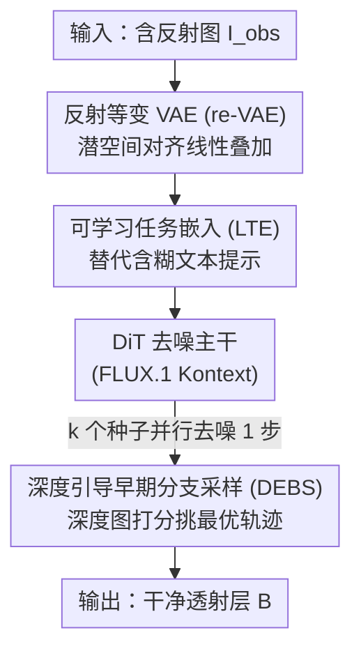

# Rectifying Latent Space for Generative Single-Image Reflection Removal

**会议**: CVPR 2026  
**论文**: [CVF Open Access](https://openaccess.thecvf.com/content/CVPR2026/html/Li_Rectifying_Latent_Space_for_Generative_Single-Image_Reflection_Removal_CVPR_2026_paper.html)  
**代码**: https://gensirr.research.mingjia.li (项目页)  
**领域**: 图像恢复 / 反射去除 / 扩散模型  
**关键词**: 单图反射去除, 潜空间对齐, 等变VAE, 可学习任务嵌入, 测试时缩放

## 一句话总结
GenSIRR 把一个图像编辑扩散大模型（FLUX.1 Kontext）改造成单图反射去除器，核心是让 VAE 的潜空间"看懂"反射图是背景层和反射层的线性叠加（reflection-equivariant VAE），再配上可学习的任务嵌入替代含糊的语言提示、以及用深度图早期分支挑选最优采样轨迹，在 Real20/SIR2/Nature 等基准上刷到新 SOTA，并在真实野外照片上展现出强泛化。

## 研究背景与动机
**领域现状**：单图反射去除（Single-Image Reflection Removal, SIRR）是一个高度病态的逆问题。透过玻璃等透明表面拍照时，传感器记录到的是透射层 $B$ 与反射层 $R$ 的叠加，经典物理模型写作 $I_{\text{obs}} = (1-\alpha)B + \alpha R$，目标是从 $I_{\text{obs}}$ 中恢复出干净的 $B$。从早期手工先验（相对平滑、梯度稀疏、重影线索）到 CNN/Transformer，再到近期的扩散方法，社区一直在用各种规模的预训练模型去缓解它的病态性。

**现有痛点**：作者点出一个"房间里被忽视的大象"——叠加图 $I_{\text{obs}}$ 由于语义上的模糊性，根本无法被预训练模型很好地感知。形式化地说，预训练编码器 $E$ 给出的潜表示 $z_I = E(I_{\text{obs}})$ 并不等于其组成成分嵌入的线性组合 $(1-\alpha)z_B + \alpha z_R$，即 $z_I \neq (1-\alpha)z_B + \alpha z_R$。对于图像分类驱动的预训练模型，因为广泛使用 Mixup 之类的增强，这个问题不算严重；但对在图文对上训练的潜扩散模型（LDM），这一点从未被处理过。

**核心矛盾**：作者用一个关键实验（Table 1）说明了问题本质：仅用标准重建损失把 VAE 微调到能更好地重建合成混合图，对最终的反射去除性能几乎没帮助；真正带来大幅提升的，是把 $z_I$ 显式对齐到 $(1-\alpha)z_B + \alpha z_R$。换句话说，瓶颈不在重建保真度，而在潜空间是否具备"理解叠加"的几何结构。此外，把 LDM 用于 SIRR 还有两个落地障碍：一是必须用自然语言描述场景，但叠加图本身语义模糊，打标/描述模型很难给出正确文本；二是生成模型固有的随机性会让不同初始噪声产出质量参差不齐的结果，而从多次采样里挑最优往往算力上不可行。

**本文目标**：把一个强大的预训练图像编辑 LDM "驯服"成精确、鲁棒的 SIRR 模型，具体拆成三个子问题——(1) 重塑潜空间使其反射等变；(2) 绕开含糊的文本提示给出精确的任务引导；(3) 在近似单次推理的代价内，从随机性里稳定地挑出高质量结果。

**切入角度**：既然问题根源是"潜空间不理解线性叠加"，那就直接在潜空间里施加线性叠加约束，让编码器学会把叠加图解构为两层的线性混合。这个视角的普适性在于，它原则上可外推到水印去除、alpha matting 等其它"层叠加"问题（本文受篇幅限制只聚焦反射去除）。

**核心 idea**：用"反射等变 VAE + 可学习任务嵌入 + 深度引导早期分支采样"三件套，把图像编辑大模型 FLUX.1 Kontext 适配到 SIRR——其中潜空间的反射等变对齐是整个方法的灵魂。

## 方法详解

### 整体框架
GenSIRR 的目标是把预训练图像编辑 LDM（基座选 FLUX.1 Kontext）改造成 SIRR 模型。整个流水线含两个可训练组件 + 一个可选的测试时模块，对应三个阶段：**阶段 I** 训练反射等变 VAE（re-VAE），用等变损失重塑潜空间的几何结构，让它认识到叠加图是两层的线性混合；**阶段 II** 冻结 VAE 编/解码器，用一段文本嵌入初始化可学习任务嵌入（LTE）并随 DiT 主干一起微调，让模型在没有自然语言提示的情况下也能被精确引导执行"去反射"；**阶段 III** 是可选的测试时缩放——用不同种子并行采样、用深度图打分挑出最忠实的候选轨迹继续去噪（DEBS）。输入是单张含反射的图 $I_{\text{obs}}$，输出是去除反射后的干净透射层 $B$。

### 关键设计

**1. 反射等变 VAE（re-VAE）：让潜空间理解"叠加 = 线性混合"**

这是全文的核心，针对的痛点正是"预训练编码器无法把叠加图解读为两层的线性叠加"。作者先指出一个朴素方案的不足：仅用标准重建损失（像素 L2 + LPIPS）微调 VAE，

$$\mathcal{L}_{\text{recon}} = \lVert D(E(x)) - x \rVert_2^2 + \text{LPIPS}(D(E(x)), x)$$

确实能提升对合成混合图的重建保真度，但这只是"硬把 VAE 塞进一个新分布"，并没有赋予潜空间良好的几何结构——从重建走到反射去除时，缺的恰恰是这种几何。于是作者的目标不是改善重建指标，而是把潜空间重塑成"反射等变"的：让观测图 $I_{\text{obs}} \approx (1-\alpha)B + \alpha R$ 这一线性物理关系，在编码器输出端也成立。具体施加的是等变损失（原文称 equivalence loss）：

$$\mathcal{L}_{\text{equiv}} = \left\lVert E(I_{\text{obs}}) - \left( (1-\alpha)E(B) + \alpha E(R) \right) \right\rVert_2^2$$

训练时随机采样背景 $B$、反射 $R$ 和插值因子 $\alpha \in [0,1]$ 合成 $I_{\text{obs}}$，把 $\mathcal{L}_{\text{recon}}$ 与 $\mathcal{L}_{\text{equiv}}$ 联合优化。这样 VAE 既能忠实重建输入，又显式"意识到"线性叠加原理。为避免潜空间剧烈漂移，作者只训一个 rank=8 的 LoRA 适配器。为什么有效：Table 1 显示加上 $\mathcal{L}_{\text{equiv}}$ 后，合成数据上的重建分数与基线相当，但真实图像（Real20）上的 SIRR 性能从 25.79 dB 跳到 27.27 dB——证明真正起作用的是潜空间结构，而非重建保真度本身。

**2. 可学习任务特定文本嵌入（LTE）：绕开含糊语言，直接给 LDM 任务向量**

这一设计针对"叠加图语义模糊、自然语言提示难以正确描述去反射任务"的痛点。作者不再依赖打标/描述模型生成文本，而是引入一段可学习任务嵌入 $P_{\text{task}}$：先用固定文本"please remove the reflection within the image."经文本编码器得到初始嵌入（即 Fixed Text Embedding, FTE）作为初始化，再让这段向量在微调中通过反向传播随模型一起优化。关键在于初始化——它把优化起点放在语义上有意义的位置；消融发现，若改成随机初始化或借用 RDNet 的提示生成器，损失根本不收敛，因为提示嵌入空间过于庞大，没有好起点就找不到有用的任务向量（RDNet 的提示虽在其自身架构里有效，但与 FLUX.1 的预训练知识语义不对齐）。优化后的 $P_{\text{task}}$ 脱离了原本的语言含义，演化成一个直接被 LDM 注意力机制理解的"去反射"任务指令。

**3. 深度引导早期分支采样（DEBS）：把生成随机性变成可控的测试时增益**

这一设计针对"生成模型随机性导致输出质量参差、且从多次完整采样里挑最优算力不可行"的痛点。作者的关键观察是：反射去除的结构性成败在第一步去噪就已基本确定（Figure 4）——如果反射在单步潜表示里被压住，最终全去噪结果里也会保持干净。于是 DEBS 从 $k$ 个不同噪声种子并行各跑一步去噪，再用一个无参考指标挑出最优候选继续完整 $T$ 步去噪、丢弃其余轨迹。这个无参考指标是深度：干净自然图通常有连贯、分段平滑的深度结构，而反射污染区会被单目深度估计器误判为漂浮在前景的"鬼影物体"，产生噪声/模糊的深度图。作者假设深度图"最深"的候选对应最好的反射去除——因为反射作为前景遮挡被成功移除后，会露出更远的真实背景，使估计深度整体增大。用一个轻量深度估计器作为感知质量代理，就能在采样早期过滤掉次优轨迹。由于只有被选中的那条轨迹才跑满 $T$ 步，总代价仅比单次推理略高（$k=4$ 时约 1.25×）。

### 损失函数 / 训练策略
两阶段训练。阶段 I（re-VAE）：用 PD-12M 数据集（约 384 万图像对）训练 rank=8 的 LoRA，AdamW、学习率 1e-4、全局 batch=128、共 30,000 次迭代，目标为 $\mathcal{L}_{\text{recon}} + \mathcal{L}_{\text{equiv}}$。阶段 II（DiT 微调）：冻结 VAE 编/解码器，从 FLUX.1 Kontext 检查点初始化，AdamW、固定学习率 1e-5、batch=32，训练数据是真实（Real / Nature / RRW）与合成图的混合，同时优化 DiT 与 LTE。阶段 III（DEBS）为可选的测试时策略，不引入额外训练。

## 实验关键数据

### 主实验
在 Real20、SIR2、Nature 三个基准上与 8 个代表性方法对比（PSNR/SSIM，越高越好）。GenSIRR 全面刷新 SOTA，加上 DEBS（$k=4$）后平均进一步提升。

| 方法 | 类型 | Real20 PSNR/SSIM | SIR2 PSNR/SSIM | Nature PSNR/SSIM | 平均 PSNR/SSIM |
|------|------|------|------|------|------|
| DSIT (NeurIPS'24) | 非生成 | 25.22/0.836 | 26.43/0.911 | 26.77/0.847 | 26.40/0.905 |
| RDNet (CVPR'25) | 非生成 | 25.71/0.850 | 26.69/0.908 | 26.31/0.846 | 26.63/0.903 |
| DAI (AAAI'26) | 生成 | 25.21/0.841 | 27.47/0.919 | 26.81/0.843 | 27.35/0.913 |
| **Ours** | 生成 | 27.27/0.871 | 27.99/0.921 | 27.30/0.838 | 27.93/0.916 |
| **Ours + DEBS (k=4)** | 生成 | **27.58/0.881** | **28.08/0.937** | **27.34/0.840** | **28.03/0.931** |

另有人类评估（Table 6，5 名评估者判断反射是否成功去除），GenSIRR 在四个数据集上的平均成功率均大幅领先：OpenRR-val 96.6%（RDNet 30.4% / DAI 41.2%）、Nature 96.0%、Real20 91.0%、SIR2 78.5%（竞品最高仅 34.2%），即使最难的 SIR2 也保持在 78% 以上。

### 消融实验
在 Real20 上验证三大组件（PSNR/SSIM）。

| 配置 | PSNR | SSIM | 说明 |
|------|------|------|------|
| VAE w/o Training | 25.72 | 0.841 | 不训 VAE |
| VAE 仅 $\mathcal{L}_{\text{recon}}$ | 25.79 | 0.842 | 仅重建损失，无等变约束 |
| VAE 完整 (Ours, 含 $\mathcal{L}_{\text{equiv}}$) | **27.27** | **0.871** | 加上等变损失 |
| 提示：Fixed text (FTE) | 26.52 | 0.830 | 固定文本提示 |
| 提示：随机初始化 / RDNet 生成 | N/A | N/A | 损失不收敛 |
| 提示：LTE (Ours) | **27.27** | **0.871** | 可学习任务嵌入 |
| DEBS：w/o (k=1) | 27.27 | 0.871 | 不用早期分支 |
| DEBS：k=4 | 27.58 | 0.881 | 4 个候选 |
| DEBS：k=8 | 27.72 | 0.879 | 8 个候选 |
| DEBS：k=16 | 27.74 | 0.882 | 16 个候选，收益饱和 |

### 关键发现
- **re-VAE 是性能关键**：仅用重建损失微调 VAE（25.79 dB）几乎等同于不训（25.72 dB），而加上等变损失直接跳到 27.27 dB——印证了作者的核心论点：起决定作用的是潜空间结构而非重建保真度。
- **LTE 的初始化至关重要**：固定文本提示掉到 26.52 dB；随机初始化或借 RDNet 的提示生成器则因提示嵌入空间过大、缺好起点而完全不收敛。用语义有意义的文本嵌入初始化是 LTE 能学起来的前提。
- **DEBS 收益在 k=8 后饱和**：$k$ 从 1→4→8→16，PSNR 27.27→27.58→27.72→27.74，8 个候选时深度打分已大概率选到高质量轨迹，再增采样收益递减；而代价仅 $k=4$ 时 1.25×、$k=16$ 时 1.92×（256×256 图，2061.9ms→3952.4ms）。
- **速度换可靠性的权衡**：GenSIRR 单图约 2 秒（k=4 时 2580ms），远慢于 RDNet/DAI 的 <100ms，但成功率 90.5% 远超它们（RDNet 36.0% / DAI 46.1%）。作者认为对摄影修复任务，几秒换无伪影的成功结果是可接受的。

## 亮点与洞察
- **把"病态去反射"重新定义为"潜空间几何对齐"问题**：作者没有去设计更复杂的双流/迭代交互网络，而是回到更底层——预训练编码器根本没把叠加图理解成两层的线性混合。等变损失 $\mathcal{L}_{\text{equiv}}$ 用一行公式把物理叠加先验注入潜空间，思路干净且有外推潜力（水印去除、alpha matting 等同类层叠加问题）。
- **可学习任务嵌入是绕开"语言瓶颈"的优雅做法**：对于难以用文字描述的恢复任务，与其逼着打标模型生成含糊提示，不如把任务本身蒸馏成一段直接被注意力机制理解的向量；"用 FTE 初始化"这个细节才是它能收敛的关键，可迁移到其它"文本难以描述"的条件生成任务。
- **DEBS 把生成随机性从负担变成资产**：利用"第一步去噪即定成败"的观察 + 深度作为无参考质量代理，实现了近似单次推理代价的测试时缩放。"反射被移除后深度整体变大"这一物理直觉作为打分依据，巧妙且无需训练。

## 局限与展望
- **作者承认的局限**：推理延迟高。基于迭代扩散 + 大 Transformer 主干，256×256 图约需 2 秒，远慢于非生成方法（RDNet）与一步扩散（DAI）的 <100ms。作者把加速作为后续优先方向。
- **自己发现的局限**：方法强依赖 FLUX.1 Kontext 这一大型基座的生成先验与世界知识，换小基座能否保持优势未验证；DEBS 的深度打分假设"去反射后深度整体增大"，在反射本身就远离相机或场景深度结构复杂时可能失效（⚠️ 论文未给该失败模式的定量分析，以原文为准）。SSIM 在 Nature 单项上本文（0.838~0.840）略低于个别非生成方法（如 DSIT 0.847），提示生成式输出在结构相似度上偶有取舍。
- **改进思路**：蒸馏成少步/一步采样以降延迟；把等变损失推广到多层叠加（水印、雾霾、阴影）做统一的"层解耦"恢复框架；为 DEBS 设计更鲁棒的多指标打分（深度 + 边缘/语义一致性）。

## 相关工作与启发
- **vs 非生成 SOTA（DSIT / RDNet）**: 它们用语义编码器做端到端层解耦，但编码器本身不擅长处理层叠加输入，且缺乏生成先验来补全被反射严重遮挡区域的内容，易残留伪影。本文用生成大模型 + 潜空间等变对齐，既能解耦又能合成被遮挡区域的合理纹理（Figure 6）。
- **vs 生成式 SIRR（L-DiffER / PromptRR / DAI）**: 前两者用语言引导且从零在任务数据上训练，受限于文本模糊性、也无法享用大规模预训练的世界知识；DAI 用一步扩散先验 + 新数据集，但一步先验缺乏修复重度遮挡区的生成强度，且同样没解决"叠加图潜空间无结构"这一根因。本文用 LTE 绕开语言、用 re-VAE 解决潜空间结构、用多步生成补全遮挡，三点都正面回应了它们的短板。
- **vs 通用图像编辑模型（InstructPix2Pix / ControlNet / FLUX.1 Kontext / Qwen-Image-edit）**: 它们靠文本/结构条件做通用编辑，但对 SIRR 这类高精度恢复，要么保真度不足、要么文本难以精确描述去反射指令。本文把这些强基座当起点，补上"适配到 SIRR 的关键缺件"（等变潜空间 + 任务嵌入 + 深度引导采样）。

## 评分
- 新颖性: ⭐⭐⭐⭐⭐ 把去反射重定义为"潜空间反射等变对齐"，等变损失 + 可学习任务嵌入 + 深度引导早期分支三件套都很有洞见
- 实验充分度: ⭐⭐⭐⭐ 三基准 + 人类评估 + 三组消融 + 速度/代价分析齐全，但缺对 DEBS 失败模式与基座依赖的定量剖析
- 写作质量: ⭐⭐⭐⭐⭐ 动机层层递进、用 Table 1 把核心论点钉死，方法与消融对应清晰
- 价值: ⭐⭐⭐⭐ 真实野外泛化强、成功率大幅领先，思路可外推到其它层叠加恢复任务，唯延迟较高限制实时落地

<!-- RELATED:START -->

## 相关论文

- [\[CVPR 2026\] GFRRN: Explore the Gaps in Single Image Reflection Removal](gfrrn_explore_the_gaps_in_single_image_reflection_removal.md)
- [\[CVPR 2026\] LightRR: A Lightweight Network for Single Image Reflection Removal](lightrr_a_lightweight_network_for_single_image_reflection_removal.md)
- [\[CVPR 2026\] Reflection Separation from a Single Image via Joint Latent Diffusion](reflection_separation_from_a_single_image_via_joint_latent_diffusion.md)
- [\[CVPR 2026\] ReflexSplit: Single Image Reflection Separation via Layer Fusion-Separation](reflexsplit_single_image_reflection_separation_via_layer_fusion-separation.md)
- [\[CVPR 2026\] ExpoCM: Exposure-Aware One-Step Generative Single-Image HDR Reconstruction](expocm_exposure-aware_one-step_generative_single-image_hdr_reconstruction.md)

<!-- RELATED:END -->
