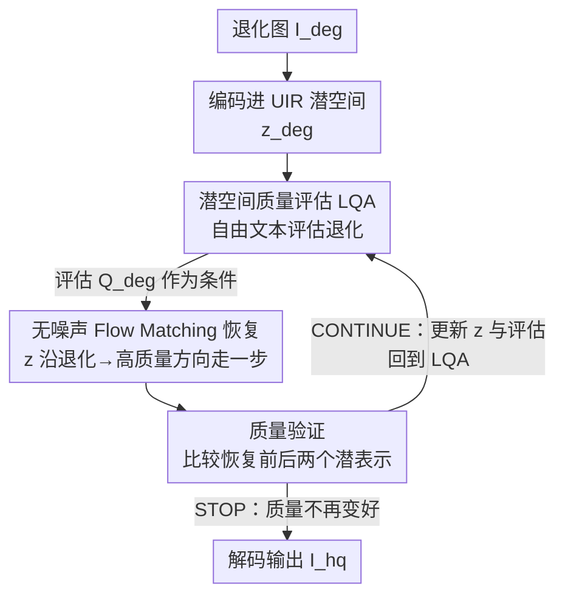

# Restore, Assess, Repeat: A Unified Framework for Iterative Image Restoration

**会议**: CVPR 2026  
**论文**: [CVF Open Access](https://openaccess.thecvf.com/content/CVPR2026/html/Chen_Restore_Assess_Repeat_A_Unified_Framework_for_Iterative_Image_Restoration_CVPR_2026_paper.html)  
**代码**: [项目页](https://restore-assess-repeat.github.io/)  
**领域**: 图像恢复  
**关键词**: 全能图像恢复, 复合退化, 图像质量评估, Flow Matching, 迭代恢复

## 一句话总结
RAR 把"图像质量评估（IQA）"和"图像恢复（IR）"塞进同一个潜空间、做成一个端到端可训练的模型，让它在潜空间里反复地"评估→恢复→再评估"，从而在未知/复合退化上又准又快（比 SOTA 快 11.27×）地把图像修干净。

## 研究背景与动机
**领域现状**：图像恢复要从被噪声、模糊、雾、雨、低光等退化破坏的图里还原出干净图。真实世界里，退化往往是**复合的、事先未知的**（一张图同时有噪声+雾+低光），这正是本文聚焦的场景。处理复合退化目前有两条路线：(1) **all-in-one 全能模型**——用一个统一的生成模型一把梭，效率高但性能落后；(2) **agentic 智能体模型**——用一个 agent 反复地从一堆"单退化专用修复工具"里挑工具用，能逐步修复但又笨又慢。

**现有痛点**：两条路线各有硬伤。全能模型这边，代表作 AutoDIR 虽然也加了评估步骤，但它靠 CLIP 做 IQA——CLIP 本质是在一组**预定义退化标签**上做 n 路分类，零样本下做 IQA 还很差，必须监督微调才能聚焦退化而非语义，泛化能力被死死锁在闭集里。agentic 这边，代表作 AgenticIR 用了描述式的 IQA（DepictQA），评估很丰富，但**IQA 和 IR 是两个脱节的模块**：修复工具得先把潜表示**解码成真实图像**，再编码进 IQA 的潜空间去评估，再交给一个大 LLM 规划下一步、试错执行——整条链路慢到离谱，而且就算 IQA 说对了退化是什么，能不能修还得看预定义工具集里有没有对应工具。

**核心矛盾**：根子在于 **IQA 与 IR 两个模块互相割裂**。评估结果要靠"文本解码"这种非可微、有信息损失的桥梁传给恢复模块，既慢又丢信息；而且评估只在最开始做一次，恢复过程中图像质量在变，评估却不更新。

**本文目标**：取两条路线之长——既要 agentic 那样**丰富的自由文本评估 + 迭代修复**，又要 all-in-one 那样**统一高效**。

**切入角度**：如果让 IQA 和 IR **共享同一个潜空间**，评估就能不经过解码、直接以 logits/embedding 形式喂给恢复模块，整个"评估-恢复"就能拧成一个端到端可训练的整体，还能在潜空间里反复迭代。

**核心 idea**：把描述式 IQA 改造成在恢复模块潜空间里工作的 **LQA（Latent Quality Assessment）**，再用 **Flow Matching** 做无噪声的迭代恢复，构成 **Restore-Assess-Repeat** 的闭环——评估、恢复、验证全在潜空间里多轮进行。

## 方法详解

### 整体框架
给定一张带未知复合退化的输入图 $I_{deg}$，RAR 的目标是自动识别退化、并迭代地把它修成高质量图 $I_{hq}$。整个过程**全程在潜空间进行**：先用 LQA 评估当前潜表示里还剩什么退化，把评估结果作为条件喂给统一恢复模块 UIR 走一步恢复，再用 LQA 重新评估新的潜表示——如此往复，直到 LQA 的"质量验证"判定不再变好就停止。相比 naive 做法（评估出文本→用扩散模型文本分支编码→恢复，评估只做一次），RAR 做了两件关键改造：把 IQA 拉进恢复模块的潜空间（LQA），并在两个模块间建立反馈回路实现多轮迭代。

### 关键设计

**1. 潜空间质量评估 LQA：把 IQA 和 IR 焊进同一个潜空间，去掉文本解码这个瓶颈**

痛点在于：naive 集成里 IQA 从像素空间出发、用自己的自编码器 $E_{IQA}$，恢复模块用另一个自编码器 $E_{restore}$，两边潜空间对不齐；而且评估结果要先解码成文本、再被扩散模型的文本条件分支编码回去，这一步既**非可微**（没法端到端训）又**有信息损失**。LQA 把这两处都对齐了。首先做**输入端对齐**：恢复模块把退化图投影成 $z_{deg}=E_{restore}(I_{deg})$，LQA 不再从像素读图，而是接一个可训练适配器 $\mathcal{A}_I$ 把恢复模块的潜表示桥接进 IQA：
$$LQA(z_{deg}) = IQA(\mathcal{A}_I(z_{deg}))$$
其次做**条件端对齐**：不再用 IQA 输出的文本，而是直接把 IQA 的输出潜表示 $\tilde{Q}_{deg}=LQA(z_{deg})$ 对齐到恢复模块文本条件分支 $\mathcal{T}$ 的输出嵌入，用另一个适配器 $\mathcal{A}_Q$：
$$Q_{deg} = \mathcal{T}(\mathcal{A}_Q(\tilde{Q}_{deg}))$$
这一步直接拿 embedding 当条件、绕过文本解码，于是恢复模块那个又重又慢的文本条件分支可以**整个砍掉**，省下延迟和参数量。训练用两阶段策略：先冻住 IQA/UIR 主体只训适配器，再解冻全部微调。底座方面，IQA 用能输出自由文本、还能比较图像对的 **DepictQA**（VLM-based），UIR 用任意强生成模型。消融（表 4）显示：用 embedding 替代 text 条件、用 latent 替代 pixel 输入空间，PSNR 从 24.70 一路涨到 28.49（未知退化），印证了"去解码、共享潜空间"的价值。

**2. 无噪声 Flow Matching 恢复：让中间潜表示可以反复被评估而不被噪声污染**

要做迭代评估，就得拿恢复过程中的**中间潜表示** $z^n_{deg}$ 重新喂给 LQA。但如果用标准扩散去噪范式，中间表示里**带着加进去的噪声**，LQA 读出来的评估就不准。作者因此换成 **Stable Diffusion 3.5 的 Flow Matching（FM）**，并做了一个关键改动：去掉噪声项，**直接学从退化图分布 $\rho_{deg}$ 到高质量图分布 $\rho_{hq}$ 的映射**（而不是常见的从噪声 $\mathcal{N}(0,I)$ 出发、把退化图当条件）。训练一个速度场 $v_\theta$ 预测两个分布间的速度向量：
$$\mathcal{L}_v = \mathbb{E}_{z_{deg},z_{hq},Q_{deg},t}\, \| v_\theta(z_t,Q_{deg},t) - (z_{hq}-z_{deg}) \|^2$$
其中 $z_t=(1-t)z_{deg}+t\,z_{hq}$ 是两分布间的线性插值。这样一来，迭代时每一步更新的输入 $z^n_{deg}$ 始终是"干净的"退化潜表示，没有噪声污染，LQA 才能给出有意义的反馈。消融（表 5）显示：迭代条件对 FM 是增益（SD3.5 复合退化 PSNR 18.76→19.16），对扩散却是**负作用**（SD1.5 反而从 18.37 掉到 18.17），正是因为扩散的噪声破坏了 LQA 要读的潜表示。

**3. Restore-Assess-Repeat 迭代闭环 + 质量验证停止准则：动态更新条件，自适应决定修几轮**

有了无噪声 FM，就能在两个模块间挂一条反馈回路。UIR 以初始 $z^0_{deg}$ 和初始评估 $Q^0_{deg}$ 起步，每隔若干步用预测速度更新输入 $z^{n+1}_{deg}=z^n_{deg}+v^n$，同时用 LQA 重新评估更新条件 $Q^{n+1}_{deg}=LQA(z^{n+1}_{deg})$。训练目标相应改成在中间表示上做（公式 6，把 $z_{deg},Q_{deg}$ 换成 $z^n_{deg},Q^n_{deg}$），无缝融进标准 FM 训练——训练时可在任意随机时间步调用 LQA。这就实现了"先去噪、再回看发现还有雾、下一轮去雾"这样的**渐进式按需修复**。

推理时则需要一个**停止准则**：每走 $T$ 步，复用 DepictQA"能比较图像对"的能力，让 LQA 拿恢复前后的两个潜表示 $z^n_{deg}$ 与 $z^{n+T}_{deg}$ 做比较，输出二值决策——若新潜表示更好则 **CONTINUE**，否则 **STOP** 并把 $z^n_{deg}$ 作为最终输出。消融（表 6）显示该准则平均跑 **2.4 轮**，在保真度（PSNR/SSIM）和感知质量（CLIP-IQA/MUSIQ）之间取得了好的平衡：固定跑 1 轮保真最高但感知差，固定跑 4 轮感知最好但保真掉，2.4 轮恰好落在折中点。

## 实验关键数据

### 主实验
覆盖三类设定：复合退化（按 AgenticIR 用 MiO100 构造的 16 组混合退化，分 A/B/C 三档，C 含 3 种退化最难）、未知退化（UDC/EUVP）、单退化（AutoDIR 设定，8 个标准基准平均）。

复合退化（节选 Group C，最难的 3 退化档）：

| 指标 | RAR | AgenticIR | AutoDIR |
|------|-----|-----------|---------|
| PSNR ↑ | **19.33** | 18.82 | 18.61 |
| SSIM ↑ | **0.6579** | 0.5474 | 0.5443 |
| LPIPS ↓ | **0.1489** | 0.4493 | 0.5019 |
| MANIQA ↑ | **0.4653** | 0.2698 | 0.2045 |
| CLIP-IQA ↑ | **0.6554** | 0.3948 | 0.2939 |
| MUSIQ ↑ | **56.56** | 48.68 | 37.86 |

感知指标上 RAR 大致是 SOTA 的约 2 倍，且越难的设定优势越大。未知退化（UDC）RAR 同样全面领先（MUSIQ 55.97 vs AgenticIR 52.76，CLIP-IQA 0.602 vs 0.358）。单退化上 RAR 保真指标（PSNR 25.88）略逊于 AutoDIR（27.81），但感知指标全面领先（LPIPS 0.0699 vs 0.1283，MANIQA 0.4125 vs 0.3053）——作者解释这是因为单退化测试集的 GT 往往只修了一个问题、还留着别的退化，而 RAR 倾向把所有退化都修掉，"修过头"了反而拉低对 GT 的保真。

效率（表 7，Group A）：

| 方法 | 墙钟时间 | 平均轮数 | LPIPS ↓ |
|------|---------|---------|---------|
| RAR | **6.29** | 2.82 | **0.1299** |
| AutoDIR | 14.30 | 2.92 | 0.3967 |
| AgenticIR | 48.00 | 3.37 | 0.3148 |

RAR 比 AgenticIR 快约 11.27×，参数量还更低。

### 消融实验

| 配置 | 未知退化 PSNR | 复合退化(C) PSNR | 说明 |
|------|------|------|------|
| CLIP + Text + Pixel (SD1.5) | 20.67 | 16.70 | naive 起点 |
| DepictQA + Text + Pixel (SD1.5) | 22.34 | 17.67 | 换描述式 IQA |
| DepictQA + Text + Pixel (SD3.5) | 24.41 | 17.88 | 换强底座 |
| + noise-free cond. | 24.70 | 17.89 | 去噪声条件 |
| + Latent 输入空间 | 24.90 | 18.72 | 输入端对齐 |
| **+ Embedding 条件 (Full)** | **28.49** | 18.76 | 条件端对齐 |

| 训练方式 | 未知 PSNR | 复合(C) PSNR | 说明 |
|------|------|------|------|
| SD1.5 非迭代 | 25.57 | 18.37 | — |
| SD1.5 迭代 | 23.05 | 18.17 | 噪声污染，**反而掉** |
| SD3.5 非迭代 | 28.49 | 18.76 | — |
| SD3.5 迭代 (Full) | **28.60** | **19.16** | 无噪声 FM 才吃得到迭代红利 |

### 关键发现
- **贡献最大的是"共享潜空间 + embedding 条件"**：未知退化上从 24.90（Latent+Text）跳到 28.49（Latent+Embedding），embedding 比解码后的文本携带更多信息、且更高效。
- **迭代红利只有无噪声 FM 才吃得到**：同样开迭代条件，扩散（SD1.5）因噪声污染潜表示反而掉点，FM（SD3.5）才稳定涨点——这把"为什么非要换成无噪声 Flow Matching"解释清楚了。
- **保真 vs 感知是设定相关的权衡**：复合/未知退化 RAR 全面碾压；单退化保真略逊纯粹是因为 GT 本身没修干净、RAR"修过头"。

## 亮点与洞察
- **"共享潜空间"是把 IQA-IR 解耦瓶颈一刀切掉的关键**：以往评估→恢复要经过"解码成文本/图像→再编码"这种非可微、有损的桥，本文让两者吃同一套潜表示、直接传 embedding，既能端到端训又省掉文本条件分支，可迁移到任何"评估+生成"耦合的任务（如可控编辑、带反馈的生成）。
- **用 Flow Matching 的无噪声特性服务"中间表示要被反复读"这一需求**：这是把模型选型和任务需求精准对齐的范例——不是为了用 FM 而用 FM，而是因为扩散的噪声会污染 LQA 的读数，迭代评估这条路才逼着换成无噪声 FM。
- **复用 DepictQA 的"图像对比较"能力当停止准则**：同一个 LQA 既做评估又做"修得有没有更好"的二值裁决，零额外模块就实现了自适应停止，平均 2.4 轮省算力。
- **"修过头"现象很有启发**：RAR 在单退化上保真略低恰恰暴露了现有 GT 标注本身不干净，提示感知指标在复合退化场景比保真指标更可信。

## 局限与展望
- **单退化保真度偏低**：迭代修复倾向去掉所有退化，会超出"只修一个问题"的 GT，导致 PSNR/SSIM 落后于 AutoDIR——在重保真的应用（如医学、取证）上是隐患。
- **依赖底座质量**：LQA 建立在 DepictQA 之上、UIR 用 SD3.5，整体性能与停止决策都受这两个底座能力上限约束；DepictQA 评估错时会带偏整个迭代。
- **架构与训练细节放在补充材料**：正文未给出适配器结构、两阶段训练超参等可复现细节，复现门槛较高。
- **停止准则的可靠性未压力测试**：二值 CONTINUE/STOP 由 LQA 比较得出，若 LQA 误判"变好了"，迭代可能过早停或停不下来，论文只在 UDC 上报了平均轮数。

## 相关工作与启发
- **vs AutoDIR**: 同样想用 IQA 处理未知退化，但 AutoDIR 靠 CLIP 做闭集 n 路分类、零样本差、必须微调到预定义标签集，泛化受限；RAR 改用自由文本描述式的 DepictQA 并拉进共享潜空间，端到端可训、开放评估，复合/未知退化上大幅领先。
- **vs AgenticIR**: 都用 DepictQA 类 VLM 做 IQA，但 AgenticIR 的 IQA 与 IR 工具脱节——要解码成图像再编码、再交大 LLM 试错规划，又慢又受限于工具集；RAR 把两者焊进一个潜空间、做成单一端到端模型，快约 11.27× 且性能更好。
- **vs 传统 all-in-one 生成模型（PromptIR/AdaIR/InstructIR 等）**: 它们多依赖已知退化先验或分类器、退化种类受限；RAR 不假设已知退化，用 LQA 反馈动态条件化，能处理未知/复合退化。

## 评分
- 新颖性: ⭐⭐⭐⭐⭐ 把 IQA-IR 焊进共享潜空间 + 无噪声 FM 支撑潜空间迭代评估，是对"评估-恢复解耦"瓶颈的干净解法
- 实验充分度: ⭐⭐⭐⭐☆ 三类设定 + 多基准 + 完整消融到位，单退化保真劣势也诚实交代，但部分细节藏在补充材料
- 写作质量: ⭐⭐⭐⭐⭐ 动机推导清晰、消融逐步拆解每个组件贡献、对反直觉结果（迭代对扩散有害）有解释
- 价值: ⭐⭐⭐⭐⭐ 在复合/未知退化上确立新 SOTA 且快一个数量级，"共享潜空间做评估反馈"的范式可迁移

<!-- RELATED:START -->

## 相关论文

- [\[CVPR 2026\] Retrieve-to-Restore: Efficient All-in-One Image Restoration with a Retrieval-Based Degradation Bank](retrieve-to-restore_efficient_all-in-one_image_restoration_with_a_retrieval-base.md)
- [\[CVPR 2026\] Toward Real-world Infrared Image Super-Resolution: A Unified Autoregressive Framework and Benchmark Dataset](real_iisr_infrared_image_super_resolution_autoregressive.md)
- [\[CVPR 2026\] Self-supervised Dynamic Heterogeneous Degradation Modeling for Unified Zero-Shot Image Restoration](self-supervised_dynamic_heterogeneous_degradation_modeling_for_unified_zero-shot.md)
- [\[CVPR 2026\] MMDIR: Multimodal Instruction-Driven Framework for Mixed-Degradation Document Image Restoration](mmdir_multimodal_instruction-driven_framework_for_mixed-degradation_document_ima.md)
- [\[CVPR 2026\] FAPE-IR: Frequency-Aware Planning and Execution Framework for All-in-One Image Restoration](fape-ir_frequency-aware_planning_and_execution_framework_for_all-in-one_image_re.md)

<!-- RELATED:END -->
