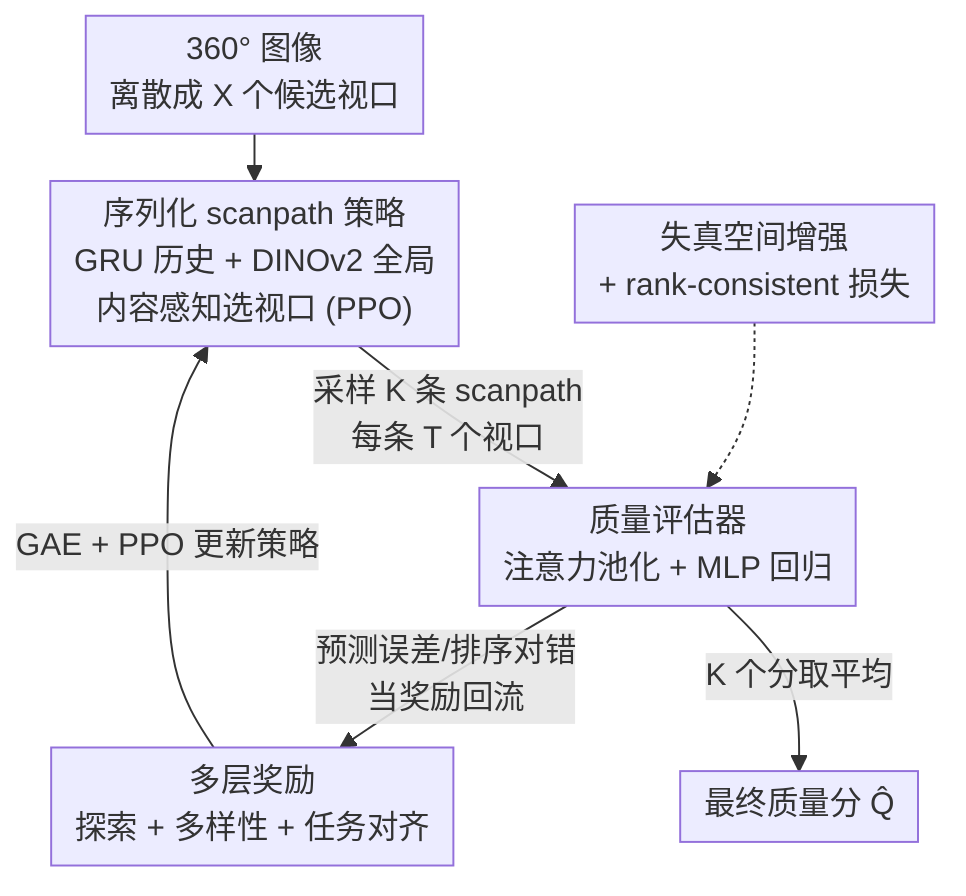

# RL-ScanIQA: Reinforcement-Learned Scanpaths for Blind 360deg Image Quality Assessment

**会议**: CVPR 2026  
**论文**: [CVF Open Access](https://openaccess.thecvf.com/content/CVPR2026/html/Wang_RL-ScanIQA_Reinforcement-Learned_Scanpaths_for_Blind_360deg_Image_Quality_Assessment_CVPR_2026_paper.html)  
**代码**: 无  
**领域**: 图像质量评估 / 低层视觉  
**关键词**: 360°图像质量评估, 盲质量评估, 强化学习, scanpath, PPO

## 一句话总结
RL-ScanIQA 把 360° 全景图的盲质量评估（BIQA）重构成一个"主动感知"问题：用 PPO 训练一个 scanpath 策略去自主选择该看哪些视口，再用一个质量评估器给分，两者端到端联合优化、靠质量预测反馈直接驱动策略（不再需要人类眼动标注），配合多层奖励和失真空间增强，在三个 360° IQA 基准上取得 SOTA。

## 研究背景与动机
**领域现状**：图像质量评估（IQA）要预测人对图像的主观感知质量。现实中往往拿不到参考图，因此无参考的盲质量评估（BIQA）最受关注。360° 全景图和普通平面图不同——它拍在球面上，人在沉浸式环境里任一时刻只能看到一个有限视口，要靠头动+眼动一段段地扫。于是"看了哪些区域"（scanpath，扫视路径）直接决定了你遇到哪些失真，进而决定感知质量。

**现有痛点**：针对 360° 的 BIQA 大致三类做法都各有硬伤。一是直接在等距柱状投影（ERP）整图上分析，但 ERP 把球面拍平会引入固有的空间畸变和极区拉伸；二是用预定义/静态策略采样固定视口（如六面 CNN、图卷积），忽略了人探索的"序列性"，固定采点会漏掉局部失真；三是 scanpath-based 方法，确实更接近人眼，但它们**把 scanpath 生成当成一个独立的、外部训练的预处理步骤**，靠启发式或模仿人类眼动来训练，和后面的质量预测任务是脱钩的。

**核心矛盾**：scanpath 生成和质量评估被切成两段，导致两个问题——无法端到端优化，而且策略学到的是"模仿人怎么看"而非"怎么看才有利于评质量"。但人随便看时优先盯着显著内容，未必盯着对评分关键的失真区域；模仿人眼反而和 IQA 目标错位。

**本文目标**：让 scanpath 的生成直接服务于 IQA 目标——agent 应该学会去看那些"最能帮评估器判断质量"的视口，而不是去看"人最爱看"的视口。

**切入角度**：把视口选择看成一个序列决策问题（MDP），用强化学习让 agent 从质量预测的反馈里学探索策略。这样 scanpath 生成器和质量评估器就能端到端联合训练，且彻底摆脱对人类 scanpath 标注的依赖。

**核心 idea**：把 360° BIQA 重构成"主动感知"（active perception）——用 RL 策略边看边决定下一个视口，质量评估器的预测准确度反过来当奖励驱动策略，二者联合优化。

## 方法详解

### 整体框架
给定一张 360° 图像，方法先把观看球面离散成 $X$ 个候选视口，并把 agent 初始化在一个起始视口。**Scanpath 生成器**（一个 PPO 训练的策略）从这 $X$ 个候选里序列地采样出 $K$ 条 scanpath，每条由 $T$ 个视口组成；策略由"多层奖励"信号引导。随后**质量评估器**对每条 scanpath 评出一个质量分 $\hat{Q}_1,\dots,\hat{Q}_K$，最终图像质量取这 $K$ 个分的平均。训练时还叠加失真空间数据增强 + rank-consistent 损失来提升跨数据集泛化。关键在于这两个模块端到端联合优化：评估器给出的预测误差/排序对错，直接当作奖励回流去更新 scanpath 策略，形成"看→评分→反馈→改进看法"的闭环。

### 关键设计

**1. RL 联合优化：把 360° IQA 重构成端到端的主动感知**

针对"scanpath 生成与质量评估被切成两段、策略只会模仿人眼"这个根本痛点，本文把整个问题翻新成 RL 主动感知：scanpath 生成器（策略 $\pi_\theta$）和质量评估器是两个**联合优化**的模块，策略不再靠人类眼动监督，而是直接从评估器的质量预测反馈里拿奖励。这样 agent 学到的是"任务相关的探索轨迹"——哪里看了能让评估器评得更准就往哪看——而非简单复刻人的注视。这一重构是全文的灵魂：作者明确指出方法的价值来自"端到端任务驱动的 scanpath 学习"这个整体范式，而不在某一个孤立的奖励项或增强上。消融里也验证了这点：用真实人类眼动轨迹替换学到的策略（w/ Human GT Scanpaths）反而掉点（JUFE SRCC 0.816→0.724），因为人类 scanpath 多样性有限、且偏向显著内容而非评质量关键的失真区。

**2. 序列化 scanpath 策略：把视口选择建模成内容感知的 MDP**

把 scanpath 生成形式化成一个有限步长 $T$ 的马尔可夫决策过程。每一步 $t$，agent 在离散球面动作空间 $\{x_t^j\}_{j=1}^X$ 上选一个视口（每个视口由 yaw–pitch 中心坐标 + 固定 FOV 参数化，做水平环绕与极区钳制保证球面连续）。状态定义为 $s_t=[h_{t-1};g]$：$h_{t-1}$ 是一个 GRU 对历史视口 $\{x_1,\dots,x_{t-1}\}$ 的隐状态总结，$g\in\mathbb{R}^{1024}$ 是冻结的 DINOv2 对全图提的全局描述子。为了让决策"内容感知"，策略显式引入候选视口特征（同一个共享 DINOv2 提的 $\{f_t^j\}$），下一视口打分为

$$z_t^j = v^\top \tanh\big(W_h h_{t-1} + W_g g + W_f f_t^j + b\big) + m_t(j),$$

其中 $m_t(j)$ 是对非法视口的动态掩码，最终 $\pi_\theta(x_t\mid s_t)=\mathrm{Softmax}(\{z_t^j\}_{j=1}^X)$。策略用 PPO 优化，目标是带 clip 的代理目标 + 值损失 + 熵正则：

$$L(\theta)=\mathbb{E}\big[\min(\rho\hat{A}_t,\ \mathrm{clip}(\rho,1-\epsilon,1+\epsilon)\hat{A}_t)\big]+c_v\mathbb{E}[(V_\phi(s)-R_{total})^2]-c_H\mathbb{E}[H(\pi_\theta(\cdot\mid s))],$$

优势 $\hat{A}_t$ 用 GAE 估计。这套设计让"该往哪看"既考虑已经看过什么（GRU 历史，避免重复）、又考虑整图语境（DINOv2 全局）和候选视口本身的内容，是把"序列性 + 内容感知"落进策略的核心。

**3. 多层奖励：把稀疏的 IQA 监督变成密集的塑形信号**

只有"整条 scanpath 评分准不准"是非常稀疏的奖励，难以稳定训练且容易模式坍塌。作者设计三档奖励把它变密集：

- **A. 步级探索奖励（SER）**：每一步给局部奖励，综合四个感知线索——视口灰度直方图的香农熵 $H(x_t)$（鼓励看纹理复杂、高频、对失真敏感的区域）；基于 $1-\mathrm{SSIM}(x_{t-1},x_t)$ 的不相似项（惩罚跳到和上一视口太像的 patch，促进覆盖）；新颖性 $\delta_{new}(x_t)$（不重访已看区域）；赤道偏置先验 $B(x_t)=\exp(-\gamma_{eq}\cdot|\mathrm{pitch}(x_t)|)$（眼动研究表明人在全景里注意力集中在赤道附近）。线性组合成 $r_t=\lambda_{ent}H(x_t)+\lambda_{ssim}\mathbb{1}[t>1](1-\mathrm{SSIM})+\lambda_{nov}\delta_{new}+\lambda_{eqb}B(x_t)$。
- **B. 集合级多样性奖励（SDR）**：因为不同区域失真不同（天空易压缩伪影、地面易运动模糊）、不同人看不同地方，单条 scanpath 不够。给 $K$ 条 scanpath 一个集合级奖励 $R_{div}=\beta_{cov}\frac{|\cup_k S_k|}{X}-\beta_{jac}\frac{1}{K(K-1)}\sum_{i\neq j}\mathrm{Jacc}(S_i,S_j)$：前项奖励所有 scanpath 并集覆盖更大球面，后项用成对 Jaccard 相似度惩罚重叠，逼出一组互补而非雷同的 scanpath。
- **C. 任务对齐感知奖励（TPR）**：这是真正把奖励"锚到 IQA 目标"的一档。给定一对图及其 GT MOS，用负 MSE 奖励 $R_{mse}=-[(\hat{Q}_1-Q_1)^2+(\hat{Q}_2-Q_2)^2]$ 让策略去看那些帮评估器评准的区域；再用成对排序奖励 $R_{rank}=-\log(1+\exp[-s(\hat{Q}_1-\hat{Q}_2)])$（$s=\mathrm{sign}(Q_1-Q_2)$）保证相对质量排序正确，软排序在分差很小时仍有平滑梯度。

总奖励 $R_{total}=\frac{1}{K}\sum_k\sum_t r_t^{(k)}+R_{div}+\lambda_{mse}R_{mse}+\lambda_{rank}R_{rank}$。消融显示去掉 TPR 在 CVIQD/OIQA 掉得最狠（它直接对齐任务），去掉 SDR 在真实失真的 JUFE 上伤最大（多样性对非均匀失真最关键）。

**4. 质量评估器 + 跨域增强：注意力池化打分，失真空间增强保泛化**

质量评估器把每条 scanpath 的视口渲染成 rectilinear patch，用 DINOv2 编码成 $\{f_1,\dots,f_T\}$，再用基于全局特征 $g$ 的注意力池化聚合：注意力权重 $\alpha_t\propto \exp(v^\top\tanh(W_p f_t^k+W_g g))$，让模型强调对评质量更有信息量的视口，得到 scanpath 级表示 $m_k=\sum_t \alpha_t f_t^k$，再把 $[m_k;g]$ 喂进 MLP 回归出该 scanpath 的分 $\hat{Q}_k$。为了跨数据集鲁棒，作者在失真空间做数据增强并配 rank-consistent 损失：相似性一致性损失 $L_{cons}=(\hat{Q}_{clean}-\hat{Q}_{weak})^2$（人对轻微扰动不敏感，弱增强后分应接近）；三元组损失 $L_{triplet}$ 强制 clean<mild<strong 的失真强度排序；跨排序损失 $L_{cross}$ 保证增强后两图的相对 MOS 排序仍成立。这些增强损失针对的是"训练/测试失真分布不一致"——消融里去掉增强（w/o Aug.）跨域 PLCC 从 0.913 跌到 0.825。

### 损失函数 / 训练策略
质量评估器头的总损失为 $L_{total}=\beta_{mse}L_{mse}+\beta_{rank}L_{rank}+\beta_{cons}L_{cons}+\beta_{triplet}L_{triplet}+\beta_{cross}L_{cross}$。实现上：球面离散成 $8\times4=32$ 个候选视口，每个 $90°\times90°$ FOV、渲染成 $224\times224$；策略用 6 个 GRU 模块，初始视口仅由全局图像特征决定以避免偏置；用 Adam 训 300 epoch，策略学习率 $3\times10^{-4}$、评估器 $1\times10^{-4}$，batch=4，梯度 L2 范数裁剪到 1.0。推理时 $K=15$、$T=7$，对所有 scanpath 的预测取平均。

## 实验关键数据

### 主实验
三个 360° IQA 基准：CVIQD（528 张压缩失真图）、OIQA（320 张，JPEG/JPEG2000/高斯模糊/噪声）、JUFE（1032 张非均匀区域失真，更贴近真实，附眼动数据）。指标为 SRCC（排序相关）和 PLCC（线性相关）。

| 数据集 | 指标 | RL-ScanIQA | 之前最佳（方法） | 结果 |
|--------|------|-----------|------------------|------|
| CVIQD | SRCC / PLCC | **0.970 / 0.970** | 0.958 / 0.963（Assessor360） | 全面 SOTA |
| OIQA | SRCC / PLCC | 0.941 / **0.967** | 0.979 / 0.945（Assessor360） | PLCC 最高，SRCC 第二 |
| JUFE | SRCC / PLCC | 0.816 / **0.902** | 0.843 / 0.857（GSR-X） | PLCC 最高，SRCC 第二 |

跨数据集泛化（训一个测另外两个）：

| 训练→测试 | 指标 | RL-ScanIQA | 之前最佳 |
|-----------|------|-----------|----------|
| CVIQD→OIQA/JUFE | SRCC | **0.901 / 0.800** | 0.853 / 0.765 |
| CVIQD→OIQA/JUFE | PLCC | **0.913 / 0.822** | 0.887 / 0.749 |
| JUFE→CVIQD/OIQA | PLCC | **0.802 / 0.833** | 0.733 / 0.741 |

跨域上提升更明显——这正是失真空间增强 + rank 一致性正则发力的地方。

### 消融实验

| 配置 | JUFE SRCC | JUFE PLCC | 说明 |
|------|-----------|-----------|------|
| Main Model | 0.816 | 0.902 | 完整模型 |
| w/ Human GT Scanpaths | 0.724 | 0.752 | 换成真实人类眼动→掉点，证明学到的任务驱动 scanpath 优于模仿人眼 |
| w/o Joint Training | 0.651 | 0.783 | 两段式分开训→大幅掉点，证明联合优化是关键 |

奖励组件消融（去掉某一档奖励）：

| 配置 | CVIQD SRCC | OIQA SRCC | JUFE SRCC | 说明 |
|------|-----------|-----------|-----------|------|
| Main Model | 0.968 | 0.941 | 0.816 | 完整三层奖励 |
| w/o SER | 0.952 | 0.903 | 0.754 | 去步级探索奖励 |
| w/o SDR | 0.946 | 0.897 | 0.731 | 去多样性奖励，JUFE 伤最大 |
| w/o TPR | 0.921 | 0.874 | 0.720 | 去任务对齐奖励，CVIQD/OIQA 伤最大 |

### 关键发现
- **联合训练是命脉**：w/o Joint Training 在 JUFE SRCC 从 0.816 崩到 0.651，说明把 scanpath 和 IQA 切开是真痛点，端到端联合才让策略学到任务相关探索。
- **任务对齐奖励（TPR）最关键**：去掉它在 CVIQD/OIQA 掉得最多，因为它直接把奖励锚到质量预测目标；而多样性奖励（SDR）在真实非均匀失真的 JUFE 上最重要。
- **推理超参**：$K$（scanpath 条数）增大时 SRCC 快速上升、约 $K=15$ 饱和，再大只增计算；$T=7$ 是精度/效率最佳点（$T=4$ 探索不足，$T=15$ 提升微小但开销大）。
- **定性可视化**：高质量图策略均匀宽覆盖，低质量图注意力集中到失真高发区（过压缩天空、模糊地面），说明策略确实学会按质量自适应调整探索。

## 亮点与洞察
- **把 IQA 重构成主动感知**：最"啊哈"的地方是不再把"怎么看"当成固定预处理，而是让模型自己学"为了评质量该看哪"，并用质量预测反馈闭环驱动——这把一个静态评估任务变成了序列决策任务。
- **稀疏 IQA 监督 → 密集奖励塑形**：单一 MOS 监督太稀疏，三层奖励（步级探索/集合多样性/任务对齐）把它拆成密集塑形信号，这套"奖励工程"思路可迁移到其他需要主动采样的低层视觉任务（如全景显著性、主动缺陷检测）。
- **set-level 多样性奖励**：用并集覆盖 + 成对 Jaccard 惩罚逼出一组互补 scanpath，既模拟了不同观察者的主观差异、又对局部失真更鲁棒，是个简洁有效的设计。
- **失真空间增强 + rank 一致性**：跨域提升主要来自这里，思路是"对齐失真分布而非对齐绝对分值"，对任何跨数据集的质量/排序任务都通用。

## 局限与展望
- 作者未明确给出单条 scanpath 的推理开销，但 $K=15$、每条 $T=7$ 意味着每张图要渲染并编码上百个视口，推理成本不低（消融也承认 $K$ 越大成本线性增长）。
- 离散动作空间只有 $32$ 个候选视口、固定 $90°$ FOV，粒度较粗；更细的连续视口控制或可变 FOV 可能进一步提升，但会让 RL 更难训。
- 在 JUFE 上 SRCC 仍低于 GSR-X（0.816 vs 0.843），说明在真实非均匀失真上排序能力还有提升空间，作者强调自己 PLCC 更高（校准更好），但 SRCC 落后是个客观短板。
- 方法只评 360° 静态图，未扩到 360° 视频（虽然动机里提到全景视频质量是开放问题）；时间维度上的 scanpath 是自然延伸方向。
- 大量奖励/损失权重（$\lambda_{ent},\lambda_{ssim},\lambda_{nov},\lambda_{eqb},\beta_*$ 等）需要调，论文未给敏感性分析，复现成本可能较高。

## 相关工作与启发
- **vs Assessor360 / GSR-X（scanpath-based）**：它们都把 scanpath 生成当成独立预处理，用启发式或模仿人眼眼动来训，和 IQA 目标脱钩；本文把 scanpath 生成做成端到端的 RL 策略、直接被质量反馈驱动，因此学到的是"任务相关"而非"像人"的探索，跨域泛化明显更好。
- **vs MC360IQA / VGCN（固定视口采样）**：它们靠预定义/静态视口或图卷积建模视口空间关系，忽略观看的序列性；本文用 MDP + GRU 显式建模序列探索，能自适应聚焦失真区。
- **vs Q-Insight（多模态 RL IQA）**：Q-Insight 是语言条件的多模态 RL 质量预测，假设全帧可见、注意力均匀，不适合"任一时刻只看一个视口"的 360° 场景；本文的 RL 用在"该看哪个视口"这个 360° 特有的主动感知问题上。
- **vs ERP 整图方法（NIQE 等）**：直接在等距柱状投影上分析会被极区畸变和空间偏置拖累，本文用视口级评估绕开了 ERP 的几何失真。

## 评分
- 新颖性: ⭐⭐⭐⭐⭐ 首个把 360° BIQA 重构成端到端 RL 主动感知、联合学 scanpath+质量评估且无需人类眼动标注的框架，重构干净有力。
- 实验充分度: ⭐⭐⭐⭐ 三基准 in/cross-dataset 全测、对比 24 个方法、奖励/训练/超参消融齐全；略欠权重敏感性分析和推理开销报告。
- 写作质量: ⭐⭐⭐⭐ 动机—方法—奖励设计逻辑清晰，公式完整；部分图表 OCR 较乱但正文表述准确。
- 价值: ⭐⭐⭐⭐ 跨域泛化提升明显，"主动感知 + 多层奖励塑形"范式对其他需主动采样的低层视觉任务有迁移价值。

<!-- RELATED:START -->

## 相关论文

- [\[CVPR 2026\] Life-IQA: Boosting Blind Image Quality Assessment through GCN-enhanced Layer Interaction and MoE-based Feature Decoupling](life-iqa_boosting_blind_image_quality_assessment_through_gcn-enhanced_layer_inte.md)
- [\[CVPR 2026\] Rethinking Knowledge Transfer in Image Quality Assessment: A Perceptual Preference Structure Alignment Perspective](rethinking_knowledge_transfer_in_image_quality_assessment_a_perceptual_preferenc.md)
- [\[CVPR 2026\] Learned Image Compression via Sparse Attention and Adaptive Frequency](learned_image_compression_via_sparse_attention_and_adaptive_frequency.md)
- [\[CVPR 2026\] DPGF-Net: Dual-Prior Guided Fusion Network for Joint Assessment of Perceptual Quality and Semantic Consistency in AI-Generated Images](dpgf-net_dual-prior_guided_fusion_network_for_joint_assessment_of_perceptual_qua.md)
- [\[CVPR 2026\] Unpaired Image Deraining Using Reward-Guided Self-Reinforcement Strategy](unpaired_image_deraining_using_reward-guided_self-reinforcement_strategy.md)

<!-- RELATED:END -->
