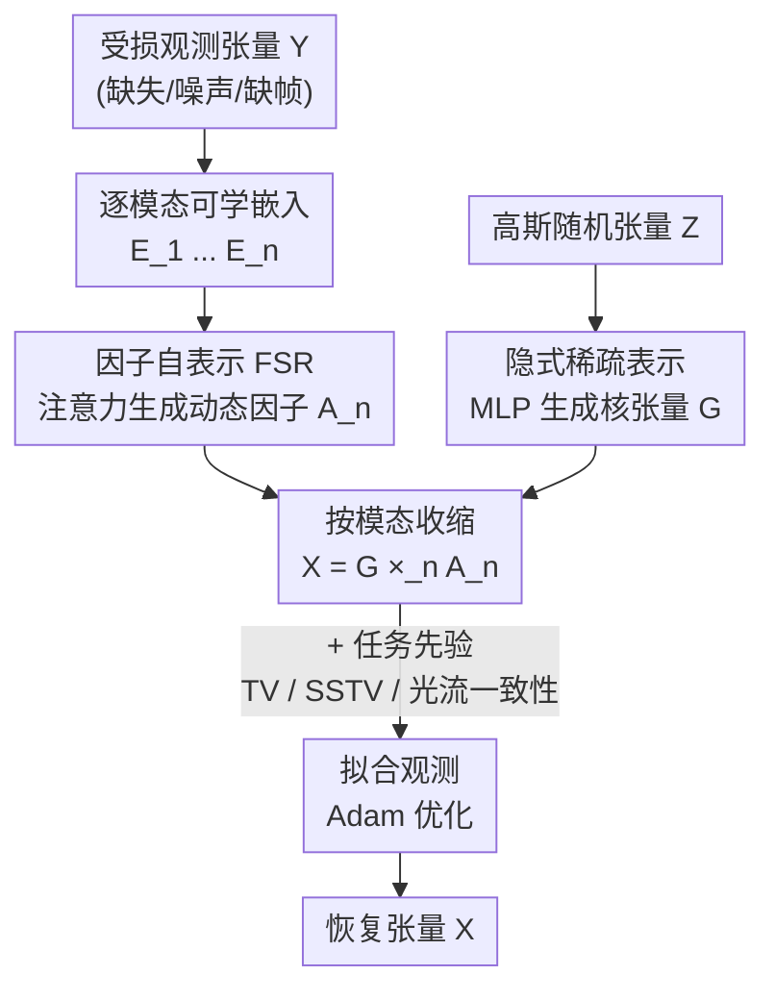

# Self-Attention Driven Tensor Representation for High-Order Data Recovery

**会议**: CVPR 2026  
**论文**: [CVF Open Access](https://openaccess.thecvf.com/content/CVPR2026/html/Shi_Self-Attention_Driven_Tensor_Representation_for_High-Order_Data_Recovery_CVPR_2026_paper.html)  
**代码**: 无  
**领域**: 图像恢复 / 低秩张量表示 / 张量补全  
**关键词**: 低秩张量表示, 自注意力, 隐式稀疏, 张量补全, 高阶数据恢复

## 一句话总结
把自注意力机制搬进低秩张量表示（LRTR）的因子建模里，用「因子自表示」替代固定的 MLP/CNN 映射来动态捕捉因子空间的局部与非局部非线性依赖，再用 MLP 参数化核张量隐式施加稀疏约束，配上可恢复性理论证明，在补全、去噪、视频插帧三类高阶数据恢复任务上一致超过现有 SOTA。

## 研究背景与动机
**领域现状**：现实世界的视觉数据（彩色视频、多光谱图像 MSI、MRI）天然是多维的，且具有强自相关性，数学上表现为低秩性。低秩张量表示（LRTR）就是从若干低秩因子出发，通过因子之间的相互作用重建出准确的低秩结构，是压缩建模高阶数据的有力工具。经典 LRTR（CP、Tucker、TSVD、TT/TR/FCTN 等张量网络分解）通过线性乘法交互来刻画低秩先验。

**现有痛点**：真实数据的依赖关系远比线性多重交互复杂，纯线性 LRTR 抓不住其中的非线性依赖。于是近年大量工作改用 MLP 或 CNN 在因子之间引入非线性映射（如分层低秩张量分解 HLRTF）。但这条路有两个硬伤：(1) **映射形式是固定的**，缺乏对局部依赖自适应的灵活性；(2) **非局部依赖的建模受网络深度和参数量限制**——想看得更远就得堆更深更大的网络。此外，绝大多数非线性 LRTR 方法**没有对应的理论支撑**，恢复性能缺乏保证。

**核心矛盾**：要想准确恢复，既需要因子映射能自适应局部结构（动态、而非固定），又需要不靠堆深度就能建模任意远的非局部关联（全局），传统 MLP/CNN 这种「固定 + 受感受野/深度约束」的范式天然两头都做不好。

**本文目标**：给 LRTR 模型装上一种「动态全局映射」机制，能同时表征局部和非局部依赖，并补齐理论分析（证明可恢复性）。

**切入角度**：作者注意到自注意力机制在建模上下文依赖上极为成功——它本质上就是一种「按内容动态计算、且天然全局」的映射，恰好对症 MLP/CNN 的两个硬伤。

**核心 idea**：构造 SADTR（Self-Attention Driven Tensor Representation），**第一个从自注意力视角建模 LRTR 非线性依赖**的框架。用注意力为每个模态生成因子（动态全局映射），用隐式神经表示约束核张量的稀疏性，并给出可恢复性的理论分析。

## 方法详解

### 整体框架
SADTR 把一个 $n$ 阶张量 $\mathcal{X}$ 重新表示为「一个核张量 + $n$ 个因子矩阵」的 Tucker 式收缩，但关键在于：核张量和因子都不再是固定的可学参数，而是分别由两个神经机制**生成**出来的。形式化定义为：

$$\mathcal{X} = \mathcal{H}_\Phi(\mathcal{Z}) \times_1 \text{FSR}_{\Theta_1}(E_1) \times_2 \text{FSR}_{\Theta_2}(E_2) \times_3 \cdots \times_n \text{FSR}_{\Theta_n}(E_n)$$

其中 $\text{FSR}_{\Theta_i}(\cdot)$ 是每个模态的**因子自表示**（用自注意力从可学习嵌入 $E_i$ 动态生成第 $i$ 个因子矩阵 $A_i$），$\mathcal{H}_\Phi(\cdot)$ 是**隐式稀疏表示**（用 MLP 把一个随机张量 $\mathcal{Z}$ 映射成核张量 $\mathcal{G}$）。整条流程是：对每个模态把可学嵌入送进自注意力，得到动态因子；同时把高斯随机张量过 MLP 得到隐式稀疏的核张量；二者按模态收缩重建出 $\mathcal{X}$，再用观测项（+任务特定先验）去拟合受损数据，反传优化所有可学参数。

### 关键设计

**1. 因子自表示 FSR：把固定映射换成注意力驱动的动态全局映射**

这一招直接打 MLP/CNN「固定映射 + 非局部受深度限制」这两个痛点。对第 $n$ 个模态，先引入一个可学习的特征嵌入矩阵 $E_n \in \mathbb{R}^{I_n \times I_n}$，每一行是该模态上某个位置的嵌入特征，把高维输入压进低维稠密空间以更准地刻画结构特征。然后从嵌入派生出查询、键、值三组投影矩阵：

$$Q_n = \sigma(E_n W_n^q),\quad K_n = \sigma(E_n W_n^k),\quad V_n = \sigma(E_n W_n^v)$$

其中 $W_n^q, W_n^k, W_n^v \in \mathbb{R}^{I_n \times r_n}$ 是可学权重，$r_n$ 是潜在投影维度，$\sigma$ 是非线性激活（实现里用正弦函数）。直觉上 $Q_n$ 编码每个因子分量「想找什么样的相关性」，$K_n$ 提供因子特征的索引、用于度量分量间相似度，$V_n$ 承载每个特征实际提供的信息。接着用标准缩放点积注意力算出权重并聚合：

$$W_n^a = \text{softmax}\!\left(\frac{Q_n (K_n)^\top}{\sqrt{r_n}}\right),\qquad A_n = W_n^a V_n$$

这样得到的因子矩阵 $A_n$ 中，**每个位置都被表达为所有位置的注意力加权非线性组合**——这正是「动态全局映射」的含义：映射权重随内容现算（动态、自适应局部），且一步就连接任意远的位置（天然非局部，不靠堆深度）。论文可视化显示 $Q_n$ 的行能量分布让信息丰富区响应更强、冗余区被抑制，注意力权重高度稀疏、只有少数关键位置被激活，说明模型确实在选择性地聚焦重要信息。

**2. 隐式稀疏表示：用 MLP 参数化核张量，免优化地施加稀疏约束**

现实数据本身常具稀疏性，很多恢复方法会对核张量显式加 $\ell_1$ 或 TV 惩罚，但这会**额外引入一个优化子问题**、增加求解复杂度。本文换了个思路：让核张量 $\mathcal{G}$ 由一个 MLP $\mathcal{H}_\Phi(\cdot)$ 从标准高斯随机张量 $\mathcal{Z} \sim \mathcal{N}(0,1)$ 生成：

$$\mathcal{G} = \mathcal{H}_\Phi(\mathcal{Z}) = W_l\,\sigma\!\big(W_{l-1}\cdots\sigma(W_1 \mathcal{Z})\big)$$

稀疏性不是被惩罚项「逼」出来的，而是被这个隐式神经表示「天生」带出来的。论文给出 Theorem 1（隐式稀疏）做支撑：若各层权重满足 $\|W_i\|_1 \le \gamma$、激活 $\sigma$ 是 $\delta$-Lipschitz，则对任意 $a, b$ 有

$$\|\mathcal{H}_\Phi(a) - \mathcal{H}_\Phi(b)\|_1 \le \gamma^l \delta^{l-1}\|a - b\|_1$$

由于输入 $\mathcal{Z}$ 服从高斯分布，高维空间里 $\|a-b\|_1$ 趋于常数，于是输出 $\mathcal{G}$ 的差异被压到有限上界——统计上元素就会聚集在零附近，形成隐式稀疏分布。论文用 PDF/直方图佐证：核张量 $\mathcal{G}$ 的元素显著更集中于 0，比直接学一个核张量更稀疏。好处是既保住了稀疏先验，又**完全避免了显式正则带来的额外优化**。

**3. 可恢复性理论分析：给非线性 LRTR 补上恢复保证**

针对「非线性 LRTR 普遍缺理论支撑」这个空白，作者以三阶张量补全为例做了完整推导。先把 SADTR 写成补全模型 $\min_{\Phi, \{\Theta_k\}} \|\mathcal{Y} - \mathcal{M} \odot \mathcal{X}\|_F^2$（$\mathcal{M}$ 是掩码），定义解集与泛化误差 $\text{Gap}(\mathcal{X}, \Omega) = \sqrt{\text{loss}_1(\mathcal{X})} - \sqrt{\text{loss}_2(\mathcal{X})}$（观测损失与全量损失之差）。Lemma 1 给出解空间覆盖数的上界 $N(\mathcal{X}^{SR}, \varepsilon)$，Lemma 2 进一步把这个复杂度度量转成泛化间隙的概率上界。最终 Theorem 2（可恢复性）表明：恢复误差由**噪声 $\mathcal{N}$、泛化误差 $\text{Gap}^*(\Omega)$、表示误差**三部分构成，三者同时趋零才能精确恢复——这要求模型在「表达力（压低表示误差）」与「简洁性（压低泛化误差）」之间取得平衡。这套分析框架可自然推广到更高阶张量及其他非线性张量分解模型，是本文区别于以往纯经验非线性 LRTR 的关键贡献。

### 损失函数 / 训练策略
SADTR 提供两个版本：**SADTR\*** 只建模低秩先验，**SADTR** 在此之上叠加任务特定先验。三类应用对应三个目标函数：
- **高阶数据补全**：$\min \|P_\Omega(\mathcal{Y} - \mathcal{X})\|_F^2 + \mu_1 \|\mathcal{X}\|_{TV}$，用全变分 TV 引入局部平滑（$\mu_1 = 4\times10^{-5}$）。
- **多光谱图像去噪**：$\min \|\mathcal{Y} - \mathcal{X} - \mathcal{S}\|_F^2 + \mu_2 \|\mathcal{X}\|_{SSTV}$，$\mathcal{S}$ 是待估稀疏噪声项，SSTV 是空间-光谱 TV（$\mu_2 = 5\times10^{-7}$；仅高斯噪声时去掉 $\mathcal{S}$，用交替极小法求解）。
- **视频帧合成**：$\min \|\mathcal{Y} - \mathcal{X} \times_4 W\|_F^2 + \mu_3 \|\mathcal{X}\|_\Re$，$\|\cdot\|_\Re$ 是光流一致性先验、保证帧间光流连贯（$\mu_3 = 0.5$）。

所有模型统一用 Adam 优化（可微目标下定步长长期迭代收敛到不动点），参数用标准正态初始化，激活用正弦函数，秩取 $r_i = I_i / k$、$k \in \{1,2,4,8,16\}$ 搜索，隐式稀疏 MLP 层数设为 2。

## 实验关键数据

### 主实验
三类高阶数据恢复任务，指标为 PSNR / SSIM，对比线性 LRTR（FTNN、FCTN、HTNN）与非线性 LRTR（HLRTF、LRTFR、OTLRM）等。

高阶数据补全（极端缺失率 MR=95%，越高越难）：

| 数据 | 指标 | OTLRM(前SOTA) | SADTR\* | SADTR |
|------|------|------|------|------|
| 3D MSI (256×256×31) | PSNR | 34.667 | 35.935 | **36.759** |
| 3D MSI | SSIM | 0.946 | 0.957 | **0.974** |
| 4D 彩色视频 | PSNR | 28.273 | 28.357 | **29.732** |
| 5D 光场 | PSNR | 31.295 | 32.072 | **32.614** |

多光谱图像去噪（Case 2 = 高斯+稀疏噪声）：

| 数据 | 指标 | 最强对比 | SADTR\* | SADTR |
|------|------|------|------|------|
| MSI Imgb2/Beers | PSNR | 32.110 (HLRTF) | 33.143 | **33.586** |
| HSI WDC/Pavia | PSNR | 31.336 (E3DTV) | 31.259 | **31.809** |

视频帧合成（UCF-101，缺失偶数帧）：SADTR 视觉上明显优于只用低秩先验的 FTNN 等，在 BlowingCandles / ApplyEyeMakeup 上 PSNR 领先（如 31.82 vs OTLRM 27.49 一例）。

### 消融实验
在 MSI Toys 补全（MR=95%）与 MSI Beers 去噪（Case 1）上逐步拆组件：

| 配置 | 说明 |
|------|------|
| SADTR-V0 | 完整模型 |
| SADTR-V1 | 所有因子都去掉 FSR |
| SADTR-V2 | 因子 2、3 去掉 FSR |
| SADTR-V3 | 因子 3 去掉 FSR |
| SADTR-V4 | 去掉隐式稀疏表示 |

### 关键发现
- **FSR 越用得多越好**：从 V1（全去）→ V3（只保留 1、2 模态）→ V0（全保留），PSNR 逐级上升，说明在每个模态都用注意力动态生成因子能稳定带来增益，验证了「动态全局映射」相对固定映射的优势。
- **隐式稀疏不可或缺**：去掉它（V4）后掉点，证明用 MLP 参数化核张量隐式施加稀疏确实在提升整体性能、而非可有可无的修饰。
- **额外先验显著加成**：SADTR 在 SADTR\* 基础上叠加 TV/SSTV/光流先验后几乎在所有设置上再涨一截（如 3D MSI 补全 PSNR 35.935→36.759），说明该范式能方便地融入任务知识。

## 亮点与洞察
- **把自注意力当成「映射」而非「网络层」**：以往非线性 LRTR 把 MLP/CNN 当固定非线性映射插在因子之间，本文洞察到自注意力本质是「内容自适应 + 天然全局」的动态映射，正好补齐固定映射和受限感受野两个短板——这个视角迁移很巧。
- **隐式稀疏代替显式正则**：不靠 $\ell_1$/TV 惩罚硬压，而是用 MLP+高斯输入让稀疏性「自然涌现」，还配了 Lipschitz 上界证明，省掉一个优化子问题——这个「用表示结构换正则项」的思路可迁移到其他需要稀疏/平滑先验的重建任务。
- **理论与方法配套**：覆盖数→泛化间隙→可恢复性的完整链条，把恢复误差拆成噪声/泛化/表示三项，给非线性张量恢复这一向来偏经验的方向立了个可分析的样板。
- **一套表示打三类任务**：补全、去噪、插帧只换观测项和先验项，主干 SADTR 不变，体现了统一表示的灵活性。

## 局限与展望
- **作者承认**：精确恢复需要噪声、泛化误差、表示误差三者同时趋零，这是个较强的联合条件；理论以三阶张量为例展开，更高阶虽称可推广但未给完整证明（细节在补充材料）。
- **自己发现**：嵌入矩阵 $E_n \in \mathbb{R}^{I_n \times I_n}$ 和按模态做注意力意味着复杂度随各维尺寸增长，超大张量上的可扩展性和显存开销没讨论；激活固定用正弦、秩按 $I_i/k$ 网格搜索，超参/激活的选择对结果的鲁棒性也未充分展开。
- **改进思路**：可探索多头/稀疏注意力降低逐模态注意力成本；把隐式稀疏的 MLP 换成更强的隐式神经表示（如带位置编码的 INR）可能进一步提升核张量建模；在更高阶（如 6 阶以上医学/遥感数据）上验证统一表示的边界。

## 相关工作与启发
- **vs 线性 LRTR（CP / Tucker / TT / TR / FCTN）**：它们用固定线性乘法交互刻画低秩，抓不住非线性依赖；SADTR 用注意力引入动态非线性映射，在所有任务上大幅领先。
- **vs 基于 MLP/CNN 的非线性 LRTR（HLRTF / LRTFR / OTLRM）**：它们的非线性映射是固定的、非局部建模受网络深度约束，且缺理论支撑；SADTR 的因子自表示是动态全局映射，一步连接任意位置，并补齐了可恢复性分析。
- **vs 扩散模型重建（HIR-Diff）**：HIR-Diff 在含稀疏/条带噪声的复杂情形下性能骤降（如 Case 2/3 掉到 25 PSNR 左右），而 SADTR 在混合噪声下仍稳健，且无需大规模预训练。

## 评分
- 新颖性: ⭐⭐⭐⭐⭐ 首个从自注意力视角建模 LRTR 非线性的范式，视角清晰且自洽
- 实验充分度: ⭐⭐⭐⭐ 覆盖补全/去噪/插帧三任务多数据集，但消融以图呈现、缺逐项数值表
- 写作质量: ⭐⭐⭐⭐⭐ 动机—方法—理论—实验逻辑紧凑，理论部分扎实
- 价值: ⭐⭐⭐⭐ 为非线性张量恢复提供了可分析的统一框架，对低秩重建方向有方法论价值

<!-- RELATED:START -->

## 相关论文

- [\[CVPR 2026\] Gaussian Splatting-based Low-Rank Tensor Representation for Multi-Dimensional Image Recovery](gaussian_splatting-based_low-rank_tensor_representation_for_multi-dimensional_im.md)
- [\[CVPR 2026\] Self-Diffusion Driven Blind Imaging](self-diffusion_driven_blind_imaging.md)
- [\[CVPR 2026\] Spectral Super-Resolution via Adversarial Unfolding and Data-Driven Spectrum Regularization](spectral_super-resolution_via_adversarial_unfolding_and_data-driven_spectrum_reg.md)
- [\[CVPR 2026\] PNG: Diffusion-Based sRGB Real Noise Generation via Prompt-Driven Noise Representation Learning](diffusion-based_srgb_real_noise_generation_via_prompt-driven_noise_representatio.md)
- [\[CVPR 2026\] BiProLoRA: Bilevel Prompt LoRA for Real Scene Recovery](biprolora_bilevel_prompt_lora_for_real_scene_recovery.md)

<!-- RELATED:END -->
