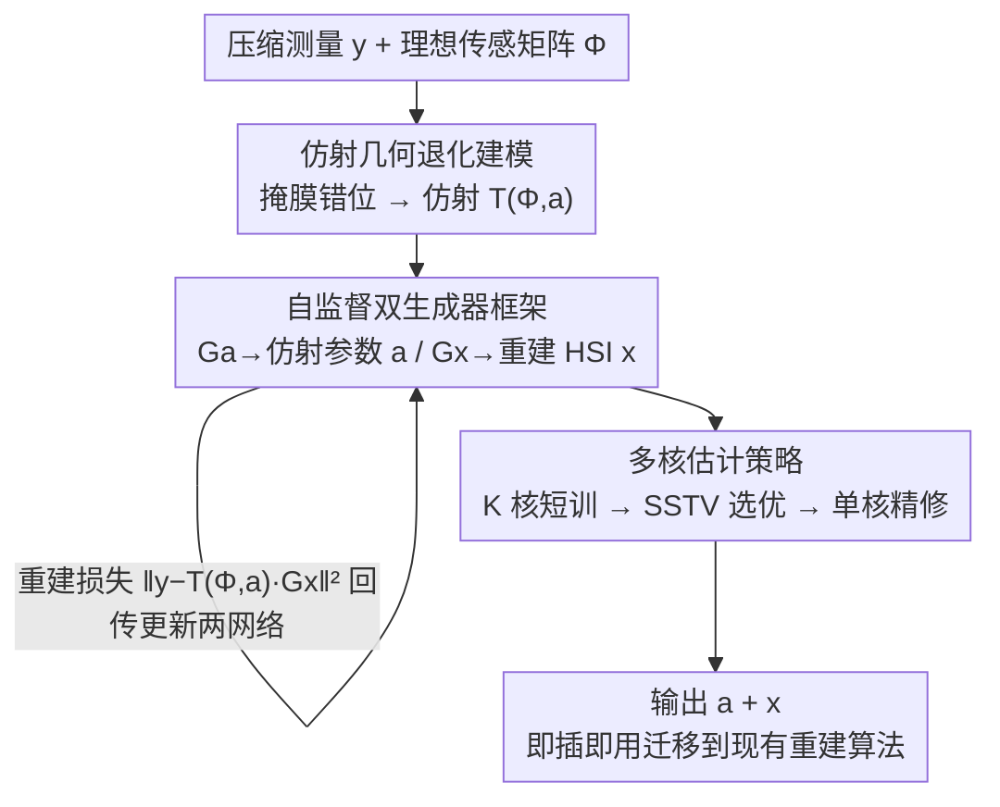

# SGDE: Self-supervised Geometry Degradation Estimation Framework for Coded Aperture Compressive Spectral Imaging

**会议**: CVPR 2026  
**论文**: [CVF Open Access](https://openaccess.thecvf.com/content/CVPR2026/html/He_SGDE_Self-supervised_Geometry_Degradation_Estimation_Framework_for_Coded_Aperture_Compressive_CVPR_2026_paper.html)  
**代码**: https://github.com/heyuqiao/SGDE  
**领域**: 图像恢复 / 计算光谱成像  
**关键词**: 编码孔径压缩光谱成像, CASSI, 掩膜错位, 自监督退化估计, 仿射变换

## 一句话总结
针对编码孔径压缩光谱成像（CASSI）中掩膜（mask）微小错位会严重破坏重建质量的问题，本文把掩膜错位显式建模成仿射变换嵌进成像模型，用一套自监督的"双生成器 + 多核估计"框架在不需要任何参考靶标和设备专属训练数据的情况下，同时估计仿射参数并重建高光谱图像，让重建在 1 像素平移、0.4° 旋转等扰动下仍能稳定保持 PSNR > 35 dB，且估出的仿射参数能即插即用地迁移到现有重建算法。

## 研究背景与动机

**领域现状**：高光谱成像能在几十到几百个波段上同时采集空间与光谱信息，但传统逐扫描系统采集慢、难拍动态场景。CASSI（Coded Aperture Snapshot Spectral Imaging，编码孔径快照光谱成像）用一块编码孔径（掩膜）对高光谱数据立方体做空间调制，经棱镜色散后用灰度探测器一次曝光拍成一张 2D 压缩测量，再用重建算法（模型法、DIP、端到端网络、深度展开网络 DUN）从测量恢复出高光谱图像（HSI）。

**现有痛点**：CASSI 把"物理编码"和"计算解码"紧耦合在一起——掩膜直接决定了传感矩阵 $\Phi$。一旦硬件出现哪怕亚像素级的错位（热胀冷缩、机械振动导致掩膜偏移），编码-解码的对应关系就被破坏，重建立刻出现严重伪影。论文 Fig. 3 给出实测：1 像素的掩膜平移就能让 PSNR 大幅跳水。已有应对手段各有死穴：① 多数重建算法直接假设理想成像、忽视硬件缺陷；② 离线标定法（用单色仪、参考靶标做光学建模）精度高但依赖专门仪器和复杂流程，无法实时适应动态扰动；③ 基于学习的退化估计法是有监督的，跨设备泛化差，且难以刻画掩膜错位这类真实退化。

**核心矛盾**：CASSI 对掩膜错位极度敏感，而真实世界的扰动又是动态、设备相关、无法预先采数据覆盖的——这就和"有监督学习需要设备专属训练数据 / 离线标定需要静态可控环境"形成根本冲突。

**本文目标**：在不依赖任何参考靶标、不需要设备专属训练数据的前提下，在线地、自适应地估计掩膜的几何退化，并把它纠正回重建里。

**切入角度**：作者观察到掩膜错位的主导成分是低阶几何形变——面内的平移、旋转，以及沿光轴的离焦带来的缩放——这些都可以用一个**仿射变换**统一刻画，物理可解释性强；同时，退化估计与"盲图像复原"（同时估计隐图像和退化核）高度相似，可以借用自监督 DIP 范式联合优化。

**核心 idea**：把掩膜错位显式建模成仿射变换嵌入成像模型，用两个生成网络（一个生 HSI、一个生仿射参数）在测量上做自监督联合优化；再用"多核估计"绕过 CASSI 敏感导致的估计范围过窄问题。

## 方法详解

### 整体框架

SGDE 的目标是：只给一张压缩测量 $y$ 和理想传感矩阵 $\Phi$，在没有真值、没有参考靶标的情况下，**同时**重建高光谱图像 $x$ 和估计掩膜错位的仿射参数 $a$。

整体被表述为一个最大后验（MAP）估计：

$$\hat{x},\hat{a}=\arg\min_{x,a}\;\|y-\mathcal{T}(\Phi,a)\cdot x\|_2^2+\mathcal{R}(x)+\mathcal{K}(a)$$

其中 $\mathcal{T}(\Phi,a)$ 是由"被仿射 warp 过的掩膜"导出的退化传感矩阵，$\mathcal{R},\mathcal{K}$ 是对 HSI 和仿射参数的正则。为避免引入过强先验把退化估计带偏，作者采用 DIP（Deep Image Prior）范式：用两个生成网络隐式表示 $x$ 和 $a$，直接从测量上优化：

$$\min_{\mathcal{G}_x,\mathcal{G}_a}\;\big\|y-\mathcal{T}(\Phi,\mathcal{G}_a(z_a))\cdot\mathcal{G}_x(z_x)\big\|_2^2$$

整条 pipeline 是一个带反馈回环的优化循环：上分支的仿射生成器 $\mathcal{G}_a$ 估出仿射参数去补偿掩膜错位，下分支的 HSI 生成器 $\mathcal{G}_x$ 重建光谱图像，两者经退化成像模型前向后与真实测量 $y$ 算重建损失、梯度回传联合更新；外层再套一个多核策略来扩大可估计的扰动范围。

### 关键设计

**1. 仿射几何退化建模：把掩膜错位变成可微、物理可解释的退化算子**

痛点很直接：掩膜 $M$ 直接定义传感矩阵 $\Phi$，亚像素错位就足以破坏编码-解码对应，但"错位"本身是一个抽象的物理现象，得先有一个能塞进成像模型、还能求导优化的数学表达。作者抓住掩膜错位的主导成分是低阶几何形变——面内平移/旋转（直接挪动像素坐标）和沿光轴运动带来的缩放（非平行光路导致），用一个仿射变换把理想掩膜上的像素 $(i,j)$ 映到退化掩膜上的位置 $(i',j')$：

$$\begin{bmatrix} i' \\ j' \\ 1 \end{bmatrix}=\begin{bmatrix} a_{11} & a_{12} & t_x \\ a_{21} & a_{22} & t_y \\ 0 & 0 & 1 \end{bmatrix}\begin{bmatrix} i \\ j \\ 1 \end{bmatrix}$$

仅用 6 个参数 $a=[a_{11},a_{12},a_{21},a_{22},t_x,t_y]$ 就编码了旋转、缩放和平移；非整数坐标用双线性插值、越界处置零。warp 后的掩膜 $M'$ 代入成像过程得到退化模型 $y=\mathcal{T}(\Phi,a)\cdot x+n$。这样做的好处是：退化被压缩到一个极低维、物理含义明确、且对插值可微的参数空间里，使后面用梯度优化直接"估出错位"成为可能。作者也明确这是对离线标定的**补充**——离线标定仍负责消除大尺度固定偏移，仿射参数化负责动态的小幅错位。论文聚焦掩膜（而非棱镜）的几何扰动，因为棱镜主要带来波长色散、相邻波段强相关，棱镜偏移影响相对小。

**2. 自监督双生成器框架：用 DIP 在单张测量上联合估退化、重图像，彻底摆脱训练数据**

痛点是有监督退化估计需要设备专属训练数据、跨设备泛化差，而离线标定需要参考靶标。作者用两个网络把 $x$ 和 $a$ 隐式参数化，仅靠重建损失自监督优化。HSI 生成器 $\mathcal{G}_x$ 需要强表达力来刻画复杂的空间-光谱信息，采用 LCTC 作为骨干（U-Net 式结构 + 卷积阈值稀疏编码 CTSC 模块，卷积字典 + 软阈值算子促进光谱稀疏，兼顾空间细节与光谱平滑）；仿射生成器 $\mathcal{G}_a$ 则只是一个单隐层 + tanh 激活的轻量 MLP。两者的潜变量 $z_x,z_a$ 从均匀分布采样。

关键巧思在于 $\mathcal{G}_a$ 的输出被约束在一个很小的预定义范围内：因为如 Fig. 3 所示，哪怕 1 像素偏移都会带来剧烈重建误差、让优化极不稳定，不加约束 tanh 的输出会让仿射参数乱跳。相比有监督，这种自监督设计有两个直接收益：① 不需要设备专属训练数据，天然跨设备泛化；② 不需要为掩膜退化做昂贵的仿真数据增广。正是这两点让 SGDE 能当作即插即用的退化估计工具。

**3. 多核估计策略：用 SSTV 选核绕过"敏感→估计范围窄 + SSTV 不可微"两道坎**

痛点是 CASSI 太敏感，单个网络（核）的有效退化估计范围很窄，而真实的机械振动/热漂移引起的错位常常超出这个范围。一个自然的想法是用 SSTV（Spectral-Spatial Total Variation，谱-空总变差）来量化错位严重度——错位越大、重建 HSI 的 SSTV 越高。但 SSTV 有个致命问题：仿射参数作用在掩膜上，SSTV 却是从重建 HSI 上算出来的，**两者之间没有可微路径**，SSTV 无法直接当损失反传去更新仿射生成器。

作者的解法是把它变成一个"选择"问题而非"优化"问题（Algorithm 1）：初始化 $K$ 个核（网络），让它们的初始仿射参数散布在参数空间的不同区域；每个核先用重建损失短训 $T_s$ 步（实践中观察到仿射生成器比 HSI 生成器更早收敛），然后计算各自重建 HSI 的 SSTV，选 SSTV 最小的那个核 $i^*=\arg\min_i \text{SSTV}_i$；用它的参数初始化第二阶段的单核精修，再训 $T_\ell$ 步输出最终的 $a,x$。这套两阶段设计用可控的计算开销，把有效退化估计范围显著扩大——本质是用"多点初始化 + 不可微指标做离散选择"绕开了 SSTV 不可微的死结，也绕开了单核估计范围窄的限制。论文实现里有两个变体：SK-LCTC（单核，在经验确定的 ±2 像素、±0.8°、±0.008 缩放范围内估计）和 MK-LCTC（8 个核，在不同参数偏移处初始化，1000 次迭代后选最优核精修）。

### 损失函数 / 训练策略
训练目标只有一项自监督的数据保真损失 $\|y-\mathcal{T}(\Phi,\mathcal{G}_a(z_a))\cdot\mathcal{G}_x(z_x)\|_2^2$，不引入额外重建先验（DIP 范式下网络结构本身充当隐式先验）。实现：i7-12900K + 单张 A6000；学习率固定 $1\times10^{-3}$，训练 6000 次迭代；MK-LCTC 用 8 核、各核短训 1000 次迭代后按 SSTV 选优；每个 LCTC 仅需约 2 GB 显存，多核可并行执行以摊薄开销。⚠️ 切换时机（多核→单核）按扰动幅度调整：大错位（0.5 像素偏移）约 500 次迭代内即可辨识，小偏移（0.1 像素）约 1500 次迭代前可区分，以原文为准。

## 实验关键数据

### 主实验
**仿真**：从 KAIST 数据集选 10 个场景，裁成 $256\times256\times28$。在掩膜上施加受控扰动（平移/像素、旋转/度、缩放/比例），用 PSNR / SSIM 评估，与模型法 GAP-TV、有监督端到端 GST、有监督深度展开 RDLUF/DERNN/MIDET、自监督 DDIP/LCTC 对比。下表摘取几组代表性扰动列（KAIST-Scene 01-10 平均 PSNR，dB）：

| 方法 | 类型 | 无扰动 | 平移 1.0 | 旋转 0.4° | 组合(0.5,0.2,0.002) | 时间(s) |
|------|------|--------|----------|-----------|----------------------|---------|
| GAP-TV | 模型法 | 30.11 | 18.37 | 21.83 | 21.80 | 38.60 |
| GST | 端到端(监督) | 33.32 | 33.21 | 30.54 | 30.50 | 0.66 |
| RDLUF | 深度展开(监督) | 39.21 | 23.25 | 25.60 | 26.61 | 2.59 |
| DERNN | 深度展开(监督) | 39.41 | 22.56 | 25.33 | 25.99 | 6.50 |
| MIDET | 深度展开(监督) | 39.09 | 23.27 | 25.23 | 25.98 | 2.19 |
| DDIP | DIP(自监督) | 37.33 | 15.33 | 19.83 | 19.65 | 1238.25 |
| LCTC | DIP(自监督) | 38.51 | 18.37 | 21.15 | 21.46 | 411.98 |
| **SK-LCTC** | DIP(自监督) | 38.64 | 38.33 | 27.95 | 36.15 | 415.54 |
| **MK-LCTC** | DIP(自监督) | **38.39** | **38.15** | **35.41** | **36.04** | 531.24 |

关键读数：DIP 类基线（DDIP、LCTC）在 1 像素平移下 PSNR 跌超 16 dB（LCTC 38.51→18.37、DDIP 37.33→15.33）；深度展开网络略好但仍严重退化，说明它们学到的退化模型无法泛化到掩膜错位；GST 因有监督训练相对稳定但基线本就低（约 31–33 dB）。SK-LCTC 能扛住大部分扰动，但在 0.4° 旋转下掉约 10 dB（38.64→27.95）；MK-LCTC 则在所有扰动下都稳定保持 PSNR > 35 dB。开销上，SK-LCTC 6000 次迭代约 415 s，而仿射参数通常前几百次迭代（约 41 s）即收敛，可直接迁移给现有重建方法，所以退化估计只增加很小开销。

**真实数据**：在 TSA 数据集（5 个真实场景，660×714，450–650 nm，重建 28 波段）和自建 SD-CASSI 系统（512×542，520–710 nm，重建 16 波段）上验证。即便不加人工扰动，两个变体也比 LCTC 基线重建出更清晰的空间细节；把从 TSA-Scene 01 估出的仿射参数迁移到 LCTC/DDIP/RDLUF/MIDET/DERNN 都能一致地抑制伪影、提升质量，说明 TSA 数据本身就存在不可忽视的掩膜错位。

### 消融实验
**核数量 + 初始化位置**（固定扰动 1 像素偏移 / 0.004 缩放 / 0.4° 旋转，KAIST-Scene 01）：

| 核数量 | Forward PSNR | Forward SSIM | Reverse PSNR | Reverse SSIM |
|--------|--------------|--------------|--------------|--------------|
| 1 | 25.50 | 0.648 | 36.30 | 0.941 |
| 2 | 26.15 | 0.650 | 35.73 | 0.935 |
| 7 | 28.62 | 0.767 | 36.23 | 0.937 |
| 8 | 36.13 | 0.938 | 36.21 | 0.936 |

Forward（顺序加核、最后一个核才初始化到扰动区域附近）要到第 8 个核才估计成功，Reverse（直接从扰动区域附近开始）单核即可表现很好。

### 关键发现
- **退化估计性能主要由核的初始化位置决定，而非核的总数**：上表 Forward vs Reverse 的强烈对比说明，若大致已知扰动范围与类型，少量核即可；核的价值在于"覆盖到正确区域"。
- **单核范围天生受掩膜最小编码单元约束**：Table 2 显示单核能很好估计小错位，但一旦扰动超出有效范围（如 1 像素编码单元最多只能纠正 1 像素平移）就迅速失效——这正是必须上多核的根因。
- **MK-LCTC 是鲁棒性主力**：在主表所有扰动组合下唯一稳定 > 35 dB，而 SK-LCTC 在大旋转下会掉点。
- **退化估计开销可控**：仿射参数收敛远快于 HSI 重建（约 41 s vs 415 s），且可即插即用迁移；多核虽随核数线性增加运行时间，但每核仅约 2 GB 显存、可并行摊薄。

## 亮点与洞察
- **把"不可微指标"变成"离散选择"是全文最妙的一步**：SSTV 能可靠衡量错位却无法反传梯度，作者不强行造可微代理，而是用多核短训 + SSTV 选优把它降格成一次选择，干净利落地绕过了不可微死结，这个"用指标做选择而非做损失"的思路可迁移到很多有不可微评价信号的自监督任务。
- **6 参数仿射 + DIP 自监督的组合直击痛点**：退化被压到极低维且物理可解释，配合 DIP 不需任何外部数据，使方法天然跨设备、即插即用——估出的仿射参数能直接喂给一堆现成重建算法（LCTC/DDIP/RDLUF/MIDET/DERNN）提质，实用价值很高。
- **"初始化位置 > 核数量"是一个反直觉但有用的经验**：提示在这类敏感反问题里，先验性地把搜索起点放对，比盲目加算力更划算。

## 局限与展望
- **作者承认**：未来可探索更高效的优化策略或更精确的退化模型——暗示当前两阶段优化和仿射近似仍有提升空间。
- **仿射只是低阶近似**：真实光学退化还含畸变、像差、棱镜效应等非仿射成分，论文显式聚焦掩膜的低阶几何形变、把大尺度固定偏移交给离线标定，因此对高阶/非几何退化覆盖有限。
- **计算开销偏重**：自监督 DIP 每张测量都要从头优化数千次迭代（SK 约 415 s，MK 约 531 s），相比有监督方法（GST 0.66 s、RDLUF 2.59 s）实时性差，更适合离线/半在线纠正而非高帧率场景。
- **多核需大致已知扰动范围**：消融显示性能高度依赖核初始化位置落对区域；若扰动类型/范围完全未知，可能需要更多核或更密的覆盖，开销随之上升。
- **真实数据缺真值，只能定性**：真实场景下无 GT 光谱，仅用 RGB 做视觉参考定性比较，难以定量证明绝对精度。

## 相关工作与启发
- **vs 离线标定法（Arguello / Song / Gualdrón-Hurtado / Lei OCOD / Paillet 等）**：它们用精确光学建模 + 单色仪/参考靶标做离线标定，静态精度高但无法实时适应动态扰动；SGDE 在线自监督估计、作为离线标定的动态补充，二者互补而非替代。
- **vs 有监督退化估计（GST / D2PL-Net / RDLUF / DADF-Net 等）**：它们靠有监督学习退化矩阵/参数，受限于设备专属训练数据、跨设备泛化差、难刻画掩膜错位这类真实退化；SGDE 完全自监督、无需训练数据，跨设备天然泛化。
- **vs 盲图像复原（SelfDeblur / 噪声自适应多核 / 无监督自增强等）**：CASSI 退化估计与盲复原都在联合估隐图像和退化核，作者正是把后者的自监督 + 多核思想迁移到 CASSI；区别在于 CASSI 的退化作用于物理掩膜、且系统对错位极度敏感，故引入仿射物理建模和 SSTV 选核来适配。

## 评分
- 新颖性: ⭐⭐⭐⭐⭐ 首个面向 CASSI 掩膜错位的自监督仿射退化估计框架，SSTV 多核选优的设计巧妙
- 实验充分度: ⭐⭐⭐⭐ 仿真有完整扰动网格对比 + 多组消融，真实数据含自建系统，但真实场景只能定性
- 写作质量: ⭐⭐⭐⭐ 动机-建模-方法链条清晰，图示充分；部分扰动表列偏密集
- 价值: ⭐⭐⭐⭐⭐ 即插即用、跨设备、无需训练数据，对实际 CASSI 系统部署价值高

<!-- RELATED:START -->

## 相关论文

- [\[CVPR 2026\] LRDUN: A Low-Rank Deep Unfolding Network for Efficient Spectral Compressive Imaging](lrdun_a_low-rank_deep_unfolding_network_for_efficient_spectral_compressive_imagi.md)
- [\[ICML 2026\] Phy-CoSF: Physics-Guided Continuous Spectral Fields Reconstruction and Super-Resolution for Snapshot Compressive Imaging](../../ICML2026/image_restoration/phy-cosf_physics-guided_continuous_spectral_fields_reconstruction_and_super-reso.md)
- [\[CVPR 2026\] Self-supervised Dynamic Heterogeneous Degradation Modeling for Unified Zero-Shot Image Restoration](self-supervised_dynamic_heterogeneous_degradation_modeling_for_unified_zero-shot.md)
- [\[CVPR 2026\] Self-Diffusion Driven Blind Imaging](self-diffusion_driven_blind_imaging.md)
- [\[CVPR 2026\] Convexity-Aware Noise Calibration: A Self-Supervised Framework for Noise-Level-Unknown Image Denoising](convexity-aware_noise_calibration_a_self-supervised_framework_for_noise-level-un.md)

<!-- RELATED:END -->
