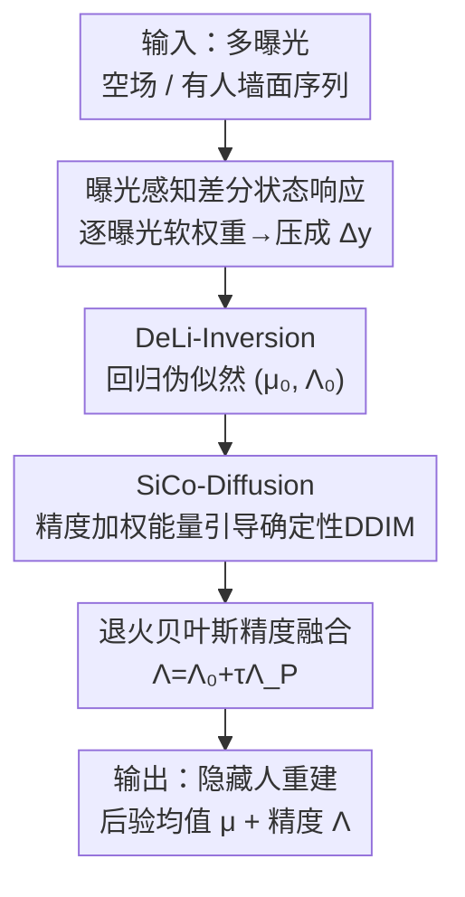

# Similarity-Consistent Likelihood Diffusion enables Hidden Person Detection from Wall Reflections

**会议**: CVPR 2026  
**论文**: [CVF Open Access](https://openaccess.thecvf.com/content/CVPR2026/html/Zheng_Similarity-Consistent_Likelihood_Diffusion_enables_Hidden_Person_Detection_from_Wall_Reflections_CVPR_2026_paper.html)  
**代码**: 无  
**领域**: 图像恢复 / 计算成像 / 非视距成像  
**关键词**: 非视距成像(NLOS), 扩散先验, 似然引导, 异方差精度, 角落相机

## 一句话总结
SLD-Net 把墙面漫反射里几乎看不见的差分光信号先回归成一个带逐像素精度的高斯伪似然 $(\mu_0,\Lambda_0)$，再以"精度加权能量项"注入确定性 DDIM 采样，让扩散先验既严格贴合物理测量又保证同一观测必得同一重建，从墙上反射"还原"出拐角后隐藏的人，在两个真实数据集上把 FID 从 264.91/177.05 降到 73.54/26.89。

## 研究背景与动机
**领域现状**：非视距成像（NLOS）想从间接光传输里恢复直视线之外的隐藏场景，分两派——主动法用可控照明 + 时间分辨传感器测多次散射，物理上靠谱但依赖昂贵的瞬态硬件；被动法用普通相机看稳态/不可控的间接反射，便宜但信号极弱、观测不稳、约束不足。本文走的是"主动稳态"路线：普通相机 + 普通照明，看一面中央墙，靠拐角后的人对全局光照的微弱扰动来反推这个人。

**现有痛点**：把墙上反射反演成隐藏图像是个病态逆问题。其一，有用信号弱到几乎被环境光、传感器增益、非线性淹没，即便采多曝光序列，也很难从这些不稳的读数里抽出可验证的、逐像素的统计约束；其二，从 2D 墙面测量映射到隐藏空间严重欠定，必须借助扩散这类强生成先验补全缺失结构。

**核心矛盾**：生成先验的内在随机性和"传感系统必须可复现"的要求直接冲突——同一次观测可能被采样成好几张不同的重建图。于是问题变成：怎样在不牺牲生成细节的前提下，同时强制**数据一致性**（贴合物理测量）和**相似性一致性**（同输入→同输出）。

**本文目标**：(1) 把不稳的墙面读数蒸馏成可验证的统计似然；(2) 把这个似然以校准的方式喂给扩散先验，让重建既贴测量又确定可复现。

**切入角度**：不要把差分测量当成一张普通特征图直接回归隐藏图，而是回归一个**异方差高斯伪似然**——既给均值 $\mu_0$（粗重建）又给逐像素精度 $\Lambda_0$（哪里墙面信息可信）；再把扩散采样从"随机生成器"改造成"确定性后验求解器"。

**核心 idea**：用"精度加权的似然能量项 $\Lambda_0(\mu_0-\hat x_0)$"去引导确定性 DDIM，墙面可信处当硬约束、欠定处放手让先验补结构，全程不引入随机性 → 物理一致 + 可复现。

## 方法详解

### 整体框架
SLD-Net 是一个"似然–先验求解器"：输入是同一相机位姿下拍的两组多曝光墙面序列（空场 $\{y_0^{(k)}\}$ 和有人 $\{y^{(k)}\}$），输出是隐藏人的 RGB 重建图 $x$。它把贝叶斯后验 $p(x\mid y)\propto p(x)\,p(y\mid x)$ 做了一个可计算的因子化近似，分三段串行：

1. **曝光感知差分状态响应**：把多曝光序列差分、按曝光可信度加权，压成一张辐射线性的差分张量 $\tilde\Delta y$，抑制静态墙体、压低过曝/过噪曝光。
2. **DeLi-Inversion**：把 $\tilde\Delta y$ 映成异方差高斯伪似然 $(\mu_0,\Lambda_0)$——$\mu_0$ 是初始重建，$\Lambda_0$ 是逐像素精度图（编码墙面在哪些像素信息量大）。
3. **SiCo-Diffusion + 退火贝叶斯融合**：把这个伪似然作为精度加权能量项注入预训练扩散先验的确定性 DDIM 轨迹，得到先验估计 $(\mu_P,\Lambda_P)$，再用退火贝叶斯精度融合把 DeLi 与扩散两个高斯因子相乘，输出最终后验均值 $\mu$ 和精度 $\Lambda$。

### 关键设计

**1. 曝光感知差分状态响应：把多曝光读数压成一张"既抑墙体又挑可信曝光"的差分张量**

隐藏的人只通过高阶、低 SNR 的散射对墙面强度造成微弱改变，单曝光差分要么过曝饱和、要么淹在噪声里。先把每个曝光映到辐射线性域 $\hat y^{(k)}=r(y^{(k)})$，做差分 $\delta y^{(k)}=\hat y^{(k)}-\hat y_0^{(k)}$ 消掉静态墙体和相机偏置。但不同曝光的 SNR/饱和/对运动的敏感度不同，不能等权平均。于是引入轻量的**曝光感知似然适配器（ELA）**：对每个墙面像素 $p$，把它在 $K$ 个曝光上的差分向量 $d(p)=(\delta y^{(1)}(p),\dots,\delta y^{(K)}(p))$ 喂进逐像素小网络 $A_\eta$，softmax 出曝光权重

$$w_k(p)=\frac{\exp(A_\eta(d(p))_k)}{\sum_j \exp(A_\eta(d(p))_j)},\quad \sum_k w_k(p)=1,$$

再加权求和得差分状态响应 $\tilde\Delta y(p)=\sum_k w_k(p)\,\delta y^{(k)}(p)$。这些权重相当于"软显著性"，逐像素地把信息量大的曝光放大、把饱和/过噪的曝光压下去，比单曝光直接差分更鲁棒紧凑。

**2. DeLi-Inversion：把不稳的墙面响应蒸馏成可验证的异方差高斯伪似然 $(\mu_0,\Lambda_0)$**

病态逆问题里，最致命的是没有"哪里可信"的逐像素约束。作者先把前向光传输在空场附近线性化 $\tilde\Delta y=Hx+\varepsilon,\ \varepsilon\sim\mathcal N(0,\Sigma(x))$，写成异方差高斯似然 $\log p(\tilde\Delta y\mid x)=-\tfrac12\|e(x)\|^2_{\Lambda(x)}+\tfrac12\log\det\Lambda(x)+C$，其中 $\Lambda=\Sigma^{-1}$ 是精度。但逐场景显式建模 $(H,\Sigma)$ 不可行，于是用一个数据驱动代理 $F_\theta$ 直接从 $\tilde\Delta y$ 回归出均值 $\mu_0$ 和精度 logits $Z_0$，经 softplus $\phi(\cdot)$ 转成对角精度 $\Lambda_0(p)=\mathrm{diag}(\phi(Z_0(p)))$。训练用异方差高斯负对数似然：

$$\mathcal L_\text{DeLi}=\tfrac12\sum_p\Big(\|\mu_0(p)-x^\star(p)\|^2_{\Lambda_0(p)}-\log\det\Lambda_0(p)\Big).$$

这个目标把 $\mu_0$ 和 $\Lambda_0$ 耦合起来：DeLi 预测不准的像素被自动逼着给低精度，准的给高精度——精度图于是天然学成了"墙面可信度地图"。关键在于 $(\mu_0,\Lambda_0)$ 还能对称地重参数化成关于 $x$ 的可微似然因子 $p(\mu_0\mid x)\propto\exp(-\tfrac12\|\Lambda_0^{1/2}(x-\mu_0)\|^2)$，其对数梯度 $\nabla_x\log p(\mu_0\mid x)=\Lambda_0(\mu_0-x)$ 正好能在扩散推断中当数据项约束 $x$。

**3. SiCo-Diffusion：把扩散从随机生成器改造成确定性后验求解器，用精度加权能量项做引导**

扩散先验 $p(x)$ 提供强生成能力补全欠定结构，但随机采样破坏可复现。作者用**确定性 DDIM（$\eta=0$）**：每步先由去噪器得 $\hat x_0=G_\psi(x_t,t)$，再在 $\hat x_0$ 上对 $\log p(\mu_0\mid x)$ 走一步精度加权上升

$$\tilde x_0=\hat x_0+\gamma_t\,\Lambda_0(\mu_0-\hat x_0),$$

把 $\tilde x_0$ 代回 DDIM 更新 $x_{t-1}=\sqrt{\bar\alpha_{t-1}}\,\tilde x_0+\sqrt{1-\bar\alpha_{t-1}}\,\tfrac{x_t-\sqrt{\bar\alpha_t}\tilde x_0}{\sqrt{1-\bar\alpha_t}}$。这一步可解释为对后验能量 $-\log p(x)-\log p(\mu_0\mid x)$ 的局部 MAP 更新：去噪器给先验项、DeLi 给数据项。由于固定起点 $x_T$ + 固定 schedule，迭代收敛到唯一终态 $\mu_P$——同一墙面观测必得同一重建，这就是论文说的 **similarity-consistent**。引导方向与幅度都被 $\Lambda_0$ 调制：高精度处近似硬约束、低精度处变软提示让先验主导，比 CFG 那种"全局单一强度、把所有像素当等可信"要合理得多。

**4. 退火贝叶斯精度融合：用温度 $\tau$ 把 DeLi 似然与扩散先验从"先信测量"渐变到"完整贝叶斯组合"**

沿轨迹去噪器还会回归逐像素方差，转成扩散先验精度 $\Lambda_P=\Sigma_P^{-1}$，给出第二个高斯因子 $\mathcal N(x;\mu_P,\Lambda_P^{-1})$。把 DeLi 因子和退火后的扩散因子（$\propto\mathcal N(\mu_P,\Lambda_P^{-1})^\tau$，$\tau\in(0,1]$）相乘仍是高斯，得到融合规则

$$\Lambda(p)=\Lambda_0(p)+\tau\Lambda_P(p),\quad \mu(p)=\Lambda(p)^{-1}\big(\Lambda_0(p)\mu_0(p)+\tau\Lambda_P(p)\mu_P(p)\big).$$

后验均值是精度加权平均、后验精度是两者精度之和：墙面信息足（$\Lambda_0$ 大）的像素由 $\mu_0$ 主导，欠定区域被 $\mu_P$ 正则。$\tau$ 从小值退火到 1，让融合从"几乎只靠 DeLi 似然"逐步过渡到"完整 product-of-Gaussians 后验"（$\tau=1$ 时即标准乘积后验），避免一上来就被尚不可靠的扩散先验带偏。

### 损失函数 / 训练策略
DeLi 与上游 ELA 用异方差高斯 NLL（式 9）联合训练；扩散先验在真值隐藏图 $x^\star$ 上以余弦噪声 schedule（$T=2000$）单独训练，测试用 50 步 DDIM。$x_T$ 用固定随机种子初始化以保证 SiCo-Diffusion 对给定观测确定。全部在 8×RTX 4090 上训练。

## 实验关键数据

### 主实验
两个真实数据集 Reflect-Corridor（R-C，T 形走廊）和 Reflect-Room（R-R，公寓客厅），Sony A7SII 拍 RAW，空场/有人多曝光协议，第二台相机在隐藏区拍正面 RGB 当真值。对比通用重建网络、物理启发网络、NLOS 专用网络三族，全部同输入同输出重训。

| 数据集 | 指标 | 本文 SLD-Net | 最佳基线 | 提升 |
|--------|------|------|----------|------|
| R-C | PSNR↑ | **15.58** | 14.01 (Phasor Field) | +1.57 dB |
| R-C | FID↓ | **73.54** | 264.91 (Restormer) | 大幅下降 |
| R-C | LPIPS↓ | **0.30** | 0.32 (NLOD-LTM) | 更优 |
| R-R | PSNR↑ | **12.49** | 12.02 (Phasor Field) | +0.47 dB |
| R-R | FID↓ | **26.89** | 177.05 (Restormer) | 大幅下降 |
| R-R | LPIPS↓ | **0.25** | 0.30 (Restormer) | 更优 |

注：摘要原文把基线 PSNR/FID 起点写成 13.84/264.91（U-Net/Restormer），与表 1 一致；DDIM/DPS 这类纯扩散 baseline 虽 FID 看着不差（DPS 96.37）但 PSNR 极低（6.02），说明纯先验脱离测量。SLD-Net 在失真（PSNR/SSIM）与感知（FID/LPIPS）两类指标上同时领先，说明不是单纯"美化"输出，而是在墙面模糊处才让先验补结构。

### 消融实验

| 配置 | R-C PSNR↑ | R-C FID↓ | R-R PSNR↑ | R-R FID↓ | 说明 |
|------|-----------|----------|-----------|----------|------|
| Full SLD-Net | 15.58 | 73.54 | 12.49 | 26.89 | 完整模型 |
| DeLi-only | 13.67 | 217.30 | 11.14 | 168.30 | 只用似然代理、无扩散先验：几何还行但感知"发闷"、FID 差 |
| Diffusion-only | 6.02 | 191.22 | 4.07 | 182.98 | 只用先验、丢掉墙面似然：生成逼真但与测量脱节，PSNR 崩 |
| Bayes 引导 (ours) | 15.58 | 73.54 | 12.49 | 26.89 | vs CFG(1.0) 53.17/13.42——CFG 单一全局强度顾此失彼 |
| 融合用 $(\mu,\Lambda)$ | 15.58 | 73.54 | 12.49 | 26.89 | 含精度图 |
| 融合仅用 $\mu$ | 13.48 | 53.31 | 11.85 | 45.06 | 去掉 $\Lambda_0$ 等于假设全像素等可信，PSNR/LPIPS 退化 |

### 关键发现
- **两个组件缺一不可**：DeLi-only 几何对但感知差，Diffusion-only 逼真但 PSNR 崩到 6.02，只有"似然锚定 + 先验补全"的耦合才能两类指标同时拿高。
- **精度图 $\Lambda_0$ 是关键开关**：去掉它（µ-only）FID 反而可能更低（53.31）但 PSNR/SSIM/LPIPS 全退化——精度图负责逐像素决定"该信 DeLi 还是信先验"。
- **确定性精度引导更省步、更稳**：SLD-Net 约 25 步即稳定、5 步也接近收敛；CFG 对步数敏感（尤其感知指标），因为它要靠长轨迹去调和启发式引导和测量，而 SLD-Net 每步都是精度加权后验漂移，缩短轨迹只引入积分误差、不改底层能量。
- **vs CFG 的本质区别**：CFG 用单一全局引导强度、隐式把所有像素当等可信；本文引导 $\propto\Lambda_0(\mu_0-x)$ 方向幅度都被逐像素精度调制，无需逐数据集调参就能取得更好的总体工作点。

## 亮点与洞察
- **把"不确定性"显式建成约束**：不是回归一张图，而是回归 $(\mu_0,\Lambda_0)$，精度图天然变成"墙面可信度地图"，让欠定逆问题第一次有了逐像素的可信度来分配先验/数据话语权——这是可迁移到任何病态成像逆问题的范式。
- **用确定性换可复现**：把扩散从随机生成器改成确定性后验求解器，既保留高容量先验的补全能力，又满足传感系统"同输入→同输出"的刚需，巧妙化解生成随机性与传感可复现的矛盾。
- **退火融合的物理直觉**：$\tau$ 从小到 1 把"先信测量、后信先验"做成了一条可控的贝叶斯渐变路径，避免早期被不可靠先验带偏，思路可迁移到其它"似然+生成先验"组合。
- **任务本身的"哇点"**：用一台普通相机看一面墙，就能重建出拐角后看不见的人，证明那些肉眼几乎不可见的差分光斑是可计算反演的。

## 局限与展望
- 作者承认：依赖成对的空场/有人序列 + 校准采集，且固定拐角几何，迁移到未知布局需重新适配。
- 自己发现：精度图、退火 schedule、ELA 等不少关键实现细节都被丢进附录，正文未给完整公式（如退火具体曲线），复现需要原文附录；线性化前向假设 $\tilde\Delta y=Hx+\varepsilon$ 只在空场邻域成立，强非线性/大运动时是否仍成立存疑。
- 真值靠隐藏区第二台相机采，意味着方法的"上限"被这套采集协议绑定；µ-only 反而 FID 更低这点说明 PSNR/FID 之间仍有 trade-off，精度图主要换的是失真与 LPIPS。
- 展望：在线差分、对未知光度非线性的鲁棒性、扩展到更广的 NLOS 布局与时序跟踪、加速到实时。

## 相关工作与启发
- **vs 瞬态主动 NLOS（NLOST/Phasor Field 等）**：他们靠超快照明 + 时间分辨传感器测多次散射，物理可靠但硬件昂贵；本文属"稳态主动"，普通相机 + 普通照明，更经济也比纯被动法线索更稳。
- **vs 通用/物理重建网络（Restormer/DGUNet 等）**：它们把差分响应当确定性特征图直接回归，无法利用其曝光相关结构与不确定性；本文改变了墙面测量的角色——当似然能量项而非回归目标。
- **vs 通用扩散逆问题求解器（DPS/DDIM+CFG）**：常见做法把前向模型当条件、用投影/学习正则/启发式引导强制数据一致，且约束强度由全局超参控制、不显式建模逐像素不确定性；本文用确定性采样器当后验求解器、注入逐像素精度加权的 DeLi 伪似然，高置信区强约束、欠约束区让先验塑形。

## 评分
- 新颖性: ⭐⭐⭐⭐⭐ 把异方差伪似然 + 确定性精度引导扩散用于稳态 NLOS 人体重建，问题设定和方法都新。
- 实验充分度: ⭐⭐⭐⭐ 两个真实数据集、三族基线、四组消融到位；但只两个数据集、固定几何，泛化证据有限。
- 写作质量: ⭐⭐⭐⭐ 贝叶斯叙事清晰、图文对应；不少关键细节（退火/ELA/精度 schedule）压进附录略影响自洽。
- 价值: ⭐⭐⭐⭐ "普通相机看墙重建拐角后的人"应用想象空间大，似然+确定性扩散范式可迁移到其它病态成像。

<!-- RELATED:START -->

## 相关论文

- [\[ICML 2026\] Consistent Diffusion Language Models](../../ICML2026/image_restoration/consistent_diffusion_language_models.md)
- [\[CVPR 2026\] Polarization State Tracing for Reflection Removal and Color-Consistent Reconstruction](polarization_state_tracing_for_reflection_removal_and_color-consistent_reconstru.md)
- [\[CVPR 2026\] CASR: A Robust Cyclic Framework for Arbitrary Large-Scale Super-Resolution with Distribution Alignment and Self-Similarity Awareness](casr_a_robust_cyclic_framework_for_arbitrary_large-scale_super-resolution_with_d.md)
- [\[CVPR 2026\] Degradation-Consistent Test-Time Adaptation for All-in-One Image Restoration](degradation-consistent_test-time_adaptation_for_all-in-one_image_restoration.md)
- [\[ICCV 2025\] Generic Event Boundary Detection via Denoising Diffusion (DiffGEBD)](../../ICCV2025/image_restoration/generic_event_boundary_detection_via_denoising_diffusion.md)

<!-- RELATED:END -->
