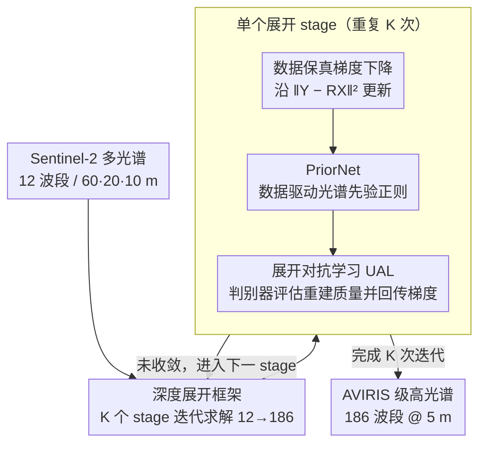

# Spectral Super-Resolution via Adversarial Unfolding and Data-Driven Spectrum Regularization

**会议**: CVPR 2026  
**arXiv**: [2603.00920](https://arxiv.org/abs/2603.00920)  
**代码**: [IHCLab/UALNet](https://github.com/IHCLab/UALNet)  
**领域**: 图像复原  
**关键词**: 光谱超分辨率, 深度展开, 对抗学习, 高光谱重建, 遥感, Sentinel-2, AVIRIS

## 一句话总结

提出 UALNet，通过将数据驱动的光谱先验（PriorNet）和对抗学习项同时嵌入深度展开框架，实现从 Sentinel-2 多光谱数据（12 波段）到 NASA AVIRIS 高光谱图像（186 波段）的光谱超分辨率，性能超越 Transformer 的同时仅需 15% 计算量和 1/20 参数。

## 研究背景与动机

**全球高光谱覆盖的需求**：ESA 的 Sentinel-2 卫星提供全球多光谱覆盖，但仅有 12 个波段且空间分辨率不统一（60/20/10 m），难以满足精细遥感识别需求。NASA 的 AVIRIS-NG 传感器具有高光谱-高空间分辨率，但受限于实际条件仅覆盖美洲区域。

**核心科学问题**：能否通过计算方法将全球 Sentinel-2 数据重建为 NASA 级高光谱图像？将 12 波段超分至 186 波段是一个高度病态的逆问题（$12 \rightarrow 186$），同时需将空间分辨率统一至 5 m。

**现有方法的不足**：
   - 传统深度展开方法依赖隐式深度先验（implicit deep prior），缺乏对光谱物理特性的显式建模
   - 大多数光谱超分辨率方法仅处理 CAVE 数据集级别的 31 波段可见光重建，远未达到 AVIRIS 级高光谱的复杂度
   - 纯数据驱动的 Transformer/CNN 方法参数量大、计算成本高，且可解释性差
   - GAN 的判别器仅在训练阶段起作用，推理时被丢弃，浪费了判别信息

## 方法详解

### 整体框架

UALNet 要回答一个很具体的科学问题：能不能用计算的方式，把全球覆盖但只有 12 波段的 Sentinel-2 数据，重建成 NASA AVIRIS 级的 186 波段高光谱图像。这是个高度欠定的线性逆问题——观测建模为 $\mathbf{Y} = \mathbf{R}\mathbf{X} + \mathbf{N}$，其中 $\mathbf{Y} \in \mathbb{R}^{12 \times P}$ 是多光谱观测，$\mathbf{X} \in \mathbb{R}^{186 \times P}$ 是待求高光谱图像，$\mathbf{R} \in \mathbb{R}^{12 \times 186}$ 是光谱响应矩阵，用 12 个方程去解 186 个未知数，必须靠强正则化。UALNet 的做法是把这个优化问题展开成多阶段网络，每个 stage 走一步"数据保真梯度下降 + 正则约束"的迭代，并在迭代里塞进两件别人没做的事：用 PriorNet 提供显式光谱先验，用判别器在训练和推理时都参与重建。此外，Sentinel-2 的 12 个波段分布在 60/20/10 m 三种空间分辨率上，UALNet 把光谱超分和空间超分耦合成联合任务，统一重建到 5 m。

### 关键设计

**1. 深度展开框架：把迭代优化拆成可学习的多阶段网络**

直接端到端回归一个 12→186 的映射既不可解释、又难约束。UALNet 改走深度展开路线，把逆问题的迭代求解过程展开成若干 stage，每个 stage 对应一次更新：先沿数据保真项 $\|\mathbf{Y} - \mathbf{R}\mathbf{X}\|^2$ 做梯度下降保证重建和观测一致，再叠一个正则化项把解往合理光谱空间拽。这样每一步都有物理含义，正则项的形式也成了可以替换升级的插槽——后面两个设计正是替换这个插槽。

**2. PriorNet：用显式光谱先验替掉隐式网络正则**

传统深度展开的正则项是个隐式网络，学到什么先验说不清，对光谱物理特性也没显式约束。UALNet 设计 PriorNet，从配对的 Sentinel-2/AVIRIS 数据里直接学高光谱信号的低维流形结构，在每个展开 stage 输出一个数据驱动的光谱正则信号，引导重建结果落进真实存在的光谱分布里。相比隐式先验，它既更可解释，消融中也带来比"隐式深度先验"更大的 PSNR/SSIM/SAM 提升。

**3. 展开对抗学习（UAL）：让判别器在推理时也继续干活**

普通 GAN 的判别器只在训练时提供对抗信号，推理一来就被丢弃，那部分判别能力等于白学了。UAL 把判别器嵌进展开框架内部：它在每个 stage 评估当前重建质量，梯度直接参与迭代更新，而且训练和推理阶段都保留——这是和传统 GAN 的根本区别。效果上，对抗项相当于一个分布匹配正则，逼重建出的高光谱在统计特性上贴近真实 AVIRIS；消融里"训练+推理都用判别器"明显优于"只训练时用"。

### 损失函数 / 训练策略

总损失由三部分组成：重建损失（$\ell_1$ 或 $\ell_2$ 度量与 ground truth 的误差）、光谱角损失 SAM（约束光谱曲线形状的保真度）、以及判别器引导的对抗损失（做分布匹配）。三项配合下，UALNet 用 Transformer 约 15% 的计算量和 1/20 的参数就超过了它的精度。

## 实验关键数据

### 实验设置

- **数据来源**：Sentinel-2 多光谱卫星数据（全球覆盖，12 波段）与 NASA AVIRIS-NG 高光谱机载数据（美洲地区，186 波段）的配对数据
- **任务**：12 波段 → 186 波段光谱超分辨率 + 空间分辨率统一至 5 m
- **评价指标**：PSNR（峰值信噪比）、SSIM（结构相似性）、SAM（光谱角映射，越小越好）、MACs（乘加运算量）、参数量
- **对比方法**：包括 Transformer-based 方法及其他 SOTA 光谱超分方法

### Table 1: 与 SOTA 方法的定量对比

| 方法 | PSNR ↑ | SSIM ↑ | SAM ↓ | 参数量 | MACs |
|------|--------|--------|-------|--------|------|
| CNN-based baseline | 较低 | 较低 | 较高 | 中等 | 中等 |
| Transformer (次优) | 次优 | 次优 | 次优 | 20× UALNet | 6.7× UALNet |
| **UALNet (本文)** | **最优** | **最优** | **最优** | **最少** | **最少 (15%)** |

UALNet 在所有三个指标上均超越次优的 Transformer 方法，并且计算效率大幅领先：
- MACs 仅为 Transformer 的 **15%**
- 参数量仅为 Transformer 的 **1/20**（20 倍压缩）

### Table 2: 消融实验——各组件贡献

| 配置 | PSNR | SSIM | SAM | 说明 |
|------|------|------|-----|------|
| 基础展开框架 | 基线 | 基线 | 基线 | 仅数据保真项 |
| + 隐式深度先验 | ↑ | ↑ | ↓ | 传统展开正则化 |
| + PriorNet (显式光谱先验) | ↑↑ | ↑↑ | ↓↓ | 数据驱动先验更有效 |
| + UAE (仅训练时对抗) | ↑ | ↑ | ↓ | 标准 GAN 式训练 |
| + UAL (训练+推理时对抗) | **↑↑↑** | **↑↑↑** | **↓↓↓** | 完整框架，判别器持续引导 |

消融实验表明：
- PriorNet 的显式光谱先验显著优于传统隐式深度先验
- UAL（训练和推理均用判别器）比仅训练时使用判别器的方案进一步提升性能
- 三个模块的组合达到最优效果

### 定性结果

- 重建的高光谱图像在不同地物类型（植被、水体、城市、裸地）上均展现出与 AVIRIS ground truth 高度一致的光谱曲线
- 在 186 个波段的逐波段误差图中，UALNet 的误差显著低于对比方法，尤其在短波红外区域表现突出
- 空间细节保持良好，边缘和纹理不模糊

## 亮点与洞察

- **展开对抗学习 (UAL) 概念**：首次提出让判别器在推理阶段继续参与重建，突破了传统 GAN 仅在训练时使用判别器的范式。这意味着测试时每个样本都能获得对抗性质量反馈，是一种新的推理增强策略
- **显式 vs 隐式先验**：通过 PriorNet 提供数据驱动的光谱先验，替代传统展开中的隐式网络先验，实现了更好的可解释性和重建质量
- **极致效率**：仅需 Transformer 15% 的计算量和 1/20 的参数即可超越其性能，对资源受限的遥感平台（星载计算）有重要实用价值
- **科学意义**：若该方法成熟部署，可将全球 Sentinel-2 历史数据全部转化为 AVIRIS 级高光谱数据，极大扩展高光谱数据的全球覆盖范围
- **深度展开的新范式**：将数据保真项、数据驱动先验、对抗正则化三者融合在统一展开框架中，为逆问题求解提供了新的设计范式

## 局限性

- **配对数据依赖**：训练需要 Sentinel-2 和 AVIRIS-NG 的空间配对数据，而 AVIRIS-NG 仅覆盖美洲地区，限制了训练数据的地理多样性
- **泛化性待验证**：模型在美洲区域数据上训练，迁移到其他大洲（非洲、亚洲）的泛化能力尚未充分验证，不同地物分布可能导致性能下降
- **大气校正假设**：Sentinel-2 和 AVIRIS 数据的辐射一致性依赖精确的大气校正，校正误差可能传播到重建结果
- **判别器推理开销**：虽然整体参数远少于 Transformer，UAL 在推理时仍需运行判别器，增加了推理阶段的计算成本
- **波段覆盖限制**：当前重建 186 波段，但 AVIRIS 原始可达 224 波段（去除吸收/损坏波段后为 186），部分光谱信息仍不可恢复

## 相关工作

- **光谱超分辨率**：从 RGB/多光谱重建高光谱的逆问题。传统方法包括稀疏编码、矩阵分解；深度方法以 CNN 和 Transformer 为主流，但多局限于 CAVE 数据集（31 波段），未触及 AVIRIS 级别
- **深度展开 (Deep Unfolding)**：将 ADMM/ISTA 等优化算法展开为可学习网络。ADMM-ADAM、CODE-IF 等工作证明了展开框架在高光谱问题上的有效性，但正则化项多为隐式网络先验
- **GAN 在图像重建中的应用**：SRGAN、ESRGAN 等在空间超分中广泛使用，但判别器仅用于训练，推理时被丢弃。UALNet 的 UAL 首次让判别器在推理时继续发挥作用
- **Sentinel-2 超分辨率**：前序工作 COS2A 同样研究 Sentinel-2 到 AVIRIS 的转换，使用凸优化/深度混合框架（CODE）+ 频谱-空间对偶性；UALNet 在此基础上引入对抗学习，进一步提升性能和效率

## 评分

- 新颖性: ⭐⭐⭐⭐ — 展开对抗学习（推理时保留判别器）概念新颖，PriorNet 替代隐式先验的设计有方法论贡献
- 实验充分度: ⭐⭐⭐⭐ — 具备完整的消融实验和效率对比，但数据集地理多样性有限
- 写作质量: ⭐⭐⭐⭐ — 问题动机清晰，方法推导严谨，从物理建模到算法设计逻辑连贯
- 价值: ⭐⭐⭐⭐ — 解决了全球高光谱覆盖的实际需求，在遥感社区具有较高应用价值

<!-- RELATED:START -->

## 相关论文

- [\[CVPR 2026\] LRDUN: A Low-Rank Deep Unfolding Network for Efficient Spectral Compressive Imaging](lrdun_a_low-rank_deep_unfolding_network_for_efficient_spectral_compressive_imagi.md)
- [\[CVPR 2026\] Dual Graph Regularized Deep Unfolding Network for Guided Depth Map Super-resolution](dual_graph_regularized_deep_unfolding_network_for_guided_depth_map_super-resolut.md)
- [\[CVPR 2026\] Self-Attention Driven Tensor Representation for High-Order Data Recovery](self-attention_driven_tensor_representation_for_high-order_data_recovery.md)
- [\[ICML 2026\] Coloring the Noise: Adversarial Sobolev Alignment for Faithful Image Super Resolution](../../ICML2026/image_restoration/coloring_the_noise_adversarial_sobolev_alignment_for_faithful_image_super_resolu.md)
- [\[ECCV 2024\] Learning Exhaustive Correlation for Spectral Super-Resolution: Where Spatial-Spectral Attention Meets Linear Dependence](../../ECCV2024/image_restoration/learning_exhaustive_correlation_for_spectral_super-resolution_where_spatial-spec.md)

<!-- RELATED:END -->
