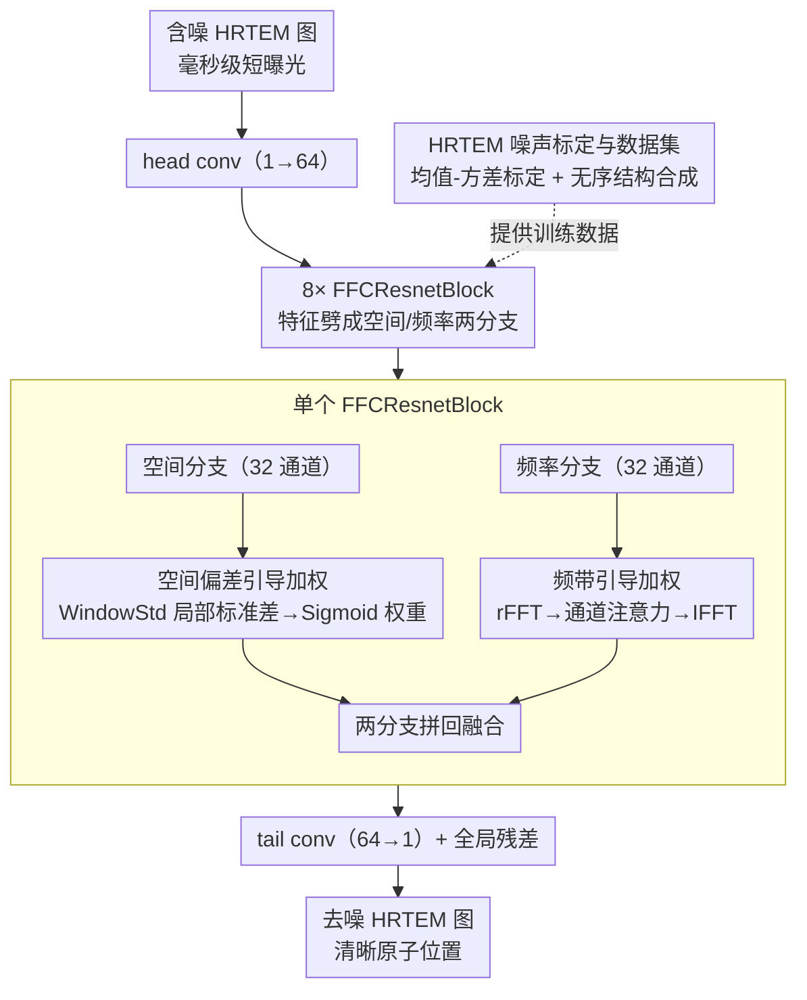

# Statistical Characteristic-Guided Denoising for Rapid High-Resolution Transmission Electron Microscopy Imaging

**会议**: CVPR 2026  
**arXiv**: [2603.18834](https://arxiv.org/abs/2603.18834)  
**作者**: Hesong Li, Ziqi Wu, Ruiwen Shao, Ying Fu
**代码**: [HeasonLee/SCGN](https://github.com/HeasonLee/SCGN)  
**领域**: 图像复原  
**关键词**: HRTEM 去噪, 统计特征引导, 频域去噪, 空间偏差加权, 噪声标定

## 一句话总结

提出统计特征引导去噪网络 SCGN，利用空间域的窗口标准差加权和频域的频带引导加权，分别在空间和频率两个域自适应地增强信号、抑制噪声，结合 HRTEM 专用噪声标定方法生成含无序结构的真实噪声数据集，实现毫秒级高分辨率透射电子显微镜图像的高质量去噪。

## 研究背景与动机

高分辨率透射电子显微镜（HRTEM）可实现原子尺度的成核动态观测，是研究先进固体材料的核心工具。然而成核过程在毫秒量级快速变化，必须采用短曝光快速成像，导致图像中存在严重噪声，遮蔽了原子位置信息。

**现有方法的不足**：

- **通用图像去噪方法**（如 DnCNN、Restormer 等）：未考虑 HRTEM 图像的特殊统计特性——原子区域与背景区域在空间偏差和频率分布上差异显著，通用方法对所有区域施加相同的去噪策略，无法在保持原子细节的同时有效抑制背景噪声
- **HRTEM 噪声建模**：HRTEM 噪声与自然图像噪声不同，受电子束散粒噪声和探测器读出噪声等影响，现有高斯/泊松噪声模型不够准确
- **训练数据匮乏**：缺少包含无序结构（成核过程中的关键特征）和真实 HRTEM 噪声特性的训练数据集

**核心洞察**：HRTEM 图像中原子区域（高信号区域）的局部标准差远高于背景区域，且信号主要集中在特定频带。可以利用这些统计特征指导去噪过程，对不同空间位置和频带施加自适应的处理策略。

## 方法详解

### 整体框架

SCGN 针对的是 HRTEM 快速成像的痛点：成核过程在毫秒级变化，只能短曝光抓拍，结果原子位置被强噪声淹没。它的关键观察是——HRTEM 图里原子区域的局部标准差远高于背景，且信号集中在特定频带，这两个统计特征正好可以拿来当去噪的"导航"。网络本身是基于 FFC（Fast Fourier Convolution）的残差结构，整体走全局残差 $\hat{I}_{clean} = I_{noisy} + \mathcal{F}(I_{noisy})$，由 head conv（1→64 通道）→ 8 个 FFCResnetBlock → tail conv（64→1 通道）构成；每个 FFCResnetBlock 把特征劈成空间分支（32 通道）和频率分支（32 通道）分别处理再拼回。空间和频率两个域各自挂一套统计特征引导的加权，外加一套 HRTEM 专用的噪声标定来造训练数据。

### 关键设计

**1. 空间偏差引导加权：用窗口标准差区分原子区和背景区**

通用去噪器对全图一视同仁，没法在抹掉背景噪声的同时保住原子细节。SCGN 的 WindowStd 模块给每个位置算一个 $3\times3$ 窗口内的局部标准差 $\sigma(x, y) = \sqrt{\frac{1}{K^2} \sum_{(i,j) \in \mathcal{W}} [F(i,j) - \bar{F}(x,y)]^2}$，实现时用 $\text{Var}(X) = E[X^2] - (E[X])^2$ 的恒等式、靠两次深度可分离卷积高效算出（镜像 padding 保边缘精度），整个统计量计算没有可训练参数。标准差图再经 $1\times1$ 卷积加 Sigmoid 得到空间权重 $W_{spatial} = \sigma\left(\text{Conv}_{1 \times 1}(\sigma(F))\right)$，乘回空间卷积输出，使网络在高偏差区域（原子位置）多留细节、在低偏差区域（背景）更狠地去噪。消融里这一项贡献最大（+0.33 dB）。

**2. 频带引导加权：让网络只增强含原子信号的频带**

HRTEM 的信号和噪声在频率上分布不同，纯空间处理利用不上这点。频率分支的 SpectralTransform 模块整套操作都在频域里走：① 对输入特征做 2D rFFT 得到频域表示；② 把归一化频率坐标 $(u, v)$ 拼进频域特征，让网络感知自己在处理哪个频带；③ 用 $1\times1$ 卷积分别处理实部和虚部；④ 经 ChannelAttention（平均池化+最大池化→共享 FC→Sigmoid）对不同频带施加自适应权重，增强含原子信号的频带、压住噪声主导的频带；⑤ IFFT 逆变换回到空间域。通道注意力因此学到了 HRTEM 图像里信号与噪声的频率分布差异，等价于一个自适应的频域滤波。

**3. HRTEM 专用噪声标定与数据集：补上真实噪声和无序结构的训练数据**

没有贴合 HRTEM 的训练数据，再好的网络也迁移不到真实图像。HRTEM 噪声受电子束散粒噪声和探测器读出噪声主导，和自然图像的高斯/泊松假设对不上，所以 SCGN 先分析真实 HRTEM 图像的均值-方差关系建立标定模型；再用分子动力学模拟或随机扰动生成成核过程中的无序原子结构；最后把标定噪声加到合成的无序结构图像上，造出 1000 张训练 + 100 张测试的配对数据集。这套数据让模型在真实快速成像数据上也能清晰分辨单个原子，消融中加入噪声标定再带来 +0.13 dB。

## 实验关键数据

### Table 1: 合成 HRTEM 数据上的定量比较

| 方法 | PSNR (dB) ↑ | SSIM ↑ | IoU (%) ↑ | 参数量 |
|------|-------------|--------|-----------|--------|
| BM3D | 28.34 | 0.812 | 71.2 | - |
| DnCNN | 30.15 | 0.856 | 76.8 | 0.56M |
| FFDNet | 30.42 | 0.861 | 77.3 | 0.49M |
| SwinIR | 31.28 | 0.883 | 80.5 | 11.8M |
| Restormer | 31.56 | 0.889 | 81.2 | 26.1M |
| NAFNet | 31.43 | 0.886 | 80.8 | 17.1M |
| **SCGN (Ours)** | **32.14** | **0.901** | **84.6** | ~2.5M |

SCGN 在三个指标上均取得最优：PSNR 超过 Restormer **0.58 dB**，IoU 提升 **3.4%**，且参数量仅为其约 1/10。IoU 的显著提升表明去噪质量直接改善了下游原子定位任务。

### Table 2: 消融实验

| 配置 | PSNR (dB) | SSIM | IoU (%) |
|------|-----------|------|---------|
| Baseline (纯 CNN) | 30.87 | 0.872 | 78.1 |
| + 频域分支 (FFC) | 31.45 | 0.888 | 81.3 |
| + 空间标准差加权 | 31.78 | 0.894 | 83.0 |
| + 频带通道注意力 | 32.01 | 0.898 | 84.1 |
| + HRTEM 噪声标定 | **32.14** | **0.901** | **84.6** |

每个组件均带来稳定提升：空间标准差加权贡献最大（+0.33 dB），频域分支和通道注意力各贡献约 +0.5 dB，噪声标定进一步带来 +0.13 dB。

### 真实 HRTEM 图像结果

在真实快速成像的 HRTEM 数据上，SCGN 去噪后的图像可以清晰分辨单个原子位置，原子定位精度优于所有对比方法。特别是在成核前沿的无序区域，其他方法容易产生伪原子或丢失真实原子，而 SCGN 的统计特征引导机制有效避免了这些问题。

## 亮点与洞察

- **统计特征驱动的自适应去噪**：首次将 HRTEM 图像的空间偏差和频带分布特性作为显式引导信号，而非让网络隐式学习，显著提升了原子区域与背景区域的差异化处理能力
- **轻量高效**：约 2.5M 参数量实现了超越 Restormer (26.1M) 等大模型的性能，窗口标准差计算无可训练参数、频域操作天然高效
- **端到端可微的标准差计算**：利用 $E[X^2] - (E[X])^2$ 公式通过卷积实现窗口标准差，支持反向传播，优雅地将统计量嵌入网络
- **领域定制的噪声建模**：HRTEM 噪声标定方法弥补了通用噪声模型在电镜图像上的不足，确保了从合成数据到真实数据的迁移性能
- **下游任务直接受益**：不仅关注 PSNR/SSIM 等图像质量指标，还评估了原子定位 IoU，证明去噪质量对科学发现有实际意义

## 局限性

- **领域特异性**：方法高度针对 HRTEM 图像设计，空间标准差引导的假设（原子区域高偏差）可能不直接适用于其他类型的显微镜或医学图像
- **数据集规模有限**：1000 张训练 + 100 张测试的数据集相对较小，模型泛化性在更大规模和更多样的 HRTEM 条件下有待验证
- **单一噪声水平**：当前设计似乎针对固定的快速成像条件，对不同曝光时间/电子剂量的自适应能力未充分探讨
- **架构固定**：8 个 FFCResnetBlock 和 64 通道的设计未进行系统的架构搜索或缩放实验

## 相关工作

- **通用图像去噪**：DnCNN (残差学习)、FFDNet (噪声水平图输入)、SwinIR/Restormer (Transformer 架构)、NAFNet (简化注意力) → 均未考虑 HRTEM 图像的统计特性
- **频域去噪**：FFC (NeurIPS 2020, 快速傅里叶卷积)、DFCAN (频域增强) → SCGN 在 FFC 基础上引入频带引导的通道注意力
- **电镜图像处理**：传统方法多基于 BM3D 或维纳滤波，近期有基于 U-Net 的端到端方法，但均未利用统计特征作为显式引导
- **SCGN 的定位**：将物理先验（统计特征）与数据驱动学习（深度网络）结合，在保持轻量级的同时实现 HRTEM 去噪的 SOTA

## 评分

- 新颖性: ⭐⭐⭐⭐ — 统计特征引导的空间-频域自适应去噪思路清晰有新意，将领域物理先验优雅地嵌入网络设计
- 实验充分度: ⭐⭐⭐ — 合成和真实数据均有验证，但数据集规模偏小，对比方法可以更丰富
- 写作质量: ⭐⭐⭐⭐ — 动机清晰、方法描述严谨，代码已开源
- 价值: ⭐⭐⭐⭐ — 对材料科学中的原子尺度动态观测有直接应用价值，方法可推广到其他科学成像去噪场景

<!-- RELATED:START -->

## 相关论文

- [\[CVPR 2026\] DetectSCI: Toward Object-Guided ROI Reconstruction for High-Resolution Video Snapshot Compressive Imaging](detectsci_toward_object-guided_roi_reconstruction_for_high-resolution_video_snap.md)
- [\[CVPR 2026\] VEMamba: Efficient Isotropic Reconstruction of Volume Electron Microscopy with Axial-Lateral Consistent Mamba](vemamba_efficient_isotropic_reconstruction_of_volume_electron_microscopy_with_ax.md)
- [\[CVPR 2026\] HDW-SR: High-Frequency Guided Diffusion Model based on Wavelet Decomposition for Image Super-Resolution](hdw-sr_high-frequency_guided_diffusion_model_based_on_wavelet_decomposition_for_.md)
- [\[CVPR 2026\] Zero-Shot Image Denoising via Hybrid Prior-Guided Pseudo Sample Generation](zero-shot_image_denoising_via_hybrid_prior-guided_pseudo_sample_generation.md)
- [\[CVPR 2026\] DreamSR: Towards Ultra-High-Resolution Image Super-Resolution via a Receptive-Field Enhanced Diffusion Transformer](dreamsr_towards_ultra-high-resolution_image_super-resolution_via_a_receptive-fie.md)

<!-- RELATED:END -->
