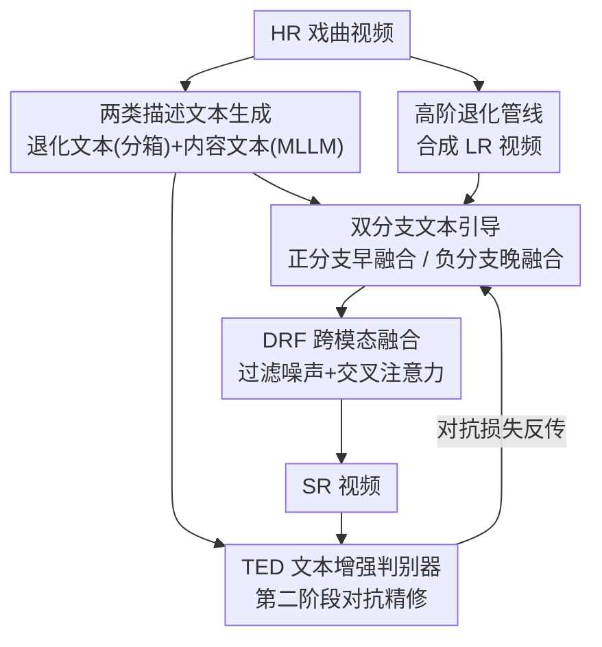

# TextOVSR: Text-Guided Real-World Opera Video Super-Resolution

**会议**: CVPR 2026  
**论文**: [CVF Open Access](https://openaccess.thecvf.com/content/CVPR2026/html/Chang_TextOVSR_Text-Guided_Real-World_Opera_Video_Super-Resolution_CVPR_2026_paper.html)  
**代码**: https://github.com/ChangHua0/TextOVSR  
**领域**: 图像恢复 / 视频超分辨率  
**关键词**: 真实世界视频超分、戏曲视频、文本引导、退化建模、跨模态融合

## 一句话总结
针对老旧戏曲视频画质差、真实退化难建模的问题，TextOVSR 引入「退化描述文本」和「内容描述文本」两类提示，搭一个正/负双分支网络——负分支用退化文本约束解空间、正分支用内容文本补语义，再配一个退化鲁棒的跨模态融合模块（DRF）和一个吃文本语义的判别器（TED），在自建 OperaLQ 真实退化基准上把无参考画质指标刷到 SOTA。

## 研究背景与动机

**领域现状**：真实世界视频超分（Real-World VSR, RWVSR）这几年从「假定 bicubic 下采样」转向「逼近真实复杂退化」。主流做法两条：一是 Real-ESRGAN 式的高阶退化管线，把模糊、缩放、噪声、JPEG/视频压缩等若干已知退化核串成多阶来合成低质输入；二是 NegVSR 式的真实噪声建模，直接从外部数据集里抠真实噪声 patch 注进来，并用一个「负约束」（negative constraint）让模型对噪声更鲁棒。

**现有痛点**：把这些方法直接搬到退化严重的戏曲视频上，有两个绕不过去的坎。第一，**真实退化建模难**：纯靠经典退化核的简单组合，合成出来的噪声分布跟真实的对不上，容易落到分布外（out-of-distribution）；而从外部数据集抠真实噪声又高度依赖「外部数据风格 ≈ 目标数据风格」，日常视频的噪声风格和戏曲视频不匹配时，会在结果里引入明显伪影。第二，**缺高层语义引导**：现有 RWVSR 只吃退化后的图像特征，没有任何高层语义信息，重建逼真纹理（尤其是人脸、文字、戏服这类有结构的区域）时力不从心。

**核心矛盾**：退化建模要「真实」就得引入真实噪声，但真实噪声带来风格错配的伪影；纹理重建要「逼真」就需要语义先验，但纯图像特征里没有这种先验。两者都指向同一个缺口——**模型缺少一个稳定、可控、带语义的外部引导信号**。

**切入角度**：作者注意到文本是个天然的高层语义载体，而且可控、便宜。如果能把「这帧退化有多重」和「这帧画的是什么」都写成文字喂进网络，前者可以约束退化建模的解空间、后者可以给纹理重建补语义。

**核心 idea**：在经典 RWVSR（基于 NegVSR / BasicVSR）框架上嵌入两类文本提示——退化描述文本进负分支约束解空间，内容描述文本进正分支和判别器补语义，用文本而非扩散先验来同时改善退化建模和纹理重建，保持轻量。

## 方法详解

### 整体框架

TextOVSR 是一个**正/负双分支、文本引导**的真实世界戏曲视频超分网络，两个分支都建在 BasicVSR 的双向传播骨架上。输入是退化的低分辨率戏曲视频，输出是超分后的高分辨率视频。整条管线可以拆成「先造文本 → 双分支带文本传播 → 跨模态融合 → 对抗精修」四段：

先在用高阶退化管线合成 LR 训练数据的同时，按退化强度生成**退化描述文本**；再用多模态大模型（MLLM）从干净 HR 帧生成**内容描述文本**。训练时，**正分支**（蓝）吃「内容文本 + 退化 LR 视频」产出超分结果 $V_{sr}^{t}$，**负分支**（红）吃「退化文本 + 混入真实噪声的 LR 视频」产出 $\hat{V}_{sr}^{t}$，两个分支输出算负损失 $\mathcal{L}_{neg}$ 来增强正分支对真实噪声的鲁棒性。两分支里图像特征和文本特征都通过 **DRF 模块**做跨模态融合，区别在融合时机：正分支**早融合**（深层特征提取前，增强帧特征表达、抑制误差传播），负分支**晚融合**（深层特征提取后，让退化描述在特征层面建模真实噪声）。训练分两阶段，第二阶段把 TextOVSR 当生成器、引入**文本增强判别器 TED** 做对抗训练精修纹理。推理时只用正分支，且不再需要退化描述文本。

### 关键设计

**1. 两类描述文本生成：把退化强度和画面语义都写成可控的文字提示**

这一步针对的是「退化建模不真实」和「缺语义引导」两个痛点的源头——给网络造两种文字信号。**退化描述文本**跟着高阶退化管线一起生成：管线每一阶包含模糊、缩放、噪声、JPEG 压缩、视频压缩等操作，作者沿用 PromptSR 的思路，把每种退化的强度**分箱**成 light / medium / heavy 三档，得到诸如「light blur」这样的短语；高阶退化则把连续若干阶的描述拼接起来，形成一条完整的高阶退化描述（如「heavy blur, downsample, medium noise, light image compression, medium video compression…」）。**内容描述文本**则用 MLLM（实现里是 LLaVA）逐帧生成，关键是它从**干净的 HR 帧**而非退化 LR 帧生成（如「画面里一位身着传统中式戏服的女子站在舞台上，手持折扇…」），这样语义才准确、不被退化污染。为了效率和视频级一致性，文本在连续帧间按 batch 共享，batch size 取 7 以对齐原数据集的 7 帧片段格式。

**2. 双分支文本引导与差异化融合时机：正分支补语义、负分支约束解空间**

这是整体框架的主干，直接回应「真实退化要建模、但又会引入伪影」的矛盾。两分支都建在 BasicVSR 的双向传播上，但角色相反：正分支（蓝）输入内容描述文本 $T_C$ + 退化 LR 视频，目标是产出高质量超分；负分支（红）输入退化描述文本 $T_D$ + 混入真实噪声的 LR 视频，作为「反例」来约束。训练时两分支输出 $V_{sr}^{t}$、$\hat{V}_{sr}^{t}$ 算负损失 $\mathcal{L}_{neg}(V_{sr}^{t},\hat{V}_{sr}^{t})$，让正分支学会在真实噪声下也保持稳定。最巧的是**融合时机的差异化**：正分支把文本特征**在深层特征提取之前**就融进去，增强帧特征表达力、抑制误差沿时间传播；负分支把文本特征放在**深层特征提取之后**才融，好让退化描述在特征层面去建模真实噪声分布。以正分支前向传播 $t\to t+1$ 为例：LR 视频 $V_{lr}$ 先经残差模块得帧特征 $F_I^{t+1}$，CLIP 文本编码器把 $T_C$ 编成 $F_{T_C}^{t+1}$，二者经 DRF 融成 $M^{t+1}$；同时上一时刻特征 $F_I^{t}$ 与光流 $v_{t\to t+1}$ 经空间 warp 得对齐特征 $\tilde{F}_I^{t}$；最后把融合特征与对齐时序特征沿通道拼接、再过残差模块得到 $t+1$ 帧的最终特征。

**3. DRF 退化鲁棒跨模态融合模块：先过滤再交叉注意力，避免把脏特征直接信进去**

正负分支的输入都可能含不可靠信息——正分支的 LR 输入自带退化失真，直接信任会在时序传播中放大误差、糊掉细节；负分支注入的外部真实噪声又常有风格错配；连 MLLM 生成的内容描述也可能不准。DRF 就是为「带着不确定性融合」而设计的：提取出的帧特征 $F_I^{t+1}$ 和文本特征 $F_T^{t+1}$ 先分别经**多头自注意力**和线性层做一次「过滤」，放大可靠信息、压制噪声和错误特征，得到过滤后的 $\hat{F}_I^{t}$ 和 $\hat{F}_T^{t}$；随后用过滤后的图像特征生成 Query，用过滤后的文本特征生成 Key 和 Value，经**多头交叉注意力**算出融合特征 $M^{t+1}$。先过滤后交叉注意力的两段式结构，是它能「跨模态融合的同时抑制退化干扰」的关键。

**4. TED 文本增强判别器：让对抗信号也带上高层语义**

内容描述文本里的高层语义不只对生成器有用，对判别器同样有用——更懂「画面该是什么」的判别器能给出更准的对抗引导。TED 在标准 UNet 判别器基础上注入文本特征：输入是超分帧 $V_{sr}^{t}$ 和对应内容文本特征 $F_{T_C}^{t}$，UNet 提取图像特征 $F_{sr}^{t}$，一个特征过滤器筛出有效文本特征 $\hat{F}_{T_C}^{t}$，二者沿通道拼接后经残差模块算对抗损失。这个「UNet 抽图像 + 过滤文本」的组合，既吃到了内容描述的高层语义、又过滤掉不准的特征，比直接套 GALIP 那种用 CLIP 图文编码器不加过滤地对齐要稳——后者在人脸、戏服这类细粒度区域容易给出含糊重建。

### 损失函数 / 训练策略

采用两阶段训练（沿用 RealBasicVSR / NegVSR 的范式）。**第一阶段**只训 TextOVSR，损失为重建损失加负损失：

$$\mathcal{L}_{stage1}=\mathcal{L}_{rec}(V_{sr}^{t},V_{GT}^{t})+\alpha\,\mathcal{L}_{neg}(V_{sr}^{t},\hat{V}_{sr}^{t})$$

其中负损失权重 $\alpha=0.5$。训练 100K 次迭代，Adam 优化器，学习率 $1\times10^{-4}$。**第二阶段**把训好的 TextOVSR 当生成器、TED 当判别器，在 GAN 框架下精修细节，学习率降到 $5\times10^{-5}$，额外加感知损失 $\mathcal{L}_{per}$ 和 CLIPIQA 损失。CLIPIQA 损失定义为 $\mathcal{L}_{clipiqa}=1-\mathcal{R}(V_{sr}^{t})$（$\mathcal{R}$ 为 CLIP-IQA 模型），对抗损失 $\mathcal{L}_{adv}=-\mathbb{E}\big[\log\,TED(V_{sr}^{t},F_{T_C}^{t})\big]$。第二阶段总目标为：

$$\mathcal{L}_{stage2}=\mathcal{L}_{stage1}+\mathcal{L}_{per}(V_{sr}^{t},V_{GT}^{t})+\beta\,\mathcal{L}_{clipiqa}+\mathcal{L}_{adv}$$

其中 $\beta=0.5$。光流用预训练 SPyNet（冻结）估计，文本用 CLIP ViT-L/14@336px 编码。

## 实验关键数据

### 主实验

训练集用 MambaOVSR 的中文戏曲视频片段（COVC），7 帧片段拆成单帧重建；不同于 RealBasicVSR 的在线退化，本文用 RealESRGAN 管线**预生成**退化输入，保证各 epoch 退化一致、且能和逐帧退化描述文本对齐。GT 与退化帧随机裁到 $256\times256$，退化帧再 bicubic 下采到 $64\times64$。评测在自建 OperaLQ 基准（50 段真实退化戏曲视频、每段 100 帧）上做。由于真实退化视频**没有 GT 参考**，全程用无参考指标：图像级 NRQM / MUSIQ / CLIPIQA+ / TOPIQ / BRISQUE / NIQE / ILNIQE / PI，视频级 DOVER。

| 方法 | Params(M) | NRQM↑ | CLIPIQA+↑ | TOPIQ↑ | NIQE↓ | BRISQUE↓ | DOVER↑ |
|------|-----------|-------|-----------|--------|-------|----------|--------|
| RealBasicVSR | 4.9 | 5.1708 | 0.3494 | 0.3556 | 4.4300 | 41.7475 | 33.4799 |
| RealViformer | 8.5 | 5.1894 | 0.3774 | 0.3669 | 4.4347 | 39.3883 | 39.4318 |
| NegVSR（baseline） | 3.4 | 5.7761 | 0.3990 | 0.4354 | 4.0756 | 33.5291 | 40.6763 |
| **TextOVSR（本文）** | 5.7 | **5.8184** | **0.5667** | **0.4636** | **3.5139** | **33.3799** | **45.0415** |

TextOVSR 在 CLIPIQA+、TOPIQ、NIQE、BRISQUE、PI、DOVER 等多数指标上拿到最优。最显眼的是 CLIPIQA+ 从 NegVSR 的 0.3990 跳到 0.5667（+0.1677），DOVER 从 40.68 升到 45.04，说明文本引导对感知质量和时序一致性都有实打实的提升；而参数量仅 5.7M、FLOPs 309.6G，仍属轻量级（MUSIQ 上 58.30 略低于 NegVSR 的 58.64，是唯一被反超的指标）。

### 消融实验

以 NegVSR 为 baseline（Variant 1），逐步加 DRF、退化/内容文本、TED：

| 变体 | 配置 | NRQM↑ | CLIPIQA+↑ | TOPIQ↑ | NIQE↓ |
|------|------|-------|-----------|--------|-------|
| V1 | baseline（NegVSR，w/o T,N） | 5.7761 | 0.3990 | 0.4354 | 4.0756 |
| V2 | +DRF（仅增强负分支） | 5.4949 | 0.5462 | 0.4436 | 3.7303 |
| V3 | +退化文本 $T_D$ | 5.4610 | 0.5471 | 0.4483 | 3.6396 |
| V4 | 双分支均增强 | 5.5697 | 0.5507 | 0.4523 | 3.6627 |
| V5 | +内容文本（$T_D$&$T_C$） | 5.6838 | 0.5667 | 0.4636 | 3.5139 |
| V6 | +TED（完整模型） | 5.8184 | 0.5659 | 0.4733 | 3.4291 |

V1→V2 仅用 DRF 增强负分支，就把 CLIPIQA+ 抬了 0.1472（0.3990→0.5462），有效压住了风格不一致噪声带来的伪影；V3 加退化文本、V4 增强双分支、V5 融入内容文本都在 TOPIQ / NIQE 上稳步变好；最后 V5→V6 加 TED，NRQM 5.6838→5.8184、TOPIQ 0.4636→0.4733、NIQE 3.5139→3.4291、BRISQUE 35.7444→33.3799，对抗精修把整体重建质量再推一档。

另外三组分析实验：(1) **文本粒度**——细粒度 Text（NRQM 5.6838 / NIQE 3.5139）相比粗粒度 Caption（NRQM 5.5552 / NIQE 3.6206）整体更好，仅 CLIPIQA+ 微降 0.0051，细粒度描述能更好引导人脸、椅子等结构恢复；(2) **判别器**——TED（NRQM 5.8184 / TOPIQ 0.4733）> UNet（5.6838 / 0.4636）> 直接套 CLIP 图文对齐（5.0118 / 0.2860，未过滤导致细粒度区域含糊）；(3) **负分支里 DRF 的位置**——「特征提取后」融合（CLIPIQA+ 0.5462 / NIQE 3.7303）优于「提取前」（0.5438 / 3.7274）和不加（0.3990 / 4.0753），晚融合能压住分布外噪声。

### 关键发现
- DRF 是涨点主力：仅 V1→V2 一步（只在负分支加 DRF）就让 CLIPIQA+ 暴涨 0.1472，说明「带过滤的跨模态融合」对抑制风格错配噪声极关键。
- 文本粒度越细越好，但要配过滤：细粒度内容描述能引导更清晰的结构恢复；可若像 CLIP 判别器那样不加过滤地用文本，反而在人脸/戏服等细节区翻车——TED 的「先过滤再用」正是为此。
- 融合时机不是越早越好：正分支早融合、负分支晚融合是刻意区分的；负分支若早融会带进噪声，晚融才能把分布外噪声压在特征层。

## 亮点与洞察
- **用文本当「退化标签 + 语义先验」的双重信号**：退化描述文本本质上是把连续的退化强度离散成可读的分箱标签喂进负分支约束解空间，内容描述文本是把画面语义喂进正分支补纹理——一个轻量文本通道同时解决了「退化建模」和「语义引导」两个老问题，且不需要扩散模型那种多步去噪的高昂算力。
- **内容文本从 HR 而非 LR 生成**这一细节很关键：从退化帧生成的描述会被噪声污染、语义不准，从干净 HR 生成才能给出可信语义先验，推理时再用 MLLM 对测试帧现生成。
- **DRF 的「先过滤后交叉注意力」**是个可迁移的跨模态融合范式：当两个模态都不完全可靠（脏图像 + 可能不准的文本）时，先各自自注意力过滤、再交叉注意力融合，比直接 concat / cross-attn 更稳，可借鉴到其他带噪跨模态任务。
- **判别器也吃语义**：TED 提醒我们 GAN 的判别端同样能受益于高层语义引导，不只生成端——把内容文本注入判别器能给出更准的对抗信号。

## 局限与展望
- **强依赖 MLLM 与 CLIP 编码器**：内容文本质量直接取决于 LLaVA 的描述准确度，推理时还要对每帧跑 MLLM，实际部署有额外开销；MLLM 描述不准时会引入新的不确定性（作者也承认这点，靠 DRF/TED 的过滤来缓解，但没根除）。
- **退化描述靠人工分箱规则**：light/medium/heavy 三档分箱和拼接策略是基于退化管线参数的启发式，未必能覆盖真实戏曲视频里所有退化形态；分箱粒度对结果的影响未充分探究。
- **评测全为无参考指标**：真实退化数据没有 GT，只能用 NRQM/CLIPIQA+/DOVER 等无参考指标，这类指标和人眼主观一致性有限，MUSIQ 上还被 NegVSR 反超，结论需结合定性图来看（⚠️ 横向比较时不同无参考指标侧重不同，单看某一指标排名不可直接外推）。
- **域较窄**：方法围绕戏曲视频构建（训练集 COVC、基准 OperaLQ），在其他真实退化域（监控、老电影）上的泛化未验证。

## 相关工作与启发
- **vs NegVSR**：本文直接建在 NegVSR 之上并把它当 baseline。NegVSR 从外部数据集抠真实噪声 + 负约束来增强鲁棒，但有风格错配伪影、且只用图像特征。TextOVSR 保留负分支/负损失的思路，额外引入两类文本和 DRF/TED，把退化建模和纹理重建都升级，CLIPIQA+ 从 0.3990 提到 0.5667。
- **vs Real-ESRGAN / RealBasicVSR**：它们靠高阶退化管线/动态清理模块逼近真实退化，仍是「纯图像特征」路线，缺语义引导；本文复用其退化管线造数据，但额外把退化强度写成文本喂进网络。
- **vs 扩散式文本引导 SR（STAR / CLIP-SR 等）**：扩散方法借生成先验能造逼真纹理，但多步去噪算力开销大、还要处理时序不一致。本文把多类文本提示嵌进经典 RWVSR 框架，在轻量、鲁棒的前提下实现退化建模与纹理增强，是与扩散路线不同的取向。

## 评分
- 新颖性: ⭐⭐⭐⭐ 「退化文本 + 内容文本」双文本嵌进经典 RWVSR，配差异化融合时机和带过滤的跨模态判别器，组合思路新颖且贴问题。
- 实验充分度: ⭐⭐⭐⭐ 主对比覆盖 8 个 SOTA + 多指标，消融拆到逐变体并附文本粒度/判别器/融合位置三组分析；但仅戏曲单域、全无参考指标。
- 写作质量: ⭐⭐⭐⭐ 动机—方法—实验逻辑清晰，图 1/2/3 把双分支和文本生成讲得明白。
- 价值: ⭐⭐⭐⭐ OperaLQ 基准 + 文本引导 RWVSR 方案对老旧戏曲/影像修复有实用价值，DRF 的跨模态融合范式可迁移。

<!-- RELATED:START -->

## 相关论文

- [\[CVPR 2026\] One-Step Diffusion Transformer for Controllable Real-World Image Super-Resolution](one-step_diffusion_transformer_for_controllable_real-world_image_super-resolutio.md)
- [\[ECCV 2024\] Towards Real-world Event-guided Low-light Video Enhancement and Deblurring](../../ECCV2024/image_restoration/towards_real-world_event-guided_low-light_video_enhancement_and_deblurring.md)
- [\[CVPR 2026\] Toward Real-world Infrared Image Super-Resolution: A Unified Autoregressive Framework and Benchmark Dataset](real_iisr_infrared_image_super_resolution_autoregressive.md)
- [\[CVPR 2026\] Time-Aware One Step Diffusion Network for Real-World Image Super-Resolution](time-aware_one_step_diffusion_network_for_real-world_image_super-resolution.md)
- [\[CVPR 2026\] Restore Text First, Enhance Image Later: Two-Stage Scene Text Image Super-Resolution with Glyph Structure Guidance](restore_text_first_enhance_image_later_two-stage_scene_text_image_super-resoluti.md)

<!-- RELATED:END -->
