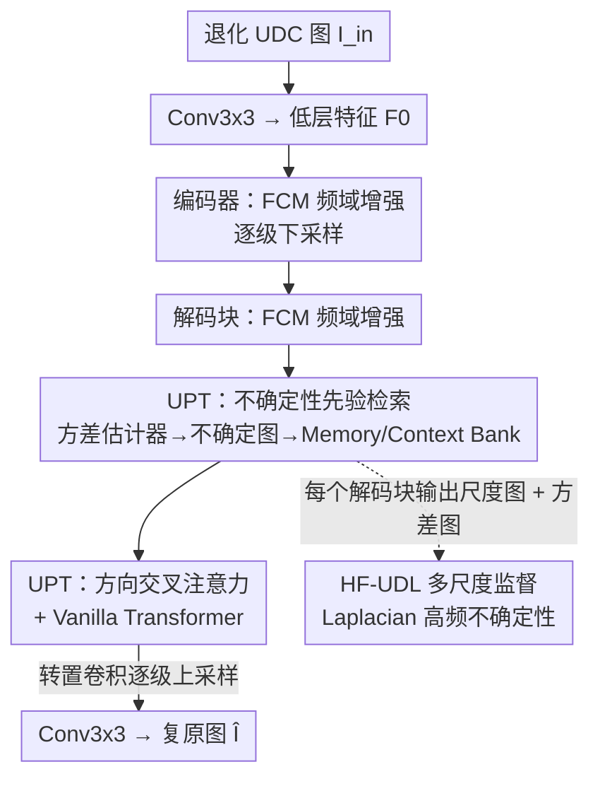

# UCMNet: Uncertainty-Aware Context Memory Network for Under-Display Camera Image Restoration

**会议**: CVPR 2026  
**论文**: [CVF Open Access](https://openaccess.thecvf.com/content/CVPR2026/html/Kim_UCMNet_Uncertainty-Aware_Context_Memory_Network_for_Under-Display_Camera_Image_Restoration_CVPR_2026_paper.html)  
**代码**: [项目页](https://kdhrick2222.github.io/projects/UCMNet)（代码称发表后释放）  
**领域**: 图像恢复 / 屏下相机  
**关键词**: 屏下相机(UDC)、图像恢复、不确定性建模、记忆库、频域增强

## 一句话总结
UCMNet 用一张逐像素的不确定性图来标定屏下相机（UDC）图像中"哪里退化得最不规则、最难恢复"，再让一对可学习的 Memory/Context Bank 按不确定性模式检索对应的高频上下文，从而对空间非均匀退化做自适应恢复——在 POLED/TOLED/SYNTH 上以比 BNUDC 少约 30% 参数（3.2M vs 4.6M）拿到 SOTA。

## 研究背景与动机
**领域现状**：屏下相机把摄像头藏到 OLED 屏幕下面以实现真全面屏，但光线穿过显示层会发生衍射、散射和内部反射，导致透光率下降、模糊、噪声和眩光。UDC 恢复因此是一个同时混合了去噪、去模糊、低光增强、超分的复合任务。主流做法有三条线：基于 PSF 的物理建模、联合学习框架、以及频域分离网络（如 BNUDC 双分支分别恢复高/低频，FSI 频域-空域交互）。

**现有痛点**：这些方法能恢复出大致的低频结构、保住整体颜色一致性，但在恢复**精细高频细节**时仍然吃力。根本原因在于它们大多对全图施加**统一的恢复处理**——可 UDC 退化是高度空间非均匀的：镜头中心和边缘的衍射特性差别极大，同一张图里不同位置的退化模式完全不同（grid 网格状伪影、横向条纹等）。用一套均匀算子去套千变万化的局部退化，残留畸变自然消不掉。

**核心矛盾**：确定性（deterministic）的恢复网络把所有像素一视同仁，没法区分"这块我有把握"和"这块衍射严重、我吃不准"。而 UDC 恢复恰恰最需要把算力和注意力倾斜到那些"吃不准"的高误差区域。

**本文目标**：(1) 量化出每个像素的恢复不确定性，且要对高频细节区域估得准；(2) 让网络据此对不同退化区域做差异化、自适应的高频恢复。

**切入角度**：作者借鉴去雨去雪、超分里的不确定性建模思路——不确定性逐像素地度量预测置信度，在视觉退化严重的区域天然偏高。把不确定性当成一种**先验**，就能引导网络聚焦到局部退化各异的难区。

**核心 idea**：用一张高频敏感的不确定性图当"钥匙"，去一对 Memory/Context Bank 里检索"这种退化模式该补什么高频上下文"，从而把均匀恢复换成不确定性引导的空间自适应恢复。

## 方法详解

### 整体框架
UCMNet 是一个 U 形（encoder–decoder）残差网络。退化输入 $I_{in}\in\mathbb{R}^{H\times W\times 3}$ 先过一个 3×3 卷积得到低层特征 $F_0\in\mathbb{R}^{H\times W\times C}$，然后进入编码器逐级下采样、解码器逐级上采样恢复。编码块（Encoding Block）的核心是**频率卷积模块 FCM**，负责在傅里叶域强化特征、对付显示层带来的退化；解码块（Decoding Block）在 FCM 之外额外塞进**不确定性先验 Transformer（UPT）**，做不确定性引导的特征精修，最后转置卷积上采样。每个解码块都挂一对"均值估计器 + 方差估计器"，方差估计器吐出该尺度的不确定性图、均值估计器吐出该尺度的重建图，并用高频不确定性损失 HF-UDL 在多个尺度上同时监督。

### 关键设计

**1. FCM 频率卷积模块：在傅里叶域显式对抗显示层退化**

UDC 退化（衍射、散射）在频域有清晰的结构性特征，纯空域卷积难以高效捕捉。FCM 受 NAFBlock 启发，由一个**频域特征增强分支**和一个**空间注意力分支**组成：前者把特征做 FFT 进入傅里叶域、用 1×1/3×3 卷积增强后再 IFFT 回空域，后者用 Simple Gate（SG）和简化通道注意力（SCA）做空间调制。它被放进每个编码块和解码块，作为整网"打底"的频域增强算子，先把高频结构尽量找回来，再交给后续的不确定性模块做局部精修。

**2. 不确定性先验检索：用 Memory/Context Bank 把"退化模式"映射到"该补的高频"**

这是 UCMNet 的核心，也是它区别于统一恢复方法的关键。UPT 块里先用一个方差估计器从输入特征 $F_{in}\in\mathbb{R}^{H'\times W'\times C}$ 预测不确定性图 $F_U$，高不确定区域被凸显出来。然后引入一对可学习记忆库：Memory Bank $M=[m_1,\dots,m_N]$ 和 Context Bank $C=[c_1,\dots,c_N]$，各含 $N$ 个 token 对（$M,C\in\mathbb{R}^{N\times C}$）。每个 $m_i$ 学习并存储一种**不确定性模式**，配对的 $c_i$ 存储**适配该模式的补偿高频信息**——Memory Bank 相当于 Context Bank 的"地址索引"。

检索时，对不确定性图里每个像素的特征向量 $f^u_j$，先与每个 $m_i$ 算余弦相似度：

$$s_{ij}=\frac{m_i\, {f^u_j}^{\top}}{\lVert m_i\rVert\cdot\lVert f^u_j\rVert}$$

对 $s_{ij}$ 沿记忆库维做 softmax 得到权重 $w_{ij}$，再加权聚合上下文 token 得到该位置检索到的上下文特征 $f^c_j=\sum_i w_{ij}c_i$。这样每个像素按自己的不确定性模式"查表"取回最对症的高频上下文 $F_C$，天然实现了空间自适应。消融（表 6）证明：用不确定性特征 $F_U$ 当先验检索，比直接用输入特征 $F_{in}$ 高 0.18 dB，比无先验的三层 router 高 0.33 dB——不确定性先验确实比原始特征更可靠地指示"该补什么"。

**3. 方向交叉注意力 + Vanilla Transformer：先局部融合检索上下文，再全局拉一致**

取回 $F_C$ 后要把它和输入特征融合。UPT 用交叉注意力，且**特意让 query/value 来自 $F_{in}$、key 来自 $F_C$**——即让检索回来的高频上下文去"引导"恢复，同时保住输入自身的空间内容。为建模空间方向依赖，它把 $Q_1,K_1,V_1$ 分别 reshape 成竖直方向 $\mathbb{R}^{H'\times(W'C)}$ 和水平方向 $\mathbb{R}^{W'\times(H'C)}$，并行做竖直/水平注意力：

$$F_v=\mathrm{softmax}\!\Big(\frac{Q_vK_v^{\top}}{\sqrt{\alpha}}\Big)V_v,\quad F_h=\mathrm{softmax}\!\Big(\frac{Q_hK_h^{\top}}{\sqrt{\alpha}}\Big)V_h$$

两者各自 reshape 回 $\mathbb{R}^{H'\times W'\times C}$ 后取均值并残差：$\hat F=0.5\times(F_v+F_h)+F_{in}$。这种横竖分解既能联合利用两个方向的空间依赖、平衡地精修特征，又把全注意力的开销拆小（呼应 30% 参数下降）。随后再过一个 Vanilla Transformer 做**通道维自注意力**，补全局长程一致性：$F_{out}=\mathrm{Attn}(Q_2,K_2,V_2)+\hat F$。局部方向精修 + 全局通道一致的两段式，正好对应"先按不确定性补局部细节，再统一整张图风格"。

**4. HF-UDL 高频不确定性驱动损失：让不确定性估在高频上、而非整体亮度上**

传统不确定性驱动损失 UDL（式 1）是 $L_{UDL}=\exp(-s)\lVert\hat I-I_{gt}\rVert_1+2s$，用逐像素不确定性 $s$ 自适应加权监督、引导网络盯住大误差区。但作者发现直接套 UDL 不足以恢复 UDC 里被模糊/噪声/低透光复合退化掉的高频细节——UDL 估的是整体像素误差，对纹理边缘不敏感。HF-UDL 的关键改动是在算误差前对复原图和 GT **各加一个 Laplacian 算子 $\Delta$**，把损失约束到高频分量上：

$$L_{HF\text{-}UDL}=\exp(-s)\,\lVert \Delta(\hat I)-\Delta(I_{gt})\rVert_1+2s$$

这样方差估计器被逼着去学习**高频特征的不确定性**，产出的不确定性图更可靠（图 8 显示浅层尺度突出精细结构、深层尺度响应粗退化模式）。HF-UDL 跟随每个解码块多尺度施加，鼓励逐级的不确定性感知精修。总损失为 $L_{total}=\lambda_1 L_{HF\text{-}UDL}+\lambda_2 L_{PSNR}$，经验取 $\lambda_1=100,\lambda_2=0.5$。

## 实验关键数据

### 主实验
POLED/TOLED 测试集（PSNR/SSIM↑，LPIPS/DISTS↓）：

| 数据集 | 指标 | UCMNet | BNUDC(CVPR22) | FSI(ICCV23) | 参数对比 |
|--------|------|--------|---------------|-------------|----------|
| POLED-Test | PSNR/SSIM | **33.81 / 0.9625** | 33.39 / 0.9610 | 33.14 / 0.9546 | 3.2M vs 4.6M / 5.3M |
| POLED-Test | LPIPS/DISTS | **0.1718 / 0.1440** | 0.1748 / 0.1511 | 0.1948 / 0.1458 | — |
| TOLED-Test | PSNR/SSIM | **38.37 / 0.9802** | 38.22 / 0.9798 | 38.21 / 0.9789 | — |
| TOLED-Test | LPIPS/DISTS | **0.0933 / 0.0897** | 0.0988 / 0.0964 | 0.0991 / 0.1006 | — |

合成数据集 SYNTH（PSNR/SSIM↑）：

| 方法 | 参数(M) | PSNR↑ | SSIM↑ | LPIPS↓ | DISTS↓ |
|------|---------|-------|-------|--------|--------|
| BNUDC | 4.6 | 45.56 | 0.9940 | 0.0110 | 0.0155 |
| FSI | 5.3 | 45.69 | 0.9930 | 0.0126 | 0.0206 |
| **UCMNet** | **3.2** | **46.71** | **0.9942** | 0.0110 | **0.0150** |

UCMNet 在三大基准上以更少参数（比 BNUDC 少约 30%）全面领先；SYNTH 上 PSNR 比次优 FSI 高约 1.0 dB。它还**不需要像 BNUDC/FSI 那样手工预处理**，直接喂 POLED/TOLED 原图就能恢复，鲁棒性和通用性更好。

### 消融实验
损失函数消融（POLED，PSNR/SSIM）：

| 配置 | PSNR/SSIM | 说明 |
|------|-----------|------|
| 仅 $L_{PSNR}$ | 33.38 / 0.9600 | 基线 |
| + $L_{UDL}$ | 33.59 / 0.9619 | 加普通不确定性损失，+0.21 dB |
| + $L_{HF\text{-}UDL}$ | **33.81 / 0.9625** | 换成高频版，再 +0.22 dB |

UPT 组件消融（POLED，PSNR/SSIM）：

| 配置 | PSNR/SSIM | 说明 |
|------|-----------|------|
| 纯 vanilla transformer | 33.59 / 0.9618 | 不用 hv-attention/记忆库 |
| + hv-attention | 33.64 / 0.9621 | 横竖方向注意力提升 |
| + 交叉注意力(仅 Memory Bank) | 33.69 / 0.9617 | 只有 M 贡献有限 |
| + Context Bank(完整 UPT) | **33.81 / 0.9625** | M+C 配对检索增益最大 |

上下文先验选择消融（POLED）：三层 router 无先验 33.48 → 用输入特征 $F_{in}$ 检索 33.63 → 用不确定性特征 $F_U$ 检索 **33.81**。

### 关键发现
- **不确定性先验比原始特征更管用**：用 $F_U$ 检索上下文比用 $F_{in}$ 高 0.18 dB，比无先验高 0.33 dB，证明"哪里吃不准"这个信号确实比"原始内容"更能指示该补什么高频。
- **Memory Bank 单独作用有限、必须配 Context Bank**：只用 Memory Bank 做交叉注意力（33.69）和纯 hv-attention（33.64）差不多，说明存"不确定性模式"本身不直接恢复图像；真正补回高频的是配对的 Context Bank（33.81）——验证了"M 是钥匙、C 是内容"的设计。
- **高频化是关键的临门一脚**：UDL→HF-UDL 仅靠加一个 Laplacian 算子就再涨 0.22 dB，且视觉上从"仍残留伪影"变成"最接近 GT、细节锐利"。
- **尺度分工**：深度方向的不确定性图显示浅层管精细结构、深层管粗退化，多尺度 HF-UDL 监督让各级各司其职。

## 亮点与洞察
- **把"恢复哪里"和"补什么"解耦成键值检索**：Memory Bank 学不确定性模式当键、Context Bank 学高频内容当值，逐像素查表。这套"模式→内容"的记忆检索范式可迁移到其它空间非均匀退化任务（去雨去雾、空变去模糊）。
- **不确定性图当 query 钥匙而非简单加权**：多数不确定性方法只把 $s$ 当损失权重，UCMNet 进一步把它升级成驱动检索的先验信号，信息利用更深。
- **横竖分解注意力省参数**：把 2D 全注意力拆成竖直 + 水平并行，是它能在 3.2M 参数下打败 4.6M/5.3M 模型的实在手段，对窄计算预算的端侧 UDC 应用友好。
- **Laplacian 一招点亮高频不确定性**：在不确定性损失里对预测和 GT 各加 Laplacian，就把不确定性估计从"整体亮度误差"重定向到"纹理边缘误差"，思路极简但直击 UDC 高频丢失的痛点。

## 局限与展望
- **记忆库容量 $N$ 的选择缺乏系统分析**：论文未给出 token 对数量 $N$ 对性能/显存的敏感性曲线，实际部署时如何定 $N$ 不明。
- **只在 UDC 三套基准上验证**：方法宣称对"空间非均匀退化"通用，但未在去雨/去雾/真实手机夜景等其它空变退化任务上验证可迁移性。
- **损失权重 $\lambda_1{=}100,\lambda_2{=}0.5$ 纯经验设定**，跨数据集是否稳健、对 $\lambda$ 的敏感度未报告。
- **代码尚未释放**（称发表后开源），复现性待确认。
- 改进方向：把 Memory/Context Bank 做成可随测试退化在线扩容的字典，或引入显式 PSF 物理先验与不确定性先验互补，可能进一步压住极端边缘区的衍射伪影。

## 相关工作与启发
- **vs BNUDC（CVPR22）**：BNUDC 用双分支分别恢复高/低频，但对全图统一处理、忽略空间非均匀的不确定性；UCMNet 用逐像素不确定性引导局部自适应恢复，参数少 30% 且全面领先。
- **vs FSI（ICCV23）**：FSI 做频域-空域交互学习且需手工预处理；UCMNet 直接吃原图、靠 FCM 在傅里叶域增强 + UPT 不确定性检索，鲁棒性和通用性更好。
- **vs 经典 UDL（超分里的不确定性驱动损失）**：UDL 估整体像素不确定性当损失权重；HF-UDL 用 Laplacian 把它聚焦到高频，并把不确定性从"权重"升格为"检索先验"，对 UDC 高频退化更对症。
- **vs PSF 物理建模方法（DISCNet 等）**：物理建模依赖准确 PSF 先验且偏低频结构恢复；UCMNet 走数据驱动的不确定性路线，对真实图里复杂、空变的复合退化更灵活。

## 评分
- 新颖性: ⭐⭐⭐⭐ 把不确定性从损失权重升格为驱动 Memory/Context Bank 检索的先验，"模式键→高频值"的记忆检索设计在 UDC 恢复里是新颖且自洽的组合。
- 实验充分度: ⭐⭐⭐⭐ 三基准 + 损失/UPT/先验三组消融完整，结论清晰；但缺记忆库容量与跨任务迁移分析。
- 写作质量: ⭐⭐⭐⭐ 动机—方法—消融逻辑顺畅，公式与图配套；个别符号（如 $F_C$ 检索维度）需对照图理解。
- 价值: ⭐⭐⭐⭐ 以更少参数刷新 UDC SOTA 且免预处理，对端侧全面屏成像有实用价值，记忆检索范式可外推。

<!-- RELATED:START -->

## 相关论文

- [\[CVPR 2026\] Time-Aware One Step Diffusion Network for Real-World Image Super-Resolution](time-aware_one_step_diffusion_network_for_real-world_image_super-resolution.md)
- [\[CVPR 2026\] FAPE-IR: Frequency-Aware Planning and Execution Framework for All-in-One Image Restoration](fape-ir_frequency-aware_planning_and_execution_framework_for_all-in-one_image_re.md)
- [\[CVPR 2026\] LightRR: A Lightweight Network for Single Image Reflection Removal](lightrr_a_lightweight_network_for_single_image_reflection_removal.md)
- [\[ICML 2026\] Degradation-Aware Metric Prompting for Hyperspectral Image Restoration](../../ICML2026/image_restoration/degradation-aware_metric_prompting_for_hyperspectral_image_restoration.md)
- [\[CVPR 2026\] White-Balance First, Adjust Later: Cross-Camera Color Constancy via Vision-Language Evaluation](white-balance_first_adjust_later_cross-camera_color_constancy_via_vision-languag.md)

<!-- RELATED:END -->
