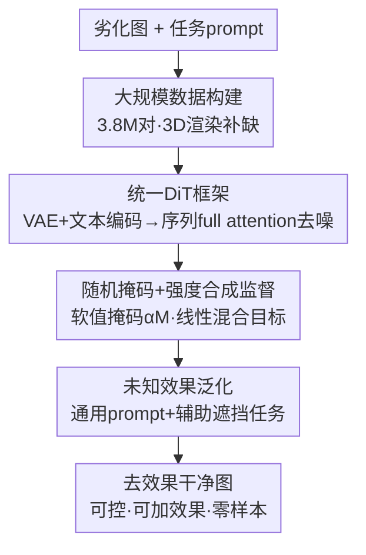

# UniSER: A Foundation Model for Unified Soft Effects Removal

**会议**: CVPR 2026  
**论文**: [CVF Open Access](https://openaccess.thecvf.com/content/CVPR2026/html/Zhang_UniSER_A_Foundation_Model_for_Unified_Soft_Effects_Removal_CVPR_2026_paper.html)  
**代码**: https://github.com/Evergreen0929/UniSER-Datasets （仅数据集）  
**领域**: 图像恢复  
**关键词**: 软效果去除, 扩散 Transformer, 数据驱动基础模型, 强度可控, 零样本泛化

## 一句话总结
UniSER 把镜头炫光、雾霾、阴影、反光这四类「半透明遮挡」统一成一个 Soft Effects Removal（SER）任务，用 380 万对像素对齐数据微调一个 Diffusion Transformer，在保留场景身份的前提下实现可控（掩码 + 强度）、可泛化（零样本去未知退化）的高保真去效果，单模型同时超越专家模型和 Nano Banana 这类通用大模型。

## 研究背景与动机
**领域现状**：镜头炫光、雾霾、阴影、反光这些「软」退化是真实拍摄图像的常见劣化，它们只是降低观感、并没有彻底毁掉底层像素。学界长期把它们当成各自独立的问题——去雾从 Dark Channel Prior 一路做到散射参数估计网络，去阴影、去炫光、去反光各自有一套基于物理建模 / 图层分解 / 专用数据的「专家模型」。

**现有痛点**：专家模型在各自任务上很强，但**可扩展性差、不共享底层规律**，换到 in-the-wild 的极端多样场景就崩。另一条路是 GPT-4o、Flux Kontext、Nano Banana 这类文本驱动通用编辑大模型，但它们对软效果去除这类细粒度任务**严重依赖精心调的 prompt、表现不稳定**，而且缺乏像素级控制——把去效果当成普通 inpainting，会改变局部结构、破坏物体身份，专业修图根本不敢用。

**核心矛盾**：专家模型「专但不通用」，通用大模型「通用但不精细、保不住身份」。两边都没抓住这几类退化的共同本质。

**本文目标**：用一个统一框架同时处理多种软效果退化，既要专家级保真度，又要基础模型级泛化，还要给用户精确的空间 + 强度控制。

**切入角度**：作者观察到炫光、雾霾、反光、阴影虽然外观各异，却共享同一个本质——它们都是**半透明遮挡（semi-transparent occlusion）**：劣化了图像但没有彻底摧毁底层场景身份。于是这几类去除天然可以统一成同一个「解构遮挡」问题。

**核心 idea**：定义统一可扩展的 Soft Effects Removal 任务，走「数据为中心」路线——堆一个 380 万对的高质量数据集，再微调一个 DiT 学习鲁棒的恢复先验，并把掩码和强度作为条件注入，得到可控、可泛化的 UniSER。

## 方法详解

### 整体框架
UniSER 的整体逻辑是：把四类软效果去除统一成一个**「带条件的潜空间扩散重建」**任务。输入是被软效果劣化的图像 + 一句任务 prompt（如 "remove haze"）+ 一个可选的强度掩码，输出是去掉效果、但场景身份不变的干净图像。整条管线分两大支柱：**数据侧**先把四个任务的像素对齐数据统一扩成 3.8M 对（并用 3D 渲染 / 物理建图补上公共数据集的缺口）；**模型侧**借鉴 UniReal 把任务重构成「不连续帧生成」，VAE 把输入图编码进潜空间、文本编码器产出指令嵌入，二者与噪声目标潜变量拼成一个序列喂给 DiT，靠 full attention 同时看视觉上下文和文本指令迭代去噪，最后 VAE 解码出干净图。训练时通过「随机掩码 + 强度标量」合成监督目标，让同一个模型既能学会「在哪去、去多少」，又能通过通用 prompt + 辅助遮挡任务泛化到没见过的退化。

### 关键设计

**1. 380 万对数据为中心的统一供给：用 3D 渲染和物理建图补齐专家数据的结构性缺口**

UniSER 把性能瓶颈定位在「数据」而非网络结构——专家方法之所以泛化差，是因为公共数据集**严重不均衡且不真实**：炫光去除几乎没有大规模配对数据，雾霾合成数据则普遍均匀、算法上过于简单。作者把镜头炫光、阴影、雾霾、反光四个域的开源像素对齐数据统一进来，再从三个来源扩充：① 真实拍摄；② 2D 合成；③ 3D 渲染。其中三个自建数据集是亮点：**HALO** 在 Blender 里搭 78 个室内外 3D 场景渲染约 70K 对炫光图，和 Flare7K「把炫光层叠加到干净图」不同，它产生几何一致、物理真实的炫光（涵盖反射炫光、眩光、微光、条纹）；**LR-SRD** 通过把无阴影物体拼进背景再合成对应阴影版本，得到 26K 对真实阴影数据；**SYN-HAZE** 用单目深度 + 物理大气渲染管线（可控能见度、空气光颜色、散射、光学厚度，并用程序噪声场和路径模糊模拟非均匀雾）合成更逼真且包含极端浓雾的数据。最终约 3.8M 对的均衡分布，是 UniSER 能学到「内容不变性」并在 in-the-wild 泛化的根基。

**2. 统一 DiT 框架：把异质退化重构成同一个「半透明遮挡解构」的潜空间生成问题**

四类退化外观差异巨大，怎么让一个模型同时学？作者借鉴 UniReal，把它们都重构成**潜空间扩散里的不连续帧生成**。具体地，VAE 编码器把输入图压成紧凑潜变量，文本编码器把任务 prompt 编成指令嵌入，二者再与**噪声目标潜变量**拼接成一个序列送入 DiT；DiT 的 full attention 在整条序列上运作，同时条件化于视觉上下文和文本指令，迭代预测并去除目标潜变量上的噪声，最后由 VAE 解码器重建出无效果图像。训练用预测噪声与真值噪声之间的 MSE 损失，并配一个**随时间步加权**的方案来平衡不同噪声级别的贡献。这个设计的关键在于：full attention 让模型在同一框架里既能借生成先验补全被完全遮挡（如过曝炫光区、极浓雾区）的不可逆信息，又能靠视觉条件锚住未被劣化的区域、维持身份一致——这正是通用 inpainting 大模型做不到的。

**3. 随机掩码 + 强度合成监督：在缺少效果掩码的数据上，凭一条混合公式同时教会模型「在哪去」和「去多少」**

绝大多数训练集**没有效果的掩码标注**，而 UniSER 又想让用户用任意形状掩码做局部编辑、用一个标量控制去除力度。作者用一条合成监督巧妙绕过了标注缺失。训练时随机合成各种二值掩码 $M$（矩形等几何基元与自由笔刷描边的组合，模拟用户涂抹），并均匀采样一个强度标量 $\alpha\in[0,1]$；不把模型条件化在二值掩码上，而是给一个**软值掩码** $\alpha M$，让模型学会「掩码值 1.0 = 完全去除、0.0 = 不变、中间值 = 部分去除」。对应的监督目标则在干净真值 $I_{gt}$ 和带效果输入 $I_{input}$ 之间按同一个 $\alpha M$ 线性插值合成：

$$I_{target} = \alpha M_{blur}\cdot I_{gt} + (1-\alpha M_{blur})\cdot I_{input}$$

其中 $M_{blur}$ 是经膨胀 + 高斯模糊柔化过边界的掩码，让合成监督看起来自然。这样模型学到的行为被规整为三条：掩码内有效果区按强度去除、掩码内无效果区保持不变、掩码外保持不变。「软掩码条件 + 对应混合目标」这一对，让控制信号到去除程度之间形成连续直观的映射——既解决了无掩码标注问题，又一并把空间和强度控制学了出来。

**4. 未知效果泛化：用通用 prompt 和辅助遮挡任务，逼模型学「去除遮挡」这个更大的概念**

只在四个预定义类别上训练，会过拟合到「炫光 / 雾 / 阴影 / 反光」这几个词，碰到雨、污渍等没见过的退化就失效。作者用两条互补的微调策略把模型推向零样本泛化：① 随机把任务专属 prompt 替换成通用的 "remove effects"，迫使模型跨任务捕捉一个**共享的「去除」概念**，而不是把能力绑死在具体效果名上；② 引入一个用干净图构造的**辅助任务**——随机生成掩码并叠上半透明或不透明区域来合成劣化输入，且只用通用 prompt 训练。这等于在告诉模型「任何半透明 / 不透明遮挡都该被去掉」，从而学到比预定义类别更宽的「去任意遮挡」概念，使它能零样本去除雨、污渍等未见退化。此外，由于框架对称，只要**对调输入和目标的角色**，同一个模型还能反过来给干净图加效果或增强已有效果，同样受掩码和强度控制。

## 实验关键数据

### 主实验
评测覆盖四类任务、八个标准 benchmark（炫光 Flare7K；阴影 SRD / ISTD+ / WSRD+；雾 SOTS / HSTS；反光 SIR2 / Nature20），用 PSNR / SSIM 全参考指标；另在自采 39 张 in-the-wild 图上用无参考指标（LIQE、Contrast gain）和 Qwen2.5-VL-72B 判分的 QwenQA（去除百分比）评测真实鲁棒性。下表为统一模型 UniSER vs 各任务专家模型的全参考结果（节选）：

| 任务 / 数据集 | 指标 | UniSER | 代表专家 SOTA | 结论 |
|--------------|------|--------|--------------|------|
| 炫光 Flare7K | PSNR | 27.34 | Uformer 26.98 / Difflare 26.06 | 最高 PSNR |
| 雾 HSTS | PSNR / SSIM | 32.17 / 0.962 | MSFNet 31.03 / 0.931 | 双指标最优 |
| 阴影 SRD | PSNR / SSIM | 34.16 / 0.971 | StableShadowDiff 33.63 / 0.968 | 最优 |
| 阴影 ISTD+ | PSNR | 35.59 | StableShadowDiff 35.19 | 最优 |
| 反光 SIR2 | PSNR / SSIM | 25.98 / 0.911 | L-DiffER 25.18 / 0.911 | PSNR 最优 |

在更难的 in-the-wild 无参考评测里（Table 2），UniSER 在四个任务上几乎全面领先专家和通用模型。以 QwenQA（去除百分比，越高越好）为例：炫光 92.7（次优 Seedream 4.0 73.6 / Nano Banana 71.8）、阴影 65.0（次优 36.3）、雾 60.0（次优 52.7）、反光 75.6（次优 56.7），且 LIQE 和 Contrast gain 多数最优——专家模型 out-of-domain 去不干净或引入伪影，通用大模型则身份漂移严重。

### 消融实验
核心消融是「联合任务学习 JTL（完整 UniSER） vs 单任务独立训练 STL」（Table 4）：

| 配置 | 炫光 Flare7K | 雾 HSTS | 阴影 ISTD+ | 反光 SIR2-wild | 说明 |
|------|-------------|---------|-----------|---------------|------|
| STL（单任务） | 27.18 / 0.890 | 31.91 / 0.963 | 35.43 / 0.963 | 26.40 / 0.876 | 每个任务单独训一个同结构模型 |
| JTL（完整模型） | 27.34 / 0.891 | 32.17 / 0.962 | 35.59 / 0.964 | 27.44 / 0.918 | 四任务联合训练 |

（格式 PSNR / SSIM）

### 关键发现
- **联合训练全面优于单任务**：JTL 在四个任务各自的 benchmark 上都不低于 STL，反光（SIR2-wild）涨幅最明显（PSNR 26.40→27.44，SSIM 0.876→0.918）。这印证了核心假设——四类软效果共享「半透明遮挡」本质，联合学到的统一表征反过来增益每个单任务，而不是相互拖累。
- **数据是泛化的主因**：UniSER 在标准 benchmark 上经过域内 fine-tune 才追平 / 超过专家，但在 in-the-wild 上的优势远大于在标准集上的优势，说明 3.8M 数据带来的「内容不变性 / 鲁棒先验」才是它真正拉开差距的地方。
- **零样本泛化成立**：模型能零样本去除训练中没见过的雨、污渍等退化（Fig. 5d），佐证了「通用 prompt + 辅助遮挡任务」确实把能力从预定义类别推广到了「去任意遮挡」。

## 亮点与洞察
- **「半透明遮挡」这个本质归纳很漂亮**：把炫光 / 雾 / 阴影 / 反光这四个表面毫不相干的任务，用「半透明、可逆、不毁身份」这一条性质统一成 SER，是整篇论文的灵魂——一旦统一，数据和模型都能共享，泛化自然就来了。
- **软值掩码 + 线性混合目标这一对设计可复用**：用 $\alpha M$ 当条件、用同一个 $\alpha M$ 去插值合成监督目标，把「在哪去 + 去多少」一次性学出来，且完全不需要效果掩码标注。这套「条件信号和监督目标用同一参数耦合」的思路可以迁移到任何需要连续强度控制的可控生成 / 编辑任务。
- **数据驱动战胜结构创新的又一例证**：模型主体直接沿用 UniReal 的 DiT，真正的功夫全花在数据（3D 渲染炫光、物理建图雾、拼接合成阴影）和监督构造上——提醒做恢复 / 编辑的人，瓶颈往往在数据分布而非网络。
- **去除 / 添加对称**：对调输入输出就能从「去效果」变「加效果」，一个模型顺带做了数据增强和创意编辑工具。

## 局限与展望
- **作者承认的局限**：计算开销高、训练资源消耗大——一个基于 DiT 的大模型 + 3.8M 数据，复现成本不低。
- **标准 benchmark 上优势有限**：在域内标准集上 UniSER 多数只是「追平或小幅超过」专家（且需 fine-tune），真正的优势体现在 in-the-wild。这意味着如果只看传统 PSNR/SSIM 数字，它的「基础模型」价值会被低估；论文也因此引入了 QwenQA 等更贴近真实感知的指标。
- **代码 / 模型未开源**：目前公开的只有数据集仓库，方法和权重未释出，限制了可复现性。
- **评测依赖大模型判分**：in-the-wild 的 QwenQA 用 Qwen2.5-VL-72B 打分，VLM 判分本身存在偏差，横向比较时需谨慎。
- **可改进方向**：把 DiT 蒸馏 / 加速以降低推理成本；探索把「半透明遮挡」框架扩到运动模糊、噪声等更广义的退化。

## 相关工作与启发
- **vs 专家模型（Dehazeformer / ShadowFormer / Difflare / DSRNet 等）**：专家在各自域内强、但跨域和 in-the-wild 崩。UniSER 用一个模型覆盖四任务并保留 SOTA 级精度，优势在泛化和可控性，代价是训练成本。
- **vs 通用编辑大模型（GPT-4o / Flux Kontext / Nano Banana / Seedream 4.0）**：通用模型能力强但对细粒度去效果不稳定、依赖 prompt、且严重身份漂移（Fig. 4 红圈）。UniSER 用像素级掩码 + 强度控制锚住身份，QwenQA 大幅领先（炫光 92.7 vs 71.8）。
- **vs All-In-One 多退化恢复（[12, 52, 56] 等）**：先前 AIO 工作也尝试一个框架处理多退化，但在极端多样的真实条件下可扩展性和鲁棒性受限。UniSER 把规模推到基础模型级（3.8M 数据 + DiT），强调「数据规模 + 半透明遮挡统一」是突破口。
- **vs UniReal**：架构骨干直接借鉴 UniReal 的「不连续帧生成」范式，UniSER 的贡献不在结构而在把它适配到 SER 任务、配套数据和掩码/强度监督。

## 评分
- 新颖性: ⭐⭐⭐⭐ 「半透明遮挡」统一四类退化的视角很有洞察力，但模型主体沿用 UniReal，创新主要在任务定义和数据
- 实验充分度: ⭐⭐⭐⭐ 八个 benchmark + in-the-wild + JTL/STL 消融较扎实，但消融维度偏少（缺数据规模 / 各控制组件的拆解）
- 写作质量: ⭐⭐⭐⭐ 动机和本质归纳讲得清楚，图示直观；部分公式排版（原文 OCR）需以原文为准
- 价值: ⭐⭐⭐⭐ 实用的可控去效果基础模型 + 3.8M 数据集开源，对修图和恢复 pipeline 有现实价值

<!-- RELATED:START -->

## 相关论文

- [\[CVPR 2026\] FoundIR-v2: Optimizing Pre-Training Data Mixtures for Image Restoration Foundation Model](foundir-v2_optimizing_pre-training_data_mixtures_for_image_restoration_foundatio.md)
- [\[CVPR 2026\] Language-Guided One-Step Diffusion Model for Nighttime Flare Removal](language-guided_one-step_diffusion_model_for_nighttime_flare_removal.md)
- [\[CVPR 2025\] SoftShadow: Leveraging Soft Masks for Penumbra-Aware Shadow Removal](../../CVPR2025/image_restoration/softshadow_leveraging_soft_masks_for_penumbra-aware_shadow_removal.md)
- [\[CVPR 2026\] Flickerformer: A Duet of Periodicity and Directionality for Burst Flicker Removal](it_takes_two_a_duet_of_periodicity_and_directionality_for_burst_flicker_removal.md)
- [\[CVPR 2026\] Restore, Assess, Repeat: A Unified Framework for Iterative Image Restoration](restore_assess_repeat_a_unified_framework_for_iterative_image_restoration.md)

<!-- RELATED:END -->
