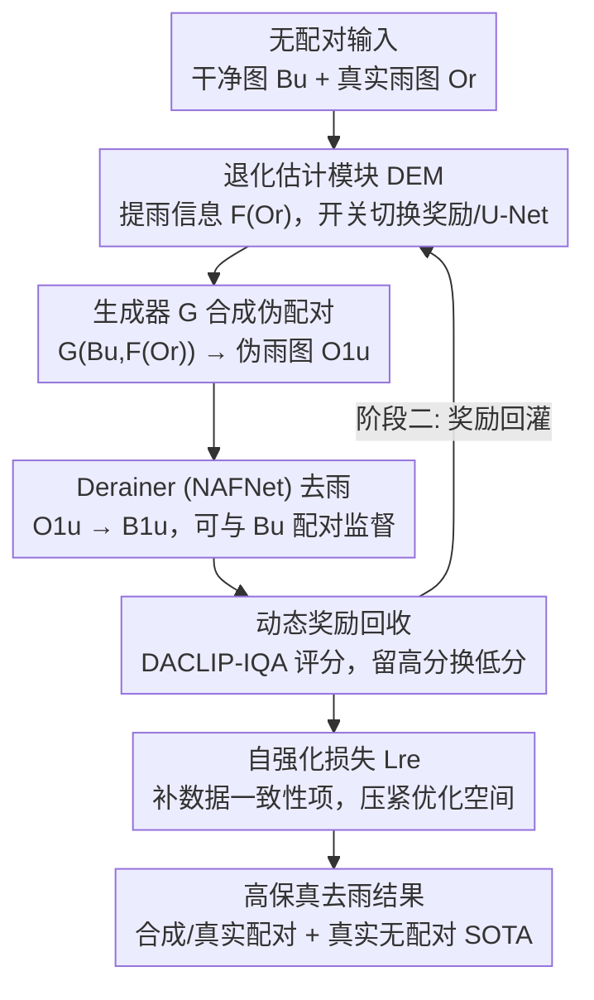

# Unpaired Image Deraining Using Reward-Guided Self-Reinforcement Strategy

**会议**: CVPR 2026  
**论文**: [CVF Open Access](https://openaccess.thecvf.com/content/CVPR2026/html/Chen_Unpaired_Image_Deraining_Using_Reward-Guided_Self-Reinforcement_Strategy_CVPR_2026_paper.html)  
**代码**: 无  
**领域**: 图像恢复 / 图像去雨  
**关键词**: 无监督去雨, 自强化, VLM-IQA, 奖励回收, 伪配对数据

## 一句话总结
针对无监督去雨缺乏配对监督、优化空间不受约束的问题，本文提出 RGSUD：在训练中用 VLM 感知质量评分（DACLIP-IQA）把偶尔冒出的高质量去雨结果"回收"成奖励，再用这些奖励同时改进伪配对数据合成、并构造一个充当数据一致性项的自强化损失，从而把优化空间压紧，在合成/真实配对和真实无配对数据上都取得无监督 SOTA。

## 研究背景与动机

**领域现状**：图像去雨分两条路。监督方法（MPRNet、Restormer、DRSformer、NeRD-Rain）靠"合成雨图—干净图"配对训练，指标很高；但配对数据多是人工合成的，真实雨的多样性远超合成分布，监督模型迁移到真实场景常常掉得很惨。无监督去雨直接从真实无配对的雨图/干净图里学雨的分布，泛化性更好，但训练难度大得多。

**现有痛点**：无监督去雨的核心困难是**两个域都没有显式约束**——你既没有"这张雨图对应的干净图长什么样"的监督，雨退化本身又千变万化，导致优化是"欠约束"的（under-constrained），网络很难收敛，结果忽好忽坏。已有无监督方法（CycleGAN 系、对比学习的 DCD-GAN/NLCL、通道一致性先验的 CSUD）主要靠各种正则项去约束，但和真实干净图的对齐始终是个老大难。

**核心矛盾**：无监督任务天然缺一个"数据一致性项"（data consistency term），也就是 MAP 框架里 $\|B-\mathcal{F}_\theta(O)\|^2$ 这一项——没有 ground truth 就写不出来。各方法只能堆正则（对抗损失等价于正则项），但正则给不出明确的优化轨迹，结果就是收敛慢、对齐差。

**切入角度**：作者从训练曲线里发现一个被忽视的现象（图 1a）——**无监督训练过程中会偶尔冒出质量很高的去雨结果**，只是它们转瞬即逝、没被利用。这些中间产物其实是一种隐式监督。问题是怎么可靠地识别"哪个中间结果是高质量的"？传统 PSNR 需要 GT 算不了，而图 1b 显示基于视觉语言模型的 DACLIP-IQA 能在无参考情况下给出和人眼一致、能区分退化/去净程度的感知分数。

**核心 idea**：把强化学习的"奖励引导策略"搬过来——用 VLM-IQA 当裁判，在训练中持续**回收**（recycle）评分最高的去雨结果作为奖励，再把奖励喂回优化过程：一路用它合成更真的伪配对数据，一路用它构造自强化损失补上缺失的数据一致性项，从而把优化空间"压紧"、推动收敛到高保真去雨结果。

## 方法详解

### 整体框架

RGSUD 是一个 GAN 式无配对去雨框架，由四个组件构成：**Derainer**（去雨器，用 NAFNet）、**DEM**（退化估计模块，一个 U-Net + 一个开关）、**生成器 G**（6 个残差块的 ResNet）、**判别器 D**（PatchGAN）。整条管线干的事是：拿无配对的干净图 $B_u$ 和真实雨图 $O_r$，先合成伪配对的雨图，再去雨、并用一个奖励池把训练中冒出来的好结果攒下来反哺训练。

数据流核心是 $B_u\in B \to O^1_u\in O \to B^1_u\in B$：生成器按真实雨图 $O_r$ 的雨信息把干净图 $B_u$ 变成雨图 $O^1_u$（即 $G(B_u, F(O_r))\to O^1_u$，$F(\cdot)$ 就是 DEM 提取的退化信息），再用 Derainer 把 $O^1_u$ 去雨回 $B^1_u$。这样 $(B_u, B^1_u)$ 就是一对伪配对，可以直接上 PSNR/SSIM 监督。

训练分两阶段：**阶段一**（黑色数据流）正常对抗训练，同时"Recycling"持续把高质量去雨结果攒进奖励池，此时奖励从反传图里 detach 掉、不参与梯度；DEM 的开关拨到黑色端点（走 U-Net 提雨信息）。**阶段二**（黑+橙数据流）在阶段一权重基础上引入自强化约束，DEM 开关拨到橙色端点——直接用奖励当干净特征，奖励也随训练动态更新，直到去雨性能不再提升。

### 关键设计

**1. 动态奖励回收机制：用 VLM-IQA 当无参考裁判，把训练中转瞬即逝的好结果攒成奖励池**

无监督训练没有 GT，PSNR 这类全参考指标算不了，所以根本没法判断"哪个中间去雨结果质量高、值得留下来"。本文利用预训练 VLM 的零样本 IQA 能力（DACLIP-IQA $\Psi(\cdot)$）来打感知分。具体流程（Algorithm 1）：对雨图数据集 $D_r=\{x_i\}$，每张图先过 Derainer 得到去雨结果 $x_i^{rec}=\mathrm{Der}(x_i)$，再分别对它和奖励池里对应的旧奖励 $x_i^r$ 打分 $z_{rec}=\Psi(x_i^{rec})$、$z_r=\Psi(x_i^r)$；若 $z_{rec}>z_r$ 就用新结果替换池里的旧奖励，否则保留旧的。这样奖励池里始终装着"到目前为止见过的最高质量去雨图"，且随训练动态刷新（图 2b 里 0.65/0.43 被 drop、0.88 替换 0.79 那一幕）。之所以选 DACLIP-IQA 而不是 MUSIQ/NIMA，是因为消融（表 7）显示它对去雨质量的判别最准、带来的 PSNR 最高——奖励质量直接决定整套机制的上限。

**2. 退化估计模块 DEM：用奖励当干净特征绕开 U-Net，拿到更准的雨信息去合成伪配对数据**

要把干净图 $B_u$ 染成雨图，得先知道"雨长什么样"。原始做法是把真实雨图 $O_r$ 喂进 DEM 里的 U-Net，先提一个干净特征、再用残差（雨图减干净特征）算出雨信息 $F(O_r)$。问题是 U-Net 提取的干净特征本身就不够准，雨信息也跟着不准，合成的伪雨图质量上不去。本文的关键一招是在阶段二把 DEM 的开关拨到奖励端点：**直接拿奖励池里的高质量去雨结果当"干净特征"**，绕过 U-Net。因为奖励是 NAFNet 去雨器产出的当前最优结果，恢复能力远强于 U-Net，用它做残差计算得到的雨信息更准，进而合成出更高质量的伪配对数据、再喂给损失式 (6) 提升去雨性能——奖励越准→雨信息越准→伪配对越好→去雨越强→奖励又更新得更好，形成一个稳定可靠的增益闭环（gain loop）。

**3. 自强化损失：把回收的奖励当作缺失的"数据一致性项"，给欠约束的优化补上明确轨迹**

这是补齐"无监督缺数据一致性"这个核心矛盾的设计。作者把监督去雨写成 MAP 问题 $\max_\theta p(\theta|O,B)\propto \max_\theta p(B|O,\theta)\cdot p(\theta)$，等价的最小化形式是

$$\arg\min_\theta \underbrace{\|B-\mathcal{F}_\theta(O)\|_F^2}_{\text{Data Consistency}}+\lambda\underbrace{P(\theta)}_{\text{Regularization}}$$

无监督任务里对抗损失可看作正则项 $P(\theta)$，但前面的数据一致性项因为没有 GT $B$ 而彻底缺席——这正是欠约束的根源。本文提出用回收到的奖励 $B_{rw}$ 来顶替这个缺失的干净参照：

$$\mathcal{L}_{re}=\|B_{rw}-B_r\|_F^2$$

把去雨输出 $B_r$ 直接往高质量奖励上拉。相比只靠正则的旧无监督方法，这一项给出了明确的优化轨迹和更高的保真度，确保恢复结果和干净分布精确对齐。总损失为两阶段损失之和 $\mathcal{L}_{total}=\mathcal{L}_{s1}+\lambda_2\mathcal{L}_{re}$，其中阶段一损失 $\mathcal{L}_{s1}=\min_G\max_D \mathcal{L}_{adv}+\lambda_1\mathcal{L}_{Der}$ 含四个对抗损失之和 $\mathcal{L}_{adv}$ 以及伪配对上的 $\mathcal{L}_{Der}=\mathcal{L}_{PSNR}(B_u,B_u^1)+\mathcal{L}_{SSIM}(B_u,B_u^1)$。

**4. 两阶段训练范式：先无监督攒奖励、再带约束自强化，避免冷启动时坏奖励污染优化**

奖励的质量决定一切，但训练初期去雨结果很烂、奖励不可靠，如果一上来就用它约束反而会带偏。所以作者把训练拆成"回收阶段"和"自强化阶段"：阶段一只做常规无配对对抗训练，奖励仅被 detach 地收集、不进梯度，让网络先把基础能力练起来、奖励池逐渐积累出好样本；阶段二才接上自强化损失、把 DEM 开关切到奖励端，让奖励真正参与梯度并随训练动态更新，直到性能饱和。这个先攒后用的次序保证了进入约束阶段时奖励已经足够好，闭环才转得起来——消融里 NLCL 因为初始去雨太差、奖励不可靠，SR 策略几乎没带来提升，正好反证了这一点。

### 损失函数 / 训练策略

PyTorch + 4×V100；Adam（$\beta_1=0.9,\beta_2=0.999$），初始学习率 $2\times10^{-4}$；训练图随机裁成 $256\times256$ 无配对 patch；权重 $\lambda_1=1.0$、$\lambda_2=0.8$。把 SR 策略当插件加到别的无监督方法上时，额外多训 3 小时即可。

## 实验关键数据

### 主实验

在 7 个配对数据集（合成 Rain100L/Rain200L/DID-Data/DDN-Data + 真实 SPA-Data/RealRain1K-L + 夜间 Night-Rain）用 PSNR/SSIM 对比。RGSUD 在多数数据集上显著超过其它无监督方法，对夜间数据集也有竞争力，部分指标甚至逼近监督方法。

| 数据集（PSNR↑/SSIM↑） | CSUD (CVPR25) | DCD-GAN | RGSUD (本文) | 对 CSUD 提升 |
|---|---|---|---|---|
| Rain100L | 33.28 / 0.954 | 31.82 / 0.941 | **34.41 / 0.967** | +1.13 dB |
| Rain200L | 33.31 / 0.959 | 31.37 / 0.934 | **33.89 / 0.961** | +0.58 dB |
| DDN-Data | 28.92 / 0.882 | 28.66 / 0.878 | **29.59 / 0.898** | +0.67 dB |
| SPA-Data（真实） | 34.78 / 0.949 | 34.16 / 0.943 | **35.50 / 0.957** | +0.72 dB |
| RealRain1K-L（真实） | 32.71 / 0.959 | 30.49 / 0.939 | **32.88 / 0.955** | +0.17 dB |
| Night-Rain | 29.90 / 0.879 | 28.68 / 0.867 | **30.54 / 0.897** | +0.64 dB |

在无参考感知指标（CLIP-IQA、MUSIQ、Q-Align、DeQA-Score）和真实无配对数据集（SIRR、Real3000）上，RGSUD 几乎全面领先其它无监督方法，DACLIP-IQA 分（越低越好）在 Real3000 上 0.018 vs CSUD 0.042，泛化性突出。

### 消融实验

| 配置 | Rain100L PSNR | RealRain1K-L PSNR | 说明 |
|---|---|---|---|
| w/o SR 策略（baseline） | 33.04 | 31.31 | 仅对抗+伪配对 |
| **w/ SR 策略（Full）** | **34.41 (+1.37)** | **32.88 (+1.57)** | 加奖励回收+自强化 |

| IQA 选择（表 7，Rain100L PSNR） | 分数 | 含义 |
|---|---|---|
| MUSIQ | 33.56 | 判别力一般 |
| CLIP-IQA | 33.67 | 略好 |
| **DACLIP-IQA** | **34.41** | 判别最准，最终选用 |

SR 策略作为插件加到其它去雨器/方法上同样有效：换 Derainer（表 5）在 NeRD-Rain 上 Rain200L +0.78 dB、DRSformer +0.69 dB、Restormer +0.42 dB；当插件加到 DCD-GAN/CSUD（表 6）Rain100L 分别 +0.41/+0.68 dB。

### 关键发现

- **SR 策略是涨点主力**：在 RealRain1K-L 上去掉它直接掉 1.57 dB，说明"回收奖励 + 自强化约束"对真实复杂雨的收益最大。
- **奖励裁判的选择很关键**：DACLIP-IQA 比 MUSIQ 高近 0.85 dB——奖励质量直接决定闭环上限，劣质 IQA 会带偏整套机制。
- **强可迁移性**：换不同去雨器（Restormer/DRSformer/NeRD-Rain/NAFNet）和不同无监督框架都能涨，证明 SR 策略是通用插件而非和某一网络绑定。
- **冷启动是软肋**：NLCL 因为初始去雨太差、奖励不可靠，SR 策略几乎不涨——奖励质量不达标时闭环转不起来。

## 亮点与洞察

- **把"训练中偶发的好结果"当作隐式监督来回收**，这个观察很巧：别人都在设计正则项硬约束，本文换个角度——好结果其实一直在出现，缺的只是一个能在无 GT 下识别它的裁判，而 VLM-IQA 正好补上了这块。
- **用 MAP 视角把缺失的数据一致性项形式化，再用奖励顶替**，把"为什么无监督难"讲成了一个清晰的数学缺项问题，自强化损失 $\|B_{rw}-B_r\|^2$ 是对这个缺项的直接补偿，逻辑闭环很干净。
- **DEM 用奖励替代 U-Net 特征**形成的增益闭环可迁移：任何"先估退化再合成数据"的无配对恢复任务（去雾、去噪、低光增强）都能套用"用当前最优输出当干净参照"的思路。
- **SR 策略是即插即用插件**，多训 3 小时就能给现成无监督方法涨点，工程价值高。

## 局限与展望

- 作者承认：初始去雨结果差时奖励不可靠，会直接拖累后续 SR 策略（NLCL 上几乎无提升）——方法依赖一个"够好的起点"，对极弱 baseline 不友好。
- 整套机制依赖 VLM-IQA（DACLIP-IQA）的感知评分质量，若 IQA 在某些退化/场景下失准，奖励会系统性偏差；消融也显示换差的 IQA 直接掉点。
- 奖励池需为每张训练样本维护并反复打分，训练开销和显存会随数据规模上升；论文未给出大规模数据集上的效率分析。
- 主要验证在去雨任务，虽宣称对"先估退化再合成"的范式通用，但跨退化类型（去雾/去噪混合退化）的实证仍待补。

## 相关工作与启发

- **vs CSUD (CVPR2025)**：CSUD 用通道一致性先验做无监督约束，本文用 VLM-IQA 回收奖励 + 自强化损失，区别在于本文显式补上了缺失的数据一致性项而非纯先验/正则，多数据集 PSNR 领先约 0.6–1.1 dB。
- **vs DCD-GAN / NLCL (CVPR2022)**：它们从特征空间用对比学习压紧优化空间，本文从感知奖励 + 伪配对数据两路同时压紧；且 SR 策略可反向加到它们身上还能再涨点。
- **vs CycleGAN 系无监督去雨**：本文同样是 GAN 式合成伪配对，但额外引入"动态奖励 → 更准雨信息 → 更好伪配对"的增益闭环，跳出了纯循环一致性的约束。
- **vs VLM-IQA for Restoration（AutoDIR、CLIP 去噪等）**：前人多把 VLM 知识用于监督/自动化恢复，本文首次把 VLM-IQA 当作无监督去雨训练中的动态奖励来源。

## 评分
- 新颖性: ⭐⭐⭐⭐⭐ 把 RL 奖励思想 + VLM-IQA 引入无监督去雨，并用 MAP 视角把奖励解释为缺失的数据一致性项，角度新且自洽
- 实验充分度: ⭐⭐⭐⭐⭐ 7 配对 + 2 无配对数据集、多种 IQA、换去雨器/换框架的可迁移性、插件实验、下游任务都覆盖了
- 写作质量: ⭐⭐⭐⭐ 动机—机制—公式链条清楚，图 1/图 2 配合好；个别符号（$B_r/B_{rw}$）略密
- 价值: ⭐⭐⭐⭐⭐ SR 策略即插即用、对真实复杂雨收益最大，对整个无监督恢复方向有借鉴意义

<!-- RELATED:START -->

## 相关论文

- [\[CVPR 2026\] RL-ScanIQA: Reinforcement-Learned Scanpaths for Blind 360deg Image Quality Assessment](rl-scaniqa_reinforcement-learned_scanpaths_for_blind_360deg_image_quality_assess.md)
- [\[CVPR 2026\] UniRain: Unified Image Deraining with RAG-based Dataset Distillation and Multi-objective Reweighted Optimization](unirain_unified_image_deraining_rag_dataset_distillation.md)
- [\[CVPR 2026\] ReasonX: MLLM-Guided Intrinsic Image Decomposition](reasonx_mllm-guided_intrinsic_image_decomposition.md)
- [\[CVPR 2026\] FinPercep-RM: A Fine-grained Reward Model and Co-evolutionary Curriculum for RL-based Real-world Super-Resolution](finpercep_rm_a_fine_grained_reward_model_and_co_evolutionary_curriculum_for_rl_ba.md)
- [\[ICCV 2025\] Blind Noisy Image Deblurring Using Residual Guidance Strategy](../../ICCV2025/image_restoration/blind_noisy_image_deblurring_using_residual_guidance_strateg.md)

<!-- RELATED:END -->
