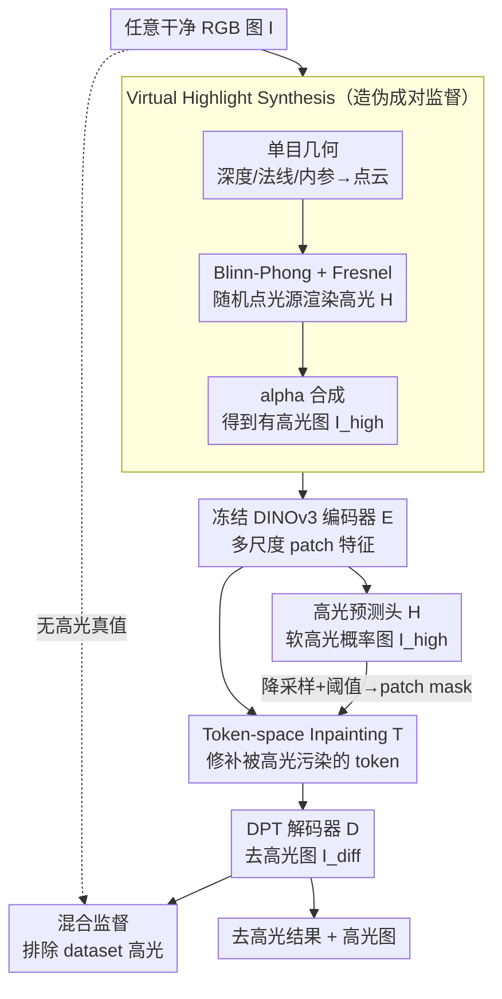

# UnReflectAnything: RGB-Only Highlight Removal by Rendering Synthetic Specular Supervision

**会议**: CVPR 2026  
**论文**: [CVF Open Access](https://openaccess.thecvf.com/content/CVPR2026/html/Rota_UnReflectAnything_RGB-Only_Highlight_Removal_by_Rendering_Synthetic_Specular_Supervision_CVPR_2026_paper.html)  
**代码**: https://alberto-rota.github.io/UnReflectAnything （项目页）  
**领域**: 图像恢复 / 高光去除  
**关键词**: 高光去除, 镜面反射, 合成监督, Token-space inpainting, 内窥镜图像

## 一句话总结
用单目几何 + Blinn-Phong/Fresnel 渲染在任意 RGB 图上"凭空"造出物理合理的合成高光，从而无需成对数据就能训练；模型在 DINOv3 特征空间里把高光遮挡的 token 修补回扩散反射的样子，再解码成去高光图像，在自然与手术（内窥镜）多个数据集上取得有竞争力到 SOTA 的结果。

## 研究背景与动机
**领域现状**：单图镜面高光去除（specular highlight removal）是个老问题。经典方法靠颜色先验、颜色比、二色反射（dichromatic）模型去分离漫反射与镜面分量；近年的学习方法（HighlightNet、SpecularityNet、DHAN-SHR、StableDelight 等）直接从数据里学漫反射-镜面的分离。还有一类靠偏振相机/多闪光等专用硬件物理地拆开两种反射。

**现有痛点**：高光去除本质是病态问题——镜面分量饱和（像素被打到白）、空间稀疏、且和几何/材质/光照纠缠在一起。学习方法最大的瓶颈是**缺成对监督数据**：很难拿到"同一场景有高光 / 无高光"的配对图，尤其内窥镜手术场景里组织湿润、强非均匀光照会产生大面积强高光，根本不存在公开的成对无反射真值。结果是合成训练到真实/医学域有 domain shift，常在高光边界处过平滑或色调失真。偏振方法虽好，但要专用传感器，实用性差。

**核心矛盾**：要监督就得有成对数据，但成对数据在真实尤其医学域几乎拿不到——这是"想学却没标签"的死结。

**本文目标**：(1) 不依赖任何成对数据、不依赖偏振硬件，只用 RGB 单图就能去高光；(2) 跨自然和手术两个差异极大的域都能泛化。

**切入角度**：既然拿不到真实成对数据，那就**在任意一张干净 RGB 图上把高光"渲染"上去**——只要渲染得物理合理，那张原图天然就是它的无高光真值，配对问题迎刃而解。关键观察是：高光的形状完全由几何（法线、视角、光源）决定，而单目几何估计如今已足够好，可以从单张图反推出深度/法线/相机内参，进而驱动一个物理着色模型生成可信的镜面反射。

**核心 idea**：用"单目几何 + Blinn-Phong/Fresnel 着色 + 随机光照"渲染合成高光来制造伪成对监督，再在 DINOv3 token 空间做 inpainting 把被高光污染的特征补回干净的扩散反射。

## 方法详解

### 整体框架
方法由两条线组成。**离线监督生成线**：拿任意一张 RGB 图 $I$，用单目几何网络估出深度、法线、内参，反投影成带法线的 3D 点云，在相机坐标里随机采一个点光源，用 Blinn-Phong + Schlick-Fresnel 渲染出一张高光强度图 $H$，再 alpha-composite 到原图上得到"有高光"的 $I_{high}$。于是 $(I_{high} \to I)$ 就是一对训练样本，$I$ 是无高光真值。**前向去高光线**：模型 $M$ 输入一张真实 RGB 图，冻结的 DINOv3 编码器 $E$ 抽多尺度 patch 特征；轻量的高光预测头 $H$ 回归一张连续高光概率图 $I_{high}$，把它降采样、阈值化后作为 patch mask；token inpainter $T$ 在特征空间里把被 mask 掉的 token 修补成干净的扩散反射特征；最后 DPT 解码器 $D$ 把修补后的多尺度特征解码成去高光图 $I_{diff}$。形式上 $I_{high}=H(E(I))$，$I_{diff}=D(T(E(I), I_{high}))$。

### 关键设计

**1. Virtual Highlight Synthesis：在任意 RGB 图上渲染物理合理的高光，把"无成对数据"变成"无限成对数据"**

这是全文的命门。既然真实成对数据拿不到，作者反过来用几何把高光"画上去"。给定单图 $I$，先用现成单目几何网络（MoGe-2）估出度量深度 $D$、法线 $n$、内参 $K$，对每个像素 $p=(u,v,1)^\top$ 反投影到相机坐标 $X = D(p)\,K^{-1}p$，得到带法线的 3D 点云。在相机坐标里随机采一个**点光源** $L$（而非平行光，因为内窥镜光源就在近处，需要捕捉距离衰减和局部高光），定义视线与光线方向 $\mathbf{v}=\frac{\mathbf{X}}{\|\mathbf{X}\|},\ \mathbf{l}=\frac{\mathbf{L}-\mathbf{X}}{\|\mathbf{L}-\mathbf{X}\|}$。取半角向量 $\mathbf{h}=\frac{\mathbf{l}+\mathbf{v}}{\|\mathbf{l}+\mathbf{v}\|}$，用 Schlick-Fresnel 算反射系数 $R=R_0+(1-R_0)(1-\mathbf{v}\cdot\mathbf{h})^5$，再用 Blinn-Phong 算逐像素高光强度

$$\mathbf{H}=K_H\,R\,(\mathbf{n}\cdot\mathbf{h})^S,$$

其中 $K_H$ 控整体强度、$S$ 控表面光泽度。训练时 $K_H$、$S$、光源位置 $L$ 都从经验调好的均匀分布里随机采样，制造高光样式的多样性。最后把渲染的高光以加性 alpha 掩码合成进原图：$I_{high}=(1-\mathbf{H})\,\mathbf{I}+\mathbf{H}\,(\mathbf{I}+K_H\,\mathbf{1}_3)$。因为高光形状被真实几何约束，渲染结果在结构上是自洽的，配上原图就是物理可信的伪成对样本——这正是绕开成对数据稀缺的关键。

**2. Token-space 扩散反射 inpainting：把"去高光"重述成特征空间的图像补全**

高光像素是饱和、被裁剪掉的，原始 RGB 里信息已经丢了，直接在像素空间硬填容易过平滑或编造。作者把它搬到 DINOv3 的 token 特征空间做 inpainting：DINOv3-Large 在 4 个深度抽出多尺度 token $\mathcal{F}=\{F_1,...,F_4\}$，高光预测头给出的 $I_{high}$ 经平均池化降到 patch 分辨率并按 mean 强度阈值化，得到 patch mask $P$。要被修补的 token 先替换成可学习的 mask token $f_{mask}$，并与可见邻域算出的局部均值先验 $F_{mean}$（深度卷积做通道维邻域平均）按系数 $\lambda$ 混合，再加上固定 2D 位置编码：

$$F_{seed}=P\odot[\lambda f_{mask}+(1-\lambda)F_{mean}]+(1-P)\odot F+E_{pos}.$$

mask token 给"缺失内容"一个语义占位符而不是默认填零；位置编码是**相加**（遵循 ViT 惯例）以恢复 token 替换后丢失的空间感知。$F_{seed}$ 过六层 ViT 做可见与被 mask token 之间的自注意力，最后把修补的和原可见 token 拼回：$F_{comp}=P\odot\text{ViT}(F_{seed})+(1-P)\odot F$。在特征空间做让模型能借助全局语义上下文补出连贯的扩散反射外观，再交给 $D$ 解码成图，比纯像素 inpainting 更稳。

**3. 排除"dataset 高光"的混合监督：别把真高光当成白色漫反射来学**

一个隐患是：用来合成的原图 $I$ 自己并非真无高光，尤其内窥镜图本身就布满真实高光（作者称之为 **dataset highlights**，区别于自己渲染的 synthetic highlights）。若把这些饱和像素当成"干净真值"去监督，会误导网络把高光当成白色漫反射表面。作者用高亮度阈值 $\tau_L$（取 0.95，偏保守）检测出 dataset 高光，构造两套 mask：监督 mask $m_{sup}$ 标出真值可信（无 dataset 高光）的像素，hole mask $m_{hole}$ 标出所有要被 inpaint 的区域（synthetic 与 dataset 高光的并集）。Token 监督只在二者交集 $\mathcal{M}=M_{hole}\cap M_{sup}$ 上施加（既要被修补、又有可信真值），真值 token 取自加高光前的原始干净图 $F^*=E(I)$，损失用 cosine 相似度 + L1：

$$\mathcal{L}_{inp}=\frac{1}{|\mathcal{M}|}\sum_{i\in\mathcal{M}}\big[\alpha\|F^*_i-F_i\|_1+(1-\alpha)(1-F_i^{*}F_i^{\top})\big].$$

高光头 $H$ 用 soft Dice + L1 + TV 的加权和训练（Dice 应对高光只占小面积的类不平衡，TV 抑噪）。解码器 $D$ 先以自编码方式（L1 + SSIM）预训练，让冻结 DINOv3 特征到 RGB 的映射稳定；再微调时加三项：seam 损失只在 inpaint 边界细环 $r=\text{dilate}(m_{hole})-m_{hole}$ 上约束颜色与梯度连续以消接缝；spec 损失用 Charbonnier 惩罚 $I_{diff}$ 里过亮像素防止重新冒出镜面峰；以及重提的 RGB 重建损失（排除 dataset 高光）。这套"造监督 + 排除不可信像素"的组合，正是它能跨自然/手术域都稳的原因。

### 损失函数 / 训练策略
- 高光头：$\mathcal{L}_H=w_{dice}\mathcal{L}_{dice}+w_{L1}\mathcal{L}_{L1}+w_{TV}\mathcal{L}_{TV}$。
- Token inpainting：式 (8)，$\alpha=0.25$。
- 解码器预训练（自编码）：$\mathcal{L}_{AE}=\|D(E(I))-I\|_1+(1-\text{SSIM})$。
- 解码器微调：seam + spec(Charbonnier) + RGB 重建，三项联合。
- 超参：$R_0=0.04$，$\tau_L=0.95$，$\lambda=0.5$，$\alpha=0.25$，$\tau_m=0.85$，$\epsilon=10^{-6}$。深度用 MoGe-2，$H$/$D$ 用 DPT，inpainter 用 6 层 ViT。1×A100(80G)，batch 32，50 epoch，初始 lr $5\times10^{-4}$ 每 10 epoch 线性衰减。

## 实验关键数据

### 主实验
覆盖室内（SCRREAM、HouseCat6D）、室外（CroMo）、内窥镜（SCARED、Cholec80、StereoMIS）多域，按是否有漫反射真值分两组评测。

有成对真值（PSD/SHIQ/SSHR），全参考指标（节选）：

| 数据集 | 指标 | 本文 | DHAN-SHR | SpecularityNet |
|--------|------|------|----------|----------------|
| PSD | SSIM ↑ | **0.911** | 0.868 | 0.839 |
| PSD | MSEm ↓ | **0.004** | 0.006 | 0.007 |
| SHIQ | SSIM ↑ | **0.988** | 0.982 | 0.961 |
| SSHR | SSIM ↑ | **0.971** | 0.971 | 0.952 |

本文在结构相似度 SSIM 上普遍最优（最能保结构、抑残留高光），但作者诚实指出：在 SHIQ/SSHR 上经典 baseline 的 MSEm/PSNR 更低，自家 PSNR 反而偏低，说明它在非高光区域的细节保真上不如人——"全局误差更低但细节略弱"。

无成对真值数据集，用 LSR（亮度抑制比，越低越好）+ NIQE（自然度，越低越好），节选：

| 域 | 数据集 | 指标 | 本文 | 次优 |
|----|--------|------|------|------|
| 自然 | CroMo | LSR ↓ | **0.012** | 0.028 (EndoSTTN) |
| 自然 | SCRREAM | LSR ↓ | **0.002** | 0.039 (EndoSTTN) |
| 手术 | Cholec80 | LSR ↓ | **0.002** | 0.021 (EndoSTTN) |
| 手术 | StereoMIS | LSR ↓ | **0.022** | 0.052 (EndoSTTN) |

在自然与手术两域的 LSR 上几乎全面领先（高光抑制最干净），NIQE 与最好 baseline 相当或更优——说明抑制高光的同时没把整图压暗或破坏自然统计。

下游验证（相对位姿估计，DISK+LightGlue+MAGSAC++，对极误差 $E_{ep}$↓ / 内点率 IR↑）：本文在 CroMo 取得 SOTA $E_{ep}=0.301$、IR=0.997；手术域优势更一致，StereoMIS 上 $E_{ep}=0.167$、IR=1.000 均领先。说明去高光确实能改善关键点定位与几何对齐，在临床光照下尤其有用。

### 消融实验
> ⚠️ 论文正文未给独立的模块消融表（损失权重/调度细节移到了 Supp. Mat.），下表为根据正文 Discussion 与设计动机整理的"去掉/改动某设计的后果"定性说明，非论文数值消融。

| 配置 | 后果 | 说明 |
|------|------|------|
| 不排除 dataset 高光 | 模型把饱和高光误学成白色漫反射 | $\tau_L$ 检测 + 监督 mask 排除是关键 |
| Token mask 改软掩码 | 软高光区只被弱修改、常去不干净 | 正文明确：inpainter 强依赖二值 mask，软掩码对低梯度渐变高光失效 |
| 用平行光替代点光源 | 失去距离衰减/局部高光，内窥镜场景失真 | 点光源是为近距离手术照明设计 |

### 关键发现
- 设计上**偏保守重建、拒绝幻觉**：前馈架构而非扩散，宁可少改也不乱编——这在"保真至上"的医学场景是优点，且比扩散方法更易实时部署。
- 跨域泛化主要来自合成监督而非真实标注：同一套渲染管线让自然图和内窥镜图都拿到物理可信的伪成对样本。
- token inpainter 对二值高光 mask 依赖很强，是当前最明显的脆弱点。

## 亮点与洞察
- **"造监督"思路可迁移**：把"缺成对数据"的退化任务（去雨/去反光/去阴影等）重述为"在干净图上物理渲染退化"，只要退化形状由可估的几何/物理决定，就能凭空造无限成对样本——这套范式比 CycleGAN 类无配对对抗更可控。
- **在特征空间做 inpainting** 而非像素空间，借 DINOv3 的语义上下文补饱和丢失区，避免像素硬填的过平滑，是值得复用的 trick。
- **dataset highlight 的显式排除**点破了一个易被忽视的坑：用"自带高光的图"当无高光真值会自我污染，保守阈值 + 监督 mask 把训练信号导向高置信 patch。

## 局限与展望
- 作者承认：对透明/折射物体不可靠（漫反射与镜面难分）；可能在非高光区降低结构或分辨率（缺显式边缘/高频先验）；训练时高光监督靠 ad hoc 硬阈值、主要吃亮度线索，缺语义推理。
- token inpainter 强依赖二值高光 mask，对渐变低梯度高光（软掩码）常去不掉——这是最实在的失败模式。
- 自评：在 SHIQ/SSHR 上 PSNR 偏低，说明非高光区细节保真不足，"全局误差低但局部细节弱"。
- 改进思路：放松对亮度线索的依赖（训练与推理都引入语义/几何先验），加显式边缘约束或高频先验改善细节。

## 相关工作与启发
- **vs DHAN-SHR / SpecularityNet（学习式去高光）**：它们靠成对/偏振监督直接学分离，本文不要成对数据、用渲染造监督，SSIM 上更稳、跨手术域泛化更好，但单点 PSNR/细节略逊。
- **vs StableDelight（扩散式去反光）**：扩散方法常留残光、或把手术整帧过度压暗、引入局部结构不一致；本文前馈保守重建更保真、更易实时，适合医学。
- **vs PolarAnything / PolarFree（偏振先验）**：它们需偏振输入或合成偏振线索，本文纯 RGB 单图、无额外传感/标定需求，实用性更强。
- **vs Endo-STTN（内窥镜时序去高光）**：Endo-STTN 要二值高光 mask 作显式查询且靠时序传播，本文单图即可、mask 自己预测。

## 评分
- 新颖性: ⭐⭐⭐⭐⭐ 用几何驱动的物理渲染造伪成对监督，干净绕开成对数据稀缺，思路漂亮且可迁移。
- 实验充分度: ⭐⭐⭐⭐ 多域多数据集 + 下游位姿任务都验证了，但正文缺独立模块消融表（移到了补充材料）。
- 写作质量: ⭐⭐⭐⭐ 动机-管线-公式交代清楚，且诚实标注自家弱项（PSNR/软掩码失败）。
- 价值: ⭐⭐⭐⭐ 对内窥镜等"无成对真值"场景有实用价值，去高光还能提升下游几何估计。

<!-- RELATED:START -->

## 相关论文

- [\[CVPR 2026\] Beyond the Ground Truth: Enhanced Supervision for Image Restoration](beyond_the_ground_truth_enhanced_supervision_for_image_restoration.md)
- [\[CVPR 2026\] Flickerformer: A Duet of Periodicity and Directionality for Burst Flicker Removal](it_takes_two_a_duet_of_periodicity_and_directionality_for_burst_flicker_removal.md)
- [\[CVPR 2026\] GFRRN: Explore the Gaps in Single Image Reflection Removal](gfrrn_explore_the_gaps_in_single_image_reflection_removal.md)
- [\[CVPR 2026\] UniSER: A Foundation Model for Unified Soft Effects Removal](uniser_a_foundation_model_for_unified_soft_effects_removal.md)
- [\[CVPR 2026\] LightRR: A Lightweight Network for Single Image Reflection Removal](lightrr_a_lightweight_network_for_single_image_reflection_removal.md)

<!-- RELATED:END -->
