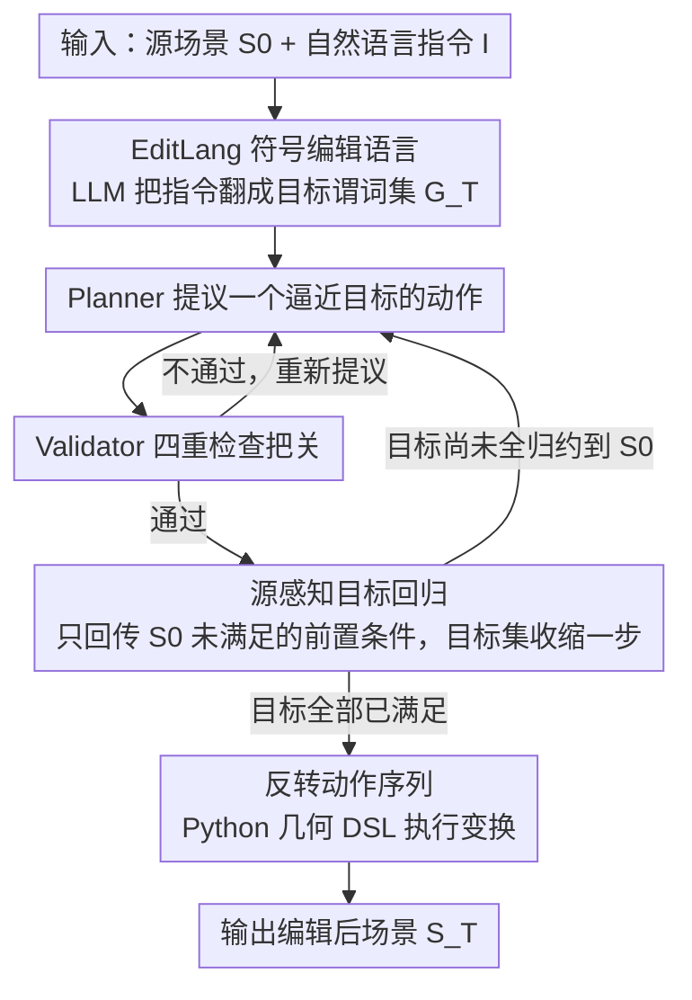

# Edit-As-Act: Goal-Regressive Planning for Open-Vocabulary 3D Indoor Scene Editing

**会议**: CVPR 2026  
**arXiv**: [2603.17583](https://arxiv.org/abs/2603.17583)  
**代码**: [GitHub](https://seongraenoh.github.io/edit-as-act/)  
**领域**: 可解释性  
**关键词**: 3D scene editing, goal regression, PDDL, LLM planning, symbolic reasoning

## 一句话总结
将开放词汇的3D室内场景编辑重新定义为目标回归规划问题，设计PDDL风格的EditLang符号语言，通过LLM驱动的Planner-Validator循环从目标状态逆向推导最小编辑序列，在63个编辑任务上同时实现指令忠实度（69.1%）、语义一致性（86.6%）和物理合理性（91.7%）三个指标的最佳平衡。

## 研究背景与动机

**领域现状**：3D室内场景编辑有三类主流方法——数据驱动的布局生成（DiffuScene/EditRoom用扩散模型）、约束优化（Holodeck/AnyHome将语言转为空间约束再求解）、图像编辑+3D提升（ArtiScene先在2D编辑再重建3D）。

**现有痛点**：三类方法各自只能满足三个关键需求中的部分——指令忠实度、语义一致性（不动不该动的部分）、物理合理性（无碰撞/无悬浮）。布局生成方法容易全局改变场景；约束优化可能大范围重优化导致非目标物体移位；图像编辑缺乏3D推理，产生结构伪影。

**核心矛盾**：现有方法将编辑视为生成任务（一步前向输出整个场景），但这使得"只改需要改的、保留其余部分"变得极难保证。

**本文目标**：同时实现指令忠实、语义一致和物理合理的3D场景编辑。

**切入角度**：受embodied agent和经典AI规划启发，将编辑视为目标满足问题——"用户指令定义了一个期望的世界状态，编辑应该是使该状态成立的最小动作序列"。从目标逆向推导到当前场景，天然保证最小化编辑。

**核心 idea**：把场景编辑从"生成问题"转变为"规划问题"，用STRIPS风格的目标回归确保编辑的最小性、可验证性和物理一致性。

## 方法详解

### 整体框架
方法要解决的核心问题是：用户只想改场景里该改的部分，却又得保证物理合理。Edit-As-Act 的做法是不把编辑当成"生成一整个新场景"，而是当成一段从期望状态倒推回来的动作序列。给定源场景 $S_0$ 和自然语言指令 $I$，系统先让 LLM 把指令翻译成 EditLang 符号目标谓词集 $G_T$（"用户想要的世界长什么样"），再进入 Planner-Validator 循环：Planner 不断提出一个能逼近当前目标的动作，Validator 用四条标准把关，通过后用源感知回归把目标集往源场景方向收缩一步。当目标全部归约到 $S_0$ 已满足时停止，把这串逆推出来的动作反转过来，交给 Python 几何 DSL 真正执行变换，得到 $S_T$。整条链路里 LLM 只负责"提议"，是否采纳由形式化规则决定。

### 关键设计

**1. EditLang 符号编辑语言：把自由文本编辑落到可验证的符号空间**

前向生成方法之所以难保证"只动该动的"，根子在于它们直接在像素或布局上操作，没有一个能被检查的中间表示。EditLang 借 PDDL 的思路给场景编辑建了一套领域：谓词刻画几何/拓扑/物理关系，如 `supported(x,y)`、`contact(x,y)`、`collision(x,y)`、`stable(x)`、`facing(x,y)`；每个动作写成三元组 $\langle \text{pre}(a), \text{add}(a), \text{del}(a) \rangle$，前置条件、新增事实、删除事实一目了然，状态按 $s' = (s \setminus \text{del}(a)) \cup \text{add}(a)$ 转移。动作覆盖几何重排、物体添加（Add）、外观修改（Stylize）三类。

与传统 PDDL 把符号写死不同，EditLang 在解析时把谓词动态绑定到场景里的具体物体，因此能处理开放词汇的指令而不需预定义实体表。一旦编辑被表达成这种符号动作，它就天然可验证、可解释、可组合——后面 Validator 的所有检查都建立在这层表示之上。

**2. 源感知目标回归：只为没满足的条件付出编辑代价**

经典 STRIPS 回归会从目标一路往回展开所有前置条件，哪怕这些条件在当前场景里早已成立，于是规划器会"重建"本来就对的部分，这正是过度编辑的来源。本文把回归式改成源感知版本：

$$G_{t-1} = (G_t \setminus \text{add}(a_t)) \cup (\text{pre}(a_t) \setminus S_0)$$

关键在 $\text{pre}(a_t) \setminus S_0$ 这一项——只有在源场景 $S_0$ 中尚未满足的前置条件才会被回传到上一层目标继续规划，已经成立的条件直接跳过、不再产生动作。这一个小改动让目标集随每步真正在收缩，编辑序列因此被压到最小，从机制上拿到了前向生成给不了的"最小性"保证。

**3. Planner-Validator 双模块：LLM 提议，形式规则兜底**

LLM 提出的动作不一定正确，也可能撤销已经达成的目标，所以单靠 Planner 不可靠。Validator 在每一步对 Planner 的提议做四重检查：目标导向性要求 $\text{add}(a_t)$ 至少满足 $G_t$ 里的一个目标，杜绝无关动作；单调性要求 $\text{del}(a_t) \cap G^{\text{sat}}_{\leq t} = \emptyset$，即不能删掉此前已经满足的目标，防止规划反复横跳；上下文一致性确保编辑结果符合房间特定约束；形式合法性确保动作符合 EditLang schema。Validator 同时维护领域不变量（无碰撞、单一支撑面等）。

这种"LLM 提议 + 形式验证"的分工不仅挡住了错误动作，还顺带给了终止性保证：单调性意味着已满足目标只增不减，加上状态空间有限，规划循环必然在有限步内收敛，不会陷入死循环。

### 一个完整示例：把椅子搬到桌子旁
以指令"把椅子移到餐桌边"为例。LLM 先把它翻成目标谓词 $G_T = \{\,\text{contact(chair, table)},\ \text{facing(chair, table)},\ \neg\text{collision(chair, *)}\,\}$。Planner 提议动作 `Move(chair → beside table)`，其 $\text{pre}$ 包含 `stable(chair)`、`clear(target_region)`。源感知回归一查：`stable(chair)` 在 $S_0$ 里已成立，于是被 $\setminus S_0$ 滤掉、不再生成额外动作；只有 `clear(target_region)` 没满足（桌边有个挡路的垃圾桶），被回传成上一层目标，触发第二个动作 `Move(bin → corner)`。两个动作回归到 $S_0$ 全满足后停止。Validator 逐一放行：移椅子满足 `contact`/`facing`（目标导向），不删除任何已达成目标（单调），无碰撞（一致）。最后把逆推出的序列反转执行——先挪垃圾桶、再挪椅子——餐桌区域和其余家具完全没被动过。对比前向生成方法可能顺手重排整个房间，这里只落下两个动作。

### 损失函数 / 训练策略
本方法完全基于 LLM 推理，无需训练。Planner 和 Validator 都由 LLM（如 GPT-4）通过 prompting 驱动；每步执行后都重新从几何重新计算谓词，确保符号状态与真实 3D 场景始终同步，避免符号层与几何层漂移。

## 实验关键数据

### 主实验

**E2A-Bench 9个场景类别平均**

| 方法 | 指令忠实度(IF)↑ | 语义一致性(SC)↑ | 物理合理性(PP)↑ |
|------|---------------|---------------|---------------|
| LayoutGPT-E | 42.3 | 48.8 | 78.6 |
| AnyHome | 57.6 | 60.5 | 84.5 |
| ArtiScene-E | 48.3 | 51.2 | 90.3 |
| **Edit-As-Act** | **69.1** | **86.6** | **91.7** |

### 消融实验

| 场景类别 | IF | SC | PP | 说明 |
|---------|-----|-----|-----|------|
| Dining Room | 89.7 | 95.3 | 92.7 | 最佳场景，结构化程度高 |
| Kitchen | 55.0 | 92.3 | 93.7 | IF较低但SC/PP很高 |
| Bedroom | 45.7 | 73.1 | 91.9 | 布局灵活性大导致IF较低 |
| Computer Room | 73.6 | 88.0 | 94.1 | 物品关系明确 |

### 关键发现
- Edit-As-Act是唯一在IF/SC/PP三个指标上都表现最好的方法（其他方法只能在1-2个指标上有优势）
- 语义一致性（86.6%）远超第二名AnyHome（60.5%），说明目标回归的最小化编辑策略非常有效
- 在结构化场景（餐厅、计算机房）中表现最佳，在布局灵活的场景（卧室）中IF较弱——说明符号规划在约束明确时优势更大
- 物理合理性（91.7%）略优于ArtiScene-E（90.3%），因为编辑动作的前置条件显式检查碰撞和支撑

## 亮点与洞察
- **范式转换**：将3D编辑从"生成问题"转为"规划问题"是根本性的视角转变——一旦有了结构化的动作空间和目标回归，编辑的最小性、可验证性、可组合性自然成立
- **把LLM当规划器而非生成器**：不让LLM直接输出编辑结果，而是让它在符号空间中提出动作，由形式化Validator检查——这种"LLM提议+形式验证"的架构可以推广到很多LLM应用场景
- **源感知回归**：相比经典STRIPS的一个小但关键的改进——自动过滤已满足条件，避免不必要的推理和编辑

## 局限与展望
- 完全依赖LLM的推理能力，对于非常复杂的多步编辑可能会出现规划错误
- E2A-Bench仅63个任务，规模较小，且评估主要依赖LVLM打分
- EditLang的谓词集虽然覆盖主要关系，但对于更精细的空间关系（如"距墙50cm"）表达力有限
- 不支持连续优化（如"让房间看起来更宽敞"这类模糊指令）

## 相关工作与启发
- **vs LayoutGPT**: LayoutGPT直接用LLM前向生成布局，缺乏验证机制，IF=42.3远低于本文69.1
- **vs AnyHome**: 约束优化方法在物理合理性上较好(84.5)但语义一致性差(60.5)——因为重优化会移动非目标物体
- **vs ArtiScene**: 图像编辑+3D提升在PP上不错(90.3)但IF(48.3)和SC(51.2)都弱——2D操作无法保证3D一致性

## 评分
- 新颖性: ⭐⭐⭐⭐⭐ 将经典AI规划（STRIPS/PDDL）引入3D场景编辑是非常有创意的范式转换
- 实验充分度: ⭐⭐⭐ benchmark规模偏小（63任务），评估依赖LVLM
- 写作质量: ⭐⭐⭐⭐⭐ 问题动机、形式化定义、方法设计层层递进，非常清晰
- 价值: ⭐⭐⭐⭐ LLM+符号规划的组合对embodied AI有重要启发

<!-- RELATED:START -->

## 相关论文

- [\[ICML 2026\] A Behavioural and Representational Evaluation of Goal-Directedness in Language Model Agents](../../ICML2026/interpretability/a_behavioural_and_representational_evaluation_of_goal-directedness_in_language_m.md)
- [\[ICLR 2026\] PoSh: Using Scene Graphs to Guide LLMs-as-a-Judge for Detailed Image Descriptions](../../ICLR2026/interpretability/posh_using_scene_graphs_to_guide_llms-as-a-judge_for_detailed_image_descriptions.md)
- [\[ICLR 2026\] Internal Planning in Language Models: Characterizing Horizon and Branch Awareness](../../ICLR2026/interpretability/internal_planning_in_language_models_characterizing_horizon_and_branch_awareness.md)
- [\[NeurIPS 2025\] Evaluating LLMs in Open-Source Games](../../NeurIPS2025/interpretability/evaluating_llms_in_open-source_games.md)
- [\[CVPR 2025\] Sample- and Parameter-Efficient Auto-Regressive Image Models](../../CVPR2025/interpretability/sample-_and_parameter-efficient_auto-regressive_image_models.md)

<!-- RELATED:END -->
