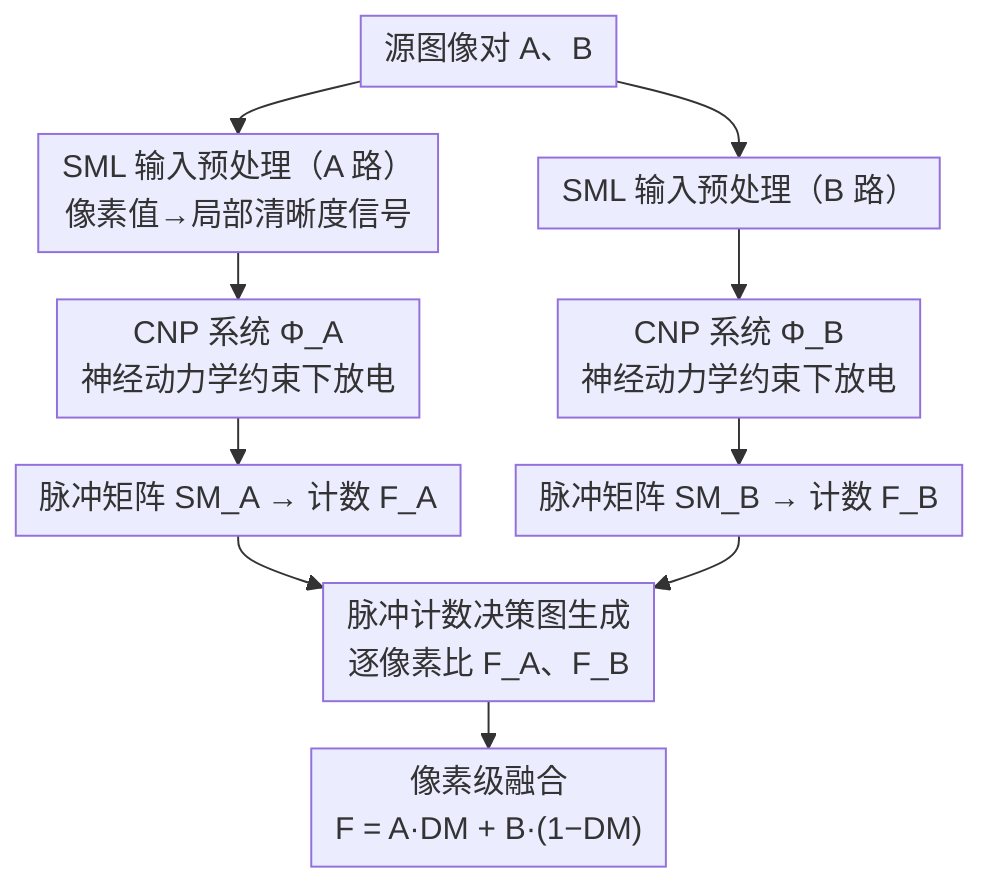

# Neurodynamics-Driven Coupled Neural P Systems for Multi-Focus Image Fusion

**会议**: CVPR 2026  
**arXiv**: [2509.17704](https://arxiv.org/abs/2509.17704)  
**代码**: [MorvanLi/ND-CNPFuse](https://github.com/MorvanLi/ND-CNPFuse)  
**领域**: 可解释性  
**关键词**: 多焦点图像融合, 耦合神经P系统, 神经动力学, 决策图, 脉冲机制

## 一句话总结

提出 ND-CNPFuse，通过对耦合神经 P (CNP) 系统进行神经动力学分析，建立网络参数与输入信号的约束关系以避免神经元异常持续放电，从而在多焦点图像融合 (MFIF) 任务上无需训练即可生成高质量、可解释的决策图。

## 研究背景与动机

多焦点图像融合 (MFIF) 旨在将同一场景不同焦距拍摄的多幅图像融合成一幅全聚焦图像。核心难点在于生成具有精确边界的决策图 (decision map)。现有方法存在两类问题：

**端到端深度学习方法**：直接生成融合图像，但难以保持与源图像的空间一致性

**基于决策图的深度学习方法**：利用网络预测聚焦/离焦区域，但内部机制不可解释（黑盒），导致决策图中出现伪边缘和毛刺

耦合神经 P (CNP) 系统是受哺乳动物视觉皮层同步脉冲机制启发的生物神经计算模型，天然适合区分聚焦与离焦区域。但直接将 CNP 应用于 MFIF 时，神经元可能出现**异常持续放电**，导致脉冲计数无法准确反映聚焦差异。本文通过分析 CNP 神经元的动力学机制来解决该问题。

## 方法详解

### 整体框架

ND-CNPFuse 要解决的是多焦点融合里"决策图边界不准"的老问题，而且它走的是无需训练、全程可解释的路线。给定一对源图像 $A$、$B$，流程是：先对源图做预处理，再让两套神经动力学约束下的 CNP 系统分别对 $A$、$B$ 放电、按脉冲计数比出每个像素该取谁，得到决策图 $DM$，最后按决策图做像素级融合：

$$F(i,j) = A(i,j) \times DM(i,j) + B(i,j) \times (1 - DM(i,j))$$

整条链路没有任何可学习权重，参数全由对神经元放电行为的理论分析自动定出。

### 关键设计

**1. CNP 神经元动力学分析：用闭式约束堵住"异常持续放电"**

直接把 CNP 套到 MFIF 上会失灵——神经元一旦异常持续放电，脉冲计数就反映不出聚焦差异。本文逐一拆开 CNP 神经元的三个记忆单元：馈送输入 $U$、链接输入 $V$、动态阈值 $T$，写出它们的更新规则

- $U(t) = \alpha U(t) + I + K(n)$（外部输入 $I$ 累积）
- $V(t) = \sum_{n=0}^{t-1} K(n) \beta^{t-n-1}$（邻域耦合信号累积）
- $T(t) = \lambda \frac{1-\gamma^{t-1}}{1-\gamma}$（阈值随迭代增长）

并由 Theorem 4 推出"持续放电"的闭式条件 $I > \frac{\lambda(1-\alpha)(1-\beta)}{(1-\gamma)(1-\beta+\text{sum}(W))} - \text{sum}(W)$。反过来取它的否定就得到 Corollary 1：只要外部输入不超过这个阈值，就不会异常持续放电——于是所有参数都能依据输入图像自动配置，彻底免去手动调参。

**2. SML 输入预处理：把像素值换成更可靠的聚焦信号**

如果直接拿原始像素值喂给神经元，信号太弱会限制放电、难以拉开聚焦/离焦的差距。本文先用 Sum-Modified Laplacian（SML）对源图做预处理，把像素值转成更能体现局部清晰度的特征信号。消融显示 SML 对最终指标影响很小，但在处理噪声输入时更稳。

**3. 基于脉冲计数的决策图生成：谁放电多就归谁**

两套系统 $\Phi_A$、$\Phi_B$ 分别以预处理后的 $A$、$B$ 为输入跑到最大迭代次数，输出脉冲矩阵 $SM_A$、$SM_B$；在耦合半径 $r$ 内统计放电次数 $F_A$、$F_B$，逐像素直接比大小生成决策图：

$$DM(i,j) = \begin{cases} 1, & F_A(i,j) > F_B(i,j) \\ 0, & \text{otherwise} \end{cases}$$

聚焦区域天然产生更多脉冲（和人眼对清晰区域更敏感一致），所以整个判定无需任何后处理、每一步都有明确物理含义。

### 损失函数 / 训练策略

本方法**完全无需训练**。所有参数（$u, v, \tau$ 等）通过神经动力学分析自动配置。关键超参数为耦合半径 $r=16$、迭代次数 $t=110$，敏感性分析表明这两个参数在不同数据集上具有良好的通用性。

## 实验关键数据

### 主实验

在四个经典 MFIF 数据集上与 9 种 SOTA 方法对比，采用 6 项指标评估：

| 数据集 | 指标 | ND-CNPFuse | 之前最优 | 排名 |
|--------|------|-----------|---------|------|
| Lytro | $Q_{abf}$ | **0.7621** | 0.7613 (PADCDTNP) | 1st |
| Lytro | $FMI_w$ | **0.5967** | 0.5916 (PADCDTNP) | 1st |
| Lytro | SSIM | **0.8541** | 0.8525 (CCF) | 1st |
| MFFW | $Q_{abf}$ | **0.7399** | 0.7384 (DMANet) | 1st |
| MFI-WHU | $FMI_w$ | **0.6268** | 0.6248 (SAMF/DMANet) | 1st |
| Real-MFF | PSNR | **34.2024** | 34.0174 (DMANet) | 1st |

运行时间：MATLAB 0.41s / C++ 0.18s（CPU），优于 GPU 上的 DMANet (0.21s)。
能耗：$1.12 \times 10^{-5}$ J / 图像对（极低）。

### 消融实验

| 配置 | $Q_{abf}$ | $FMI_w$ | SSIM | PSNR | 说明 |
|------|----------|---------|------|------|------|
| 无神经动力学分析 | 0.747 | 0.509 | 0.841 | 25.702 | 基线 CNP 系统 |
| **有神经动力学分析** | **0.762** | **0.597** | **0.854** | **26.990** | $FMI_w$ 提升 17.29% |
| 无 SML | 0.761 | 0.593 | 0.852 | 26.983 | 影响极小 |
| 有 SML | 0.762 | 0.597 | 0.854 | 26.990 | 轻微提升 |

### 关键发现

- 神经动力学分析是核心贡献，$FMI_w$ 指标提升 17.29%，意味着显著改善了特征信息保留
- 决策图可视化表明 ND-CNP 系统能生成边界更清晰、精度更高的决策图，避免了基线 CNP 的区域误判
- 参数 $r$ 和 $t$ 在四个数据集上表现一致，验证了方法的通用性

## 亮点与洞察

1. **生物启发 + 理论驱动**：不是简单套用神经计算模型，而是深入分析动力学机制并给出闭式约束条件，使模型可靠可用
2. **零训练、可解释**：完全不需要深度学习训练，决策图生成过程基于脉冲计数比较，物理意义清晰
3. **极低能耗与实时性**：CPU-only 即可实现实时融合（C++ 0.18s），能耗仅 $10^{-5}$ J 量级，适合边缘部署
4. **理论分析首次性**：首次研究 CNP 系统的神经动力学，为该类模型的理论理解开辟了新方向

## 局限与展望

1. 数值提升相对有限，部分指标上仅微幅超越 PADCDTNP 和 DMANet
2. 当前仅处理两幅输入图像的标准 MFIF 场景，虽然附录中扩展到多图，但复杂度分析不足
3. 迭代次数 110 次相对较多，能否通过自适应终止策略进一步加速值得探索
4. SML 预处理对低对比度边缘（如 MFFW 数据集）的处理能力有限，导致 SSIM 不是最优

## 相关工作与启发

- **与 DMANet/PADCDTNP 的关系**：这些方法同样关注决策图质量，但依赖深度学习黑盒；ND-CNPFuse 提供了一条可解释的替代路径
- **与 CNP 系列前作的关系**：前作提出了 CNP 系统但严重依赖手动调参，本文通过动力学分析解决了参数自动化问题
- **启发**：脉冲计数 → 聚焦度估计的思路可推广到其他需要像素级决策的任务（如显著性检测、深度估计）；神经动力学约束的分析范式可应用于其他脉冲神经网络模型

## 评分

- 新颖性: ⭐⭐⭐⭐ 首次将神经动力学分析引入 CNP 系统并用于图像融合，理论贡献扎实
- 实验充分度: ⭐⭐⭐⭐ 4 个数据集、9 种对比方法、6 项指标、消融全面
- 写作质量: ⭐⭐⭐⭐ 定理推导清晰，图示直观，整体结构规范
- 价值: ⭐⭐⭐ 融合领域偏小众，数值提升有限，但为可解释融合方法提供了新范式

<!-- RELATED:START -->

## 相关论文

- [\[CVPR 2026\] Missing No More: Dictionary-Guided Cross-Modal Image Fusion under Missing Infrared](missing_no_more_dictionary-guided_cross-modal_image_fusion_under_missing_infrare.md)
- [\[ICML 2026\] IQA-Spider: Unifying Multi-Granularity Image Quality Assessment with Reasoning, Grounding and Referring](../../ICML2026/interpretability/iqa-spider_unifying_multi-granularity_image_quality_assessment_with_reasoning_gr.md)
- [\[CVPR 2026\] Hierarchical Concept Embedding & Pursuit for Interpretable Image Classification](hierarchical_concept_embedding_pursuit_for_interpretable_image_classification.md)
- [\[CVPR 2026\] Hidden Monotonicity: Explaining Deep Neural Networks via their DC Decomposition](hidden_monotonicity_explaining_deep_neural_networks_via_their_dc_decomposition.md)
- [\[CVPR 2026\] Where Culture Fades: Revealing the Cultural Gap in Text-to-Image Generation](where_culture_fades_revealing_the_cultural_gap_in_text-to-image_generation.md)

<!-- RELATED:END -->
