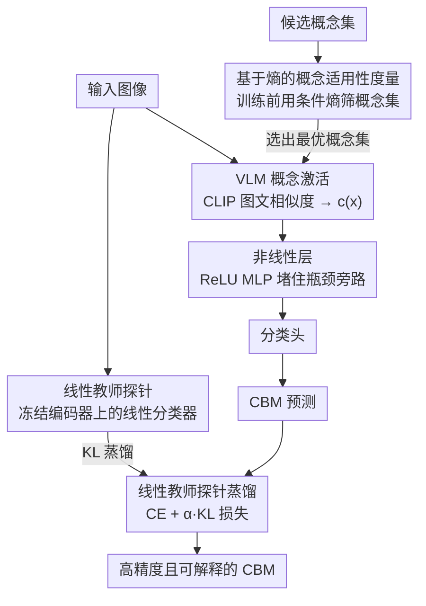

# Rethinking Concept Bottleneck Models: From Pitfalls to Solutions

**会议**: CVPR 2026  
**arXiv**: [2603.05629](https://arxiv.org/abs/2603.05629)  
**作者**: Merve Tapli, Quentin Bouniot, Wolfgang Stammer, Zeynep Akata, Emre Akbas
**领域**: 可解释性  
**关键词**: 概念瓶颈模型, 可解释性, 概念相关性, 蒸馏, 视觉-语言模型

## 一句话总结

提出 CBM-Suite 框架，系统性解决概念瓶颈模型的四大缺陷——缺乏概念相关性预评估指标、线性问题导致概念瓶颈被绕过、与黑盒模型的精度差距、以及不同视觉骨干/VLM 影响的研究空白——通过熵度量、非线性层和蒸馏损失显著提升 CBM 的精度与可解释性。

## 研究背景与动机

概念瓶颈模型（Concept Bottleneck Models, CBMs）将预测建立在人类可理解的概念之上，是可解释 AI 的重要范式。模型先预测一组语义概念的激活值，再基于概念激活做最终分类，从而提供概念级别的决策解释。

然而，现有 CBMs 面临四个根本性问题：

**缺乏概念相关性预评估**：给定一个数据集，如何在训练前判断某组概念是否适合该任务？现有方法缺少量化指标来预评估概念集的内在适用性，导致概念选择依赖试错

**线性问题（Linearity Problem）**：近期 CBM 方法（如基于 CLIP 的 Post-hoc CBM）在概念激活和分类器之间使用线性层，但这实际上导致模型可以绕过概念瓶颈，概念层形同虚设——分类器直接利用原始特征的线性组合，而非真正依赖概念语义

**精度差距**：CBMs 相比不透明的端到端模型存在明显的精度下降，限制了其在实际场景中的部署

**骨干网络影响研究空白**：不同视觉编码器（ViT、ResNet 等）和视觉-语言模型（CLIP 变体等）对 CBM 精度和可解释性的交互影响缺乏系统研究

这些问题严重制约了 CBM 的实用性，使其难以在保持可解释性的同时达到有竞争力的精度。

## 方法详解

### 整体框架

CBM-Suite 不是单一模型，而是冲着概念瓶颈模型四个老毛病——没法在训练前判断概念集好不好、线性结构让瓶颈被旁路、精度比黑盒差、骨干/VLM 影响没人系统研究——配的一套组合拳。它用一个熵度量在训练前给概念集打分，用一层非线性堵住瓶颈被绕过的漏洞，用一个线性教师探针蒸馏把精度差距补回来，再对视觉编码器、VLM、概念集三者做系统消融。前三件事落在下面这条训练/推理 pipeline 上（图中节点对应关键设计 1–3），第四件是对各组件搭配的系统消融分析、不进入数据流。

### 关键设计

**1. 基于熵的概念适用性度量：训练前就筛掉烂概念集**

挑概念集以前只能靠训练完看精度、反复试错。本文的想法是：一组概念若对数据集有判别力，不同类别在概念空间里就该分得开、条件熵就该低；概念与类别无关时条件熵则逼近最大。于是给定数据集 $\mathcal{D}$ 和概念集 $\mathcal{C}$，对每个样本算概念激活向量 $c(x) \in \mathbb{R}^{|\mathcal{C}|}$，再衡量类别在概念激活下的条件熵

$$H(Y | C) = -\sum_{c} p(c) \sum_{y} p(y|c) \log p(y|c)$$

$H(Y|C)$ 越低说明概念集越有信息量。这个指标完全不用训练模型就能算，直接用来比较、筛选候选概念集。

**2. 非线性层解决线性问题：让瓶颈无法被旁路**

当概念激活来自 CLIP 这类 VLM 的图文相似度、分类器又是线性层时，从图像特征到预测整条路都是线性的——模型完全可以找一个等价线性映射直接从原始特征预测，把概念语义彻底绕过去。修法很直接：在概念激活和分类器之间插一层非线性（带 ReLU 的 MLP），把端到端线性打断，分类路径变成

$$\hat{y} = g(\sigma(W \cdot c(x) + b))$$

$\sigma$ 是非线性激活、$g$ 是分类头。这样分类器只能在非线性变换后的概念空间里工作，精度才会忠实反映概念的相关性，而不是偷偷走原始特征的捷径。

**3. 蒸馏损失缩小精度差距：用线性探针当知识桥**

CBM 比黑盒模型精度低，限制了落地。本文在冻结的视觉编码器特征上训一个线性分类器作为**线性教师探针**——它不受瓶颈约束，代表该骨干上线性可达的精度上界；再让 CBM 学生除了标准交叉熵外，去最小化与教师输出的 KL 散度：

$$\mathcal{L} = \mathcal{L}_{CE}(y, \hat{y}_{CBM}) + \alpha \cdot D_{KL}(\hat{y}_{teacher} \| \hat{y}_{CBM})$$

教师把骨干里"和任务相关、但概念集没完全覆盖"的知识传给学生，在不牺牲可解释性的前提下把精度提上来。

**4. 系统性骨干网络与 VLM 分析：把交互影响摊开**

第四个缺陷是没人系统比过不同组件搭配的影响。本文对视觉编码器（ViT-B/16、ViT-L/14、ResNet-50 等不同架构与规模）、VLM（OpenAI CLIP、OpenCLIP、SigLIP 等）和概念集（人工标注、GPT 生成、领域知识等不同来源与规模）做全面消融，分析它们如何交互地影响 CBM 的分类精度与概念可解释性，给实践者一份配置指南。

## 实验关键数据

### Table 1: 不同方法在标准基准上的分类精度对比

| 方法 | CUB-200 | Places365 | ImageNet | CIFAR-100 |
|------|---------|-----------|----------|-----------|
| 标准端到端模型 | 84.2 | 55.8 | 76.1 | 82.5 |
| Post-hoc CBM (线性) | 78.5 | 49.2 | 71.3 | 76.4 |
| Label-free CBM | 79.8 | 50.1 | 72.0 | 77.2 |
| LaBo | 80.3 | 51.5 | 73.1 | 78.0 |
| CBM-Suite (非线性) | 81.7 | 52.8 | 74.2 | 79.5 |
| CBM-Suite (非线性+蒸馏) | **83.4** | **54.6** | **75.5** | **81.8** |

CBM-Suite 通过非线性层+蒸馏将 CBM 精度差距从 ~5.7% 缩小至 ~0.8%（以 CUB-200 为例），同时保持概念级可解释性。

### Table 2: 熵度量与实际分类精度的相关性验证

| 概念集 | 概念数量 | 熵度量 $H(Y|C)$ | CUB-200 精度 | Places365 精度 |
|--------|---------|-----------------|-------------|---------------|
| CUB-Attributes (人工) | 312 | 0.42 | 83.4 | - |
| GPT-4 生成 (大) | 500 | 0.58 | 81.2 | 53.1 |
| GPT-4 生成 (中) | 200 | 0.71 | 79.5 | 51.8 |
| 随机词汇 | 200 | 1.85 | 68.3 | 42.1 |
| GPT-4 生成 (小) | 50 | 1.12 | 74.1 | 47.2 |
| 领域无关概念 | 100 | 1.63 | 70.2 | 44.5 |

熵度量与分类精度呈强负相关：$H(Y|C)$ 越低的概念集，最终模型精度越高。验证了该指标作为概念集质量预评估工具的有效性。人工标注的 CUB-Attributes 具有最低熵（0.42），对应最高精度。

## 亮点与洞察

- **线性问题的揭示与解决**：深刻指出 Post-hoc CBM 中线性路径导致概念瓶颈被绕过的根本问题，非线性层的插入简洁有效，是对 CBM 可解释性保证的关键修复
- **熵度量的实用价值**：概念相关性预评估指标填补了 CBM 研究中的空白，使研究者可以在训练前以低成本筛选和比较概念集，避免盲目试错
- **蒸馏策略精度恢复**：线性教师探针作为知识桥梁，仅增加微量计算开销就将精度差距从 ~5% 缩至 ~1% 以内
- **系统性骨干分析**：首次系统研究视觉编码器、VLM 和概念集三者的交互影响，为 CBM 实践者提供配置指南——更大的编码器和更强的 VLM 不一定带来更好的概念可解释性

## 局限性

- 熵度量假设概念激活的质量由 VLM 保证，若 VLM 对某些概念的理解本身有偏差，熵值可能误导概念选择
- 非线性层引入额外参数，增加了过拟合风险，尤其在小数据集上需要仔细正则化
- 蒸馏依赖线性教师探针，当教师探针本身精度有限时（如在困难数据集上），蒸馏收益有限
- 概念干预（concept intervention）在非线性层后的效果可能不如线性 CBM 直接，可解释性与精度的权衡仍需进一步研究
- 实验主要基于图像分类任务，向目标检测、分割等更复杂视觉任务的扩展有待验证

## 相关工作

- **经典 CBM**：Koh et al. (2020) 提出原始 CBM，需要概念标注训练；后续 Post-hoc CBM (Yuksekgonul et al. 2023) 利用 CLIP 在无概念标注的情况下构建概念层，但引入了线性问题
- **Label-free CBM**：Oikarinen et al. (2023) 使用 GPT 生成概念集，避免人工标注，但概念质量无法预评估
- **LaBo**：Yang et al. (2023) 优化概念集选择，但依赖线性分类器，同样受线性问题影响
- **知识蒸馏**：Hinton et al. (2015) 的经典蒸馏范式在此被巧妙改造——教师不是完整大模型，而是轻量的线性探针，特别适配 CBM 场景
- **概念可解释性**：Kim et al. (2018) TCAV、Ghorbani et al. (2019) ACE 等从后验角度分析概念，而 CBM 将概念嵌入模型结构中，CBM-Suite 进一步确保这种嵌入是忠实的

## 评分

- 新颖性: ⭐⭐⭐⭐ — 系统性识别并解决 CBM 的四个根本缺陷，线性问题的发现尤为有价值
- 实验充分度: ⭐⭐⭐⭐ — 多数据集、多骨干、多 VLM 的全面消融，概念集分析详尽
- 写作质量: ⭐⭐⭐⭐ — 问题驱动的结构清晰，四个贡献逐一对应四个问题
- 价值: ⭐⭐⭐⭐ — 为 CBM 实践提供了完整的方法论工具箱，对可解释 AI 社区有直接推动作用

<!-- RELATED:START -->

## 相关论文

- [\[AAAI 2026\] Partially Shared Concept Bottleneck Models](../../AAAI2026/interpretability/partially_shared_concept_bottleneck_models.md)
- [\[CVPR 2026\] Rounded or Streamlined Head? Bridging Concept Bottleneck Models and Attribute-Described Object Parts](rounded_or_streamlined_head_bridging_concept_bottleneck_models_and_attribute-des.md)
- [\[ICLR 2026\] There Was Never a Bottleneck in Concept Bottleneck Models](../../ICLR2026/interpretability/there_was_never_a_bottleneck_in_concept_bottleneck_models.md)
- [\[AAAI 2026\] Flexible Concept Bottleneck Model](../../AAAI2026/interpretability/flexible_concept_bottleneck_model.md)
- [\[AAAI 2026\] Concepts from Representations: Post-hoc Concept Bottleneck Models via Sparse Decomposition of Visual Representations](../../AAAI2026/interpretability/concepts_from_representations_post-hoc_concept_bottleneck_models_via_sparse_deco.md)

<!-- RELATED:END -->
