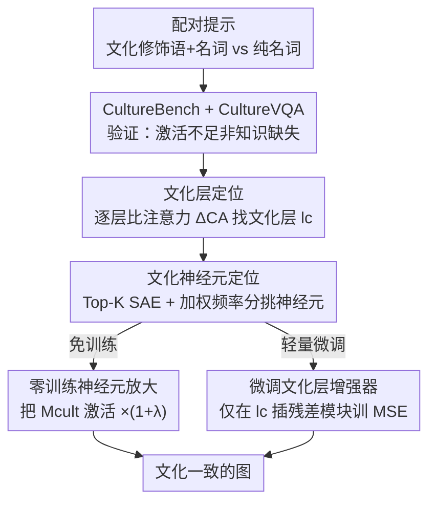

# Where Culture Fades: Revealing the Cultural Gap in Text-to-Image Generation

**会议**: CVPR 2026  
**论文**: [CVF Open Access](https://openaccess.thecvf.com/content/CVPR2026/html/Shi_Where_Culture_Fades_Revealing_the_Cultural_Gap_in_Text-to-Image_Generation_CVPR_2026_paper.html)  
**代码**: 无  
**领域**: 可解释性 / 文本到图像生成 / 文化对齐  
**关键词**: 文化一致性、神经元可解释性、稀疏自编码器、多语言T2I、CultureBench

## 一句话总结
作者发现多语言文生图模型在"只给名词"的提示下会产出文化中立或偏英语的图，并通过注意力 + 稀疏自编码器探针证明这是"激活不足"而非"知识缺失"——文化信号其实只集中在文本编码器的少数几层、少数几个神经元里；据此提出免训练放大这些神经元和只微调文化层两种轻量方案，在自建的 15 国基准 CultureBench 上把文化识别准确率（CultureVQA）从 ~22 提到 36.6。

## 研究背景与动机
**领域现状**：多语言文生图（T2I）模型在视觉真实度和语义对齐上进步飞快，已被广泛使用。语言本身承载文化内涵，理想情况下用不同语言写同义提示，生成的图应当体现各自语言对应的文化背景（cross-lingual cultural consistency）。

**现有痛点**：实际上当用非英语提示时，主流模型（StableDiffusion XL/3.5、FLUX、AltDiffusion、PEA-Diffusion 等）经常产出"文化中立"或隐性偏英语的图。例如用葡萄牙语或土耳其语说"一座传统建筑"，模型只抓字面意思，给一个泛泛的建筑，丢掉了该语言对应的文化特征。相比之下 LLM、推荐系统对同样的本地化输入能给出有文化色彩的响应，说明这是 T2I 这一模态独有的"文化落地"缺口。

**核心矛盾**：以往工作要么聚焦在跨语言编码器对齐（让不同语言映射到同一语义），要么聚焦在去偏见/公平性，却没人回答一个更基础的问题——这种文化缺失到底是模型"不知道"（训练语料里没有文化知识），还是"知道但没被触发"（知识在里面但激活不足）？而且没人知道文化敏感的特征**藏在网络的哪里**、能不能在层/神经元级别去控制它。

**本文目标**：(1) 给"跨语言文化一致性"下一个可量化的定义和评测；(2) 验证"激活不足而非知识缺失"这个假设；(3) 定位文化信号在模型中的物理位置；(4) 提出不需要大规模重训的轻量干预手段。

**切入角度**：作者注意到一个关键现象——只要在名词前加上"文化风格修饰语"（如"穿中式服装的人""一座意大利建筑"），模型立刻就能生成有明显国别特征的图（见论文 Fig.1b）。这说明文化知识本来就在模型里，"只给名词"的提示没能强触发它。既然修饰语能唤醒文化语义，那么文化语义一定对应着模型内部某些可被增强的表征单元。

**核心 idea**：把"修饰语 vs 纯名词"这对受控提示当探针，去对比模型内部的注意力和神经元激活差异，**定位**出文化敏感的层与神经元，然后**直接放大/微调**这一小撮单元，就能在不动主干、不重训的前提下补回文化一致性。

## 方法详解

### 整体框架
整篇工作分三块串起来：先**建基准并验证假设**（CultureBench + CultureVQA 证明"激活不足"），再**两阶段探针定位**文化信号的物理位置（先定位文化敏感层，再在该层里定位文化神经元），最后基于定位结果给两种**轻量干预**（免训练放大、微调文化层）。核心方法对象是文本编码器：探针先用"文化修饰语+名词"与"纯名词"两套配对提示，逐层比较注意力分布找出分歧最大的"文化层"$l_c$，再在这一层用 Top-K 稀疏自编码器（SAE）把注意力特征分解成稀疏神经元、用一个加权频率分挑出真正对文化敏感的神经元集合 $\mathcal{M}_{cult}$；干预阶段要么在推理时把 $\mathcal{M}_{cult}$ 的激活乘上 $(1+\lambda)$ 放大，要么在 $l_c$ 插入一个小残差模块只训这一层。

### 关键设计

**1. CultureBench + CultureVQA：把"文化一致性"做成可量化的受控实验**

要研究"文化为什么消失"，先得能测量它。作者人工采集 15 个语言/地区的文化代表性图像（地理约束 + 本地/翻译关键词搜索，逐张人工核验真实性与代表性），共 7,932 张，按 7:2:1 切成训练/测试/神经元检测三个子集，并严格隔离——测试集和神经元检测集在训练、调参、选模型时一律不碰。每张图配两条描述：一条由 GPT5-Nano 生成的"文化风格修饰语+名词"caption，一条人工写的"纯名词"caption；专家审核 taxonomy，只保留有统计依据、符合语境的文化线索，把牵强的当作刻板印象剔除，以免把"文化典型"和"刻板印象"混为一谈。评测指标 CultureVQA 是一个单选 VQA：让 Qwen3-VL 和 Gemini-2.5-Flash 仅凭视觉、不看文字提示，从 15 个国别标签或"无法识别"中选一个，报准确率。这个设计的巧妙在于它强制模型只能从画面本身的文化线索做归属判断，从而把"图有没有文化味"变成一个客观可比的数字。用它一测就坐实了假设：同样的图生成系统，"修饰语+名词"提示的 CultureVQA（AltDiffusion 44.39、PEA-Diffusion 35.62）远高于"纯名词"，且两种架构差异很大的扩散模型上趋势一致，说明不是个例。

**2. 文化层定位：用配对提示的注意力差 ΔCA 锁定唯一关键层**

知道了"知识在但没激活"，下一步是找它在哪一层。作者为每个目标概念造一对提示：$P_{cult}$（名词+文化修饰语）和 $P_{noun}$（只名词），并标注两类 token——文化修饰语 $T_{cult}$ 和目标名词 $T_{noun}$。在第 $l$ 层取多头注意力 $A(l)\in\mathbb{R}^{B\times H\times S\times S}$，先对头求平均 $\bar{A}(l)=\frac{1}{H}\sum_h A_h(l)$ 求稳健，再只保留"修饰语 token → 名词 token"这部分注意力。该层从文化修饰语指向目标名词的注意力强度定义为

$$\mathrm{CA}(P, l) = \frac{\sum_{t_{cult}}\sum_{t_{noun}} \bar{A}_{key}(l)_{\,t_{cult}\to t_{noun}}}{|T_{cult}|\cdot|T_{noun}|}.$$

直觉是：如果第 $l$ 层真编码了文化语义，那么在文化提示下"修饰语→名词"的注意力应当显著高于纯名词提示。于是对 $N$ 对提示求差值

$$\Delta\mathrm{CA}(l) = \frac{1}{N}\sum_{i=1}^{N}\big[\mathrm{CA}(P_{cult,i}, l) - \mathrm{CA}(P_{noun,i}, l)\big].$$

$\Delta\mathrm{CA}(l)$ 越大，说明该层越能把"文化修饰语"和"纯名词"语义分开。作者跨提示对和随机种子计算 $\Delta\mathrm{CA}$，当某层的值明显超过相邻两层均值时就标记为文化敏感层。结果（论文 Fig.6，PEA-Diffusion）显示在第 16 层出现清晰的全局峰值——文化语义不是均匀散布在网络里，而是**集中在一个关键层**。这是后续所有干预的落点。

**3. 文化神经元定位：Top-K SAE + 加权频率分，挑出"真文化"神经元并验证**

只锁定一层还不够细，作者要在这一层里挑出具体哪些神经元负责文化。做法是在关键层上对注意力特征接一个 Top-K 稀疏自编码器，把纠缠的内部表征解耦成更独立、语义更连贯的稀疏神经元。从该层得到文化特征 $F_{cult}$ 和名词特征 $F_{noun}$（特征维度 $D_{att}=|T_{cult}|\times|T_{noun}|$），然后用一个"加权频率分"同时刻画神经元的**点火频率**和**响应幅度**。激活频率是超过阈值 $\epsilon$ 的样本比例

$$f_{cult}(m) = \frac{1}{N_{cult}}\sum_{i=1}^{N_{cult}} \mathbb{I}\big(Z_{cult}[i,m] > \epsilon\big),$$

平均激活幅度（$\beta$ 是防止分母为零的小常数）

$$\mu_{cult}(m) = \frac{\sum_{i=1}^{N_{cult}} Z_{cult}[i,m]\cdot \mathbb{I}(Z_{cult}[i,m]>\epsilon)}{\sum_{i=1}^{N_{cult}} \mathbb{I}(Z_{cult}[i,m]>\epsilon) + \beta},$$

两者相乘得加权频率分 $\mathrm{WFS}_{cult}(m)=f_{cult}(m)\cdot\mu_{cult}(m)$。同法算出名词侧 $\mathrm{WFS}_{noun}$，按 $\mathrm{WFS}_{cult}$ 排序取 Top-K，再**剔除在名词侧也很显著的神经元**，剩下的才认定为文化敏感神经元——这一步保证挑出来的是"文化专属"而非"任何名词都激活"的通用单元。$K$ 自适应于显著峰的数量。作者还发现（论文 Fig.7）不同文化的峰值神经元索引互不重叠，说明不同文化由不同神经元承载。为验证定位准不准，作者做了三组受控对照（论文 Table 1）：屏蔽 Top-K 文化神经元后 CultureVQA 从 35.62 暴跌到 7.65（-27.97），而屏蔽同样数量的随机神经元只掉到 33.04（-2.58）——这种"精准打击式"的崩塌只在屏蔽识别出的神经元时出现，强力证明定位的因果有效性。

**4. 两种轻量干预：零训练神经元放大 与 微调文化层增强器**

定位完就能直接动手。第一种是**零训练神经元放大**：把待干预的注意力关联特征 $F_{raw}$ 送进 SAE 编码器得稀疏潜向量 $Z_{raw}=\mathrm{SAE.encode}(F_{raw})$，只对属于文化神经元集合 $\mathcal{M}_{cult}$ 的维度乘上放大系数

$$Z_{enh}[b,p,m] = \begin{cases}(1+\lambda)\,Z_{raw}[b,p,m], & m\in\mathcal{M}_{cult}\\ Z_{raw}[b,p,m], & \text{否则}\end{cases}$$

再解码回注意力空间 $F_{rec\_enh}=\mathrm{SAE.decode}(Z_{enh})$。它完全不动主干、不需训练，靠手动选的 $\lambda$ 控制文化强度，保留原语义结构的同时增强文化注意力模式。第二种是**微调文化层增强器**，免去手调 $\lambda$：只在文化层 $l_c$ 插一个小可训练残差模块

$$\tilde{h} = h + g\big(W_2\,\sigma(W_1 h)\big),$$

$\sigma$ 是非线性、$g$ 是用于稳定残差的归一化、$W_1,W_2$ 是小矩阵，其余参数全冻结。训练时给"纯名词"提示 $p$，生成图 $\hat{x}=G(f_{\theta,\phi}(p))$ 与 CultureBench 里对应的人工文化参考图 $x^*(p)$ 做像素级 MSE，只优化增强器参数 $\phi^*=\arg\min_\phi \mathcal{L}_{MSE}$。两者都贯彻"只动文化相关单元、不碰主干"的思路：前者零成本即插即用，后者用一点点训练换来自适应、免手调强度。

### 损失函数 / 训练策略
微调增强器只用像素级 MSE 损失 $\mathcal{L}_{MSE}=\frac{1}{N}\sum_i\lVert \hat{x}_i - x^*_i(p)\rVert_2^2$，仅优化增强器参数。超参：AdamW、学习率 $5\times10^{-5}$、batch size 1、混合精度训练 2000 步，单张 A6000。零训练变体设 $\lambda=6$（⚠️ 注意：超参分析里 CultureVQA 在 $\lambda=7$ 时取峰 35.92，正文也写"select λ = 7"，与实现细节的 $\lambda=6$ 不一致，以原文为准）。

## 实验关键数据

### 主实验
在 CultureBench 测试集上用"纯名词"提示与一众 SOTA 比较（CultureVQA 越高越好，LPIPS 越低越好）：

| 方法 | CultureVQA ↑ | CLIPScore ↑ | ImageReward ↑ | LPIPS ↓ |
|------|------|------|------|------|
| StableDiffusion XL | 9.36 | 0.211 | -1.82 | 0.756 |
| FLUX.1-dev | 14.83 | 0.224 | -0.88 | 0.692 |
| Show-o2 | 16.43 | 0.234 | -0.91 | 0.691 |
| PEA-Diffusion | 21.65 | 0.253 | -0.65 | 0.673 |
| AltDiffusion | 23.05 | 0.282 | -0.11 | 0.688 |
| StableDiffusion 3.5 | 25.13 | 0.242 | -1.01 | 0.715 |
| **本文 (零训练)** | 33.91 (+12.32) | **0.291** (+0.038) | **0.33** (+0.98) | **0.654** |
| **本文 (微调)** | **36.63** (+14.98) | 0.290 | 0.31 | 0.661 |

文化识别准确率大幅领先（微调版 36.63 vs 次优 AltDiffusion 23.05），同时 CLIPScore / ImageReward / LPIPS 也都最优或有竞争力——说明补文化没有牺牲语义对齐和视觉质量。

### 消融实验

| 模型 | 方法 | CultureVQA ↑ |
|------|------|------|
| AltDiffusion | w/o Ours | 23.05 |
| AltDiffusion | w/ 随机 (零训练) | 20.38 (-2.67) |
| AltDiffusion | w/ Ours (零训练) | 30.06 (+7.01) |
| AltDiffusion | w/ 随机 (微调) | 21.04 (-2.01) |
| AltDiffusion | w/ Ours (微调) | 32.66 (+9.61) |
| PEA-Diffusion | w/o Ours | 21.65 |
| PEA-Diffusion | w/ 随机 (零训练) | 21.04 (-0.61) |
| PEA-Diffusion | w/ Ours (零训练) | 33.91 (+12.26) |
| PEA-Diffusion | w/ 随机 (微调) | 22.34 (+0.69) |
| PEA-Diffusion | w/ Ours (微调) | 36.63 (+14.98) |

另有神经元定位验证（Table 1）：屏蔽 Top-K 文化神经元 CultureVQA 35.62→7.65（-27.97），随机屏蔽仅 →33.04（-2.58）。

### 关键发现
- **定位准不准是全文命门**：屏蔽识别出的文化神经元几乎让 CultureVQA 崩盘（-27.97），随机屏蔽几乎无影响（-2.58），这种巨大反差是"激活不足"假设与定位方法最硬的证据。
- **随机激活/随机微调几乎没用甚至变差**（如随机零训练在两个模型上 -2.67 / -0.61），证明增益来自对文化神经元的**定向**干预，而非任何扰动都能涨点。
- **跨架构通用**：AltDiffusion 和 PEA-Diffusion 两种结构迥异的扩散模型都稳定提升，说明探针+增强框架不绑定特定模型。
- **$\lambda$ 有甜区**：$\lambda=0$ 时输出与原图一致，随 $\lambda$ 增大越来越向目标文化原型靠拢，CultureVQA 在 $\lambda=7$ 达峰 35.92，$\lambda=8$ 略降到 32.61——过强会过拟合反伤指标。

## 亮点与洞察
- **把"文化为什么消失"从玄学变成可解剖的工程问题**：用"修饰语 vs 纯名词"这对极简受控提示当探针，干净利落地把"知识缺失 vs 激活不足"两个假设区分开，思路非常可迁移——任何"模型好像不会某能力"的场景都可以照搬这套对照设计去验证是"不会"还是"没触发"。
- **从层到神经元的两阶段定位 + 因果消融闭环**：先 ΔCA 找层、再 Top-K SAE 找神经元、最后屏蔽实验反证因果，整条链条自洽且可复现，SAE 用来解耦注意力特征找"文化专属神经元"是很漂亮的可解释性用法。
- **干预极轻量、即插即用**：零训练版完全不碰主干、单系数可调；微调版只训一层一个小残差模块、单卡 A6000 2000 步就够，对工业部署友好，是"先理解后干预"范式的好示范。
- **可迁移的 trick**：剔除"名词侧也显著"的神经元来保证挑出的是文化专属单元，这种"对比+去通用"的选择策略可用于任何概念神经元的精炼定位。

## 局限与展望
- **CultureVQA 依赖 VLM 当裁判**：用 Qwen3-VL / Gemini 做文化归属判断，虽与人工标注高度一致，但 VLM 自身的文化偏见可能渗入评测；"文化典型 vs 刻板印象"的边界由专家划定，仍带主观性。
- **覆盖 15 个语言/地区**：相对全球文化多样性仍偏小，低资源语言、文化内部的多元性（同一国家不同地区/族群）未充分体现。
- **超参 $\lambda$ 的不一致**：实现细节写 $\lambda=6$、超参分析与正文结论写 $\lambda=7$，文中口径不统一；且 $\lambda$ 需手动选，过大反而过拟合，零训练版的稳定性依赖经验。
- **只在文本编码器侧干预**：方法假设文化信号集中在文本编码器的单一关键层，未探讨 UNet/扩散主干内部是否也有可定位的文化表征，跨模块联合干预是潜在方向。
- **MSE 像素级监督偏硬**：微调用纯名词图对齐人工文化参考图做像素 MSE，可能过度约束构图，换成感知/特征级损失或许更灵活。

## 相关工作与启发
- **vs SCoFT / ViSAGe（文化公平性）**：他们扩大文化覆盖、量化视觉刻板印象，聚焦"去偏见"；本文则把问题重新框定为"跨语言文化一致性"并给出可解释的内部机制定位，目标从"别有偏见"转向"主动唤醒被压制的文化表征"。
- **vs PEA-Diffusion / AltDiffusion（跨语言编码器对齐）**：他们让不同语言映射到同一语义空间以做对齐，却忽视了"跨文化落地"；本文恰恰指出对齐到统一语义反而抹平了文化差异，应当在神经元级别保留并增强文化专属信号。
- **vs FEMN 等神经元可解释性工作**：FEMN 在 CLIP 里定位"微笑""条纹"等物体/属性级概念神经元并因果操控；本文把这套神经元因果探针**首次系统地用到"文化"这种抽象、且随多语言提示变化的概念上**，并落到可控生成，拓展了概念神经元的研究边界。

## 评分
- 新颖性: ⭐⭐⭐⭐⭐ 把"文化一致性"问题重新定义为"激活不足"，并用层/神经元级探针给出可解释定位 + 轻量干预，视角和方法都新。
- 实验充分度: ⭐⭐⭐⭐ 自建基准 + 跨两架构验证 + 屏蔽因果消融 + 超参分析，闭环扎实；但只比 PEA/Alt 两个底座、15 国规模偏小。
- 写作质量: ⭐⭐⭐⭐ 假设—验证—定位—干预的逻辑链清晰，公式完整；$\lambda$ 取值正文前后口径不一致是个小瑕疵。
- 价值: ⭐⭐⭐⭐⭐ 既给生成式 AI 的文化包容性提供了诊断工具和可复用基准，又示范了"先解释后轻量干预"的实用范式。

<!-- RELATED:START -->

## 相关论文

- [\[ACL 2026\] Follow the Flow: On Information Flow Across Textual Tokens in Text-to-Image Models](../../ACL2026/interpretability/follow_the_flow_on_information_flow_across_textual_tokens_in_text-to-image_model.md)
- [\[NeurIPS 2025\] AgentiQL: An Agent-Inspired Multi-Expert Framework for Text-to-SQL Generation](../../NeurIPS2025/interpretability/agentiql_an_agent-inspired_multi-expert_framework_for_text-to-sql_generation.md)
- [\[CVPR 2026\] Hierarchical Concept Embedding & Pursuit for Interpretable Image Classification](hierarchical_concept_embedding_pursuit_for_interpretable_image_classification.md)
- [\[CVPR 2026\] HUMORCHAIN: Theory-Guided Multi-Stage Reasoning for Interpretable Multimodal Humor Generation](humorchain_theory-guided_multi-stage_reasoning_for_interpretable_multimodal_humo.md)
- [\[ICLR 2026\] Toward Faithful Retrieval-Augmented Generation with Sparse Autoencoders](../../ICLR2026/interpretability/toward_faithful_retrieval-augmented_generation_with_sparse_autoencoders.md)

<!-- RELATED:END -->
