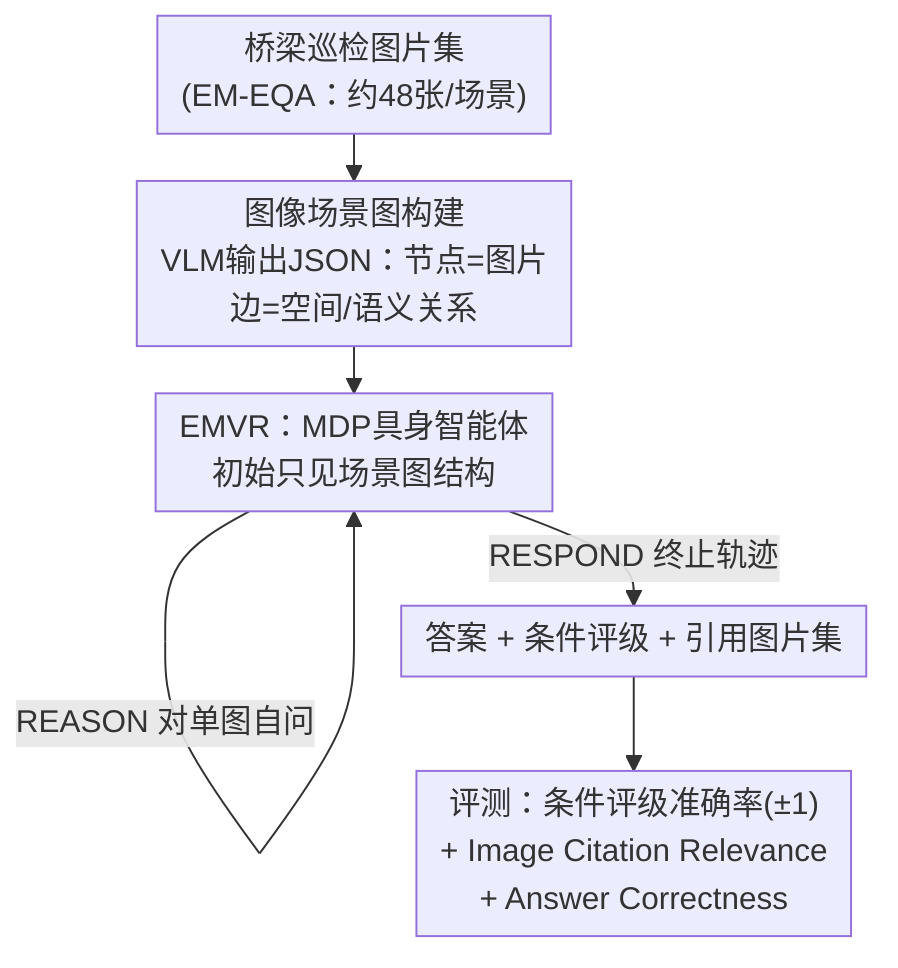

# BridgeEQA: Virtual Embodied Agents for Real Bridge Inspections

**会议**: CVPR 2026  
**论文**: [CVF Open Access](https://openaccess.thecvf.com/content/CVPR2026/html/Varghese_BridgeEQA_Virtual_Embodied_Agents_for_Real_Bridge_Inspections_CVPR_2026_paper.html)  
**代码**: https://drags99.github.io/bridge-eqa/  
**领域**: 具身智能体 / 多模态VLM / Embodied QA  
**关键词**: 具身问答, 桥梁检测, 图像场景图, MDP智能体, 长上下文位置偏置

## 一句话总结
本文把基础设施巡检抽象成一类新的具身问答任务（Inspection EQA），发布了 2,200 条专家标注的桥梁巡检问答基准 BridgeEQA，并提出 EMVR 方法——把"一次性塞全部图片"的长上下文问答重构成"智能体在以图片为节点的场景图上按 MDP 主动导航取证"，从而缓解长上下文"中间信息丢失"，在条件评级准确率、图像引用相关性、答案正确率上都显著超过非导航基线。

## 研究背景与动机

**领域现状**：具身问答（Embodied Question Answering, EQA）让智能体根据空间上分散的视觉观测回答自然语言问题，分为两种设定——情景记忆 EQA（EM-EQA，从预先采集好、包含全部所需图片的集合中作答）和主动 EQA（A-EQA，自主探索）。OpenEQA 等现有基准把场景局限在家居环境，问题也偏简单（数物体、判位置）。在 EM-EQA 上最强的基线是 Multi-Frame VLM——把一个场景的所有图片一次性当上下文喂给 VLM，单次回答。

**现有痛点**：现有基准的空间尺度小、问题简单，严重低估了真实部署的难度——真实场景往往有巨大空间跨度、从全局俯瞰到细粒度细节的层级结构、异质的成像条件，还要把观测和领域专门的评判标准对齐。而最强的 Multi-Frame VLM 把几十上百张图片塞进上下文后，会受长上下文 LLM 的位置偏置之苦：序列中间的信息被"lost in the middle"（中间丢失），导致答案质量和视觉定位严重退化。

**核心矛盾**：真实巡检需要的是"在数十张覆盖整座结构的图片间穿梭、跨视图综合证据形成构件级评估、引用支撑图片、并对齐成文的检测标准"这一整条推理链；而一次性长上下文输入与位置偏置之间存在根本冲突——图越多，关键证据越可能落在被忽略的中段。

**本文目标**：(1) 提供一个能真正考验这条完整推理链、且有客观可比评测的基准；(2) 给出一个不受长上下文位置偏置拖累的作答方法；(3) 提供一个能衡量"视觉证据是否引对"的指标。

**切入角度**：作者观察到桥梁巡检天然满足"多尺度推理 + 长程空间理解 + 专家标注报告作为 ground truth + 第一视角图像 + 标准化数值评级（NBI 0–9 分）"这几个稀缺条件，是推进情景记忆 EQA 的理想测试床。同时注意到：既然问题出在"被动接收全部图片"，那就把它改造成"主动按需取证"的智能体。

**核心 idea**：把 EM-EQA 重新表述为 A-EQA——用以图片为节点的场景图当作"寰中心地图（allocentric map）"，让具身智能体通过 MDP 动态检索、把中段的关键证据"提"到上下文窗口末尾，从根上规避位置偏置。

## 方法详解

### 整体框架
BridgeEQA 包含两条相互独立又互补的贡献线：一条是**数据与评测**（Inspection EQA 问题类 + BridgeEQA 数据集 + Image Citation Relevance 指标），一条是**方法**（EMVR 智能体）。方法侧的核心 pipeline 是：先把一个桥梁场景的几十张巡检图片用 VLM 自动构造成一张**图像场景图** $G=(V,E,I)$（节点是图片、边是图片间的空间/语义关系），然后让一个由 VLM 充当策略的**具身智能体**在这张图上按马尔可夫决策过程（MDP）导航——它初始只看到场景图的结构（节点标签、描述、边），再通过 `MOVE / COMPARE / REASON / RESPOND` 这几类函数调用按需把相关图片"调入"上下文，最后输出带图片引用和条件评级的答案。和"一次性塞全部图"的基线相比，EMVR 等于让模型自己决定看哪几张、什么时候看，从而把关键证据放到上下文末端。

### 关键设计

**1. Inspection EQA 问题类：把"巡检"抽象成可跨域复用的 EQA 子类**

作者没有止步于"又一个数据集"，而是先定义了一个一般化的问题类——以资产为中心（asset-centric）、多视图的问答：智能体必须跨多个视角综合视觉证据、把答案对齐到标准化的条件评分细则、定位支撑证据、并和领域专家达成一致。为了让这个类可跨域比较（桥梁之外还有大坝、隧道、管道），作者给出一份**量化检查清单**：所有问答对都依赖多视图、所有答案都绑定到一套评级量表、所有问答对都带参考图片集用于证据定位、且"引用相关性与人类一致性强相关"。任何数据集只要高比例满足这几条，就构成一个 Inspection EQA 基准，可与未来其他资产类型直接横比。这把一个具体应用提升成了一个有标准的研究问题类。

**2. 图像场景图：节点是图片而非物体，无需任何 GPS/传感器**

通用域的场景图通常以检测到的"物体"为节点，但桥梁巡检缺少能稠密检测所有结构构件（支座、伸缩缝、特定劣化模式）的基础模型，object-centric 路线走不通。本文转而用**图片本身**当节点：场景图 $G=(V,E,I)$ 中，$V$ 是节点集（每个节点对应一个视角及其图片），$E\subseteq V\times V$ 是有向边（表示视角间的空间/语义关系），$I$ 是全部图片，节点与图片一一双射（$|V|=|I|$）。每个节点封装图片名、中心焦点（用巡检术语描述主构件，如"Span 1 deck and superstructure"）、图像描述、边集；边带关系描述符，覆盖层级关系（"是……的细节视图"）、结构关系（"支撑/被支撑"）、空间邻接、状况相似、构件归属五类。关键在于：**构图纯视觉**，不需要 GPS、地理元数据或外部空间传感器——VLM 读图后直接吐出含最小必需字段（图像描述、中心焦点、边）的结构化 JSON。这个设计的妙处是把一个 EM-EQA 问题（无序图片集）转成了 A-EQA 问题（可被智能体系统探索的可导航地图），且因字段极简而具备跨域泛化性。构图用 Gemini 2.5 Flash 自动完成，检测到解析错误时回退到 Gemini 2.5 Pro。

**3. EMVR：把作答重构成场景图上的 MDP 导航，治"中间丢失"**

这是方法侧最核心的贡献。EMVR 把智能体的决策过程建模成"序列化导航 + 选择性回忆"的 MDP：在时刻 $t$，状态 $s_t=(v_t, h_t)$ 由当前节点 $v_t$ 和交互历史 $h_t$（已看过的图片与观测）构成；观测空间是整张场景图结构 $G$（所有节点的中心焦点标签、图像描述、边关系），每步智能体观测当前节点 $v_t$ 并可查询邻居 $N(v_t)=\{v_j\mid (v_t,v_j)\in E\}$。动作空间是四类函数调用：`MOVE(v_j)` 导航到邻居节点；`COMPARE({v_i,v_j,...})` 加载并对比两个及以上节点的图片（$|\{v_i,v_j,...\}|\ge 2$）；`REASON(v_i)` 对单图自问以抽取细节；`RESPOND(q)` 生成带图片引用和条件评级的答案、结束轨迹。策略 $\pi(a_t\mid s_t, q)$ 由一个 VLM 实现，执行 `RESPOND` 即终止。

它为什么有效：和 Multi-Frame VLM"同时收到全部图片、单次作答"不同，EMVR **初始只用场景图结构（节点、边、语义标签）启动，再按需取图**。这等于让智能体动态地把"散落在中段"的关键视觉证据选出来、提到上下文窗口的末端（如论文 Figure 2 所示），从而把模型对序列首尾的位置偏置反过来利用——关键信息永远在末端，规避了"lost in the middle"。

**4. Image Citation Relevance：衡量"证据有没有引对"的新指标**

真实巡检要求检查员用照片佐证评级，于是作者提出一个对应的评测维度：智能体作答时除文字答案外还要显式列出支撑图片集 $R_{agent}=\{i'_1,...,i'_m\}$，与数据构建时从 PDF 报告里抽出的参考图片集 $R=\{i_1,...,i_k\}$（检查员把文字描述显式链接到的照片）做语义对比。具体用 Gemini 2.5 Flash 充当 VLM-as-a-judge，输入问题、ground truth 答案、参考图片（作为示例而非绝对标准）和智能体所选图片，在 $0.0$–$1.0$ 区间打分，并对**过度引用**惩罚（当智能体引用图数超过参考集的 5 倍时；实测各方法平均引用少于 6 张，几乎不触发重罚）。该指标用三名标注者验证人类一致性，平均人类标注与指标的 Spearman 相关系数达 $0.817$。这个指标的价值在于：低质量的图像引用本身可以当作"检测幻觉或差答案"的代理信号——错答常伴随引错图或幻觉式引用（引用根本不存在的图片）。

### 一个完整示例
以一个真实问答为例（来自论文 Figure 10，creosoted 木桩柱评级问题，标准答案 SATISFACTORY、评级 6）：

- EMVR（Grok 4 Fast，w/ Images + SG）从场景图结构出发，`MOVE` 导航到木桩柱相关节点，`COMPARE` 调入 Pier 1/Pier 2 的图片，识别出"轻微竖向劈裂 + 表面风化、无腐烂/无结构破坏、横撑完好"，`RESPOND` 给出评级 7、引用了正确的参考图片——Answer Correctness 0.8、Image Citation Relevance 0.95、评级落在 ground truth ±1 内。
- 对照之下，Multi-Frame VLM 把全部图一次性看完，反而把状况误判为"严重劣化"，给出评级 3，Answer Correctness 与 Image Citation Relevance 都为 0.0（引错图）。另一个失败案例则是 Gemini 2.5 Flash 幻觉式引用了不存在的图片名（IMG_4507/4508/4509）。

这个例子直观说明：主动取证让智能体看对了图，从而评对了级；而引用质量恰好能当作答案可靠性的探针。

## 实验关键数据

数据集：2,200 条问答（来自佛蒙特州交通局 VTrans 的 200 份桥梁巡检报告，覆盖 73 个城镇、9,586 张图片，平均 47.93 张/场景），train/test 各 1,100 条。问题类型以聚合推理（38.5%）和对比分析（27.2%）为主，关系推理 21.3%、空间分析 17.5%（一题可多类型）。NBI 评级分布集中在 5–7（Fair 到 Good），评级 6 最多。

### 主实验
在 test 1,100 条上评测三个 VLM（Gemini 2.5 Flash Lite / Flash、Grok 4 Fast）× 五种方法。下表为 **Answer Correctness**（LLM-as-a-judge）：

| 方法 | Gemini 2.5 Flash Lite | Gemini 2.5 Flash | Grok 4 Fast |
|------|------|------|------|
| Multi-Frame VLM | 0.507 | 0.484 | 0.576 |
| Socratic LLM w/ SG | 0.542 | 0.588 | 0.614 |
| Multi-Frame VLM w/ SG | 0.581 | 0.548 | 0.622 |
| EMVR VLM w/ SG Only | 0.512 | **0.609** | 0.638 |
| EMVR VLM w/ Images + SG | 0.497 | 0.551 | **0.648** |

**Image Citation Relevance**（视觉证据定位）：

| 方法 | Gemini 2.5 Flash Lite | Gemini 2.5 Flash | Grok 4 Fast |
|------|------|------|------|
| Multi-Frame VLM | 0.717 | 0.694 | 0.687 |
| Socratic LLM w/ SG | 0.775 | 0.767 | 0.838 |
| Multi-Frame VLM w/ SG | 0.802 | 0.778 | 0.833 |
| EMVR VLM w/ SG Only | 0.798 | **0.836** | 0.876 |
| EMVR VLM w/ Images + SG | **0.849** | 0.803 | **0.889** |

用 Grok 4 Fast 时，EMVR 相对 Multi-Frame VLM：条件评级准确率（±1）提升 **9.34 个百分点**、Image Citation Relevance 提升 **20.2 个百分点**、Answer Correctness 提升 **7.2 个百分点**。相对"非导航基线"的整体口径：评级准确率 +13.6%、视觉证据定位 +29%、答案质量 +12.5%。

### 消融实验
五种方法本身构成层层递进的消融，可拆出两个关键对照：

| 配置 | 作用 | 现象 |
|------|------|------|
| Multi-Frame VLM → + w/ SG | 给基线加场景图上下文 | Answer Correctness 普遍上升（如 Grok 0.576→0.622），说明场景图结构本身有用 |
| w/ SG Only vs. w/ Images + SG | EMVR 初始是否带图 | 在 Grok 4 Fast 上"Images + SG"更优（0.648 vs 0.638、citation 0.889 vs 0.876）；但在 Gemini 2.5 Flash 上"SG Only"反而更高（0.609 vs 0.551）——初始塞图对部分模型可能稀释注意力 |

### 关键发现
- **导航式取证 > 一次性长上下文**：EMVR 在三个模型上几乎全面优于 Multi-Frame VLM，验证了"位置偏置是主因、主动检索可缓解"的假设。
- **场景图是普惠增益**：即便不换 EMVR，仅给 Multi-Frame VLM 加上场景图上下文也能涨点，说明结构化的图间关系本身降低了推理难度。
- **初始是否带图依模型而异**：强模型（Grok 4 Fast）能消化初始图片获益，较弱/上下文较小的模型上"只给结构、按需取图"反而更稳——是工程上值得注意的 trade-off。
- **引用质量是幻觉探针**：两类主要失败（引错图、幻觉式引用不存在的图）都伴随答案崩坏，低 Image Citation Relevance 可作为检测幻觉的代理信号。

## 亮点与洞察
- **把 EM-EQA 重述成 A-EQA 的视角转换很巧**：同一批图片，被动接收会"中间丢失"，主动按需取证就能把关键证据搬到上下文末端——不改模型、只改"喂图方式"就拿到大幅提升，这个 reframing 可迁移到任何"图多到塞不下"的长上下文多模态任务。
- **以图片为节点的场景图绕开了基础模型缺失**：当某领域没有稠密物体检测器时，用"图片即节点 + VLM 生成关系"是一条务实的退路，且纯视觉、无需 GPS，跨域门槛低。
- **指标即诊断**：Image Citation Relevance 不只是评分，还顺手成了幻觉检测器——这种"评测指标反哺可靠性"的设计很值得借鉴。
- **问题类 + 检查清单**：用量化清单把"巡检"上升为可跨域横比的 EQA 子类，给后续大坝/隧道/管道数据集留了统一接口。

## 局限与展望
- **开源小模型用不了**：作者测试的多个 <30B 开源 VLM 无法可靠遵守结构化输出和函数调用格式，且上下文窗口太小，无法在大场景上评测，被排除在主对比之外——EMVR 目前强依赖闭源强模型的 agentic 能力。
- **场景图质量依赖 VLM**：构图本身由 Gemini 自动完成、出错才回退，图的边关系是否可靠会直接传导到导航质量，论文把节点/边数量的影响放在补充材料，正文未充分展开。
- **评测含 VLM-as-judge 环节**：Answer Correctness 与 Image Citation Relevance 都用 VLM 当裁判，虽有人类一致性验证（Spearman 0.817），但裁判模型自身偏差仍可能引入系统性误差。
- **领域偏窄 + 评级长尾**：数据来自单一州（佛蒙特）的报告，NBI 评级集中在 5–7、极端劣化样本稀少，模型在长尾评级上的真实能力难以充分检验。
- **改进思路**：可探索可训练的导航策略（当前策略就是 prompt 驱动的 VLM）、把场景图构建做成可学习/可校验的模块、以及把方法推广到真正的主动探索（机器人/无人机实时取图）。

## 相关工作与启发
- **vs Multi-Frame VLM [28]**：它把全部图片一次性塞进上下文单次作答，是 EM-EQA 上最强基线；本文指出其受长上下文位置偏置之苦，改成 MDP 导航按需取图，跨模型几乎全面超越——区别在"被动全量 vs 主动选择性"。
- **vs Socratic LLM w/ SG [28,47]**：同样用到场景图，但走的是 Socratic 式自问自答；EMVR 用显式的 MOVE/COMPARE/REASON/RESPOND 动作做结构化导航，在多数配置上更优。
- **vs OpenEQA [28]**：OpenEQA 是首个开放词表 EQA 基准（180 个家居场景、1,600 问答），但局限于简单家居布局与查询；BridgeEQA 引入真实巡检的多尺度结构、异质成像与领域评分标准，难度更高、且有专家评级可对齐。
- **vs object-centric 3D 场景图 [6,1,15,37]**：通用域用检测到的物体当节点，依赖强物体检测器；桥梁域缺这类基础模型，本文用图片当节点替代，纯视觉、无需点云或传感器。

## 评分
- 新颖性: ⭐⭐⭐⭐⭐ 把巡检抽象成 Inspection EQA 问题类、以图片为节点的场景图、EM→A-EQA 的 MDP 重构三点叠加，原创度高。
- 实验充分度: ⭐⭐⭐⭐ 三模型×五方法、双指标、带人类一致性验证与失败模式分析；但闭源模型依赖、单一数据源、长尾评级偏少。
- 写作质量: ⭐⭐⭐⭐⭐ 动机（积木比喻→巡检→EQA）清晰，方法与指标定义严谨，图示到位。
- 价值: ⭐⭐⭐⭐⭐ 真实世界高影响（老化基础设施巡检），基准+指标+方法成套开源，且 reframing 思路可迁移到广义长上下文多模态问答。

<!-- RELATED:START -->

## 相关论文

- [\[AAAI 2026\] Cook and Clean Together: Teaching Embodied Agents for Parallel Task Execution](../../AAAI2026/llm_agent/cook_and_clean_together_teaching_embodied_agents_for_paralle.md)
- [\[CVPR 2026\] WebChain: A Large-Scale Human-Annotated Dataset of Real-World Web Interaction Traces](webchain_a_large-scale_human-annotated_dataset_of_real-world_web_interaction_tra.md)
- [\[ACL 2025\] SynWorld: Virtual Scenario Synthesis for Agentic Action Knowledge Refinement](../../ACL2025/llm_agent/synworld_agentic_action_knowledge.md)
- [\[CVPR 2025\] TANGO: Training-free Embodied AI Agents for Open-world Tasks](../../CVPR2025/llm_agent/tango_training-free_embodied_ai_agents_for_open-world_tasks.md)
- [\[ACL 2026\] AgencyBench: Benchmarking the Frontiers of Autonomous Agents in 1M-Token Real-World Contexts](../../ACL2026/llm_agent/agencybench_benchmarking_the_frontiers_of_autonomous_agents_in_1m-token_real-wor.md)

<!-- RELATED:END -->
