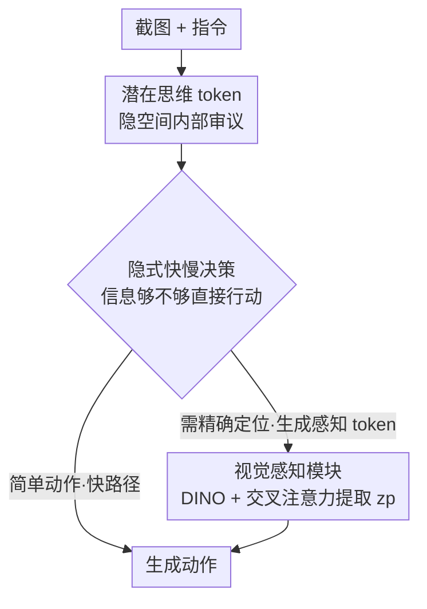

# iSHIFT: Lightweight Slow-Fast GUI Agent with Adaptive Perception

**会议**: CVPR 2026  
**论文**: [CVF Open Access](https://openaccess.thecvf.com/content/CVPR2026/html/Mehrotra_iSHIFT_Lightweight_Slow-Fast_GUI_Agent_with_Adaptive_Perception_CVPR_2026_paper.html)  
**代码**: 有（论文称已开源，CVF 正文未给出具体链接）  
**领域**: GUI Agent / 多模态VLM  
**关键词**: GUI 智能体, 慢快推理, 隐式思维 token, 自适应感知, 视觉定位

## 一句话总结
iSHIFT 是一个仅 2.5B 参数的多模态 GUI 智能体，让模型**自己用 token 生成**来决定要不要进入"慢思考"——简单动作（滑动）走轻量快路径，需要精确点击小图标时才临时调起一个 DINO 视觉感知模块做细粒度定位，从而在小模型尺寸下逼平 18B 级 SOTA 的准确率。

## 研究背景与动机

**领域现状**：用多模态大模型（MLLM）直接看屏幕截图、像人一样从像素生成操作（点击/滑动/输入），正在取代早期依赖 HTML / DOM / 无障碍树（AXTree）的结构化方案——后者跨平台泛化差、运行时常拿不到结构信息。

**现有痛点**：纯像素方案有两个老毛病。一是**感知重**：为了认清密集的小图标和文字，很多方法常驻 OCR / 分割 / 高分辨率编码器，连最简单的"滑一下"都要付出全套感知开销，延迟和算力成本居高不下。二是**缺乏自适应资源分配**：绝大多数 GUI 智能体对所有动作一视同仁，无视 UI 交互天然的二分性——滑动这类**快动作**靠全局上下文就能做对，而点击小按钮这类**慢动作**才真正需要深思和高精定位。结果就是简单任务上浪费算力、困难任务上推理不够。

**核心矛盾**：效率和精度之间的 trade-off。已有的慢快（slow-fast）方案虽然承认"不是所有任务都需要同等算力"，但实现方式都引入了新的复杂度：要么靠一个**外部控制器**来仲裁走快路还是慢路（多一个模块、多一处延迟、多一个失效点），要么像近期 GUI 工作那样在慢路上**先生成显式中间表示**（图标 caption、界面摘要）再行动——这又把定位精度绑死在生成文本的质量上，还带来生成延迟。它们都证明了"自适应计算"有用，却暴露出真正缺的是一个**统一且隐式**的控制机制。

**本文目标 + 核心 idea**：把"该不该慢思考"和"该不该调精细感知"这两个决策**原生内嵌进同一个 MLLM**，不要外部控制器、不要生成冗长中间文本。核心 idea 一句话：**让模型用生成特殊 token 这件事本身，来隐式地决定"何时深想、看哪里"**——靠潜在思维 token（latent thinking）做非语言的内部审议，靠一个按需触发的感知 token 临时激活轻量局部视觉模块。

## 方法详解

### 整体框架
iSHIFT 以 Qwen2-VL 2B 为底座，输入是 UI 截图 + 文本指令，输出是一个动作。它**默认走快路径（Fast Path）**：先用一段潜在思维 token（`<bot>...<eot>`）在隐空间里做内部审议，评估"当前信息够不够直接行动"。这一步的产物不是文字，而是隐藏状态——模型据此做出一个**隐式的快慢决策**：如果任务简单（如滑动），直接生成动作；如果需要高精度（如点击小图标），模型转而生成一组**潜在感知 token**（`<bop>, <ctrl>, <eop>`），这相当于一个开关，把流程**临时绕道**进慢路径（Slow Path）——用 DINO 编码器重新提取局部细粒度视觉特征 $z_p$、注入回序列，再生成动作。整条快慢切换是端到端学出来的，靠的是训练时对动作按"是否需要精确坐标"做的程序化标注。

### 关键设计

**1. 隐式慢快控制：让 token 生成本身充当"要不要深思"的开关**

这是 iSHIFT 的中枢创新，针对的是"已有慢快方案都靠外部控制器仲裁"这个痛点。iSHIFT 不设任何外部裁判，决策完全发生在模型**下一步生成什么 token** 上（见 Algorithm 1）：模型默认在快路径里跑，做完潜在审议后，若内部判断信息充足就直接吐动作；若判断需要高精度，就生成 `<bop>` 这个感知 token——`<bop>` 的出现就是激活慢路径的显式信号。关键在于这不是"重启",而是一次**条件绕道**：慢路径只做特征增强（调 VPM 提 $z_p$ 并注入序列），然后回到主序列继续生成动作。这样推理深度和视觉精细度被**紧耦合进统一架构的隐藏状态**里，省掉了外部模块带来的额外延迟与失效点，也避免了"先生成界面摘要再行动"那种把定位精度绑死在文本质量上的做法。

**2. 潜在思维 token（LTT）：在隐空间里"想"，而不是把思考写成话**

GUI 任务对响应速度敏感，而思维链（CoT）那种显式生成自然语言的审议会带来大量推理延迟。iSHIFT 借鉴 Coconut 式的连续潜在思考，引入 `<bot>` / `<eot>` 标记一段连续思维块：在这段块里，模型把隐藏状态**直接变成下一步的输入嵌入，完全绕过词表层**（不解码成任何语言 token），从而以远少于显式 CoT 的步数完成更深的表征流转。这段潜在审议正是触发慢路径的那个"内部决策器"。它的训练有个巧妙的两阶段做法：先在小数据集上把思维位置 `<bot>...<eot>` 填上**显式自然语言思考**，教会模型该在这里想什么、怎么生成；学好后再把显式思考**替换成潜在思维 token**，给模型一个强先验。因为最终思考是潜在表示而非文字，扩到约 50× 大的数据集时**无需任何额外思维标注**，可扩展性很好。消融里 8 个潜在 token 最优（76.34），4 个 75.72，再加到 16/20 反而掉到 74.09/74.04——思维块长度是个敏感超参，想太多会稀释上下文焦点。

**3. 视觉感知模块（VPM）：只在需要时临时点亮的局部高精定位引擎**

这是慢路径的发动机，针对"常驻高分辨率/OCR 感知栈太重"的痛点。被 `<bop>` 激活后，VPM 用 DINO 视觉编码器把图像重新编码成信息更丰富的特征图 $F_{img}$，再让这些视觉特征与潜在感知 token 的隐藏状态 $h_{ctrl}$ 做**交叉注意力**聚合关键视觉细节。具体地，图像特征当 Query、感知 token 隐状态当 Key/Value：

$$Q = \text{Linear}_Q(F_{img}); \quad K, V = \text{Linear}_{K,V}(h_{ctrl})$$
$$z_p = \text{softmax}\!\left(\frac{QK^\top}{\sqrt{d_k}}\right)V + F_{img}$$

得到的上下文嵌入 $z_p$ 注回 MLLM 序列，提供精确定位所需的细粒度控制。与 CogAgent、V-Zen 这类把高分辨率模块**常驻**因而参数暴涨的方案不同，VPM 更轻、且**仅在必要时激活**，所以 iSHIFT 能在不堆参数的前提下拿到高精度。消融印证了交叉注意力是关键：去掉它后慢路径只能退化到粗糙的全局 DINO 特征，AMS 从 76.34 掉到 73.40。

### 损失函数 / 训练策略
整个慢快条件流程是端到端学出来的，靠一步**数据集增强**：按动作的感知需求程序化地给训练数据打标。凡是需要预测精确坐标的动作（如点击某个 UI 元素）标为**慢动作**，其 prompt 标签里被插入潜在感知 token（`<bop>, <ctrl>, <eop>`），让模型学会"看到这串 token 就去调 VPM 取额外上下文"；凡是靠全局上下文就能推断的动作（如滑动）标为**快动作**，按快路径走、绕过 VPM。这套映射给模型提供了"任务类型 ↔ 是否生成 `<bop>` 激活慢路径"的监督信号。配合关键设计 2 里 LTT 的两阶段训练（先显式思考、后替换为潜在 token），无需为大规模数据补思维标注。

## 实验关键数据

### 主实验
在 Android In The Wild（AITW）上以 Action Matching Score（AMS）评测，iSHIFT 以 2.5B 取得 76.34% 平均分，是 <5B 类别的 SOTA，且与 18B 的 CogAgent（76.88%）仅差 0.54 分。

| 数据集 / 子集 | 指标 | iSHIFT (2.5B) | <5B 对比 | >5B 最优 |
|--------|------|------|----------|----------|
| AITW General | AMS | **70.6** | ShowUI 2B 63.9 | — |
| AITW Install | AMS | **80.82** | AutoGUI 76.89 | — |
| AITW Single | AMS | **86.03** | AutoGUI 84.58 | CogAgent 93.49 |
| AITW WebShop | AMS | **72.60** | AutoGUI 70.26 | SphAgent 74.0 |
| AITW Google Apps | AMS | 71.64 | TongUI 3B 74.5 | SeeClick 75.9 |
| **AITW 平均** | AMS | **76.34** | AutoGUI 4.5B 74.27 | CogAgent 18B 76.88 |
| Android Control (Low) | AMS | **87.7** | OS-Atlas 4B 80.64 | OS-Atlas 7B 85.22 |
| Android Control (High) | AMS | 65.6 | OS-Atlas 4B 67.54 | OS-Atlas 7B 71.17 |
| GUI Odyssey | SR | **73.97** | OS-Atlas 4B 56.39 | Aguvis 7B 63.8 |
| GUIAct Web Single | Type/SR | **93.83** / 66.38 | GUICourse 3.1B 91.8 | GUICourse 9.6B 90.9 |
| GUIAct Phone | Type/SR | **79.41** / **60.08** | GUICourse 3.1B 71.7 | GUICourse 9.6B 73.0/58.1 |

效率维度（准确率/参数量）上 iSHIFT 平均 30.54，是 18B CogAgent（≈4.27）的 5 倍多。

### 消融实验（AITW，AMS）

| 配置 | VPM | LTT | Slow | Fast | AMS | 说明 |
|------|-----|-----|------|------|-----|------|
| Base (Qwen2-VL 2B) | × | × | × | ✓ | 67.24 | 裸底座 |
| w/ Fast Path Only (仅 LTT) | × | ✓ | × | ✓ | 72.54 | +5.30，潜在审议本身有效 |
| w/ VPM, Slow Only | ✓ | × | ✓ | × | 72.71 | +5.47，VPM 本身有效 |
| w/ VPM, Adaptive (非 LTT 决策) | ✓ | × | ✓ | ✓ | 75.48 | 开启路径切换 +2.77 |
| w/ VPM+LTT, Slow Only | ✓ | ✓ | ✓ | × | 74.58 | 强制只走慢路反而更低 |
| w/o Cross-Attention in VPM | ✓ | ✓ | ✓ | ✓ | 73.40 | 去交叉注意力掉 2.94 |
| **iSHIFT (Full)** | ✓ | ✓ | ✓ | ✓ | **76.34** | 完整模型 |

### 关键发现
- **路径切换贡献最大**：从"仅慢路 72.71"到"自适应 75.48"涨 +2.77，是单项最大增益；LTT 驱动的决策再贡献 +0.86 到 76.34。
- **"全程慢"反而更差也更慢**：强制只走慢路只有 74.58，且 Table 5 显示自适应版（General 2229ms / 70.6）比纯慢版（2331ms / 68.2）**又快又准**——给所有动作无差别塞局部视觉，会让注意力发散、把简单动作误分类（如把 Click 误判成 Task Complete）。复杂点击动作上，自适应版与 GT 的动作类型偏差仅 2.4%，纯慢版高达 8.9%。
- **交叉注意力是 VPM 的命门**：去掉后慢路退化为粗糙全局 DINO 特征，掉到 73.40。
- **潜在 token 数是敏感超参**：8 个最优（76.34），过多（16/20）反而降到 74 左右。

## 亮点与洞察
- **把"控制器"消解成 token 生成**：最让人"啊哈"的是不再外挂一个 router/controller，而是让模型生成 `<bop>` 这件事本身既是"决策"又是"动作"——决策被嵌进隐藏状态，零额外模块、零额外失效点。这个"用生成行为当控制信号"的思路可迁移到任何需要条件计算的 agent（如工具调用、检索触发）。
- **隐式审议 + 按需感知的协同**：LTT 负责"想多深"、感知 token 负责"看多细"，两者由同一段潜在过程统一触发，避免了"想"和"看"被拆到两个子系统。
- **两阶段潜在思维训练**：先用显式自然语言思考"冷启动"教模型该想什么，再替换成潜在 token，解决了潜在 CoT 难监督、扩数据要标注的问题——这是把 Coconut 落到实际 agent 训练的实用配方。
- **"更多算力 ≠ 更好"的反直觉证据**：Table 5 直接量化了过度感知带来的注意力发散，给"自适应"提供了机理级（注意力图）而非仅指标级的证据。

## 局限与展望
- **慢/快标注靠启发式规则**："需要精确坐标 = 慢动作"是程序化打标，对于介于两者之间的动作（如大按钮点击、含歧义的滑动）可能误标，限制了决策粒度；更细的复杂度估计或可学习的标注或许更好。
- **High-level 子集仍非最强**：Android Control (High) 上 65.6 略逊于 OS-Atlas 4B 的 67.54，说明在长程/高抽象规划上紧凑模型仍有差距，慢快机制更偏"单步精确定位"而非"多步规划"。
- **感知模块单一**：慢路径只用 DINO 提局部特征，对极小文字/重叠元素是否够用未充分验证；可探索可切换的多粒度感知后端。
- **细节在 Supplementary**：LTT 训练细节、延迟测量条件等放在补充材料，正文给出的运行时数字（~2200ms）量级偏大，实际部署收益需结合具体硬件评估。

## 相关工作与启发
- **vs 外部控制器式慢快（如通用视觉 agent 的 router）**：他们用一个独立模块仲裁快慢路，带来模块复杂度、延迟和失效点；iSHIFT 把决策内嵌为 token 生成，统一在一个 MLLM 里，更简洁。
- **vs 生成中间表示式 GUI 慢路（先生成图标 caption / 界面摘要再行动）**：那类方法把定位精度绑在生成文本质量上、且有生成延迟；iSHIFT 在隐空间审议、不生成冗长文本，慢路只做特征增强。
- **vs CogAgent / V-Zen（常驻高分辨率感知）**：它们靠常开的高分模块换精度、参数暴涨（18B）；iSHIFT 的 VPM 仅按需激活且更轻，2.5B 即可逼平。
- **vs 显式思维链 GUI agent（ReAct / 生成 thought）**：显式 NL 生成冗长、推理慢；iSHIFT 用潜在思维 token 做非语言审议，省下生成延迟。

## 评分
- 新颖性: ⭐⭐⭐⭐ "用 token 生成本身当慢快开关、消解外部控制器"是清晰且实用的新组合，但 LTT（Coconut）与感知 token 均有前作。
- 实验充分度: ⭐⭐⭐⭐ 覆盖 4 个 GUI benchmark + 完整组件消融 + 延迟/注意力分析，机理证据扎实；High-level 规划与开放环境验证略缺。
- 写作质量: ⭐⭐⭐⭐ 动机推导清楚、消融解读到位，Algorithm 1 与图 2 让流程可复述。
- 价值: ⭐⭐⭐⭐ 2.5B 逼平 18B、效率 5×，对端侧/移动 GUI agent 落地有直接参考价值。

<!-- RELATED:START -->

## 相关论文

- [\[ACL 2025\] Browsing Like Human: A Multimodal Web Agent with Experiential Fast-and-Slow Thinking](../../ACL2025/llm_agent/browsing_like_human_a_multimodal_web_agent_with_experiential_fast-and-slow_think.md)
- [\[CVPR 2026\] AdapAction: Adaptive Target Action Backdoor Attack against GUI Agents](adapaction_adaptive_target_action_backdoor_attack_against_gui_agents.md)
- [\[CVPR 2026\] MMBench-GUI: A Unified Hierarchical Evaluation Framework for Multi-Platform GUI Agents](mmbench-gui_a_unified_hierarchical_evaluation_framework_for_multi-platform_gui_a.md)
- [\[ACL 2026\] Towards Scalable Lightweight GUI Agents via Multi-role Orchestration](../../ACL2026/llm_agent/towards_scalable_lightweight_gui_agents_via_multi-role_orchestration.md)
- [\[ACL 2026\] Lightweight LLM Agent Memory with Small Language Models](../../ACL2026/llm_agent/lightweight_llm_agent_memory_with_small_language_models.md)

<!-- RELATED:END -->
