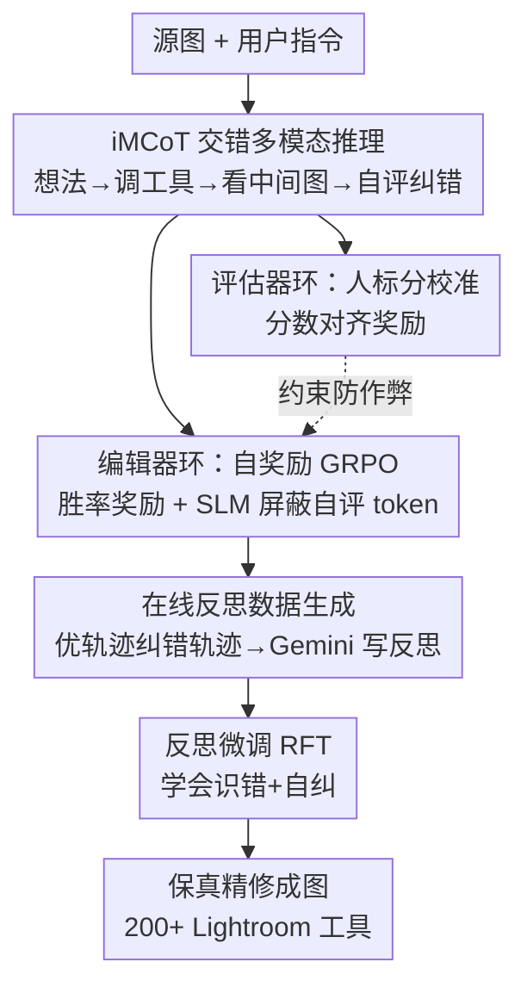

# JarvisEvo: Towards a Self-Evolving Photo Editing Agent with Synergistic Editor-Evaluator Optimization

**会议**: CVPR 2026  
**论文**: [CVF Open Access](https://openaccess.thecvf.com/content/CVPR2026/html/Lin_JarvisEvo_Towards_a_Self-Evolving_Photo_Editing_Agent_with_Synergistic_Editor-Evaluator_CVPR_2026_paper.html)  
**代码**: [项目页 jarvisevo.vercel.app](https://jarvisevo.vercel.app/)  
**领域**: Agent / 图像编辑 / 强化学习  
**关键词**: 图像编辑 Agent, 交错多模态 CoT, 自奖励 RL, reward hacking, 编辑器-评估器协同

## 一句话总结
JarvisEvo 把"会修图的设计师"做成一个单模型 Agent：它一边调用 Lightroom 工具迭代修图、一边对中间结果做视觉自评、再据此反思纠错，并用一套"编辑器自奖励 + 评估器人标校准"的双环 RL（SEPO）让它**不靠外部奖励模型就能自进化**，在 ArtEdit-Bench 上像素保真度比 Nano-Banana 高 44.96%。

## 研究背景与动机
**领域现状**：指令式图像编辑（GPT-Image-1、Nano-Banana、Qwen-Image-Edit）擅长创意合成，另一条线是 Agent 式工具编辑器（JarvisArt、MonetGPT），用 Lightroom 这类**保真工具**做专家级精修，不破坏原图内容。后者更适合"修图"而非"重画"。

**现有痛点**：Agent 式编辑有两个顽疾。其一是**指令幻觉**——现有方法用纯文本 CoT 增强指令理解，但模型只在开头编码一次源图，推理过程中**看不到中间编辑结果**，于是"我以为这样调会变暖"这种文本假设始终没拿真实视觉反馈去验证，导致输出跑偏。其二是 **reward hacking**——用 RL 对齐人类偏好时，奖励模型在训练中是**静态**的、策略却一直更新，策略很容易钻奖励函数的空子刷高分却不真正变强；离线奖励校准又昂贵、要大量人标，且改不了"奖励模型训练中不能更新"这个根因。

**核心矛盾**：文本 CoT 缺少"边改边看"的闭环视觉反馈；而引入自评分当奖励又会让模型**自欺**（self-deception）——自己给自己打高分，越训越离谱。一句话：既想让模型自己评、又怕它自己骗自己。

**本文目标**：(1) 给推理过程接入视觉反馈，让每一步编辑都被真实中间图验证；(2) 让模型在没有外部奖励模型的情况下自进化，同时不被自奖励带崩。

**切入角度**：像人类修图师那样工作——改一步、看一眼效果、评估好坏、发现问题再回头纠正。把"编辑"和"评估"两个能力放进**同一个模型**，让评估能力反过来约束编辑能力的优化。

**核心 idea**：用**交错多模态 CoT（iMCoT）**建立"感知-动作"闭环代替纯文本 CoT；用 **SEPO 双环 RL**——编辑器用自评分自奖励、评估器用人标数据持续校准——在自进化的同时把 reward hacking 摁住。

## 方法详解

### 整体框架
JarvisEvo 基于 Qwen3-VL-8B，输入一张源图 + 用户指令，输出经多步保真编辑后的成图。推理时它跑一条 iMCoT 轨迹：生成文本"想法"→ 调编辑工具产出中间图 → 把中间图拼回上下文 → 看着真实结果做自评/反思 → 决定下一步，直到给出最终自评分。训练分三阶段：Stage 1 冷启动 SFT（150K 样本，建立多模态推理/工具调用/自评语法）；Stage 2 用 SEPO 强化学习从"模仿"走向"自主"，**编辑器环**用自评分当内在奖励、**评估器环**用人标分校准；Stage 3 用 SEPO 过程中在线攒下来的 5K 反思样本做 RFT，强化错误检测与自纠。三者的关系是：iMCoT 提供"边改边看"的轨迹结构，SEPO 让这条轨迹越走越好且不作弊，RFT 把"摔过的跟头"沉淀成反思能力。

### 关键设计

**1. 交错多模态 CoT（iMCoT）：让推理过程"边改边看"而不是闭眼猜**

纯文本 CoT 的死穴是源图只在开头编码一次，后续每一步推理都是对"如果这样调会怎样"的语言假设，从不拿真实编辑结果去核对，于是模型对色彩/明暗的判断和实际像素脱节。iMCoT 把视觉反馈插进推理的每一步：模型先用文本提出假设（`<think>` 先建立金色时刻的暖调基底），再用 `<tool_call>` 调全局/局部编辑工具**真正生成一张中间图**，然后把这张图拼回轨迹、用后续文本反思"这张图过曝了吗、主体够不够亮"，据此决定下一步。一条轨迹形式化为 $\tau^{edit} = \{(I, Q); ([C_0, T_0, O_0], \dots, [C_t, S_{pred}])\}$，其中 $C$ 是文本推理、$T$ 是工具调用、$O$ 是执行后的中间图、$S_{pred}$ 是最终自评。这等于把"生成文本→造图验证→再生成文本反思"做成一个闭合的感知-动作循环，决策有了真实视觉锚点，幻觉和跑偏自然减少（消融里 iMCoT 把 L2 从 33.41 降到 21.38）。

**2. SEPO 编辑器环：自评分变内在奖励，配 SLM 防止"自己抄自己答案"**

要让模型脱离外部奖励模型自进化，最直接的做法是让它给自己的编辑结果打分、拿这个分当 RL 奖励。但绝对分数不稳，作者改用**成对胜率**：对同一输入采样 $G$ 条轨迹，每条有自评分 $s_i^{pred}$，把绝对分转成相对奖励 $R_{pp}(\tau_i^{edit}) = \frac{1}{G-1}\sum_{j \neq i} \mathbb{I}(s_i^{pred} > s_j^{pred})$，即"这条轨迹打败了组内多少条"。总奖励 $R_{edit} = R_f + R_{ta} + R_{pp} \in [0,3]$ 还含格式奖励和工具准确性奖励，再用 GRPO 优化。关键的防作弊机制是**选择性损失屏蔽（SLM）**：自评 token $S_{pred}$ 既参与生成奖励、又在同一条轨迹里，如果让它进损失计算，模型会发现"把自评写高"比"真改好图"更省力，于是产生**自奖励信息泄漏**，直接训崩。SLM 把自评 token 从损失里剔除，断了这条捷径——消融显示去掉 SLM 后 L2 从 12.84 飙到 43.75，自评分一路狂涨而真实编辑质量暴跌，正是泄漏导致的优化坍塌。

**3. SEPO 评估器环：用人标分持续校准评估器，反过来给编辑器"测谎"**

只有编辑器自评还不够——评估器本身会漂、会自欺。于是同一个模型还跑第二个环：用人工标注的评估集 $\langle I, Q, H, S_{tgt} \rangle$（$H$ 是完整编辑轨迹、$S_{tgt}$ 是人标分）训练评估能力。奖励是**分数对齐奖励** $R_{sa}(\tau_i^{eval}) = \exp\!\left(-\frac{1}{2}\frac{|s_i^{pre} - s_i^{tgt}|}{\sigma}\right) + \epsilon$（$\sigma=0.5$ 控容错），让模型预测分逼近人类判断；总奖励 $R_{eval} = R_f + R_{sa} \in [0,2]$。两个环共享同一个模型、且评估器输入与编辑器生成上下文严格对齐（context-preserving），所以评估器变准 = 编辑器自评的奖励信号变可信，等于给编辑器环装了个"人类校准过的测谎仪"。消融里去掉评估器环，编辑器自评分慢慢虚高、成对偏好奖励却下滑、整体质量掉（L2 从 12.84 涨到 29.33），正是缺校准导致的自欺与 reward hacking。

**4. 在线反思数据生成 + RFT：把"摔过的跟头"自动变成训练样本**

光会编辑会评估还学不会"发现自己错了并改正"。作者在编辑器环训练时挂了一条**在线反思管线**：当某条轨迹的自评分 $s_0^{pred}$ 超过另一条 $s_3^{pred}$ 时，就把高分轨迹当"正确路径"、低分轨迹当"错误路径"，喂给 Gemini-2.5-Pro（输入源图、指令、错图 $O_3$、对图 $O_0$）生成一段反思理由 $R_{3\to0}$，组成反思轨迹 $\tau^{reft} = \{(I,Q); ([H_3, S_3^{pre}], [R_{3\to0}, T_{0,0:t}, O_{0,t}])\}$，其中 $H_3$ 是错误编辑历史、$T_{0,0:t}$ 是正确工具序列、$O_{0,t}$ 是目标图。这些样本在 Stage 3 做 RFT，让模型学会"识别错误→反思更优策略→调整工具用法"。妙在数据是**on-policy** 自动攒出来的——模型自己的优劣对比构成监督，不用额外人标，且反思内容直接对应它真实犯过的错。

### 一个完整示例
以一张冷调逆光情侣照、用户要"温暖梦幻的金色夕阳感"为例走一遍：模型先 `<think>` 规划"先铺暖色基底、把绿色往黄移、压亮天空、提暗部"，调**全局工具**产出第一版中间图；自评时它看到结果——"暖光氛围有了，但黄色饱和过头、风景假"，给出 Aesthetic 1.9 / Instruction 4.3；接着反思"我把白平衡和饱和度推太狠了，应该用**局部**调整给人物皮肤去饱和、稍微降温，让人物'发光'而不发黄"，于是调**局部工具**纠正。若这条纠正后的轨迹自评分高于先前那条，这对"错→对"就被反思管线抓去生成训练样本。整个过程是改一步看一眼、自评打分、反思回纠的闭环，而不是一次性盲生成。

### 损失函数 / 训练策略
三阶段：Stage 1 SFT 基于 Qwen3-VL-8B，150K 样本（110K 编辑 + 40K 评估），2 epoch、bs=2、lr=1e-5（LLaMA-Factory）；Stage 2 SEPO RL（vlm-r1 框架），编辑器环 10K 指令 + 评估器环 10K 评估，1 epoch、bs=1、lr=1e-6、每 query 采 4 条；Stage 3 RFT 用 5K 在线反思样本，1 epoch、lr=5e-6。两个环都用 GRPO 目标 $J_{GRPO}$，优势 $A_{i,j} = \frac{r_i - \text{mean}(\{r_i\})}{\text{std}(\{r_i\})}$。全程 32×A100。工具侧通过 A2L 协议接入 200+ Lightroom 精修工具。

## 实验关键数据

### 主实验
ArtEdit-Bench-Lr（800 样本：400 英文 + 400 中文），L1/L2 测像素保真（越低越好），SC/PQ/O 由 GPT-4o 打 0–10（越高越好）：

| 数据集 | 方法 | L1×10² ↓ | L2×10³ ↓ | SC ↑ | PQ ↑ | O ↑ |
|--------|------|----------|----------|------|------|-----|
| 英文 | Nano-Banana（商用） | 11.54 | 28.34 | 8.33 | 8.92 | 8.59 |
| 英文 | GPT-Image-1（商用） | 21.20 | 82.77 | 8.45 | 8.02 | 8.21 |
| 英文 | UniWorld-v1 | 11.79 | 29.40 | 8.34 | 8.69 | 8.49 |
| 英文 | **JarvisEvo** | **7.82** | **12.45** | **8.53** | **9.03** | **8.77** |
| 中文 | Nano-Banana（商用） | 11.46 | 27.39 | 8.35 | 8.99 | 8.64 |
| 中文 | **JarvisEvo** | **7.63** | **11.54** | **8.54** | **9.04** | **8.76** |

在 ArtEdit-Bench-Lr 上 JarvisEvo 五项指标平均超 Nano-Banana 18.95%，内容保真（L1/L2）平均提升 44.96%——这正是 Lightroom 保真工具相对"重画式"生成模型的核心优势。

评估能力（ArtEdit-Bench-Eval，与人类评分的相关性）：

| 方法 | SRCC ↑ | PLCC ↑ |
|------|--------|--------|
| Gemini-2.5-Flash | 0.6188 | 0.6441 |
| Qwen3-VL-256B-A22B | 0.5706 | 0.5650 |
| VisualQuality-R1（IQA 专模） | 0.5645 | 0.5018 |
| **JarvisEvo** | **0.7243** | **0.7116** |

JarvisEvo 的自评能力超过专用 IQA 模型和更大的通用 MLLM，说明评估器环确实把"会评估"练出来了。人类偏好研究（30 人、200 样本成对比较）中 JarvisEvo 细粒度编辑胜率 49%，比 Nano-Banana（28%）高 21 个点。

### 消融实验

| 配置 | L1×10² ↓ | L2×10³ ↓ | O ↑ | 说明 |
|------|----------|----------|-----|------|
| SFT only | 9.97 | 19.84 | 8.26 | 仅冷启动 |
| + SEPO w/o 评估器环 | 12.43 | 29.33 | 7.78 | 缺校准→自欺、reward hacking |
| + SEPO w/o SLM | 14.35 | 43.75 | 7.40 | 自奖励泄漏→训练崩 |
| + SEPO w/o SLM & 评估器环 | 17.51 | 59.67 | 7.25 | 双缺→快速坍塌 |
| + Full SEPO | 8.25 | 12.84 | 8.54 | 完整双环 |
| + Full SEPO + RFT | **7.72** | **11.98** | **8.76** | 加反思微调最佳 |
| Text-only CoT | 12.78 | 33.41 | 8.04 | 纯文本推理 |
| iMCoT | 10.98 | 21.38 | 8.25 | 多模态推理 |

### 关键发现
- **SLM 是防崩的命门**：去掉 SLM，L2 从 12.84 暴涨到 43.75、自评分一路虚高但真实质量崩——自奖励信息泄漏会让模型"刷自评分"而非"改好图"。
- **评估器环是 reward hacking 的解药**：去掉评估器校准，编辑器自评分慢慢偏高、偏好奖励下滑、整体掉点；两者都去掉则系统快速坍塌（L2=59.67），证明自评分必须被人标持续校准才可信。
- **iMCoT 显著优于纯文本 CoT**：L2 从 33.41 降到 21.38，验证"边改边看"的视觉反馈对编辑决策不可或缺。
- 作者补充：即便换用更强的 Gemini-2.5-Pro 当 LLM-as-judge 奖励，reward hacking 依然存在——说明问题出在"静态奖励 vs 动态策略"的结构错配，而非裁判不够强。

## 亮点与洞察
- **把"编辑器"和"评估器"压进同一个模型并让它们互相制衡**：评估器越准 → 编辑器的自奖励越可信 → 编辑器越强；同时人标只用来训评估器、不直接训编辑器，既省标注又把人类偏好以"测谎仪"形式注入。这种"自奖励 + 外部校准"的双环范式可迁移到任何缺乏可验证奖励的开放式生成任务（如设计、写作）。
- **SLM 这一刀很关键**：当奖励信号和被优化的输出共享 token 时，必须把奖励 token 从损失里剔除，否则模型会走"伪造奖励"的捷径。这是自奖励 RL 里一个普适且容易被忽视的工程要点。
- **on-policy 反思数据生成**：用模型自己的优劣轨迹对比 + 强模型写反思，把失败自动转成"识错-纠错"训练样本，几乎零额外人标地教会模型自我修正。
- 选保真编辑（Lightroom 工具）而非重画，是 L1/L2 大幅领先的根因——对"修图"这个任务，工具式 Agent 在内容保真上结构性优于扩散重绘。

## 局限与展望
- 强依赖 Lightroom 的 200+ 工具与 A2L 协议，能力被工具集天花板限制，做不了工具覆盖不到的编辑（如复杂内容增删、生成式补全）。
- 反思数据生成要调用外部强模型 Gemini-2.5-Pro，并非完全自给自足；反思质量受裁判模型影响。
- 评估器环仍需人标评估集（10K + 50K ArtEdit-Eval），"无外部奖励"是指 RL 中无外部奖励模型，但人类偏好仍以标注形式进入了评估器训练。
- 训练成本高（32×A100、三阶段），自评分胜率奖励对组内采样数 $G$、$\sigma$ 等超参的敏感性文中未充分展开。
- ArtEdit-Bench 主要是双语精修场景，跨域（医学、遥感等专业图像）泛化性未验证。

## 相关工作与启发
- **vs JarvisArt / MonetGPT（工具式编辑 Agent）**：同样用 Lightroom 保真工具，但它们没有"边改边看"的视觉闭环，也没有自进化 RL；JarvisEvo 用 iMCoT 补上视觉反馈、用 SEPO 把编辑+评估一起练，主结果与评估能力都更强。
- **vs RLHF**：RLHF 靠昂贵静态奖励模型、易被 reward hacking；JarvisEvo 用编辑器自奖励替代外部奖励模型，再用评估器环动态校准，绕开静态奖励的结构缺陷。
- **vs RLIF（从内部反馈学习）**：纯 RLIF 易自欺、过自信、训练坍塌；SEPO 是 RLIF（自奖励）+ RLVR（人标可验证奖励）的混合双环，用 RLVR 的可验证反馈兜住 RLIF 的自欺。
- **vs 纯文本 CoT 视觉生成**：受 OpenAI-o3"think with images"启发，把视觉反馈插进每一步推理，解决文本 CoT 的信息瓶颈。

## 评分
- 新颖性: ⭐⭐⭐⭐⭐ 编辑器-评估器同模型双环自进化 + SLM 防泄漏 + on-policy 反思，把"自奖励却不自欺"这条难路走通了。
- 实验充分度: ⭐⭐⭐⭐ 主结果/评估能力/人类偏好/消融齐全，双语 benchmark 扎实；跨域泛化与超参敏感性略欠。
- 写作质量: ⭐⭐⭐⭐ 动机-机制-消融对得很紧，三个失败配置清楚解释了每个组件为何必需。
- 价值: ⭐⭐⭐⭐⭐ 给"无外部奖励的开放式生成自进化"提供了可复用范式，对图像编辑落地（保真精修）也有直接价值。

<!-- RELATED:START -->

## 相关论文

- [\[ICML 2026\] Self-evolving LLM agents with in-distribution Optimization](../../ICML2026/llm_agent/self-evolving_llm_agents_with_in-distribution_optimization.md)
- [\[ACL 2026\] SEARL: Joint Optimization of Policy and Tool Graph Memory for Self-Evolving Agents](../../ACL2026/llm_agent/searl_joint_optimization_of_policy_and_tool_graph_memory_for_self-evolving_agent.md)
- [\[CVPR 2026\] REALM: An MLLM-Agent Framework for Open World 3D Reasoning Segmentation and Editing on Gaussian Splatting](realm_mllm_agent_3d_reasoning_gaussian.md)
- [\[ICLR 2026\] InfiAgent: Self-Evolving Pyramid Agent Framework for Infinite Scenarios](../../ICLR2026/llm_agent/infiagent_self-evolving_pyramid_agent_framework_for_infinite_scenarios.md)
- [\[CVPR 2026\] History to Future: Evolving Agent with Experience and Thought for Zero-shot Vision-and-Language Navigation](history_to_future_evolving_agent_with_experience_and_thought_for_zero-shot_visio.md)

<!-- RELATED:END -->
