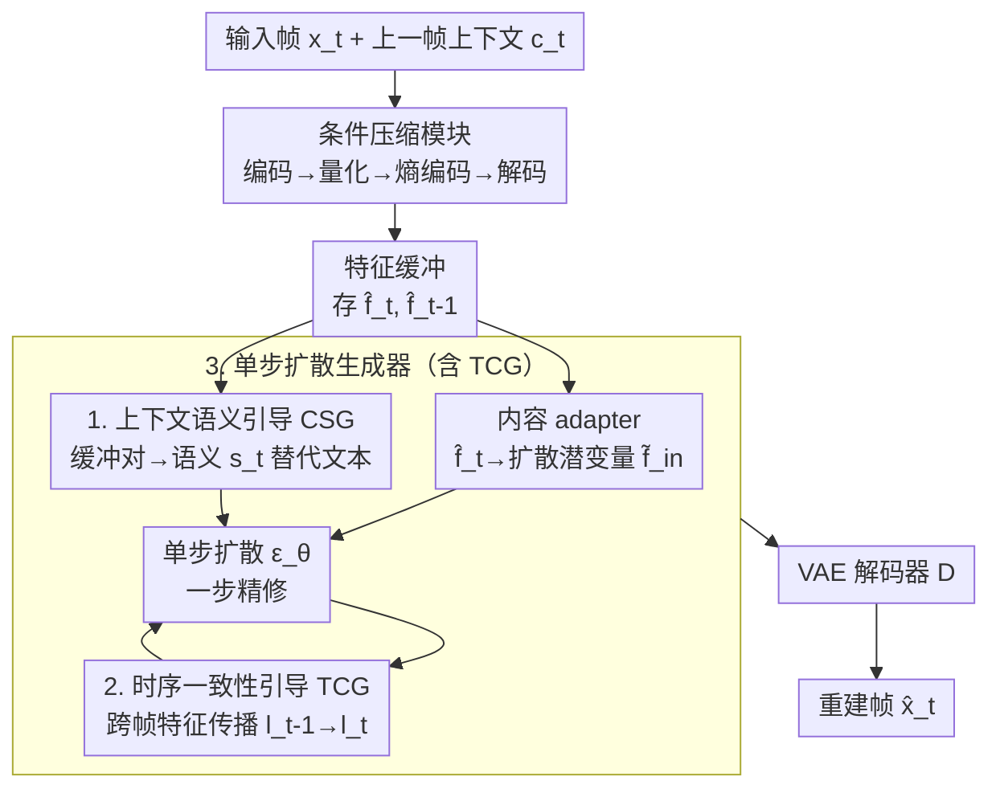

# Single-step Diffusion-based Video Coding with Semantic-Temporal Guidance

**会议**: CVPR 2026  
**论文**: [CVF Open Access](https://openaccess.thecvf.com/content/CVPR2026/html/Xue_Single-step_Diffusion-based_Video_Coding_with_Semantic-Temporal_Guidance_CVPR_2026_paper.html)  
**代码**: [项目页](https://onedc-codec.github.io/s2vc/)（代码暂未确认）  
**领域**: 神经视频压缩 / 扩散模型 / 低层视觉  
**关键词**: 神经视频编码, 单步扩散, 感知压缩, 语义引导, 时序一致性

## 一句话总结
S2VC 把一个**单步扩散生成器**塞进条件视频编码框架，用从解码特征缓冲里抽取的「上下文语义引导（CSG）」替代文本 prompt、再用插进 U-Net 的「时序一致性引导（TCG）」做跨帧对齐，在 0.02 bpp 以下的极低码率下拿到 SOTA 感知质量，相比上一代感知编解码器平均省 51.62% 码率（DISTS BD-Rate）。

## 研究背景与动机

**领域现状**：神经视频编解码器（NVC，以 DCVC 系列为代表）已在率失真（RD）性能上超过 VVC，但它们大多以 MSE / MS-SSIM 这类客观失真为优化目标，在极低码率下输出明显发糊、过平滑。为了改善观感，一类工作引入感知损失 + GAN（如 PLVC），另一类直接拿预训练图像扩散模型当帧重建器（如 I2VC、DiffVC）。

**现有痛点**：GAN 路线受限于模型容量和训练规模，低码率下仍有可见伪影；扩散路线画质好但有两个硬伤——(1) **多步采样太贵**，对单张图就慢，放到逐帧视频里采样成本被帧数放大到不可接受；(2) 现有扩散编解码器还停留在**相对高的码率**区间，而那个区间传统/神经方法本来就够用了，扩散先验的价值发挥不出来。

**核心矛盾**：扩散先验能带来真实细节，但「多步采样的高复杂度」与「视频需要逐帧编码」天然冲突；同时扩散模型靠文本 prompt 引导，而**固定 prompt 不能随内容自适应、生成 caption 又表达不出细粒度空间语义**——视频编码场景里没有现成的、又稳又细的语义条件可用。

**本文目标**：把扩散视频编解码器同时往「更低码率」和「更少采样步数」两个方向推，并解决随之而来的两个子问题：(a) 单步扩散下怎么给生成器喂准确、内容自适应的语义条件；(b) 逐帧因果生成怎么保证跨帧不闪烁、不抖动。

**切入角度**：作者借鉴单步图像扩散（DMD 蒸馏出的一步生成器）的成功，认为**单步**正好同时解决采样成本和「可直接在像素域做端到端优化」两件事；并观察到条件编码框架里的**解码特征缓冲**本身就含有丰富的逐帧表征，可以拿来当语义来源，省掉额外的 caption / embedding 网络。

**核心 idea**：用一个**单步扩散生成器 + 两路语义-时序引导**改造条件视频编码——CSG 从特征缓冲里蒸馏出帧自适应语义替代文本，TCG 在 U-Net 里做跨帧特征传播保时序一致。

## 方法详解

### 整体框架
S2VC 的输入是一段视频帧，输出是极低码率下重建的高感知质量视频。整条管线分两大块：前半段是**条件压缩模块**（沿用 DCVC-RT 的简化设计，去掉显式光流压缩，让网络隐式学帧间冗余），负责把当前帧编码成码流并解码出特征；后半段是**单步扩散生成器**，把解码特征当条件、在一步内重建出逼真细节。

具体地，对当前帧 $x_t$：条件编码器先从上一帧抽时序上下文 $c_t$，把当前帧编成上下文条件下的潜变量 $y_t = E_c(x_t, c_t)$；经量化 + 时空熵模型算得压缩潜变量 $\hat{y}_t$（这是真正写进码流的部分）。解码侧 $\hat{f}_t = D_c(\hat{y}_t, c_t)$ 得到重建特征并存入**特征缓冲**。接着两个 adapter 并行：**内容 adapter** 把 $\hat{f}_t$ 映到扩散潜空间得 $\tilde{f}_t^{in}$（管像素级细节）；**语义 adapter（CSG）** 从缓冲对 $\{\hat{f}_t, \hat{f}_{t-1}\}$ 抽语义引导 $s_t$（替代文本 embedding，管高层内容）。最后单步扩散生成器一步精修 $\{\tilde{f}_t^{out}, l_t\} = \epsilon_\theta(\tilde{f}_t^{in}, s_t, l_{t-1})$，其中 $l_t$ 是经 U-Net 内 **TCG** 块跨帧传播的中间特征；再由预训练 VAE 解码器还原出 $\hat{x}_t = D(\tilde{f}_t^{out})$。扩散模型用 LoRA 微调，既快速收敛又保住生成先验。

### 关键设计

**1. 单步扩散嵌入条件编码框架：用一步采样同时换来低成本和像素域可优化**

扩散路线此前的两难是「多步采样太贵」和「GAN 容量不够」。S2VC 直接把一个**单步**扩散生成器（参数从 DMD2 蒸馏的 SD1.5 初始化）接到 DCVC-RT 风格的条件压缩模块后面，把生成器当作低码率下的帧重建器。单步带来两个超出「省时间」的好处：一是逐帧视频里采样成本不再被帧数放大，多步方案在视频上几乎不可行；二是**一步前向让整条链路可以在像素域直接做端到端优化**（多步采样里梯度要穿过几十步去噪、根本没法直接对最终像素求导），于是码率、失真、语义、时序四个目标可以在一个 loss 里联合训练。生成器主体冻结、只用 LoRA 层微调，既保住大规模生成先验、又能快速适配压缩任务。这一步是把「扩散视频编码」从「画质好但慢且高码率」拉到「又快又能压到 0.02 bpp 以下」的前提。

**2. 上下文语义引导（CSG）：把文本条件换成从特征缓冲里蒸馏的帧自适应语义**

预训练扩散靠文本 embedding 做条件，但压缩场景里固定 prompt 不随内容变、生成 caption 又丢细粒度空间语义。一个自然的替代是 OneDC 的做法——用超先验（hyperprior）特征当语义；可在**条件视频编码**里超先验主要刻画的是帧间差分的分布、而非真实图像内容，拿来当语义并不合适，而且视频还要求语义既能表征时序动态、又得跨帧稳定。CSG 的解法是：既然解码出来的**特征缓冲**本就含逐帧表征，就让一个 **Semantic Adapter** 吃缓冲对 $\{\hat{f}_t, \hat{f}_{t-1}\}$，经一串带步幅卷积、残差块、注意力层做时空聚合，产出语义 $s_t$，在 U-Net 每个 cross-attention 层里充当 key/value（query 来自扩散特征）：

$$f'_{out} = \mathrm{Softmax}\!\left(\frac{QK^\top}{\sqrt{d_k}}\right)V,\quad Q = W_Q f'_{in},\ K = W_K s,\ V = W_V s$$

它和内容 adapter 分工互补：语义 adapter 输出低分辨率、时序聚合的高层抽象（用上 $\hat{f}_{t-1}$ 和 $\hat{f}_t$），内容 adapter 只把当前 $\hat{f}_t$ 映成扩散潜变量做像素级重建——解耦后既有稳定语义、又不牺牲细节保真。为了让抽出的语义既稳又有表达力，CSG 还引入**语义蒸馏**：拿在视频上特征一致性强的 DINOv3 当 teacher，用辅助预测器 $P_{aux}$ 把 $s_t$ 映到 DINOv3 特征空间、用 L1 对齐：

$$L_{sem} = \| E_{DINO}(x_t) - P_{aux}(s_t) \|_1$$

$P_{aux}$ 和 $E_{DINO}$ 只在训练时用、推理零开销。消融显示，单是「有没有语义引导」就决定生成质量的大头，再叠加蒸馏还能进一步提升。

**3. 时序一致性引导（TCG）+ 级联训练：把逐帧因果生成的闪烁压下去**

用图像扩散逐帧因果编码，最大风险是同一物体在连续帧上合成的细节不稳，产生 flicker / jitter。TCG 是一组**即插即用块**，按不同空间尺度插进 U-Net 编码器：第 $i$ 尺度的 TCG 从**扩散缓冲**取出上一帧对应中间特征 $l_{t-1}^i$，与当前帧特征 concat 融合、再写回缓冲供后续帧复用，从而把已合成的纹理跨帧传播、同时融入当前帧新内容。每个 TCG 用 **zero-conv 初始化**，保证插入时不破坏原预训练生成先验（训练初期等于恒等、慢慢学出时序建模能力）。但光有传播结构还不够——还得让它真正利用上时序相关性，于是作者把 DCVC 系列的**级联训练**搬到单步扩散框架：让当前帧中间特征的梯度反传到前面若干帧，形成一条时序优化链（$\frac{1}{T}\sum_t L_D(x_t, \hat{x}_t)$ 的梯度沿时间回流），强迫潜表征在多帧间协同。消融里 FloLPIPS 这个 motion-aware 指标对去掉 TCG 最敏感，去掉后数字边缘会明显抖动变形。

### 损失函数 / 训练策略
端到端感知 RD 损失（逐帧平均）：

$$L = \frac{1}{T}\sum_{t=1}^{T}\big(\lambda R + L_D + \alpha L_{sem} + \beta L_{motion}\big)$$

其中 $R$ 是时空熵模型估的码率、$\lambda$ 控 RD 权衡；失真项 $L_D = \|x_t - \hat{x}_t\|_1 + L_{LPIPS}(x_t, \hat{x}_t)$ 同时管像素与感知；$L_{sem}$ 是上面的 DINOv3 语义蒸馏；$L_{motion} = \|O(x_{t-1}, x_t) - O(\hat{x}_{t-1}, \hat{x}_t)\|_1$ 用预训练 RAFT 算原始帧与重建帧光流的一致性、进一步加固时序。优化器 AdamW，学习率与序列长度走多阶段调度，扩散主干用 LoRA 微调，I 帧用 OneDC 图像编解码器压。

## 实验关键数据

### 主实验
评测在 HEVC-B / UVG / MCL-JCV（均 1920×1080）上，低延迟设置、每序列前 96 帧（1 个 I 帧 + 后续 P 帧）；指标用帧级 LPIPS、DISTS、motion-aware FloLPIPS、realism 向 FID。对比对象含传统软件（HM/VTM/ECM）、失真向神经编解码器（DCVC-FM/DCVC-RT）、感知向 PLVC 及扩散编解码器 DiffVC。

| 对比维度 | 指标 | S2VC 表现 | 对手 |
|--------|------|------|----------|
| vs 上一代感知编解码器 PLVC | DISTS BD-Rate 平均码率节省 | **−51.62%** | PLVC（IJCAI 2022） |
| HEVC-B（大运动） | DISTS BD-Rate 节省 | **−57.69%** | PLVC |
| UVG | DISTS BD-Rate 节省 | **−32.69%** | PLVC |
| MCL-JCV（大运动） | DISTS BD-Rate 节省 | **−64.49%** | PLVC |
| 全数据集 | FID | **最优** | 所有对手 |
| 全数据集 | FloLPIPS | HEVC-B / MCL-JCV 上最优 | 所有对手 |

定性上（Fig.7-8）：VTM/ECM 有块效应和振铃、运动边缘发糊；DCVC-FM 无块效应但过平滑；PLVC 锐但有杂斑/抖动伪影；S2VC 在复杂运动、平移背景、小幅运动三类场景都能保细节、跨帧稳定。

### 消融实验
Table 1 以「Ours」为锚点（BD-Rate 0.00%），数值越大表示该变体相对 Ours 越差（要多花的码率%）。下表取 HEVC-B：

| 配置 | LPIPS | DISTS | FloLPIPS | FID | 说明 |
|------|-------|-------|----------|-----|------|
| w/o CSG | 27.46 | 22.08 | 25.65 | 28.05 | 去掉语义引导，全指标大幅劣化 |
| w/ CSG only | 13.30 | 14.06 | 14.10 | 7.28 | 仅上下文语义、无蒸馏 |
| w/ CSG + distill → Ours | 0.00 | 0.00 | 0.00 | 0.00 | 叠加 DINOv3 蒸馏（完整） |
| w/o TCG | 20.41 | 23.67 | 28.13 | 9.54 | 去掉时序引导，FloLPIPS 掉最多 |
| w/ TCG only | 11.74 | 11.25 | 14.66 | 6.32 | 有 TCG 块、无级联训练 |
| w/ TCG + cascade → Ours | 0.00 | 0.00 | 0.00 | 0.00 | 叠加级联训练（完整） |

### 关键发现
- **语义引导是画质的大头**：去掉 CSG 后 DISTS BD-Rate 要多花 22.08%，是单项里最伤的；说明单步扩散下「喂什么语义」直接决定生成质量。蒸馏在此之上再补一截（14.06 → 0）。
- **TCG 对时序一致性最关键**：去掉 TCG 时 FloLPIPS（motion-aware）劣化 28.13% 为该指标最大跌幅，且数字「8」边缘出现抖动变形；级联训练把 TCG only 的 14.66 进一步压到 0，证明「传播结构 + 跨帧梯度链」缺一不可。
- **大运动场景优势更明显**：HEVC-B、MCL-JCV 这种大运动数据集上码率节省（57.69% / 64.49%）远高于 UVG（32.69%），说明语义-时序双引导在难场景里更值钱。

## 亮点与洞察
- **把解码特征缓冲当免费的语义来源**：条件编码里本就缓存了逐帧重建特征，作者直接拿来抽语义替代文本 prompt，既避开 caption/embedding 网络的额外开销，又拿到比超先验更贴合内容的细粒度引导——这个「数据本来就在管线里、只是没人用」的洞察很巧。
- **单步不仅是为了快，更是为了能在像素域端到端优化**：多步采样让梯度无法直达最终像素，单步把这条路打通，于是码率/失真/语义/时序能在一个 loss 里联合优化，这一点常被忽视。
- **zero-conv 即插即用 + LoRA 微调**保住预训练生成先验：TCG 用 zero-conv 初始化做到「不破坏先验地新增时序能力」，主干冻结只调 LoRA，是把大生成模型搬进编码任务的可复用范式。
- 拿 DINOv3 当 teacher 蒸馏语义、且只在训练用，是「借强视觉表征的稳定性、又不增推理开销」的实用做法，可迁移到其他需要稳定语义条件的生成任务。

## 局限与展望
- 作者承认：当前**工作码率区间偏窄**（主打 0.02 bpp 以下极低码率），未来要做架构改进以覆盖更宽的压缩比范围。
- 自己看到的局限：依赖多个预训练大件（DMD2 SD1.5、DINOv3、RAFT、OneDC I 帧编解码器），系统较重、复现成本高；论文用 BD-Rate 相对自身做消融锚点，缺单步 vs 多步的绝对采样耗时/复杂度对照数字，「快」的量化证据主要靠论述而非表格。
- 因果低延迟结构虽适合编码，但不像视频超分那样能用双向信息，长时序场景下跨帧传播的误差累积是否会漂移，文中未深入。

## 相关工作与启发
- **vs OneDC**：两者都给单步扩散做增强语义引导，但 OneDC 是**单图**压缩、依赖只保留粗语义的向量量化超先验；S2VC 面向视频，需要时序连贯的语义，于是从连续缓冲特征抽细粒度语义并用 DINOv3 蒸馏，再配 TCG 一起控扩散。
- **vs DCVC 系列（DCVC-FM/RT）**：DCVC 以客观失真为目标、低码率发糊；S2VC 复用其条件编码 + 级联训练骨架，但把重建器换成单步扩散、优化目标转向感知，极低码率下观感大幅领先。
- **vs PLVC / DiffVC**：PLVC 用循环自编码器 + 判别器，容量有限低码率有伪影；DiffVC 用多步扩散画质好但开销大、码率偏高。S2VC 用单步扩散同时压住采样成本和码率，BD-Rate 相对 PLVC 平均省 51.62%。

## 评分
- 新颖性: ⭐⭐⭐⭐ 「单步扩散 + 缓冲特征语义 + 跨帧 TCG」组合到视频编码上是清晰的增量创新，CSG 用解码缓冲当语义源的视角较新。
- 实验充分度: ⭐⭐⭐⭐ 三个标准数据集、四类感知指标、对 CSG/TCG 各自拆两级消融，较扎实；缺采样耗时绝对对照略可惜。
- 写作质量: ⭐⭐⭐⭐ 动机链条与图示（Fig.1/3/5）清楚，方法叙述到位。
- 价值: ⭐⭐⭐⭐ 把扩散视频编解码器推到 0.02 bpp 以下且单步可用，对低码率感知压缩有实际意义。

<!-- RELATED:START -->

## 相关论文

- [\[ACL 2026\] FastDiSS: Few-step Match Many-step Diffusion Language Model on Sequence-to-Sequence Generation](../../ACL2026/llm_nlp/fastdiss_few-step_match_many-step_diffusion_language_model_on_sequence-to-sequen.md)
- [\[AAAI 2026\] TEMPLE: Incentivizing Temporal Understanding of Video LLMs via Progressive Pre-SFT Alignment](../../AAAI2026/llm_nlp/temple_incentivizing_temporal_understanding_of_video_large_language_models_via_p.md)
- [\[ICML 2026\] Automated Formal Proofs of Combinatorial Identities via Wilf–Zeilberger Guidance and LLMs](../../ICML2026/llm_nlp/automated_formal_proofs_of_combinatorial_identities_via_wilf-zeilberger_guidance.md)
- [\[ICLR 2026\] GASP: Guided Asymmetric Self-Play For Coding LLMs](../../ICLR2026/llm_nlp/gasp_guided_asymmetric_self-play_for_coding_llms.md)
- [\[ICLR 2026\] Statistical Advantage of Softmax Attention: Insights from Single-Location Regression](../../ICLR2026/llm_nlp/statistical_advantage_of_softmax_attention_insights_from_single-location_regress.md)

<!-- RELATED:END -->
