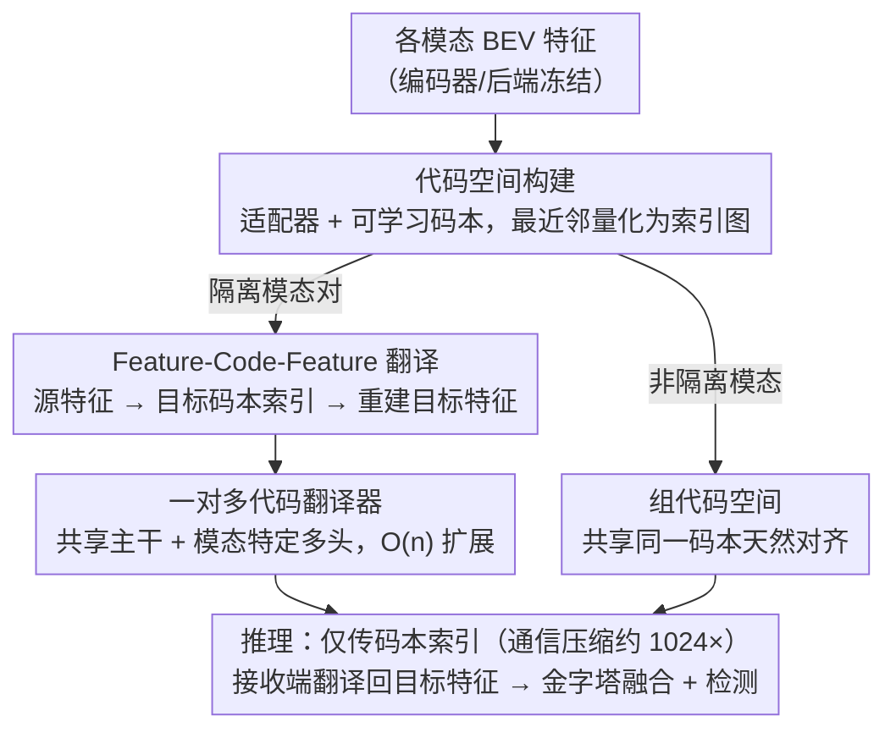

# Linking Modality Isolation in Heterogeneous Collaborative Perception

**会议**: CVPR2026  
**arXiv**: [2603.00609](https://arxiv.org/abs/2603.00609)  
**代码**: [cxliu0314/CodeAlign](https://github.com/cxliu0314/CodeAlign)  
**领域**: LLM预训练  
**关键词**: 协同感知, 异构对齐, 模态隔离, 码本, 跨模态翻译

## 一句话总结

提出 CodeAlign 框架，通过码本构建离散代码空间和跨模态 Feature-Code-Feature (FCF) 翻译，首次解决异构协同感知中不同模态从未在训练数据中共现的"模态隔离"问题，仅需 HEAL 8% 训练参数、通信量降低 1024 倍，同时达到 SOTA 感知性能。

## 背景与动机

1. **协同感知的价值**：多智能体（如网联自动驾驶车辆）通过共享感知信息可构建更全面的环境理解，弥补单车盲区与遮挡
2. **异构性问题**：现实中不同厂商车辆配备不同传感器类型（LiDAR/Camera）、不同参数（64 线/32 线）和不同感知模型，特征级融合面临巨大的域差
3. **模态隔离的普遍性**：不同机构在不同地点和时间采集数据，导致许多模态对从未在同一场景中共现——例如 A 机构只有 LiDAR 数据、B 机构只有 Camera 数据，二者没有任何空间交叠的观测
4. **现有方法的依赖与局限**：HEAL 需额外重训编码器（代价高）；STAMP/GT-Space 依赖共现数据的空间对应监督或共享视野；HMViT 和 Pyramid Fusion 需要联合训练，在模态隔离下性能严重退化（AP70 下降 15.21%）
5. **效率瓶颈**：中间融合方法传输密集特征图，通信开销巨大（单次 32MB），制约实际部署
6. **隐私约束**：不同机构的数据受隐私法规限制，无法直接共享原始数据，进一步加剧了跨模态对齐的困难

## 方法详解

### 整体框架

CodeAlign 要解决的是"模态隔离"——不同机构采集的 LiDAR、Camera 等模态在训练数据里从未在同一场景共现，特征级融合无从对齐。它的破局点是不再依赖空间对应，而是给每种模态建一个离散"代码空间"，让表示同一对象的特征落到同一套码本上，从而把对齐问题转成"翻译"问题。整体分两个训练阶段加一条推理链路：阶段一为每种模态构建码本与适配器（代码空间构建），并让本就有共现数据的非隔离模态共享同一码本（组代码空间）以天然对齐；阶段二只针对隔离模态对训练跨模态的 Feature-Code-Feature 翻译器，并用共享主干、模态特定多头的"一对多代码翻译器"把新模态接入成本压到线性；推理时各智能体只传码本索引、在接收端翻译回目标模态特征后再做金字塔融合检测。

### 关键设计

**1. 代码空间构建：用码本把密集特征离散化，顺带把通信量压两个数量级**

为对齐不同模态、又要省通信，CodeAlign 在每种模态的编码器和后端之间插入一个轻量适配器（4 层 ResNet block，3×3 卷积）和一个可学习码本（大小 $D=16$），训练时冻结编码器与后端、只训适配器和码本。对 BEV 特征图的每个空间位置，用最近邻量化映射到码本索引

$$I_{[h,w]} = \arg\min_\ell \big\| (\mathcal{P}(F))_{[h,w]} - C[\ell] \big\|_2^2$$

通信时只发索引图（$H \times W \times \log_2 D$）而非原始特征（$H \times W \times C$），压缩约 1024 倍。对那些本就有共现数据、并未隔离的模态，则让它们共享同一码本（组代码空间构建），使不同模态但表示同一对象的特征天然映到相同嵌入，既实现对齐又省掉一批跨模态翻译器。

**2. Feature-Code-Feature 翻译：用目标模态的码本当"中转站"跨越模态隔离**

隔离模态之间没有共现监督，CodeAlign 用目标模态的码本作中介来搭桥：跨模态翻译器 $T_{m_i \to m_j}$ 把源模态的密集特征翻译成目标模态码本里的索引图（Feature→Code），目标模态的重建器 $R_{m_j}$ 再把索引图解码回密集特征（Code→Feature），输出天然落在目标模态特征空间里。之所以选 dense-to-code 而非 dense-to-dense 或 code-to-code，是因为它在重建精度和通信效率之间最平衡——既保留了密集输入的细节，又复用了离散码本的压缩与对齐。

**3. 一对多代码翻译器：让新模态接入从平方代价降到线性**

如果每对模态都各训一个翻译器，参数会随模态数二次增长。CodeAlign 改用共享主干（堆叠 ConvNeXt block）加模态特定多头输出，训练参数随模态数线性增长（约 $0.5\text{M} \cdot n$），新模态接入成本从 $O(n^2)$ 降到 $O(n)$。配合按各目标损失变化动态调整训练数据比例的数据平衡策略，避免某个翻译方向欠拟合。

### 损失函数 / 训练策略

训练只用源模态的本地数据（源模态编码→翻译器→目标后端检测损失），全程无需跨机构传原始数据，符合隐私约束。总损失为

$$L = L_{\text{det}}(\hat{\mathcal{O}}_i, \mathcal{O}_i^0) + L_{\text{pyramid}} + \lambda \sum_{k,j \in \mathcal{G}_s, m_k \neq m_j} L_{\text{sim}}(F_{k \to i}, F_{j \to i})$$

其中 $L_{\text{det}}$ 是检测损失，$L_{\text{pyramid}}$ 是来自 HEAL 的金字塔融合损失，$L_{\text{sim}}$ 是 Smooth L1 特征相似性损失（$\lambda=0.1$），用来把不同源翻译到同一目标的特征拉一致、强化跨模态对齐。

## 实验关键数据

### OPV2V 数据集（仿真，多车 V2V）

| 方法 | m1+m7+m2 AP30 | m1+m7+m2 AP50 | m1+m7+m2 AP70 | 训练参数(M) | 通信量 |
|------|:---:|:---:|:---:|:---:|:---:|
| No Collaboration | 81.18 | 79.44 | 68.26 | 0 | 0 |
| Late Fusion | 88.24 | 85.02 | 68.45 | 0 | 0.5KB |
| Pyramid Fusion | 83.95 | 82.93 | 68.91 | 21.4 | 32MB |
| HEAL | 87.80 | 86.98 | 79.89 | 16.0 | 32MB |
| **CodeAlign** | **89.77** | **88.59** | **77.73** | **1.3** | **0.03MB** |

- CodeAlign 在三模态场景中 AP30/AP50 分别超越 HEAL 1.97/1.61 个百分点
- 训练参数仅为 HEAL 的 8%（1.3M vs 16.0M）
- 通信量降低 1024 倍（0.03MB vs 32MB）

### DAIR-V2X 数据集（真实世界）

| 方法 | m1+m2 AP30 | m1+m2 AP50 | m1+m2 AP70 |
|------|:---:|:---:|:---:|
| HEAL | 73.70 | 67.21 | 44.76 |
| **CodeAlign** | **82.03** | **77.37** | **57.84** |

- CodeAlign 在真实数据集上 AP70 超越 HEAL 13.08 个百分点，展示出更强的泛化能力

### 消融实验

- **模态隔离影响**：Pyramid Fusion 在模态隔离下 AP70 从 80.88% 骤降至 65.67%（-15.21%）
- **组代码空间 vs FCF 翻译**：对非隔离模态，组代码空间构建比 FCF 翻译高 6.71% AP70
- **翻译器结构**：Multi-head 翻译器相比 One-to-one 仅损失 0.10% AP50，但参数从 $O(n^2)$ 降为 $O(n)$
- **码本+冻结编码器+适配器+相似性损失**：逐步引入后 AP70 从 77.87% 恢复到 79.63%
- **位姿误差鲁棒性**：CodeAlign 在位姿扰动下始终优于 HEAL，Late Fusion 快速退化至低于无协作基线

## 亮点

- **首个无共现对齐框架**：通过表示一致性替代空间对应，从根本上解决模态隔离问题
- **极致效率**：8% 训练参数 + 1024× 通信压缩，对大规模部署友好
- **隐私保护**：本地数据训练协议避免跨机构数据传输
- **强可扩展性**：一对多翻译器使新模态接入成本从 $O(n^2)$ 降至 $O(n)$
- **即插即用设计**：冻结原始编码器和后端，仅训练轻量插入模块

## 局限与展望

- 码本量化带来的信息损失导致部分场景 AP70 略低于 HEAL（如 m1+m2 场景 85.56 vs 86.18）
- 码本大小固定为 16，较小的码本可能无法充分表达复杂场景
- 评估受限于现有数据集的模态多样性，未在大规模多模态（>7 种）场景下验证
- 未探讨动态场景中码本的在线更新与自适应机制
- BEV 空间范围设定为 ±102.4m，对超远距离场景的适用性未验证

## 与相关工作的对比

| 方法 | 是否支持模态隔离 | 训练方式 | 通信效率 | 核心机制 |
|------|:---:|------|------|------|
| HMViT | ✗ | 联合端到端 | 低（32MB） | 跨模态注意力 |
| CodeFilling | ✗ | 共享码本端到端 | 高（0.03MB） | 单一共享码本 |
| STAMP | ✗ | 对比学习 | 低（32MB） | 协议网络参考 |
| GT-Space | ✗ | GT 特征对齐 | 低 | 真值锚点 |
| HEAL | △（需重训编码器） | 反向对齐 | 低（32MB） | 编码器重训 |
| **CodeAlign** | **✓** | **本地数据训练** | **高（0.03MB）** | **FCF 翻译+码本** |

## 评分

- 新颖性: ⭐⭐⭐⭐⭐ — 首次定义并系统解决模态隔离问题，FCF 翻译思路新颖
- 实验充分度: ⭐⭐⭐⭐ — 仿真+真实数据集，多场景消融全面；但模态种类受限
- 写作质量: ⭐⭐⭐⭐ — 问题定义清晰，方法阐述系统；部分符号重复定义
- 价值: ⭐⭐⭐⭐⭐ — 解决实际部署痛点（隐私、效率、可扩展性），工程意义显著

<!-- RELATED:START -->

## 相关论文

- [\[CVPR 2026\] Reconstructing CLIP for Open-Vocabulary Dense Perception](reconstructing_clip_for_open-vocabulary_dense_perception.md)
- [\[ICML 2026\] XTransfer: Modality-Agnostic Few-Shot Model Transfer for Human Sensing at the Edge](../../ICML2026/llm_pretraining/xtransfer_modality-agnostic_few-shot_model_transfer_for_human_sensing_at_the_edg.md)
- [\[NeurIPS 2025\] Heterogeneous Adversarial Play in Interactive Environments](../../NeurIPS2025/llm_pretraining/heterogeneous_adversarial_play_in_interactive_environments.md)
- [\[CVPR 2025\] A Unified Framework for Heterogeneous Semi-supervised Learning](../../CVPR2025/llm_pretraining/a_unified_framework_for_heterogeneous_semi-supervised_learning.md)
- [\[ICLR 2026\] CHAMMI-75: Pre-training multi-channel models with heterogeneous microscopy images](../../ICLR2026/llm_pretraining/chammi-75_pre-training_multi-channel_models_with_heterogeneous_microscopy_images.md)

<!-- RELATED:END -->
