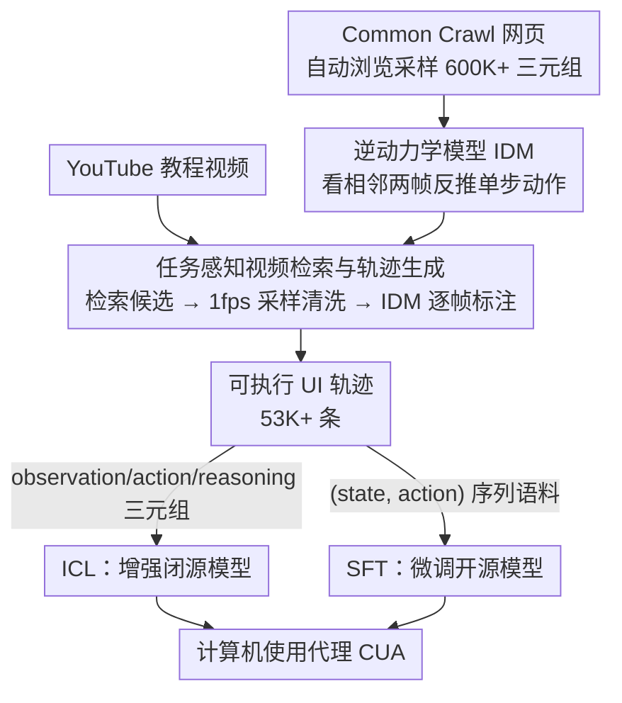

# Watch and Learn: Learning to Use Computers from Online Videos

**会议**: CVPR2026  
**arXiv**: [2510.04673](https://arxiv.org/abs/2510.04673)  
**代码**: [项目主页](https://chanh.ee/wandl/)  
**领域**: LLM预训练  
**关键词**: computer-using agent, inverse dynamics model, video-to-trajectory, in-context learning, supervised fine-tuning, UI grounding

## 一句话总结

提出 Watch & Learn (W&L) 框架，通过逆动力学模型 (IDM) 将互联网上的人类计算机操作视频自动转化为可执行的 UI 轨迹数据，生成 53K+ 高质量轨迹，作为 ICL 示例或 SFT 训练数据显著提升各类 CUA 性能。

## 研究背景与动机

**CUA 数据瓶颈严重**：计算机使用代理 (CUA) 需要大量多步骤人机交互轨迹进行训练，但人工标注成本极高——OpenCUA 的 AgentNet 数据集 22K 任务花费 6 个月、$32,000+，扩展到百万级需超 $500K

**现有数据集窄且静态**：手工标注的 UI 数据集规模有限、领域覆盖不足，难以泛化到多样化、不断变化的应用和操作系统

**合成数据质量不佳**：探索式合成（如 BAGEL、OS-Genesis）引入噪声；教程驱动合成依赖 LLM 标注，脆弱且与真实操作不对齐

**网络视频资源丰富但未充分利用**：YouTube 等平台上有海量人类操作教程视频，天然编码了跨应用的任务工作流，但缺乏有效方法将其转化为结构化轨迹

**已有视频转轨迹方法精度不足**：如 MONDAY 级联 pipeline 准确率仅约 70%，TongUI 依赖 MLLM 标注动作同样不可靠，误差层层放大

**跨操作系统泛化困难**：CUA 需在 Ubuntu/macOS/Windows 等不同 OS 上工作，但标注质量与 OS 环境强相关，已有方法难以跨平台保持一致

## 方法详解

### 整体框架

W&L 要解决的是 CUA（计算机使用代理）训练数据又贵又窄的瓶颈，思路是把互联网上海量的人类操作教程视频自动转成可执行的 UI 轨迹。整条流水线分三段：先构建大规模状态转移语料并训练一个逆动力学模型（IDM），让它学会"看两帧截图反推出中间动作"；再按任务检索 YouTube 教程视频、用 IDM 逐帧标注生成轨迹；最后把这些轨迹以 ICL 示例或 SFT 数据两种形式喂给 CUA。

### 关键设计

**1. 逆动力学模型（IDM）：把"复原整条轨迹"降成"单步反推动作"**

已有视频转轨迹方法（如 MONDAY、TongUI）靠级联 pipeline 或 MLLM 直接标动作，误差层层放大、精度只有约 70%。W&L 换了个更容易学的目标：给定相邻两帧截图 $(O_t, O_{t+1})$，只预测导致这次转换的动作 $a_t$，把轨迹复原拆成一连串单步逆动力学预测。动作空间是 6 个原子操作——Click（含坐标）、Release、Scroll、Type（含文本）、Wait、Move（含坐标），其中 Click+Move+Release 可组合表示拖拽。模型用 SigLIP-2 视觉编码器接 4 层 Transformer backbone，再分三个预测头：动作分类头（6 类）、坐标头（把 $(x,y)$ 离散成 0–999 的分类问题，比直接回归更稳）、语言头（轻量 GPT-2 解码器自回归生成输入文本）。训练数据靠从 Common Crawl 采样网页入口、自动浏览并记录 600K+ 个 $(O_t, a_t, O_{t+1})$ 三元组，目标是按动作类型激活对应分支的多任务交叉熵。单步预测加上纯像素输入，让 IDM 天然跨应用、跨操作系统泛化。

**2. 任务感知的视频检索与轨迹生成：先找对视频，再逐帧标成轨迹**

光有 IDM 还要有干净的教程视频喂进去。推理时，系统拿任务描述加初始截图让 Gemini 2.5 Flash 优化搜索 query，经 YouTube Search API 取 top-15 视频，过滤掉非录屏/模糊片段后留 top-3；训练时则覆盖 69 个应用、7 大类（生产力/编程/设计/视频编辑/音频/系统/科学），用 Gemini 生成多样查询批量检索，共收 53,125 个教程视频。所有视频按 1fps 采样帧、再由 Gemini 2.5 Flash 自动剔除非录屏、裁剪缩放、模糊转场的片段。清洗后让 IDM 逐帧对预测动作，组装成完整轨迹

$$\tau = (O_0, a_0, O_1, a_1, \ldots, O_T, a_T, O_{T+1})$$

精准检索是收益关键——随机检索因为标签本身准确不会掉点，但只有任务相关检索才能带来显著提升。

**3. 一份轨迹两种用法：同时喂闭源 ICL 和开源 SFT**

为了既能增强用不了梯度的闭源模型、又能微调开源模型，同一批轨迹被组织成两种形态。ICL 路线把每条轨迹拆成 (observation, action, reasoning) 三元组示例，其中 reasoning 由 Gemini 2.5 Flash 生成自然语言解释，让模型不仅看到动作还看到背后的程序性意图；SFT 路线则把标注轨迹聚合成 (state, action) 序列语料，用标准序列建模目标微调。两条路线复用同一数据源，灵活适配不同部署条件。

### 损失函数 / 训练策略

IDM 的训练目标是多任务交叉熵：根据每个样本的动作类型激活动作分类、坐标分类、文本生成对应的损失分支。下游 CUA 不引入新目标——ICL 直接拿三元组当上下文示例，SFT 用标准序列建模目标在 (state, action) 语料上微调。

## 实验

### 主实验结果

| 设置 | 模型 | 方法 | 成功率 (%) |
|------|------|------|-----------|
| **ICL** | Gemini 2.5 Flash | Base | 19.0 |
| | | + W&L | **22.0** (+3.0) |
| | OpenAI o3 | Base | 21.8 |
| | | + TongUI | 21.1 (-0.7) |
| | | + W&L | **24.3** (+2.5) |
| | Claude 4 Sonnet | Base | 43.9 |
| | | + TongUI | 43.4 (-0.5) |
| | | + W&L | **45.5** (+1.6) |
| | Jedi (o3) | Base | 50.6 |
| | | + W&L | **52.8** (+2.2) |
| **SFT** | Qwen 2.5VL 7B | Base | 1.9 |
| | | + TongUI | 5.4 (+3.5) |
| | | + W&L | **13.0** (+11.1) |
| | UI-TARS-1.5-7B | Base | 27.3 |
| | | + TongUI | 23.8 (-3.5) |
| | | + W&L | **31.1** (+3.8) |

> OSWorld-Verified (50-step)。W&L 在 ICL 和 SFT 两条路线上均一致超越基线和 TongUI。

### WindowsAgentArena 结果 (15-step)

| 模型 | 成功率 (%) |
|------|-----------|
| UI-TARS-1.5-7B (zero-shot) | 18.1 |
| + TongUI SFT | 12.9 (-5.2) |
| + **W&L SFT** | **24.0** (+5.9) |
| OpenCUA-7B | 13.5 |
| UltraCUA-7B | 21.7 |

> W&L 在 7B 模型中达到 SOTA，TongUI 标注甚至导致性能下降。

### 消融实验

**IDM 标注精度对比**（held-out 测试集，每类 100 个转移）：

| 指标 | Gemini 2.5 Flash | TongUI | **W&L IDM** |
|------|-----------------|--------|------------|
| ActionType Acc. | 81.5% | 84.3% | **95.8%** |
| Action Acc. | 70.5% | 72.3% | **91.7%** |

**ICL 组件消融**（OSWorld）：

| 配置 | Gemini Flash | o3 | Claude Sonnet |
|------|-------------|-----|--------------|
| 无示例 | 19.0 | 21.8 | 43.9 |
| + 帧 | 18.4 | 21.8 | 43.9 |
| + 帧 + 动作 | 20.1 | 23.0 | 44.4 |
| + 帧 + 动作 + 推理 | **22.0** | **24.3** | **45.5** |

**检索策略消融**：随机检索对 o3 无增益 (21.8)，任务相关检索 +2.5 → 24.3。

### 关键发现

- IDM 标注精度 (91.7%) 大幅领先 TongUI (72.3%) 和 Gemini (70.5%)，尤其在 click/scroll 等定位类动作上优势显著
- TongUI 标注在 Windows 环境下效果更差（TongUI 基于 UI-TARS 在 Ubuntu 上训练），导致 SFT 性能下降 5.2 点
- ICL 中动作标签和推理 trace 逐步贡献增量收益，表明轨迹传达了超越视觉上下文的程序性/因果知识
- 随机检索不伤害性能（标签本身准确），但精准检索才能带来显著提升

## 亮点

- **逆动力学建模是核心创新**：将轨迹恢复问题从端到端生成简化为单步预测，大幅降低学习难度且天然跨应用泛化
- **规模化效率极高**：53K 轨迹完全自动生成，无需人工标注，数据生产成本远低于 AgentNet 等方案
- **双重应用路线**：同一套轨迹既可 ICL 也可 SFT，灵活适配闭源和开源模型
- **跨 OS 泛化**：在 Ubuntu (OSWorld) 和 Windows (WAA) 两个平台均有效，证明 IDM 标注的平台鲁棒性
- **Qwen 2.5VL 7B 的 +11.1 增益**充分说明通用多模态模型通过该数据获得了原本缺乏的操作能力

## 局限性

- IDM 仅处理 6 个原子动作，对更复杂交互（如右键菜单、多点触控、键盘快捷键组合）覆盖有限
- 依赖 YouTube 视频质量和可用性，某些小众应用可能缺乏教程资源
- 过滤和检索依赖 Gemini 2.5 Flash，引入了对商业 API 的依赖
- 论文未探索长视频中多任务的自动分割，当前假设一个视频对应一条轨迹
- 未探索强化学习路线（仅 ICL + SFT），作者将 RL 列为 future work
- 1fps 采样可能丢失快速操作（如连续点击、快速滚动）的中间状态

## 相关工作

- **探索式合成**：BAGEL、NNetNav、Explorer、OS-Genesis — 随机探索 + 回溯标注，噪声大
- **教程驱动合成**：Synatra、AgentTrek（文本教程）、TongUI（多模态教程 + MLLM 标注）— 覆盖面广但标注脆弱
- **自改进代理**：OpenWebVoyager、WebRL、ZeroGUI — 不需人工数据但任务分布窄
- **机器人领域 IDM**：VPT（Minecraft 预训练）、DreamGen — 启发了本文 IDM 设计
- **代理 ICL**：工作流抽象 + 示例选择方向，与本文 ICL 路线互补

## 评分

- 新颖性: ⭐⭐⭐⭐ — 逆动力学建模思路从机器人迁移到 GUI agent 领域具有独创性
- 实验充分度: ⭐⭐⭐⭐ — 双 benchmark + ICL/SFT 双路线 + 多模型 + 完整消融
- 写作质量: ⭐⭐⭐⭐ — 结构清晰、动机-方法-实验逻辑连贯
- 价值: ⭐⭐⭐⭐⭐ — 开辟了利用网络视频规模化生产 CUA 训练数据的实用路线

<!-- RELATED:START -->

## 相关论文

- [\[ICCV 2025\] Synchronization of Multiple Videos](../../ICCV2025/llm_pretraining/synchronization_of_multiple_videos.md)
- [\[ICML 2026\] Constrained Bayesian Experimental Design via Online Planning](../../ICML2026/llm_pretraining/constrained_bayesian_experimental_design_via_online_planning.md)
- [\[NeurIPS 2025\] Optimal Online Change Detection via Random Fourier Features](../../NeurIPS2025/llm_pretraining/optimal_online_change_detection_via_random_fourier_features.md)
- [\[CVPR 2026\] Exploring Visual Pretraining for Learning Language Intelligence](exploring_visual_pretraining_for_learning_language_intelligence.md)
- [\[CVPR 2025\] Precise Event Spotting in Sports Videos: Solving Long-Range Dependency and Class Imbalance](../../CVPR2025/llm_pretraining/precise_event_spotting_in_sports_videos_solving_long-range_dependency_and_class_.md)

<!-- RELATED:END -->
