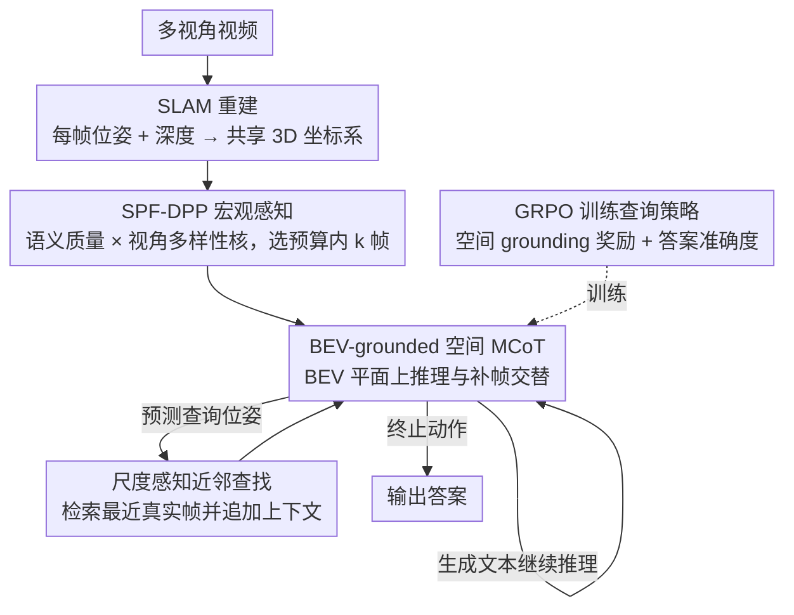

# EagleVision: A Dual-Stage Framework with BEV-grounding-based Chain-of-Thought for Spatial Intelligence

**会议**: CVPR 2026  
**arXiv**: [2512.15160](https://arxiv.org/abs/2512.15160)  
**代码**: [https://wallelwan.github.io/EagleVision](https://wallelwan.github.io/EagleVision)  
**领域**: LLM推理 / 空间智能  
**关键词**: 空间推理, BEV, 主动视觉, Chain-of-Thought, DPP选帧, 强化学习

## 一句话总结
提出EagleVision双阶段框架，宏观感知阶段用语义-视角融合DPP(SPF-DPP)在SE(3)空间联合优化语义相关性和视角多样性选择关键帧，微观验证阶段让模型在BEV平面上主动查询新视角帧进行迭代空间CoT推理（假设→查看→验证闭环），查询策略纯RL训练无需人工标注，在VSI-Bench和SQA3D上达开源SOTA。

## 研究背景与动机

**领域现状**：视频空间推理（估计距离、判断方向、理解布局）需要跨多视角整合几何线索。现有MLLM受固定token预算限制，使用均匀采样帧，无法在推理过程中请求新视角。

**现有痛点**：(1) 均匀采样既不保证语义相关也不保证视角多样——可能完全错过关键几何视差帧；(2) 一旦初始帧确定，模型无法在推理中途发现证据不足时请求新视角；(3) 收集多步空间推理标注不现实——需从答案级监督学习。

**三大研究挑战**：(a) 初始帧选择需在语义+视角两维度平衡；(b) 空间假设需在共享3D坐标系中验证→需将抽象空间查询映射为具体帧检索；(c) 无法获得人工标注的CoT轨迹。

**切入角度**：将"thinking with images"范式从单图(裁剪/缩放)扩展到多视角3D空间推理。

**核心idea**：BEV-grounded pose querying——模型在BEV平面上预测位姿来检索最近的真实帧，与文本推理交替形成闭环。

## 方法详解

### 整体框架
EagleVision 要解决的核心问题是：固定 token 预算下的 MLLM 怎样从一段多视角视频里既看到关键几何线索、又能在推理半途主动补看新视角。它把这件事拆成"先选好初始帧、再边想边补帧"两个阶段。视频先过一次 SLAM 重建出每帧相机位姿与深度，作为整个推理共享的 3D 坐标系——这是唯一的重活，且只做一次。接着**宏观感知**用 SPF-DPP 在预算内挑出语义相关又视角互补的 k 帧喂给模型；**微观验证**让模型在 BEV 平面上一边写推理文本、一边按需预测位姿去检索新视角帧，形成"假设→查看→验证"的闭环。预处理之后的每一步都只用轻量 2D VLM 加一次近邻查找，所以多看几帧的边际成本很低。

### 关键设计

**1. SPF-DPP 宏观感知：让初始选帧同时满足"看得相关"和"看得全"**

均匀采样的毛病在于它既不管帧跟问题相不相关、也不管视角是否互补，很可能漏掉提供关键视差的那几帧。SPF-DPP 用行列式点过程（DPP）一次性建模"质量×多样性"这对天然冲突的目标。多样性来自几何：先在 SE(3) 上定义两帧的位姿距离 $d_{ij}^2 = \|\mathbf{t}_i - \mathbf{t}_j\|^2/\sigma_t^2 + \beta^2 \theta(R_i, R_j)^2$，把平移差和旋转角距离 $\theta(R_i,R_j)$ 合在一起；再由稀疏邻接矩阵 $W$ 构出图拉普拉斯算子 $\mathcal{L}$，做一次热核扩散得到视角核 $K_{view} = \exp(-\tau \mathcal{L})$，把局部的两两亲和传播成全局几何关系，同时保证矩阵正半定。质量来自语义：FG-CLIP 算出每帧与查询的相似度，经温度 softmax 校准后写进对角质量矩阵 $Q$，元素 $q_i = (1-\alpha) + \alpha \tilde{s}_i$（$\alpha$ 控制语义权重，下限 $1-\alpha$ 避免完全压掉低分帧）。两者相乘组成 L-ensemble

$$L_{dpp} = Q\,K_{view}\,Q$$

然后贪心求 MAP 子集，由 DPP 的次模性带来 $(1-1/e)$ 的近似保证。相比只按相似度取 top-k，它能避免选到一堆冗余的相近视角。

**2. BEV-grounded 空间 MCoT：把"想到一半发现证据不够"变成可以现场补看**

初始帧再选得好，也无法预见推理过程中冒出的每一个验证需求。论文把这一阶段的迭代推理称为**空间 MCoT**（多模态思维链，Spatial Multimodal Chain-of-Thought）：在每一步，模型维护已生成文本、已检索图像和一个 BEV 位姿缓存，并从三种动作中选一种——生成文本继续推理、终止并输出答案，或者在 BEV 平面上预测一个查询位姿 $(x, y, \theta)$，系统据此用尺度感知距离找出最近的真实帧、追加进上下文。三者交替就形成闭环：模型先假设"A 在 B 左边约 2 米"，再预测一个能验证这条假设的观察位姿，看到检索回来的帧后确认或改口。与"把 3D 信息一次性注入提示"的做法不同，这里的视觉证据是按推理需要逐步取回的，关键的几何视差不必在第一帧就备齐。

**3. GRPO 训练查询策略：没有 CoT 标注也能学会"何时、往哪查"**

多步空间推理的人工轨迹标注几乎不可行，所以查询策略只能从答案级监督里反推。论文用 GRPO 做纯 RL 训练，并加一项**空间 grounding 奖励**：当模型预测的查询位姿落在没有相机覆盖的区域时给予惩罚，逼它把查询指向真有帧可取的位置，而不是凭空"想象"一个不存在的视角。配合答案准确度奖励，模型自发学出"先粗后细"的查询节奏——先用远景帧搭起全局布局，再针对具体位置补帧核对距离。

### 一个完整示例
以"物体 A 到 B 的距离"这类查询走一遍：视频先经 SLAM 得到每帧位姿与深度，SPF-DPP 从全部帧里挑出 k 帧——既要有清楚拍到 A、B 的语义相关帧（$Q$ 抬高它们的权重），也要有从不同朝向拍摄、彼此视差大的帧（$K_{view}$ 抑制冗余近邻视角）。模型拿到这 k 帧后开始空间 MCoT：先写文本假设"A 在 B 左前方、相距约 2 米"，发现仅凭初始帧的视角难以确认深度，于是在 BEV 平面预测一个侧向观察位姿，系统检索回最近的真实帧；新帧补上侧视视差后，模型核对并修正为"约 1.6 米"，最后选择终止动作输出答案。整个过程文本推理与补帧查询交替进行，证据随假设逐步到位。

### 损失函数 / 训练策略
宏观感知是纯推理时计算，DPP 选帧无需训练。微观验证用 GRPO 训练查询策略，奖励由空间 grounding 奖励与答案准确度奖励组成。整个框架对后端无关：SLAM 可替换为 VGGT 等其他位姿估计方法而不影响上层流程。

## 实验关键数据

### 主实验（VSI-Bench）

| 方法 | Rank | Obj.Count | Abs.Dist | Obj.Size | Rel.Dir | Route Plan |
|------|------|-----------|----------|----------|---------|------------|
| 人类 | - | 79.2 | 94.3 | 47.0 | 94.7 | 95.8 |
| GPT-4o | 3 | 34.0 | 46.2 | 5.3 | 37.0 | 31.5 |
| Gemini-1.5 Pro | 1 | 45.4 | 56.2 | 30.9 | 51.3 | 36.0 |
| InternVL2-8B | 10 | 34.6 | 23.1 | 28.7 | 36.7 | 29.9 |
| **EagleVision** | **开源SOTA** | **最优** | **最优** | **最优** | **最优** | **最优** |

SQA3D上同样达开源VLM SOTA。

### 消融实验

| 配置 | VSI-Bench Avg | 说明 |
|------|-------------|------|
| 均匀采样(基线) | 基准 | 标准MLLM做法 |
| SPF-DPP选帧 | +显著提升 | 语义+视角多样性的价值 |
| +空间MCoT(文本only) | +提升 | 推理链改善 |
| +BEV位姿查询(完整) | **最优** | 主动视觉获取的核心贡献 |
| 去除视角核(仅语义) | 下降 | 几何多样性不可或缺 |
| 去除语义核(仅视角) | 下降 | 语义相关性同样必要 |
| SLAM → VGGT | 持平 | 后端无关性验证 |

### 关键发现
- SPF-DPP选帧 vs 均匀采样→所有空间任务一致提升，尤其距离估计和路径规划
- BEV位姿查询是最关键组件——空间假设需要特定视角验证，主动获取远优于静态初始帧
- 人类上界(95.8%)远高于最强模型，空间推理仍是AI的巨大挑战
- 模型学会了"先粗后细"的查询策略：先用远景帧建立全局布局，再查询特定位置验证距离

## 亮点与洞察
- **从被动推理到主动推理的范式转变**：EagleVision首次让MLLM在推理过程中主动获取跨视角的视觉证据，而非被动消费固定帧集。这对embodied AI和机器人导航有直接启发
- **DPP+热核扩散的数学优雅**：SE(3)上的位姿距离→热核扩散视角核→DPP的质量-多样性trade-off，将几何直觉形式化为优美的数学框架
- **纯RL训练无需CoT标注**：空间grounding奖励巧妙地从答案级监督中引导出合理的查询策略，避免了不可行的人工CoT标注
- **后端无关设计**：SLAM可替换为任何位姿估计方法，框架的实用性不受限于特定重建系统

## 局限与展望
- 依赖SLAM预处理提供位姿和BEV地图——无法处理完全未知场景的实时推理
- BEV位姿查询仅检索最近真实帧——如果所需视角不在原视频中则无法获取
- 当前在室内场景(ScanNet)为主，室外大规模场景的泛化有待验证
- GRPO训练的查询策略可能过拟合训练分布的场景类型

## 相关工作与启发
- **vs 3D特征增强方法(SpatialVLM等)**: 它们注入3D信息但不能在推理中主动获取新视角
- **vs 3D重建+LLM方法**: 重建是离线黑盒步骤，无法迭代精化
- **vs ChatGPT-o3/DeepEyes**: 它们在单图上裁剪/缩放，EagleVision在3D空间跨视角操作
- **启发**：BEV-grounded推理范式可扩展到自动驾驶(查询盲区视角)和机器人(规划探索路径)

## 评分
- 新颖性: ⭐⭐⭐⭐⭐ BEV-grounded主动空间推理范式全新
- 实验充分度: ⭐⭐⭐⭐ VSI-Bench和SQA3D双基准验证，充分消融
- 写作质量: ⭐⭐⭐⭐⭐ 框架设计清晰，数学形式化完整，图示直观
- 价值: ⭐⭐⭐⭐⭐ 对空间智能和embodied AI有重大推动作用

<!-- RELATED:START -->

## 相关论文

- [\[ICML 2026\] FloorplanQA: A Benchmark for Spatial Reasoning in LLMs Using Structured Representations](../../ICML2026/llm_reasoning/floorplanqa_a_benchmark_for_spatial_reasoning_in_llms_using_structured_represent.md)
- [\[CVPR 2026\] E-comIQ-ZH: A Human-Aligned Dataset and Benchmark for Fine-Grained Evaluation of E-commerce Posters with Chain-of-Thought](e-comiq-zh_a_human-aligned_dataset_and_benchmark_for_fine-grained_evaluation_of_.md)
- [\[CVPR 2026\] Rationale-Enhanced Decoding for Multi-modal Chain-of-Thought](rationale-enhanced_decoding_for_multi-modal_chain-of-thought.md)
- [\[CVPR 2026\] FireScope: Wildfire Risk Raster Prediction with a Chain-of-Thought Oracle](firescope_wildfire_risk_raster_prediction_with_a_chain-of-thought_oracle.md)
- [\[CVPR 2026\] Revisiting the Necessity of Lengthy Chain-of-Thought in Vision-centric Reasoning Generalization](revisiting_the_necessity_of_lengthy_chain-of-thought_in_vision-centric_reasoning.md)

<!-- RELATED:END -->
