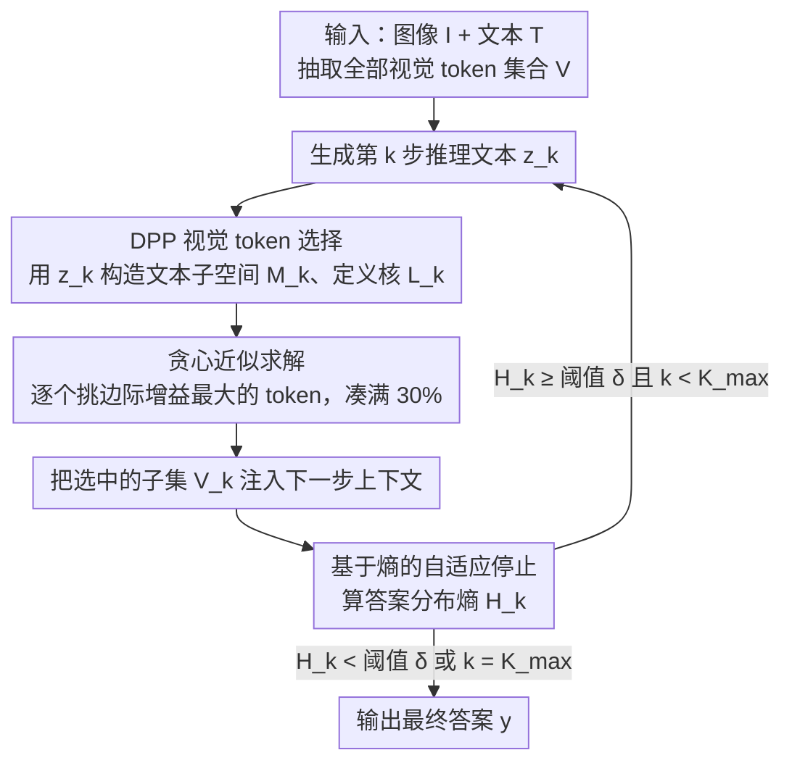

# VisRef: Visual Refocusing while Thinking Improves Test-Time Scaling in Multi-Modal Large Reasoning Models

**会议**: CVPR 2026  
**arXiv**: [2603.00207](https://arxiv.org/abs/2603.00207)  
**代码**: 无  
**领域**: LLM推理  
**关键词**: visual refocusing, test-time scaling, multimodal reasoning, DPP, visual token selection, training-free

## 一句话总结

提出 VisRef，一个免训练的视觉重聚焦框架——在多模态大推理模型（MLRM）的推理过程中，通过行列式点过程（DPP）在每步自适应选择与当前推理状态语义相关且视觉覆盖多样的 token 子集并重新注入，同时用基于熵的停止准则防止过度推理，在固定计算预算下将视觉推理准确率提升最高 6.4%。

## 研究背景与动机

**领域现状**：多模态大推理模型（MLRMs）如 InternVL-3.5、Qwen-3-VL、SAIL-VL2 通过扩展 Chain-of-Thought 推理到视觉语言任务上取得了显著进展。然而近期研究（Chu et al., Yang et al.）发现一个关键问题：随着推理链长度增加，模型对视觉 token 的注意力逐步衰减，越来越依赖文本先验而非图像内容。

**现有痛点**：(1) 基于 RL 微调的方法（如 Look-Back）可以教模型自主"回看"视觉输入，但需要 60 GPU 小时的微调和大规模标注数据集构建，可扩展性差；(2) 现有 test-time scaling 方法（如 Budget Forcing、L1）纯文本导向——通过"Wait"/"Think more"等指令让模型继续推理，但不主动维护视觉接地，视觉信息继续衰减；(3) 简单地重新注入所有视觉 token 计算上不可行——InternVL-3.5-8B 上每张图约 1772 个视觉 token vs 每步约 615 个文本 token，全量注入导致 2.3x 推理延迟。

**核心矛盾**：人类解决多模态问题时会自然地在"看图"和"推理"之间交替往返，但当前 MLRM 在初始处理视觉 token 后就不再回看——推理链越长视觉接地越弱。训练式解决方案效果好但代价高，纯文本 test-time scaling 不解决根本问题。

**本文目标**：能否完全在测试时恢复视觉接地，不需要任何重训练或微调？

**切入角度**：在每步推理时自适应选择一小部分（30%）与当前推理上下文最相关且覆盖最广的视觉 token 重新注入，用 DPP 框架同时优化相关性和多样性。

**核心 idea**：将视觉 token 选择形式化为最大化 DPP 行列式的优化问题，实现推理过程中自适应的视觉重聚焦，无需训练即可在任意预训练 MLRM 上即插即用。

## 方法详解

### 整体框架

VisRef 要解决的是 MLRM 推理链一拉长就"忘了看图"的问题：模型在初始处理完视觉 token 后不再回看，越往后越靠文本先验硬猜。VisRef 的做法是把"回看图"插进推理循环——每产生一步文本推理 $z_k$，就回头从原图的视觉 token 里挑一小撮重新喂给模型，让下一步推理重新接地到图像上，整个过程不动模型权重、纯在推理时完成。

形式上，给定图文输入 $x_{\text{input}} = [I, T]$ 和全部视觉 token $\mathcal{V} = \{v_1, \ldots, v_N\}$，第 $k$ 步推理产出 $z_k$ 后，VisRef 做三件事：先用 DPP 从 $\mathcal{V}$ 里选出一个子集 $V_k$（既贴当前推理状态、又覆盖面广），把 $V_k$ 注入到下一步上下文里，再检查模型回答分布的熵是否已经够低来决定要不要收尾；若没收尾就带着新的视觉接地继续下一步，形成"推理—回看图—再推理"的闭环。整条推理轨迹记作 $\tau_{1:k} = \{(z_1, V_1), \ldots, (z_k, V_k)\}$，最终答案 $y \sim \pi_\theta(\cdot \mid x_{\text{input}}, \tau_{1:k})$。

### 关键设计

**1. DPP 视觉 token 选择：用一个行列式同时管住"相关"和"多样"**

重聚焦最直接的痛点是：把全部视觉 token 重新注入一次，InternVL-3.5-8B 上每图约 1772 个视觉 token、每步才约 615 个文本 token，全量回注直接带来 2.3 倍延迟；可只挑"和当前推理最相关"的又会扎堆冗余、漏掉图里其他关键区域。理论上"该挑哪些 token"应当以"让最终答案最可能正确"为目标，但这个奖励只有生成完答案才知道、且要在指数级的子集空间里枚举，测试时根本解不动。VisRef 引入马尔可夫假设——第 $k$ 步注入哪些 token 主要取决于当前推理状态 $z_k$（它本身已自回归地编码了历史），从而把"最大化答案奖励"换成一个只依赖 $z_k$ 的可解打分函数 $\mathcal{J}(V_k \mid x_{\text{input}}, z_k)$。这个打分函数用行列式点过程（DPP）把"相关"和"多样"两个目标统一进一个优化里：先用当前推理步的文本表示构造子空间几何 $M_k = \sum_{j=1}^{T_k} z_k^{(j)}(z_k^{(j)})^\top$，据此定义视觉 token 间的核函数 $L_k(v_i, v_j) = v_i^\top M_k v_j$，然后选使核矩阵行列式最大的子集 $\tilde{V}_k = \arg\max_{V_k \subseteq \mathcal{V}} \det(L_k^{V_k})$。妙处在于这个对数行列式能自然拆成两项：

$$\log\det(L_k^{V_k}) = \underbrace{\sum_{v_i \in V_k} \log(r_i^2)}_{\text{relevance}} + \underbrace{\log\det(\bar{L}_k^{V_k})}_{\text{diversity}}$$

其中 $r_i^2 = \sum_{j=1}^{T_k}(v_i^\top z_k^{(j)})^2$ 衡量 token $v_i$ 与当前推理状态的相关性，后一项的体积型行列式则鼓励所选 token 在特征空间里彼此正交、覆盖不同视觉区域。一个 DPP 行列式就把"挑相关"和"避冗余"写进了同一个目标，而不用手工调两个 loss 的权重。

**2. 贪心近似求解：用 $(1-1/e)$ 保证把 NP-hard 选择跑快**

精确求解"哪 $m$ 个 token 让行列式最大"是 NP-hard 的，没法在每步推理里硬解。VisRef 改用贪心：从空集出发，每轮挑边际增益最大的那个 token

$$v_{k,i} = \arg\max_{v \in \mathcal{V} \setminus V_k^{(i-1)}} \log\frac{\det(L_k^{V_k^{(i-1)} \cup \{v\}})}{\det(L_k^{V_k^{(i-1)}})}$$

迭代 $m$ 次填满预算，实验里取 $m = \lfloor 0.3|\mathcal{V}| \rfloor$（30% 的视觉 token）。因为对数行列式是单调子模函数，贪心解有 $(1-1/e)$ 的近似比保证，既快又不至于偏离最优太远。

**3. 基于熵的自适应停止：让简单题早收、难题多想**

固定推理步数会两头不讨好——简单题想太久白烧算力（overthinking），难题又想不够。VisRef 在每步后算一次模型回答分布的熵 $H_k = -\mathbb{E}_{y \sim \pi_\theta}[\log \pi_\theta(y \mid x_{\text{input}}, \tau_{1:k})]$，一旦 $H_k < \delta_{\text{entropy}} = 0.25$ 就认为模型已收敛到高置信答案、当即终止；同时设上限 $K_{\max} = 10$ 兜底防止无限推理。这样算力按题目难度自适应分配，而 $\delta_{\text{entropy}} = 0.25$ 这个阈值在三个模型上都一致最优，不用逐模型重调。

### 一个完整示例

以 InternVL-3.5-8B 解一道 MathVista 几何题为例，原图被切成约 1772 个视觉 token，token 预算 $m = \lfloor 0.3 \times 1772 \rfloor \approx 531$。第 1 步模型产出推理文本"先看图中的三角形"，VisRef 用这步文本构造 $M_1$，贪心地从 1772 个 token 里逐个挑出边际增益最大的，凑满约 531 个——既集中在三角形区域（相关），又分散到三条边和标注（多样）——注入下一步；此时熵 $H_1 \approx 0.7 > 0.25$，继续。第 2 步推理转向"测量角度"，$M_2$ 随之改变，重选的 531 个 token 自动偏移到角度标注附近，熵降到 $H_2 \approx 0.4$，仍不收尾。第 3 步模型锁定答案，$H_3 \approx 0.18 < 0.25$，停止推理输出结果。整个过程每步只回注 30% token、推理 3 步即收敛，比纯文本一路"Think more"既省算力又始终贴着图。

### 损失函数 / 训练策略

VisRef 完全不需要训练。视觉 token 选择靠 DPP 贪心算法、重新注入靠改写上下文序列、停止靠熵判定，三者都在推理时完成，即插即用于任何预训练 MLRM，无需标注数据、微调或架构改动。

## 实验关键数据

### 主实验（三个视觉推理基准，三个 MLRM）

| 模型 | 方法 | MathVision | MathVista | MM-Star |
|------|------|-----------|-----------|---------|
| InternVL3.5-8B | Standard Thinking | 39.2 | 68.1 | 57.2 |
| InternVL3.5-8B | Textual Self-Reflection | 40.1 | 73.9 | 58.3 |
| InternVL3.5-8B | **VisRef** | **44.6 (+5.4)** | **79.3 (+11.2)** | **63.1 (+5.9)** |
| Qwen3-VL-8B | Standard Thinking | 53.8 | 74.1 | 66.5 |
| Qwen3-VL-8B | Textual Self-Reflection | 54.3 | 74.2 | 65.9 |
| Qwen3-VL-8B | **VisRef** | **56.6 (+2.8)** | **77.1 (+3.0)** | **69.1 (+2.6)** |
| SAIL-VL2-8B | Standard Thinking | 29.8 | 73.1 | 47.7 |
| SAIL-VL2-8B | Textual Self-Reflection | 31.9 | 73.8 | 48.9 |
| SAIL-VL2-8B | **VisRef** | **37.3 (+7.5)** | **78.2 (+5.1)** | **55.3 (+7.6)** |

### 消融实验

相关性 vs 多样性消融（InternVL-3.5-8B）：

| 相关性 | 多样性 | MathVista | MathVision | MM-Star |
|--------|--------|-----------|-----------|---------|
| ✓ | ✗ | 75.6 | 43.3 | 61.0 |
| ✗ | ✓ | 77.4 | 42.9 | 62.8 |
| ✓ | ✓ | **79.3** | **44.6** | **63.1** |

与训练式方法 Look-Back 的对比（InternVL-3.5-8B）：

| 方法 | MathVista | MathVision | MM-Star |
|------|-----------|-----------|---------|
| Standard Thinking | 68.1 | 39.2 | 57.2 |
| Look-Back (需 60 GPU-hr) | 80.8 | 44.2 | 63.7 |
| VisRef (免训练) | 79.3 | 44.6 | 63.1 |
| Look-Back + VisRef | **83.1** | **48.2** | **66.0** |

### 关键发现

- 纯文本自反思（TSR）收益不稳定（0.1%-2.1%），甚至在 Qwen3-VL-8B 的 MM-Star 上出现 0.6% 下降，说明纯文本推理延长对视觉任务帮助有限
- VisRef 在所有 9 个（3模型×3基准）配置上一致胜出，最大提升 11.2%（InternVL3.5 on MathVista）
- 仅用相关性选择比仅用多样性差（MathVista 75.6 vs 77.4），说明多样性对覆盖视觉信息至关重要
- VisRef 免训练即达到与 Look-Back（60 GPU-hr 微调）接近的性能（MathVista 79.3 vs 80.8），且两者正交——结合后进一步提升到 83.1
- Token 预算 $m=30\%$ 是最优折中点：20% 不足（76.1%），30% 最优（79.2%），40% 无额外收益
- 在固定 token 预算（如 14K thinking tokens）的并行链场景下，VisRef 比无视觉重聚焦的并行推理高约 6% 准确率

## 亮点与洞察

- **理论优雅**：将视觉 token 选择形式化为 DPP 行列式最大化问题，并证明其自然分解为相关性+多样性两项——数学上清晰解释了"为什么 DPP 适合这个问题"
- **即插即用**：无需训练数据、无需微调、无需架构修改——可以立即应用于任何预训练的 MLRM，这在实际部署中极具价值
- **与训练式方法互补**：VisRef + Look-Back 的组合在所有基准上都超过单独使用任一方法，说明两者捕获了不同的视觉接地信号
- **注意力可视化**：Figure 5 直观展示了 VisRef 如何在推理步中逐步将注意力从弥散状态重聚焦到任务关键的视觉区域

## 局限与展望

- 每步都需要计算 DPP 选择和重新注入，虽然只选 30% token 但仍增加了上下文长度和计算量
- 当前的 DPP 核函数 $L_k$ 基于简单的文本子空间投影，更复杂的跨模态对齐可能带来进一步提升
- 熵阈值 $\delta_{\text{entropy}} = 0.25$ 虽然跨模型一致，但对不同难度和领域的问题可能需要更细粒度的调整
- 仅评估了 8B 参数量级的模型，对更大模型（如 70B+）的 scaling 行为未验证
- 在 Qwen3-VL-8B 上收益（2-3%)相对较小，可能因为该模型本身视觉接地就更强

## 相关工作与启发

- **Budget Forcing (Muennighoff et al.)**：通过"Wait"指令扩展推理链的 test-time scaling 方法，但纯文本导向
- **Look-Back (Chu et al.)**：基于 RL 微调教模型自主回看视觉输入，效果好但代价高（60 GPU-hr）
- **L1 (Aggarwal & Welleck)**：长度可控的策略优化，精确控制推理链长度
- 启发：VisRef 展示了"主动维护视觉接地"比"被动延长推理"更有效，核心洞察是——对于视觉任务，问题不在于想得不够多，而在于看得不够仔细

## 评分

- **新颖性**: ⭐⭐⭐⭐⭐（DPP 框架用于视觉 token 选择是首创，理论推导优雅）
- **实验充分度**: ⭐⭐⭐⭐⭐（3模型×3基准，丰富消融包含相关性/多样性分解、训练式方法对比、token 预算分析、test-time scaling 曲线）
- **写作质量**: ⭐⭐⭐⭐⭐（问题动机明确，方法推导严谨，图表信息量大）
- **价值**: ⭐⭐⭐⭐⭐（免训练即插即用 + 显著且一致的提升 + 与训练式方法正交互补，实用价值很高）

<!-- RELATED:START -->

## 相关论文

- [\[CVPR 2026\] Rationale-Enhanced Decoding for Multi-modal Chain-of-Thought](rationale-enhanced_decoding_for_multi-modal_chain-of-thought.md)
- [\[ICLR 2026\] Efficient Test-Time Scaling for Small Vision-Language Models](../../ICLR2026/llm_reasoning/efficient_test-time_scaling_for_small_vision-language_models.md)
- [\[ACL 2026\] ReProbe: Efficient Test-Time Scaling of Multi-Step Reasoning by Probing Internal States of Large Language Models](../../ACL2026/llm_reasoning/reprobe_efficient_test-time_scaling_of_multi-step_reasoning_by_probing_internal_.md)
- [\[ICLR 2026\] StreamingThinker: Large Language Models Can Think While Reading](../../ICLR2026/llm_reasoning/streamingthinker_large_language_models_can_think_while_reading.md)
- [\[ACL 2026\] Parallel Test-Time Scaling for Latent Reasoning Models](../../ACL2026/llm_reasoning/parallel_test-time_scaling_for_latent_reasoning_models.md)

<!-- RELATED:END -->
