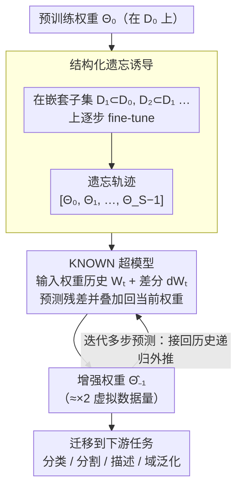

# Learning from Oblivion: Predicting Knowledge-Overflowed Weights via Retrodiction of Forgetting

**会议**: CVPR 2026  
**arXiv**: [2508.05059](https://arxiv.org/abs/2508.05059)  
**代码**: [jjh6297/KNOW](https://github.com/jjh6297/KNOW)  
**领域**: 模型训练 / 权重预测 / 知识迁移  
**关键词**: weight prediction, structured forgetting, meta-learning, hyper-model, knowledge transfer, scaling law, pre-trained weights

## 一句话总结

提出KNOW prediction：通过在逐步缩小的数据子集上sequential fine-tuning诱导结构化遗忘过程，收集权重转变轨迹，然后用meta-learned hyper-model（KNOWN）反转forgetting方向，预测"仿佛在更大数据集上训练"的虚拟知识增强权重。跨多数据集(CIFAR/ImageNet/PACS等)和多架构(ResNet/PVTv2/DeepLabV3+)持续超越naive fine-tuning及多种weight prediction基线，在图像分类、语义分割、图像描述、域泛化等下游任务上均有显著提升。

## 研究背景与动机

预训练权重是现代深度学习的基石，尤其在数据稀缺的few-shot场景中，好的预训练权重能显著提升下游任务表现。核心问题是：**如何在不增加训练数据量的情况下，获得更好的预训练权重？**

作者的思路基于三个关键洞察：

**Scaling Law**：更多训练数据通常产生更好的预训练权重(更好的泛化能力)。但大规模数据采集成本高昂，实践中往往受限

**Fine-tuning导致遗忘**：在子集数据上fine-tuning会覆盖模型对子集外数据的知识——这是catastrophic forgetting的经典表现，通常被视为缺陷

**Fine-tuning过程可逆**：已有unlearning研究表明fine-tuning在权重空间的变化具有一定可逆性；loss landscape的平滑性(mode connectivity)使得权重预测在理论上可行

**核心创意**：既然fine-tuning在缩小数据上→遗忘知识→权重退化是一个有结构的过程，那么反转这个过程→恢复知识→权重增强也是可行的。这将"遗忘"从缺陷转化为工具。

## 方法详解

### 整体框架

这篇工作想回答一个很实际的问题：能不能不增加训练数据，就拿到「仿佛在更大数据集上训出来」的更好预训练权重？它的破题点是把 catastrophic forgetting 反过来用——既然在逐步缩小的数据上反复 fine-tuning 会让权重沿一条有结构的轨迹「退化遗忘」，那么观察这条退化轨迹、再把方向反转，就能外推出「知识溢出」的增强权重。形式化地说：给定在 $D_0$ 上预训练的 $\Theta_0$，先人为制造一段遗忘轨迹 $[\Theta_0, \Theta_1, \ldots, \Theta_{S-1}]$，再假设存在一个对应「更大数据集 $D_{-1} \supset D_0$」的理想权重 $\Theta_{-1}$（fine-tuning 它在 $D_0$ 上恰好得到 $\Theta_0$），用一个学过「遗忘长什么样」的 hyper-model 反向预测出 $\hat{\Theta}_{-1}$，这就是 KNOW（Knowledge-Overflowed Weights）prediction。整条流水线串成「造遗忘轨迹 → 反向预测增强权重 → 递归外推 → 迁移下游」四步：

### 关键设计

**1. 结构化遗忘诱导：人为造一段「退化轨迹」给模型看**

要反转遗忘，得先有一条干净、有结构的遗忘轨迹。做法是从完整数据集 $D_0$ 出发，按采样率 $r \in [0,1]$ 逐步构造嵌套子集 $D_S \subset D_{S-1} \subset \cdots \subset D_1 \subset D_0$（$D_1 = r\cdot D_0$，$D_2 = r\cdot D_1$……），在每个更小的子集上 fine-tuning 上一步的权重，得到序列 $\Theta_0 \xrightarrow{D_1} \Theta_1 \xrightarrow{D_2} \Theta_2 \cdots$。每一步遗忘的知识量都和数据缩减量挂钩，所以这段轨迹是「有结构」的而非随机漂移。loss landscape 的 PCA 可视化显示这些权重串成一条平滑曲线、周围是连续的高精度区域，这正是「可以沿轨迹外推」的前提。

**2. KNOWN 超模型：学会「遗忘的逆运算」**

KNOWN（Knowledge-Overflowed Weights Nowcaster）是一个仅 9,425 参数的轻量 meta-trained hyper-model，基于 WNN 的 two-stream MLP。它吃两路输入——权重历史 $W_t = [\theta_0, \theta_1, \ldots, \theta_{S-1}]$ 和它们的差分 $dW_t = [\theta_1 - \theta_0, \ldots, \theta_{S-1} - \theta_{S-2}]$（取 $S=5$）——输出一个权重残差，叠加回当前权重得到增强权重：

$$\hat{\theta}^{t-1} = \theta^t + \text{KNOWN}(W_t, dW_t)$$

因为 Conv / FC / Bias 三类参数的演化模式不同，KNOWN 按参数类型分别训练三个专用模型 $[\text{KNOWN}_{\text{Conv}}, \text{KNOWN}_{\text{FC}}, \text{KNOWN}_{\text{Bias}}]$。它非线性地建模整条轨迹，这也是它比 TaskVector 那种线性外推更稳的原因。

**3. 迭代多步预测：把外推再往前推**

如果第一步预测出的 $\hat{\Theta}_{-1}$ 足够可靠，就能把它接回历史 $[\hat{\Theta}_{-1}, \Theta_0, \Theta_1, \ldots, \Theta_{S-2}]$ 去预测 $\hat{\Theta}_{-2}$，如此递归。当 $r=0.5$ 时，$\hat{\Theta}_{-1}$、$\hat{\Theta}_{-2}$、$\hat{\Theta}_{-3}$ 分别对应 ×2、×4、×8 的虚拟数据量增强。能一直递归而性能不崩，本身就反过来证明了预测权重的质量够高。

### 一个完整示例

以 ResNet18 从 CIFAR100 迁移到 CIFAR10 为例（$r=0.5$，$S=5$）：先在逐步减半的子集上 fine-tune 出 $[\Theta_0, \ldots, \Theta_4]$ 这条遗忘轨迹，naive 迁移的 baseline 精度是 92.40。把轨迹喂给 KNOWN 预测 $\hat{\Theta}_{-1}$（≈×2 数据），精度升到 93.00；再递归预测到 ×4 得 93.27、×8 得 93.55。值得注意的是，仅用 50% 数据走这套流程（92.58）就已经超过了用 100% 数据的 baseline（92.40）——多出来的性能完全来自对遗忘轨迹的反向外推，而非额外数据。

### 损失函数 / 训练策略

KNOWN 的 meta-training 目标是 $\ell_1$ 残差最小化 $\|(\theta^t + \text{KNOWN}(W_t, dW_t)) - \theta^{t-1}\|_1$，训练数据是多种小模型（CNN/ResNet/DenseNet/ShuffleNet/MobileNetV2，均 <3M 参数）在 CIFAR10/MNIST/FashionMNIST 上的权重轨迹（约 50GB）。一旦训完就无需针对新实验重训，直接泛化到所有下游设置。推理成本极低——预测 ResNet18 全部参数仅需约 3 秒（每参数 $2.67 \times 10^{-7}$ 秒）；制造遗忘轨迹的额外训练开销为原始训练的 $\frac{1-r^{S-1}}{1-r}$ 倍。

## 实验关键数据

### 图像分类（ResNet18, CIFAR100→CIFAR10）

| 方法 | 预测步数 | 100%数据 | 50%数据 | 25%数据 |
|------|----------|----------|---------|---------|
| Naïve Transfer | 1 | 92.40 | 92.08 | — |
| KNOWN | ×2 | 93.00±0.11 | 92.58±0.14 | 92.29±0.04 |
| KNOWN | ×4 | 93.27±0.09 | 92.62±0.25 | 92.88±0.11 |
| KNOWN | ×8 | **93.55±0.05** | **93.11±0.19** | 92.92±0.15 |

KNOWN在50%数据(92.58)上就超越了100%数据的baseline(92.40)，且迭代预测(×8)进一步提升至93.55。其他方法（LogFit/TaskVector/TSV等）有时反而降低性能。

### 跨架构跨数据集（PVTv2, ImageNet预训练→5个下游数据集）

在CIFAR100/TinyImageNet/Stanford Cars/CUB/Oxford Flowers上，KNOWN均获得一致提升。以×3预测为例：CIFAR100 82.46(↑)、TinyImageNet 77.53(↑)、CUB 71.18(↑)。

### 域泛化（PACS, Leave-One-Domain-Out）

| 方法 | art | sketch | cartoon | photo | 平均 |
|------|-----|--------|---------|-------|------|
| Naïve Transfer | — | — | — | — | 63.48 |
| KNOWN (×3) | 72.12 | 44.11 | 62.73 | 93.87 | **68.21** |
| KNOWN (×9) | 72.07 | 44.02 | 64.28 | 92.98 | **68.33** |

平均精度从63.48提升至68.33，提升约5个百分点。

### 语义分割（DeepLabV3+, Pascal VOC→Cityscapes）

| 方法 | mIoU |
|------|------|
| Naïve Transfer | baseline |
| KNOWN (×3) | 69.00±1.04 (↑) |
| KNOWN (×9) | **71.22±0.82** (↑) |

TaskVector在×9时反而低于baseline，而KNOWN稳定提升。

### 图像描述（PVTv2 + Transformer decoder, Flickr8K）

KNOWN将masked accuracy从baseline提升约2.2%（39.38 vs ~37.2），证明在跨模态任务中也有效。

### 消融实验（$S$的影响）

| S | ×2精度 | ×4精度 | ×8精度 |
|---|--------|--------|--------|
| 2 (≈TaskVector) | 92.69 | 92.70 | 92.65 |
| 3 | 93.01 | 93.04 | 92.72 |
| 4 | 92.97 | 93.10 | 92.89 |
| 5 | **93.00** | **93.27** | **93.55** |

更长的forgetting序列($S=5$)提供更丰富的轨迹信息，特别是在多步迭代预测时优势更大。

## 亮点与洞察

- **将遗忘从缺陷转化为工具**：catastrophic forgetting长期被视为深度学习的顽疾，本文首次将其有意诱导并反转，作为知识增强的手段。这一视角转换极具创意
- **KNOWN极度轻量**：仅9,425参数的hyper-model，一次meta-training后无需再训练即可跨架构(CNN/ViT)、跨数据集、跨任务(分类/分割/描述/域泛化)使用——泛化能力惊人
- **权重预测推理几乎零成本**：预测ResNet18全部参数仅需3秒，相比数小时的训练时间完全可忽略
- **不依赖额外数据**：不像数据增强或知识蒸馏需要额外资源，KNOW仅利用现有数据的forgetting结构即可"虚拟扩展"训练数据的效果
- **loss landscape可视化提供了直觉验证**：PCA投影下forgetting轨迹的平滑性和预测权重的准确定位，为方法的可行性提供了直观证据

## 局限与展望

1. **大规模模型验证缺失**：实验最大模型为PVTv2（~25M参数），未验证在ViT-Large/LLM等百万级以上参数模型上的效果。随模型规模增大，权重空间的结构是否仍然平滑有待验证
2. **meta-training数据集限制**：KNOWN仅在<3M参数的小模型上meta-train，虽然实验表明可泛化到PVTv2，但跨越更大的规模差距时泛化性能是否保持未知
3. **采样率$r$的选择**：论文中$r=0.5$和$r=0.33$表现都不错，但缺乏系统的$r$选择指南。过小的$r$导致每步遗忘过多，过大的$r$则轨迹变化不显著
4. **仅验证了视觉任务**：虽然涵盖分类/分割/描述/域泛化，但全部为视觉领域。NLP/语音等模态的权重演化模式可能不同
5. **与现代训练范式的兼容性**：未讨论与LoRA/Adapter等参数高效微调方法的结合，也未涉及预训练阶段本身的应用（仅用于预训练后的增强）

## 相关工作与启发

- **WNN (ICML 2023)**：同一作者组的前作，周期性权重预测加速训练→本文将WNN扩展到跨数据集规模的KNOW prediction
- **Task Arithmetic (ICLR 2023)**：通过任务向量线性运算编辑模型→本文证实线性外推(TaskVector)在forgetting轨迹上效果不稳定，KNOWN的非线性建模更可靠
- **Model Soups / Weight Averaging**：多个fine-tuned模型的权重平均→与KNOW的区别在于KNOW从序列轨迹外推而非从多个终态混合
- **Scaling Law研究**：本文可视为"在不增加数据量的情况下间接利用Scaling Law"的实现路径
- **启发**：KNOW框架可能扩展到其他"有结构的退化过程"：如模型剪枝的反转(从稀疏→预测密集)、量化的反转(从低精度→预测高精度权重)

## 评分

| 维度 | 分数 (1-5) | 说明 |
|------|-----------|------|
| 创新性 | 4.5 | 反转forgetting的思路极具创意，从"缺陷→工具"的视角转换是真正的paradigm shift |
| 实用性 | 4.0 | KNOWN轻量、泛化好、推理成本几乎为零，工程落地门槛低 |
| 实验充分度 | 4.0 | 多架构多数据集多任务验证完整，消融清晰，但缺少大规模模型和NLP实验 |
| 写作质量 | 4.0 | 问题定义清晰，数学形式化合理，landscape可视化直观，部分表格数值因模板渲染问题不够清晰 |

<!-- RELATED:START -->

## 相关论文

- [\[CVPR 2026\] Revisiting Learning with Noisy Labels: Active Forgetting and Noise Suppression](revisiting_learning_with_noisy_labels_active_forgetting_and_noise_suppression.md)
- [\[AAAI 2026\] Beyond Superficial Forgetting: Thorough Unlearning through Knowledge Density Estimation and Block Re-insertion](../../AAAI2026/llm_safety/beyond_superficial_forgetting_thorough_unlearning_through_knowledge_density_esti.md)
- [\[AAAI 2026\] Learning from the Undesirable: Robust Adaptation of Language Models without Forgetting](../../AAAI2026/llm_safety/learning_from_the_undesirable_robust_adaptation_of_language_models_without_forge.md)
- [\[ACL 2026\] Before Forgetting, Learn to Remember: Revisiting Foundational Learning Failures in LVLM Unlearning Benchmarks](../../ACL2026/llm_safety/before_forgetting_learn_to_remember_revisiting_foundational_learning_failures_in.md)
- [\[ACL 2026\] Compiling Activation Steering into Weights via Null-Space Constraints for Stealthy Backdoors](../../ACL2026/llm_safety/compiling_activation_steering_into_weights_via_null-space_constraints_for_stealt.md)

<!-- RELATED:END -->
