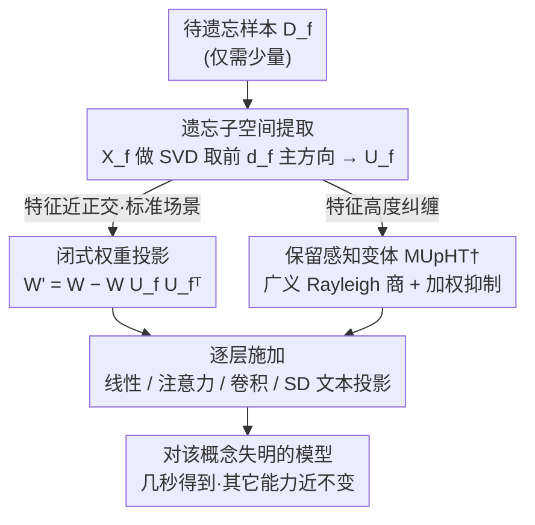

# pH-Strips for Selective Forgetting: A Blunt but Fast Diagnostic Baseline for Machine Unlearning

**会议**: CVPR 2026  
**论文**: [CVF Open Access](https://openaccess.thecvf.com/content/CVPR2026/html/Qian_pH-Strips_for_Selective_Forgetting_A_Blunt_but_Fast_Diagnostic_Baseline_CVPR_2026_paper.html)  
**代码**: 无  
**领域**: 机器遗忘 / AI 安全  
**关键词**: 机器遗忘, 概念擦除, 子空间投影, 神经坍缩, 免训练

## 一句话总结
提出 MUpHT——一个**免训练、无需保留集、闭式求解**的机器遗忘方法：把待遗忘概念在特征空间张成的低维子空间从权重里"投影掉"，几秒内（CIFAR-100 上 0.004 分钟、SD 去除裸露概念约 0.7 秒）就得到一个对该概念"失明"的模型，定位是给机器遗忘领域提供一张"试纸"式的快速诊断基线，效果却能和动辄训练数小时的 SalUn 打平甚至超过。

## 研究背景与动机
**领域现状**：机器遗忘（Machine Unlearning, MU）要把训练好的模型里某些不该有的内容（某个类、某个概念、某些样本）的影响抹掉，是构建安全可信 AI 的关键环节。教科书式的"黄金标准"是**在去掉待删数据后的保留集上从头重训**，但这在现实里几乎不可行——又贵又慢。

**现有痛点**：为绕开重训，主流近似遗忘要么靠**迭代优化**（梯度上升 GA、显著权重选择 SalUn、坏老师蒸馏等），要么需要**保留集 $D_r$** 来防止"误伤"有用知识，要么两者都要，还得仔细调超参。结果是：每跑一次遗忘都要花几分钟到几小时。

**核心矛盾**：领域里**缺一个"试纸"**。物理学家上重型仿真前先做 Fermi 估算，做 AI 的人上复杂架构前先跑最近邻、线性探针这种 sanity-check baseline——它们不求精确，只为**在投入重型流程前先看一眼"这事大概能不能成"**。MU 却没有这样的工具：研究者拿到一个新的遗忘问题，**没有任何快速办法判断它是容易、困难、还是根本不可行**。比如 Grok-2 发布几小时后就被用户生成暴力图像，开发者此刻最需要的是"立刻知道选择性遗忘到底可不可行"，而不是先排队跑两小时的优化流程。

**本文目标**：造一张"机器遗忘试纸"——一个**钝但快**的工具，几秒钟给出"这个模型大概能支持多深的遗忘"的即时判断，并明确**不是要取代 SOTA**，而是当诊断基线和评测参照。

**切入角度**：作者抓住一个被反复验证的几何事实——在**训练充分的神经网络里，不同概念对应的特征会聚集到各自的低维子空间，且这些子空间在高维隐空间里近乎正交**（Neural Collapse、Tunnel Effect 等工作的结论）。既然概念是"分得开"的，那"抹掉一个概念"就等价于"删掉模型对该子空间的敏感性"，而对其它概念几乎无副作用。

**核心 idea**：从待遗忘样本里抽出"遗忘子空间"，**闭式地把权重投影到该子空间的正交补**，让模型对落在这个方向上的激活"失明"——全程无反向传播、无迭代、不需要保留集。

## 方法详解

### 整体框架
MUpHT 的输入是一个训练好的模型 $g$ 和**少量**待遗忘样本 $D_f$（注意：标准版连保留集 $D_r$ 都不要），输出是一个"忘掉"目标概念、其它能力基本不变的模型。整条流水线只有三步：① 把 $D_f$ 喂进模型，在某一层收集特征矩阵 $X_f$，对它做 SVD 取前 $d_f$ 个主方向，得到**遗忘子空间** $U_f$；② 对该层权重 $W$ 做一次**闭式更新**——减去它在 $U_f$ 上的投影分量，让 $W$ 落到 $U_f$ 的正交补里；③ 把这套操作按层类型（线性层 / 注意力投影 / 卷积层）逐一施加到全网。对于特征高度纠缠（如同一超类下的子类、实例级遗忘）的难场景，再换上**保留感知变体 MUpHT†**，用广义 Rayleigh 商找出"对遗忘重要、对保留不重要"的方向，在抹掉与保住之间做更精细的权衡。两个变体都是闭式的，没有任何梯度训练。

### 关键设计

**1. 遗忘子空间提取：用 SVD 把"待忘概念"压成几条主方向**

痛点是要先回答"目标知识藏在哪"。MUpHT 不去逐参数估计影响（影响函数、Fisher 那一套都贵），而是直接利用"概念=低维子空间"这个结构。设某层收集到的 $n_f$ 个遗忘样本特征为 $X_f \in \mathbb{R}^{d\times n_f}$，对它做奇异值分解 $X_f = U\Sigma V^\top$，取前 $d_f$ 个左奇异向量定义遗忘子空间：

$$U_f = U_{:,:d_f}$$

这几个方向捕获了遗忘特征簇的主要变化，残差方向因为前面说的"概念聚集"效应贡献可忽略。换句话说，**一整个概念的"指纹"被压缩成几条正交基**，后面只要针对这几条基动手即可。这一步只需正向跑少量样本 + 一次 SVD，秒级完成。

**2. 闭式权重投影：把权重推到遗忘方向的正交补，让模型对该概念失明**

知道了藏在哪，接下来是"怎么删"。对一个线性层（分类头、MLP、注意力里的投影矩阵都算）权重 $W$，MUpHT 直接减掉它在遗忘子空间上的分量：

$$W' = W - W U_f U_f^\top$$

为什么这一刀既能"忘"又能"留"？把任意特征 $x$ 按子空间分解为 $x = U_f U_f^\top x + \omega$（投影分量 + 残差）。对一个**遗忘样本** $x_f$，由于 $U_f^\top U_f = I$ 且残差与子空间正交（$U_f^\top \omega_f = 0$），更新后的层作用为 $W' x_f = W\omega_f$；而在"概念低维"假设下遗忘样本几乎被 $U_f$ 完全描述、残差 $\|\omega_f\|\approx 0$，于是 $\|W' x_f\|\approx 0$——**激活被压没，模型对该概念失明**。对一个**保留样本** $x_r$，利用不同概念子空间近正交的近似 $U_r^\top U_f \approx 0$，可推出 $W' x_r \approx W x_r$——**输出几乎不动**。作者还在 VGG16 上实测：CIFAR-10 第 0、1 类子空间基之间的最大余弦相似度在网络后半段低于 0.25、最后两层趋近 0，为"近正交"假设提供了直接证据。整个更新是闭式的，没有任何反向传播或网格搜索。

**3. 跨层类型的统一施加：线性 / 注意力 / 卷积 / 扩散文本投影一套公式打通**

一个真正能用的诊断基线必须覆盖各种架构，而不只是分类头。MUpHT 把"投影掉子空间"这一招推广到全网：注意力层本质是 Q/K/V 三组线性投影，直接对这三个投影矩阵套用同一条闭式更新即可（多头则对每个头独立施加），从而削弱被遗忘概念在注意力分数和输出上的影响；卷积层先把输入特征图展开成 patch、把卷积核 reshape 成矩阵乘法，在展开域里做投影后再 reshape 回去；在 Stable Diffusion 里，则对 U-Net 各注意力模块中**与文本特征相关的投影权重**动手，抑制不良文本概念（如裸露）的影响而保住其余生成行为。一招通吃判别模型（CNN、ViT）和生成模型（SD），是它能当"通用试纸"的前提。

**4. 保留感知变体 MUpHT†：纠缠特征下用广义 Rayleigh 商做精细权衡**

标准版依赖"不同概念近正交"，但子类遗忘、实例级遗忘这类**高度纠缠**场景下该假设会破。MUpHT† 放宽正交假设、允许遗忘与保留子空间重叠，目标是找一个共享子空间 $U_s$，**在遗忘特征上保留能量、在保留特征上抑制能量**：$\max \|U_s^\top X_f\|_F^2$ 且 $\min \|U_s^\top X_r\|_F^2$。这被写成广义 Rayleigh 商

$$R(u) = \frac{u^\top C_{ff}\, u}{u^\top C_{rr}\, u}, \quad C_{ff}=\tfrac{1}{n_f}X_f X_f^\top,\ \ C_{rr}=\tfrac{1}{n_r}X_r X_r^\top$$

对保留协方差 $C_{rr}=LL^\top$ 做 Cholesky 分解，把问题化成标准特征问题 $A = L^{-1}C_{ff}(L^\top)^{-1}$，取其前 $k$ 大特征值对应特征向量，经 $U_s = (L^\top)^{-1}Q_{:,:k}$ 还原出共享子空间。关键的精细之处在于**给每条基不同权重**：$\alpha_i=\min(1, R(u_i))$，$R$ 越大（越"专属于遗忘"）抑制越强，于是

$$W' = W - W U_s\,\mathrm{diag}(\alpha)\,U_s^\top$$

这就在"删干净遗忘特征"和"保住纠缠的有用知识"之间实现了一个连续可调的权衡。和最接近的 Kodge et al.（GF）相比，GF 必须用保留集且要对整段子空间做网格搜索调两个超参；MUpHT 标准版**既无需保留集也无需网格搜索**，纠缠时才用 † 变体且权重由 Rayleigh 商自动给出。

## 实验关键数据

**实验设置**：分类任务覆盖 CIFAR-10/100、SVHN、Tiny ImageNet，骨干含 ResNet18/50、VGG16、Swin-T，按 SalUn 协议做实例级遗忘（删 10% 样本）与类级遗忘（忘一整类），并在 CIFAR-20 上做子类遗忘、CIFAR-100 上做多类遗忘；生成任务用 SD v1.4 做概念级（裸露）与类级（Imagenette）遗忘；多模态用 CLIP 在 Oxford Pets 上遗忘 3 个类。指标：UA（遗忘准确率=1−遗忘样本上的准确率）、RA（保留集准确率）、TA（测试准确率）、MIA（成员推断攻击）、Avg.Gap（与重训黄金标准的综合差距，越小越好）、RTE（遗忘耗时，分钟）。

### 主实验

ResNet18 / CIFAR-100 类级遗忘（节选）：

| 方法 | UA↑ | RA↑ | TA↑ | MIA↑ | Avg.Gap↓ | RTE(min)↓ | 免训练 | 无需 D_r |
|------|------|------|------|------|----------|-----------|--------|----------|
| Retrain（黄金标准） | 100.00 | 99.96 | 74.75 | 100.00 | — | 41.45 | ✗ | ✗ |
| SalUn | 90.53 | 99.44 | 73.55 | 100.00 | 2.82 | 2.56 | ✗ | ✗ |
| SSD | 98.67 | 97.45 | 75.48 | 100.00 | 1.12 | 0.18 | ✓ | ✗ |
| GF (Kodge et al.) | 94.89 | 94.52 | 69.10 | 99.35 | 4.21 | 0.39 | ✓ | ✗ |
| **MUpHT** | **99.24** | 97.42 | 75.20 | 100.00 | **0.91** | **0.004** | ✓ | ✓ |

MUpHT 的 Avg.Gap 0.91 是全表最低（最接近重训），而耗时只有 SalUn 的不到 1/100（论文称约 600× 加速），且唯一同时做到免训练 + 无需保留集。

生成任务 / Imagenette 类级遗忘（SD，节选 UA↑ / FID↓）：

| 遗忘类 | FMN | ESD | SalUn | MUpHT |
|--------|-----|-----|-------|-------|
| Tench | 42.40 / 1.63 | 99.40 / 1.22 | 100.00 / 2.53 | 99.90 / **0.64** |
| FrenchHorn | 45.00 / 0.99 | 99.80 / 1.08 | 100.00 / 0.94 | 100.00 / **0.30** |
| GolfBall | 15.40 / 1.05 | 99.60 / 0.80 | 98.80 / 1.45 | 100.00 / **0.60** |

MUpHT 在保持高 UA 的同时 FID 普遍最低（生成质量最好），而单类遗忘只需约 0.6 秒，其它方法要 >2 小时。裸露概念擦除上，NudeNet 检测显示其下降幅度与 SalUn 相当，但只花约 0.7 秒（号称比 SalUn 的 >2 小时快约 10000×），且因为不像 SalUn 那样用"穿衣服的人"图替换遗忘提示，保留了更好的生成多样性。

### 消融 / 难场景实验

CIFAR-20 子类遗忘（ResNet18，节选）：

| 方法 | UA↑ | RA↑ | TA↑ | MIA↑ | Avg.Gap↓ | RTE(min)↓ |
|------|------|------|------|------|----------|-----------|
| SalUn | 72.75 | 92.13 | 76.81 | 95.13 | 7.44 | 2.60 |
| SSD | 100.00 | 84.64 | 71.74 | 100.00 | 25.12 | 0.18 |
| GF | 85.87 | 85.56 | 71.47 | 92.10 | 19.46 | 0.40 |
| **MUpHT** | 99.89 | 91.65 | **77.63** | 100.00 | **14.15** | 0.02 |

CIFAR-20 删类 0（beaver）后各子类准确率，验证纠缠场景下 † 变体的价值（类 0 与类 83 shrew 属同一超类、特征高度对齐）：

| 配置 | beaver(0) | shrew(83·同超类) | 其它类 | 说明 |
|------|-----------|------------------|--------|------|
| MUpHT | 0.44 | **0.00** | 94~99 | 标准版连同超类邻居 83 一起误删了 |
| MUpHT† | 0.66 | **11.33** | 94~99 | 用类 83 的图保留其知识，明显保住了纠缠邻居 |

### 关键发现
- **最大贡献来自"子空间正交性"假设的成立**：VGG16 实测后半段层间最大余弦相似度 <0.25、末两层趋零，正是这一结构让"删一个概念几乎不伤其它概念"得以闭式成立；越深的层越正交，所以方法在深层最有效。
- **速度是数量级优势而非常数倍**：分类 600×、SD 上万倍，根因在于完全免反向传播、免迭代、免网格搜索——这正是它能当"试纸"的核心。
- **纠缠是标准版的软肋**：同超类子类遗忘时标准版会误删邻居（shrew 掉到 0），必须切到 † 变体（靠 Rayleigh 商加权）才把邻居知识保住（恢复到 11.33），代价是需要少量保留样本。

## 亮点与洞察
- **把"遗忘"重新定义成一次线性代数操作**：$W' = W - WU_fU_f^\top$ 一行公式、闭式、可解释，还能从子空间正交性严格推出"遗忘样本激活→0、保留样本输出不变"，比一堆需要调参的优化式遗忘干净得多。
- **"做诊断试纸而非追 SOTA"是很聪明的定位**：作者明说不跟最强方法比绝对精度，而是补上领域缺失的一环——上重型流程前的快速可行性判断；这反而让"又快又够用"成了卖点而非短板。
- **一套投影公式打通判别+生成+多模态**：线性/注意力/卷积/SD 文本投影都能套同一招，可迁移性强；想给任意视觉模型加"概念橡皮擦"时，这套闭式投影是极低成本的起点。
- **† 变体的 Rayleigh 商自适应加权**值得借鉴：$\alpha_i=\min(1,R(u_i))$ 让"越专属遗忘的方向删得越狠"，无需为权衡手动调超参，是处理特征纠缠的优雅思路。

## 局限与展望
- **强依赖"概念近正交"假设**：一旦特征高度纠缠（子类、实例级），标准版就会误伤邻居（如把同超类 shrew 一起删没），必须退回需要保留集的 † 变体——"无需保留集"的卖点在难场景下打折。
- **定位本就是"钝工具"**：作者坦言目标是诊断而非完美遗忘；在 Imagenette 的 Church 类上 UA 只有 83.60、FID 偏高，说明个别类的擦除并不彻底。
- **子空间维度 $d_f$、施加哪些层等仍需选择**：虽免网格搜索，但 $d_f$ 取多少、对哪几层投影会影响"忘得干不干净 / 留得好不好"，论文对此的系统敏感性分析放在附录。
- **可改进方向**：把 † 变体的 Rayleigh 商加权下放到无保留集场景（用 $D_f$ 内部结构估计纠缠度），或对深浅层自适应选 $d_f$，有望缓解纠缠软肋。

## 相关工作与启发
- **vs SalUn**：SalUn 选显著权重做基于优化的遗忘，需训练且要保留集；本文是闭式子空间投影，免训练、无需保留集，在 CIFAR-100 上 Avg.Gap 更低（0.91 vs 2.82）且快约 600×，SD 上快约 10000×，并因不替换遗忘提示而保住更好的生成多样性。
- **vs GF (Kodge et al.)**：思路最接近——都把遗忘看作把模型投影出"遗忘子空间"；但 GF **必须用保留集**、且要对整段子空间做网格搜索调两个超参，也不覆盖生成任务。本文标准版无需保留集、无网格搜索，纠缠时才用 † 变体且权重由 Rayleigh 商自动定，并把方法推广到了 SD 生成与 CLIP 多模态。
- **vs SSD（Selective Synaptic Dampening）**：SSD 免训练但需保留集（Dr-Free 为否），且在子类遗忘上 Avg.Gap 高达 25.12；MUpHT 在同设置下 14.15 且同时免保留集。
- **vs 优化式遗忘（GA / BE / BS / JiT 等）**：这些靠迭代优化或边界操作，慢且对超参敏感（JiT 在类级遗忘上 Avg.Gap 高达 44.5、方差极大）；本文以闭式一步到位换来数量级提速和更稳的表现。

## 评分
- 新颖性: ⭐⭐⭐⭐ 把"概念低维子空间"几何事实落成一行闭式权重投影并打通判别/生成/多模态，定位"诊断试纸"角度新颖；核心思想与 GF 同源但去掉了保留集与网格搜索。
- 实验充分度: ⭐⭐⭐⭐ 覆盖多数据集/多骨干/分类+生成+多模态，主表+难场景+纠缠对照齐全；个别难类（Church）擦除不彻底、敏感性分析多放附录。
- 写作质量: ⭐⭐⭐⭐⭐ "litmus 试纸"类比贯穿全文、动机清晰，公式推导把"为何忘得掉又留得住"讲透，可读性强。
- 价值: ⭐⭐⭐⭐ 作为机器遗忘的快速可行性诊断基线极实用，几秒出结果、可迁移到任意视觉模型，工程与评测价值高。

<!-- RELATED:START -->

## 相关论文

- [\[NeurIPS 2025\] SIMU: Selective Influence Machine Unlearning](../../NeurIPS2025/llm_safety/simu_selective_influence_machine_unlearning.md)
- [\[CVPR 2026\] SineProject: Machine Unlearning for Stable Vision–Language Alignment](sineproject_machine_unlearning_for_stable_vision_language_alignment.md)
- [\[ICLR 2026\] Model Collapse Is Not a Bug but a Feature in Machine Unlearning for LLMs](../../ICLR2026/llm_safety/model_collapse_is_not_a_bug_but_a_feature_in_machine_unlearning_for_llms.md)
- [\[CVPR 2026\] Revisiting Learning with Noisy Labels: Active Forgetting and Noise Suppression](revisiting_learning_with_noisy_labels_active_forgetting_and_noise_suppression.md)
- [\[CVPR 2026\] Machine Unlearning via Adaptive Gradient Reweighting and Multi-stage Objective Optimization](machine_unlearning_via_adaptive_gradient_reweighting_and_multi-stage_objective_o.md)

<!-- RELATED:END -->
