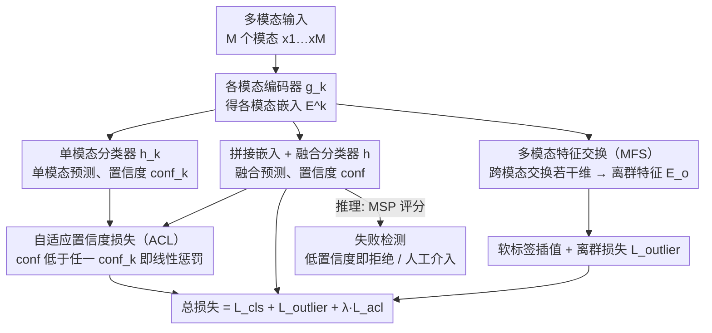

# Adaptive Confidence Regularization for Multimodal Failure Detection

**会议**: CVPR2026  
**arXiv**: [2603.02200](https://arxiv.org/abs/2603.02200)  
**代码**: [mona4399/ACR](https://github.com/mona4399/ACR)  
**领域**: 医学图像 / 多模态可靠性  
**关键词**: 多模态失败检测, 置信度退化, 自适应置信度正则化, 特征交换, 误分类检测, 选择性分类

## 一句话总结

提出 ACR 框架，通过自适应置信度损失（惩罚多模态融合置信度低于单模态的"置信度退化"现象）和多模态特征交换（在特征空间合成失败样本）两个互补模块，首次系统解决多模态场景下的误分类检测问题，在四个数据集上全面超越已有方法。

## 背景与动机

1. **高风险部署需求**：多模态模型在自动驾驶、医学诊断等安全关键场景广泛应用，仅追求高准确率远远不够，还需可靠地检测出不可信预测（failure detection, FD）
2. **单模态 FD 方法不适用**：现有 FD 方法主要面向单模态，无法利用跨模态互补信息，也无法处理多模态特有的信号冲突与对齐失效等失败模式
3. **OOD 检测方法在 FD 上失效**：实验表明 Energy、Entropy、MaxLogit 等 OOD 方法在 FD 任务上竟不如最简单的 MSP 基线，说明直接搬用 OOD 技术行不通
4. **多模态信号本身蕴含 FD 线索**：简单的视频+光流融合已能大幅提升 FD 性能，证明多模态输入对 FD 有巨大潜力，但缺乏专门框架加以利用
5. **置信度退化现象**：作者发现误分类样本中，融合后置信度低于某一单模态置信度的比例远高于正确样本（HMDB51 上高出 32.4%，HAC 上高出 52.4%），这一"置信度退化"现象可作为失败的强指示信号
6. **缺乏真实失败训练样本**：传统 Outlier Exposure 依赖大规模外部数据集且无法合成跨模态冲突这类多模态特有失败模式，OpenMix 等单模态方法也不适用

## 方法详解

### 整体框架

ACR 要解决的是多模态场景下的失败检测（failure detection, FD）——模型不只要准，还要能可靠地标出哪些预测不可信。架构上，M 个模态分支各有编码器 $g_k(\cdot)$ 提取嵌入 $\mathbf{E}^k$，拼接后送进融合分类器 $h(\cdot)$ 得到融合预测 $\hat{p}$ 与融合置信度 $\text{conf}$，同时每个模态还有独立分类器 $h_k(\cdot)$ 给出单模态预测 $\hat{p}^k$ 与单模态置信度 $\text{conf}_k$。在这套主干之上，ACR 接两个互补模块：自适应置信度损失（ACL）盯住"融合后反而比单模态更没把握"的退化信号，多模态特征交换（MFS）在特征空间凭空造出失败样本喂给检测器。两者各产生一项损失，连同原始分类损失合成总目标一起训练；推理时只用融合分支的 MSP 置信度做失败检测。

### 关键设计

**1. 自适应置信度损失（Adaptive Confidence Loss, ACL）：惩罚"越融合越不自信"的置信度退化**

作者发现误分类样本里，融合置信度低于某个单模态置信度的比例远高于正确样本（HMDB51 上高出 32.4%，HAC 上高出 52.4%）——这种"置信度退化"是失败的强指示。ACL 就把它写进损失。记融合置信度 $\text{conf} = \max_y \hat{p}$、单模态置信度 $\text{conf}_k = \max_y \hat{p}^k$，两模态情形下：

$$\mathcal{L}_{\text{acl}} = \frac{1}{2}\left(\max(0, \text{conf}_1 - \text{conf}) + \max(0, \text{conf}_2 - \text{conf})\right)$$

融合置信度高于所有单模态时不罚，低于任一单模态时线性惩罚。这等于逼着融合机制充分整合互补信息、同时压住单模态的过度自信，副作用是分类准确率也跟着提升。

**2. 多模态特征交换（Multimodal Feature Swapping, MFS）：在特征空间凭空合成失败样本**

FD 缺真实失败样本，传统离群暴露（Outlier Exposure, OE）要外部大数据集、还造不出跨模态冲突这种多模态特有的失败。MFS 不取外部数据，直接在特征空间动手：从每个模态嵌入里随机选 $n_{\text{swap}} \sim \mathcal{U}(n_{\min}, n_{\max})$ 个连续维度做交换，得到扰动特征 $\mathbf{E}_o$，软标签按交换量在真实标签和离群类之间插值 $\mathbf{y}_{\text{swapped}} = (1-\lambda)\mathbf{y}_{\text{true}} + \lambda\mathbf{y}_{\text{outlier}}$，其中 $\lambda = n_{\text{swap}} / n_{\max}$。交换量小就得到贴近分布内的困难负样本，交换量大就得到明确的离群点，可控性强、还省去外部数据、模态无关。

### 损失函数 / 训练策略

总损失把分类、离群、置信度退化三项合在一起：

$$\mathcal{L}_{\text{total}} = \mathcal{L}_{\text{cls}} + \mathcal{L}_{\text{outlier}} + \lambda_{\text{acl}} \mathcal{L}_{\text{acl}}$$

推理时仅对原始 C 类做 MSP 评分，无额外计算开销。

## 实验关键数据

### 主实验（视频 + 光流，Table 1）

| 数据集 | 方法 | AURC↓ | AUROC↑ | FPR95↓ | ACC↑ |
|---|---|---|---|---|---|
| HMDB51 | MSP | 29.56 | 88.28 | 52.07 | 86.20 |
| HMDB51 | **ACR** | **19.97** | **92.02** | **41.96** | **87.23** |
| HAC | MSP | 42.90 | 89.27 | 66.67 | 82.11 |
| HAC | **ACR** | **27.41** | **91.48** | **39.39** | **84.86** |
| Kinetics-600 | MSP | 46.29 | 87.33 | 61.29 | 81.24 |
| Kinetics-600 | **ACR** | **41.85** | **88.99** | **55.89** | **81.45** |
| EPIC-Kitchens | 最优基线 (RegMixup) | 105.25 | 79.26 | 78.19 | 74.53 |
| EPIC-Kitchens | **ACR** | **103.25** | **79.27** | **71.58** | **75.20** |

在所有数据集上 ACR 均为最优，AURC 最高改进 9.58%、FPR95 最高改进 15.45%，同时分类准确率也有提升。

### 消融实验（HMDB51，Table 2）

| 配置 | AURC↓ | AUROC↑ | FPR95↓ | ACC↑ |
|---|---|---|---|---|
| MSP baseline | 29.56 | 88.28 | 52.07 | 86.20 |
| + ACL only | 24.48 | 90.32 | 43.97 | 86.77 |
| + MFS only | 25.11 | 90.55 | 46.22 | 86.43 |
| **ACL + MFS** | **19.97** | **92.02** | **41.96** | **87.23** |

两个模块各自有效，组合后效果最佳，体现互补性。

### 其他验证

- **多模态组合泛化**（HAC，视频+音频/光流+音频/三模态）：平均 AURC 改进 8.39%，FPR95 改进 10.65%
- **分布偏移鲁棒性**：5 种视频腐蚀（散焦模糊、霜冻、亮度、像素化、JPEG 压缩）下 ACR 保持稳定优势
- **不同骨干网络**（I3D、TSN）：仍然全面优于所有基线
- **OOD 检测**：ACR 在 MultiOOD benchmark 上也表现优异，AUROC 96.82 vs 次优 95.35

## 亮点

- **首次系统研究多模态 FD**：揭示置信度退化现象并量化其与误分类的强相关性，为该方向提供了理论基础
- **无需外部数据的离群样本合成**：MFS 在特征空间操作，计算高效、模态无关、可控性好
- **同时提升 FD 和分类准确率**：ACL 的正则化同时改善了分类性能，这在 FD 方法中不常见
- **广泛评估**：4 个数据集、3 种模态、多种模态组合、分布偏移、不同骨干、OOD 检测等设置

## 局限与展望

- 实验仅限动作识别领域（视频+光流/音频），尚未在医学影像、遥感等其他多模态任务上验证
- 仅测试了两三模态融合，对更多模态（≥4）的扩展性未知
- MFS 的特征维度交换是均匀随机的，未考虑不同模态维度的语义重要性差异
- 推理阶段仅用 MSP 评分，未探索结合单/多模态置信度差异作为更强的 FD 信号
- 缺乏对高维嵌入空间中 MFS 生成分布的理论分析

## 与相关工作的对比

| 方法 | 类型 | 是否多模态 | 是否需要外部数据 | FD 效果 |
|---|---|---|---|---|
| MSP / MaxLogit / Energy | 评分函数 | ✗ | ✗ | 基线水平 |
| DOCTOR | 置信度学习 | ✗ | ✗ | 微弱提升 |
| OpenMix | 离群合成 | ✗ | ✓ | 中等 |
| CRL | 置信度正则化 | ✗ | ✗ | 中等 |
| A2D | 多模态 OOD | ✓ | ✗ | 中等（OOD 向） |
| **ACR** | **多模态 FD 专用** | **✓** | **✗** | **最优** |

## 评分

- 新颖性: ⭐⭐⭐⭐ — 置信度退化现象的发现及 ACL+MFS 的设计有原创性，首次系统研究多模态 FD
- 实验充分度: ⭐⭐⭐⭐ — 4 数据集、3 模态、多设置（分布偏移/不同骨干/OOD），消融充分
- 写作质量: ⭐⭐⭐⭐ — 问题动机清晰，从观察到方法的逻辑流畅
- 价值: ⭐⭐⭐⭐ — 填补多模态 FD 空白，框架通用性好，实际安全场景有应用价值

<!-- RELATED:START -->

## 相关论文

- [\[CVPR 2026\] Learning Diffeomorphism for Medical Image Registration with Time-Embedded Architectures Using Semigroup Regularization](learning_diffeomorphism_for_medical_image_registration_with_time-embedded_archit.md)
- [\[CVPR 2026\] Dual-Level Confidence based Implicit Self-Refinement for Medical Visual Question Answering](dual-level_confidence_based_implicit_self-refinement_for_medical_visual_question.md)
- [\[AAAI 2026\] Personality-guided Public-Private Domain Disentangled Hypergraph-Former Network for Multimodal Depression Detection](../../AAAI2026/medical_imaging/personality-guided_public-private_domain_disentangled_hypergraph-former_network_.md)
- [\[CVPR 2026\] The Invisible Gorilla Effect in Out-of-distribution Detection](the_invisible_gorilla_effect_in_out-of-distribution_detection.md)
- [\[AAAI 2026\] Refine and Align: Confidence Calibration through Multi-Agent Interaction in VQA](../../AAAI2026/medical_imaging/refine_and_align_confidence_calibration_through_multi-agent_interaction_in_vqa.md)

<!-- RELATED:END -->
