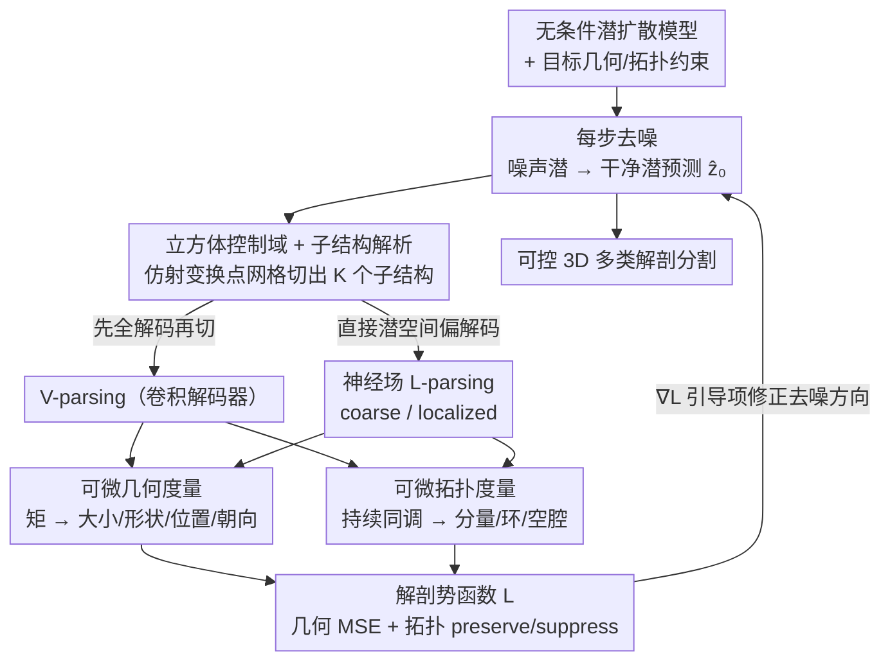

# Anatomica: Localized Control over Geometric and Topological Properties for Anatomical Diffusion Models

**会议**: CVPR 2026  
**论文**: [CVF Open Access](https://openaccess.thecvf.com/content/CVPR2026/html/Kadry_Anatomica_Localized_Control_over_Geometric_and_Topological_Properties_for_Anatomical_CVPR_2026_paper.html)  
**代码**: https://github.com/kkadry/Anatomica  
**领域**: 医学图像 / 扩散模型  
**关键词**: 解剖结构生成, 扩散引导, 持续同调, 神经场解码器, 可控生成

## 一句话总结
Anatomica 是一个**推理期（training-free）扩散引导框架**，用可任意摆放的「立方体控制域」从 3D 多类解剖分割中可微地切出子结构，再分别用**几何矩**和**持续同调**度量其几何（大小/形状/位置/朝向）与拓扑（连通分量/环/空腔）属性，把偏差当势函数梯度反传回去引导无条件扩散采样——无需为每个任务重训模型，就在心脏/主动脉/脊椎/冠脉等多个解剖系统上实现了 SOTA 的几何与拓扑可控生成。

## 研究背景与动机
**领域现状**：解剖形态决定了生理系统的功能与病变，把病人器官建模成 3D 分割后能跑数值仿真，用于虚拟临床试验、医疗器械设计、以及给机器学习造可控合成数据。真实数据稀疏且病理分布失衡，于是用生成模型做数据增广越来越热——而生成模型相对真实数据集的核心优势就在于**可控性**。

**现有痛点**：基于解剖特征去条件生成 **3D 多类分割**仍然很难。这些特征既包括几何（形状、大小），又包括拓扑（连通分量、环、空腔）；而且它们往往是**组合式**定义的——跨多个子结构、跨不同维度（3D vs 2D vs 1D）、跨不同坐标系（笛卡尔 vs 曲线坐标）。已有方法各有短板：用圆柱体等简单形状建模能控制形态但不真实；统计形状模型靠全局形状向量表示真实变化，但不可解释、不易局部编辑；条件训练的生成模型每换一个控制任务就要重训一遍；文生图里的 self-guidance 之类注意力损失只能做粗糙的尺寸/位置控制，既不适配多类分割，也撑不起解剖形状所需的复杂约束。

**核心矛盾**：要么训练时把约束写死（条件训练）、换任务就得重训且只能控全局属性；要么用通用引导但表达力不够，无法对**局部、多维、跨坐标系**的几何+拓扑属性做精细组合控制。本文最近的前作 CardioComposer 已经能做推理期几何引导，但**只能控全局定义的 3D 几何属性**。

**本文目标**：① 在推理期、免训练地从体素分割里**可微地、局部地**抽出感兴趣的解剖子结构；② 在这些子结构上**统一**度量并引导几何与拓扑属性；③ 把这套引导高效地适配到潜空间扩散模型上，避免每步全体素解码的开销。

**切入角度**：作者发现「子结构提取」可以抽象成一个**控制域**（control domain）——一个由仿射参数定义的查询点网格，决定要在哪、用多大尺度、什么朝向、什么维度去切分割图。把这个点网格的切分操作设计成可微的，几何（矩）和拓扑（持续同调）度量也都可微，那么整条「切结构→量属性→算偏差」的链路就能对扩散采样做梯度引导。

**核心 idea**：**用「立方体控制域 + 可微几何矩 + 可微持续同调」把局部几何/拓扑约束变成扩散引导的势函数梯度**，再用神经场解码器实现从潜空间的局部偏解码，在不重训的前提下组合式地控制任意维度、任意坐标系下的复杂解剖结构。

## 方法详解

### 整体框架
Anatomica 建立在一个**无条件**的解剖潜扩散模型（LDM）之上：先训一个带神经场解码器的变分自编码器，把 3D 多类分割体 $V \in \mathbb{R}^{C\times H\times W\times D}$ 编码成潜网格 $z$，神经场解码器 $F$ 能在任意查询点网格上把潜表示解回体素。然后训一个无条件 LDM 学习分割分布的 score。**控制全部发生在推理期**：每个采样步先把噪声潜 $z_\sigma$ 去噪成干净潜预测 $\hat z_0$，把它解析成 $K$ 个子结构 $S_k$，对每个子结构度量几何与拓扑特征、与目标比较得到一个复合解剖势函数 $\mathcal{L}=\frac1K\sum_k(\lambda_{geo}\mathcal{L}_k^{geo}+\lambda_{topo}\mathcal{L}_k^{topo})$，再把 $\nabla_{z_\sigma}\mathcal{L}$ 作为引导项修正这一步的去噪方向。

「解析子结构」有两条路：**V-parsing**（先把潜解成全体素图再切子结构，对应 Anatomica-V）和 **L-parsing**（用神经场解码器直接从潜空间偏解码出子结构，对应 Anatomica-L，更快）。度量也有两支：几何用**矩分解**，拓扑用**持续同调**。整个 pipeline 如下：

### 关键设计

**1. 立方体控制域 + 可微子结构解析：把"在哪、多大、什么维度切结构"参数化成一次仿射变换**

痛点是几何/拓扑约束往往是**局部**的（只想约束右心室、或主动脉中心线上的几个切片），而前作只能控全局属性。Anatomica 引入**控制域** $X_k\in\mathbb{R}^{\alpha\times\beta\times\gamma\times3}$——一个查询点网格，它同时决定了目标子结构的**空间支撑**和**离散化**。控制域由一个全局模板网格经仿射变换得到：
$$X_k = R_k\,\mathrm{diag}(s_k)\,X_k^{temp} + t_k$$
其中 $R_k$ 是旋转、$s_k$ 是缩放、$t_k$ 是平移。模板网格的**尺寸**决定离散精度（粗到细）和维度（3D 体到 2D 面到 1D 线），仿射参数决定子结构落在 3D 空间哪个位置、什么朝向、什么坐标系。给定预测分割 $\hat V$，**V-parsing** 先用布尔子集算子 $U[u]$（选择向量 $u\in\{0,1\}^C$）从多通道里挑出/重组目标组织成 $\hat S_k$，再用结构切片算子 $T^s[X_k]$ 在控制域点网格上采样：$S_k=(T^s[X_k]\circ U[u])(\hat V)$。整个过程对 $\hat V$ 可微，所以梯度能一路传回扩散过程。这套抽象的妙处在于：通过组合不同维度、不同坐标系下的多个控制域，就能刻画大量不同的解剖系统（沿主动脉中心线放 5 个平面域、从心肌质心放射出 4 条线域……），从而把"局部、组合、多维"的控制需求统一成"摆放一堆控制域"。

**2. 统一的几何-拓扑可微势函数：几何用矩、拓扑用持续同调，都变成可反传的损失**

光能切出子结构还不够，得把"它的形态是否符合目标"写成可微损失。**几何侧**对子结构 $S_k$ 数值积分零阶/一阶/二阶矩：零阶矩是质量 $m_k$，一阶矩是质心 $p_k$，二阶矩是协方差 $\Sigma_k$：
$$m_k=\mathbf 1^T\Omega_k,\quad p_k=\frac{r_k^T\Omega_k}{m_k},\quad \Sigma_k=\frac1{m_k}r_k^T\mathrm{diag}(\Omega_k)\,r_k - p_kp_k^T$$
再把协方差分解 $\Sigma_k=v_k U_k\Lambda_k U_k^T$，分出**大小** $v_k=\mathrm{tr}(\Sigma_k)$、**形状** $\Lambda_k$（按 trace 归一的特征值）、**朝向** $U_k$（正交矩阵），从而可以只约束"形状+朝向"而不连带约束尺寸。几何势函数就是对质量/位置/归一化协方差的加权 MSE：$\mathcal{L}_k^{geo}=\lambda_0 L_{MSE}(m_k,\bar m_k)+\lambda_1 L_{MSE}(p_k,\bar p_k)+\lambda_2 L_{MSE}(\Sigma_k^n,\bar\Sigma_k^n)$。因为现在几何属性是局部定义的，空体素会让质心/协方差数值不稳，作者加了**自适应质量加权**：当子结构质量低于阈值时把 $\lambda_1=\lambda_2=0$ 关掉。

**拓扑侧**把子结构 $S_k$ 当成立方复形，用**持续同调（PH）**度量。沿阈值 $\tau$ 取超水平集得到一族嵌套集合（filtration），从中抽连通分量（0D）、环（1D）、空腔（2D），输出每个拓扑特征的出生 $b$ / 死亡 $d$ 阈值——出生死亡区间越长越"持久"（越真实存在）。给定一个拓扑先验 $B_k=[B_{k,0},B_{k,1},B_{k,2}]$（想要几个分量/环/空腔），把持续点集划成该**保留**的 $Y_k$ 与该**抑制**的 $Z_k$，势函数最大化保留特征、最小化抑制特征的持久度：
$$\mathcal{L}_k^{topo}=-\!\!\sum_{p\in Y_k}\!|S_k(r_b^p)-S_k(r_d^p)|^2+\!\!\sum_{p\in Z_k}\!|S_k(r_b^p)-S_k(r_d^p)|^2$$
一个工程细节是**softmax 温度调节**：子结构来自 softmax 后的多类概率图，在概率接近 0 或 1 的区域拓扑势的梯度太小，解码子结构做拓扑引导时调高 softmax 温度以改善反传梯度流。这样几何和拓扑两类约束被**统一**成可加的势，组合起来就解锁了一个丰富的设计空间。

**3. 神经场 L-parsing + 偏解码：从潜空间直接切局部子结构，免去全体素解码开销**

把上面的引导搬到潜扩散上有个效率瓶颈：朴素做法每个采样步都得把整个潜网格解成全分辨率体素再切子结构，太贵。Anatomica 利用**神经场解码器能在任意离散点集上解码**的特性，提出 **L-parsing**——先用潜切片算子 $T^l[X_k]$ 在控制域点网格上取潜表示，再过神经场解码器 $F[X_k]$ 和布尔子集 $U[u]$，直接从干净潜 $\hat z_0$ 解出子结构：$S_k=(U[u]\circ F[X_k]\circ T^l[X_k])(\hat z_0)$。在此基础上做**偏解码**（partial decoding），用小网格降开销：**coarse L-parsing** 用低离散度的模板网格、配近似恒等仿射 $A_{coarse}=[I,1,0]$ 全局解码，用来高效度量对分辨率不敏感的全局属性（拓扑任务用它）；**localized L-parsing** 同样用小网格但把模板点网格仿射变到一个局部区域，等效在该局部达到高空间分辨率（几何任务用它）。引导后的去噪步写成：
$$D_\theta^w(z_\sigma;\sigma)=D_\theta(z_\sigma;\sigma)-\sigma^2\nabla_{z_\sigma}\mathcal{L}$$
即在无条件去噪上减去解剖势的梯度。偏解码让"度量解剖属性"的代价从全体素降到一小撮查询点，是这套引导能在 100 步采样里实用的关键。

### 损失函数 / 训练策略
训练阶段只训两样东西且都**无条件**：① 带神经场解码器的 VAE（混合隐式-显式表示，重建目标），神经场 $F$ 是一个 MLP，训练时用全体素离散的查询域；② 无条件 LDM（去噪目标 $\mathcal{L}=\mathbb{E}_{\sigma,z,n}[\omega(\sigma)\|D_\theta(z_\sigma;\sigma)-z\|_2^2]$，去噪器是 3D U-Net）。**所有控制都在推理期靠势函数梯度引导实现，不做任何条件训练**——每个解剖数据集只需训一个无条件扩散模型，就能服务该数据集下的所有几何/拓扑控制任务。损失权重 $\lambda_{geo},\lambda_{topo}$ 等需要调，但作者发现一套权重能跨所有解剖数据集迁移。

## 实验关键数据

### 主实验
**几何控制**：在心脏验证集上设 4 个任务（Right Ventricle 体积域 / Mitral Valve 两个体积域 / Aortic Trunk 沿中心线 5 个平面域 / Myocardium Wall 从质心放射 4 条线域），每任务生成 128 个合成样本。对比两个需要逐任务条件重训的 baseline：Explicit Conditioning（把几何矩拼成 13 维向量扩成体素网格拼到潜上）和 Implicit Conditioning（把矩编成 3D 高斯热图）。几何保真度（mass/centroid/cov 的 L1，越低越好）和生成质量（FMD / 1-NNA，越低越好）：

| 任务 | 方法 | Mass↓ | Cent.↓ | Cov.↓ | FMD↓ | 1-NNA↓ |
|------|------|-------|--------|-------|------|--------|
| Right Vent. | Explicit | 154.5 | 227.1 | 101.4 | 164.7 | 0.761 |
| Right Vent. | Implicit | 60.6 | 51.0 | 30.6 | 156.3 | 0.593 |
| Right Vent. | **Anatomica-V** | **12.3** | **30.2** | **21.6** | **84.9** | 0.590 |
| Right Vent. | Anatomica-L | 17.5 | 48.6 | 22.1 | 93.7 | 0.566 |
| Mitral Valve | Implicit | 8.91 | 87.0 | 17.3 | 314.8 | 0.661 |
| Mitral Valve | **Anatomica-L** | **3.22** | **11.4** | **7.89** | 88.8 | 0.577 |
| Myo. Wall | Implicit | 0.48 | 22.3 | 1.67 | 111.0 | 0.558 |
| Myo. Wall | **Anatomica-L** | 0.29 | 34.6 | 1.87 | **86.4** | 0.609 |

免训练的 Anatomica 在多数几何指标上**优于**需要逐任务重训的条件 baseline，且生成质量（FMD）普遍更好；最接近的对手是 Implicit 条件法，但它每个任务都要重训一遍。

**拓扑控制**：在心脏/主动脉/脊椎/冠脉 4 个数据集各设一个任务（Atria Separation 要 2 个连通分量 / Branch Connectivity 要 1 个分量 / Vertebrae Connectivity 要 1 分量 9 环 / Calcium Count 要 2 个钙化分量），用 Betti 数精度（B0/B1/B2，样本命中正确 Betti 数的比例，越高越好）对比无条件采样：

| 任务 | 方法 | B0↑ | B1↑ | B2↑ | 1-NNA↓ |
|------|------|-----|-----|-----|--------|
| Atrial Sep. | Uncond. | 7.81 | 5.47 | 56.2 | 0.578 |
| Atrial Sep. | **Anatomica-L** | **78.9** | **89.1** | **97.7** | 0.606 |
| Branch Conn. | Uncond. | 55.5 | 12.5 | 63.3 | 0.559 |
| Branch Conn. | **Anatomica-L** | **77.3** | **17.2** | 64.1 | **0.532** |
| Vert. Conn. | Uncond. | 28.9 | 8.59 | 12.5 | 0.518 |
| Vert. Conn. | **Anatomica-L** | **74.2** | **26.6** | 7.03 | 0.537 |
| Calcium Count | Uncond. | 0.00 | 2.34 | 95.3 | 0.653 |
| Calcium Count | **Anatomica-L** | **60.9** | **79.7** | **98.4** | 0.618 |

拓扑引导能把"心房分离""支血管连通""钙化计数"等连通分量/环的精度大幅拉高（Calcium Count 的 B0 从 0% 提到 60.9%）；唯一不灵的是**空腔 B2** 在主动脉/脊椎上没改善，作者归因为粗分辨率度量下单体素空腔难被检出。

### 消融实验
偏解码的速度-保真度权衡（速度按归一化每秒样本数，越高越快）：

| 方法 | 域/分辨率 | Mass↓ | Cent.↓ | Cov.↓ | FMD↓ | Speed↑ |
|------|-----------|-------|--------|-------|------|--------|
| Anatomica-V | Global / High | 11.95 | 30.66 | 21.92 | 84.70 | 1.00 |
| Anatomica-L | Local / High | 17.02 | 48.14 | 21.85 | 91.16 | 2.48 |
| Anatomica-L | Local / Med. | 16.64 | 48.41 | 22.03 | 93.89 | 7.43 |
| Anatomica-L | Local / Low | 16.43 | 48.75 | 22.07 | 105.57 | **10.40** |
| Anatomica-L | Coarse / Low | 20.30 | 46.96 | 25.60 | 123.31 | 10.40 |

### 关键发现
- **低分辨率偏解码几乎不掉几何保真度却换来巨大加速**：Anatomica-L 在 Local/Low 下相对 Anatomica-V（Global/High）质量/质心/协方差保真度基本持平，速度却快约 10 倍——这说明几何属性对解码分辨率不敏感，偏解码是免费午餐。
- **神经场 vs 卷积解码器**：同分辨率下 L-parsing（神经场）比 V-parsing（卷积）更快，代价是几何保真度略降；两个变体各有取舍，几何任务用 localized L-parsing、拓扑任务用 coarse L-parsing。
- **免训练却能打过条件重训**：最反直觉的是推理期引导在多数任务上优于逐任务条件训练的 baseline，且无需为每个新约束重训模型。
- **拓扑空腔是软肋**：B2（空腔）在部分数据集上不改善，受限于高分辨率持续同调的算力开销而只能用粗分辨率度量。

## 亮点与洞察
- **"控制域 = 仿射变换的查询点网格"这个抽象很优雅**：一个仿射参数 $[R,s,t]$ 同时编码了"切哪里、多大、什么朝向、什么维度、什么坐标系"，把五花八门的局部解剖约束统一成"摆控制域"，组合性极强（沿中心线放平面、从质心放射线段）。
- **几何与拓扑被纳入同一个可微势函数框架**：几何用矩分解（还顺手把大小/形状/朝向解耦，可单独约束形状不约束尺寸）、拓扑用持续同调，两者都可反传、可加权组合，这种"几何+拓扑统一引导"在解剖生成里很少见。
- **神经场偏解码把推理期引导做实用了**：利用神经场能在任意点集解码的特性，只在控制域那一小撮查询点上解码，避免每步全体素解码——这是 training-free 引导能在 100 步采样内跑起来的关键工程支点，思路可迁移到任何"潜空间引导需要频繁解码度量"的场景。
- **softmax 温度调温救梯度**：在概率饱和区调高 softmax 温度改善拓扑势的梯度流，是个小而实用的 trick。

## 局限与展望
- **损失权重需要调**：作者承认 $\lambda$ 等权重要手调，好在一套权重能跨所有解剖数据集迁移，但换到全新解剖系统仍可能要重调。
- **高分辨率持续同调算力昂贵**：拓扑引导的解码分辨率被 PH 计算成本卡住，直接导致**空腔 B2 控制在粗分辨率下失效**（单体素空腔检不出）——这是方法当前最硬的瓶颈。
- **依赖一个好的无条件 LDM**：所有控制都建立在无条件扩散先验之上，若先验本身不覆盖某种病理形态，引导也难凭空造出来；评测也都是合成样本自评，缺少下游真实任务（如训出来的分割网络/仿真结果）的端到端验证。
- **改进方向**：把损失权重做成自适应/可学习；用更高效的可微拓扑度量或多分辨率 PH 解决空腔检测；把引导接到更强的条件先验上做"条件+引导"混合控制。

## 相关工作与启发
- **vs CardioComposer (Kadry et al.)**：本文的直接前作，同样做推理期几何引导、用可微几何控大小/位置/形状。区别在于前作**只能控全局定义的 3D 几何属性**，Anatomica 用立方体控制域把它扩展到**任意局部、任意维度、任意坐标系**，并新增了拓扑（持续同调）控制和神经场偏解码，控制空间和效率都大幅提升。
- **vs 拓扑深度学习（PH 损失训练分割网络 / 条件训练扩散）**：以往持续同调多用于**更新网络权重**（训练分割网或条件训扩散模型）。本文反过来用 PH 做**推理期 plug-and-play 控制**，对无条件多类 3D 分割采样做引导，不需要条件重训。
- **vs 空间条件生成（bbox/椭球参数条件、self-guidance）**：条件中层表示或注意力损失（self-guidance）只能做基础的尺寸/位置控制，不适配多类分割、也撑不起复杂解剖约束。Anatomica 把能量引导扩展到基于子结构属性的局部几何+拓扑控制，解锁了组合式解剖设计空间。
- **vs 统计形状模型**：SSM 靠全局形状向量表示真实变化但不可解释、不易局部编辑；Anatomica 的控制域天然支持局部、可解释、可组合的编辑。

## 评分
- 新颖性: ⭐⭐⭐⭐⭐ 控制域抽象 + 几何矩与持续同调统一进可微扩散引导 + 神经场偏解码，组合很新
- 实验充分度: ⭐⭐⭐⭐ 覆盖心/主动脉/脊椎/冠脉 4 系统、几何+拓扑双类任务、含偏解码消融；但都是合成自评、缺下游端到端验证
- 写作质量: ⭐⭐⭐⭐ 公式与图（Fig.2/3）清晰，pipeline 解释到位
- 价值: ⭐⭐⭐⭐ 为虚拟临床试验与 ML 数据增广提供免训练、可组合的解剖可控生成工具，已开源

<!-- RELATED:START -->

## 相关论文

- [\[CVPR 2026\] TopoCL: Topological Contrastive Learning for Medical Imaging](topocl_topological_contrastive_learning_for_medical_imaging.md)
- [\[CVPR 2026\] KLIP: localized distribution shift detection via KL-divergence with diffusion priors in Inverse Problems](klip_localized_distribution_shift_detection_via_kl-divergence_with_diffusion_pri.md)
- [\[CVPR 2026\] Any2Any 3D Diffusion Models with Knowledge Transfer: A Radiotherapy Planning Study](any2any_3d_diffusion_models_with_knowledge_transfer_a_radiotherapy_planning_stud.md)
- [\[CVPR 2026\] LLaDA-MedV: Exploring Large Language Diffusion Models for Biomedical Image Understanding](llada-medv_exploring_large_language_diffusion_models_for_biomedical_image_unders.md)
- [\[CVPR 2026\] R2-Seg: Training-Free OOD Medical Tumor Segmentation via Anatomical Reasoning and Statistical Rejection](r2-seg_training-free_ood_medical_tumor_segmentation_via_anatomical_reasoning_and.md)

<!-- RELATED:END -->
