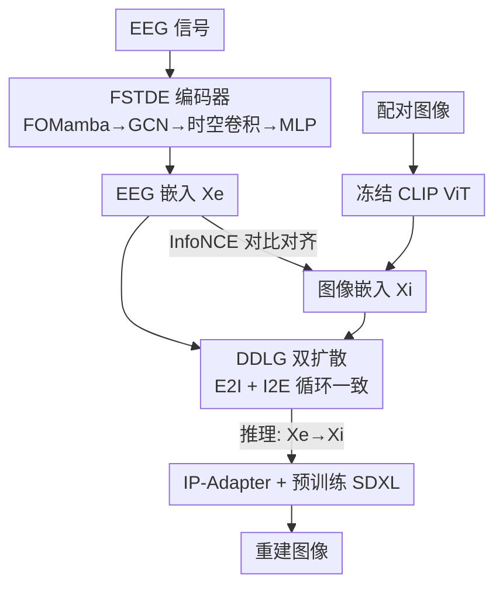

# D$^2$-FOSA: Dual-Diffusion Guided EEG-to-Image Reconstruction with Frequency-Oriented Semantic Alignment

**会议**: CVPR 2026  
**论文**: [CVF Open Access](https://openaccess.thecvf.com/content/CVPR2026/html/Yu_D2-FOSA_Dual-Diffusion_Guided_EEG-to-Image_Reconstruction_with_Frequency-Oriented_Semantic_Alignment_CVPR_2026_paper.html)  
**代码**: 无（源码随补充材料提供）  
**领域**: 医学图像 / 脑机接口（EEG 视觉解码）  
**关键词**: EEG-to-Image、脑机接口、频率感知 Mamba、跨模态对齐、双向扩散

## 一句话总结
D2-FOSA 用一个「频率感知的状态空间编码器 FOMamba」把噪声大、低信噪比的 EEG 信号编码成判别性强的脑电嵌入，再用一对对称的「双向扩散生成器 DDLG」在 CLIP 共享潜空间里强制 EEG↔图像的循环一致对齐，最后经 IP-Adapter + SDXL 渲染出图像；在 THINGS-EEG 重建任务上 FID 比同期的 MB2C 低 17 以上。

## 研究背景与动机
**领域现状**：从非侵入式 EEG 中解码视觉感知是脑机接口（BCI）的核心目标之一。当前主流做法是把 EEG 编码到 CLIP 视觉语义空间，用对比学习对齐脑电与图像特征，再把对齐后的脑电嵌入当作条件喂给扩散模型生成图像。常用编码器从早期的 CNN（EEGNet）、RNN 演化到 GNN、Transformer，以及最近的状态空间模型 Mamba。

**现有痛点**：作者指出两个被长期忽视的问题。其一，主流 EEG 编码器是「频率无关（frequency-agnostic）」的，它们把信号当成一般时序处理，却没有显式刻画视觉认知所依赖的特定频段神经振荡（如 Beta 13–30 Hz、Gamma 30–60 Hz）——而这些振荡恰恰是从低信噪比脑电里提取判别信息的关键。其二，单纯用对比损失做 EEG–图像对齐只能拉近高层语义，得到的是一种「弱对齐」：对检索任务尚可，但跨越巨大的模态鸿沟去做高保真生成时，结构一致性不够，生成图像保真度差。

**核心矛盾**：EEG 是一种由多个衰减振荡模式叠加而成的振荡信号，而标准 SSM/Mamba 的对角状态矩阵只能建模独立衰减、无法表达「耦合的振荡」结构；同时，判别式对比对齐与生成式高保真这两个目标之间存在张力——只优化对比，潜空间缺乏可生成性。

**本文目标**：(1) 让编码器显式建模、并放大任务相关频段的神经振荡；(2) 让 EEG–图像对齐既判别性强又可生成（双向、双射）。

**切入角度**：把状态空间模型的状态矩阵从「对角」改造成「分块对角的 2×2 振荡块」，每块对应一个复共轭特征对（damping + 频率），从而把「频率」变成可学习、可调的显式参数；同时把扩散模型从「最终生成解码器」重新定位为「潜空间里的循环一致正则器」。

**核心 idea**：用频率导向的 FOMamba 替代频率无关的编码器来抓振荡，用双向扩散的循环一致约束替代单纯对比来做跨模态对齐。

## 方法详解

### 整体框架
D2-FOSA 是一个端到端的 EEG→图像翻译框架，分训练与推理两条路。训练时：EEG 信号经 **FSTDE 编码器**得到脑电嵌入 $X_e$，配对图像经冻结的 CLIP ViT 得到图像嵌入 $X_i$，两者先用 InfoNCE 对比损失拉到同一语义空间；与此同时，**DDLG（双扩散潜空间生成器）**用两个对称模块 E2I-DLG（EEG→图像）和 I2E-DLG（图像→EEG）在潜空间内互相重建对方的嵌入，强制循环一致，作为强正则把两个模态的潜空间「绑紧成双射」。推理时只走前向：FSTDE 把 EEG 编码成 $X_e$，DDLG 通过反向扩散把它翻译成图像嵌入 $X_i$，再把 $X_i$ 作为条件喂给 IP-Adapter，驱动预训练 SDXL 渲染出最终像素图像。

### 关键设计

**1. FOMamba：把状态空间模型改造成显式建模神经振荡的频率导向 Mamba**

痛点很直接：EEG 是多个「衰减振荡模式」叠加出来的信号，而标准 SSM 用对角状态矩阵 $A$，只能描述彼此独立的指数衰减，抓不住振荡的耦合本质，于是编码器对 Beta/Gamma 这类关键频段「视而不见」。FOMamba 的做法是把 $A$ 结构化成**分块对角矩阵**，每个 $2\times2$ 子块 $A_k$ 显式编码一个衰减振荡模式：

$$A_k = \begin{pmatrix} -\rho_k & -\omega_k \\ \omega_k & -\rho_k \end{pmatrix}$$

其中 $\rho_k>0$ 是阻尼因子、$\omega_k>0$ 是角频率，对应一对复共轭特征值 $\lambda_k=-\rho_k\pm j\omega_k$——这正好就是一个「以 $\omega_k$ 振荡、以 $\rho_k$ 衰减」的神经振子。为了让模型自适应不同频段，作者给每个模式加一个可学习的对数频率偏置 $F_{\log,k}$ 来动态调频：$\tilde{\omega}_k=\mathrm{softplus}(\omega_k+F_{\log,k})$。离散化时用可学习步长 $\Delta t$，对 $A_k$ 做精确的矩阵指数 $e^{A_k\Delta t}$，得到优雅的闭式解：

$$A_{d,k} = e^{-\rho_k\Delta t}\begin{pmatrix} \cos(\tilde{\omega}_k\Delta t) & -\sin(\tilde{\omega}_k\Delta t) \\ \sin(\tilde{\omega}_k\Delta t) & \cos(\tilde{\omega}_k\Delta t) \end{pmatrix}$$

这个离散矩阵恰好是「旋转（振荡）× 指数衰减」，完美保留了振荡动力学；随后用 Mamba 的硬件高效选择性扫描在分块对角 $A_d=\mathrm{blkdiag}(A_{d,k})$ 上更新隐状态。为什么有效：频率谱分析（PSD）显示，FOMamba 相比基线 Mamba 会**选择性放大** Beta/Gamma 频段的能量，而不是像普通 Mamba 那样无差别压制高频——也就是说它学会了「增强任务相关频率」，这是消融里 FOMamba 单独就能把 Top-1 从 Mamba 的 27.75% 拉到 31.18% 的根本原因。

**2. FSTDE：在 FOMamba 之上叠加图结构与时空建模的三级脑电编码器**

只有时序频率建模还不够——EEG 是多通道电极信号，通道之间有空间拓扑关系。FSTDE（Frequency-Spatio-Temporal Dynamics Encoder）把三件事串成层级管线：先用若干 FOMamba 块抓振荡时序得到 $H_t$；再用 **Neural Graph Structure Extractor** 把电极按 10-20 系统天然构成的图 $G$ 拿来，用 GCN 在通道间传播信息 $H_s=\sigma(D^{-1/2}AD^{-1/2}H_tW^{(l)})$（$A$ 是邻接矩阵、$D$ 是度矩阵），融合相邻通道的空间信息；最后用一个受 EEGNet 启发、由深度可分离卷积构成的 **Spatio-Temporal Feature Extractor** 抓局部时空模式，flatten 后经门控 MLP 投影成最终嵌入 $X_e\in\mathbb{R}^d$。三级分别覆盖「频率振荡 → 通道拓扑 → 局部时空」，互补地把低信噪比原始脑电压成一个判别性强、对噪声鲁棒的嵌入，供下游对齐使用。

**3. DDLG：用双向扩散的循环一致约束替代单纯对比，做「双射级」跨模态对齐**

对比损失只拉近高层语义、缺乏细粒度结构对齐，跨越 EEG↔图像的大模态鸿沟时不够。DDLG（Dual Diffusion Latent Generator）的关键反转是：**不把扩散当最终生成解码器，而把它当潜空间里的生成式正则器**。它由两个对称模块组成——E2I-DLG 以 EEG 嵌入 $X_e$ 为条件 $c$、从高斯噪声去噪重建图像嵌入 $X_i$；I2E-DLG 反过来从图像重建 EEG。每个模块的核心是条件反向过程

$$p_\theta(z_{t-1}\mid z_t, c) = \mathcal{N}\big(z_{t-1}; \mu_\theta(z_t, c, t), \sigma_t^2 I\big)$$

均值函数 $\mu_\theta$ 用 U-Net 实现，通过 FiLM 层把条件嵌入（$X_e$ 或 $X_i$）注入网络。这种对称双路设计强制 EEG 与图像嵌入不仅「判别上相似」、还要「生成上互相可重建」，等价于在两个潜空间之间建立一个紧致、双射的对应——把对齐从弱对齐升级成结构一致的强对齐。为什么有效：消融显示，单向 DDLG（仅 E2I）已有收益，而**完整双向 DDLG** 把 FOMamba 的 Top-1 从 31.18% 进一步推到 37.96%，证明循环一致约束才是学到「既能检索又能生成」潜空间的关键。

### 损失函数 / 训练策略
总目标由对比对齐损失与双向扩散损失组成。对比项用 InfoNCE 把配对的 EEG–图像拉近、错配推远（$\tau$ 为可学习温度）：

$$\mathcal{L}_{align} = -\log \frac{\exp(\mathrm{sim}(X_e, X_i)/\tau)}{\sum_j \exp(\mathrm{sim}(X_e, X_i^j)/\tau)}$$

双向扩散项是标准 DDPM 噪声预测误差，分别对 EEG→图像（条件 $X_e$、目标 $X_i$）和图像→EEG（条件 $X_i$、目标 $X_e$）：

$$\mathcal{L}_{E2I} = \mathbb{E}_{z_0\sim X_i,\,\epsilon,\,t}\big[\lVert \epsilon - \epsilon_\theta(\sqrt{\bar\alpha_t}z_0 + \sqrt{1-\bar\alpha_t}\epsilon,\, X_e,\, t)\rVert_2^2\big]$$

$\mathcal{L}_{I2E}$ 形式相同、把 $X_e$ 与 $X_i$ 角色互换。总损失 $\mathcal{L}_{total}=\mathcal{L}_{align}+\lambda_{E2I}\mathcal{L}_{E2I}+\lambda_{I2E}\mathcal{L}_{I2E}$，实验中 $\lambda_{E2I}=\lambda_{I2E}=0.5$。实现上：FSTDE 串 3 个 FOMamba 块 + 两层 GCN + EEGNetV4 风格特征提取 + 投影 MLP；阻尼因子 $\rho_k$ 约束在 $[0.5, 0.995]$ 保证稳定；DDLG 用 5 块 MLP-U-Net、1000 步线性方差表；单卡 NVIDIA L40S，AdamW（weight decay $10^{-2}$），主框架学习率 $10^{-4}$、扩散模块 $5\times10^{-5}$，cosine 衰减，最多 1000 epoch 配早停。

## 实验关键数据

### 主实验
在四个公开基准（THINGS-EEG、THINGS-MEG、EEGCVPR40、EEGImageNet）上评估零样本检索与图像重建。

THINGS-EEG 200-way 零样本检索（10 受试者平均，Top-1/Top-5 %）：

| 设置 | 方法 | 年份 | Top-1 | Top-5 |
|------|------|------|-------|-------|
| Intra-subject | MB2C | 2024 | 28.5 | 60.4 |
| Intra-subject | VE-SDN | 2025 | 37.2 | 69.9 |
| Intra-subject | **D2-FOSA** | 2025 | **38.0** | **70.7** |
| Inter-subject | MB2C | 2024 | 11.9 | 32.0 |
| Inter-subject | UBP | 2025 | 12.4 | 33.4 |
| Inter-subject | **D2-FOSA** | 2025 | **13.1** | **34.6** |

跨基准检索（部分，Top-1/Top-5 %）：THINGS-MEG intra 27.5/55.7（UBP 26.7/55.2）；EEGImageNet 31.05/63.10（MB2C 29.65/61.30）；EEGCVPR40(raw) 89.20/98.35（MB2C 88.73/98.24）。

THINGS-EEG 图像重建质量（Table 3）：

| 方法 | IS ↑ | FID ↓ | KID ↓ | SSIM ↑ | PCC ↑ |
|------|------|-------|-------|--------|-------|
| MB2C | 10.19 | 163.94 | 0.027 | 0.333 | 0.188 |
| **D2-FOSA** | **11.81** | **146.33** | **0.025** | **0.350** | **0.193** |

FID 从 163.94 降到 146.33（降幅 >17），即摘要所称「比同期 MB2C 低 17 FID」，所有分布类（IS/FID/KID）与像素类（SSIM/PCC）指标全面领先。

### 消融实验
THINGS-EEG 上拆解骨干编码器与 DDLG（× 无 DDLG，† 仅 E2I 单向，✓ 完整双向）：

| 编码器 | DDLG | 200-way Top-1 | 200-way Top-5 |
|--------|------|--------------|--------------|
| Transformer | × | 25.30 | 57.20 |
| Mamba | × | 27.75 | 58.45 |
| FOMamba | × | 31.18 | 63.73 |
| FOMamba | † (单向) | 35.36 | 67.46 |
| FOMamba | ✓ (双向) | **37.96** | **70.67** |

### 关键发现
- **两个组件各自贡献都大且互补**：仅换编码器（无 DDLG），FOMamba 31.18% 远超 Mamba 27.75% 与 Transformer 25.30%，说明频率感知本身就显著提分；在固定 FOMamba 下，加双向 DDLG 又从 31.18% 拉到 37.96%，说明循环一致对齐是第二大增益来源。
- **双向 > 单向**：单向 DDLG（仅 E2I）已有收益，但完整双向在所有骨干上都给出最大提升，验证「双射式」对齐的必要性。
- **FOMamba 的机制可视化证据**：PSD 与时频差分图显示它净增强 Beta/高 Gamma 频段（普通 Mamba 反而压制高频），说明提分来自「放大任务相关频率」而非笼统降噪。
- **阻尼边界敏感性**：$\rho_{max}=0.995$（接近 1 但避开 1.0 的不稳定）、$\rho_{min}\approx0.5$–$0.7$ 时检索精度最优，即模型偏好「慢衰减、长依赖」的振荡模式。

## 亮点与洞察
- **把「频率」做成 SSM 里的显式可学习参数**：用 2×2 复共轭振荡块 + 可学习对数频率偏置，把神经振荡从「希望网络隐式学到」变成「结构上写死、再让它调频」，并给出离散化闭式解。这套「振荡块 SSM」思路可迁移到任何含周期/振荡结构的时序（如语音、生理信号、传感器周期信号）。
- **扩散模型角色的重新定位**：从「最终生成解码器」变成「潜空间里的循环一致正则器」，这是很可复用的设计哲学——当两个模态需要强对齐而非仅相似时，用双向生成重建当正则，比单纯对比更能逼出结构一致的双射潜空间。
- **判别与生成一举两得**：DDLG 让同一套嵌入既利于检索又利于生成，避免了「为检索训一套、为生成再训一套」的割裂。

## 局限与展望
- 作者自承的局限：**计算效率**（双扩散 + 1000 步 + SDXL 渲染，开销不低）与**跨受试者泛化**（inter-subject 绝对精度仍很低，Top-1 仅 13.1%，远低于 intra 的 38.0%）。未来计划用更自适应的解码策略与多受试者训练范式改善。
- 自己发现的局限：重建保真度虽 SOTA 但绝对值仍有限（FID 146、SSIM 0.35），离「忠实复原所见图像」还远；评测主要在 ImageNet 类目级别语义上，细粒度实例还原能力存疑。生成部分依赖冻结的 CLIP + 预训练 SDXL，端到端可优化空间受限于这两个外部模块。
- DDLG 的双向扩散在潜空间操作，训练时引入两条扩散路 + 平衡系数（$\lambda=0.5$ 经验设定），其对超参与噪声表的鲁棒性未充分展开。

## 相关工作与启发
- **vs 频率无关编码器（EEGNet / 普通 Mamba / Transformer）**：它们把 EEG 当一般时序，FOMamba 显式建模衰减振荡并选择性放大 Beta/Gamma；消融里 FOMamba 单独就比 Mamba/Transformer 高 3–6 个点。
- **vs 纯对比对齐（NICE / ATM / MB2C 等 CLIP-对齐流派）**：它们只用对比损失做弱对齐，本文加双向扩散的循环一致约束做强对齐，检索与重建双双领先（THINGS-EEG 比 MB2C 检索 +9.5 Top-1、重建 FID 低 17）。
- **vs 把扩散当最终解码器的神经解码工作（fMRI/EEG 扩散生成）**：本文把扩散前移成潜空间正则器，再串 IP-Adapter + SDXL 渲染，强调「扩散用于对齐」而非「扩散用于出图」这一角色差异。

## 评分
- 新颖性: ⭐⭐⭐⭐⭐ 振荡块 SSM（FOMamba）+ 双向扩散当对齐正则（DDLG）两处反直觉设计都很扎实
- 实验充分度: ⭐⭐⭐⭐ 四基准 + 检索/重建双任务 + 编码器×DDLG 双轴消融 + 频谱机制可视化，唯 inter-subject 仍弱
- 写作质量: ⭐⭐⭐⭐ 动机—机制—证据链条清晰，公式与可视化到位
- 价值: ⭐⭐⭐⭐ 在 EEG 视觉解码上推进 SOTA，FOMamba 与「扩散即正则」思路有较好迁移性

<!-- RELATED:START -->

## 相关论文

- [\[AAAI 2026\] NeuroBridge: Bio-Inspired Self-Supervised EEG-to-Image Decoding via Cognitive Priors and Bidirectional Semantic Alignment](../../AAAI2026/medical_imaging/neurobridge_bio-inspired_self-supervised_eeg-to-image_decoding_via_cognitive_pri.md)
- [\[CVPR 2026\] SemiGDA: Generative Dual-distribution Alignment for Semi-Supervised Medical Image Segmentation](semigda_generative_dual-distribution_alignment_for_semi-supervised_medical_image.md)
- [\[CVPR 2026\] EEGiT: Teaching Vision Transformers to Understand the EEG signal](eegit_teaching_vision_transformers_to_understand_the_eeg_signal.md)
- [\[ICML 2026\] Plug-and-Play Diffusion Meets ADMM: Dual-Variable Coupling for Robust Medical Image Reconstruction](../../ICML2026/medical_imaging/plug-and-play_diffusion_meets_admm_dual-variable_coupling_for_robust_medical_ima.md)
- [\[CVPR 2026\] Duala: Dual-Level Alignment of Subjects and Stimuli for Cross-Subject fMRI Decoding](duala_dual-level_alignment_of_subjects_and_stimuli_for_cross-subject_fmri_decodi.md)

<!-- RELATED:END -->
