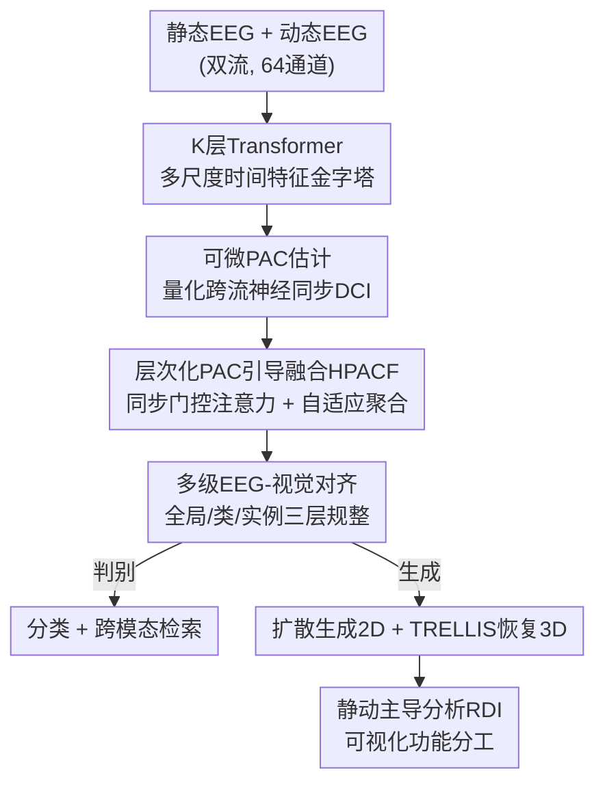

# Decoding 3D Perception via BrainSSD: Synergistic Fusion of EEG Representations from Static and Dynamic Visual Streams

**会议**: CVPR 2026  
**论文**: [CVF Open Access](https://openaccess.thecvf.com/content/CVPR2026/html/Yao_Decoding_3D_Perception_via_BrainSSD_Synergistic_Fusion_of_EEG_Representations_CVPR_2026_paper.html)  
**代码**: https://github.com/vziacq/BrainSSD  
**领域**: 医学图像 / 脑信号解码（EEG）  
**关键词**: EEG 解码, 3D 感知, 相位-幅值耦合, 双流融合, 跨模态对齐

## 一句话总结
BrainSSD 用一个"神经科学启发"的层次化 PAC 引导融合（HPACF）模块，把人看**静态 3D 物体图**和看**物体旋转视频**两套 EEG 信号协同融合，解码出语义丰富的 3D 视觉表征，在分类/检索和 2D/3D 生成重建上全面刷新 SOTA，并首次给出了"静态流负责整体形状、动态流负责精细几何细节"的直接可视化证据。

## 研究背景与动机

**领域现状**：从脑信号（fMRI / EEG）里解码人看到的东西，目前主流做法是把脑活动对齐到 CLIP 这类视觉-语言大模型的嵌入空间，再借助对比学习做分类、检索甚至条件生成重建。但这条线几乎全部建立在**静态 2D 图像**刺激上。

**现有痛点**：静态图像范式天生捕捉不到多视角观察、运动视差这些构造真实 3D 知觉所必需的神经动态。少数先驱工作（如 Mind-3D 的 fMRI、Neuro-3D 的 EEG）开始用旋转视频做 3D 重建，证明了持续观察的神经信号里藏着更丰富的信息——但旋转视频诱发的 EEG 信噪比更低、更复杂，单独用并不稳。

**核心矛盾**：认知神经科学反复表明，鲁棒的知觉来自大脑把**多条互补处理通路**的信息综合起来。可现有 EEG 解码研究几乎都只围绕**单一类型刺激**（要么静态、要么动态），缺乏把静态、动态两套异质神经信号有效融合的机制——这两类信号到底怎么协同、各自负责什么，基本是空白。

**本文目标**：作者把"3D 知觉解码"这个大问题拆成三个研究问题：RQ1 动态观察的神经表征是否比静态编码了更丰富的 3D 几何信息？RQ2 用什么"神经启发"的计算架构能有效协同这两路信号？RQ3 两路信号在最终 3D 知觉构建中是否存在功能分工？

**切入角度**：作者从两条"神经计算基本原则"出发——**层次化处理**（大脑多级地加工信息）和**神经同步**（不同脑区靠节律耦合来"绑定"信息）。前者用多级 cross-attention 实现，后者用一个可微的相位-幅值耦合（PAC）估计器来量化并动态指导融合。

**核心 idea**：用"PAC 量化的神经同步 × 层次化 cross-attention"来引导静态流与动态流 EEG 的融合，把脑科学里的同步现象显式接进注意力机制，从而解码出高保真的 3D 视觉表征。

## 方法详解

### 整体框架

BrainSSD 是一条多阶段流水线，整体分三段。**编码段**：静态 EEG $x_{stat}\in\mathbb{R}^{C\times T_{stat}}$ 和动态 EEG $x_{dyn}\in\mathbb{R}^{C\times T_{dyn}}$（$C=64$ 通道）各自先过 $K$ 层 Transformer，得到多尺度时间特征金字塔，再由核心模块 **HPACF** 协同融合成稠密嵌入 $L_{fused}$，并经一套多级对齐策略把它拉到视觉特征空间、压成 $z\in\mathbb{R}^d$。**解码段**：嵌入 $z$ 一边喂给两个线性分类器和检索头做判别任务，一边作为唯一条件去驱动扩散模型生成 2D 图像、再由 TRELLIS 恢复 3D 几何。**分析段**：通过"全融合重建 vs 只用单流重建"的差异，算出一张表征依赖图，可视化静态/动态两路的功能分工。

整个 pipeline 从原始双流 EEG 一路转到 3D 点云，中间最吃功夫的是 HPACF 融合编码和 EEG-视觉对齐，下面按数据流自上而下拆。

### 关键设计

**1. 可微相位-幅值耦合估计：把"神经同步"做成端到端能学的信号**

这一步针对的痛点是：脑科学里"相位-幅值耦合（PAC）"——低频相位调制高频幅值——被认为是跨脑区信息绑定的标志，但经典的 KL 调制指数（KL-MI）是不可微的统计量，没法塞进神经网络一起训练。作者重新设计了一个可微版本：先对每路 EEG 做短时傅里叶变换（STFT），抽出每个通道 $c$ 的低频相位 $\phi_{LF}(c,t)$ 和高频幅值 $A_{HF}(c,t)$；然后构造一个可微的相位-幅值分布，把高频幅值按相位用高斯核加权分配到 $N_{bins}$ 个相位 bin 里：

$$\tilde{P}_c(j)=\sum_{t=1}^{T_{win}}A_{HF}(c,t)\cdot\exp\!\left(-\frac{(\phi_{LF}(c,t)-\mu_j)^2}{2\sigma_c^2}\right)$$

其中 $\mu_j$ 是第 $j$ 个相位 bin 的中心，$\sigma_c$ 是**逐通道可学习**的核宽。把 $\tilde{P}_c$ 做 L1 归一化得到概率分布 $P_c$ 后，用它与均匀分布 $U$ 的 KL 散度定义**可微耦合指数（DCI）**：

$$\text{DCI}_c=\log(N_{bins})+\sum_{j=1}^{N_{bins}}P_c(j)\log P_c(j)$$

直觉是：幅值越集中在某个相位（偏离均匀分布越远），耦合越强、DCI 越大。关键在于作者算的是**跨流**耦合，得到两个通道级向量 $\text{DCI}_{S\to D}\in\mathbb{R}^C$（静态相位/动态幅值）和 $\text{DCI}_{D\to S}\in\mathbb{R}^C$（动态相位/静态幅值），直接量化了两路神经信号之间的同步关系，供下一步门控用。

**2. 层次化 PAC 引导融合（HPACF）：用神经同步动态门控跨流注意力**

有了同步度量，问题变成"怎么让它真正指导融合"。HPACF 在每个层级用一个专门的 **PAC 引导注意力层**，把标准多头 cross-attention 扩展成同步可调的版本：以静态 EEG 为 query $Q$、第 $k$ 级动态 EEG 为 key/value，先算原始注意力分 $S_{raw}\in\mathbb{R}^{H\times T_{align}\times T_{align}}$；同时把跨流 DCI 向量送进一个小 MLP $g_{pac}$，学出一组逐头的调制因子去**乘性门控**注意力分：

$$S_{modulated}=S_{raw}\odot\sigma\big(g_{pac}(\text{DCI}_{S\to D},\text{DCI}_{D\to S})\big)$$

$\sigma$ 是 sigmoid，$\odot$ 是广播相乘。这样每个注意力头的信息流强弱都由底层神经同步动态决定——同步强的方向放行、弱的抑制，把脑科学的"绑定"现象显式接进了注意力，而不是让网络盲目地拼两路特征。这一步在所有 $K$ 级上各做一次，得到一组层级特异表征 $\{O_1,\dots,O_K\}$。为了从这层级金字塔里合出一个连贯表征，作者再用一个**自适应聚合**：用 softmax 归一化的可学习参数得到注意力策略 $\alpha\in\Delta^{K-1}$，把各级输出做凸组合 $L_{fused}=\sum_k\alpha_k O_k$，相当于在特征层级上学一个任务相关的"注意力滤镜"。消融显示这套"层次化 + PAC 门控"是性能主力（见下文）。

**3. 多级 EEG-视觉对齐：在全局/类/实例三个尺度把脑表征拉进视觉空间**

融合出的 $L_{fused}$ 要能解码出视觉语义，就得对齐到视觉域，但 EEG 和视觉的分布差距太大，单纯逐样本映射不够。作者提出三层对齐。**全局谱校正（GSC）**先匹配两个模态的二阶统计量：对一个 batch 的 EEG 嵌入矩阵 $Z\in\mathbb{R}^{n\times d}$ 算协方差 $C_{EEG}=\frac{1}{n-1}(Z^\top Z-\frac{1}{n}(\mathbf{1}^\top Z)^\top(\mathbf{1}^\top Z))$，再用动量维护的稳定视觉协方差 $\bar{C}_{Vision}$ 做对齐，损失 $L_{GSC}=\frac{1}{4d^2}\|C_{EEG}-\bar{C}_{Vision}\|_F^2$，让 EEG 特征的相关结构向视觉域看齐，动量更新缓解了单 batch 估计的噪声。**原型分布对齐（PDA）**解决高基数类空间里单 batch 采样稀疏的问题：为每个类维护一个动量更新的类原型，用最大均值差异（MMD）拉近两模态原型分布 $L_{PDA}=\|\mathbb{E}_{p\sim P_{EEG}}[\phi(p)]-\mathbb{E}_{q\sim P_{Vision}}[\phi(q)]\|_{\mathcal{H}_k}^2$，从而保持概念之间的相对排布跨模态一致。**实例级对齐**再用 CLIP 对比损失 $L_{CLIP}$ 增强局部判别性、用 MSE 损失 $L_{MSE}$ 逼配对实例点对点对应。最终目标是这些项加上类加权交叉熵 $L_{CLS}$ 的加权和 $L_{total}=\sum_i\lambda_i L_i$。

**4. 静-动主导分析：用单流消融重建反推两路的功能分工**

这一步是论文回答 RQ3、也是最有"科学发现"味道的设计。作者不直接看脑信号，而是看**去掉某一路后重建结果变了多少**。对每个认知事件准备三张 3D 物体图：全融合基线 $I_{fused}$、只用静态流的 $I_{stat}$、只用动态流的 $I_{dyn}$（用 ORB 单应对齐）。对动态流的依赖图 $A_{dyn}$ 定义为"全融合 vs 去掉动态（即只剩静态）"在预训练图像编码器多层特征上的多尺度余弦距离：

$$A_{dyn}(i,j)=\sum_{l=1}^{L}w_l\cdot D_{cos}\big(\phi_l(I_{fused}),\phi_l(I_{stat})\big)_{(i',j')}$$

静态依赖图 $A_{stat}$ 同理。再算一个归一化的**表征依赖指数（RDI）**做相对比较：

$$\text{RDI}(i,j)=\frac{N(A_{dyn})_{i,j}-N(A_{stat})_{i,j}}{N(A_{dyn})_{i,j}+N(A_{stat})_{i,j}+\epsilon}$$

最后用 SAM 把物体切成语义部件，在每个部件内对 RDI 求平均，就得到了"这个部件更依赖静态流还是动态流"的部件级地图。结论很干净：整体形状、粗几何依赖静态流（RDI 偏负/蓝），而镜头、机翼、轮胎花纹这类高几何复杂度的精细细节强烈依赖动态流（RDI 偏正/红）。

### 损失函数 / 训练策略

总损失是 $L_{total}=\lambda_{GSC}L_{GSC}+\lambda_{PDA}L_{PDA}+\lambda_{CLIP}L_{CLIP}+\lambda_{MSE}L_{MSE}+\lambda_{CLS}L_{CLS}$，其中 $L_{CLS}$ 是类加权交叉熵以应对类别不平衡。HPACF 编码器为 3 层 Transformer，用 AdamW + OneCycleLR 训练；生成端在冻结的 SDXL-Turbo 上微调一个轻量 IP-Adapter（50 epoch）把 EEG 表征注入扩散模型的 cross-attention，3D 由冻结的 TRELLIS 恢复。所有 baseline 都被双流适配（特征拼接）以保证公平。

## 实验关键数据

数据集为 EEG-3D（目前唯一公开的静/动配对 3D 知觉 EEG 基准）：64 通道、12 名被试、72 个物体类别，每类有静态图与旋转视频两种刺激。实现用 PyTorch 2.1，4×RTX 3090。判别任务用 Top-K 准确率；生成用 PSNR/SSIM/LPIPS（2D）与 Chamfer Distance/F-score（3D）。

### 主实验

判别任务上 BrainSSD 全面 SOTA。下表为部分关键列（%）：

| 方法 | Object 2-Way Top-1 | Object 72-Way Top-1 | Retrieval Top-1 | Retrieval Top-5 |
|------|------|------|------|------|
| Chance level | 1.39 | 33.33 | 25.00 | 10.00 |
| BrainAlign (2025) | 6.11 | 63.61 | 5.70 | 16.39 |
| Neuro-3D (2025) | 5.91 | 61.40 | 5.42 | 16.25 |
| BrainSSD (Static-Only) | 5.15 | 57.29 | 4.98 | 14.76 |
| BrainSSD (Dynamic-Only) | 5.09 | 57.23 | 4.80 | 14.47 |
| **BrainSSD（全模型）** | **7.12** | **68.06** | **6.65** | **21.76** |

Top-1 检索从此前最好的 5.70% 提到 6.65%，相对提升 16.67%；相对更强的 Static-Only 基线（4.98%）更是相对提升 33.53%，直接证明静、动两路互补且非冗余——单流都不如融合。

生成重建（Table 2）：

| 方法 | PSNR↑ | SSIM↑ | LPIPS↓ | CD↓ | F-score↑ |
|------|------|------|------|------|------|
| Static-Only | 13.437 | 0.666 | 0.702 | 0.130 | 0.255 |
| Dynamic-Only | 13.546 | 0.672 | 0.694 | **0.096** | 0.273 |
| **BrainSSD** | **13.561** | **0.693** | **0.647** | 0.113 | **0.304** |

全模型拿到最低 LPIPS（0.647）和最高 3D F-score（0.304）。一个很说明问题的对比：Static-Only 出的图感知更连贯，但 **Dynamic-Only 的几何精度明显更好**（CD 0.096 vs 0.130，F-score 0.273 vs 0.255）——这正面回答了 RQ1：动态流确实编码了更精细的 3D 结构。

### 消融实验

| 配置 | 现象 | 说明 |
|------|------|------|
| Full model | Top-1 检索 6.65% | 完整模型 |
| w/o Hierarchy | 6.65 → 5.15% | 去掉层次化融合，掉 1.5 个点 |
| w/o PAC-guided attention | 6.65 → 4.75% | 去掉 PAC 门控，掉近 1.9 个点（最伤） |
| w/o PDA / GSC | 显著下降 | 去掉对齐策略也明显掉点 |

复杂度分析（Table 3）：全模型仅 4.42M 参数 / 0.36G FLOPs，比同量级 baseline 在 Top-1 检索上相对 >16% 增益。PAC 模块以极小代价（+7% 参数、+3% FLOPs）带来约 40% 相对检索提升；Hierarchy 以中等代价（+27% 参数、+16% FLOPs）带来约 29% 提升。

### 关键发现
- **PAC 门控贡献最大**：去掉它 Top-1 检索掉得最多（到 4.75%），而它几乎不增成本，是性价比最高的设计。
- **频段有讲究**：PAC 耦合 theta-alpha 相位 / gamma 幅值时性能峰值，视觉编码器用 OpenCLIP 最好——这与 theta-alpha/gamma 同步在记忆和信息整合中的已知作用吻合。
- **功能分工是真实可视的**：部件级分析里，整个物体的平均 RDI 一致为负（静态流主导整体框架），而领带、车舱内饰这类精细部件平均 RDI 强烈为正（动态流主导细节），与经典视觉"双流假说"相呼应。

## 亮点与洞察
- **把不可微的脑科学统计量改造成可学习模块**：PAC 本是离线分析用的 KL-MI，作者用高斯核加权 + STFT 把它做成端到端可微的 DCI，再当成注意力门控信号——这种"把神经科学先验显式编进网络结构"的做法很有迁移价值，可推广到其它需要引入节律/同步先验的生理信号建模。
- **用"去掉一路看重建怎么变"来做可解释性**：RDI 这个反事实式的依赖度量，绕开了"直接解读 EEG 通道"的困难，把抽象的神经分工落到了像素/部件级的可视化上，是把判别模型变成科学发现工具的好范式。
- **互补性被定量坐实**：静态流强在判别/整体形状、动态流强在几何精度，且融合后两边都超越——这给"为什么要多刺激范式融合"提供了干净的证据，而不只是性能数字。

## 局限与展望
- 作者承认：受限于 3D 知觉 EEG 大规模数据稀缺，工作停在**被试专属、单物体**解码，未跨被试、未做组合式场景重建。
- 仅在 EEG-3D 这一个数据集上验证（目前也只有它），泛化性存疑——⚠️ 跨数据集鲁棒性以未来工作为准。
- 功能分工结论依赖生成重建管线（SDXL-Turbo + TRELLIS + VGG-19 特征），RDI 度量本身受这些预训练模型的归纳偏置影响，"神经分工"的解读应保留 caveat。
- 改进方向：跨被试泛化、从单物体扩到组合场景、以及把 PAC 频段/核宽等先验做得更自适应。

## 相关工作与启发
- **vs Neuro-3D (2025)**：Neuro-3D 同样用旋转视频 EEG 做 3D 重建，但围绕单一动态刺激；BrainSSD 把静态 + 动态双流用 PAC 引导融合，在 72-Way Top-1（68.06% vs 61.40%）和检索 Top-1（6.65% vs 5.42%）上全面更高。
- **vs BrainAlign (2025)**：BrainAlign 是当时判别最强的基线（检索 Top-1 5.70%），但仍是单流对齐路线；BrainSSD 在相近参数量下相对提升 >16%，且额外给出生成重建与功能分工分析。
- **vs 静态范式主流（CLIP 对齐类方法）**：这类方法把脑信号对齐到 CLIP 空间做分类/检索/生成，但只用静态 2D 刺激，捕捉不到运动视差；BrainSSD 沿用 CLIP 对齐思路（$L_{CLIP}$ 仍在），但补上了动态流和神经同步建模，专门攻 3D 知觉。

## 评分
- 新颖性: ⭐⭐⭐⭐⭐ 首次做静/动 EEG 双流融合 + 可微 PAC 门控注意力，并首次给出 3D 知觉功能分工的直接可视化证据
- 实验充分度: ⭐⭐⭐⭐ 判别/生成/消融/复杂度/可解释性都覆盖，但只有 EEG-3D 单数据集、被试专属
- 写作质量: ⭐⭐⭐⭐⭐ 三个 RQ 串起全文，方法与脑科学动机扣得紧，逻辑清晰
- 价值: ⭐⭐⭐⭐ 给 EEG-to-3D 解码立了新 SOTA，并提供了把判别模型当神经科学探针的可解释范式

<!-- RELATED:START -->

## 相关论文

- [\[CVPR 2026\] NeuroFlow: Toward Unified Visual Encoding and Decoding from Neural Activity](neuroflow_toward_unified_visual_encoding_and_decoding_from_neural_activity.md)
- [\[ICLR 2026\] Towards Interpretable Visual Decoding with Attention to Brain Representations](../../ICLR2026/medical_imaging/towards_interpretable_visual_decoding_with_attention_to_brain_representations.md)
- [\[CVPR 2026\] EEGiT: Teaching Vision Transformers to Understand the EEG signal](eegit_teaching_vision_transformers_to_understand_the_eeg_signal.md)
- [\[CVPR 2026\] Learning Generalizable 3D Medical Image Representations from Mask-Guided Self-Supervision](learning_generalizable_3d_medical_image_representations_from_mask-guided_self-su.md)
- [\[CVPR 2026\] VesMamba: 3D Pulmonary Vessel Segmentation from CT images via Mamba with Structural Perception and Scale-aware Filtering](vesmamba_3d_pulmonary_vessel_segmentation_from_ct_images_via_mamba_with_structur.md)

<!-- RELATED:END -->
