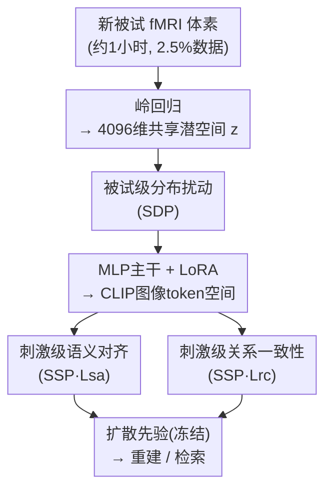

# Duala: Dual-Level Alignment of Subjects and Stimuli for Cross-Subject fMRI Decoding

**会议**: CVPR 2026  
**论文**: [CVF Open Access](https://openaccess.thecvf.com/content/CVPR2026/html/Li_Duala_Dual-Level_Alignment_of_Subjects_and_Stimuli_for_Cross-Subject_fMRI_CVPR_2026_paper.html)  
**代码**: https://github.com/ShumengLI/Duala  
**领域**: 医学图像 / 脑机接口 / 跨被试 fMRI 解码  
**关键词**: fMRI 视觉解码, 跨被试, 语义对齐, 分布扰动, 数据受限微调

## 一句话总结
针对"把预训练的 fMRI-to-image 解码模型迁移到只有约 1 小时数据的新被试时性能暴跌"这一痛点，Duala 在微调阶段同时做**刺激级语义保持**（用三元组对齐损失 + 关系一致性损失守住类别边界）和**被试级分布扰动**（用源被试的协方差给新被试表征加扰动），仅引入 4.68M 可训练参数就把跨被试图像/脑信号检索准确率分别推到 84.5% / 81.1%，超过此前 SOTA MindTuner 1.4% / 5.1%。

## 研究背景与动机

**领域现状**：fMRI 视觉解码（从脑活动重建/检索看到的图像）随着 CLIP、Stable Diffusion 这类跨模态大模型的出现进步显著，主流范式是把体素响应（voxel response）投影进预训练大模型的潜空间，再借扩散先验重建图像。但绝大多数工作是**单被试范式**——每个被试单独训一个解码器。

**现有痛点**：单被试解码器因为皮层解剖和认知模式的个体差异，几乎无法泛化到其他人；而给每个新被试采集足量 fMRI 又极其昂贵（NSD 数据集采一个被试的高质量数据要扫 40 小时）。于是跨被试解码——拿预训练好的模型去适配只有少量数据的新被试——成了关键问题。现有跨被试方法（如 MindEye2、MindTuner）在预训练阶段表现很好，可一旦在新被试上微调，**图像→脑检索准确率会掉 41%**。

**核心矛盾**：作者观察到微调把预训练阶段学到的"脑活动↔视觉表征"稳健对应关系**破坏**了，根因有两层。其一是**刺激级不一致**：t-SNE 显示预训练被试的不同类别刺激边界清晰，微调后新被试的类别边界变得模糊，模型分不清新被试看到的不同刺激。其二是**被试级错配**：NSD 里超过 90% 的视觉刺激在被试之间是不同的（同一类"猫"，每个人看到的具体照片都不一样），所以根本无法做严格的一对一刺激对齐，模型难以建立稳定的跨被试对应。

**本文目标**：在数据受限（单次扫描会话，约 1 小时、占完整数据 2.5%）条件下，把预训练解码模型 $F_\theta$ 适配成新被试可用的 $F_{\theta'}$，同时解决上面两个层级的问题。

**切入角度**：把"对齐"拆成两个独立但互补的层级——刺激层面要**保住语义结构**（类内紧、类间分），被试层面要**容纳个体差异**而不被对齐"洗掉"。这两件事如果只做一个都不够：只保语义会过拟合源被试几何，只做被试对齐又会糊掉类别边界。

**核心 idea**：双层对齐（Dual-level Alignment）——刺激级用语义+关系约束守住类别几何，被试级用基于源被试统计量的分布扰动让模型对个体变异鲁棒，二者联合微调。

## 方法详解

### 整体框架

Duala 不重新设计解码主干，而是直接复用 MindEye2 的预训练管线，在**微调阶段**插入两个对齐模块。预训练管线的流程是：新被试的体素响应 $V^{s_N}$（每个被试约 13,000–18,000 个体素）先经岭回归（ridge regression）线性投影进 4096 维共享潜空间得到嵌入 $z^{s_N}$，再由含四个残差块的 MLP 主干映射到 OpenCLIP ViT-bigG/14 的图像 token 空间（$256\times1664$），最后同时送进扩散先验（对齐 CLIP 图像潜分布）和两个轻量 MLP 分支（低层重建 + 图像检索）。微调时扩散先验和大部分模块**冻结**，只在 MLP 主干里插 rank-8 的 LoRA 适配器训练。

在这条主干上，Duala 加了两件事：**Subject-level Distribution Perturbation（SDP）**在岭回归后的潜空间嵌入上做协方差驱动的高斯扰动，让新被试表征覆盖跨个体的可能变化；**Stimulus-level Semantic Preservation（SSP）**在 MLP 适配后的表征上施加两个约束——语义对齐损失 $L_{sa}$（三元组）和关系一致性损失 $L_{rc}$（类原型相似度矩阵对齐）。整套微调目标为

$$L_{ft} = L_{dec} + \lambda_1 L_{sa} + \lambda_2 L_{rc},$$

其中 $L_{dec}$ 是沿用 MindEye2 的解码损失（扩散先验 + 双向对比检索 + 低层重建）。

### 关键设计

**1. 刺激级语义对齐：用三元组损失守住新被试自己的类内/类间几何**

这一项直接针对"微调后新被试类别边界变模糊"的痛点。目标是让同一被试内同类刺激的 fMRI 嵌入彼此更近、异类更远。对岭回归后的嵌入 $z^{s_N}$，作者采样一个锚点 $z^{s_N}_a$、一个同类正样本 $z^{s_N}_p$（$y_a=y_p$）和一个异类负样本 $z^{s_N}_n$（$y_n\neq y_a$），用余弦相似度 $s(\cdot,\cdot)$ 替代欧氏距离，要求 $s(z^{s_N}_a, z^{s_N}_p) > s(z^{s_N}_a, z^{s_N}_n)$，并写成三元组损失：

$$L_{sa} = \sum_a \max\!\big(0,\ m - s(z^{s_N}_a, z^{s_N}_p) + s(z^{s_N}_a, z^{s_N}_n)\big),$$

其中 $m>0$ 是边界超参，保证类间最小间隔。这一项的作用是把新被试的嵌入组织成语义对齐的空间，但消融显示它单独使用时会"过紧"——类内凝聚增强、脑检索冲到 92.38%，却会偏置前向（图像）匹配让图像检索略降，因此必须和被试级扰动配合。

**2. 刺激级关系一致性：把源被试学到的"类间相似度结构"迁移给新被试**

由于跨被试看的是不同图像（同类的鸟/巴士/钟也长得不一样），不能做逐样本对齐，但**类与类之间的相似关系应当跨被试保持一致**。作者为每个被试 $s$ 的每个类 $c$ 计算原型 $p^s_c$（该类所有归一化嵌入的均值），再算类原型两两余弦相似度组成类相似矩阵 $S^s \in \mathbb{R}^{C\times C}$，元素 $S^s_{c_1,c_2}=s(p^s_{c_1}, p^s_{c_2})$。把所有源被试的矩阵聚合成参考语义相似矩阵 $S^{ref}$；适配新被试 $s_N$ 时构造它的 $S^{s_N}$ 并最小化二者差异：

$$L_{rc} = \frac{1}{|\Omega|}\sum_{(c_1,c_2)\in\Omega}\big(S^{s_N}_{c_1,c_2} - S^{ref}_{c_1,c_2}\big)^2,$$

$\Omega$ 是有参考相似度可用的类对集合。这样新被试继承了预训练阶段学到的类间相似模式，避免微调把语义几何拽歪。它对应一个"全局正则"角色，权重 $\lambda_2$ 偏敏感：太大（0.5）会过度向源被试几何对齐、反而妨碍新被试适配。

**3. 被试级分布扰动：用源被试的协方差给新被试表征"造变体"，抗个体差异**

SDP 针对"被试级错配"——它把 fMRI 表征分解为反映共享语义的**刺激驱动因子**和捕捉个体解剖/功能特性的**被试特异因子**。作者用源被试 $\{s_1,\dots,s_K\}$ 统计每个类 $c$ 的类均值 $\mu_c=\frac{1}{K}\sum_s \bar z^s_c$（近似共享刺激因子）和被试特异偏差 $\sigma^s_c=\sqrt{\mathrm{Var}(\bar z^s_c)}$。适配新被试时先用类均值中心化 $z^{s_N}_i - \mu_c$ 隔离出被试特异因子，再用源被试偏差做高斯扰动来增广：

$$\tilde z^{s_N}_i = \mu_c + \frac{1}{K}\sum_{s=1}^{K}\sigma^s_c \odot (z^{s_N}_i - \mu_c),$$

$\odot$ 为逐元素缩放（公式中 $\sigma$ 的具体采样/缩放细节 ⚠️ 以原文为准）。直觉上，这是在保住刺激因子提供的语义结构的同时，模拟"换一个个体会长成什么样"的合理变化，让模型对个体特异变异鲁棒，从而在只有一小时数据时也能平滑适配，而不会把新被试的独特性被简单对齐"洗掉"。消融里 SDP 单独加入就能在检索和重建上稳定涨点，且能帮 $L_{sa}$ 找回被它牺牲掉的前向匹配。

### 损失函数 / 训练策略

微调总目标 $L_{ft}=L_{dec}+\lambda_1 L_{sa}+\lambda_2 L_{rc}$，取 $\lambda_1=1.0$、$\lambda_2=0.1$。实现基于 PyTorch、单张 A800；冻结扩散先验和 MLP 模块，仅在 MLP 主干插 rank-8 LoRA。新被试用单次会话（约 1 小时）数据、batch size 10，AdamW（lr=3e-4）+ OneCycle 调度训练 150 epoch；其中 1/3 迭代把 BiMixCo 换成 SoftCLIP 损失。

## 实验关键数据

### 主实验

数据集为 Natural Scenes Dataset（NSD，7T fMRI，刺激取自 MSCOCO-2017），在被试 1/2/5/7 上各用 1 小时数据微调，结果取平均。低层指标含 PixCorr/SSIM/AlexNet(2)/AlexNet(5)，高层语义含 Inception/CLIP/EfficientNet/SwAV，外加图像/脑双向检索。

| 方法 | 来源 | PixCorr↑ | AlexNet(2)↑ | Incep↑ | CLIP↑ | 图像检索↑ | 脑检索↑ |
|------|------|---------|------------|--------|-------|----------|--------|
| MindEye2 | ICML'24 | 0.195 | 84.2% | 81.2% | 79.2% | 79.0% | 57.4% |
| MindAligner | ICML'25 | 0.206 | 85.6% | 81.1% | 82.0% | 79.0% | 75.3% |
| MindTuner | AAAI'25 | 0.224 | 87.8% | 84.8% | 83.5% | 83.1% | 76.0% |
| **Duala（本文）** | - | **0.230** | **87.9%** | **85.4%** | **83.5%** | **84.5%** | **81.1%** |

Duala 在平均图像检索（84.5%）和脑检索（81.1%）上分别超 MindTuner 1.4% 和 5.1%，且四个被试、前向（脑→图）与后向（图→脑）检索全部提升；重建上也拿下 PixCorr/AlexNet(2)/Inception/CLIP 多项最优，t-SNE 显示其类别边界比 MindEye2 微调后清晰得多。

参数效率（以被试 1 的岭回归参数计）：

| 方法 | 微调总参数 |
|------|-----------|
| MindEye2 | 2.2G |
| MindAligner | 139.23M |
| MindTuner | 76.71M |
| **Duala（本文）** | **69.09M**（仅 4.68M 可训练 MLP） |

Duala 用最少的参数拿到最好的解码性能，参数效率与微调稳定性都更优。

### 消融实验

被试 1、1 小时数据，逐个加入三个组件（SDP、SSP-$L_{sa}$、SSP-$L_{rc}$）：

| SDP | $L_{sa}$ | $L_{rc}$ | Incep↑ | CLIP↑ | 图像检索↑ | 脑检索↑ |
|-----|---------|---------|--------|-------|----------|--------|
| ✘ | ✘ | ✘ | 84.24% | 83.35% | 93.31% | 89.92% |
| ✔ | ✘ | ✘ | 84.45% | 83.68% | 93.84% | 90.59% |
| ✘ | ✔ | ✘ | 86.16% | 84.00% | 91.89% | **92.38%** |
| ✔ | ✔ | ✘ | 85.33% | 83.92% | 93.86% | 91.43% |
| ✔ | ✔ | ✔ | **86.62%** | **85.11%** | **94.77%** | 91.22% |

损失权重敏感性（Table 4）显示：$\lambda_1$ 从 0.5 提到 1.0 变化很小，模型对它鲁棒；$\lambda_2$ 更敏感，0.1 最佳，0.5 会过正则、两项检索都降。

### 关键发现
- **$L_{sa}$ 单独用会"偏科"**：只加语义对齐时脑检索冲到 92.38%（全表最高），但图像检索反而降到 91.89%——类内过紧偏置了前向匹配，必须靠 SDP 找回平衡。
- **完整模型取得最佳权衡**：SDP+$L_{sa}$+$L_{rc}$ 同时拿下最高高层语义、最低 EfficientNet/SwAV 距离和最高图像检索，脑检索也保持竞争力。
- **$\lambda_2$ 主要塑造语义几何而非像素结构**：不同 $\lambda_2$ 下 PixCorr/SSIM 几乎不变，说明关系一致性约束作用在语义层。
- **功能对齐可视化（TQ 热图）**：Duala 的 Transfer Quantity 热图在 EarlyVis/OPA/EBA/PPA 等典型视觉区出现清晰的区域热点，与 40 小时完整数据模型一致；而 MindEye2 把高 TQ 均匀摊在皮层、丢了区域结构。

## 亮点与洞察
- **"双层对齐"切中跨被试微调的真实失效模式**：作者先用 41% 检索掉点和 t-SNE 把"刺激级糊 + 被试级错配"两个问题量化出来，再分别对症下药，动机扎实而非凭空设计。
- **关系一致性损失很巧**：跨被试看的图都不一样、没法逐样本对齐，但"类间相似度矩阵应当一致"这个二阶约束绕开了一对一对齐的不可行性，是个可迁移到任何"无配对跨域对齐"场景的思路。
- **分布扰动当数据增广**：用源被试的类内方差给新被试造合理变体，本质是把"跨个体先验"注入数据稀缺的微调，思路可借到其他 few-shot 域适配任务。
- **极致轻量**：仅 4.68M 可训练参数、69.09M 总参数就超过 2.2G 的 MindEye2，说明跨被试性能瓶颈更多在"对齐目标"而非"参数容量"。

## 局限与展望
- 评测只在 NSD 四个被试（1/2/5/7）上做，被试数量偏少，跨数据集/跨扫描仪的泛化性未验证。
- 关系一致性依赖**类别标签**来算类原型和参考相似矩阵，对没有清晰类别结构或开放类别的刺激集如何适用未讨论。
- SDP 的高斯扰动公式（式 8）中 $\sigma$ 的缩放方式描述较简，复现细节 ⚠️ 以原文/代码为准。
- 论文给出的是检索/重建指标提升，但"是否真的更忠实地还原了被试主观所见"这类感知层面的验证仍主要靠少量可视化样例。

## 相关工作与启发
- **vs MindEye2**：MindEye2 用岭回归把各被试投进共享潜空间做共享解码，是 Duala 的预训练主干和基线；但它微调新被试时会破坏语义结构、脑检索仅 57.4%。Duala 在其上加双层对齐，把脑检索拉到 81.1%。
- **vs MindTuner**：MindTuner 用 LoRA + SkipLoRA 建模非线性跨被试关系，是此前 SOTA（图像/脑检索 83.1%/76.0%）。Duala 沿用其 LoRA 微调策略但补上刺激级语义保持与被试级分布扰动，检索分别再涨 1.4%/5.1%，参数还更少。
- **vs MindAligner / MindBridge**：这类方法靠合成伪共享刺激或配对响应做对齐，受限于"需要共享刺激"；Duala 的关系一致性损失用类间相似矩阵规避了对共享刺激的依赖。

## 评分
- 新颖性: ⭐⭐⭐⭐ 双层对齐的拆解和关系一致性约束切中无配对跨被试对齐的痛点，思路清晰
- 实验充分度: ⭐⭐⭐⭐ 主表/消融/权重敏感性/参数效率/TQ 可视化齐全，但被试与数据集覆盖偏窄
- 写作质量: ⭐⭐⭐⭐ 动机由现象量化驱动、图文对照清楚，个别公式细节略简
- 价值: ⭐⭐⭐⭐ 数据受限跨被试解码的实用方案，极致轻量且 SOTA，对脑机接口落地有意义

<!-- RELATED:START -->

## 相关论文

- [\[NeurIPS 2025\] MoRE-Brain: Routed Mixture of Experts for Interpretable and Generalizable Cross-Subject fMRI Visual Decoding](../../NeurIPS2025/medical_imaging/more-brain_routed_mixture_of_experts_for_interpretable_and_generalizable_cross-s.md)
- [\[CVPR 2026\] Dual-Level Confidence based Implicit Self-Refinement for Medical Visual Question Answering](dual-level_confidence_based_implicit_self-refinement_for_medical_visual_question.md)
- [\[CVPR 2026\] Dual-Level Hypergraph Generation for Addressing Feature Scarcity in Whole-Slide Image Classification](dual-level_hypergraph_generation_for_addressing_feature_scarcity_in_whole-slide_.md)
- [\[CVPR 2026\] SemiGDA: Generative Dual-distribution Alignment for Semi-Supervised Medical Image Segmentation](semigda_generative_dual-distribution_alignment_for_semi-supervised_medical_image.md)
- [\[AAAI 2026\] CAT-Net: A Cross-Attention Tone Network for Cross-Subject EEG-EMG Fusion Tone Decoding](../../AAAI2026/medical_imaging/cat-net_a_cross-attention_tone_network_for_cross-subject_eeg-emg_fusion_tone_dec.md)

<!-- RELATED:END -->
