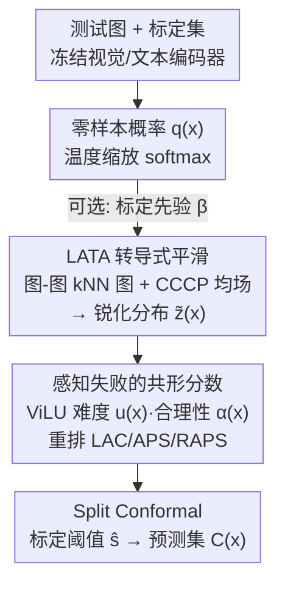

# LATA: Laplacian-Assisted Transductive Adaptation for Conformal Uncertainty in Medical VLMs

**会议**: CVPR 2026  
**论文**: [CVF Open Access](https://openaccess.thecvf.com/content/CVPR2026/html/Bozorgtabar_LATA_Laplacian-Assisted_Transductive_Adaptation_for_Conformal_Uncertainty_in_Medical_VLMs_CVPR_2026_paper.html)  
**代码**: 无  
**领域**: 医学图像 / 多模态VLM / 不确定性与共形预测  
**关键词**: 共形预测, 医学VLM, 转导式适配, 图拉普拉斯, 零样本不确定性

## 一句话总结
LATA 在不更新 VLM、不用标签、不做反传的前提下，把零样本概率沿"图-图 kNN 图"做几步 CCCP 均场平滑，再叠一个"感知失败"的共形非一致性分数，从而在保持 split conformal（SCP）有限样本覆盖保证的同时，把医学 VLM 的预测集变小、类间覆盖更均衡——在 3 个医学 VLM、9 个任务上一致优于已有转导式 baseline，且算力远低。

## 研究背景与动机

**领域现状**：CLIP 这类视觉-语言模型（VLM）以及放射/病理/眼科等专科化变体，已经是医学图像上很强的零样本识别器。在安全攸关的医疗场景里，"模型多准"不是唯一关心的事，更关键的是"模型能不能可靠地表达不确定性，且这个可靠性带保证"。共形预测（Conformal Prediction, CP）正好能套在任意黑盒模型外面，输出一个**带有限样本边际覆盖保证**的预测集合；它的归纳变体 split conformal prediction（SCP）用一份留出的标定集（calibration set）算一个非一致性分数阈值，只要标定样本与测试样本**可交换（exchangeable）**，就能保证测试集上以 $1-\alpha$ 的置信度命中真标签。

**现有痛点**：SCP 套在医学 VLM 上有两个顽疾。其一是**效率与公平性差**——预测集往往过大（低效），而且各类覆盖严重不均衡，用类条件覆盖差距 CCV（class-conditioned coverage gap）衡量时数值很高，尤其在少样本、类别失衡、领域偏移的医学场景。其二是**多模态信号被浪费**——LAC/APS/RAPS 这些标准非一致性分数只看类概率，完全无视 VLM 里图像-文本之间那些与"失败"和"标签合理性"高度相关的线索。

**核心矛盾**：很自然会想到"用那几个标定标签训一个 linear probe / adapter 把域差缩小，再在同一份 split 上做共形"。但这是"双重沾染（double dipping）"：在同一批数据上既适配又标定，会重新调整非一致性分数、引入标定-测试之间的协变量偏移，**打破可交换性，让有限样本覆盖保证彻底失效**——哪怕表面上准确率或对齐看起来变好了。经典的 full conformal（FCP）能在转导意义下保住有效性，但要对每个 query、每个标签重新拟合，对深层 VLM 来说算力上不可承受。

**本文目标**：能不能在**保住 SCP 保证**的前提下，把零样本医学 VLM 适配到目标分布上，并且**不训练任何新参数、不额外消耗标签**？拆开就是：(1) 适配过程必须对标定和测试**完全对称**，才不破坏可交换性；(2) 要利用上 VLM 的图像-文本结构去重排非一致性分数；(3) 算力要轻到能实际部署。

**切入角度**：作者的观察是——零样本后验虽然有噪声，但**视觉上相似的图像应该有相似的预测**。于是把"适配"转化成一个图拉普拉斯正则化问题：在图像-图像 kNN 图上对零样本概率做平滑，让它既贴近原始零样本预测、又在相似样本间平滑变化。关键在于这个平滑变换是**确定性、对称、不看标签**的，对标定和测试一视同仁，因此天然保住可交换性。

**核心 idea**：用"图上几步均场平滑（CCCP）锐化零样本后验"代替"训练 adapter"，再叠一个"感知失败的共形分数"用 ViLU 的难度/合理性信号重排非一致性——全程黑盒、免训练、免标签，却能逼近用标签方法的集合效率。

## 方法详解

### 整体框架

LATA 的流水线建立在冻结的对比式 VLM（CLIP 家族及医学专科变体）之上，输入是测试图像 $x_j$ 加上一份 16-shot 的标定集 $\mathcal{D}_{cal}$，输出是一个**校准过的预测集合** $C(x)$。整体流程是：冻结的视觉/文本编码器先给出零样本概率 $q(x)$（可选地用标定先验微调一下）；把标定集和测试集合并成一个**联合无标签池** $\mathcal{U}=\mathcal{D}_{cal}\cup\mathcal{D}_{test}$，在图像嵌入空间上建一张稀疏 kNN 图，跑几步 CCCP 均场更新，得到锐化后的分布 $\tilde{z}(x)$；一个冻结的 ViLU 模块为每张图给出难度 $u(x)$ 和标签注意力 $\alpha(x)$，合成"感知失败"的非一致性分数 $S^\star$；最后用标准 SCP 把 $S^\star$ 标定成预测集。整条链路**没有任何梯度更新、没有 VLM 微调、转导时不碰标签**。

### 关键设计

**1. LATA 转导式平滑：把"适配"做成图上的确定性均场更新，免训练免标签还保可交换性**

要在不破坏 SCP 的前提下适配，关键是任何对概率的处理都必须对标定和测试**完全一样、且不依赖任何标签**。LATA 把这件事建模成一个正则化目标：在联合池 $\mathcal{U}$（$N=n+m$ 个样本）上，对每个样本求一个锐化后的分布 $\tilde{z}_i\in\Delta^{C-1}$，要它既忠实于原始零样本 $q_i$，又在图像-图像图上平滑变化：

$$\min_{\{\tilde z_i\in\Delta^{C-1}\}}\ \underbrace{\sum_{i=1}^N \mathrm{KL}(\tilde z_i\Vert q_i)}_{\text{忠实项}}\ +\ \underbrace{\frac{\gamma}{2}\sum_{i,j} W^{\mathrm g}_{ij}\,\|\tilde z_i-\tilde z_j\|_2^2}_{\text{图平滑项}}$$

图的亲和度用高斯核 $W^{\mathrm g}_{ij}=\exp(-\|\tilde v_i-\tilde v_j\|_2^2/\sigma^2)$（$i,j$ 互为 kNN 时非零，$\sigma$ 取邻居距离中位数，$\tilde v$ 是 $\ell_2$ 归一化图像嵌入）。把图平滑项的二次式展开，会分成一个凸的二次范数项和一个凹的双线性交互项；作者按 **CCCP（Concave-Convex Procedure）** 把凸的部分（KL 忠实项 + 对角范数）留作主目标，把凹的交互项在当前估计处线性化，得到一个极其简洁的乘性定点更新：

$$\tilde z^{(t+1)}_{ik}\ \propto\ q_{ik}\,\exp\!\Big(\gamma \sum_{j} W^{\mathrm g}_{ij}\,\tilde z^{(t)}_{jk}\Big),\qquad \sum_{k=1}^{C}\tilde z^{(t+1)}_{ik}=1$$

从 $\tilde z^{(0)}=Q$ 出发跑 $T_{iter}\approx 5\text{--}10$ 步即可，CCCP 保证目标不增并收敛到稳定点。这一步的精髓在于：它是**确定性**的（同样的图、同样的输入永远得到同样的输出），又是**对称**的（标定和测试用同一张联合图、同一套更新），所以"适配"完全不引入标定-测试间的偏移，可交换性原封不动——这正是 Adapt+SCP 那种训 probe 的做法做不到的。直觉上，每个样本的概率被它视觉近邻的概率"拉"了一把，相似图像互相佐证，零样本后验被锐化、噪声被抹平。

**2. 感知失败的共形分数：用 ViLU 的难度与合理性信号重排非一致性，把不确定性堆到"该堆"的地方**

标准非一致性分数（LAC/APS/RAPS）只吃类概率，丢掉了 VLM 图文之间的结构信息。LATA 引入一个冻结的 **ViLU（vision-language uncertainty）** 模块作为黑盒，对每张图输出两路信号：实例级失败概率 $u(x)\in[0,1]$ 和图像条件下的标签注意力向量 $\alpha(x)\in\Delta^{C-1}$。ViLU 的做法是从图像嵌入 $v$ 到类文本嵌入库 $T$ 做一层 cross-attention，得到 $\alpha(x)$ 和上下文文本摘要 $z_t^\alpha(x)$，再用一个小 MLP $g$ 预测失败概率 $u(x)=\sigma(g([v,\,t_{\hat c(x)},\,z_t^\alpha(x)]))$（$\hat c(x)$ 是预测类）。ViLU 在独立的有标签源数据上用加权二元交叉熵预训练一次后就冻结，适配时对标定和测试施加**同一个固定映射**，因此把这些信号塞进共形分数也不破坏可交换性。

在 LATA 锐化后的 $\tilde z(x)$ 之上，作者定义感知失败的非一致性分数：

$$S^\star(x,y)\ =\ S_{\text{base}}(\tilde z(x),y)\,\big(1+\lambda\,u(x)\big)\ -\ \eta\,\alpha_y(x)$$

其中 $S_{\text{base}}\in\{\text{LAC, APS, RAPS}\}$，$\lambda,\eta\ge 0$ 是小权重（默认 $\lambda=0.5,\eta=0.25$）。两项含义直白：$u(x)$ 把**被判为难样本**的分数放大（抬高门槛、保护覆盖、防止漏掉真标签），$\alpha_y(x)$ 给**图文注意力认为合理**的标签打折（压低分数、避免无谓地把集合撑大）。这样既能在难样本上守住覆盖，又能在易样本上收紧集合，效率和类间均衡同时改善。

**3. 可选的标签先验旋钮 β：用一次标定边际分布换一点额外覆盖，仍然保住有效性**

医学数据常常类别失衡，纯零样本的类先验未必合适。LATA 提供一个可控旋钮：用标定集的类频率先验 $m\in\Delta^{C-1}$（Dirichlet 平滑后的边际）作为固定偏置，对标定和测试**对称地**注入：

$$q_{ik}\ \leftarrow\ \frac{q_{ik}\,m_k^{\beta}}{\sum_{\ell=1}^{C} q_{i\ell}\,m_\ell^{\beta}}$$

这等价于在 softmax 前 logits 上加一个类相关偏置 $z_{ik}\leftarrow z_{ik}+\beta\log m_k$。$\beta=0$ 时无先验，就是严格免标签的默认变体 **LATA-LF**；$\beta>0$（实验取 0.2）则得到**只用一次标定边际**的标签知情变体 **LATA-LI**。关键还是对称性——先验只算一次、同样地作用于标定和测试，所以即便用了一点标签信息，可交换性依然成立。这个旋钮让用户能在"严格免标签"和"用一丁点统计信息换更紧的覆盖"之间平滑权衡。

### 损失函数 / 训练策略

LATA 本身**没有可训练参数、没有反传**。唯一的"优化"是 Eq.(5) 的图正则目标，通过 CCCP 定点迭代（Eq.6）求解，确定性收敛。实现上用**窗口化转导**：滑动窗口 $\mathcal{U}_w$ 固定大小 $W=256$（来自标定 split 与当前测试 minibatch 的并集），$k=15$ 邻居，$T_{iter}=8$ 步均场迭代；图权重 $\gamma=0.35$ 在一个不相交的源 split 上选一次后跨所有数据集复用；温度 $\tau=1.0$ 不调。ViLU 头在独立有标签源数据上预训练后冻结。所有方法共享同一套冻结编码器和 prompt，单卡 RTX 4090 即可跑。

## 实验关键数据

### 主实验

3 个医学 VLM（CONCH 病理 / FLAIR 眼科 / CONVIRT 胸片），9 个任务（NCT-CRC、SICAPv2、SkinCancer、MESSIDOR、MMAC、FIVES、CheXpert、NIH-LT、COVID），16-shot 标定，按任务的标签边际采样。指标：平衡类准确率 ACA、边际覆盖 Cov.、平均集合大小 Size、类条件覆盖差距 CCV。下表为三种分数下 $\alpha=0.10$、跨任务平均的结果（UT = 无监督转导赛道，与 LATA 同台可比）：

| 分数 | 方法 | ACA↑ | Cov. | Size↓ | CCV↓ |
|------|------|------|------|-------|------|
| LAC | SCP（baseline） | 50.2 | 0.890 | 3.99 | 9.96 |
| LAC | Conf-OT | 53.1 | 0.899 | 3.18 | 9.07 |
| LAC | SCA-T | 55.2 | 0.898 | 3.30 | 7.47 |
| LAC | **LATA-LF (β=0)** | **57.0** | 0.900 | **3.07** | **6.40** |
| LAC | LATA-LI (β=0.2) | 57.4 | 0.910 | 3.15 | 6.25 |
| APS | SCP（baseline） | 50.2 | 0.900 | 4.05 | 9.59 |
| APS | Conf-OT | 53.1 | 0.899 | 3.13 | 8.64 |
| APS | SCA-T | 55.2 | 0.900 | 3.35 | 7.18 |
| APS | **LATA-LF (β=0)** | **57.1** | 0.900 | **2.95** | **6.32** |
| APS | LATA-LI (β=0.2) | 57.5 | 0.910 | 3.03 | 6.25 |

相对 SCA-T，LATA-LF 在 $\alpha=0.10$ 下把集合大小缩小约 7–12%（APS: 3.35→2.95；LAC: 3.30→3.07），CCV 降低约 10–15%（LAC: 7.47→6.40，APS: 7.18→6.32），同时 ACA 还高 1–2.5%——说明效率提升不是靠"无脑放大集合"换来的。LATA-LI 打开 β=0.2 后，覆盖从 0.900 升到 0.910，集合仅微增（APS: 2.95→3.03），CCV 甚至继续降。值得注意的是，逼近用标签的 oracle FCA（APS $\alpha=0.10$：Cov. 0.898 / Size 3.06 / CCV 6.12）而**完全不用转导时标签**；而违反可交换性的 Adapt+SCP 则系统性欠覆盖（APS: 0.858）。

### 消融实验

下表为 $\alpha=0.10$ 下不同转导求解器的对比（含算力），红色项表示违反目标错误率：

| 分数 | 方法 | ACA↑ | 运行时 T↓ (s) | GPU↓ (GB) | Cov. | Size↓ | CCV↓ |
|------|------|------|------|------|------|-------|------|
| LAC | TIM | 53.5 | 1.12 | 0.6 | 0.888 | 3.96 | 8.08 |
| LAC | TransCLIP | 54.8 | 0.47 | 1.1 | 0.726（欠覆盖） | 2.16 | 22.31 |
| LAC | Conf-OT | 53.1 | 0.60 | – | 0.899 | 3.18 | 9.07 |
| LAC | SCA-T | 55.2 | 1.04 | 0.6 | 0.898 | 3.30 | 7.47 |
| LAC | **LATA-LF** | **57.0** | **0.05** | 0.8 | 0.900 | **3.07** | **6.40** |
| APS | TransCLIP | 54.8 | 0.40 | 1.1 | 0.733（欠覆盖） | 2.52 | 21.78 |
| APS | SCA-T | 55.2 | 1.15 | 0.6 | 0.900 | 3.35 | 7.18 |
| APS | **LATA-LF** | **57.1** | **0.06** | 0.8 | 0.900 | **2.95** | **6.32** |

TIM/TransCLIP 虽然也能缩小集合，但**欠覆盖**（TransCLIP 甚至 CCV 飙到 22），违反保证；LATA 的确定性 CCCP 每张图只加约 **0.05–0.06 s** 和约 **0.8 GB**，比 SCA-T（约 1 s）快一个量级还更准更均衡。此外 Fig.3 的 K-shot 与窗口 W 扫描显示：K 从 4→16 时 LATA 集合大小稳定（3.18→3.08）、CCV 微降（6.45→6.28），始终守住名义覆盖。

### 关键发现
- **CCCP 图平滑是效率与公平的主力**：它把不确定性集中到"真正相邻、易混"的类上。SICAPv2 Gleason 分级的定性分析显示，极端类 NC/G5 多为单元素集（63%/80% size-1），而易混的中间级 G3/G4 集中在 size-2（60–68%），共现热图沿对角线很强且 G3↔G4 临床上合理地频繁共现（66%/91%），远配对被压制（NC↔G5 ≤2%）——这解释了为何 CCV 低、集合小。
- **失败感知分数贡献的是"难易分流"**：$u(x)$ 在难样本上抬高门槛保覆盖，$\alpha_y(x)$ 在易样本上收紧集合，两者配合让 ACA 和 Size 同时改善而非此消彼长。Fig.4(a) 显示 LATA-LI 跨数据集 $\Delta$Acc>0 且 $\Delta$Size<0，但二者线性拟合 $R^2$ 很小，说明效率提升**不只是**准确率涨带来的副产物。
- **可交换性是真守住了**：Fig.4(b) 的 sanity check 中，无效的"Probe@cal + SCP@same"明显欠覆盖，而 LATA-LF（共享、免标签变换）跨随机种子稳定贴近名义 $1-\alpha$。

## 亮点与洞察
- **"适配"被重写成确定性图变换**：把通常要训 adapter 的"域适配"换成一张图上的几步均场更新，最妙的是这个变换天然对标定/测试对称，于是"提升效率"和"保住共形保证"这对常见矛盾被同时满足——这是全文最漂亮的点。
- **CCCP 的乘性更新极轻**：Eq.(6) 就是"零样本概率 × 邻居概率的指数加权"再归一化，无反传、确定性收敛，每图 0.05 s，几乎零额外成本却能锐化后验，非常适合临床部署这种算力/延迟敏感的场景。
- **可迁移的设计**：①"把任何后处理做成对标定和测试对称的固定映射，就能塞进 SCP 而不破坏保证"是一条通用配方，可迁移到任何想给共形预测加先验/重排的场景；②"用一个冻结的失败预测模块去重排非一致性分数"也能直接搬到非医学的 VLM 共形任务上。
- **β 旋钮的设计哲学**：把"用不用标签"做成一个连续可调的对称偏置，而不是二选一的硬开关，既给出严格免标签的诚实下界，又允许在需要时用一次边际统计换覆盖，工程上很实用。

## 局限与展望
- **依赖一个外部预训练的 ViLU 模块**：失败感知分数需要在独立有标签源数据上预训练 ViLU，源数据与目标域差异大时，$u(x)/\alpha(x)$ 的质量未必可靠；论文未充分讨论 ViLU 失准时的退化行为。
- **窗口化转导引入近似**：为算力把转导限制在 $W=256$ 的滑动窗口内，图平滑只发生在窗口内，理论上与全批转导有差距（Fig.3 用虚线标了全批极限），极端长尾或窗口内类别覆盖不全时效果可能打折。
- **超参跨域复用的假设**：$\gamma=0.35$、$\lambda=0.5$、$\eta=0.25$ 都在一个源 split 上选一次后跨 9 个任务复用，虽显示了鲁棒性，但当目标域与源 split 差异很大时这套固定超参未必最优。
- **可交换性仍是前提**：所有保证都建立在标定-测试可交换之上；真实临床部署中若存在时间漂移或站点间分布突变（非可交换），SCP 的覆盖保证本身就会受影响，LATA 也无法独自修复这点。

## 相关工作与启发
- **vs Adapt+SCP / LinearProbe+SCP**：他们用标定标签训 probe/adapter 再在同一 split 上共形，本文用确定性图平滑做免标签适配。区别在于前者"双重沾染"破坏可交换性、系统性欠覆盖（APS 0.858），LATA 严格保住名义覆盖——这是方法论上的根本胜负手。
- **vs FCA（标签 oracle）**：FCA 在标定标签上拟合 per-label adapter 做全共形适配，效率好但要标签。LATA-LI 在不用转导标签的情况下逼近 FCA（APS: Cov. 0.910 vs 0.898，Size 3.03 vs 3.06，CCV 6.25 vs 6.12），几乎抹平了"用标签 vs 不用标签"的差距。
- **vs SCA-T / Conf-OT（转导式 baseline）**：SCA-T 用联合池上的熵最小化、Conf-OT 用最优传输，二者虽守覆盖但集合更大、CCV 更高、算力更重。LATA 在效率、类间均衡、算力三方面 Pareto 占优（APS Size 2.95 vs 3.13–3.35，CCV 6.32 vs 7.18–8.64，T 0.06s vs ~1s）。
- **vs TIM / TransCLIP（转导 adapter）**：它们靠测试数据提升准确率但**无覆盖保证**，实测欠覆盖（TransCLIP Cov. 0.726、CCV 22.31）。本文说明"准确率提升"与"覆盖保证"是两回事，转导适配必须以对称固定映射的方式做才不破坏共形有效性。

## 评分
- 新颖性: ⭐⭐⭐⭐⭐ 把转导式适配重构成"对标定/测试对称的确定性图变换"，巧妙地同时满足共形保证与效率提升，角度新且解决了一个真实的可交换性陷阱。
- 实验充分度: ⭐⭐⭐⭐⭐ 3 个医学 VLM × 9 个任务 × 3 种分数 × 2 个 α，含求解器对比、K/W 扫描、算力审计、可交换性 sanity check 与定性分析，覆盖很全。
- 写作质量: ⭐⭐⭐⭐ 逻辑清晰、动机递进，公式与图表对照到位；ViLU 细节略依赖引文、部分消融在补充材料里。
- 价值: ⭐⭐⭐⭐⭐ 直击安全攸关的医学 AI 可靠性，给出黑盒、免训练、免标签且算力极低的部署级方案，临床落地价值高。

<!-- RELATED:START -->

## 相关论文

- [\[CVPR 2026\] Hyperbolic Relational Prompts for Intersectional Fairness in Medical VLMs](hyperbolic_relational_prompts_for_intersectional_fairness_in_medical_vlms.md)
- [\[CVPR 2026\] Delving Aleatoric Uncertainty in Medical Image Segmentation via Vision Foundation Models](delving_aleatoric_uncertainty_in_medical_image_segmentation_via_vision_foundatio.md)
- [\[ICML 2026\] CASCADE Conformal Prediction: Uncertainty-Adaptive Prediction Intervals for Two-Stage Clinical Decision Support](../../ICML2026/medical_imaging/cascade_conformal_prediction_uncertainty-adaptive_prediction_intervals_for_two-s.md)
- [\[CVPR 2026\] TAlignDiff: Automatic Tooth Alignment assisted by Diffusion-based Transformation Learning](taligndiff_automatic_tooth_alignment_assisted_by_diffusion-based_transformation_.md)
- [\[CVPR 2026\] Personalized Longitudinal Medical Report Generation via Temporally-Aware Federated Adaptation](personalized_longitudinal_medical_report_generation_via_temporally-aware_federat.md)

<!-- RELATED:END -->
