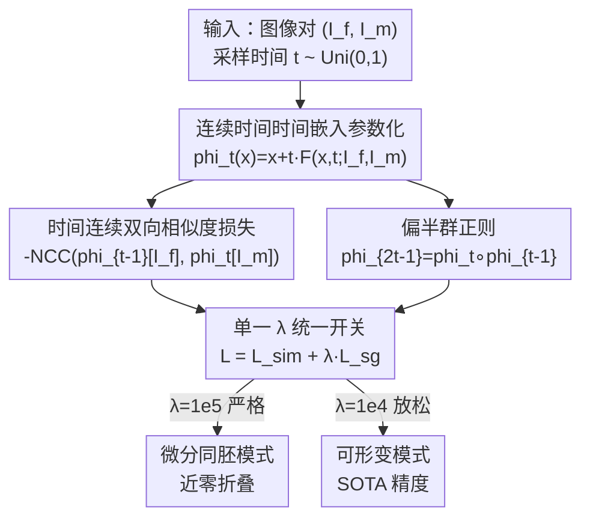

# Learning Diffeomorphism for Medical Image Registration with Time-Embedded Architectures Using Semigroup Regularization

**会议**: CVPR 2026  
**论文**: [CVF Open Access](https://openaccess.thecvf.com/content/CVPR2026/html/Matinkia_Learning_Diffeomorphism_for_Medical_Image_Registration_with_Time-Embedded_Architectures_Using_CVPR_2026_paper.html)  
**代码**: https://mattkia.github.io/SGDIR/ （项目页）  
**领域**: 医学图像  
**关键词**: 微分同胚配准、半群正则、连续时间、时间嵌入架构、拓扑保持

## 一句话总结
SGDIR 把医学图像微分同胚配准重写成一个连续时间问题：用扩散模型里常见的时间嵌入骨干网络（UNet / DiT）直接预测任意时刻 $t$ 的形变场 $\phi_t$，并证明只需一个"偏半群（partial semigroup）"正则项，就能让网络隐式学到一条 ODE 的流（flow），从而免去 scaling-and-squaring 积分和各种手工正则，同时天然保证可逆性、循环一致性与近乎零折叠的微分同胚。

## 研究背景与动机

**领域现状**：微分同胚图像配准（DIR）要找一个光滑、可逆、保持解剖拓扑的形变 $\phi$，把运动图像 $I_m$ 对齐到固定图像 $I_f$。在医学影像里，形变一旦出现"折叠（folding）"或"撕裂"，映射就失去物理意义。现代主流做法是参数化一个速度场 $v$，再用 scaling-and-squaring 积分把它重建成形变 $\phi_1$，并叠加一堆手工正则（雅可比惩罚、平滑约束等）来逼出可逆性。

**现有痛点**：这条主流管线有三处别扭。其一，scaling-and-squaring 是一套数值积分，计算开销大且只能在固定时间网格上求值。其二，可逆性和循环一致性这种"医学配准里最该天然成立"的性质，却往往是靠**额外显式损失**硬加上去的——例如同时预测正向场 $\phi_1$ 和反向场 $\phi_1^{-1}$ 再约束二者一致。其三，扩散启发的连续时间方法（DiffuseMorph、DiffuseReg）虽然引入了时间维，但仍依赖迭代采样和辅助约束，没从第一性原理推出微分同胚。

**核心矛盾**：根本问题在于，大家把"微分同胚"当成一个需要外部约束去**维护**的属性，而不是模型结构里**内生**的属性。于是积分方案和正则项越堆越多，可逆性却仍是"补丁式"保证。

**本文目标**：构造一个连续时间框架，让微分同胚成为训练目标的必然结果——不依赖任何积分方案、不依赖任何手工平滑/逆一致性正则、不绑定特定网络结构。

**切入角度**：作者的关键观察是，ODE 流 $\{\phi_t\}$ 满足**半群性质** $\phi_t \circ \phi_s = \phi_{t+s}$，而半群性质本身就蕴含了逆元 $\phi_t^{-1}=\phi_{-t}$ 与微分同胚结构。既然如此，与其去显式积分一条 ODE，不如反过来：**只要逼着网络的输出满足（部分）半群约束，它就被迫去学那条 ODE 的流**。

**核心 idea**：用一个时间嵌入网络直接预测 $\phi_t$，再用单一的偏半群正则项把它"钉"成 ODE 流——以半群一致性换取微分同胚，而不是以积分+正则去换。

## 方法详解

### 整体框架
SGDIR 要解决的是"如何不积分也能得到微分同胚"。它的整体转法是：把形变写成时间 $t$ 的连续函数，用一个时间嵌入骨干网络 $\mathbf{F}$ 直接输出任意时刻的形变场，训练时同时优化一个"时间连续的相似度损失"和一个"偏半群正则项"，由权重 $\lambda$ 控制后者强度。训练完成后，网络可以在任意 $t\in[-1,1]$ 上即时查询形变，把任一图像朝另一图像 warp。

具体地，形变被参数化为

$$\phi_t(x;\theta) = x + t\,\mathbf{F}(x, t; I_f, I_m, \theta),\quad t\in[-1,1],$$

其中 $\mathbf{F}$ 是以两张图像为条件、带时间嵌入的网络（实验中用时间嵌入 UNet 或 Diffusion Transformer）。这个写法天然满足 ODE 的初值条件 $\phi_0(x)=x$。两个损失分别负责"对齐得准"和"是合法的流"，最后由 $\lambda$ 这一个旋钮在"严格微分同胚"和"灵活可形变"两种模式间切换。

### 关键设计

**1. 连续时间时间嵌入参数化：把形变写成 ODE 流而非积分终点**

主流方法只在 $t=1$ 处给出形变，要靠 scaling-and-squaring 一步步复合逼近。SGDIR 改成 $\phi_t(x)=x+t\,\mathbf{F}(x,t;\theta)$，让网络直接吃进时间 $t$ 并输出对应时刻的形变。这个乘以 $t$ 的结构有两个好处：一是 $t=0$ 时强制 $\phi_0(x)=x$，自动满足 ODE 的恒等初值，不用额外约束；二是任意时刻都能一次前向求值，不需要迭代采样或数值积分。作者特意强调，这里**不发明新结构**——直接借用扩散模型里成熟的时间嵌入 UNet 和 DiT，论文的论点是"标准骨干在半群约束下训练就会变成微分同胚的"，所以方法是架构无关、与积分方案解耦的。

**2. 偏半群正则：用一个约束逼出整条 ODE 流**

这是全文的核心。理论上 ODE 流满足半群 $\phi_t\circ\phi_s=\phi_{t+s}$，但对任意时间对 $(t,s)$ 都施加这一约束在实践中不可行。作者证明只需施加一个**可计算的偏半群约束**就够：

$$\mathcal{L}^t_{\text{sg}} = \|\phi_{2t-1}-\phi_t\circ\phi_{t-1}\|_2 + \|\phi_{2t-1}-\phi_{t-1}\circ\phi_t\|_2,$$

即把"先走到 $t-1$ 再走到 $t$"与"直接走到 $2t-1$"对齐，第二项交换复合次序以强制对称性，复合本身通过形变网格的双线性插值实现。论文给出 Theorem 1：满足该复合规则 $\phi_{2t-1}=\phi_t\circ\phi_{t-1}$ 且 $\phi_0(x)=x$ 的形变，就是一个指数映射，等价于一条自治 ODE 的单参数微分同胚解。这意味着——只要把这个偏半群残差压到零，网络输出就被数学地"锁"成 ODE 流，可逆性 $\phi_t^{-1}=\phi_{-t}$、循环一致性、拓扑保持全部内生于此，无需任何额外正则。这正是与既有方法的本质区别：别人把可逆性当损失项外挂，SGDIR 把它当作半群约束的推论。⚠️ 定理证明细节在附录，具体步骤以原文为准。

**3. 时间连续双向相似度损失：一次约束覆盖所有时刻的正反向一致**

既然 $\phi_t$ 是连续流，作者用一个"对向相遇"的技巧来定义相似度：把运动图像正向 warp 到时刻 $t$，把固定图像反向 warp 到时刻 $1-t$，两者应当落到对应点。结合逆元恒等式 $\phi_{1-t}^{-1}=\phi_{t-1}$，得到约束 $\phi_{t-1}[I_f]=\phi_t[I_m]$，于是相似度损失（用归一化互相关 NCC）写成

$$\mathcal{L}^t_{\text{sim}} = -\mathrm{NCC}(\phi_{t-1}[I_f],\,\phi_t[I_m]),\quad \forall t\in[0,1].$$

它的妙处在于：早期方法（如 CycleMorph 一类）只在端点 $t=1$ 处显式预测正反向场再约束一致，而这里对**所有** $t\in[-1,1]$ 自动获得双向一致性，且完全不需要单独建模逆场。换言之，正反向对称是从相似度损失的定义里"免费"得到的。

**4. 单一 λ 旋钮：同一架构统一微分同胚与可形变两种范式**

总训练目标为 $\mathcal{L}=\mathbb{E}_{(I_f,I_m)\sim\mathcal{D},\,t\sim\mathrm{Uni}(0,1)}[\mathcal{L}^t_{\text{sim}}+\lambda\,\mathcal{L}^t_{\text{sg}}]$。$\lambda$ 直接控制半群约束的强度：取大（$\lambda=10^5$）时严格强制流一致性，得到近零折叠的微分同胚模型；取小（$\lambda=10^4$）时放松约束，同一个网络就退化成一个高度灵活的可形变模型，精度反而更高。这把"要拓扑安全"还是"要配准精度"变成了一个连续可调的权衡，而不是两套不同方法——这也是作者反复强调的"统一框架"卖点。

### 损失函数 / 训练策略
训练时同时均匀采样图像对和时间 $t\sim\mathrm{Uni}(0,1)$，最小化 $\mathcal{L}^t_{\text{sim}}+\lambda\mathcal{L}^t_{\text{sg}}$。相似度用 NCC，半群复合用双线性插值实现。全部实验在单张 NVIDIA RTX 3090（24GB）上完成，骨干为时间嵌入 UNet（12.8M 参数）或 DiT（68.6M 参数）。

## 实验关键数据

在 OASIS、CANDI、LPBA40、Mindboggle101、IXI、ACDC、Learn2Reg LungCT / AbdomenCTCT 共 **8 个 2D/3D 的 MR 与 CT 数据集**上评测。指标含 Dice、TRE、HD95、SSIM、ASSD，以及负雅可比行列式体素占比 $|J|{<}0\%$（拓扑违例率，越低越好）。

### 主实验：OASIS（脑 MRI）

| 类型 | 方法 | Dice↑ | $\|J\|{<}0\%$↓ | HD95↓ | SSIM↑ |
|------|------|------|------|------|------|
| 微分同胚 | GradICON | 84.53 | 0.0022 | 2.23 | 85.90 |
| 微分同胚 | TransMorph-diff（最强对手） | 84.63 | 0.0091 | 2.25 | 89.91 |
| 微分同胚 | **SGDIR DiT (λ=10⁵)** | **86.53** | **0.0** | **1.90** | **91.45** |
| 微分同胚 | SGDIR UNet (λ=10⁵) | 86.16 | 0.0 | 1.96 | 90.71 |
| 可形变 | TransMorph | 85.26 | 2.0155 | 2.39 | 91.79 |
| 可形变 | HViT | 85.38 | 0.3566 | 2.13 | 92.02 |
| 可形变 | **SGDIR DiT (λ=10⁴)** | **88.09** | 0.4332 | **1.73** | **93.80** |

（atlas-based 设定）微分同胚模式下 SGDIR 把 Dice 从对手最好的 84.63 提到 86.53，同时拓扑违例率压到 **0.0**（完全无折叠）；放松到可形变模式后 Dice 进一步冲到 88.09，超过所有可形变 SOTA。

### 主实验：AbdomenCTCT（腹部 CT，难度更高）

| 类型 | 方法 | Dice↑ | $\|J\|{<}0\%$↓ | HD95↓ | ASSD↓ |
|------|------|------|------|------|------|
| 微分同胚 | NePhi（最强对手） | 45.32 | 0.0008 | 12.48 | 3.90 |
| 微分同胚 | **SGDIR UNet (λ=10⁵)** | **53.64** | **0.0** | **10.07** | 2.97 |
| 微分同胚 | SGDIR DiT (λ=10⁵) | 52.23 | 0.0001 | 10.27 | 2.89 |
| 可形变 | SACB-Net | 53.38 | 0.9348 | 13.09 | 3.67 |
| 可形变 | **SGDIR UNet (λ=10⁴)** | **56.57** | 0.2683 | **9.19** | 2.45 |

腹部 CT 上微分同胚 SGDIR 把 Dice 从 45.32 拉到 53.64（**+8 以上**），且 $|J|{<}0\%$ 仍为 0；可形变变体进一步到 56.57。作者总结：MRI 上微分同胚 SGDIR 平均 Dice 较最强微分同胚方法 +2.5%，AbdomenCTCT 上 Dice 提升超 +5%，LungCT 上 TRE 较最佳模型降低约 10%。

### 消融：半群正则权重 λ（OASIS / LungCT）

| λ | OASIS Dice↑ | OASIS $\|J\|{<}0\%$↓ | LungCT TRE↓ | LungCT $\|J\|{<}0\%$↓ |
|------|------|------|------|------|
| 10⁵ | 85.90 | 0.0003 | 2.37 | 0.0 |
| 10⁴ | 87.82 | 0.3982 | 2.23 | 0.0615 |
| 10³ | 84.66 | 3.1876 | 2.66 | 1.0183 |
| 10² | 81.01 | 6.7403 | 3.15 | 3.1098 |
| 10 | 80.23 | 7.0794 | 3.78 | 5.3951 |
| 0 | 79.80 | 7.8612 | 3.99 | 6.7632 |

这张表把半群正则的作用展示得很干净：$\lambda$ 越大折叠越少（$10^5$ 时几乎为零），但 Dice 略有牺牲；$\lambda=10^4$ 是精度甜点（Dice 87.82）；继续减小到 $10^3$ 以下，折叠率飙升、精度也崩塌。完全去掉正则（$\lambda=0$）时拓扑违例率高达 7.86%，Dice 跌到 79.80——说明半群正则不仅防折叠，还在约束形变轨迹、稳定优化、引导模型走向解剖上更合理的解。

### 计算效率

| 指标 | SGDIR UNet | SGDIR DiT | HViT | TransMorph-diff |
|------|------|------|------|------|
| 参数量 | 12.8M | 68.6M | 21.2M | 46.8M |
| 测试显存 | 2.82GB | 5.17GB | 5.76GB | 4.67GB |
| 测试耗时/迭代 | 0.25s | 0.22s | 0.51s | 0.46s |

由于砍掉了昂贵的积分方案，SGDIR 推理速度约为 HViT / TransMorph 的 **2 倍**、显存约为其一半。

### 关键发现
- **半群正则是发动机**：去掉它（$\lambda=0$）后拓扑违例率从近零暴涨到 7.86%、Dice 掉到 79.80，证明微分同胚性确实是该约束内生的，而非骨干网络自带。
- **同一架构两种范式**：$\lambda$ 一个旋钮就在"零折叠微分同胚"和"超 SOTA 可形变"之间切换，无需改结构或重设计损失。
- **连续时间优于离散采样**：随离散时间采样点增多，Dice 与 $|J|{<}0\%$ 持续改善，连续采样（cont）取得最佳——说明时间维上的密集约束有助于学到更光滑可逆的流。
- **全时段拓扑保持**：微分同胚 SGDIR 在整个 $t\in[0,1]$ 区间都保持近零折叠，而可形变变体的折叠只在 $t\approx 1$ 附近累积。

## 亮点与洞察
- **视角反转最让人"啊哈"**：别人把微分同胚当成需要外挂正则去维护的属性，SGDIR 证明只要满足偏半群约束，网络就被迫学成 ODE 流——可逆/循环一致/拓扑保持全部是定理的推论，而不是单独的损失项。这是从"补丁"到"内生"的范式转变。
- **"对向相遇"式相似度损失很巧**：把运动图正向到 $t$、固定图反向到 $1-t$，用逆元恒等式 $\phi_{1-t}^{-1}=\phi_{t-1}$ 直接得到全时段双向一致，免去显式建模逆场，这个 trick 可迁移到任何带连续时间假设的配准/光流任务。
- **架构无关性是务实卖点**：不发明新骨干，直接复用扩散模型的时间嵌入 UNet/DiT，论点是"标准网络在半群约束下训练即变微分同胚"，这让方法易于被现有 pipeline 吸收。
- **一个 λ 统一两个范式**，把临床上"要拓扑安全 vs 要配准精度"的取舍变成连续可调旋钮，工程上非常友好。

## 局限与展望
- **理论强度依赖偏半群是否真被压到零**：Theorem 1 的结论建立在复合残差为零的理想极限上，实际训练只是把 $\mathcal{L}^t_{\text{sg}}$ 优化得很小；$\lambda$ 不够大时（如 $10^3$）折叠率立刻反弹到 3% 以上，说明"近乎微分同胚"对正则权重相当敏感。⚠️ 严格的逼近界以原文与附录证明为准。
- **可形变模式并非真微分同胚**：$\lambda=10^4$ 时虽然精度最高，但 $|J|{<}0\%$ 已非零（OASIS 0.40、AbdomenCTCT 0.27），拓扑保证被牺牲，使用时需按场景在两种模式间权衡。
- **半群复合靠双线性插值近似**：形变复合通过网格插值实现，插值误差是否会在长程或大形变时累积、影响理论保证，论文未深入讨论。
- **训练显存偏高**：SGDIR UNet 训练峰值显存 22.6GB，逼近 24GB 卡上限；半群项需要计算复合 $\phi_t\circ\phi_{t-1}$，对显存有额外压力。

## 相关工作与启发
- **vs scaling-and-squaring 系（SYMNet、TransMorph-diff）**：他们参数化速度场再数值积分出 $\phi_1$ 并叠加雅可比/平滑正则；SGDIR 直接预测 $\phi_t$、用半群约束代替积分与正则，推理更快（约 2×）、折叠更少（OASIS 上 0.0 vs 0.0091）。
- **vs ODE 方法 NODEO**：NODEO 用 neural ODE 显式积分学到的速度动力学；SGDIR 不假设速度 ODE，而是从半群一致性**涌现**出 ODE 流，绕开了 ODE 求解器。
- **vs 端点逆一致方法（CycleMorph 等）**：他们只在 $t=1$ 显式预测正反向场再约束一致；SGDIR 对所有 $t\in[-1,1]$ 自动双向一致，无需建模逆场。
- **vs 扩散启发配准（DiffuseMorph、DiffuseReg）**：二者借用去噪扩散学连续形变，但需迭代采样和固定时间网格、开销大；SGDIR 借用同款时间嵌入骨干却可在任意 $t$ 即时查询，无迭代采样。

## 评分
- 新颖性: ⭐⭐⭐⭐⭐ 把微分同胚从"外挂正则"重构为"偏半群约束的数学推论"，并给出定理支撑，视角原创。
- 实验充分度: ⭐⭐⭐⭐⭐ 8 个 2D/3D MR/CT 数据集、覆盖微分同胚与可形变两条赛道，并含 λ/离散采样/时间/计算多维消融。
- 写作质量: ⭐⭐⭐⭐ 理论与动机清晰，但核心定理与逼近界细节下放附录，正文略需结合附录才能完全跟上。
- 价值: ⭐⭐⭐⭐⭐ 同一架构一个旋钮统一微分同胚与可形变、且更快更省显存，对医学配准实用性强。

<!-- RELATED:START -->

## 相关论文

- [\[CVPR 2026\] Dynamic Stream Network for Combinatorial Explosion Problem in Deformable Medical Image Registration](dynamic_stream_network_for_combinatorial_explosion_problem_in_deformable_medical.md)
- [\[CVPR 2026\] CRFT: Consistent-Recurrent Feature Flow Transformer for Cross-Modal Image Registration](crft_consistent-recurrent_feature_flow_transformer_for_cross-modal_image_registr.md)
- [\[CVPR 2026\] SPEGC: Continual Test-Time Adaptation via Semantic-Prompt-Enhanced Graph Clustering for Medical Image Segmentation](spegc_continual_test-time_adaptation_via_semantic-prompt-enhanced_graph_clusteri.md)
- [\[ECCV 2024\] NePhi: Neural Deformation Fields for Approximately Diffeomorphic Medical Image Registration](../../ECCV2024/medical_imaging/textttnephi_neural_deformation_fields_for_approximately_diff.md)
- [\[CVPR 2026\] Multimodal Causality-Driven Representation Learning for Generalizable Medical Image Segmentation](multimodal_causal-driven_representation_learning_for_generalizable_medical_image.md)

<!-- RELATED:END -->
