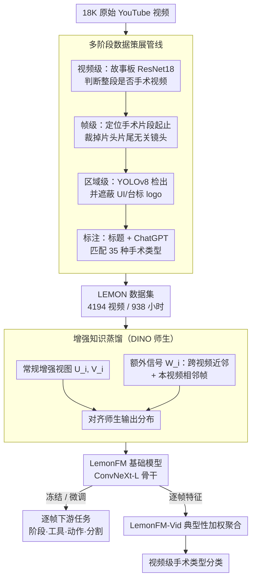

# LEMON: A Large Endoscopic MONocular Dataset and Foundation Model for Perception in Surgical Settings

**会议**: CVPR 2026  
**arXiv**: [2503.19740](https://arxiv.org/abs/2503.19740)  
**代码**: [https://github.com/visurg-ai/LEMON](https://github.com/visurg-ai/LEMON)  
**领域**: 医学图像 / 手术视觉  
**关键词**: 手术基础模型, 内窥镜数据集, 自监督学习, 知识蒸馏, 手术场景理解

## 一句话总结

构建了包含 4194 个手术视频（938 小时）的大规模内窥镜数据集 LEMON，并提出基于增强知识蒸馏的自监督基础模型 LemonFM，在手术阶段识别、工具检测、动作识别和语义分割四大下游任务上全面超越现有手术基础模型。

## 研究背景与动机

手术视觉是自主手术机器人的核心感知能力，需要模型准确理解手术环境中的工具、组织和手术阶段。然而，由于医疗数据的隐私法规和标注难度，现有公开手术数据集规模极为有限——大多数包含不到 100 个视频、不足 30 小时素材，导致模型泛化能力差。

自监督学习为解决标注稀缺问题提供了新途径：在大规模无标注数据上预训练基础模型可显著减少对标注数据的依赖。但关键瓶颈在于**数据本身**——现有尝试要么依赖私有数据（如 Endo-FM）导致不可复现，要么使用规模较小的公开数据集（如 EndoViT）效果有限。

近期 GenSurgery 和 SurgeNetXL 尝试从网络收集手术视频，但它们缺乏系统化的数据清洗流程，收集到的视频中混杂大量非手术内容（如会议演讲、患者访谈、设备 UI 界面），这些噪声可能引入虚假特征干扰模型学习。

本文的核心观察是：**网络上存在足够多的高质量手术视频，关键在于如何系统化地筛选、清洗和标注**。作者提出了一套完整的多阶段数据策展管线，从 18K 原始 YouTube 视频中精心筛选出 4194 个高质量手术视频，并基于此训练了新的自监督基础模型。

## 方法详解

### 整体框架

这篇工作要解决的根本瓶颈不是模型而是数据：网上手术视频很多，但混杂着会议演讲、患者访谈、设备 UI，直接拿来预训练只会让模型学到虚假特征。作者因此把工作拆成两半。前半是一条多阶段策展管线，从 18K 个原始 YouTube 视频出发，逐层把噪声筛掉，最终留下 4194 个干净的手术视频（938 小时）构成 LEMON 数据集。后半是在 LEMON 上自监督预训练的基础模型 LemonFM——它以 DINO 的师生蒸馏为骨架，但额外注入跨帧、跨患者的监督信号（$W_i$）。预训练好的 LemonFM 特征分两路用：冻结或微调骨干即可迁移到手术阶段识别、工具检测、动作识别、语义分割这四类**逐帧**下游任务；而针对论文新提出的**视频级**手术类型分类任务，再接一个 LemonFM-Vid 头，按每帧的"典型性"加权把逐帧特征聚合成视频表示。

### 关键设计

**1. 多阶段数据策展管线：把网络视频里的非手术内容层层剥掉**

之前的 GenSurgery、SurgeNetXL 也从网上抓手术视频，但直接拿未清洗的素材去训练，混进来的非手术画面会被模型当成有用特征记住。LEMON 的做法是从粗到细分四步过滤。第一步是视频级筛选：把每个视频抽成"故事板"（缩略图网格），用一个 ResNet18 分类器判断整段到底是不是手术视频，先把演讲、访谈这类整体无关的视频踢掉。第二步是帧级裁剪：训练一个帧级分类器定位真正的手术片段从哪帧开始、到哪帧结束，把片头片尾的无关镜头切走。第三步是区域级遮蔽：用 YOLOv8 检出手术帧里残留的 UI 控件、台标 logo 等区域并打码，避免模型把界面元素当线索。最后一步才是标注：结合视频标题和 ChatGPT 把每段匹配到 35 种手术类型之一，整条管线全程辅以人工质控。这种"视频→帧→区域"逐层收缩的设计，让 18K 原始视频最终收敛到 4194 个干净视频；消融实验里策展版本比未策展版本在相位识别上 F1 高出 4.5pp，印证了清洗的价值不只是好看，而是直接转化成下游精度。

**2. 增强知识蒸馏：让模型学会忽略跨患者、跨帧的细微变化**

标准 DINO 只对同一张图像的不同数据增强视图做师生蒸馏，学到的不变性局限在"同一帧的不同裁剪"这个层面。但手术场景真正需要的不变性是另一种：同一类手术在不同患者身上器官颜色略有差异，相邻帧之间工具又有微小位移，模型应当把这些都视作"同一类场景"。作者的做法是在 DINO 的两个常规增强视图 $U_i, V_i$ 之外，再喂进一组额外监督信号 $W_i$。$W_i$ 由两类图像组成：一类是同一手术类型但来自不同视频的近邻帧——通过嵌入空间的 KNN 检索得到，且只有当余弦距离小于"输入帧与其前一帧距离"的 3 倍时才纳入，这个自适应阈值保证检索来的帧确实视觉相似、又不会过度匹配到无关画面；另一类是输入帧在本视频里的相邻帧。训练时让教师和学生网络在 $U_i, V_i$ 与 $W_i$ 上的输出分布对齐，模型就被迫把这些跨帧、跨患者的变体编码成相近的特征。消融显示这一改动比 vanilla DINO 在语义分割上再提升 3.2pp。

**3. LemonFM-Vid 的典型性加权聚合：做视频分类时别让噪声帧拖后腿**

下游的视频分类任务需要把一段视频的逐帧特征汇成一个视频级表示，但手术视频里夹着大量非典型帧——过渡画面、运动模糊、镜头被遮挡，简单取平均会被这些噪声帧稀释。作者用"典型性"（typicality）给每帧加权：一帧的典型性定义为它与自身 K 近邻的平均余弦距离的倒数，也就是说，越是和其他帧相似、越"常规"的帧，权重 $\omega_j$ 越高。最终视频嵌入是逐帧特征的加权和 $v_e = \sum_j \omega_j \phi_j$，再过一层 MLP 分类。这样模型会自动把注意力压到最具代表性的手术场景帧上，过渡帧和模糊帧自然被压低。

### 损失函数 / 训练策略

训练损失为教师-学生网络之间的交叉熵：$\mathcal{L} = -\sum_i \sum_{u \in U_i} \sum_{v \in V_i \cup W_i, u \neq v} \sum_z P_t(z|u) \log P_s(z|v)$，其中输出维度 $C = 2^{16}$。学生网络通过梯度下降更新，教师网络通过 EMA 更新。骨干架构选择 ConvNeXt-L，消融证明其比 ViT-L 更适合手术场景（分割任务 +10.7pp mDice），原因是卷积的局部连接归纳偏置更好地保留了工具尖端等细粒度细节。

## 实验关键数据

### 主实验

**线性探测（冻结骨干）**

| 数据集 | 指标 | LemonFM | 之前SOTA (SurgeNetXL) | 提升 |
|--------|------|---------|----------------------|------|
| AutoLaparo | Acc/F1 | **76.4/66.9** | 68.8/57.0 | +7.6/+9.9 |
| Cholec80 | Acc/F1 | **75.8/68.6** | 73.2/65.1 | +2.6/+3.5 |
| GraSP (工具检测) | mAP | **76.4** | 62.7 | +13.7 |
| CholecT50 (动作识别) | mAP | **50.4** | 45.3 | +5.1 |

**全量微调**

| 数据集 | 指标 | LemonFM | 之前SOTA | 提升 |
|--------|------|---------|---------|------|
| AutoLaparo | Acc/Jacc | **85.5/64.8** | 85.0/55.3 (SurgeNetXL/Endo-FM) | +9.5pp Jacc |
| Cholec80 | Acc/Jacc | **92.7/85.1** | 90.3/79.3 (Trans-SVNet) | +5.8pp Jacc |
| M2CAI16 | Acc/Jacc | **89.9/79.4** | 87.2/74.7 (Trans-SVNet) | +4.7pp Jacc |
| CholecSeg8k (分割) | mDice | **81.3** | 71.0 (EndoViT) | +10.3pp |

### 消融实验

| 配置 | AutoLaparo (Acc/F1) | CholecSeg8k (mDice) | 说明 |
|------|-------------------|-------------------|------|
| ImageNet-1K 预训练 | 63.6/53.0 | 64.4 | 通用预训练基线 |
| Cholec80 预训练 | 54.0/46.9 | 64.1 | 小规模手术数据 |
| LEMON 未策展+DINO | 71.7/61.4 | 67.4 | 无数据清洗 |
| LEMON 策展+DINO | 75.3/65.9 | 68.7 | 有数据清洗 |
| LEMON 策展+增强蒸馏+ViT-L | 75.6/66.1 | 61.2 | ViT 骨干 |
| LEMON 策展+增强蒸馏+ConvNeXt-L | **76.4/66.9** | **71.9** | 完整模型 |

### 关键发现

- 数据策展管线贡献显著：策展 vs 未策展在 F1 上提升 4.5pp，说明数据质量比数量更重要
- ConvNeXt-L 大幅优于 ViT-L（分割 +10.7pp），卷积的局部归纳偏置对手术场景中的细粒度结构更有效
- 判别式自监督（DINO）显著优于生成式（MAE），冻结骨干时差距更大
- 50% 标注数据微调的 LemonFM 仍超越所有其他基础模型 100% 数据的结果，体现极强的数据效率
- 5 折交叉验证标准差很小（如分割 72.7±3.3），模型稳定性好

## 亮点与洞察

- **数据策展管线设计精巧**：从视频级→帧级→区域级的三层过滤，结合自动化（分类器）和人工质控，是大规模网络数据清洗的范本。特别是用故事板做视频级分类的思路非常高效
- **增强蒸馏的邻居选择策略**：用"余弦距离 < 3× 相邻帧距离"作为阈值来筛选跨视频近邻，既保证了视觉相似性又避免了过度匹配，这个自适应阈值设计可迁移到其他视频自监督任务
- **50% 数据就超 SOTA** 是最有说服力的实验——证明预训练质量的提升可以大幅减少下游标注需求，对标注昂贵的医学领域意义重大

## 局限与展望

- 数据来源限于 YouTube 公开视频，虽然做了清洗但数据质量仍不如医院采集的标准化数据
- 仅覆盖 35 种微创手术类型，对开放手术等其他手术形式无涉及
- 当前为纯图像基础模型，未充分利用视频时序信息（虽然实验证明图像模型+TCN 已足够强且更快）
- 手术类型分类 mAP 仅 57.8%，解剖位置相邻的手术类型（如子宫肌瘤切除 vs 子宫切除）仍难以区分

## 相关工作与启发

- **vs Endo-FM**: 使用私有数据预训练，不可复现；LemonFM 数据完全公开且性能更强
- **vs SurgeNetXL**: 同样从网络收集数据但缺乏清洗，在线性探测下差距明显（GraSP: 62.7 vs 76.4 mAP）
- **vs EndoViT**: 基于 MAE 的生成式方法，在分割任务上远不如判别式方法（71.0 vs 81.3 mDice）

## 评分

- 新颖性: ⭐⭐⭐⭐ 增强蒸馏有创新但核心框架基于 DINO；主要贡献在数据集构建
- 实验充分度: ⭐⭐⭐⭐⭐ 4 任务 6 数据集，线性探测+全量微调+消融+交叉验证+低数据实验，非常完整
- 写作质量: ⭐⭐⭐⭐⭐ 结构清晰，数据策展管线描述详尽，图表设计直观
- 价值: ⭐⭐⭐⭐⭐ 最大公开手术数据集+SOTA 基础模型+代码开源，对手术视觉社区价值极高

<!-- RELATED:START -->

## 相关论文

- [\[CVPR 2026\] Benchmarking Endoscopic Surgical Image Restoration and Beyond](benchmarking_endoscopic_surgical_image_restoration_and_beyond.md)
- [\[CVPR 2026\] OralGPT-Omni: A Versatile Dental Multimodal Large Language Model](oralgpt-omni_a_versatile_dental_multimodal_large_language_model.md)
- [\[CVPR 2026\] Instruction-Guided Lesion Segmentation for Chest X-rays with Automatically Generated Large-Scale Dataset](instruction-guided_lesion_segmentation_for_chest_x-rays_with_automatically_gener.md)
- [\[CVPR 2026\] MedMO: Grounding and Understanding Multimodal Large Language Model for Medical Images](medmo_grounding_and_understanding_multimodal_large_language_model_for_medical_im.md)
- [\[CVPR 2025\] Surg-R1: A Hierarchical Reasoning Foundation Model for Scalable and Interpretable Surgical Decision Support](../../CVPR2025/medical_imaging/surg-r1_a_hierarchical_reasoning_foundation_model_for_scalable_and_interpretable.md)

<!-- RELATED:END -->
