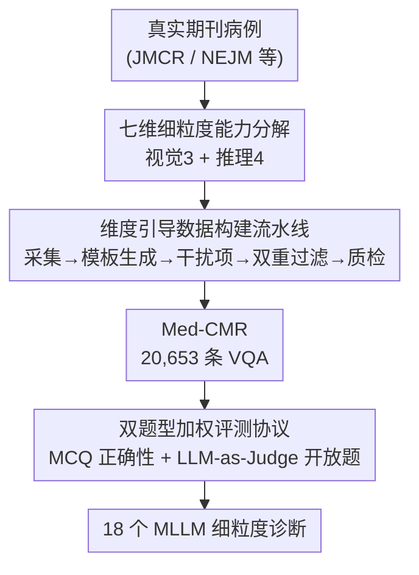

# Med-CMR: A Fine-Grained Benchmark Integrating Visual Evidence and Clinical Logic for Medical Complex Multimodal Reasoning

**会议**: CVPR 2026  
**论文**: [CVF Open Access](https://openaccess.thecvf.com/content/CVPR2026/html/Gong_Med-CMR_A_Fine-Grained_Benchmark_Integrating_Visual_Evidence_and_Clinical_Logic_CVPR_2026_paper.html)  
**代码**: https://github.com/LsmnBmnc/Med-CMR  
**领域**: 医学图像 / 多模态VLM / 评测基准  
**关键词**: 医学多模态推理, VQA 基准, 能力分解, LLM-as-Judge, 长尾泛化

## 一句话总结
Med-CMR 把"医学多模态复杂推理"拆成 3 个视觉维度 + 4 个推理维度共 7 类任务，用 20,653 条经人类专家与模型双重审核的 VQA（覆盖 11 个身体系统、12 种成像模态）评测 18 个主流 MLLM，发现 GPT-5 以 57.81% MCQ 准确率领跑、长尾泛化是公认最难项、而医学微调模型并不能稳定胜过通用大模型。

## 研究背景与动机
**领域现状**：MLLM 正从演示走进临床流程，但现有医学多模态基准（VQA-RAD、Path-VQA、PMC-VQA、OmniMedVQA、GMAI-MMBench 等）大多停留在"感知级 VQA"——让模型描述一张图或从短上下文里检索一个显而易见的事实。

**现有痛点**：这种设定恰恰把临床决策里真正难的情形藏了起来——微小低对比度病灶、跨模态对比、时间演变、连接症状/影像/结局的因果链、以及教科书里稀有的长尾分布。结果是现有基准对"复杂医学推理能力"几乎没有可见度，而且往往只给一个笼统的总分，看不出模型到底是"看不清"还是"想不通"。

**核心矛盾**：临床里"感知"和"推理"是耦合的——医生要在不确定、信息不完整的条件下整合跨时间、跨模态的证据做诊断。把这两件事混成单一分数评测，就无法定位模型的真实短板。

**本文目标**：作者认为一个合格的复杂医学推理基准要同时具备三样东西：① 系统化的能力分解（把视觉理解和下游推理拆开、再细分到临床有意义的子维度）；② 临床对齐且刻意做难的任务（围绕真实病例，专攻时间预测、因果推理、长尾泛化、多源整合等难设定）；③ 跨器官/模态/疾病的广覆盖 + 专家审核保证真实可解释。

**核心 idea**：用"细粒度能力分解 + 真实病例数据流水线 + 双题型加权评测"构建 Med-CMR，把医学多模态推理从一个总分变成可逐维诊断的压力测试。

## 方法详解

### 整体框架
Med-CMR 不是一个模型而是一个评测基准，整体可以看成两条线：一条是**能力分解的概念骨架**（把医学复杂度拆成 7 维），它指导另一条**数据构建流水线**（从真实期刊病例采集 → 模板化生成问题 → 多模型造干扰项 → 人+模型双重过滤 → 多方质检 → 形成 20,653 条 VQA），最后配一套**双题型评测协议**（MCQ 看事实正确性、开放题用加权 LLM-as-Judge 看推理质量）去刷 18 个 MLLM。

下面这张图描述数据构建流水线（节点名即下方关键设计名，自上而下与关键设计同序）：

### 关键设计

**1. 七维细粒度能力分解：把"医学多模态推理"拆成可单独诊断的子能力**

针对"现有基准只给一个笼统总分、看不出模型到底卡在哪"的痛点，作者从临床里"感知—推理耦合"的本质出发，把医学复杂度拆成两组共 7 个主维度。视觉侧 3 个：**小目标检测（SOD）**——识别微小/低对比度的目标；**细节判别（FDD）**——区分视觉相似但临床含义不同的发现；**空间理解（SU）**——对齐多模态信息、维持空间一致性。推理侧 4 个：**时间预测（TP）**——推断疾病进展与预后；**因果推理（CR）**——把症状、发现、结局连成多步因果链；**长尾泛化（LTG）**——在罕见病例样本极少时做决策；**多源整合（MSI）**——从一个复杂病例的多个共存异常里提取关键诊断线索。每一维对应一类专门设计的任务，这样就能把模型的强弱具体定位到"看不清"还是"想不通"。这 7 维既是评测维度，也是后续数据采集与问题设计的骨架。

**2. 维度引导的数据构建流水线：用真实病例 + 多模型造干扰项 + 双重过滤压出"既真实又难"的题**

针对"自动生成 VQA 容易平庸、靠文本就能蒙对"的痛点，作者设计了一条多阶段流水线。**采集**上从 JMCR、NEJM 等权威生物医学期刊的真实病例报告与研究文章取图，连带人工标注的 caption 和元数据，按 7 维构造 7 类问题。**问题生成**让有医学背景的标注者为每类设计 10–20 个模板（强制强视觉依赖、对应特定复杂度维度、鼓励多步诊断推断），再用 GPT-5-mini 辅助：为每张图选合适模板、并从 caption 里抽正确答案，保证题目正确、多样、聚焦目标推理类型。**干扰项标注**是 human-in-the-loop：用 GPT-5-Mini、Qwen3-VL-Plus、Claude-Sonnet-4 各生成 4 个候选共 12 个，再由 3 名医学背景标注者选出 4 个最终干扰项，要求满足足够难度、确为错误且不与正确答案语义重叠、依赖视觉信息、临床合理。**双重过滤**：问题生成前先由医护人员人工剔除 caption 不足或与目标维度不匹配的图；生成后用 Lingshu-7B、Qwen2.5-VL-7B、Llava-Med-v1.5-Mistral-7B 三个模型筛——**三个模型都答对的题直接删掉**，保证对 MLLM 有适当难度。**质检**上引入全科医生专门筛 LLM 生成内容，最终剔除了原合成集里 8% 的可疑内容，两名标注者联合人工复核、独立审核员校验一致性、未达共识的题被删，四名标注者确认每题只有唯一无歧义答案，最后由执业医师整体复核医学准确性。最终得到 20,653 题，覆盖 11 个身体系统、12 种成像模态。

**3. 双题型加权评测协议：MCQ 量事实、LLM-as-Judge 量推理过程**

针对"只看选择题对错无法评估推理与生成质量"的痛点，Med-CMR 同时出 MCQ（16,655 题、每题 5 选项）和开放题（3,998 题）。MCQ 直接按正确率算分；开放题用一个外部、标准对齐的 LLM 沿 4 个互补维度打分——一致性（Consistency，表述清晰与内部自洽）、连贯性（Coherence，推理步骤间的因果衔接）、视觉准确性（Visual accuracy，对图像视觉特征识别描述的准确度）、真值正确性（Ground-truth correctness，最终答案与标准答案的吻合）。最终开放题分数是加权和：

$$S = \frac{\sum_{i\in\{\text{cons, coh, vis, gt}\}} w_i\, s_i}{\sum_{i\in\{\text{cons, coh, vis, gt}\}} w_i}$$

权重设为 $w_{\text{cons}}=1,\ w_{\text{coh}}=1,\ w_{\text{vis}}=4,\ w_{\text{gt}}=4$——刻意把视觉准确性和真值正确性各放 4 倍权重，因为"说得流畅自洽"相对容易、"看对证据并收敛到正确答案"才是真瓶颈。评判用 DeepSeek-V3.2-Exp 作独立 evaluator 以减少对被测模型的偏向，所有开放题分归一化到 0–100 便于横比。第 4.3 节用 200 条样本做了人—AI 对齐验证：人类与 LLM 排名的 Spearman 相关在一致性/视觉准确性上 >0.8、连贯性/真值正确性上 >0.78，各维度 win ratio 最大差异仅 0.0449，说明这套自动评分可作专家评分的可靠替代。

## 实验关键数据

### 主实验（MCQ 各维度准确率 % + 开放题总分）
SOD/FDD/SU 为视觉维度，TP/CR/LTG/MSI 为推理维度；"MCQ All" 为 MCQ 总分，"开放 All" 为开放题加权总分。

| 模型 | 类型 | SOD | FDD | SU | TP | CR | LTG | MSI | MCQ All | 开放 All |
|------|------|-----|-----|----|----|----|-----|-----|---------|---------|
| GPT-5 | 闭源 | 66.08 | 71.45 | 62.06 | 58.33 | 60.30 | 55.19 | 69.00 | **57.81** | **48.70** |
| Gemini-2.5-Pro | 闭源 | 58.75 | 68.07 | 56.70 | 52.08 | 53.54 | 46.42 | 64.42 | 49.87 | 45.98 |
| Qwen3-VL-235B-A22B | 开源>100B | 57.48 | 66.95 | 55.99 | 55.06 | 53.33 | 45.86 | 63.07 | 49.34 | 42.62 |
| InternVL3.5-241B-A28B | 开源>100B | 55.91 | 65.68 | 52.47 | 54.17 | 48.80 | 42.73 | 56.33 | 46.17 | 47.88 |
| Qwen2.5-VL-72B | 开源10–100B | 52.10 | 61.32 | 47.39 | 51.19 | 46.36 | 38.46 | 54.18 | 42.17 | 40.73 |
| Lingshu-7B（医学） | 开源1–10B | 32.84 | 47.12 | 31.17 | 38.99 | 31.53 | 23.86 | 39.62 | 27.26 | 40.91 |
| Medgemma-4B（医学） | 开源1–10B | 16.13 | 17.72 | 13.12 | 14.58 | 17.64 | 14.00 | 23.45 | 14.90 | 32.10 |

关键读数：GPT-5 在每个 MCQ 子项都第一，总分领先最佳开源结果 8.47 分；但在开放题总分上闭源相对开源的优势收窄到只有 0.82 分。长尾泛化（LTG）是公认最难项——最高分仅 55.19%，所有开源模型都低于 46%；细节判别（FDD）和多源整合（MSI）相对最容易。

### 消融 / 分析：医学微调反而拖累 MCQ
作者把医学微调模型与其对应基座做配对比较（Figure 4b/4c），并对 GPT-5 做了 100 例错误归因。

| 配置 | 现象 | 说明 |
|------|------|------|
| 基座 → 医学微调（MCQ） | 一致下降 | Sign/Wilcoxon 检验 p<0.001，医学微调后 MCQ 准确率系统性下滑 |
| 基座 → 医学微调（开放题） | 差距收窄甚至反超 | p≈0.45（不显著），部分医学模型开放题更优 |
| 500 道"原偏向通用模型"的 MCQ 改写成开放题 | Lingshu-32B 反超基座、Medgemma-27B 仍下滑 | 验证医学微调换来更丰富医学语义、却牺牲通用多模态推理 |
| GPT-5 错误归因（100 例，5 类） | 识别/推理/医学知识为主，问题误解与格式问题极少 | 识别错集中在视觉密集维度，推理错集中在需跨视图/时间/上下文整合的维度 |

### 关键发现
- **长尾泛化是主导失败模式**：罕见病例样本极少，连最强的 GPT-5 也只有 55.19%，揭示当前 MLLM 对稀有/非典型病例的鲁棒性是硬伤。
- **规模能补感知、补不了视觉推理**：MCQ 上模型越大越准（各维度与模型规模相关系数 r 多在 0.77–0.85）；但开放题里规模红利集中在语言层面（连贯性/一致性变好），视觉接地与事实正确性提升微弱（视觉准确性相关仅 r≈0.59），说明开放式推理的进步不能只靠堆参数。
- **医学微调是把双刃剑**：它让模型生成更贴合医学语义的回答（开放题受益），但也退化了通用多模态推理——MCQ 上更依赖"少数显著特征→典型诊断"的模式匹配、忽略细微视觉线索，因此在需要细粒度感知和复杂推理的任务上可能不如通用模型。Medgemma-27B 是反例，开放题各维度全面下滑。
- **GPT-5 三类主要错误**：识别错（关注整体外观、漏掉关键细节，多见于 SOD/MSI/FDD/SU）、推理错（无法跨视图/时间/临床上下文连接证据，多见于 SU/MSI/TP/CR）、医学知识不足（多见于 TP/CR/LTG，需理解疾病机制与罕见病）。

## 亮点与洞察
- **"把总分拆成 7 维"是这篇最值得借鉴的设计**：它让基准从"谁更强"变成"谁强在哪、弱在哪"，对指导后续模型改进比单一 leaderboard 有用得多——视觉错与推理错被分别归因，直接指向"视觉编码器缺多尺度/跨帧一致性"与"推理易漂向局部信息"两个具体方向。
- **开放题评分给视觉准确性和真值正确性各 4 倍权重**很巧妙：它故意压低"说得流畅"的虚高分，把评测重心钉在"看对证据、答对结论"这两个真瓶颈上，避免模型靠语言流畅刷分。
- **三模型都答对就删题的过滤策略**简单但有效，把平庸题筛掉、保证对 MLLM 的难度下限；这个 trick 可迁移到任何"想造难题"的基准构建。
- **"医学微调不一定更好"这个反直觉结论**很有价值：它提醒社区，领域微调换来的领域语义可能以牺牲通用多模态推理为代价，做医学 MLLM 不能只盯领域数据。

## 局限与展望
- **数据来源偏向期刊病例报告**（JMCR/NEJM 等），这类病例往往是典型/可发表的，真实临床里的噪声图像、不完整记录、模糊边界可能覆盖不足。
- **干扰项与部分问题由 LLM 辅助生成**，尽管有多方人工质检（剔除 8% 可疑内容），合成痕迹与潜在偏置仍难完全消除。
- **开放题评判依赖单一 LLM（DeepSeek-V3.2-Exp）**，虽与人类对齐良好（ρ>0.78），但 evaluator 自身的视觉理解局限可能传导到打分；⚠️ 不同维度难度/答题预算不同，跨维度直接比大小需谨慎。
- **是纯评测基准、不含训练集与解法**：它精确定位了长尾泛化、跨证据整合、细粒度感知等短板，但如何修复这些短板留给了后续工作。

## 相关工作与启发
- **vs PMC-VQA / OmniMedVQA / GMAI-MMBench**：这些基准追求规模广覆盖（OmniMedVQA 12.8 万题、GMAI-MMBench 2.1 万题），但题型停在感知级 VQA、且为自动标注、无细粒度能力评估；Med-CMR 体量相当（2.07 万题）却同时具备广覆盖、挑战性任务、细粒度评测三性，且为"自动+人工"标注。
- **vs MedXpertQA-MM / HIE-Reasoning**：它们开始触及复杂推理（带 challenging tasks），但前者无细粒度评估、后者覆盖窄（仅 133 图）；Med-CMR 把推理复杂度进一步拆成 7 维并配双题型协议。
- **vs 通用 MLLM 评测**：Med-CMR 的独到之处是把"视觉证据"和"临床逻辑"显式拆开评，这套"能力分解 + 加权 LLM-as-Judge"的范式对其他强调多步推理与证据接地的垂域基准（法律、金融、工程图）有迁移价值。

## 评分
- 新颖性: ⭐⭐⭐⭐ 首个把医学多模态推理拆成 7 维细粒度评测的基准，能力分解 + 加权评判的组合有新意，但单项技术多为成熟拼装
- 实验充分度: ⭐⭐⭐⭐⭐ 评测 18 个 MLLM、含规模相关性/医学微调配对/错误归因/人机对齐多重分析，覆盖很全
- 写作质量: ⭐⭐⭐⭐ 逻辑清晰、动机—设计—发现一脉相承，部分流水线细节需查补充材料
- 价值: ⭐⭐⭐⭐⭐ 给医学 MLLM 提供了可逐维诊断的压力测试与可靠 yardstick，长尾/视觉推理短板的定位对后续研究指导性强

<!-- RELATED:START -->

## 相关论文

- [\[CVPR 2026\] X-PCR: A Benchmark for Cross-modality Progressive Clinical Reasoning in Ophthalmic Diagnosis](x-pcr_a_benchmark_for_cross-modality_progressive_clinical_reasoning_in_ophthalmi.md)
- [\[CVPR 2026\] OctoMed: Data Recipes for State-of-the-Art Multimodal Medical Reasoning](octomed_data_recipes_for_state-of-the-art_multimodal_medical_reasoning.md)
- [\[CVPR 2026\] CMR-RD: Long-Tailed Adaptive VLM for Explainable CMR Diagnosis](cmr-rd_long-tailed_adaptive_vlm_for_explainable_cmr_diagnosis.md)
- [\[ICLR 2026\] CARE: Towards Clinical Accountability in Multi-Modal Medical Reasoning with an Evidence-Grounded Agentic Framework](../../ICLR2026/medical_imaging/care_towards_clinical_accountability_in_multi-modal_medical_reasoning_with_an_ev.md)
- [\[CVPR 2026\] OmniBrainBench: A Comprehensive Multimodal Benchmark for Brain Imaging Analysis Across Multi-stage Clinical Tasks](omnibrainbench_a_comprehensive_multimodal_benchmark_for_brain_imaging_analysis_a.md)

<!-- RELATED:END -->
