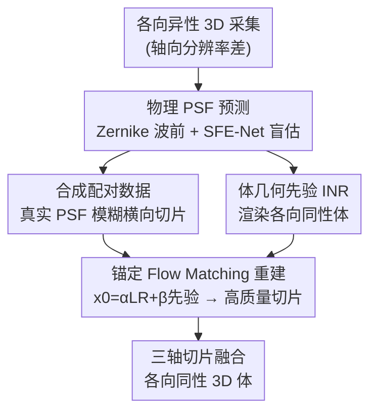

# MicroFM: Physics-guided Flow Matching for Isotropic Microscopy Reconstruction

**会议**: CVPR 2026  
**论文**: [CVF Open Access](https://openaccess.thecvf.com/content/CVPR2026/html/Zhan_MicroFM_Physics-guided_Flow_Matching_for_Isotropic_Microscopy_Reconstruction_CVPR_2026_paper.html)  
**代码**: 无  
**领域**: 医学图像  
**关键词**: 荧光显微成像, 各向同性重建, Flow Matching, 物理 PSF, 隐式神经表示

## 一句话总结
MicroFM 用物理 PSF 合成真实退化的训练数据、用隐式神经表示提供体几何先验，再用一个从低质量输入"锚定"出发的 Flow Matching 网络做荧光显微镜的各向同性重建，在四个显微系统上全面刷 SOTA。

## 研究背景与动机
**领域现状**：3D 荧光显微镜能看到亚细胞结构、细胞互作和组织形态，但受衍射极限约束，光学系统的点扩散函数（PSF）在轴向（z 方向）严重各向异性，轴向分辨率通常比横向（xy）差 2~3 倍。要恢复轴向分辨率，一条路是改硬件（光束整形、多视角、PSF 工程），但复杂、昂贵、有旁瓣伪影还会带来光毒性；于是计算重建——尤其是深度学习——成了可扩展的主流方案。

**现有痛点**：当前深度学习管线有两个致命短板。其一是**合成训练数据与真实成像不匹配**：绝大多数方法（CARE、SSAI-3D 等）用固定方差的高斯核来模拟轴向模糊，而真实 PSF 含各向异性、像差、深度变化和样本诱导畸变；网络学到的是"反高斯模糊"而非"反真实成像过程"，到了真实轴向切片上泛化很差。其二是**缺乏显式的体几何约束**：很多方法逐张处理 2D 切片，忽略切片间的连续性和 3D 几何，常把柱状结构重建成球状；准 3D 输入和"轴向-横向相似性"线索只是弱正则，在强方向性/各向异性组织里频繁失效。

**核心矛盾**：无配对 GAN（CycleGAN、UTOM、Neuroclear）靠循环一致/显著性约束放松配对需求，但容易幻觉、扭曲形态；扩散模型质量好但算力代价高。本质矛盾是——要么退化模型不真实（数据侧失配），要么缺 3D 几何约束（结构侧失真），且生成式方法在保真度与采样效率之间难两全。

**本文目标**：(1) 让合成退化贴合目标显微镜的真实物理成像；(2) 给逐切片重建注入跨切片的体几何先验；(3) 用一个既快又稳、还能压制幻觉的生成框架完成各向同性恢复。

**切入角度**：作者把问题拆成"物理一致的退化建模 + 几何感知的重建"两阶段，并首次把 **Flow Matching** 引入显微镜各向同性重建——关键观察是：如果让概率流不从纯噪声出发、而是从"低质量观测 + 体几何先验"锚定出发，就能在真实数据分布上学分辨率增强，天然抑制幻觉。

**核心 idea**：用"仪器匹配的物理 PSF 合成真实配对数据"替代高斯核失配，用"隐式体几何先验 + 从观测锚定的 Flow Matching"替代逐切片无约束生成。

## 方法详解

### 整体框架
MicroFM 是一个两阶段物理引导框架。**第一阶段（物理 PSF 预测）**：先用 Zernike 波前在光瞳面生成物理一致的 PSF 并合成低分辨率图像，训练一个 SFE-Net 从低分图盲推 PSF；再把它作用到真实各向异性数据的轴向切片上，估计出与目标显微镜匹配的空间变化 PSF，并用这些 PSF 去模糊横向高分切片，得到"贴合真实退化"的配对训练数据。**第二阶段（各向同性恢复）**：先训练一个连续隐式神经表示（INR），把各向异性采集体渲染成各向同性体、为每个切片提供几何先验；再把"退化输入切片 ⊕ INR 先验"融合成流的起点 $x_0$，用 Flow Matching 重建网络把它逐步传输到高质量切片，最后把各轴向切片的重建融合成各向同性 3D 体。

### 关键设计

**1. 仪器匹配的物理 PSF 合成：用真实 PSF 配对数据替代高斯核失配**

针对"合成数据用高斯核、和真实成像对不上"这个第一痛点，作者用物理光学把退化建得真实。先在归一化光瞳 $(\rho,\theta)$ 上用 25 个 Zernike 模式（活塞、倾斜、离焦、像散、彗差、球差及高阶像差）表示波前相位 $\phi(\rho,\theta)=\sum_{n=0}^{24} a_n Z_n(\rho,\theta)$，系数 $a$ 随机采样；在 Fraunhofer 近似下得到含像差的复光瞳 $P(\rho,\theta)=A(\rho)e^{i\phi(\rho,\theta)}$，再经傅里叶传播得到非相干 PSF $h(x,y)=|\mathcal{F}\{P\}|^2$。把高分图 $S$ 与 $h$ 卷积、注入泊松散粒噪声与高斯读出噪声、按显微镜轴向采样率下采，得到逼真的低分图：

$$I_{LR}\sim D\big(\mathrm{Poisson}(S*h)+\eta\big),\quad \eta\sim\mathcal{N}(0,\sigma^2)$$

用这些"物理生成的 LR↔HR 对"训练 SFE-Net 学会盲估 PSF；推理时把 SFE-Net 作用到目标显微镜的真实轴向图上，每张轴向图回归出一个不同的 PSF——这正好对应**空间变化的仪器响应**。最后从每张轴向图的预测 PSF 里随机抽 7 个去模糊横向切片，造出 7 张退化图，让模型见到完整的轴向退化谱。相比固定高斯核，这套物理配对把仿真与真实成像之间的差距大幅缩小，因为它显式捕捉了位置依赖、光学像差和样本诱导畸变。

**2. 连续隐式体几何先验：用 INR 渲染各向同性体补回逐切片丢失的 3D 约束**

针对"逐 2D 切片重建丢几何、把柱状重建成球状"这个第二痛点，作者用隐式神经表示（INR）学一个连续场 $f_\theta:\mathbb{R}^3\to\mathbb{R}$ 来承载体几何。给定各向异性采集 $G\in\mathbb{R}^{Z_{low}\times Y\times X}$，网络以固定位置编码 $\gamma$ 渲染各向同性体 $\hat V(y,x,z)=f_\theta(\gamma(y,x,z))$。训练时把退化算子建为"先沿 z 下采、再卷预测物理 PSF" $A(\cdot)=p*D_z(\cdot)$，在随机子体 $\Omega$ 上最小化模拟观测与真实采集的均方误差：

$$L_{INR}=\mathbb{E}_\Omega\big\|A(\hat V|_\Omega)-G|_\Omega\big\|_2^2$$

推理时，对任意横向切片索引 $Z_s$，从其对称邻域聚合 $n$ 张合成切片，做高斯加权得到显式切片先验 $\hat M_s(y,x)=\sum_{k=1}^n w_k\, f_\theta(\gamma(y,x,z_s+\Delta_k))$，权重 $w_k=\exp(-(k-\mu)^2/2\sigma^2)/\sum_j\exp(-(j-\mu)^2/2\sigma^2)$（$\mu=(n+1)/2$，论文取 $n=6$）；YZ、XZ 面通过固定 $x$ 或 $y$ 同样构造。这样每个切片都带上了跨平面的连续性与拓扑线索，正好补回逐 2D 处理时缺失的体约束。

**3. 锚定式 Flow Matching 重建：从"观测+先验"出发而非纯噪声，少步采样还抑制幻觉**

针对"生成式方法要么慢、要么从噪声出发爱幻觉"的矛盾，作者把分辨率恢复建成一条**确定性概率流**，且让流的起点不是噪声、而是低质量观测与体几何先验的凸混合：$x_0=\alpha x_2+\beta \hat M$（$\alpha+\beta=1$，论文 $\beta=0.5$）。这一步直接把 XY/YZ/XZ 三个方向的连续性与拓扑注入起点，从真实数据分布旁边出发学"分辨率增强"，从而显著少幻觉。给定目标高质量切片 $x_1$，理想速度恒为 $v^\star(x_t)=x_1-x_0$，插值点 $x_t=t x_1+(1-t)x_0$，网络学条件速度场 $v_\theta[x_t,t\,|\,x_0]$ 去逼近它。为了能少步采样，作者采用 Consistency Flow Matching，引入端点一致性 $f(t,x_t)=x_t+(s(t)-t)v_\theta(x_t,t)$ 并要求 $f(t,x_t)\approx f(r,x_r)$（$r=\min\{t+\delta,1\}$，分段线性路径），损失为：

$$L_{cons}=\|f(t,x_t)-f(r,x_r)\|_2^2+\lambda_{vel}\,\mathbf{1}[t<b]\,\mathbf{1}[d_t>\tau]\,\|v_t-v_r\|_2^2$$

其中 $b$ 是当前分段终点、$d_t$ 是 $t$ 到段尾距离、$\tau$ 是小阈值；两个指示函数让速度一致项只在段内严格生效、并在段尾附近关掉以避免零长退化更新。直观上，它要求"从段内不同起点沿当前速度一步 Euler 推进都落到同一段尾点"，从而**拉直 ODE 轨迹**，实现两步采样、限制离散化误差累积。这是 MicroFM 又快又稳的根源。

### 损失函数 / 训练策略
INR 用 $L_{INR}$（式 6）预训练；重建网络用 $L_{cons}$（式 12）训练。骨干用 2.48M 参数的 NCSN++，训练与推理均两步采样；Adam 优化、初始学习率 $5\times10^{-4}$、$\beta_1=0.9$、先验权重 $\beta=0.5$；512×512 patch、batch 12、200k 迭代，单张 H100 训练。

## 实验关键数据

### 主实验
四个不同荧光显微系统/数据集（CS-fMOST 密集神经元簇、共聚焦 Thy1-GFP 小鼠脑、双光子小鼠肾、宽场小鼠肝），对比 3 个自监督（Self-Net、SSAI-3D、Neuroclear）+ 3 个无监督（CycleGAN、UTOM、CycleDiffusion）。横向 XY 用全参考指标，轴向 XZ/YZ 用无参考指标。

| 数据集 | 指标 | MicroFM | 次优 baseline | 备注 |
|--------|------|---------|---------------|------|
| 密集神经元簇 | PSNR↑ | **40.186** | 30.745 (SSAI-3D) | +9.4 dB |
| 密集神经元簇 | SSIM↑ / LPIPS↓ | **0.964 / 0.075** | 0.889 / 0.168 | 大幅领先 |
| Thy1-GFP 脑 | PSNR↑ | **47.363** | 33.098 (Self-Net) | +14 dB |
| 小鼠肾 | PSNR↑ / SSIM↑ | **30.555 / 0.854** | 20.721 / 0.734 | 强各向异性组织仍稳 |
| 小鼠肝 | PSNR↑ / SSIM↑ | **33.005 / 0.946** | 21.606 / 0.759 | +11 dB |

MicroFM 在全参考保真度（PSNR/SSIM/VIF/LPIPS）上基本全面最优；轴向无参考指标（NIQE/PIQE/NRQM）也更稳定领先。少数 baseline 在个别感知指标上偶尔更高（如 Liver 的 NRQM、Kidney 的 LPIPS），但都伴随横向全参考保真度下降或轴向质量不稳——印证了"横向变锐而轴向畸变"的通病，而 MicroFM 能同时压住两端。

### 消融实验
在密集神经元簇数据集上逐组件消融（Table 3）：

| 配置 | PSNR | SSIM | 说明 |
|------|------|------|------|
| Base model | 29.847 | 0.742 | 去掉三大组件 |
| w/o flow from low quality images | 32.614 | 0.889 | 从噪声而非观测出发 |
| w/o physical PSFs | 31.392 | 0.836 | 换回高斯核 |
| w/o volumetric prior | 33.490 | 0.926 | 去掉 INR 体先验 |
| **MicroFM (Full)** | **40.186** | **0.964** | 完整模型 |

先验权重 $\beta$ 敏感性（Table 4）：$\beta=0$ 时 PSNR 33.490，$\beta=0.5$ 峰值 PSNR 40.186/SSIM 0.964/VIF 0.378/LPIPS 0.075；$\beta=1.0$ 过度正则反降到 PSNR 31.758/SSIM 0.908，故全程取 $\beta=0.5$。

### 关键发现
- **从观测锚定出发贡献最大**：把流的起点从噪声换成低质量图，PSNR 直接从 32.614 跳到 40.186、SSIM 从 0.889 到 0.964——说明"锚定起点"既抑幻觉又提保真，是核心增益来源。
- **物理 PSF 不可少**：换回高斯核 PSNR 掉约 22%、SSIM 掉约 13%，证明退化失配是限制轴向重建的硬瓶颈。
- **体先验权重要适中**：$\beta$ 太小（0~0.25）几何线索不足，太大（0.75~1.0）过度正则伤保真，0.5 为甜点。
- **PSF 分析**：训练后预测 PSF 库的香农熵下降，说明 PSF 更集中但仍保留空间变化，符合"单台显微镜内有界空间变异"的物理预期；不同系统的晚期 PhaseZ 幅度分布差异明显，体现了仪器特异性。

## 亮点与洞察
- **把物理光学塞进数据合成**：用 Zernike 波前 + 傅里叶传播生成物理一致 PSF，再用 SFE-Net 盲估目标显微镜的空间变化 PSF——这套"物理生成→盲估→真实配对"的闭环，直击高斯核失配，是显微重建里很值得复用的数据侧 trick。
- **从观测锚定 Flow Matching**：$x_0=\alpha x_2+\beta\hat M$ 让概率流不从噪声出发，而是从"观测+几何先验"出发，本质上把生成问题约束在真实数据分布附近，少幻觉又能两步采样——这个"锚定起点"思想可迁移到任何"输入已是退化版、不需要从噪声生成"的恢复任务（SR、去噪、去模糊）。
- **INR 当几何先验而非最终输出**：不直接拿 INR 渲染结果当答案，而是把它当切片级几何先验喂给 Flow Matching，规避了 INR 单独重建偏糊的问题，又补回了逐切片丢失的 3D 约束。
- **首次把 Flow Matching 用于各向同性显微重建**，并用 Consistency FM 拉直轨迹实现 2 步采样，兼顾质量与速度。

## 局限与展望
- **依赖物理 PSF 建模的准确性**：Zernike 基（25 模式）和 Fraunhofer 近似对极端像差/强散射样本是否够用未充分讨论；若 SFE-Net 盲估 PSF 偏了，下游配对数据会系统性失真。
- **评估仍偏代理**：轴向用无参考指标、横向用"合成退化"的全参考评估，缺乏真实各向同性 GT 的直接逐体素比较，保真度声明存在一定代理性。
- **泛化与超参**：$\beta=0.5$、$n=6$、7 个 PSF 采样等超参在四个数据集上调好，跨更多模态/更强各向异性时是否稳健需进一步验证。
- **改进方向**：可探索 PSF 估计与重建端到端联合优化、引入真实各向同性参考做半监督校准、或把体先验从切片级升级为真正的 3D 联合传输。

## 相关工作与启发
- **vs SSAI-3D / Self-Net（自监督）**：它们靠"轴向-横向相似性 + 稀疏微调"做跨系统泛化，但仍假设横向轴向分布相似、用高斯核退化；MicroFM 用物理 PSF 打破退化失配、用体先验打破相似性假设，在强各向异性的肾/肝上优势尤其明显。
- **vs CycleGAN / UTOM / Neuroclear（无配对 GAN）**：循环一致/显著性约束在强各向异性样本上违背了"两向分布相似"前提，常横向变锐而轴向畸变；MicroFM 从观测锚定的确定性流天然抑制这种幻觉。
- **vs CycleDiffusion（扩散）**：扩散质量可以但算力高、从噪声出发；MicroFM 用 Consistency Flow Matching 把采样压到两步、且从观测出发，更快更稳。

## 评分
- 新颖性: ⭐⭐⭐⭐ 首次把物理 PSF 合成 + INR 体先验 + 锚定 Flow Matching 三者拼成显微各向同性重建框架，组合新颖。
- 实验充分度: ⭐⭐⭐⭐ 四系统四数据集、六 baseline、组件+权重双消融、PSF 熵分析齐全；略缺真实各向同性 GT 的直接评估。
- 写作质量: ⭐⭐⭐⭐ 动机-方法-实验逻辑清晰，公式完整，框架图直观。
- 价值: ⭐⭐⭐⭐ PSNR 普遍 +9~14 dB，对生物医学 3D 显微定量分析有实用价值，物理配对与锚定流思想可复用。

<!-- RELATED:START -->

## 相关论文

- [\[AAAI 2026\] Ambiguity-aware Truncated Flow Matching for Ambiguous Medical Image Segmentation](../../AAAI2026/medical_imaging/ambiguity-aware_truncated_flow_matching_for_ambiguous_medica.md)
- [\[ICLR 2026\] Learning Patient-Specific Disease Dynamics with Latent Flow Matching for Longitudinal Imaging Generation](../../ICLR2026/medical_imaging/learning_patient-specific_disease_dynamics_with_latent_flow_matching_for_longitu.md)
- [\[CVPR 2026\] D$^2$-FOSA: Dual-Diffusion Guided EEG-to-Image Reconstruction with Frequency-Oriented Semantic Alignment](d2-fosa_dual-diffusion_guided_eeg-to-image_reconstruction_with_frequency-oriente.md)
- [\[NeurIPS 2025\] Riemannian Flow Matching for Brain Connectivity Matrices via Pullback Geometry](../../NeurIPS2025/medical_imaging/riemannian_flow_matching_for_brain_connectivity_matrices_via_pullback_geometry.md)
- [\[NeurIPS 2025\] Surf2CT: Cascaded 3D Flow Matching Models for Torso 3D CT Synthesis from Skin Surface](../../NeurIPS2025/medical_imaging/surf2ct_cascaded_3d_flow_matching_models_for_torso_3d_ct_synthesis_from_skin_sur.md)

<!-- RELATED:END -->
