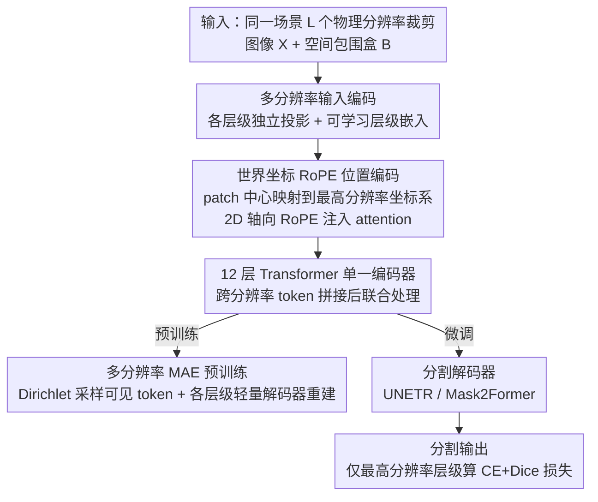

# MuViT: Multi-Resolution Vision Transformers for Learning Across Scales in Microscopy

**会议**: CVPR 2026  
**arXiv**: [2602.24222](https://arxiv.org/abs/2602.24222)  
**代码**: [github.com/weigertlab/muvit](https://github.com/weigertlab/muvit)  
**领域**: 医学图像  
**关键词**: 多分辨率、Vision Transformer、RoPE、显微镜图像、语义分割

## 一句话总结

提出 MuViT，一种基于世界坐标 RoPE 位置编码的多分辨率 Vision Transformer，能在单一编码器中联合处理同一场景不同物理分辨率的裁剪图，在显微镜图像分割任务上显著优于单分辨率基线。

## 研究背景与动机

现代显微成像（光片荧光显微镜、电子显微镜、数字病理）常产生超大尺寸（>50K×50K 像素）的千兆像素图像，其中包含从细胞形态到组织架构等跨越多个空间尺度的结构。大量分析任务需要同时利用多尺度信息——例如对细胞进行语义分割时，需要知道该细胞所处的组织区域（全局上下文），同时又需要精细的局部细节。

现有方法的核心矛盾在于：
- **CNN/ViT 基于 tiled prediction**：受显存限制只能处理固定大小的 tile（如 512×512），导致视野与分辨率的 trade-off
- **层级架构（Swin/PVT/HIPT）**：从单一分辨率输入内部构建特征金字塔，但并未利用真正的多分辨率观测
- **多路径模型（CrossViT/MPViT）**：处理人工创建的尺度变体，缺乏跨尺度的几何一致性

MuViT 的核心洞察是：不同空间尺度可作为互补的输入"模态"，只要它们共享统一的几何参考系。

## 方法详解

### 整体框架

MuViT 接收同一图像在 $L$ 个不同物理分辨率下的裁剪 $\mathbf{X} \in \mathbb{R}^{L \times C \times H \times W}$ 及其空间包围盒 $\mathcal{B} \in \mathbb{R}^{L \times 2 \times 2}$。每个分辨率层级先独立投影并加层级嵌入得到 token，所有 patch 被映射到统一的世界坐标系，通过基于 RoPE 的注意力机制在单一编码器（12 层 Transformer）中实现跨分辨率信息融合。编码器输出既可走多分辨率 MAE 预训练分支自监督学习表征，也可接分割解码器（UNETR / Mask2Former）输出分割结果。记 MuViT$_{[l_1, l_2, \ldots]}$ 表示使用分辨率层级 $l_1, l_2, \ldots$ 的编码器（$l=1$ 为最高分辨率，$l>1$ 表示 $l\times$ 下采样）。

### 关键设计

**1. 多分辨率输入编码：每个层级独立投影 + 层级嵌入后联合处理**

要把不同物理分辨率当成互补「模态」喂进同一个编码器，就得让模型分得清 token 来自哪一级。每个分辨率层级 $l$ 配独立的线性投影层 $\text{PE}_l$ 和可学习层级嵌入 $\mathbf{e}_l$：

$$\mathbf{z}_l = \text{PE}_l(\mathbf{X}_l) + \mathbf{e}_l$$

所有层级的 token 拼接后送入 12 层 Transformer 联合处理，整模型参数量仅约 25M——不靠复杂的层级结构或跨尺度注意力模块，单纯靠坐标对齐 + 拼接就完成融合。

**2. 世界坐标 RoPE 位置编码：让不同分辨率的 patch 在同一坐标系里对齐**

跨尺度融合的真正难点是几何一致性——多路径模型处理人工尺度变体时缺乏跨尺度的共同参考系。MuViT 把每个 patch 的中心坐标都映射到最高分辨率的像素坐标系（即世界坐标），再用 2D 轴向 RoPE 把坐标注入 attention：

$$\theta_k^{(a)} = \mathbf{p}_{l,i,j}^{(a)} / b^{2k/d_a}, \quad k=0,\ldots,d_a/2-1$$

其中 $b$ 为可学习参数（初始化为 10000）。这样表示同一空间位置的 patch 不论来自哪个分辨率都拿到相同的位置编码，跨尺度信息才能有效流动。实验里把世界坐标换成 naive 居中坐标后性能直接崩溃，说明准确的世界坐标是这套机制不可或缺的地基。

**3. 多分辨率 MAE 预训练（MuViT-MAE）：用跨尺度掩码重建加速表征学习**

跨尺度表征若从头随分割任务一起学会很慢。MuViT 用高掩码率 $\rho=0.75$ 的 MAE 预训练，各层级可见 token 比例从 Dirichlet 分布 $\text{Dir}(\alpha=0.5)$ 采样，迫使模型在不同尺度可见性组合下互相补全。每个分辨率层级配一个轻量解码器（2 层 Transformer），通过交叉注意力访问所有可见编码输出，损失为各层级 masked patch 的 MSE 均值。这套预训练让模型 10 个 epoch 就超过所有单分辨率基线训完的表现。

### 损失函数 / 训练策略

- **分割损失**：交叉熵 + Dice，权重均为 1.0，仅在最高分辨率层级计算

$$\mathcal{L} = \lambda_{\text{CE}} \cdot \mathcal{L}_{\text{CE}}(\tilde{y}, y) + \lambda_{\text{Dice}} \cdot \mathcal{L}_{\text{Dice}}(\tilde{y}, y)$$

- **分割解码器**：支持 UNETR 风格（跳跃连接 + 渐进上采样）和 Mask2Former 风格（可学习 mask query 交叉注意力）
- **训练采样**：随机坐标采样嵌套裁剪，保证粗分辨率裁剪包含细分辨率裁剪；数据存储为 Zarr 金字塔格式按需加载

## 实验关键数据

### 主实验

| 数据集 | 方法 | 输入尺寸 | mDSC/DSC | 之前SOTA | 提升 |
|--------|------|----------|----------|----------|------|
| Synthetic | MuViT[1,4]+UNETR | 2×256² | **0.9538** | DeepLabV3: 0.4895 | +0.464 |
| Mouse (11类脑区) | MuViT[1,8,32]+Mask2Former | 3×256² | **0.901** | DeepLabV3@1024²: 0.843 | +0.058 |
| KPIS (肾病理) | MuViT[1,8]+UNETR | 2×512² | **0.8958** | HoloHisto-4K@3840×2160: 0.8454 | +0.050 |

### 消融实验

| 配置 | 关键指标 | 说明 |
|------|---------|------|
| MuViT[1,8,32]+Mask2Former (naive bbox) | mDSC=0.820 (Mouse) | 用错误坐标，比正确的 0.901 降 0.081 |
| MuViT[1,4]+UNETR (naive bbox) | mDSC=0.386 (Synthetic) | 坐标错误导致性能崩溃 |
| MuViT[1] (单分辨率) | mDSC=0.391 (Mouse) | 缺乏全局上下文 |
| Linear probe: [1] → [1,8] → [1,8,32,64] | AUC: 0.958 → 0.963 → 0.988 | 分辨率层级越多表征越丰富 |
| MAE 预训练加速 | Epoch 10 即达 mDSC=0.843 | 比所有基线在 Epoch 50 的表现都好 |

### 关键发现

- 世界坐标对齐是 MuViT 有效跨尺度融合的先决条件，naive 坐标即使架构和输入不变也导致严重性能退化
- 多分辨率 MAE 预训练极大加速收敛：10 个 epoch 即超过所有单分辨率基线训完的性能
- 增加分辨率层级带来单调的表征提升（线性探测 AUC 从 0.958 提升到 0.988）
- 模型对坐标噪声具有一定鲁棒性（≤32px 偏移下性能降幅甚微）

## 亮点与洞察

- **简洁而强大的设计**：不引入复杂的层级结构或跨尺度注意力模块，仅通过世界坐标 RoPE 就实现了有效的跨分辨率融合
- **真正的多分辨率 vs 伪多尺度**：首次在显微成像中严格区分从单一输入导出的"多尺度特征"与真正从不同物理分辨率采样的"多分辨率输入"
- Dirichlet 采样策略让不同层级的掩码比例随机变化，促进跨尺度互补学习
- 轻量级架构（~25M 参数）却在三个不同任务上全面超越 SOTA

## 局限与展望

- 全注意力机制使计算和显存开销随分辨率层级数线性增长，未来可引入稀疏或跨尺度注意力
- 仅评估了语义分割任务，未覆盖实例分割、目标检测等下游任务
- 假设裁剪是嵌套的（粗包含细），未探索非嵌套、任意空间排列的多分辨率输入
- 3D 体数据和非显微成像领域（如遥感）的泛化性有待验证

## 相关工作与启发

- 与 MultiMAE 类似将不同尺度视为"模态"，但通过世界坐标约束实现几何一致性
- RoPE 从 NLP 引入 Vision 的成功案例，且用法独特：旋转角度由真实空间坐标决定
- HIPT 也处理层级显微图像，但不支持联合编码和跨分辨率注意力
- 对数字病理中 whole-slide image 的多尺度分析有直接启发：可考虑将不同放大倍率作为不同分辨率层级

## 评分

- 新颖性: ⭐⭐⭐⭐ 世界坐标 RoPE 在多分辨率 ViT 中的应用简洁新颖
- 实验充分度: ⭐⭐⭐⭐ 三个数据集 + 完整消融 + 线性探测 + 收敛分析
- 写作质量: ⭐⭐⭐⭐ 结构清晰，概念区分精准
- 价值: ⭐⭐⭐⭐ 对显微/病理图像分析的多尺度处理有广泛适用性

<!-- RELATED:START -->

## 相关论文

- [\[CVPR 2026\] EEGiT: Teaching Vision Transformers to Understand the EEG signal](eegit_teaching_vision_transformers_to_understand_the_eeg_signal.md)
- [\[CVPR 2026\] Keep It Frozen: Domain-Routed Conditional Residual Modulation for Multi-Domain Vision Transformers](keep_it_frozen_domain-routed_conditional_residual_modulation_for_multi-domain_vi.md)
- [\[CVPR 2026\] Building Robust Vision Encoders for Cross-Dataset Evaluation in Immunofluorescent Microscopy](building_robust_vision_encoders_for_cross-dataset_evaluation_in_immunofluorescen.md)
- [\[CVPR 2026\] OmniBrainBench: A Comprehensive Multimodal Benchmark for Brain Imaging Analysis Across Multi-stage Clinical Tasks](omnibrainbench_a_comprehensive_multimodal_benchmark_for_brain_imaging_analysis_a.md)
- [\[CVPR 2026\] Turning Pre-Trained Vision Transformers into End-to-End Histopathology Whole Slide Image Models for Survival Prediction](turning_pre-trained_vision_transformers_into_end-to-end_histopathology_whole_sli.md)

<!-- RELATED:END -->
