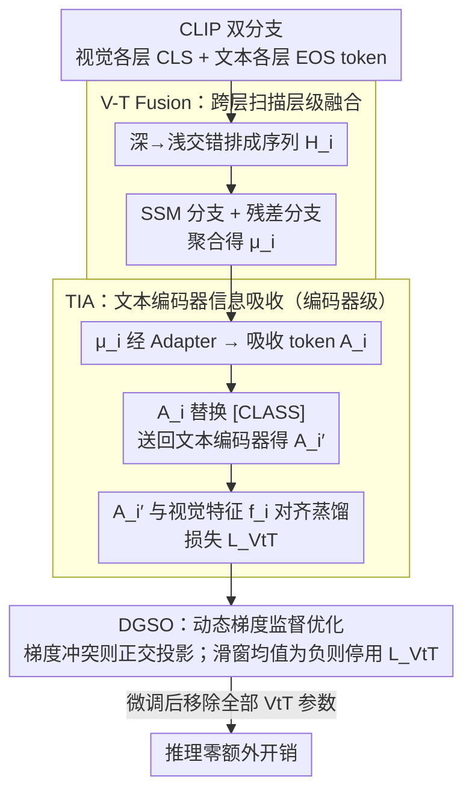

# Reclaiming Lost Text Layers for Source-Free Cross-Domain Few-Shot Learning

**会议**: CVPR2026  
**arXiv**: [2603.05235](https://arxiv.org/abs/2603.05235)  
**代码**: [zhenyuZ-HUST/CVPR26-VtT](https://github.com/zhenyuZ-HUST/CVPR26-VtT)  
**领域**: 医学图像 / 跨域少样本学习  
**关键词**: CLIP, 跨域少样本学习, 文本编码器层冗余, 视觉-文本融合, 状态空间模型, 梯度优化

## 一句话总结

发现 CLIP 文本编码器中存在"Lost Layers"——在 Source-Free Cross-Domain Few-Shot Learning (SF-CDFSL) 中移除某些中间层反而提升性能；论文证明这些层并非冗余而是因视觉域偏移未被充分利用，提出 VtT 模型在层级和编码器级别重新利用这些信息，取得 SOTA。

## 研究背景与动机

**跨域少样本学习的实际需求**：医学影像、遥感等领域标注数据极度稀缺，需要从预训练模型迁移知识，但源域数据往往因隐私和计算成本不可获取，催生了 Source-Free CDFSL (SF-CDFSL) 任务。

**CLIP 的跨域潜力**：CLIP 凭借大规模图文对齐预训练，在下游少样本任务中表现优异，其文本编码器被认为包含更适合跨域任务的知识。

**意外发现——Lost Layers**：作者发现在 SF-CDFSL 设置下，移除 CLIP 文本编码器的某些中间层（如第 6-7 层）反而能显著提升性能，且该现象在所有 CLIP 骨干版本和不同微调方法中普遍存在。

**层冗余的传统认知需修正**：已有工作 [40,49,57] 认为这些层是冗余的并直接删除，但作者通过"强调策略"（Emphasize）发现加权这些层的输出反而取得更好效果，说明信息有用但被浪费。

**视觉域偏移是根因**：在 ImageNet（源域）上不存在 Lost Layer 现象，但在 ImageNet-R（跨域）上立即出现，证明视觉域的改变阻碍了文本编码器中有益信息的利用。

**需要重新引导视觉分支**：核心思路并非丢弃 Lost Layers，而是通过"教视觉编码器像文本编码器一样思考"来重新利用文本分支中被浪费的预训练知识。

## 方法详解

### 整体框架

VtT（teach the Vision to Think like the Text）针对的是一个反直觉现象：在 Source-Free 跨域少样本设置下，CLIP 文本编码器的某些中间层被移除后性能反而更好——这些"Lost Layers"不是冗余，而是因视觉域偏移没被用上。VtT 的思路不是丢掉它们，而是教视觉分支"像文本分支一样思考"，把被浪费的预训练文本知识重新激活。它是一个即插即用的微调插件，由三个模块串起来：V-T Fusion 在层级上融合视觉与文本各层输出，TIA 把融合特征送回文本编码器做编码器级吸收，DGSO 则用梯度冲突信息动态平衡分类与知识吸收两个目标。微调完成后所有 VtT 参数被移除，推理阶段零额外开销。

### 关键设计

**1. V-T Cross-Layer Scanning Fusion：把视觉和文本逐层交错喂给 SSM 做层级融合**

要让视觉分支用上文本各层的信息，先得有个机制把两边逐层对齐。VtT 将视觉编码器各层 CLS token 和文本编码器各层 EOS token 交替排成序列 $H_i = (f_i^l, t_i^l, f_i^{l-1}, t_i^{l-1}, \cdots, f_i^1, t_i^1)$，扫描方向从深层到浅层；再用 State Space Model（SSM）聚合，残差分支（AvgPool + MLP）与 SSM 分支（MLP + 位置编码 + 2 层 SSM + AvgPool）相加得到 $\mu_i = \mu_i^{\text{res}} + \mu_i^{\text{ssm}}$。消融证实这套设计的两个选择都不是随意的：深→浅扫描优于浅→深和双向，SSM（58.2）也优于 MHA（57.2）、RNN（57.2）、LSTM（57.4）。

**2. Text Encoder Information Absorption (TIA)：把层级知识塞回文本编码器再蒸馏给视觉特征**

层级融合只拿到"各层细节"，还缺"编码器整体视角"。TIA 把融合输出 $\mu_i$ 经可学习 Adapter 映射成"吸收 token" $A_i$，再用它替换文本 prompt 里的类别 token [CLASS]，组成 $r_i' = [a][photo][of][a][A_i]$ 送进文本编码器，得到同时含层级细节与编码器级整体知识的 $A_i'$。最后用 $L_{\text{VtT}}$ 最大化 $A_i'$ 与视觉特征 $f_i$ 的余弦相似度，把文本知识蒸馏进视觉特征——这正是"教视觉像文本一样思考"落到 loss 上的具体形式。

**3. Dynamic Gradient Supervised Optimization (DGSO)：用梯度冲突信号避免知识吸收反伤分类**

加一个蒸馏目标的风险是它和主分类任务打架、把分类性能拖下去。DGSO 计算 $L_{ce}$ 和 $L_{comb} = L_{ce} + \beta L_{VtT}$ 的梯度余弦相似度 $C_\theta$：一旦 $C_\theta < 0$（方向冲突），就把 $G_{comb}$ 投影到 $G_{ce}$ 的正交方向，保证知识吸收不损害分类。同时维护一个 $C$ 值队列，用长度 $\lambda=50$ 的滑动窗口算均值 $M_e$，当 $M_e < 0$ 时彻底停用 $L_{VtT}$ 且不再重新激活。这套"先矫正、再动态停用"的机制让训练自适应地决定何时听文本知识、何时放手，无需手调训练策略。

### 损失函数

$$L_{comb} = L_{ce} + \beta \cdot L_{VtT}, \quad \beta = 7$$

其中 $L_{ce}$ 为标准交叉熵分类损失，$L_{VtT}$ 为视觉-文本对齐蒸馏损失。

## 实验

### 主实验结果（5-way 1-shot，4 个 CDFSL 数据集）

| 方法 | CropDisease | EuroSAT | ISIC | ChestX | Avg |
|---|---|---|---|---|---|
| CLIP-LoRA-Vision | 84.22 | 81.72 | 36.40 | 21.86 | 55.97 |
| **CLIP-LoRA + VtT (Ours)** | **87.00** | **85.01** | **38.20** | **22.70** | **58.23** |
| PE-Core-LoRA | 91.75 | 84.49 | 40.89 | 22.02 | 59.78 |
| **PE-Core-LoRA + VtT (Ours)** | **92.61** | **86.16** | **42.20** | **23.04** | **61.00** |

### 5-way 5-shot 最佳结果

| 方法 | CropDisease | EuroSAT | ISIC | ChestX | Avg |
|---|---|---|---|---|---|
| CLIP-LoRA + VtT | 97.21 | 94.58 | 56.20 | 26.42 | 68.57 |
| PE-Core-LoRA + VtT | **98.36** | **94.67** | **60.03** | **27.05** | **70.05** |

### 消融实验

| TIA | V-T Fusion | DGSO | Avg |
|---|---|---|---|
| ✗ | ✗ | ✗ | 55.9 (baseline) |
| ✓ | ✗ | ✗ | 56.9 (+1.0) |
| ✓ | ✓ | ✗ | 57.6 (+1.7) |
| ✓ | ✗ | ✓ | 57.6 (+1.7) |
| ✓ | ✓ | ✓ | **58.2 (+2.3)** |

### 关键发现

- **Lost Layer 被消除**：应用 VtT 后，使用完整文本编码器的性能最优，不再存在移除某层更好的现象（Figure 1(c)）
- **注意力图改善**：VtT 消除了对非语义区域的错误关注，同时保留了有效注意力区域，提高了图文对齐的余弦相似度
- **跨骨干通用**：在 CLIP、SigLip2、PE-Core 三种骨干上均一致提升
- **计算开销低**：相比 Maple (3.1M 参数, 205G FLOPs)，VtT 仅 3.9M 参数、148.5G FLOPs，性能高出 5.1 个百分点
- **Dynamic Loss Combining 有效**：有 DLC 时 Avg 58.2，无 DLC 时降至 57.2

## 亮点

- **洞察新颖**：首次发现并系统分析 CLIP 文本编码器的 Lost Layer 现象，证明其根因是视觉域偏移而非信息冗余
- **方法优雅**：VtT 作为纯训练阶段插件，推理时完全移除，零额外开销
- **DGSO 设计精巧**：梯度矫正 + 动态停止机制，自适应平衡分类与知识吸收，无需手动调节训练策略
- **实验全面**：4 个 CDFSL 数据集 + 10 个 Meta-dataset，3 种骨干网络，多种微调方法，消融设计细致

## 局限性

- 虽然推理无开销，训练阶段需额外计算 SSM 前向传播和两次梯度（$L_{ce}$ 和 $L_{comb}$），训练成本增加
- 超参数 $\beta=7, \lambda=50$ 在所有设置上固定，但未充分讨论对不同域偏移程度的敏感性
- Lost Layer 分析主要基于 ViT 架构的 CLIP，对 CNN 骨干或其他 VLM 架构的适用性未验证
- 数据集主要集中在特定跨域基准（农业、遥感、医学），更极端的域偏移场景（如 3D、视频）未探索

## 相关工作

- **SF-CDFSL**：StepSTP [61]、LDC [32] 等关注无源域微调策略，但未探索文本编码器层的利用问题
- **PEFT 方法**：CoOp [75]、Maple [25]、CLIP-LoRA [66] 等提供不同微调策略，VtT 可作为插件叠加使用
- **层冗余研究**：[40,49,57,30,15] 发现移除某些层不显著降低性能并采用删除策略，本文首次证明这些层实际有益且可被重新利用
- **知识蒸馏/模态融合**：TIA 模块受模态转换方法 [41] 启发，DGSO 的梯度矫正受多任务学习中梯度冲突处理启发

## 评分

- 新颖性: ⭐⭐⭐⭐ — Lost Layer 现象的发现和"有益但未利用"的洞察非常新颖
- 实验充分度: ⭐⭐⭐⭐⭐ — 4+10 个数据集、3 种骨干、多种基线、完整消融
- 写作质量: ⭐⭐⭐⭐ — 分析链路清晰（发现→归因→解决），图表设计直观
- 价值: ⭐⭐⭐⭐ — 对 VLM 跨域迁移的层级信息利用提供新思路，插件式设计实用性强

<!-- RELATED:START -->

## 相关论文

- [\[CVPR 2026\] Mind the Discriminability Trap in Source-Free Cross-domain Few-shot Learning](mind_the_discriminability_trap_in_source-free_cross-domain_few-shot_learning.md)
- [\[CVPR 2026\] Interpretable Cross-Domain Few-Shot Learning with Rectified Target-Domain Local Alignment](interpretable_cross-domain_few-shot_learning_with_rectified_target-domain_local_.md)
- [\[CVPR 2026\] Tell2Adapt: A Unified Framework for Source Free Unsupervised Domain Adaptation via Vision Foundation Model](tell2adapt_a_unified_framework_for_source_free_unsupervised_domain_adaptation_vi.md)
- [\[AAAI 2026\] MPA: Multimodal Prototype Augmentation for Few-Shot Learning](../../AAAI2026/medical_imaging/mpa_multimodal_prototype_augmentation_for_few-shot_learning.md)
- [\[CVPR 2026\] MUSE: Harnessing Precise and Diverse Semantics for Few-Shot Whole Slide Image Classification](muse_harnessing_precise_and_diverse_semantics_for_few-shot_whole_slide_image_cla.md)

<!-- RELATED:END -->
