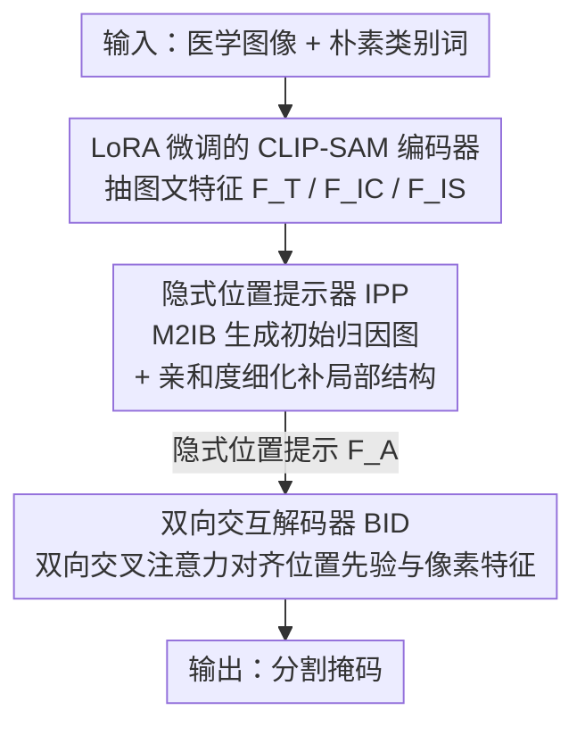

# Simple-ViLMedSAM: Simple Text Prompts Meet Vision-Language Models for Medical Image Segmentation

**会议**: CVPR 2026  
**论文**: [CVF Open Access](https://openaccess.thecvf.com/content/CVPR2026/html/Qian_Simple-ViLMedSAM_Simple_Text_Prompts_Meet_Vision-Language_Models_for_Medical_Image_CVPR_2026_paper.html)  
**代码**: https://github.com/qcc001/Simple-ViLMedSAM  
**领域**: 医学图像  
**关键词**: 医学图像分割, CLIP-SAM, 文本提示, 信息瓶颈, 零样本/少样本

## 一句话总结
Simple-ViLMedSAM 用一个「隐式位置提示器（IPP）+ 双向交互解码器（BID）」把 CLIP 和 SAM 串起来，让用户只输入「polyp」「lung」这类**最朴素的类别词**就能驱动医学图像分割——不再需要专家点框，也不需要堆砌的临床描述，在四个公开数据集的零样本/少样本任务上全面超过现有 SAM 系方法。

## 研究背景与动机

**领域现状**：医学图像分割长期受困于标注稀缺、标注昂贵、跨模态异质性强。SAM 这类视觉基础模型带来了希望，但把 SAM 用到医学图像上时，主流做法要么依赖专家手工给的几何提示（点 / 框），要么走 CLIP-SAM 两阶段或文本驱动路线。

**现有痛点**：三类已有路线各有硬伤。① 自提示类（UN-SAM、Self-Prompt-SAM）省掉了人工点框，但缺乏医学语义，定位经常失准；② 两阶段类（SaLIP 先生成 class-agnostic 掩码再用 CLIP 分类）计算冗余，且分阶段丢上下文造成 domain gap；③ 文本驱动类（MedCLIP-SAM v2）虽然引入 CLIP 的图文对齐，但**严重依赖语义丰富的复杂临床描述**，提示稍有偏差性能就垮，鲁棒性差。

**核心矛盾**：现有 CLIP-SAM 方法把「文本 → 显式几何提示（点/框）」当成桥梁，于是性能被锁死在提示的精度上——文本越简单、信息越稀疏，生成的几何提示越不准。表 3 实测验证了这点：SaLIP、MedCLIP-SAM v2 从简单词换成复杂描述，Dice 能涨 4.85~10.86。换句话说，这些方法**逼着用户写复杂提示**。

**本文目标**：在只给「类别名」这种极简文本的条件下，仍然拿到高精度分割，且零样本/少样本都成立。

**切入角度**：作者认为不该把 CLIP 的输出硬转成显式几何提示，而应该让 CLIP 直接产出一张**隐式的位置归因图（attribution map）**，把「这块区域大概是目标」的软先验交给 SAM，再让两者像素级互相纠偏。CLIP 强在全局语义定位、SAM 强在像素级细节，让它们各司其职、双向对齐。

**核心 idea**：用 CLIP 生成的「隐式位置归因图」代替显式几何提示，再用双向交叉注意力把这份位置先验和 SAM 的像素特征融合，从而摆脱对复杂提示的依赖。

## 方法详解

### 整体框架
Simple-ViLMedSAM 是一个 CLIP-SAM 一体化框架，输入是「一张医学图像 + 一个朴素类别词」，输出是该类别的分割掩码。整条管线分三段：先用 **CLIP 编码器 + LoRA 微调的 SAM 编码器**分别抽出图文特征；再送进 **隐式位置提示器 IPP**——它先用多模态信息瓶颈 M2IB 把 CLIP 特征压成一张初始位置归因图，再用基于亲和度的细化策略借 SAM 特征补回局部结构，最终产出隐式位置提示 $F_A$；最后 **双向交互解码器 BID** 用双向交叉注意力让这份位置先验和 SAM 像素特征互相对齐纠偏，上采样解码出掩码。训练用 CE + Dice 联合损失端到端优化。

### 关键设计

**1. LoRA 微调的 CLIP-SAM 双编码器：用朴素类别词换掉点框与临床长描述**

这一设计直接对准「依赖专家提示」的痛点。框架用 CLIP 文本编码器把类别词编成 $F_T=\Psi_{text}(T)$、CLIP 图像编码器抽出 $F_{IC}=\Psi_{img}(I)$，二者投影到共享语义空间，于是仅凭一个类别词就能拿到「图中和该词对应的粗略位置」。同时用 SAM 图像编码器抽像素级特征 $F_{IS}=\Phi_{img}(I)$，并仿照 SAMed 给 SAM 编码器挂上一条由两个低秩矩阵组成的 **LoRA 旁路**做高效微调，让 SAM 适配医学图像分布而不必全参训练（全模型只有 3.9M 可训参数，比 H-SAM 的 18.4M 小一个量级）。消融里 LoRA 几乎对每个配置都带来稳定增益（如 IPP 单独从 52.74→56.98 Dice），说明医学域适配这一步不可省。这一编码段决定了后文「简单文本即可」的前提：CLIP 给语义定位、SAM 给细节，分工明确。

**2. 隐式位置提示器 IPP：M2IB 压出位置图 + 亲和度细化补结构**

IPP 是全文核心，要解决的痛点是——简单类别词信息太稀疏，CLIP 直接给的定位又糊又只为分类设计，不适合像素级分割。IPP 分两步治。第一步 **多模态信息瓶颈 M2IB**：标准 CLIP 嵌入为分类而生，IPP 借信息瓶颈原理只保留与文本最相关的区域、压掉无关背景，优化目标为

$$\max\big[\,\mathrm{MI}(Z_{IC}, F_T;\theta) - \beta\,\mathrm{MI}(Z_{IC}, I;\theta)\,\big]$$

前一项让压缩表示 $Z_{IC}$ 抓住与文本对齐的语义线索、后一项压冗余防过拟合；压缩表示按

$$Z_{IC} = h_{IC}(I;\alpha)\odot F^{\ell}_{IC} + \sigma\big(1-h_{IC}(I;\alpha)\big)\odot\varepsilon$$

得到，其中 $h_{IC}(I;\alpha)$ 就是学到的**归因图**，每个位置的值表示「属于目标区域的概率」，$\varepsilon\sim\mathcal{N}(0,I)$ 为高斯噪声。这样产出一张初始归因图 $A_{init}$。第二步 **亲和度细化（Affinity-based Refinement）**：初始图仍缺细节，于是借 SAM 特征的局部结构感知来补。先用 SAM 特征算逐像素自相似矩阵 $S=\frac{F_{IS}}{\lVert F_{IS}\rVert}\big(\frac{F_{IS}}{\lVert F_{IS}\rVert}\big)^{T}$，再用阈值 $\epsilon$ 把低置信位置屏蔽掉得到亲和矩阵

$$C=\mathrm{Softmax}(S+M),\quad M_{ij}=\begin{cases}0,& S_{ij}\ge\epsilon\\ -\infty,& S_{ij}<\epsilon\end{cases}$$

把 $C$ 当注意力权重，从初始图传播激活、得到细化图 $A_f$。初始图与细化图拼接归一化后过一个轻量卷积投影网络，融成隐式位置提示 $F_A$。这套设计的巧处在于：M2IB 负责「语义对得准」、亲和度细化负责「结构补得回」，二者互补地把一个简单词撑成一张可用的像素级软先验；图 5 显示其响应比 ProxyCLIP 更聚焦目标、且能压掉 X 光肺部之外的误激活。

**3. 双向交互解码器 BID：让位置先验与像素特征互相纠偏，而非单向喂入**

BID 针对的痛点是——光有位置先验还不够，先验（全局语义）和 SAM 像素特征（局部细节）若只单向融合，容易一方主导、丢另一方信息。BID 用**两层双向交叉注意力**让二者互为 query。第一层让 SAM 像素特征 $F_{IS}$ 去查位置先验 $F_A$，把语义先验对齐到视觉嵌入：$Q_1=\mathrm{LN}(\mathrm{CrossAttn}(F_{IS},F_A,F_A)+F_{IS})$，再经残差与 MLP 增强得 $M=\mathrm{LN}(\mathrm{MLP}(Q_1+F_A))$。第二层反过来，让位置先验 $F_A$ 当 query、像素特征 $F_{IS}$ 当 key、value 取 $M+F_{IS}$：$Q_2=\mathrm{LN}(\mathrm{CrossAttn}(F_A,F_{IS},M+F_{IS})+M)$，从而把结构线索和文本语义精确对齐、抑制无关激活。最后两路 $Q_1,Q_2$ 投回空间形式、经层级上采样相加得到预测 $Y=\mathrm{Upsample}(Q_1)+\mathrm{Upsample}(Q_2)$。双向（而非单向）是关键：位置先验和像素特征互相影响、互相学习，预测在空间上更连贯、语义上更准。消融里 BID 单独（含 LoRA）就把 55.02→56.98 Dice，叠在 IPP 之上再补到 59.83。

### 损失函数 / 训练策略
端到端用交叉熵 + Dice 的加权和：$L=L_{ce}+\lambda\,L_{dice}$，$\lambda=1$（与 MedSAM 一致，已被证明在多种医学分割任务上鲁棒）。$L_{ce}=-\frac{1}{N}\sum_i(y_i\log x_i+(1-y_i)\log(1-x_i))$，$L_{dice}=1-\frac{2\sum x_iy_i}{\sum x_i^2+\sum y_i^2}$。SAM 用 ViT-H、文本侧用 BiomedCLIP；图像对 BiomedCLIP resize 到 $224\times224$、对 SAM resize 到 $1024\times1024$；AdamW 优化，零样本用 warmup、少样本用定制配置；单卡 RTX 4090。

## 实验关键数据

### 主实验
四个公开数据集横跨内镜（Kvasir-SEG 息肉）、皮肤镜（ISIC 皮损）、胸部 X 光（COVID-QU-Ex 肺）、CT（肺/心/气管）。评测训练时刻意从**其他数据集**取约 800 张训练图，专门考验跨模态/跨目标泛化。指标为 Dice% 与 IoU%。

零样本任务（表 1，对手分三类：原生 SAM 几何提示 / prompt-free SAM / CLIP-SAM 文本）：

| 数据集 | 指标 | 本文 | 次优 | 提升 |
|--------|------|------|------|------|
| Kvasir-SEG | Dice / IoU | 59.83 / 50.45 | 57.78 / 47.15 (SAMAug) | +2.05 / +3.30 |
| ISIC | Dice / IoU | 79.65 / 70.67 | 76.19 / 65.68 (H-SAM) | +3.46 / +4.99 |
| Chest X-ray | Dice / IoU | 82.60 / 74.82 | 80.44 / 69.77 (H-SAM) | +2.16 / +5.05 |
| Chest CT | Dice / IoU | 93.62 / 89.25 | 86.27 / 78.45 (H-SAM) | +7.35 / +10.80 |

本文只用 3.9M 可训参数、且仅用类别名提示，却在四个集上全面领先；CT 上 Dice/IoU 比次优高 7.35/10.8。

少样本任务（表 2，对手含 UNet 系 UniverSeg 与三个 SAM 系）：本文同样四集全胜，Kvasir-SEG 75.48 Dice（次优 Self-Prompt-SAM 62.10）、ISIC 85.08 Dice、Chest X-ray 90.34、Chest CT 94.13，Kvasir/ISIC 大幅领先。

### 消融实验
在 Kvasir-SEG 上拆 LoRA / IPP / BID 三件套（Dice% / IoU%）：

| LoRA | IPP | BID | Dice% | IoU% | 说明 |
|------|-----|-----|-------|------|------|
| ✗ | ✗ | ✗ | 46.69 | 37.51 | baseline |
| ✗ | ✓ | ✗ | 52.74 | 41.17 | 加 IPP |
| ✗ | ✓ | ✓ | 54.47 | 43.10 | IPP+BID（无 LoRA） |
| ✓ | ✗ | ✗ | 55.02 | 44.43 | 仅 LoRA |
| ✓ | ✗ | ✓ | 56.98 | 46.52 | LoRA+BID |
| ✓ | ✓ | ✗ | 59.02 | 49.73 | LoRA+IPP |
| ✓ | ✓ | ✓ | **59.83** | **50.45** | 完整模型 |

### 关键发现
- **三件套各有正贡献、叠加最优**：从 46.69 baseline 一路加到 59.83 Dice。IPP 贡献最实（无 LoRA 时单独 +6.05 Dice），BID 在其上继续补，LoRA 给每个配置稳定加码。
- **简单提示 vs 复杂提示（表 3，本文最大卖点）**：SaLIP、MedCLIP-SAM v2 从简单词换成 MedGemma 生成的复杂临床描述，平均 Dice 涨 4.85 / 10.86；而本文简单与复杂提示几乎打平（仅 +0.71 Dice / +0.78 IoU）。这说明本文**不靠复杂提示也能打满**，真正摆脱了对提示工程的依赖。
- **细化优于 ProxyCLIP**：图 5 显示亲和度细化对息肉/黑色素瘤/肺区的响应比 ProxyCLIP 更聚焦，X 光上还能压掉肺下区域的误激活。

## 亮点与洞察
- **「隐式位置图」替「显式几何提示」是真正的解耦点**：以往 CLIP-SAM 把文本硬转成点/框，精度被提示卡死；改成软的归因图后，简单词的信息稀疏问题被 M2IB + 亲和度细化补上，提示工程的天花板被拆掉——这是本文最值得迁移的思路。
- **信息瓶颈用对了地方**：M2IB 把「只保留与文本相关、压掉无关背景」形式化为互信息目标，刚好对治「CLIP 嵌入为分类而生、不适合像素级」的根本错配，比经验式 CAM 更有原则。
- **双向注意力而非单向融合**：让位置先验和像素特征互为 query 双向纠偏，避免一方主导，这个对称设计可迁移到任何「全局语义先验 + 局部细节特征」需要融合的分割/检测任务。
- 全模型仅 3.9M 可训参数却超过 18.4M 的 H-SAM，参数效率上很有说服力。

## 局限与展望
- 作者明确：当前只做 **2D 单目标、已知类别标签**的分割，未在 3D 体数据、多目标、开放词表（语义模糊的临床描述）、以及器官重叠/弱边界等复杂场景上验证。
- 自己看：评测虽跨模态，但只 4 个数据集、每集训练仅约 800 张，泛化结论的统计稳健性有限；亲和度细化的阈值 $\epsilon$、M2IB 的 $\beta/\sigma/\ell$ 等超参敏感性正文未展开（推到附录），实际部署需调参。
- 改进方向：把隐式位置图机制扩到 3D（沿层传播亲和度）、支持开放词表与多目标查询、对弱边界引入边界感知损失。

## 相关工作与启发
- **vs prompt-free SAM（UN-SAM / Self-Prompt-SAM / H-SAM）**：它们靠自提示去掉人工点框，但无医学语义、定位易错；本文用 CLIP 注入文本语义，零样本四集全面领先 H-SAM。
- **vs 两阶段 CLIP-SAM（SaLIP）**：SaLIP 先生成 class-agnostic 掩码再 CLIP 分类，计算冗余且丢上下文；本文一体化端到端、用归因图直接给软先验，避开 domain gap。
- **vs 文本驱动 CLIP-SAM（MedCLIP-SAM v2）**：二者都引 CLIP，但 MedCLIP-SAM v2 依赖复杂临床描述、对提示精度敏感（换复杂提示 Dice +10.86）；本文用隐式位置图，简单词即可打满（仅 +0.71），鲁棒性是核心区别。
- **vs ProxyCLIP**：ProxyCLIP 在图像编码阶段用 VFM 代理注意力注入空间一致性；本文是在已含语义先验的 CLIP 归因图上做结构细化，图 5 显示响应更聚焦、误激活更少。

## 评分
- 新颖性: ⭐⭐⭐⭐ 「隐式位置图替显式几何提示 + 双向解码器」是对 CLIP-SAM 范式的实质改进，简单提示打满的卖点扎实。
- 实验充分度: ⭐⭐⭐⭐ 四模态零/少样本 + 三件套消融 + 提示类型分析齐全，但数据集偏少、超参敏感性推到附录。
- 写作质量: ⭐⭐⭐⭐ 动机—痛点—设计链路清晰，公式与图示完整。
- 价值: ⭐⭐⭐⭐ 极简提示 + 3.9M 参数即可超 SOTA，对标注稀缺、临床落地友好，思路可迁移。

<!-- RELATED:START -->

## 相关论文

- [\[CVPR 2026\] IVAAN: Instance-level Vision-Language Alignment via Attribute-Guided Text Prompts Generation for Nuclei Analysis](ivaan_instance-level_vision-language_alignment_via_attribute-guided_text_prompts.md)
- [\[CVPR 2026\] Delving Aleatoric Uncertainty in Medical Image Segmentation via Vision Foundation Models](delving_aleatoric_uncertainty_in_medical_image_segmentation_via_vision_foundatio.md)
- [\[CVPR 2026\] MedCLIPSeg: Probabilistic Vision-Language Adaptation for Data-Efficient and Generalizable Medical Image Segmentation](medclipseg_probabilistic_vision-language_adaptation_for_data-efficient_and_gener.md)
- [\[CVPR 2026\] VoxTell: Free-Text Promptable Universal 3D Medical Image Segmentation](voxtell_free-text_promptable_universal_3d_medical_image_segmentation.md)
- [\[CVPR 2026\] From Infusion to Assimilation Distillation for Medical Image Segmentation](from_infusion_to_assimilation_distillation_for_medical_image_segmentation.md)

<!-- RELATED:END -->
